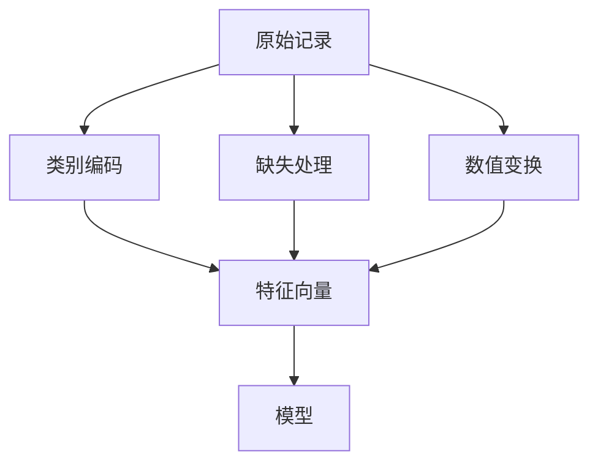

# 特征工程

一句话:特征工程是把**一条原始记录翻译成模型能吃的向量**的那一步——它决定了模型「能看见什么」,而看不见的东西,再大的模型也学不出来。

## 一、它在链路的哪个位置

上游是数据工程:语料和样本怎么采、怎么洗、怎么去重去污染、怎么配比,那条线的产出是**一条条干净的记录**(见 数据工程 篇)。特征工程接手之后只做一件事:把每条记录的字段变成一串数,让模型能算。下游是模型结构,它负责怎么组合这些数。



它值多少钱有个可引用的数字:Facebook 在 ADKDD 2014 的广告 CTR 论文里,把 GBDT 的叶子编号当作特征喂给逻辑回归,相对归一化熵(NE)比不做这个变换降了 **3.4% 以上**,论文称这在他们的口径下是非常显著的提升。

**大模型时代还需要特征工程吗?** 判据不是「是不是大模型」,而是**输入是不是自然语言**。文本进 tokenizer、由 embedding 自己学表示,那一侧的手工特征确实退化成了数据治理;但只要输入还是表格、ID、时间戳和统计量(推荐、广告、风控、量化),编码方式仍然直接决定显存占用、线上延迟和长尾泛化。LLM 用 token embedding,不代表推荐里的用户 ID、时间截断和历史统计特征就不用精心设计了。

**本篇边界**:CTR 模型结构本身(LR/FM/Wide&Deep/DeepFM/DCN/DIN/AutoInt 怎么建模特征交互)见 推荐模型 篇;表示学习的训练目标见 对比学习 篇;过拟合诊断、L1/L2、dropout 见 泛化与正则化 篇;网络内部的归一化层见 Norm位置 篇;优化器与学习率见 优化器 篇。本篇只管**特征怎么造**,不管模型怎么吃。

## 二、类别特征:五种编码怎么选

| 编码 | 怎么做 | 输出维度 | 用标签吗 | 高基数下 | 主要代价 |
|---|---|---|---|---|---|
| 独热 One-Hot | 每个类别一个坐标 | = 类别数 | 否 | 维度爆炸 | 每列样本太少,系数是噪声 |
| 序数 Ordinal | 类别映射成 0,1,2… | 1 | 否 | 能扛 | **编造了不存在的大小关系** |
| 目标编码 Target | 换成该类的标签统计量 | 1 | **是** | 很合适 | 标签泄漏;压掉类内分布 |
| 哈希 Hashing | 哈希到固定 $m$ 维 | 固定 | 否 | 能扛 | 冲突把无关类别混权重 |
| Embedding | 学一个 $d$ 维稠密向量 | $d$ | 随任务训 | 很合适 | 表大、尾部 ID 训不动 |

**独热**的优点是语义干净:每个类别一个独立坐标,任意两类等距,不引入任何虚构关系。它的失效点在高基数——百万级用户 ID 展开成百万列,稀疏存储扛得住内存,但**扛不住统计**:每个类别只摊到几十条样本,那一列的权重基本是噪声,而且线上第一次见到的新 ID 只能编成全零。

**序数编码**是最容易被低估的坑。把「北京=1、上海=2、广州=3」喂给线性模型,模型会认为广州是北京的三倍;喂给 KNN,模型会认为北京离上海比离广州近。这些关系是编号顺序随手编出来的,数据里根本不存在。只有**真有序**的类别(学历、星级、尺码 S<M<L)才该用它。树模型受害小一些——它可以靠多次阈值分裂把任意子集切出来,但需要更多分裂次数;所以 LightGBM、CatBoost 干脆提供原生的类别分裂。

**目标编码**用类别的标签统计量替换类别本身(回归取组内均值,二分类取正例率),一列换一列,维度不随类别数增长,信息密度最高。它有两条代价:一是**把一个分布压成一个数**,均值相同、方差差很远的两个类别会被合并成同一个值;二是**它用了标签**,泄漏风险见第三节。小样本类别的均值抖得厉害,所以要向全局先验收缩:

$$
TE(c)=\frac{n_c\,\bar y_c+\alpha\mu}{n_c+\alpha}
$$

这就是一个加权平均:类别 $c$ 自己的均值 $\bar y_c$ 权重是它的样本数 $n_c$,全局均值 $\mu$ 权重是 $\alpha$。大类几乎不受影响,只出现两三次的小类被拽回全局均值。$\alpha$ 的含义很直白——**我要看到多少条样本,才愿意相信这个类别自己的统计**。自适应的做法有两种:用经验贝叶斯按类内方差与类间方差之比估 $\alpha$(scikit-learn 的 `TargetEncoder(smooth="auto")` 走的就是这一档),或者把 $\alpha$ 当超参在训练集内部的验证折上搜。多分类就对每个类别输出一个平滑后的概率向量。

**哈希编码**把类别名直接哈希到固定 $m$ 维,冲突就撞在一起。好处是维度提前定死、不用维护类别字典、新类别自动有位置,对在线学习很友好。理论上冲突不可怕:Weinberger 等人证明带符号哈希下内积的偏差有指数尾界,随机子空间之间的干扰以高概率可忽略。但**这不等于可以随便压**:Google 广告系统实测下不到几十亿维就有可观测的损失,他们最后宁可保留可解释的非哈希特征。哈希是拿可解释性和一点精度换固定内存,不是免费午餐。

**Embedding 编码**给每个类别学一个稠密向量,和模型一起训。它比独热多出来的能力是**表达类别之间的远近**——独热天生认为任意两类等距,embedding 可以把「羽绒服」和「棉服」放得很近。Entity Embeddings 那篇的结论是:在高基数、数据稀疏的场景下它比独热更不容易过拟合,而且把训好的向量抽出来当特征喂给别的模型也能涨点。代价是每个 ID 都要有足够样本才训得动,以及一张随类别数线性增长的表——这是推荐模型显存的大头。

**长尾分布时选目标编码还是 Embedding?** 没有普适答案,取决于**尾部类别还能不能借到别的信号**。目标编码对尾部只能靠平滑拉回先验,结果是尾部长得都一样;Embedding 可以通过共享属性(类目、品牌、地域)、哈希桶、或内容侧的预训练表示让尾部借到邻居的信息,但前提是你真的建了这些共享通道,否则一个只出现三次的 ID,它的向量同样是噪声。实务里两者常并用:目标统计当额外的稠密特征,和 ID embedding 一起进模型,谁也不预设必胜。

## 三、目标编码最大的坑:标签泄漏

如果直接拿全量训练集算每个类别的均值,**每条样本自己的标签就躺在它自己的编码里**。极端情形一眼看穿:某个 ID 在训练集里只出现一次,它的类别均值就等于它的标签——这一列直接把答案抄给了模型。训练 loss 掉得非常好看,线上一塌糊涂,因为线上那条请求的编码里没有答案。

三种防法都在守同一条规矩——**编码一条样本时不许看它自己的标签**:

- **K 折折外**:训练集切 K 折,编码第 $k$ 折时只用其余折的标签估映射,拼起来得到全部训练行的折外编码。
- **留一**:编码某条样本时把它自己从统计里剔掉,相当于 $K=N$。
- **有序统计**:按随机排列,只用排在它前面的同类样本(CatBoost 的做法)。

**平滑和加噪都代替不了折外**——平滑只是把估计拉向先验,自己的标签仍然在分子里。

```python
from sklearn.model_selection import KFold
import numpy as np

def oof_target_encode(cat, y, n_splits=5, alpha=20.0):
    prior = y.mean()                        # 全局先验,未见类别回退到它
    oof = np.full(len(cat), prior)
    for tr, va in KFold(n_splits, shuffle=True, random_state=0).split(cat):
        stats = {}                          # 只用训练折的标签估映射
        for c in np.unique(cat[tr]):
            m = cat[tr] == c
            n, mean = m.sum(), y[tr][m].mean()
            stats[c] = (n * mean + alpha * prior) / (n + alpha)   # 平滑
        oof[va] = [stats.get(c, prior) for c in cat[va]]          # 编码留出折
    full = {}                               # 线上/测试:用完整训练集重新拟合
    for c in np.unique(cat):
        m = cat == c
        n, mean = m.sum(), y[m].mean()
        full[c] = (n * mean + alpha * prior) / (n + alpha)
    return oof, full, prior
```

注意它返回三样东西:训练行用 `oof`,验证、测试和线上一律用 `full`,没见过的类别回退 `prior`。**两套口径必须同时存在**——训练用折外是为了不泄漏,线上用全量是为了不浪费数据;只实现一套的代码要么泄漏,要么把统计量做废。反过来,拿测试集的标签去补统计是彻底的作弊。

折的划分要跟着业务走:时间序列数据按时间切,只用过去的数据编码未来;同一个用户的多条记录要整组放进同一折,否则「折外」只是名义上的——同一用户的另一条记录带着高度相关的标签,答案照样漏过去。

## 四、缺失值:填成众数等于把「不知道」说成「最常见」

众数填充的机制很具体:原本属于类别 A 的样本,和一批来源完全不同的缺失样本,被编成了同一个 A。后果按模型分——线性模型里 A 的系数变成两群人的加权折中;embedding 里 A 的向量吃到两群人混合的梯度;树里 A 这个取值上的分裂统计被稀释,切点可能整个挪位。

是不是**必然**有偏?不是。它取决于缺失比例、缺失机制,以及缺失样本的目标分布是否恰好与众数类接近。所以准确的说法是:填充引入了一个**你没有验证过的假设**,同时**抹掉了「是否缺失」这条信息**、抬高了众数类的频率。无序类别也没有天然的数值方差可言,别用「增大方差」去解释这件事。

缺失机制分三种,不能把后两种统称「非随机」:

- **MCAR**:缺不缺跟任何东西都无关(设备随机丢包)。
- **MAR**:给定已观测的其它字段后,缺失就不再依赖缺失值本身(年轻用户更少填收入,但同龄段内填不填与收入无关)。这一档条件填补是有效的。
- **MNAR**:控制住所有观测字段之后,缺不缺仍取决于那个没观测到的值(高收入的人不愿填收入)。**这一档任何填补都补不回来**,只能靠额外的采集设计或显式假设。

| 策略 | 机制上做对了什么 | 边界 |
|---|---|---|
| 缺失单独成一类 | 保留「未知」这个身份,不与任何真实类别混淆 | 类别数 +1;缺失极少时这一类统计不稳 |
| 填一个值 + 加缺失指示位 | 填值维持特征可用,指示位把「是否缺失」还给模型 | 指示位学到的是采集流程,流程一改就漂移 |
| 按其它字段条件填补 | 用相关字段推断,而不是全体同填一个值(KNN 插补、多重插补这类) | 靠假设吃饭,填出来是估计不是真值,要保留不确定性并验证 |
| 交给模型原生处理 | 树可以为缺失样本学一个固定走向(LightGBM 默认开启缺失处理) | 这不是「还原」缺失,也消不掉 MNAR 的偏 |

**缺失本身可能就是信号。**「未填收入」众数填充之后就彻底消失了,至少要留一个缺失指示位。但解释要克制:未填可能意味着低收入,也可能只是那一版表单没这个字段、或者某个渠道的埋点坏了。**指示位是让模型自己去学这个信号,不是让你替它下「未填=低收入」的结论**;上线前按渠道和时间分桶看缺失率稳不稳,不稳就说明它记的是流程而不是人群。

验收纪律与目标编码同源:**填补器和统计量只在训练折上拟合**,然后套用到验证、测试和线上;评估时按缺失率分桶看、做时间留出、跑「有指示位 / 无指示位」的消融。也别只凭「我用的是树模型」就断言不敏感——原生缺失分支解决的是「能不能训」,不是「缺失机制会不会带偏」。

**文本字段的「缺失」是另一回事。** 结构化字段缺失是一个格子没有值,目标是让模型知道「这里未知」;SFT 语料里的缺失要先分清是哪一种——空字符串、占位符(`N/A`、`null`、`-`)、「未提供」还是「不适用」,语义各不相同,不能一律当空串。两条纪律:**必要输入缺失的样本要么过滤,要么改写成合法的缺省表达**;**目标答案缺失的样本不能当成「空答案」训练**,那等于教模型遇到不会的就沉默。更不能拿「最常见的回答」去填文本缺失,那是文本版的众数填充,模型会学成一句万能敷衍。语料侧的清洗流程见 数据工程 篇。

## 五、数值特征:为什么要缩放,方法怎么选

### 两个理由,和一类不受影响的模型

**优化侧**:带平方项的目标下,不同量纲让 Hessian 的特征值差出几个数量级,损失面从「碗」变成「狭长的山谷」。梯度方向几乎垂直于谷底走向,于是在陡的那一维来回震荡、在平的那一维几乎不动,而学习率只能按最陡的那一维来设,整体就慢。缩放把各维尺度拉平,条件数下降、等高线更接近圆,一个学习率对所有维度都合适。两条边界要记住:缩放**改善条件数但消不掉共线性**(两列高度相关时谷底方向仍然是斜的);Adam 这类逐参数自适应步长的优化器对量纲差异没那么敏感(优化器本身见 优化器 篇)。

**距离侧**:KNN、K-means、RBF 核以及任何用欧氏距离或内积算相似度的东西,**量纲大的特征直接主导距离**。年龄 0–100 和月收入 0–100000 放在一起,两个人的距离几乎完全由收入决定,年龄那一维的差异被淹没在小数点后面。缩放的本质是**显式决定每一维在距离里占多少权重**;不缩放并不是「没有加权」,只是权重被单位制随手定了。同理,L1/L2 正则按系数大小惩罚,量纲不齐会让惩罚在特征之间分配得毫无道理(正则本身见 泛化与正则化 篇)。

**哪些模型不缩放也没事**:按单特征阈值分裂的树(决策树、随机森林、GBDT)对**严格单调的变换**不敏感——把 $x$ 换成 $2x$ 或 $\log x$,样本排序不变,可选切点集合等价,树长得一样。但这是「通常」而不是「一定」:直方图近似分桶的实现会因为桶边界和数值精度给出略有出入的结果。所以准确的说法是**树模型不必缩放**,不是缩放绝对没有影响。

> 🖼️ 占位:同一份二维数据缩放前后的损失面等高线对比(狭长椭圆 vs 接近圆形),各自叠加一条梯度下降轨迹

### 五种方法的定义与选型

$$
x' = \frac{x-\mu}{\sigma}, \qquad x'' = \frac{x-x_{\min}}{x_{\max}-x_{\min}}
$$

左边是标准化(Z-score):减均值再除标准差,结果均值 0、标准差 1,**它既不要求也不会让数据变成正态分布**,只是把中心和尺度对齐;右边是最小最大归一化,把训练集里的最小值压到 0、最大值压到 1。式子里的 $\mu,\sigma,x_{\min},x_{\max}$ **一律只从训练集统计**,验证、测试、线上直接套用同一组数——各自重新拟合就等于把测试集的分布信息漏进了预处理。

| 方法 | 做什么 | 适合 | 代价 |
|---|---|---|---|
| 标准化 Z-score | 减均值除标准差 | 默认选项,尤其在意「偏离均值多少」时 | 均值方差本身会被异常值拉走 |
| 最小最大 Min-Max | 线性压到 $[0,1]$ | 需要有界输入的场景 | 极值敏感;线上超出训练范围会跑出 $[0,1]$ |
| RobustScaler | 减中位数除四分位距 | 有少量极端值,但尾部是真数据 | 抗的是统计量被污染,**不保证极值本身变小** |
| MaxAbs | 除以最大绝对值,不中心化 | **稀疏矩阵**,不中心化才能保住零 | 只盯着最大绝对值那一个点 |
| 分位数 / 幂变换 | 按经验分位数映射到均匀或正态;Box-Cox、Yeo-Johnson 压偏态 | 重尾、强偏态,需要压平长尾差异 | 非线性、可解释性变差,训练范围外要外推 |

三个必答的边界:**常数列**分母为零,要约定输出 0 或直接删列,不能让 NaN 传下去;**稀疏矩阵不能减均值**,一减所有的 0 都变成非零,稀疏结构没了内存直接爆,所以用 MaxAbs 或关掉中心化的标准化;**线上出现训练范围外的值**时 Min-Max 会给出大于 1 的数、标准化会给出很大的 z 值,要么按训练分位数截断、要么监控范围漂移,但截断会丢掉尾部差异——风控里「金额特别大」往往正是要抓的那一类。

**有极端异常值时选哪个?** 先分清是**数据错误**还是**真实长尾**。录入错误(年龄 999、金额为负)直接修或删,轮不到缩放来擦屁股;真实长尾就比较 RobustScaler、`log1p` 这类对数变换(专治右偏的正值)和按训练分位数截断三条路,按留出集的实际成绩选,而不是按「哪个名字听起来更稳健」。

### 分箱与非线性变换

分箱把连续值切成区间当类别用。它买到两样东西:让线性模型表达**非单调**关系(年龄和点击率常常是驼峰形,一个线性项拟合不了),以及对异常值天然稳健。代价是**箱内差异被抹平、箱边界处有跳变**,而且分箱不可逆。等宽箱在偏态数据上会把绝大多数样本塞进一两个箱,所以等频箱更常用。要注意收益是分模型的:GBDT 每次分裂本来就在自动选切点,给它手工分箱通常没什么赚头;给 LR 分箱则常常是关键一步。

**别和 LayerNorm 混为一谈**:特征缩放沿**训练集的样本方向、对每一个特征列**统计一组 $\mu,\sigma$,在数据进模型之前做一次,统计量固定并随模型上线;LayerNorm 对**单个样本或单个 token 的隐藏维度**算均值方差,在网络内部逐层做,统计量每次前向重新算。两者只有「减均值除标准差」这个算式相同,作用位置、统计轴、是否可学都不同,**互相替代不了**——LayerNorm 挡不住你把两列量纲差一万倍的输入直接喂进去。归一化层本身的机制与位置见 Norm位置 篇。

**量纲有业务含义,缩放会丢信息吗?** 已知参数、尺度非零的仿射变换是可逆的,信息不丢——金额从「元」变成标准化数,乘回 $\sigma$ 再加 $\mu$ 就回来了,所以变换参数和反变换必须保存下来供解释与监控。真正丢信息的是**截断、舍入、分箱**这类不可逆操作。但「不丢信息」不等于「没有影响」:缩放改变了各维在距离里的相对权重、改变了正则对各系数的惩罚力度,也改变了系数的解释单位(变成「每一个标准差」)。业务上错一元和错一万元代价不同,这件事该在损失函数或样本权重里表达,别指望缩放替你表达。

## 六、特征交叉:为什么要造,代价是什么

线性模型只会把各维加起来,它表达不了「**周五晚上 × 外卖类目**」这种只有组合起来才成立的规律:单看周五不显眼、单看外卖也不显眼,凑一起点击率翻倍。交叉就是显式造出一列 `周五_外卖`,让线性模型也能给这个组合单独一个权重。

手工交叉的代价有三条:**维度是乘出来的**——两个各 1000 类的字段全交叉就是 $10^6$ 列,再叠一个直接上亿,而绝大多数组合在训练集里出现零次或一次,学出来的权重全是噪声,所以必须配频次门槛(出现少于 N 次的组合并入「其它」)或哈希降维;**靠人猜**——哪些组合有用要靠业务直觉加实验试,换个场景就得重来;**只能到二阶三阶**,再高就没法枚举了。

正因如此,后来的方向是让模型自己学交叉(FM 用向量内积把参数量从组合数降到类别数乘维度,再往后是 Wide&Deep、DeepFM、DCN、AutoInt 各显神通)——这些结构见 推荐模型 篇。但「模型能自动学交叉」不等于「不需要特征工程」:前面提到的 Facebook 做法恰恰是先用 GBDT 把原始特征转成叶子编号(等价于自动做了一批有监督的分箱与交叉),再喂给 LR,相对 NE 就降了 3.4% 以上。

## 七、CTR 特征设计

CTR 特征要回答的是「**谁、在什么条件下、看到了什么**」,所以按用户、物品、上下文三类组织,再加一类刻画「配不配」的匹配特征。铁律先说在前面:**每条特征在预测那一刻必须真的取得到,历史统计只能用请求发生之前的数据**。

| 类别 | 例子 | 提供什么信号 |
|---|---|---|
| 用户 | 最近点击与购买的类目、活跃频次与时段、长短期兴趣表示、价格敏感度 | 当前兴趣是什么、稳不稳定、消费习惯 |
| 物品 | ID、类目与品牌、标题图片的内容表示、价格、上架时长、平滑后的历史 CTR | 身份、内容、价值、新鲜度 |
| 上下文 | 请求时段与星期、入口页面与位置、设备型号与系统版本、网络类型 | 这次访问的目的和条件 |
| 匹配 | 用户价格偏好 × 当前价格、历史类目 × 候选类目、画像与物品标签的相似度 | 这个人和这个东西配不配 |

**行为序列**值得单独说:把用户最近 N 次行为(item、类目、时间间隔)当作序列特征喂进去,而不是压成几个统计量。区别在于统计量丢掉了顺序和多峰兴趣——一个人既买童装又买机械键盘,平均下来什么都不像;序列保留了这两簇,模型可以按当前候选去里面挑相关的那几条行为。序列特征要定长(截断或补齐)、要带上时间间隔(三天前点的和三个月前点的分量不同),并且**只能包含当前请求之前的行为**。模型侧怎么对序列做注意力见 推荐模型 篇。

**高维稀疏 ID 有三个旋钮**:

- **频次门槛 + 未知桶**:出现少于 N 次的 ID 全部映射到一个 `<unk>`。这一条最省事也最有效——Google 广告的报告里,某些模型有一半的唯一特征在几十亿条样本中只出现过一次,给它们各留一个参数纯属浪费;`<unk>` 顺便让线上第一次见到的 ID 有地方去。
- **哈希到固定维度**:不维护字典、新 ID 自动有位置,代价是冲突,量级别拍脑袋(见第二节的实测边界)。
- **共享与降维**:让 ID 的表示由它的属性(类目、品牌、店铺、内容 embedding)合成,尾部 ID 就能借到同类的信息;内容侧表示怎么预训练见 对比学习 篇。

还有一条基础纪律:**ID 是名义变量,不能当连续数直接喂**。`item_id=1001` 和 `1002` 相邻只是编号相邻,当成数值等于告诉模型这两个商品几乎一样。只有价格、时长、次数这类真正的连续量才做对数、标准化或分箱,选哪种看长尾程度和模型类型(见第五节)。

**冷启动**时能用的只剩不依赖历史的那部分。新用户:当前上下文(时段、入口、设备、地域)、注册时的显式偏好、以及总体先验回退,同时**保留缺失指示位**——要让模型知道「这个人没有历史」,而不是「这个人的历史统计是 0」。新物品:内容侧特征(标题、图片、类目、品牌、供给属性)和同类目的先验 CTR。Facebook 那篇给了直接支持:上下文特征对冷启动不可或缺,而且他们实测**只用上下文特征的模型比只用历史特征的模型更依赖数据新鲜度**,因为历史特征刻画的是长期积累的行为、本来就稳。验收上必须**单独切出新用户与新物品分片评估**:老用户占了绝大多数曝光,总体指标涨了完全可能掩盖冷启动更差。

**时效与实时性**:特征有不同的更新节奏——天级(长期画像)、小时级(近期统计)、秒级(本次会话的实时行为),越实时越贵,要实时算、实时写、还要保证线上读得到,所以加一条实时特征之前先问它能挣回多少。模型本身也要重训,Facebook 报告的量级是**从周更换成日更、归一化熵大约降 1%**,而在他们的口径下 1% 已算显著。特征数量也不是越多越好:同一篇论文里排序靠前的 10 个特征占了大约一半的重要性,最后 300 个特征加起来贡献不到 1%,**先做消融再上线**,顺手省下它们的计算与存储。

至于**具体到手机终端场景**(应用商店、浏览器、负一屏、推送),可以比较的上下文候选有:入口来源、请求时段与是否周末、机型与系统版本、网络类型(WiFi / 蜂窝)、当前页面主题、是否新装机。这些是**待验证的设计候选,不是任何厂商的内部实现**;逐项做消融,同时检查线上可用率、计算延迟、分布漂移和训练与线上口径是否一致,不能因为「有这个字段」就全加进去。

## 八、训练与线上一致性:这行最经典的事故

离线越漂亮、线上越难看,多半出在这一节。三种形态:

1. **特征穿越(时间泄漏)**:统计窗口里混进了预测时刻之后的数据。最典型的是「该物品的历史 CTR」拿整张表算,而那张表包含了当前这次曝光的点击结果——等于把答案当成了特征。防法只有一条:所有统计按事件时间截断在请求发生之前,离线拼特征时做 point-in-time join,而不是按主键 join 最新快照。目标编码的折外统计(第三节)是同一件事的类别编码版。
2. **离线与线上口径不一致**:离线用批处理算特征、线上用另一套服务代码现算,两边对默认值、时区、单位、截断规则、舍入方式稍有出入,模型吃到的就不是同一个分布。办法是让两条链路**共用同一份特征定义**,并做**线上线下对账**:抽一批线上真实请求的特征快照,与离线重算结果逐字段比对,差异率超阈值就报警。
3. **位置与展示策略偏差**:页面位置这类特征携带的是「当时的排序策略把它放在了哪」,不是用户偏好;训练时有真实位置、线上预测时没有,本身就是一种不一致。常见做法是训练时单独喂位置、线上固定成一个常数位置,或者把它当偏置项分离出来。日志里这类隐式反馈偏差怎么校准见 数据工程 篇。

上线前的检查清单:每条特征的**线上可用率**(多少请求取不到、取不到时默认值是什么)、**计算延迟**、**分布漂移监控**(训练分位数对比线上实时分位数)、**回放验证**(用线上真实请求重放离线流水线,看能否复现同一个打分)。缺任何一条,出问题时都分不清是模型的锅还是特征的锅。

## 面试考点串联

| 高频问法 | 本文哪一节 |
| --- | --- |
| 高基数类别特征,为什么有时候用目标编码而不是独热?两者各自的代价是什么? | 二 |
| 目标编码的平滑系数怎么定?有没有自适应的做法? | 二(平滑公式) |
| 目标编码最容易出的事故是什么?怎么防才算真的防住? | 三 |
| 类别是长尾分布时,目标编码和 Embedding 你选哪个,凭什么选? | 二(长尾) |
| 大模型时代传统特征工程还有价值吗?什么情况下仍然要精细编码? | 一 |
| 序数编码为什么危险?什么类别才配用它?(补充题) | 二 |
| 用众数填类别缺失值会有什么后果?机制是什么?给两个以上替代方案 | 四 |
| 缺失本身就带信息(比如没填收入),众数填充丢了什么?特征上怎么保住它? | 四(缺失信号) |
| MCAR、MAR、MNAR 分别是什么?哪一种是填补补不回来的? | 四 |
| SFT 语料里文本字段的「缺失」和结构化字段的缺失,处理上有什么区别? | 四(文本缺失) |
| 数值特征为什么要缩放?哪些模型不缩放也没事? | 五 |
| 常用的缩放方法有哪几种?数据里有极端异常值时你选哪个,为什么? | 五(方法表、异常值) |
| 特征缩放和 LayerNorm 是一回事吗?差在哪? | 五(别混) |
| 量纲本身有业务含义(比如金额),缩放会不会把信息弄丢? | 五(量纲) |
| 分箱能解决什么问题?代价是什么?给 GBDT 手工分箱值不值?(补充题) | 五(分箱) |
| 手工做特征交叉的动机是什么?它的代价是什么?(补充题) | 六 |
| CTR 预估会用到哪些特征?用户、物品、上下文各举几个例子 | 七 |
| 高维稀疏的 ID 类特征怎么处理?哈希是不是免费的? | 七(三个旋钮)、二(哈希) |
| 用户冷启动时特征几乎全缺,你靠什么预测?怎么验收? | 七(冷启动) |
| 在手机终端这类场景里,你会设计哪些特有的上下文特征? | 七(终端场景) |
| 一次请求里的特征越多越好吗?怎么决定砍掉哪些?(补充题) | 七(时效与实时性) |
| 离线指标很好、一上线就掉,特征这边你最先查什么?(补充题) | 八 |

## 相关文献

- Entity Embeddings of Categorical Variables — [arXiv:1604.06737](https://arxiv.org/abs/1604.06737)
- Feature Hashing for Large Scale Multitask Learning — [arXiv:0902.2206](https://arxiv.org/abs/0902.2206)
- CatBoost: unbiased boosting with categorical features(有序目标统计)— [arXiv:1706.09516](https://arxiv.org/abs/1706.09516)
- Practical Lessons from Predicting Clicks on Ads at Facebook(会议论文 ADKDD 2014,GBDT 叶子特征、数据新鲜度、特征重要性分布)— https://quinonero.net/Publications/predicting-clicks-facebook.pdf
- Ad Click Prediction: a View from the Trenches(会议论文 KDD 2013,稀疏特征的概率纳入与哈希实测)— https://research.google.com/pubs/archive/41159.pdf
- scikit-learn 官方文档 · 数值预处理与各类 Scaler — https://scikit-learn.org/stable/modules/preprocessing.html
- scikit-learn 官方文档 · TargetEncoder 的平滑与交叉拟合(页内引用了目标编码的原始出处 Micci-Barreca, SIGKDD Explorations 2001)— https://scikit-learn.org/stable/modules/generated/sklearn.preprocessing.TargetEncoder.html
- scikit-learn 官方文档 · 缺失值插补与 MissingIndicator — https://scikit-learn.org/stable/modules/impute.html
- LightGBM 官方文档 · 缺失值与类别特征处理 — https://lightgbm.readthedocs.io/en/latest/Advanced-Topics.html
