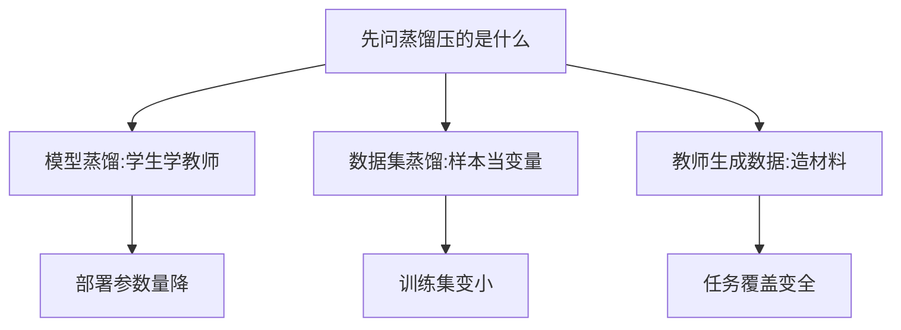

# 蒸馏

一句话:蒸馏是**让学生模型去模仿教师模型的行为,而不是只去背标准答案**——教师给出的那份完整概率分布里,除了"这是猫",还带着"它更像狗、不像卡车"这层信息,这是同一份数据里本来就有、却被 one-hot 标签抹掉的东西。本篇讲三类蒸馏各学什么、温度和 KL 方向怎么配、拿不到 logits 时还剩什么招,以及"数据蒸馏"这个词到底在指哪件事。

## 一、软标签多带了什么:动机与基本框架

三个角色:**教师** 是已经训好、通常更大的模型;**学生** 是要训出来的目标模型;**蒸馏损失** 负责把教师的行为翻译成学生能优化的目标。

硬标签只说"这张图是猫",软标签说的是"猫 0.7、狗 0.25、卡车 0.05"。多出来的那部分是**类别之间的相似结构**:模型认为猫和狗更近、和卡车更远。类比是判卷,只告诉你"这题选 B",和告诉你"B 对、C 是最像的错项、D 完全不沾边",后者显然更好学。所以蒸馏常常比在同一批数据上直接训小模型更有效,不是因为多了数据,而是因为**每个样本上的监督信号变密了**。

### 温度在做什么,为什么损失里要配 $T^2$

问题是训好的教师非常自信,上面那个"狗 0.25"在真实模型里常常是 $10^{-6}$ 量级,梯度上几乎等于没有。所以先把 logits 除以温度 $T$ 再做 softmax:

$$
p_i^{(T)}=\frac{\exp(z_i/T)}{\sum_j \exp(z_j/T)}
$$

这行的意思是:$T$ 把所有 logits 之间的差距按比例压小,$T=1$ 是原分布,$T$ 越大分布越平、越把低概率类别抬起来,$T\to\infty$ 时退化成均匀分布。**温度不是越高越好**:太高会把类别之间的区分信息一起冲淡,太低又退回成只学最大概率那一类,等于白蒸;正确做法是把 $T$ 和损失权重当一对超参在验证集上一起选。

完整的响应蒸馏损失通常是硬标签和软标签的加权:

$$
\mathcal L=(1-\lambda)\,\mathcal L_{\mathrm{CE}}(y,\ p_S)+\lambda\,T^{2}\,D_{\mathrm{KL}}\!\left(p_T^{(T)}\ \|\ p_S^{(T)}\right)
$$

这行的意思是:两个目标按 $\lambda$ 折中,一边听真实标签、一边听教师;$\lambda$ 太小软目标近乎白给,太大则真实标签失去纠偏作用。$T^2$ 是尺度补偿——softmax 里除了一次 $T$,对 logits 求导时会再带出一个 $1/T$ 因子,软目标项的梯度量级大约按 $1/T^2$ 衰减;不乘回来的话,你每调一次温度就等于顺手把软目标的学习率也改了,两个旋钮纠缠在一起没法调。Hinton 原文给的正是这个理由。顺带一个能加深理解的极限:高温、且 logits 已经零均值时,KD 的梯度近似于直接匹配师生的 logits 平方误差——**温度调的其实是"离匹配概率有多近、离匹配 logits 有多近"**。

代码上最容易写错的是下面三处:

```python
# 响应蒸馏的一步:三个常见错处都在注释里
t_logp = F.log_softmax(t_logits.detach() / T, dim=-1)  # 教师必须 detach,它不参与更新
s_logp = F.log_softmax(s_logits / T, dim=-1)           # 学生也走 log_softmax,数值更稳
# 前向 KL:第一个参数是学生的 log 概率,第二个才是教师这个目标分布,顺序反了方向就反了
kd = F.kl_div(s_logp, t_logp, log_target=True, reduction="batchmean") * (T ** 2)
ce = F.cross_entropy(s_logits, y)                      # 硬标签这一项不除温度
loss = (1 - lam) * ce + lam * kd
```

> 🖼️ 占位:同一组 logits 在 T=1、2、5 下的 softmax 柱状图,标出高温把哪些低概率类别抬了起来

### 两个必须先划清的边界

**蒸馏不要求学生更小。** 压缩只是最常见的用途,不是定义。自蒸馏(学生与教师同结构,Born Again Neural Networks 就是这一类)照样成立,收益来自软目标带来的正则效果而不是参数变少。**蒸馏和 SFT 也不是一个层面的词**:SFT 说的是"用监督样本训练"这个训练方式,蒸馏说的是"向教师学什么"这个监督来源;用教师生成的答案做 SFT 时,两者同时成立(模板、损失掩码与遗忘控制见 SFT 篇)。**响应蒸馏比这种 SFT 多出来的,正是那份软分布**——每个位置上没被选中的候选各有多可能,而 SFT 的硬标签把它们一律压成 0(第四节会说清这两者的关系)。判断该不该蒸的顺序是:已有可靠人工数据先做 SFT 基线,只有当教师能补上长尾任务、推理过程或软概率,且收益盖得过生成与核验成本时,才轮到蒸馏。

## 二、三类蒸馏:学的是教师的什么

| 方法 | 学教师的什么 | 需要教师的什么权限 | 长处与代价 |
|---|---|---|---|
| **响应蒸馏** | 最终输出分布 | 只要能取到概率(甚至只要文本) | 接入最容易、跨架构可用;信息最粗 |
| **特征蒸馏** | 中间层表示,或教师关注的空间区域 | 要能读中间层激活 | 能传细节;要设计层对应与维度对齐 |
| **关系蒸馏** | 样本之间、位置之间的距离与角度结构 | 中间层或输出表示 | 不必逐坐标复制;成对关系随批大小平方增长,常要采样 |

三者可以叠加,不是三选一。它们的排序也不是"越深越好"——多加一路特征损失就多一份权重要调,收益必须靠消融证明。

### 特征蒸馏的对齐问题

师生的特征图形状几乎不会一样,要分两步对齐:**空间尺寸**用插值或池化统一,**通道数**加一个投影层(FitNets 里那个把学生隐层映到教师维度的 regressor 就是干这个的)。真正的难点是第三步——**层与层的语义对应**:学生第 4 层未必对应教师第 8 层,深浅不匹配时你是在逼学生用浅层去拟合高层语义,做法看着对、内容不对。所以对应关系要用消融比,不能按"层数按比例映射"想当然。

注意力转移是这条路上最省事的变体:把教师某一层激活按通道求和(或求平方和),压成一张**空间强度图**,让学生学"哪里值得看"。它的好处是不用对齐通道数,只对齐空间尺寸;而且这里的"注意力"指的是特征图的空间能量分布,**不等于必须去复制 Transformer 的注意力矩阵**,两者是不同的东西。

### CV 与语言生成为什么选法不同

分类只需判断整张图是什么,输出分布本身就是很强的监督,响应蒸馏往往够用。**检测和分割不行**:检测还要出框,分割要判断每个像素,整图分类概率里根本不含定位信息,所以要同时蒸类别、定位输出和局部特征,并且**给背景位置降权**——一张图里绝大多数像素或候选框都是背景,不加权的话损失会被背景淹没,前景细节学不到。这也是 CV 蒸馏在端侧检测、分割里仍然重要的原因:那些任务对小模型的定位质量特别敏感。

语言生成的困难在另一头:**每一步都要在几万到十几万的词表上选 token,一条完整回答的组合数是指数级的**,序列层面的分布根本枚举不了。两条出路——能拿到 logits 时,在给定前缀上逐位置匹配下一 token 分布;只能拿到文本时,让教师生成整条序列再拿去训学生(第四节)。

**为什么大模型蒸馏经常只用输出监督**:输出监督不要求层与层对齐,教师和学生的结构、深度、隐藏维度可以完全不同,接入成本最低;而 LLM 上做特征蒸馏要同时满足教师权重可访问、显存装得下两个模型、层对应说得清三个条件,门槛高得多。但**不能推成"NLP 只能学输出"**:TinyBERT 就在逐层蒸嵌入、隐藏状态和注意力矩阵,其中注意力矩阵刻画的是 token 之间的关系,已经带上了关系蒸馏的味道。

## 三、白盒还是黑盒:你能拿到教师的什么

这是决定"能做哪一档蒸馏"的第一个问题,比选方法更靠前。

| 教师的可访问程度 | 能做什么 | 丢掉了什么 |
|---|---|---|
| 权重与中间层都在手上(白盒) | 响应 + 特征 + 关系;能在任意前缀上取完整分布 | —— |
| 只给输出概率,或只给 top-k logprob(灰盒) | 截断的响应蒸馏 | 尾部概率质量,目标已经不是完整的 KL |
| 只给生成文本(黑盒) | 序列级蒸馏:教师生成 + 筛选 + SFT | 所有没被选中的候选的概率信息 |

**返回文本的 API 不等于提供完整概率分布**,这是这张表最该记住的一句。灰盒的 top-k 到底糙不糙是可以实测的:学生侧拿得到完整分布,先量一量自己分布的 top-k 覆盖了多少概率质量,就知道这层近似的偏差有多大。

白盒还有两个常被忽略的前提。**词表必须能对齐**:师生 tokenizer 不同时,逐 token 位置根本对不上,同一句话被切成不同数量的片段,这时要么做词表映射或字节级重对齐(本身会引入误差),要么干脆退到序列级。**存 logits 很贵**:完整 logits 的规模是"样本数 × 序列长 × 词表",百万级样本上离线缓存不现实,常见做法是只存 top-k 加一个尾部质量,或者干脆在线重算——好在教师这次前向是纯 prefill(序列已经生成完了),没有 decode 的逐 token 依赖,可以大 batch 打满算力。

最后一条不是技术问题:**拿商业模型的输出去训练竞品模型,要先看服务条款允不允许**。

## 四、KL 的方向、序列级与 on-policy

### 前向还是反向

前向 KL 写作 $D_{\mathrm{KL}}(p_T\|p_S)$,它在教师概率高的地方重罚学生,逼学生**覆盖教师的全部支撑**;教师分布有多个峰时,学生会在峰之间摊平,生成任务上表现为说话含糊、什么都沾一点。反向 KL 写作 $D_{\mathrm{KL}}(p_S\|p_T)$,罚的是学生把概率放到教师认为不可能的地方,学生会**锁定其中一个主峰**,输出更干净但多样性下降。一句判据:"教师说得出的话学生都得会"选前向,"学生说出的话教师都得认"选反向。

所以分类和词级离线蒸馏习惯用前向(教师分布本身就窄,覆盖没什么代价);开放式生成、且学生容量明显小于教师时才考虑反向,MiniLLM 给的理由正是防止小学生把概率分配到教师分布的低概率区。**但这不等于"换个方向必然更好"**,它换的是失败模式:前向的失败是含糊,反向的失败是多样性塌缩。方向的完整推导、KL 估计器与 RLHF 里的用法见 KL散度 篇。

### 序列级蒸馏:为什么"用教师答案做 SFT"就是蒸馏

序列层面的 KL 要对指数多的候选序列求和,算不动。Kim 与 Rush 的做法是拿教师 beam search 出来的那条序列当教师分布的众数近似:

$$
\mathcal L_{\text{seq}}\approx-\log p_S(\hat y \mid x),\qquad \hat y=\arg\max_{y} p_T(y\mid x)
$$

这行的意思是:序列级蒸馏落地之后就是**在教师生成的答案上做一次普通 SFT**。这解释了一个常被问住的关系——用教师答案做 SFT 不是蒸馏的替代品,**它就是序列级蒸馏的一个特例**,只不过把整条概率分布压成了一条采样出来的序列,"第二、第三选择分别有多可能"全丢了。所以软目标的收益在**有多个说法都对**的任务上最明显(翻译、摘要、开放式生成),答案唯一的任务上收益很小。

### on-policy:让学生在自己会走到的路上被纠正

离线蒸馏不管是逐 token 还是序列级,都在**教师的轨迹**上教。学生推理时第一步一走偏,后面那些状态在训练里从没出现过,没人教它怎么把话圆回来——这就是 **exposure bias**(暴露偏差:训练喂的是标准答案前缀,推理喂的是自己写出来的前缀)。on-policy 蒸馏的做法是让学生自己采样,教师在**学生真正走到的前缀**上给反馈,GKD 走的就是这条路。

| | 轨迹来自教师(离线) | 轨迹来自学生(on-policy) |
|---|---|---|
| 监督是整条序列 | 序列级蒸馏,等于教师数据 SFT | 学生采样、教师评分筛选,即拒绝采样式训练 |
| 监督是逐 token 分布 | 词级离线蒸馏 | GKD、MiniLLM 一类 |

两个必须说清的细节。**"on-policy"说的是谁采样,和用哪个方向的 KL 是两个正交维度**,别把它们捆在一起答。**学生一更新就要重新采样**:只采一次然后反复训几个 epoch,轨迹很快就不再是当前学生会走的路,方法悄悄退化回离线蒸馏。此外,师生差距很大时先 SFT 再上 on-policy,因为差距大时学生采出的前缀落在教师的极低概率区,教师在那种上下文上本来就没被训练过,密集信号会变成密集噪声。训练流程与只有文本 API 时的降级方案见 KL散度 篇。

## 五、三个都叫"蒸馏"的东西:边界在哪

"数据蒸馏"是个歧义词,面试里先反问一句"你说的是哪种",比直接答更稳。

| 名字 | 被优化或被构造的对象 | 直接减少的是什么 | 典型做法 |
|---|---|---|---|
| **模型蒸馏** | 学生的参数 | 部署模型的参数量与单次推理计算 | Hinton KD、DistilBERT、TinyBERT |
| **教师生成数据**(工程俗称"数据侧蒸馏") | 训练材料 | 人工起草与标注的工作量 | 打伪标签、生成问答与推理过程、改写后筛选 |
| **数据集蒸馏**(Dataset Distillation) | 合成样本本身,它是优化变量 | 训练集规模与后续训练成本 | 梯度匹配、分布匹配、训练轨迹匹配 |



三条判据就能分干净。**看合成样本是不是优化变量**:教师生成的数据是采样出来的,生成完就固定;数据集蒸馏把样本当参数,用梯度、分布或轨迹匹配去反复更新它——所以"请大模型少生成几条高质量数据"不是 Dataset Distillation。**看部署时省了什么**:数据集蒸馏压的是训练用的数据,能减少存储和后续训练成本,**不会让上线的模型少一个参数**;想部署更小的模型,还得选个小学生做模型蒸馏,或者剪枝、量化。**看"匹配"匹配的是谁**:中间特征匹配约束的是模型表示,属于模型蒸馏,不因为都叫匹配就变成压缩数据集。

数据集蒸馏这条线自己也在演化:最早的双层优化要在外层改数据、内层模拟一遍模型训练,成本极高;梯度匹配、分布匹配就是在削这部分成本,轨迹匹配则改成对齐"在合成数据上走出的参数轨迹"与"在完整数据上走出的轨迹"。共同的软肋是结果依赖学习器、初始化和训练设置,换个模型不一定还成立,**不能默认它在大模型上照样管用**。

### 合成数据的可靠性:蒸馏语境下多出来的三条

- **错误是成批继承的,不是随机噪声。** 教师的一个系统性偏差会复制到成千上万条样本上,均值统计看不出来;要按来源、任务、模板分层抽检,并且盯住"是不是只剩一种文风"和"长尾有没有丢"。
- **不能让同一个教师给自己的输出打分。** 相关错误自评发现不了。要换独立核验:代码跑测试、数学核结果与关键步骤、有证据的问答验证答案确实被证据支持;多个教师意见一致只是筛选信号,不是证据。
- **验证集必须与生成种子、模板和文档隔离**,并且比较三组——纯人工数据、混入合成、只用合成。训练越来越好而真实验证越来越差,就去查错标、模板记忆和分布偏移,降低低质来源的比例并补真实样本。
- **合成条数多不等于有效信息多。** 同一个教师在同一批种子上反复生成,产出的大量同义改写会变相给某类样本加权,学生把模板背下来看着像学会了;所以要按来源和模板统计重复率,而不是只看总条数。

另外两句纪律:合成**不自动脱敏**,教师可能把输入里的个人信息复现出来;成本要把教师调用、筛选、人工核验和训练一起算,不承诺固定倍数。医疗、法律这类专业材料再多一层——结论要连到可追溯且适用的权威来源,记录版本、日期与适用范围,由领域人员抽检高风险样本,核不了的先排除,评测还要覆盖过时知识、证据冲突和信息不足,看学生会不会承认自己不确定。合成数据的构造方法、去重去污染、模型坍塌与整套验收流程见 数据工程 篇,本篇不重复。

## 六、小模型能复刻大模型的推理能力吗

**能复刻到"看起来很像",但复刻不出教师没有的东西**,这是目前最诚实的答案。

现状是这条路已经很成熟:DeepSeek-R1 开源了六个从 R1 蒸馏出来的稠密模型(1.5B、7B、8B、14B、32B、70B,基于 Qwen 与 Llama),做法就是拿 R1 生成的长推理轨迹做 SFT,即第四节那种序列级蒸馏。更有说服力的是同一篇论文表 6 的对照:同一个 Qwen-32B 基座,直接跑大规模 RL 得到的 DeepSeek-R1-Zero-Qwen-32B 在 AIME 2024 上 pass@1 是 47.0,而从 R1 蒸馏来的 DeepSeek-R1-Distill-Qwen-32B 是 72.6(MATH-500 分别是 91.6 与 94.3)。作者由此给了两句结论:蒸馏更经济也更有效;但想突破智能的边界,还是要更强的基座加更大规模的 RL。

> 🖼️ 占位:同一个 32B 基座上"直接大规模 RL"与"从更强教师蒸馏"两条路线的 AIME 2024 pass@1 对比柱状图

上限来自三处,回答"天花板在哪"时按这三条说:**学生容量**决定它能表达多复杂的函数;**教师本身的错误与盲点**会被学生一起学去;**蒸馏数据的覆盖**决定学生见没见过这类题——教师没生成过的题型,学生就是空白。

还有两条容易被跳过、但正是追问落点的警告。一是**模仿最先学到的是风格**:The False Promise 那篇的结论是,模仿专有模型的开源模型很擅长学腔调,人评看着接近,但知识密集型评测上的差距依然在。所以验收"复刻得怎么样"必须用知识密集与长尾任务,不能只看谁的回答更讨喜。二是**学生追平教师的分数,不等于学到了教师的行为**:Stanton 等人发现,即使蒸馏确实改善了学生的泛化,学生也常常没有真的匹配上教师的预测分布,瓶颈更多在优化而不只是容量——所以除了看指标,还要看师生在同一批输入上的**分歧率**。

想把复刻做得更实,最有效的一招是**让教师连理由一起给**:Distilling Step-by-Step 把教师的推理依据抽出来当额外监督目标,监督信号比只给最终答案密得多,同样效果所需的数据和模型规模都更小。

## 七、端侧:压缩手段怎么组合

端侧是"参数被硬约束按住"的极端场景——延迟、峰值内存、功耗都是硬门槛,不满足就是不能上线(规模律层面的取舍见 ScalingLaws 篇)。所以端侧从来不是单选一种手段,而是几类叠加,每类解掉的瓶颈不同。

| 手段 | 直接省的是 | 端侧最先解掉的瓶颈 | 代价 |
|---|---|---|---|
| 换小学生 + 蒸馏 | 参数量与每 token 计算 | 装不下、算不动 | 要重训;能力上限跟着降 |
| 结构化剪枝 | 整层、整头、整通道,计算图真的变小 | 同上,但比从头训便宜得多 | 必须再蒸馏或继续预训练补质量 |
| 非结构化稀疏 | 只是名义参数量 | 基本解不掉 | 没有对应稀疏 kernel 就没有真加速 |
| 量化 | 数值位宽,进而是权重显存与带宽 | 内存墙与 decode 的带宽瓶颈 | 掉点与算子支持,机制见 量化 篇 |
| KV 侧的结构选择 | 长对话的运行时内存 | 上下文一长就爆 | 见 KV共享注意力 篇 |
| 系统侧 | 调度、内存池、功耗与热 | 多模型并发与续航 | 见 推理加速 篇 |

剪枝在这里只需说清一件事:**结构化剪枝去掉的是完整的层、注意力头或通道,矩阵形状真的变小,任何硬件上都能兑现加速;非结构化稀疏只是把个别权重置零,形状没变,没有专门的稀疏 kernel 就一点都不会变快。** 两者剪完都要补训,常见配方就是"剪完再蒸馏"——LLM-Pruner 按梯度重要性剪结构再用少量数据恢复,Sheared LLaMA 则是剪完接着继续预训练,都是这条路上的代表。

落地顺序建议这样排,理由是每一步都会推翻上一步的结论:

1. **先把约束写成数字**:峰值内存、首 token 延迟、每 token 延迟、功耗上限、质量门槛,以及真实的输入长度与并发。
2. **定可部署的学生结构**,受设备内存和算子支持双重约束;再决定是从小基座重训,还是从大模型结构化剪枝下来。
3. **用蒸馏把质量补回来**。剪枝之后这一步是必需的,不是可选项。
4. **最后量化**,逐层看敏感度,掉点大的层保留高精度。
5. **在目标设备上端到端实测**,压缩比不等于加速。

为什么蒸馏放在量化前面:量化之后再训练就进了量化感知训练的语境,链路更复杂也更贵;先在高精度上把质量做够、再压位宽,失败时也容易归因。还有一条别忘了——**端侧的起点未必是"把大模型压小"**:十亿参数以下时,模型自身的形状(深而窄、共享嵌入这类选择)对质量的影响很大,MobileLLM 就是沿这条线做的,压缩手段解决不了结构本身选错的问题。

端侧还有两个反直觉的点值得单独记。**小模型要训得远超"计算最优"**:Gemma 2 用大模型当教师训 2B 与 9B,token 量超过理论计算最优的 50 倍以上,因为端侧的预算约束在**推理侧**,训练多花点换推理省一大截是划算的。**从大模型剪枝加蒸馏往往比从头训便宜**:Minitron 那套做法从已训好的 15B 派生出 8B 与 4B,每个模型所需训练 token 最多少了 40 倍,整个模型族的算力成本省了 1.8 倍。

### 怎么验收一次蒸馏实验

面试问到具体平台(昇腾、某型 NPU)的工程经验时,**先把实测和方案设计分开说**,没跑过的就说成待验证方案,不要编项目经历。可复现的实验设计是固定的:先确认算子与精度支持;再分别测教师前向、学生前向和数据读取各占多少时间;比较离线缓存教师输出与在线生成两种成本结构;最后一起报吞吐、峰值内存和任务质量,而不是只报一个压缩比。评估口径上,量化要看任务成功率不能只看困惑度,剪枝要看真实时延不能只看稀疏率,蒸馏要专门覆盖长尾场景——**平均分掩盖塌方**。设备特有的优化必须以对应软件版本上的实测结果为准。

## 面试考点串联

| 高频问法 | 本文哪一节 |
| --- | --- |
| 模型蒸馏主要有哪些方法,各自学教师的什么信息?怎么按任务选? | 二 |
| 生成任务和分类任务的蒸馏差在哪?语言模型那么大的生成空间怎么处理? | 二、三、四(序列级) |
| 师生特征图尺寸不同怎么匹配?检测和分割还要额外关注哪些位置? | 二(特征对齐、背景降权) |
| 温度调高调低分别会怎样?响应蒸馏比直接 SFT 多给了学生什么? | 一 |
| 大模型蒸馏为什么经常只用输出监督?什么时候才值得上特征蒸馏? | 二(末段)、三 |
| MiniLLM 和 GKD 各改进了传统蒸馏的哪个环节? | 四(方向、on-policy) |
| CV 蒸馏还有什么价值?它怎么和量化、剪枝配合? | 二、七 |
| 怎么设计一次蒸馏实验,怎么区分实测结论和待验证方案? | 七(验收) |
| "数据蒸馏"可能指哪些做法?它们和模型蒸馏是什么关系? | 五 |
| 怎么发现蒸馏数据的错误、重复和过拟合风险?医疗法律这类专业数据怎么核验? | 五(可靠性三条) |
| 端侧大模型还需要哪些压缩和系统能力?这些手段怎么组合、各省什么? | 七 |
| KD 损失里软目标那一项为什么要乘 $T^2$?不乘会怎样?(补充题) | 一 |
| 蒸馏一定要学生比教师小吗?自蒸馏在做什么?(补充题) | 一(两个边界) |
| 教师只给文本、不给 logits 时还能做哪些蒸馏,丢掉了什么?(补充题) | 三 |
| 师生的 tokenizer 不一样,逐 token 蒸馏还做得了吗?(补充题) | 三(白盒两个前提) |
| 为什么"拿教师答案做 SFT"其实就是蒸馏?它和逐 token 蒸馏差在哪?(补充题) | 四(序列级) |
| on-policy 蒸馏在解什么问题?只采一次样反复训几轮会怎样?(补充题) | 四(on-policy) |
| 小模型是直接跑 RL 划算,还是从大模型蒸馏划算?蒸馏的天花板在哪?(补充题) | 六 |
| 学生在验证集上追平教师了,能说明它学到教师的行为了吗?(补充题) | 六(分歧率) |
| 剪枝之后再蒸馏,和直接训一个小模型,怎么选?(补充题) | 七(顺序与理由) |

## 相关文献

- Distilling the Knowledge in a Neural Network — [arXiv:1503.02531](https://arxiv.org/abs/1503.02531)
- Knowledge Distillation: A Survey — [arXiv:2006.05525](https://arxiv.org/abs/2006.05525)
- Born Again Neural Networks — [arXiv:1805.04770](https://arxiv.org/abs/1805.04770)
- FitNets: Hints for Thin Deep Nets — [arXiv:1412.6550](https://arxiv.org/abs/1412.6550)
- Paying More Attention to Attention: Improving the Performance of Convolutional Neural Networks via Attention Transfer — [arXiv:1612.03928](https://arxiv.org/abs/1612.03928)
- Relational Knowledge Distillation — [arXiv:1904.05068](https://arxiv.org/abs/1904.05068)
- Sequence-Level Knowledge Distillation — [arXiv:1606.07947](https://arxiv.org/abs/1606.07947)
- MiniLLM: On-Policy Distillation of Large Language Models — [arXiv:2306.08543](https://arxiv.org/abs/2306.08543)
- On-Policy Distillation of Language Models: Learning from Self-Generated Mistakes(GKD)— [arXiv:2306.13649](https://arxiv.org/abs/2306.13649)
- DistilBERT, a distilled version of BERT: smaller, faster, cheaper and lighter — [arXiv:1910.01108](https://arxiv.org/abs/1910.01108)
- TinyBERT: Distilling BERT for Natural Language Understanding — [arXiv:1909.10351](https://arxiv.org/abs/1909.10351)
- Dataset Distillation — [arXiv:1811.10959](https://arxiv.org/abs/1811.10959)
- Dataset Condensation with Gradient Matching — [arXiv:2006.05929](https://arxiv.org/abs/2006.05929)
- Dataset Condensation with Distribution Matching — [arXiv:2110.04181](https://arxiv.org/abs/2110.04181)
- Dataset Distillation by Matching Training Trajectories — [arXiv:2203.11932](https://arxiv.org/abs/2203.11932)
- DeepSeek-R1: Incentivizing Reasoning Capability in LLMs via Reinforcement Learning — [arXiv:2501.12948](https://arxiv.org/abs/2501.12948)
- The False Promise of Imitating Proprietary LLMs — [arXiv:2305.15717](https://arxiv.org/abs/2305.15717)
- Does Knowledge Distillation Really Work? — [arXiv:2106.05945](https://arxiv.org/abs/2106.05945)
- Distilling Step-by-Step! Outperforming Larger Language Models with Less Training Data and Smaller Model Sizes — [arXiv:2305.02301](https://arxiv.org/abs/2305.02301)
- Compact Language Models via Pruning and Knowledge Distillation(Minitron)— [arXiv:2407.14679](https://arxiv.org/abs/2407.14679)
- Sheared LLaMA: Accelerating Language Model Pre-training via Structured Pruning — [arXiv:2310.06694](https://arxiv.org/abs/2310.06694)
- LLM-Pruner: On the Structural Pruning of Large Language Models — [arXiv:2305.11627](https://arxiv.org/abs/2305.11627)
- Gemma 2: Improving Open Language Models at a Practical Size — [arXiv:2408.00118](https://arxiv.org/abs/2408.00118)
- MobileLLM: Optimizing Sub-billion Parameter Language Models for On-Device Use Cases — [arXiv:2402.14905](https://arxiv.org/abs/2402.14905)
