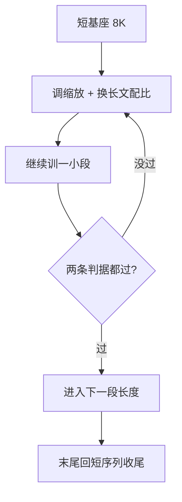

# 长上下文训练

一句话:长上下文不是从头训出来的,是**扩**出来的——拿一个已经在短序列上练好的基座,改位置编码、换长文档配比、动分布式,再补一套专门的评测,把窗口从 8K 一路推到 128K 甚至更长。

本篇是**串讲篇**:每一层的机制都有自己的专篇,这里只回答那个哪一篇专篇都答不了的问题——**按什么顺序扩、每一步付什么代价、位置/注意力/KV/分布式这四层手段怎么配。** 下文提到的每一项机制只给一句定位加一个篇名,原理去那一篇看。为什么扩窗放在预训练末期、Llama 3 与 DeepSeek-V3 各花了多少算力,见 预训练流程 篇;本篇从「已经决定要扩」这一步接着往下讲。

## 一、扩窗要同时对付四件事

把「上下文变长」当成一个显存问题,是最常见的误判。**它是四个互相独立的问题叠在一起,任何一个没解决,窗口标称多大都是假的**:

| 问题 | 症状 | 归哪一层管 |
|---|---|---|
| 位置出界 | 一超过训练长度就胡言乱语,困惑度飙升 | 位置层 |
| 注意力平方开销 | 序列翻 16 倍,注意力那部分算力涨 256 倍 | 注意力层 |
| KV 与激活线性增长 | 单卡放不下一条序列;decode 被 KV 访存拖死 | KV 层 + 分布式层 |
| 放得下但找不到 | 输入 128K 不报错,中间那段信息模型就是看不见 | 数据层 + 评测 |

前两个是**算不出来**,后两个是**算出来了但没用**。扩窗工程真正难的是第四个:前三个都有明确的报错和曲线,**第四个不报错**——它只在你主动设计了评测之后才现形(第六节)。

## 二、位置层:把出界的位置搬回学过的范围

RoPE 给第 $i$ 对通道分一个频率 $\theta_i=\text{base}^{-2i/d}$,位置 $m$ 就在那个平面里转 $m\theta_i$。训练长度 $L$ 之内,低频通道往往连一圈都没转完;一旦超过 $L$,它进入训练时从没出现过的角度区,各通道拼起来是一组没学过的相位组合,注意力 logits 直接跑出分布(旋转机制与「崩」的完整推导见 RoPE 篇)。

**所有扩窗方法都在做同一件事:把目标长度 $L'$ 上的角度压回 $[0,\ L\theta_i]$ 这段学过的圆弧里。** 缩放倍数统一记作 $s = L'/L$。

### 位置插值(PI):整套时钟一起走慢

$$
m' = \frac{m}{s},\qquad \text{等价于}\quad \theta_i' = \frac{\theta_i}{s}
$$

这行说的是:把第 $m$ 个 token 假装成第 $m/s$ 个。因为角度 = 位置 × 频率,除位置和除频率是同一件事,所以它等价于**把所有频率一律放慢 $s$ 倍**。好处是任何位置都必然落回学过的区间,不可能出界;代价是**近邻的角度差也被压小了 $s$ 倍**,原本能分清「前一个」和「前三个」的高频通道现在挤成一团,局部分辨率是实打实地掉。所以 PI 必须配继续训练:原论文把 LLaMA 7B–65B 扩到 32768,微调在 1000 步以内;它同时给了理论依据——插值的注意力分数上界比直接外推至少小约 600 倍,这才是它比外推稳的原因。

### NTK-aware:高频一分不让,低频全部拿去换长度

$$
\text{base}' = \text{base}\cdot s^{\frac{d}{d-2}}
$$

这行说的是:不动位置,只把 base 放大,让整条频率曲线换个斜率。指数为什么挑成 $\frac{d}{d-2}$,代进 $\theta_i'=(\text{base}')^{-2i/d}$ 就明白了:$i=0$ 的最高频通道 $\theta_0'=\theta_0$ **原地不动**,$i=d/2-1$ 的最低频通道正好被缩成 $\theta_i/s$、和 PI 一模一样,中间各通道按指数平滑过渡。**该保分辨率的高频一分不让,本来就模糊的低频全部拿去换长度**——这就是它比 PI 少掉局部分辨率的原因,也是「NTK-aware」和「把 base 调大」其实是同一件事的原因。

### YaRN:把那条连续曲线改成显式分段

YaRN 把「高频不动、低频全插」从一条连续曲线改成三段:**转够圈的高频段直接外推、一圈都没转完的低频段按 PI 全插、中间线性过渡**,另外配一个注意力温度补偿(分段阈值、温度公式见 RoPE 篇)。分段的理由就是上一段那句话——高频和低频在训练里的暴露程度根本不一样,一视同仁地缩就是拿局部分辨率去补长程,两头都不讨好。它对训练侧的意义很直接:论文自报比同类方法**少 10 倍 token、少 2.5 倍训练步数**。

### 外推和插值到底差在哪

这是最常被问、也最容易答含糊的一句:**外推是什么都不改、直接让模型算它没算过的位置**,公式当然有定义,但那些相位组合没学过,注意力分数可能爆炸;**插值是改映射,让新位置落回学过的区间**,模型看到的角度始终在分布内,代价是分辨率被压缩。一句话:**外推赌模型的泛化,插值花分辨率买确定性。** NTK-aware 和 YaRN 都是两者的分频段混合——在高频段外推,在低频段插值。

稳定性怎么比:PI 有明确的上界保证,在整个目标范围内行为可预测,但**必须微调**;NTK-aware 的实用价值是**不微调也能应急扩 2–4 倍**,超出这个倍数后没有同等的保证,退化幅度依模型而定。所以线上口径应该是「NTK-aware 用来救急,PI/YaRN 用来交付」。

### 训练侧只需要回答三个问题

| 问题 | 结论 |
|---|---|
| 要不要继续训 | PI、YaRN 都要;NTK-aware 可以零微调,但只当临时手段,不当交付方案 |
| 训多少 | 比想象的少。PI 扩到 32K 在 1000 步内;LongRoPE 在 256K 训练长度上用 1k 步内推到 2048K;数据量口径 500M–5B token 就够(第四节) |
| 训推配置能不能不一致 | 不能。缩放方法、$s$、base 三者在训练和推理时必须完全一致,否则模型在一套相位分布上训练、在另一套上推理,长文表现塌得毫无征兆。动态缩放尤其要小心:它按实际长度改 $s$,配置必须两端对齐验证 |

## 三、为什么切成几段扩,而不是一步到位

Llama 3 的公开做法是从 8K 分**六个阶段**涨到 128K,而且推进到下一段的判据写死了两条:① 短上下文评测**完全恢复**;② 当前长度上的大海捞针**做满分**。两条都过才允许加长。

分段的三个理由:

1. **成本是平方的,不是线性的。** 直接坐在 128K 上继续训,每一步注意力那部分的开销是 8K 的 256 倍;先在 16K、32K 把大部分适应做完,只有最后一小段才付最贵的单价。
2. **失败要能定位。** 一步到位炸了,你分不清是缩放选错、长文数据不够、还是短能力塌了;分段之后每段都有验收,炸在哪一段一眼看见。
3. **短能力会被挤掉,而且要及时救。** 长样本一喂浓,短序列表现常常掉——LongRoPE 的做法干脆是扩完之后**回到 8K 再调一遍**把短窗口性能收回来。分段的价值就是让这种回调发生在每一段末尾,而不是拖到最后才发现全线退化。

那两条判据缺一不可:只看大海捞针,你会得到一个 128K 能捞针、4K 对话却变笨的模型;只看短评测,长度根本没扩上去。

## 四、数据:天然长文档不够,配比比数量更要命

### 长度上采样要做,但别只把书喂浓

三个公开结论合在一起,基本推翻了「长上下文靠堆长语料」的直觉:

- **预训练语料里有大量长文本不是关键。** Llama 2 Long 的消融明说了这一点,并且验证了**长上下文继续训练比从头用长序列预训练更省、效果相当**——这正是「扩」而不是「从头训」的实验依据。
- **量小得出人意料。** 有工作系统研究了扩到 128K 的继续训练配方,结论是 500M–5B token 就足以让模型在 128K 内任意位置检索到信息。
- **质量的两条同等重要:域平衡 + 长度上采样。** 同一份工作报告:只对书籍这类天然长文做上采样(很多工作的常规做法)结果反而次优,域配比失衡的损失会盖过长度带来的收益。原因也直白——书的语体和依赖结构很窄,喂浓了模型学到的是「小说式的长依赖」,不是代码仓库、法律文书、多轮日志里那种长依赖。

### 拼接的坑:模型很容易只学会「找开头和结尾」

把一堆短文档首尾相接凑够 128K,是最省事也最容易翻车的做法,两个具体的坑:

- **跨文档注意力**:不加 document mask 时,后一篇能注意到前一篇,监督信号里混进大量本不成立的长距离依赖。要么按文档边界切断注意力(变长打包与 `cu_seqlens` 口径见 FlashAttention 篇),要么就得承认这份噪声的存在。
- **真正的长依赖一条都没有**:拼出来的序列里,预测任何一个 token 所需的信息几乎都在同一篇文档内、几千 token 之内。于是模型学到一个在训练集上完全够用的偷懒策略——**只看最近一段,再加上开头那点全局信息**。这就是「中间迷失」在训练侧的成因之一:不是模型看不见中间,是它从没被要求看过中间。

### 合成长依赖:把「答案在中间」显式写进监督

天然数据里缺「必须跨越十万 token 才答得对」的样本,那就造。公开配方里最直接的是 IN2 训练:合成一批长上下文问答,答案要求两件事——① 对 4K–32K 长上下文里某个约 128 token 的短片段有细粒度感知;② 把两个以上短片段的信息整合起来推理。在 Mistral-7B 上训出的 FILM-7B,在文档、代码、结构化三类上下文与正向/反向/双向三种检索模式上都能稳定取到信息,NarrativeQA 的 F1 从 23.5 升到 26.9,MMLU 基本不动(59.3→59.2)。**后半句和前半句一样重要:合成长任务不能以牺牲短能力为代价,否则只是把偏科换了个方向。**

设计合成任务的两条纪律:**答案位置必须均匀铺满整个窗口**(只在开头结尾放针,等于在教模型偷懒);**必须要求多跳整合**,单针检索训出来的模型能通过大海捞针,但过不了多跳与聚合类任务。语料本身的采集、清洗、去重、去污染见 数据工程 篇,本节只管「长」这一个维度。

## 五、系统:训练长序列为什么一定要动分布式

推理侧还能靠分页、量化、淘汰腾挪,训练侧没有这个余地——**前向的每一个中间结果都要留到反向**。

先算一笔账。稠密 Transformer 一层的前向 FLOPs 约 $24bsh^2$(QKV 投影、输出投影与 FFN)加上 $4bs^2h$(注意力的两个矩阵乘,不计 causal 掩码那约一半的折扣),注意力占的比例是:

$$
\frac{4bs^2h}{24bsh^2+4bs^2h}=\frac{s}{6h+s}
$$

这行说的是:**注意力占多大比例,只由「序列长度比隐藏维」决定,和参数量、batch 都无关。** 取 $h=8192$:$s=8\text{K}$ 时注意力只占约 14%,$s=128\text{K}$ 时涨到约 73%。同一个模型,主训练阶段基本可以不管注意力,扩窗阶段它就是主要成本——扩窗阶段的性能画像和主训练完全是两张脸。

这也解释了为什么 FlashAttention 在扩窗阶段是**必需品而不是优化项**:它不降算术量,但把那个 $s\times s$ 的中间分数矩阵从显存里彻底抹掉(见 FlashAttention 篇)。128K 序列下单头单层的分数矩阵按 fp16 算就是约 32 GiB($131072^2\times 2$ B),物化它这条路根本走不通。

第二堵墙是激活显存:**它随序列长度线性涨,而参数、梯度、优化器状态一个都不随序列长度变**——所以扩窗阶段的显存账要重新列一遍,不能沿用主训练那本(账怎么列见 显存管理与OOM 篇)。三件事按顺序上:

| 手段 | 解决什么 | 代价 |
|---|---|---|
| 激活重算 | 拿算力换激活显存 | 多跑一次前向,大致 +30% 算力 |
| 上下文并行 CP(Ring Attention 式) | 把序列本身切给多卡,注意力也分布式算 | 每层 $c-1$ 跳环传 K/V;causal mask 下持有开头的卡活最少,天然不均 |
| 变长打包 + 按面积均衡 | 真实长文档长度参差,按 token 数均分负载会严重歪 | 需要吃得下不规则 mask 的 kernel |

CP 的通信量、zigzag 均衡与 3D/4D 并行怎么摆见 并行策略 篇;不规则 mask 下怎么按「注意力面积」而不是 token 数分配负载见 MagiAttention 篇。要记住的只有一句:**序列一长,并行维度必须多加一维;TP、PP、DP 三件套都切不动序列这个维度。**

## 六、评测:困惑度为什么不够

**长文本困惑度主要被局部预测主导。** 一篇 128K 的文档里,绝大多数 token 靠前面几百个 token 就能预测得八九不离十;远程检索能力整个塌掉,困惑度也只动一点点。所以困惑度只能当**回归门禁**(确认没训坏),不能当**能力证据**。

三层评测按顺序补上:

| 层 | 测什么 | 典型工具 | 能发现什么 |
|---|---|---|---|
| 单针检索 | 一句无关的话埋进长文,问它是什么 | 大海捞针(NIAH) | 长度有没有真的扩上去 |
| 多针 / 多跳 / 聚合 | 多根针、跨针推理、全局统计 | RULER | 是不是只学会了「找一个字符串」 |
| 真实长任务 | 长文问答、摘要、代码库理解 | LongBench、∞Bench 等 | 长度之外还剩多少实际可用性 |

RULER 那篇给了一个必须记住的对照:17 个长上下文模型在**原味大海捞针上几乎都接近满分**,换成多针与多跳后,几乎全部随长度大幅下滑;**它们都声称支持 32K 以上,只有一半能在 32K 长度上保持像样的表现**。所以「我们过了大海捞针」这句话本身信息量接近零。

### 中间迷失:那种不报错的失败

在多文档问答和键值检索上系统地挪动关键信息的位置,会得到一条 **U 形曲线**:信息放在开头或结尾时表现最好,放在中间时显著下降,**连专门标榜长上下文的模型也一样**。它和第四节那个「只学会找开头结尾」的偷懒策略正好对上——训练数据里长依赖的位置分布不均匀,模型就照着不均匀的样子学。

> 🖼️ 占位:同一模型在同一长度下,关键信息位置从 0% 移到 100% 时准确率的 U 形曲线

三条落地纪律:

- **针的位置必须铺满窗口**(0%、25%、50%、75%、100% 各测一遍)。只在开头结尾放针,U 形的谷底根本测不出来
- **短上下文回退必须同批测**,而且要和扩窗前的基座逐项对比,不能只看长任务涨了多少
- **系统指标要一起进验收单**:目标长度上的 prefill 时间、KV 显存占用、CP 的通信占比。一个「能跑但一条请求吃满整机」的 1M 模型不算做成了(部署侧的取舍见 推理加速 篇)

## 七、四层手段怎么配:一张对照表

| 层 | 解决哪个问题 | 训练期做什么 | 部署期还能做什么 | 代价与边界 |
|---|---|---|---|---|
| **位置** | 位置出界 | PI / NTK-aware 放大 base / YaRN,配继续训练 | 按实际长度动态缩放 | 分辨率与长度的跷跷板;训推配置必须一致 |
| **注意力** | 平方开销 | FlashAttention 打底(精确、必开);要真降复杂度就得在预训练期换稀疏、滑窗或线性结构 | 改不了,结构已写进权重 | FA 不降算术量;稀疏与线性改了信息路径,长程能力要重新验 |
| **KV** | 显存与访存 | 压头数(GQA / MLA)、跨层共享——同样是训练期决定 | 压位宽(量化)、压 token 数(滑窗、淘汰)、换位置(分页、前缀复用、卸载) | 低位宽 KV 对长程检索特别敏感;淘汰是有损的,卸载是拿传输换容量 |
| **分布式** | 单卡放不下一条序列 | 重算 + CP/序列并行 + 变长打包按面积均衡 | 另有分块 prefill 与 PD 分离 | CP 通信随层数累加;负载不均要单独治 |

机制各去各家:稀疏注意力 篇、SWA 篇、Hybrid注意力 篇、线性注意力 篇讲注意力结构,KV共享注意力 篇讲头数怎么压,KVCache 篇与 KVCache量化 篇讲 KV 的形状、分页与位宽,PagedAttention 篇讲分页分配。读这张表的三条纪律:

1. **只有位置层是「扩窗」本身,另外三层是「让扩窗跑得动」。** 位置没改对,后三层做到极致也只是把胡言乱语算得更快。
2. **训练期定死的,部署期一个都改不了。** 注意力结构、KV 头数与共享方式、位置编码的频率方案都已经写进权重;部署期能动的只剩量化、缓存、调度这类不改数值语义或只改精度的东西(部署侧怎么排顺序见 推理加速 篇)。
3. **精确和有损要分开记账。** FlashAttention 和 CP 都是**精确**的——结果与全注意力逐位一致,换的是 IO 和卡数;稀疏、线性、KV 淘汰、低位宽 KV 全是**有损**的,上了任何一项都要重跑第六节那三层评测。这条最常被答错:把 Ring Attention 说成稀疏注意力,或者以为 FlashAttention 降了复杂度。

### 走一遍:要一个 1M 上下文的模型

从一个 8K 基座出发,顺序基本是固定的:

1. **先把评测钉死**:短回退、单针、多针多跳、真实长任务,外加 prefill 时间与 KV 显存两个系统指标。没有这套东西,后面每一步都无法判优
2. **位置层**:选 YaRN 或搜索式的分频段插值。LongRoPE 报的路径是先微调到 256K,再做第二次插值推到 2048K,全程 1k 步以内,最后回 8K 收一遍短窗口
3. **数据层**:域平衡的长文配比,加合成的多跳长依赖任务,量级 1B–5B token 起步,针的位置铺满窗口
4. **系统层**:FlashAttention 打底,加重算,加 CP;变长打包按注意力面积均衡
5. **分段推进**:每段过了「短能力恢复 + 当前长度捞针满分」两条判据再加长
6. **仍不够就动结构**——块稀疏、滑窗加全局混合、线性混合。但这一步意味着**回到预训练**,不是扩窗阶段能补的

最后一步是这道题真正的分水岭:**前五步都在「扩」,第六步是「重训」。** 面试里被问「1M 上下文怎么做」,把这条界线说清楚,比背出十个方法名有用得多。

## 面试考点串联

| 高频问法 | 本文哪一节 |
| --- | --- |
| 超长上下文会遇到哪些位置外推、计算、显存和效果问题?位置编码扩展、FlashAttention、稀疏或线性注意力、分块/序列并行、KV 压缩各自的原理和边界是什么? | 一(四个问题)+ 七(四层对照表) |
| 1M 上下文下,精确全注意力和稀疏注意力怎么组合? | 七(走一遍 + 精确/有损分账) |
| 位置外推和位置插值有什么区别? | 二 |
| Position Interpolation 和 NTK-aware 缩放,稳定性怎么比? | 二 |
| KV cache 可以从哪些维度压缩? | 七(KV 那一行:头数、层、位宽、token 数、存放位置) |
| 除了算法,长上下文还需要哪些分布式和内存工程? | 五 |
| YaRN 为什么要按频率分段处理,而不是所有维度一视同仁?(补充题) | 二 |
| PI 把位置压回去了,代价是什么?为什么它必须配微调?(补充题) | 二 |
| 扩窗的缩放配置,训练和推理可以不一致吗?会出什么事?(补充题) | 二 |
| 为什么要分成六段慢慢扩,不能一步到位?每推进一段的验收标准是什么?(补充题) | 三 |
| 扩完窗发现短上下文能力掉了,你会怎么查、怎么救?(补充题) | 三 + 六 |
| 长文档不够用,直接把短文档拼到 128K 行不行?(补充题) | 四 |
| 长上下文的训练数据,是长文本上采样得越多越好吗?(补充题) | 四 |
| 合成长依赖任务怎么设计,才不会训出一个只会看开头结尾的模型?(补充题) | 四 |
| 序列从 8K 拉到 128K,训练成本的构成会怎么变?为什么显存账要重列一遍?(补充题) | 五 |
| FlashAttention 和 Ring Attention 都说自己「精确」,精确指什么?它们各自省的是什么?(补充题) | 五 + 七 |
| 长文困惑度没掉,大海捞针却做不对,怎么回事?扩窗后你会测哪几层?(补充题) | 六 |
| 什么是「中间迷失」?训练侧能做什么?(补充题) | 六 + 四 |

边界说明:RoPE 的旋转机制与四种扩窗方法的完整对照见 RoPE 篇;上下文并行的通信量与并行维度组合见 并行策略 篇;部署期怎么排加速手段的顺序见 推理加速 篇;推理侧长上下文的检索与记忆组织见 记忆与上下文 篇。

## 相关文献

- Extending Context Window of Large Language Models via Positional Interpolation(PI,1000 步内扩到 32K,插值上界比外推小约 600 倍)— [arXiv:2306.15595](https://arxiv.org/abs/2306.15595)
- YaRN: Efficient Context Window Extension of Large Language Models(分频段插值 + 温度补偿,少 10 倍 token、少 2.5 倍步数)— [arXiv:2309.00071](https://arxiv.org/abs/2309.00071)
- LongRoPE: Extending LLM Context Window Beyond 2 Million Tokens(渐进式两次插值,1k 步内到 2048K,末尾回 8K 收短窗口)— [arXiv:2402.13753](https://arxiv.org/abs/2402.13753)
- Scaling Laws of RoPE-based Extrapolation(base 与训练长度的联合影响)— [arXiv:2310.05209](https://arxiv.org/abs/2310.05209)
- Effective Long-Context Scaling of Foundation Models(Llama 2 Long:长语料多不是关键,继续训练比从头长序列预训练更划算)— [arXiv:2309.16039](https://arxiv.org/abs/2309.16039)
- Data Engineering for Scaling Language Models to 128K Context(500M–5B token 的继续训练配方,域平衡与长度上采样同等重要)— [arXiv:2402.10171](https://arxiv.org/abs/2402.10171)
- The Llama 3 Herd of Models(六阶段 8K→128K,推进判据是短能力恢复 + 捞针满分)— [arXiv:2407.21783](https://arxiv.org/abs/2407.21783)
- Make Your LLM Fully Utilize the Context(IN2 合成长依赖训练,FILM-7B)— [arXiv:2404.16811](https://arxiv.org/abs/2404.16811)
- Lost in the Middle: How Language Models Use Long Contexts(关键信息位置的 U 形曲线)— [arXiv:2307.03172](https://arxiv.org/abs/2307.03172)
- RULER: What's the Real Context Size of Your Long-Context Language Models?(多针、多跳与聚合;声称 32K 的模型只有一半站得住)— [arXiv:2404.06654](https://arxiv.org/abs/2404.06654)
- LongBench: A Bilingual, Multitask Benchmark for Long Context Understanding(真实长任务评测)— [arXiv:2308.14508](https://arxiv.org/abs/2308.14508)
- ∞Bench: Extending Long Context Evaluation Beyond 100K Tokens(100K 以上的长任务评测)— [arXiv:2402.13718](https://arxiv.org/abs/2402.13718)
- LongLoRA: Efficient Fine-tuning of Long-Context Large Language Models(移位稀疏注意力做长上下文微调,省扩窗训练成本)— [arXiv:2309.12307](https://arxiv.org/abs/2309.12307)
- Ring Attention with Blockwise Transformers for Near-Infinite Context(环传 K/V 的精确上下文并行)— [arXiv:2310.01889](https://arxiv.org/abs/2310.01889)
- DeepSpeed Ulysses: System Optimizations for Enabling Training of Extreme Long Sequence Transformer Models(另一条序列并行路线)— [arXiv:2309.14509](https://arxiv.org/abs/2309.14509)
