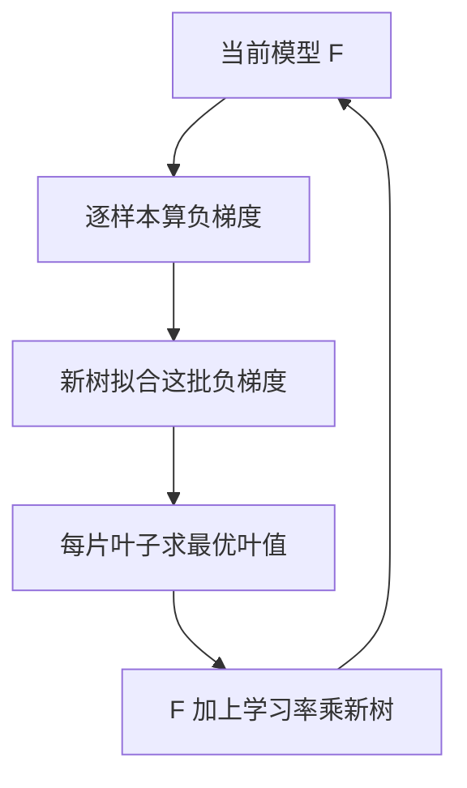

# 集成学习

一句话:集成学习是**把一堆不够好的模型拼成一个好模型**——Bagging 靠「各练各的再平均」压方差,Boosting 靠「一轮一轮补前面的错」压偏差,Stacking 靠「再学一个组合器」把异构模型的判断拼起来;落到表格数据上,梯度提升树至今仍是最强的默认基线之一。

## 一、三条路线:它们分别在修哪种错

先把三个词摆清楚,面试里最容易混:

| 路线 | 基模型怎么产生 | 怎么合并 | 主要修哪块误差 | 能并行吗 |
|---|---|---|---|---|
| Bagging | 各自在重采样数据上独立训练 | 回归取平均,分类投票或平均概率 | 方差 | 树之间天然并行 |
| Boosting | 后一棵依赖当前集成模型的错误或梯度 | 带学习率的加法叠加 | 偏差 | 轮次串行,轮内可并行 |
| Stacking | 一批异构模型各训各的 | 再训一个模型学怎么组合 | 组合方式本身 | 基模型并行,多一层训练 |

为什么 Bagging 主要吃方差:它不改变单棵树的系统性错误——每棵树平均意义上偏到哪,平均之后还是偏到哪;它改的是「换一批数据,预测会抖多少」。为什么 Boosting 主要吃偏差:每轮都朝着降低训练损失的方向再加一棵树,残余的系统性错误被一点点啃掉。偏差方差分解本身、以及它只在平方损失下才有干净形式这件事,见 泛化与正则化 篇,本篇只用结论。

**但这两句是倾向,不是定律。** Boosting 靠学习率、树复杂度限制、行列采样和早停同样在压方差;随机森林的单树深度和数据分布也影响偏差。把它说死成「Bagging 只降方差、Boosting 只降偏差」,追一层就露馅。

## 二、Bagging 与随机森林:让树犯不一样的错

### bootstrap:63.2% 是怎么来的

从 $n$ 条样本里**有放回地抽 $n$ 次**,得到一份和原数据同样大的训练集。某条样本一次都没被抽中的概率是 $(1-1/n)^n$,$n$ 大时趋于 $1/e\approx0.368$,所以平均约 **63.2%** 的原样本至少出现一次,其余约 36.8% 成为这棵树的袋外(OOB)样本。

两个高频口误要纠正:**不是抽 63% 次**,抽的次数就是 $n$ 次;**也不是每棵树只用 63% 的数据**,它用的是 $n$ 条(含重复)。OOB 样本能直接当验证集——每条样本只让没见过它的那些树去预测,免费得到一个近似交叉验证的估计,这是随机森林不额外切验证集也能调参的原因。

### 第二重随机:分裂时只看一部分特征

光有 bootstrap 不够。数据里若有一两个特别强的特征,每棵树的根节点都会选它,树与树长得几乎一样,平均下来等于没平均。随机森林在**每个节点**再随机抽一个特征子集(分类常用 $\sqrt{p}$,回归常用 $p/3$)作候选,强特征被迫时不时缺席,别的特征才有机会露脸。

这一重随机为什么关键,用方差就能说清。$B$ 棵同分布、两两相关系数为 $\rho$、单棵方差为 $\sigma^2$ 的树取平均,方差是

$$
\rho\sigma^2+\frac{1-\rho}{B}\sigma^2
$$

第二项随树数 $B$ 增加而消失,**第一项不会**——它是树之间的相关性给方差设的地板。所以树加到几百棵之后收益就饱和,想再往下压只能去降 $\rho$,这正是列采样在干的事;代价是每棵树自己变弱($\sigma^2$ 变大),两边要折中。工程上随机森林最省心:每棵树互不依赖,**训练可以直接按树切给多核或多机**,预测时各树独立算完再聚合;主旋钮只有树数、特征子集大小和叶子最小样本数,对噪声与大量无关特征也相对稳健。

## 三、Boosting 主干:从改权重到拟合负梯度

### 从 AdaBoost 到负梯度

AdaBoost 的做法很直白:训一个弱学习器,把它**分错的样本权重调高**,下一轮被迫重点照顾这些样本,最后按各学习器的表现加权投票。它隐含指数损失,对离群点和错标签非常敏感——一个永远分不对的样本,权重会被越推越高。

梯度提升把这件事推广了。模型是树的加法组合:

$$
F_m(x)=F_{m-1}(x)+\eta f_m(x)
$$

$F_m$ 是第 $m$ 轮的模型,$f_m$ 是这轮新增的树,$\eta$ 是学习率(收缩系数)。这棵新树要拟合的,是**损失对当前模型输出的负梯度**:

$$
r_{im}=-\left.\frac{\partial L(y_i,F(x_i))}{\partial F(x_i)}\right|_{F=F_{m-1}}
$$

这等于在函数空间里做梯度下降:每步往损失下降最快的方向挪一点,只不过方向由一棵树近似表示。

**平方损失下负梯度恰好等于残差 $y_i-F_{m-1}(x_i)$,换成别的损失就不是了。** 这是最高频的纠错点:绝对误差下负梯度是 $\pm1$ 的符号,对数损失下是「真实标签减预测概率」。所以准确说法是拟合**伪残差**。换损失就换梯度,各损失族的形状与梯度见 分类损失 篇和 回归损失 篇。

### 一棵新树怎么分裂,叶值怎么求

回归树的分裂就是**枚举特征 $j$ 与阈值 $s$ 的组合**,把当前节点切成左右两块,选让两边目标值平方和(SSE)下降最多的那一对;数值特征把取值排序后逐个候选切点试。每次分裂只看一列,所以树天然能表达阈值和特征交互,也天然不要求特征缩放。树结构定下来后再单独求叶值:对落在这片叶子里的样本,求让损失最小的那个常数——平方损失下就是均值,其他损失要解一个一维最优化。

### 学习率、采样与并行性

$\eta$ 越小,每棵树只走一小步,需要的轮数越多。经验上 $\eta$ 取 0.01–0.1 配几百到几千棵树,通常比 $\eta=0.5$ 配几十棵树泛化更好,因为**步子迈得小,单棵树拟合到噪声上的那部分也被同比缩小了**。代价是训练时间和模型体积随轮数线性上涨,所以必须配早停:留一份验证集,指标连续若干轮不再改善就停,并设最小改善幅度以免被抖动骗停。随机梯度提升再加一层:每轮只用一部分行和一部分列。这既降方差又降单轮成本,也是「Bagging 和 Boosting 能不能结合」最常见的答案——**行列采样就是往 Boosting 里掺 Bagging**;反过来对多组 Boosting 模型再做一次 Bagging 或平均也行,代价是训练和推理成本成倍上涨。

并行性要分三层说。轮次之间**必须串行**,因为第 $m$ 棵树的目标依赖第 $m-1$ 轮的预测;但**单轮之内**,不同特征的候选切点统计、直方图构建、分布式梯度聚合都能并行;**预测阶段**所有树的输出互不依赖,可以并行算完再求和。只说「Boosting 不能并行」是错的。

## 四、XGBoost:用二阶展开把「拟合残差」变成一个带正则的最优化

### 目标函数、分裂增益与叶值

XGBoost 不再让新树去拟合某个伪残差,而是直接对目标函数做二阶泰勒展开。记 $g_i$ 为损失对当前预测的一阶导、$h_i$ 为二阶导,去掉常数项后第 $t$ 轮要最小化:

$$
\sum_i\left[g_if_t(x_i)+\tfrac12 h_if_t(x_i)^2\right]+\gamma T+\frac{\lambda}{2}\sum_j w_j^2
$$

前一项是损失的二阶近似,$T$ 是叶子数、$w_j$ 是叶值,$\gamma$ 惩罚「多长一片叶子」,$\lambda$ 是叶值的 L2。**树的复杂度被写进了目标函数**,这是它和传统 GBDT 最本质的差别:剪枝不再是训练完之后的后处理,分裂当场就在算这笔账。

固定树结构时上式对 $w_j$ 是二次函数,求导即得最优叶值 $-G_j/(H_j+\lambda)$,其中 $G_j,H_j$ 是落在该叶子的样本一阶、二阶导之和。代回去,一次分裂的增益是:

$$
\mathrm{Gain}=\frac12\left[\frac{G_L^2}{H_L+\lambda}+\frac{G_R^2}{H_R+\lambda}-\frac{(G_L+G_R)^2}{H_L+H_R+\lambda}\right]-\gamma
$$

方括号里是「切开后两边的收益之和,减去不切的收益」,$\gamma$ 是切这一刀要付的固定成本。**增益为负就不分裂**,这是内建的预剪枝;再配上最小叶权重等约束,复杂度控制全收在一处。

### 为什么二阶信息有用,只用一阶行不行

行,梯度提升本来就只用一阶。二阶多买到两样东西。一是**步长不用猜**:一阶方法要靠额外的线搜索决定每片叶子走多远,二阶把曲率放进分母,直接解出最优步长。二是**每个样本自带一个置信权重**:以对数损失为例 $g=p-y$、$h=p(1-p)$,$h$ 在 $p=0.5$ 处最大(0.25),在模型已经很有把握的地方趋近 0,于是「还拿不准」的样本在增益里权重更大。平方损失下 $h\equiv1$,二阶项退化成常数,增益公式变回带 L2 的残差平方和——这说明二阶不是万灵药,收益取决于损失曲率变化得明不明显。

### 稀疏感知、缺失值方向与三种分裂搜索

真实表格数据大量是缺失值和 one-hot 的零。XGBoost 给每个节点学一个**默认方向**:枚举切点时只扫非缺失样本,再把所有缺失样本整体先试左、后试右,哪边增益高就定哪边。好处有两条——统计只在非缺失条目上做,成本随非零元素数而不是随矩阵大小增长;而且**缺失往哪走是数据定的,不是你填出来的**。填补策略的取舍见 特征工程 篇。

| tree_method | 怎么找候选切点 | 什么时候用 |
|---|---|---|
| exact | 精确枚举每个特征的所有取值 | 小数据、要求精确 |
| approx | 按加权分位数每轮重新提候选 | 大数据、外存 |
| hist | 预先分桶,扫桶统计 | 当前默认,大数据首选 |

「XGBoost 只能预排序所以慢」这个说法早就过时了:**现在它的默认算法就是直方图**,拿旧版跑出来的倍数结论不能直接搬到今天。

## 五、LightGBM:把「扫样本」换成「扫桶」,再挑最赚的叶子

### 直方图:分桶、构建、相减

训练前把每个连续特征的取值映射进有限个桶(默认 255 个量级)。建某节点的直方图时,遍历落在该节点的样本,按桶累加三样东西:样本数、一阶梯度和、二阶梯度和。找切点时不再遍历原始取值,而是**沿桶做一次前缀扫描**,候选数从「不同取值个数」降到「桶数」。省下三笔账:**内存**上,预排序要为每个特征存一份 float32 取值加一份索引(每个值 8 字节量级),分桶后只需 1 字节的桶编号;**候选搜索**上,切点候选从样本量级降到桶量级,且每轮不必重新排序;**通信**上,分布式训练各机器只交换桶级别的直方图,通信量与样本数无关。

再加一条**直方图相减**:一个节点分裂成左右两个子节点,两边直方图相加正好等于父节点。所以只需老老实实构建**样本更少的那个子节点**,另一个用父节点减出来,每层的构建成本大致省掉一半。分桶的代价是**丢掉了桶内的精确阈值**——最优切点若落在桶内部,就只能退到桶边界。什么时候会疼:取值分布极度集中、有效切点密集在很窄区间(某些金融特征就是这样),或者样本量小到一个桶里没几条数据。反过来,分桶在噪声大的数据上有正则化效果,反而可能更好。**桶数是要调的超参,不是越大越准。**

### Leaf-wise:每次挑增益最大的那片叶子

传统实现常用 level-wise:同一深度的节点一起分裂,不管每个节点值不值得分。LightGBM 默认 leaf-wise,在**当前所有叶子里**挑增益最大的一片来分。同样长 $k$ 片叶子,每一刀都花在最赚的地方,训练损失降得更快。

代价是它会长出很深很不平衡的分支:一条路径上反复切同一小撮样本,最深处的叶子可能只剩几条,那就是在背噪声。所以 leaf-wise 必须配约束——`num_leaves` 直接限制叶子总数(这是主旋钮,不是 `max_depth`),`max_depth` 兜底,`min_data_in_leaf` 与 `min_sum_hessian_in_leaf` 规定一片叶子至少要有多少样本或多少二阶权重,再加 L1/L2 和早停。数据越小,`num_leaves` 越要压狠。

### GOSS、EFB 与原生类别分裂

**GOSS(单边梯度采样)**:梯度小说明模型在这些样本上已经学好了,信息量少。做法是按 $|g|$ 排序保留最大的一批,在剩下的小梯度样本里随机抽一小部分,并把这批抽样样本的统计**放大回原比例**再算增益,免得分布被抽偏。**EFB(互斥特征捆绑)**:高维稀疏数据里很多特征几乎不会同时非零(典型如 one-hot 展开的列),EFB 把这类特征打包成一列,用偏移量让它们占据互不重叠的桶区间,有效特征数就降下来了。两条都要说清边界:**它们减的是训练成本,不是提升精度的机制**,而且并非所有配置都默认启用(GOSS 需要显式指定 boosting 类型)。尤其 EFB 只是稀疏特征的压缩手段,**和目标编码、标签泄漏毫无关系**——拿 EFB 去对标 CatBoost 的类别处理是答偏了。

声明为类别的特征,LightGBM 不做 one-hot,而是在直方图里按每个类别累计的**梯度与二阶梯度之比**给类别排序,再在排好的序列上切一刀,分成两个类别子集。这样一次分裂就能把多个类别分到同一边;one-hot 一次只能切出一个类别,要长很深才能表达同样的分组。代价是高基数下很容易切出只含少量样本的组,需要 `max_cat_threshold`、`min_data_per_group`、`cat_smooth` 这类参数压住。

## 六、CatBoost:两个「有序」修的是两种不同的泄漏

### 有序目标统计:编码自己时不许看自己的标签

用全量训练集算类别的标签均值,**每条样本自己的标签就躺在它自己的编码里**;极端情形是某个 ID 只出现一次,编码直接等于标签。这个坑的通用讲法(K 折折外、留一、为什么平滑救不了)在 特征工程 篇,这里只讲 CatBoost 自己的解法。它给训练样本随机排一个顺序,编码样本 $i$ 时只用**排在它前面、且类别相同**的那些样本(记作 $H_i$):

$$
\mathrm{enc}_i=\frac{\sum_{j\in H_i}y_j+a\mu}{|H_i|+a}
$$

$\mu$ 是全局先验均值,$a>0$ 控制平滑强度。前面没有同类样本时回退到先验,历史越多就越相信观测本身,这等于把「折外」做到了单样本粒度。它还会用**多个不同的随机排列**训练,免得结论被某一个顺序带偏;预测时用训练数据统计出的编码,绝不碰测试标签。

高基数特征(比如用户 ID)因此不必 one-hot 展开,还能和别的类别做特征组合。但边界要说清:**平滑补不出规律**——近乎唯一的 ID 前面几乎没有同类历史,编码基本就是先验值,这类特征本身缺少可迁移信号,评估时必须按用户或时间留出,否则又是另一种泄漏。

### Ordered Boosting:修的是预测偏移,不是编码

这是另一件事,面试里最常被混成一件。问题出在梯度上:算样本 $i$ 的梯度时用的是当前模型,而当前模型的训练**已经用过 $i$ 的标签**,于是训练样本上梯度的条件分布和新样本上的不一样,这个偏差叫**预测偏移**。Ordered Boosting 的解法同构:同样按一个随机排列,估计样本 $i$ 的梯度时,用**只在排在 $i$ 之前的样本上训过的那个模型**。

| 机制 | 挡的是哪种问题 | 作用在哪一步 |
|---|---|---|
| 有序目标统计 | 标签经类别编码泄漏进特征 | 造特征时 |
| Ordered Boosting | 模型见过当前样本标签导致的预测偏移 | 算梯度时 |

**Plain 模式是普通梯度提升,但它照样可以用有序目标统计。** 所以「用了 CatBoost 就等于用了 Ordered Boosting」是错的。Ordered 常在小数据上更有帮助,Plain 通常更快;官方参数本来就允许按数据规模、设备和损失来选,不存在「生产必须用 Ordered」。

工程上怎么把平方级开销压下来:朴素实现要为每个前缀训一个模型,代价不可接受。实际做法是每轮**所有辅助模型共享同一棵树的结构**,只是各自用不同前缀的样本求叶值;而且只维护**按几何级数增长**的那几个前缀,而不是全部 $n$ 个,需要哪个预测就取最近的那个。这样仍保住「算梯度用的模型没见过当前样本」,只多出一个常数倍开销。要记住:**辅助模型只服务于训练,预测时不是把一堆前缀模型平均**,最终树的叶值按标准梯度提升流程求。

### 对称树

CatBoost 默认长**对称树**(oblivious tree):同一层的所有节点用**同一个分裂条件**。这是很强的结构约束,本身就起正则作用;换来的是预测极快——深度 $d$ 的树做 $d$ 次比较拼出一个索引,直接查一张 $2^d$ 的叶值表,没有逐节点的分支跳转,很适合低延迟线上服务。代价是表达力受限,同一层被迫共用一个条件,有些结构要多长几层才能表达;它也提供 Depthwise 和 Lossguide 供切换。**所以就算数据里一个类别特征都没有,CatBoost 也不是必然输**:有序提升与对称树仍可能有用,只是不保证胜过 LightGBM,要实测。

## 七、三家怎么比、怎么选

| 维度 | XGBoost | LightGBM | CatBoost |
|---|---|---|---|
| 目标与正则 | 二阶展开;叶值 L1/L2、$\gamma$ 门槛、深度、采样 | 同用梯度统计;叶数/深度、最小叶样本、L1/L2、采样 | 叶值 L2、深度、随机化与采样 |
| 树生长 | 默认 depthwise,可切 lossguide | 默认 leaf-wise,仍可限深度 | 默认对称树,另有 Depthwise/Lossguide |
| 类别特征 | 原生支持,需正确声明类型 | 按梯度与二阶梯度之比排序找类别分组 | 有序目标统计、先验平滑与特征组合 |
| 分裂搜索 | exact / approx / hist,当前默认 hist | 直方图加直方图相减,可选 GOSS/EFB | 直方图;Ordered 相比 Plain 有额外开销 |
| 缺失值 | 每个节点学一个默认方向 | 分到增益更高的一侧 | 数值按设定处理,类别缺失可当独立取值 |
| GPU | `device="cuda"` 配 `hist` | OpenCL 的 `gpu` 与另一套 `cuda` 实现 | `task_type="GPU"` |

**没有脱离数据和配置的速度或精度冠军。** 三家的机制早就互相借鉴:XGBoost 有了直方图和原生类别,LightGBM 也能限深度,拿几年前的对比结论当今天的答案是最常见的翻车方式。

公平比较要固定这些:同一份数据划分、同样的硬件、同样的树数与叶数预算、同样的桶数配置、同样的调参时间;然后同时看四个数——**留出集指标、训练时间与内存、预测延迟、模型体积**。只报一个精度数字的对比没有意义。GPU 也一样:三家都支持,但 CPU 与 GPU 的可用参数和行为并不完全一致,**能不能加速要实测总时间**,不能由「支持 GPU」推出一个固定倍数。

三个常见场景:**大量高基数类别**时优先把 CatBoost 放进基线,因为有序目标统计把「手工编码加防泄漏」这件最容易出错的事收进了框架,但近乎唯一的 ID 谁都救不了;**亿级样本**时该比的是两家直方图模式下的内存占用和分布式能力,而不是「直方图对预排序」这个过时命题;**千万级加高维稀疏**时先压桶数、用稀疏表示、砍掉几乎全零的无效列,再控制树复杂度,分布式下还要盯数据搬运和通信量。

## 八、Stacking:再训一个模型来学「怎么组合」

### 架构与无泄漏流程

Level-0 是一批基模型(线性、树、神经网络都行),Level-1 是元模型,它的输入不是原始特征,而是基模型的预测。**每一行元特征必须来自没用过这一行标签的基模型**,否则元模型学到的是「基模型在训练集上有多准」,线上必然崩。四步:

1. **先留最终测试集**。有时间或用户关联的数据按相应边界切,不能随机打散——同一用户的另一条记录会把答案带过去。
2. **生成折外(OOF)预测**。每种基模型用 $K-1$ 折训练,只预测没参与训练的那一折,拼起来得到全部训练行的预测。填补、缩放、目标编码、早停、调参**全都只能用该折的训练部分**;拿待预测折的标签给基模型早停,是最隐蔽的一种泄漏。
3. **训元模型**。二分类下每个基模型留一列正类概率,$M$ 个模型、$N$ 行得到 $Z\in\mathbb{R}^{N\times M}$,它和原始特征矩阵的列数没有关系。元模型优先用带正则的线性模型或逻辑回归,**它的活是加权,不是把噪声再拟合一遍**。
4. **上线怎么做**。基模型可以在全部开发数据上重训,也可以保留 $K$ 个折模型做平均;两种方式的成本和预测分布不同,都要在独立数据上验一遍。

**折外只防住了「用自己的标签预测自己」,防不住整套流程被反复挑选而过拟合。** 反复换基模型、换元模型、调参之后,要用外层交叉验证评估整个流程,最终测试集只在最后碰一次。

### Blending、多样性、性价比与大模型场景

Blending 通常指只切一个留出集来生成元特征:流程省事、不必训 $K$ 遍,但基模型和元模型可用的数据都变少,结果更依赖那一次划分的运气。选基模型看的是**错误互补性**,不是名字不同。在同一验证集上算残差或错误的相关性,再做组合消融;预测高度相关时新增信息很少,元模型还会被共线性搞得权重乱跳,这时要删冗余模型或加强正则。收益必须抵得过 $K$ 倍训练、多模型推理和部署复杂度——**Stacking 最常见的失败不是效果不行,是不值**。没有固定的提升幅度,也没有最优模型个数。

大模型场景里一个成立的用法是:拿几个**冻结**模型对同一批候选答案的打分或类别概率当元特征,训一个小的校准或排序组合器;如果基模型也在当前数据上微调过,就同样要折外生成元特征。要区分开的是——**直接合并模型参数、合并 LoRA、把几个模型的输出文本平均一下,都不是 Stacking**,它们没有「用折外预测训练一个组合器」这一步。

## 九、边界:什么时候树集成不合适

**要不要做特征归一化?不用。** 树按单特征阈值分裂,严格单调的变换不改变样本排序,候选切点集合等价,树长出来一样。准确说法是「不必缩放」而不是「缩放绝对没影响」——直方图实现下桶边界会随变换移动,结果可能有细微出入。这也意味着 GBDT **不能外推**:落在训练取值范围之外的输入,只会拿到边界叶子的那个常数。

**高基数类别与高维稀疏怎么办。** 树没有类别的天然序,三条路各有代价:one-hot 一次只能切出一个类别、要长很深,而且每列摊到的样本太少;目标或有序统计压成一列,但要防泄漏;原生类别分裂最省事。更麻烦的是**高维稀疏本身对树不友好**——每次分裂只看一列,几万列 TF-IDF 上信息被摊得极薄,线性模型或神经网络反而更合适。通用编码选法见 特征工程 篇。

**噪声大的时候。** Boosting 会一轮一轮去啃它啃不动的样本,离群点被反复放大(AdaBoost 的指数损失尤其严重)。对策是换稳健损失(Huber、分位数,见 回归损失 篇)、把学习率压小、早停放严,或者干脆退回随机森林,它对噪声和无关特征天生更稳。竞赛里常选 XGBoost 而不是随机森林,原因正是这枚硬币的另一面:**Boosting 有「再加一棵树」这个持续降偏差的旋钮,随机森林的方差项触到 $\rho\sigma^2$ 这个地板之后就没得压了**,前提是你有干净数据和调参预算。

**大模型时代它还重不重要?** 在中等规模的结构化表格数据上,它仍是很强的基线:树直接表达阈值与特征交互、不用缩放、训练便宜、可解释工具成熟。合理的结合方式是分工——让神经网络把文本、图像、行为序列压成表示,再和表格特征一起喂给树;或者把树的预测当下游模型的一路输入。用 GBDT 的叶子编号当特征喂 LR 是这条思路最早的落地(细节见 特征工程 篇,CTR 模型自身的演进见 推荐模型 篇)。两条红线:**用当前任务标签生成的中间特征必须做标签隔离**,以及混合方案必须和纯树、纯神经网络在同一划分、同一成本预算下比。

## 面试考点串联

| 高频问法 | 本文哪一节 |
| --- | --- |
| 随机森林和 Boosting 怎么集成决策树?偏差方差和并行能力有何区别? | 一、二、三 |
| 随机森林和 GBDT 需要特征归一化吗,为什么? | 九 |
| 实际业务中怎样选择 Bagging 或 Boosting,能否结合两者? | 一、三(行列采样)、九 |
| GBDT 的加法模型和负梯度是怎么回事?一棵新树怎么选分裂特征与切分点? | 三 |
| 为什么二阶信息有用?只用一阶梯度是否仍能提升? | 四 |
| XGBoost 与 LightGBM 的候选切分搜索有什么不同? | 四(三种 tree_method)、五 |
| GBDT 怎样处理高基数类别特征和高维稀疏特征?GBDT+LR 的特征组合思路是什么? | 九(细节见 特征工程 篇)、五、六 |
| LightGBM 的直方图、直方图相减、Leaf-wise、GOSS、EFB 各起什么作用? | 五 |
| 分桶为什么加速,在哪些数据上可能损失有效切分精度? | 五 |
| Leaf-wise 为什么更容易过拟合,哪些参数直接控制它? | 五 |
| LightGBM 原生类别处理怎样避免简单 one-hot 的高维问题? | 五 |
| 亿级样本下直方图相比预排序有哪些优势,这一比较对现代 XGBoost 还成立吗? | 五、四(hist 已是默认)、七 |
| XGBoost、LightGBM、CatBoost 在树生长、类别处理、训练效率、正则化上差在哪? | 七 |
| 数据中有大量高基数类别特征时,优先比较哪个框架,为什么? | 七、六 |
| 数据量千万级且特征维度很高会怎样选择和优化?三者的 GPU 支持如何? | 七 |
| 为什么大模型时代这些 GBDT 框架仍然重要,能否结合神经网络谈? | 九 |
| CatBoost 处理类别特征用了哪些机制?有序目标编码怎样缓解泄漏和过拟合? | 六 |
| Ordered Boosting 如何缓解预测偏移?和有序目标统计是一回事吗?工程上怎么控开销? | 六 |
| CatBoost 的 Ordered 与 Plain 有什么区别,各自适用什么场景? | 六 |
| CatBoost 如何处理用户 ID 这类高基数类别特征? | 六 |
| 与 LightGBM 的 EFB 相比,CatBoost 的类别特征处理有何优劣? | 五、六 |
| 没有类别特征时,CatBoost 相比 LightGBM 是否还有优势? | 六、七 |
| Stacking 的完整架构是什么?怎样通过技术手段避免过拟合? | 八 |
| Stacking 与 Boosting、Bagging 的核心区别是什么?和 Blending 呢? | 一、八 |
| 基模型预测高度相关时 Stacking 会受什么影响?怎样选基模型的多样性? | 八 |
| 大模型场景下 Stacking 怎么用? | 八 |
| 随机森林的树数一直加下去还会继续变好吗?为什么会饱和?(补充题) | 二 |
| bootstrap 之外随机森林还有一重随机在哪?去掉它会怎样?(补充题) | 二 |
| 学习率调小、树数加多为什么常常更好?代价是什么?(补充题) | 三 |
| XGBoost 遇到缺失值怎么走?这个方向是谁定的?(补充题) | 四 |

## 相关文献

- Random Forests(Leo Breiman,2001)— https://www.stat.berkeley.edu/~breiman/randomforest2001.pdf
- Greedy Function Approximation: A Gradient Boosting Machine(Friedman,Annals of Statistics 2001)— https://projecteuclid.org/journals/annals-of-statistics/volume-29/issue-5/Greedy-function-approximation-A-gradient-boosting-machine/10.1214/aos/1013203451.full
- XGBoost: A Scalable Tree Boosting System — [arXiv:1603.02754](https://arxiv.org/abs/1603.02754)
- LightGBM: A Highly Efficient Gradient Boosting Decision Tree(NeurIPS 2017)— https://papers.nips.cc/paper_files/paper/2017/hash/6449f44a102fde848669bdd9eb6b76fa-Abstract.html
- CatBoost: unbiased boosting with categorical features — [arXiv:1706.09516](https://arxiv.org/abs/1706.09516)
- Why do tree-based models still outperform deep learning on tabular data? — [arXiv:2207.08815](https://arxiv.org/abs/2207.08815)
- scikit-learn · Ensembles: Gradient boosting, random forests, bagging, voting, stacking — https://scikit-learn.org/stable/modules/ensemble.html
- LightGBM 官方文档 · Features(直方图、Leaf-wise、GOSS、EFB、类别特征)— https://lightgbm.readthedocs.io/en/latest/Features.html
- XGBoost 官方文档 · Tree Methods — https://xgboost.readthedocs.io/en/stable/treemethod.html
- CatBoost 官方文档 · Training parameters(boosting_type 与 GPU)— https://catboost.ai/docs/en/references/training-parameters/common
