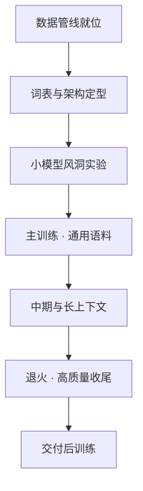

# 预训练流程全景

一句话:预训练是**把一大堆没人标注的文本,变成一个"什么都懂一点"的基座模型**的那条流水线;它的工程难点不在写训练循环,而在于每个决定都要烧掉几十万到几百万卡时才知道对不对——所以整条流程都围着一句话组织:**贵的决定,便宜地验证**。

## 一、范式:为什么今天先训基座、再谈任务

### 三代做法的分工变了

| 时期 | 来了一个新任务要做什么 | 泛化从哪来 | 主要代价 |
|---|---|---|---|
| 规则与统计(词典、n-gram、CRF) | 写规则、设计特征、标这个任务的数据 | 人手写进去的先验 | 换任务几乎从零开始 |
| 任务专用神经网络(CNN / RNN + CRF) | 仍要为这个任务标数据、单独训一个模型 | 词向量 + 网络结构 | 标注量大,跨任务不复用 |
| 预训练 + 微调(BERT 一路) | 拿现成基座,标几千条,微调一次 | 大规模自监督学到的通用表示 | 每个任务仍要存一份权重 |
| 大模型 + in-context(GPT-3 一路) | 写一段提示,给几个例子,不改权重 | 基座本身的通用能力 | 推理贵、输出难约束、事实性难保证 |

核心变化一句话:**从"为每个任务单独设计并训练一个系统",变成"先训一个通用基座,再用上下文或少量参数更新去适配"**。有个常见误读要先纠正:第一代不等于"全是手工特征",CRF、CNN、RNN 都是那个年代的神经方法,只是不跨任务复用而已。

从 BERT 到 GPT,**变的不只是训练目标(双向恢复被遮词 → 单向预测下一个词),更是任务定义写在哪里**:BERT 时代写在代码里(标签集、任务头、后处理),一个任务一份权重;大模型时代写在提示里,一份权重服务所有任务。GPT-3 那篇论文把这条线推到极致:所有任务"不做任何梯度更新或微调",全靠文本里的指令和示例完成。这才是"一个模型打天下"的工程前提。

### 传统方法什么时候还赢

比较必须在同一个测试集和同一套服务约束下做,别拿离线指标去比在线成本:

- 标签稳定、规则明确、输出结构必须严格(金额抽取、合规过滤)→ 规则、CRF、蒸馏小模型仍然合适,因为它们的失败模式可枚举、可打补丁,而大模型的失败是概率性的
- 吞吐极高、单条延迟只有几毫秒、或数据不能出内网 → 自部署小模型,因为每 token 成本和显存是硬约束,不会因为提示写得好就变小
- 需求天天变、样本极少、任务里有生成或复杂语义 → 先用 Prompt / Few-shot 试,因为改一版提示的成本接近零
- 调用量稳定且很大、任务分布已经收敛 → 再比较微调小模型或蒸馏,把单价压下来

API 与自部署没有固定胜负:必须把调用量、并发峰值、延迟目标、卡的折旧和维护人力一起算进去,只比"每千 token 单价"一定会得出错误结论。

### 涌现能力:先怀疑是评测刻度的错

"训到某个规模突然会做某件事"这个说法要打折。**同一条平滑改进的能力曲线,用不连续的指标(比如要求完全匹配的准确率)去量,就会显示成一条突然跳起的台阶**;换成连续指标(比如正确答案的对数概率)往往就平滑了。所以涌现只能就"具体任务 + 具体指标"讨论,不能预先承诺"训到多大参数就一定会某项能力"。

## 二、自监督:标签从哪来,又怎么带走

自监督就是**不逐条人工标注,而是把数据自己的结构切出来当标签**。它省的是"任务标签"的钱,不是"数据治理"的钱——语料授权、去重、过滤、正负样本怎么配,全是人工规则(细节见 数据工程 篇)。

### 三种监督信号

| 目标 | 标签怎么来 | 每个位置能看见什么 | 天生擅长 | 主要局限 |
|---|---|---|---|---|
| 自回归(GPT) | 下一个 token 就是标签 | 只有左边 | 生成、续写、in-context | 每个位置只能用前文 |
| 掩码建模(BERT MLM) | 遮住一部分,拿原词当标签 | 左右都能看 | 分类、抽取、检索表示 | 只监督被选中的位置;`[MASK]` 在下游根本不出现 |
| 对比学习(InfoNCE) | 同一语义的两个视图互为正样本 | 整段的表示 | 表示对齐、检索、跨模态 | 完全依赖正负样本怎么造 |

$$
\mathcal{L}_{\text{AR}}=-\sum_t \log p_\theta(x_t \mid x_{<t})
$$

这行说的是:每走到一个位置,就把"真实的下一个 token"的概率往上推。整段文本的每个位置都白送一次监督,所以自回归的数据利用率天然最高,这也是它成为大模型主流目标的实际原因。

$$
\mathcal{L}_{\text{InfoNCE}}=-\log\frac{\exp(s^{+}/\tau)}{\exp(s^{+}/\tau)+\sum_{j}\exp(s^{-}_{j}/\tau)}
$$

这行说的是:让正样本对的相似度 $s^{+}$ 在一堆候选里排到第一名;$\tau$ 是温度,越小越只盯着最难区分的那几个负例。它本质是**一道 N 选 1 的选择题**,所以负样本决定了这道题有多难,这就是它为什么有效——不需要标签,只需要"谁和谁是一对"。

**负样本不是越多越好**。多的好处是选择题更难、表示被逼得更细;坏处有三:① 计算和显存线性上涨;② 随机采样会混进语义其实相同的**假负例**,模型被要求把两个同义句推开,表示反而被搞坏,而且假负例的绝对数量随负样本数一起涨;③ 候选一多,靠最粗的线索(语言、长度、格式)就能排除掉绝大部分负例,细粒度区分反而没学到。所以要同时看采样策略和下游指标,不能只看训练 loss 降没降。

### BERT:双向表示是怎么学出来的

**BERT 是只保留 Transformer Encoder 的双向表示模型**——每个 token 都能同时读到左右两侧,多层自注意力负责交换信息,FFN 逐位置变换表示。输入向量是 token embedding、segment embedding 和绝对位置 embedding 三者相加;`[CLS]` 放在最前面承载整段表示,`[SEP]` 分隔两个句段。原论文 Base 是 12 层 / 768 隐藏维 / 12 头,Large 是 24 层 / 1024 / 16 头——这两组数字只属于那两个配置,不是 BERT 的定义。

两个原始预训练任务:**MLM** 随机选约 15% 的 token 当预测目标,这 15% 里再分 80% 换成 `[MASK]`、10% 换成随机 token、10% 原样保留,三类都要预测原词;**NSP** 用 `[CLS]` 判断第二段是不是紧接着第一段,目的是学句子之间的关系。

为什么要做 80/10/10 这种混合?因为 `[MASK]` 这个符号在真实下游输入里根本不出现,如果 100% 都换成它,模型会学成"看到 `[MASK]` 才去认真读上下文",微调时输入里没有它,行为就对不上了。15% 这个比例则是两头都不能去:**选中太少,一条样本能提供的监督位置就少,同样算力学得慢;选中太多,上下文被打得七零八落,剩下的线索不够还原原词**。它是那篇论文的实验配置,不是普适最优。

NSP 后来被质疑得很厉害:RoBERTa 直接把它删掉,改用动态掩码(每次读到这条样本时重新采样遮哪些位置,而不是预处理时固定一份),再把数据量、批量和训练时长调上去,结果反而更好——那篇论文的结论是发现 **BERT 被显著训练不足**。所以 NSP 不是句子级能力的必要组件,后来的做法要么换成句子顺序预测,要么干脆只留 MLM。

**为什么 BERT 选双向 Encoder、GPT 选因果 Decoder?看你要的是"读"还是"写"**。理解类任务(分类、抽取、检索)的输入是完整给定的,不让模型看右边纯属自废武功;生成类任务要逐词往外吐,训练时的信息流必须和推理时一致,否则训练时偷看过未来、推理时看不到,分布就对不上。原生 BERT 不适合当普通生成器,但说它"技术上不能生成"就过头了——改掩码、外接一个 Decoder、或拿它的参数去初始化 Encoder-Decoder,都能参与生成。

两个高频追问:**绝对位置 embedding 和 RoPE 差在哪**——BERT 学一张"第 0 位、第 1 位……"的可学习位置向量表加进输入,超过训练长度就没有对应的行,外推基本失效;RoPE 不加向量,而是按位置旋转 Q/K,注意力打分只依赖两个位置的相对距离,长度扩展的空间大得多(机制见 RoPE 篇)。**`[CLS]` 直接算语义相似度为什么常常不好**——它是被 NSP 和分类头训出来的,训练里从没有任何一项要求"语义相近的两句话向量也要相近";目标不对,拿来做检索自然差,要用就得再补一轮对比学习式的表示训练(见 Embedding 篇)。

### 学完之后怎么带走:四档迁移

按"动多少参数"从轻到重排:**线性探测**只训一个小分类头,适合下游只有几百条样本,也常用来体检表示本身好不好;**Prompt / In-context** 一个参数都不动,适合需求还在变、样本极少;**参数高效微调**只训少量新增参数,适合一个基座挂很多任务或显存吃紧(见 LoRA 篇);**全参微调**动全部,适合样本够、任务分布明确、愿意为每个任务存一份权重;上线成本压不下来时再考虑**蒸馏**,另训一个更小的学生(见 蒸馏 篇)。选哪一档的判据是目标任务验证集表现、鲁棒性和服务成本,不是谁的预训练 loss 更低。

## 三、开跑前:把最贵的决定先钉死

数据管线怎么建(采集、过滤、去重、去污染、配比、合成)见 数据工程 篇;参数量、数据量与算力怎么分预算见 ScalingLaws 篇;多卡怎么切见 并行策略 篇和 ZeRO 篇。本篇只负责这几步之间怎么交接。

| 阶段 | 目标 | 交付前必须确认 |
|---|---|---|
| 预训练 | 学语言规律与世界知识 | 未污染的验证集还在降;各领域没有明显偏科 |
| SFT | 学"按要求作答" | 对话模板一致、损失掩码没错、通用能力没退(见 SFT 篇) |
| 偏好对齐 | 学"在若干合规回答里挑更好的" | 有没有只学会讨好评分器、有没有能力回退(见 RLHF与RM 篇) |
| 部署 | 变成扛得住负载的服务 | 精度损失可接受;目标负载下延迟与吞吐达标(见 推理加速 篇) |

这些阶段可选也可迭代,不是每个系统都要训独立奖励模型或跑 PPO;蒸馏要另外训一个学生模型,不是上线时打开的开关(见 蒸馏 篇)。**每次交接都要留下数据版本、配置和评测结果**,因为效果掉下来之后,唯一能定位到"是哪一步引入的"的东西就是这些记录。一个能建立量级感的公开口径:DeepSeek-V3 的账单是预训练 2664K H800 卡时、上下文扩展 119K、后训练 5K,合计 2788K 卡时,**后训练只占千分之二**——所以基座练砸了,靠后训练是补不回来的。

### tokenizer:最早定、最难改的那个决定

tokenizer 在数据之后、训练之前定死,之后**模型的每一个参数都是围着这本字典长出来的**:embedding 表按 id 查行,输出层在这个词表上算分布。中途换词表约等于重训,所以它排在最前面,而且必须一次做对。开跑前必须验三件事(BPE / BBPE 的合并过程、词表大小与 fertility 的权衡见 Tokenizer 篇):

1. **覆盖**:目标语种和代码能不能在字节级兜底,不会冒出 UNK。Llama 3 的口径可以当参考:词表 128K,由 tiktoken 的 100K 加上 28K 额外 token 拼成——多语种覆盖是靠加 token 换来的,不是免费的
2. **压缩率**:在你真实的语料上量 fertility(平均一个词切成几个 token)。切得碎意味着同样的知识要花更多 token、有效上下文被浪费、推理步数变多
3. **特殊 token 预算**:对话模板、工具调用、思考标记要用的特殊 token 现在就留出来。等后训练再加,要么改词表(牵动 embedding 和输出层),要么拿普通 token 拼一个,两条都难受

### 风洞实验:在小模型上把超参搜完

**贵的决定,便宜地验证**。做法是在一串小模型上系统扫学习率、初始化、batch size 和 warmup 长度,再外推到目标尺寸。这条路能走通的关键是参数化方式:μP 一类方法让最优学习率在不同宽度之间**可迁移**,那篇论文给的例子是把 13M 模型上调好的超参迁到 BERT-large 规模、把 40M 上调好的迁到 6.7B GPT-3 规模,都能超过原模型。

小跑清单(每一条都是为了在还便宜的时候暴露问题):初始化之后立刻看逐层激活的均方和梯度范数,量级异常通常是初始化或 Norm 位置的问题;短跑几百步,确认没有非有限值、梯度范数稳定、loss 在动;固定预算横向比优化器、学习率和有效 batch(各优化器的更新式见 优化器 篇)。

顺带回答一个常见误解:**预训练和 SFT 的学习率没有固定的数量级差**。因为两者的起点(随机初始化 vs 已经收敛的权重)、数据量、可训练参数范围和有效 batch 都不同;要保住已有知识时通常更保守,但 LoRA 和全参也不能套同一个倍率——LoRA 的有效更新还要乘它自己的缩放系数。

### 资源账:先算 FLOP,再算显存,最后才是天数

对以矩阵乘为主的稠密 Transformer,在忽略重算和长序列注意力等额外开销时:

$$
C\approx 6ND,\qquad T\approx\frac{C}{G\,F_{\mathrm{eff}}}
$$

$N$ 是参数量,$D$ 是训练 token 总数,$C$ 是总运算量;$G$ 是卡数,$F_{\mathrm{eff}}$ 是这套模型、精度和并行配置下每卡**实测**得到的有效速率,$T$ 才是秒数。系数 6 的来历是"前向 2、反向 4"的粗口径,不含重算,也不含注意力对长度的平方项。

这个式子最容易被用错的地方,是把 $F_{\mathrm{eff}}$ 填成规格表上的峰值算力。峰值是买不到的:重算、数据等待、通信、故障停机都会吃掉它,所以 $F_{\mathrm{eff}}$ 必须来自小规模实测。一个公开口径可以校准直觉:DeepSeek-V3 报的是每训练 1T token 约 180K H800 卡时,在 2048 张 H800 上约 3.7 天,14.8T token 的预训练"用了不到两个月"。显存则要单独算,**不能从 FLOP 推出来**:参数、梯度、优化器状态、激活和临时缓冲各占一块,先确认单卡放不放得下,再决定分片、切分和重算怎么组合(见 显存管理与OOM 篇、ZeRO 篇、并行策略 篇)。

**同样的激活参数量,MoE 和 Dense 的训练成本不能按同一本账算,而且差多少给不出固定倍数**。主要计算量确实可能接近,但 MoE 还要额外承担三笔:存储上总参数远大于激活参数,而权重、梯度和优化器状态都按总参数算(DeepSeek-V3 是 671B 总参数、每 token 激活 37B,差 18 倍);通信上 token 要被路由到别的卡上的专家,多出 all-to-all(见 MoE并行与DeepEP 篇);还有热门专家排队、冷门专家空转的负载不均(见 MoE路由 篇)。正确口径是:总参数估存储,激活参数估主要计算,天数只能按真实布局实测。

## 四、主训练:多阶段配方与 WSD 调度

现代预训练不是"定一个数据比例然后跑到底",而是分阶段换配方:

| 阶段 | 数据 | 学习率 | 目的 |
|---|---|---|---|
| 主训练 | 海量通用网页为主 | warmup 之后维持高位 | 打基础,吃掉绝大部分算力 |
| 中期 | 提高质量配比,补数学与代码,常同时加长上下文 | 仍在高位 | 提质、补短板 |
| 退火 | 高质量、学术、指令风格数据加浓 | 快速降到接近 0 | 临门一脚,基准分主要在这里涨 |

这就是"课程学习"在预训练里的工业形态:**先用最杂最多的数据把基础铺开,再逐步提高质量和难度**。两条注意事项:后面的阶段不能把基础分布完全换掉,否则前面学的会退化;顺序到底有没有收益,必须用固定预算的消融去验,不能凭感觉排。

学习率调度和阶段划分是绑死的。**cosine** 必须预先定死总步数曲线才画得出来,中途想再多训 2T token,整条曲线的形状就变了,前面的训练接不上去;**WSD**(Warmup–Stable–Decay)预热之后长期保持恒定学习率,想收尾时随时切一段短促的衰减。WSD 的两个好处都是省钱:不用预先承诺总 token 数,想续训就从 stable 段接着跑;而且 stable 段的任何一个 checkpoint 都能分叉出一次**便宜的退火实验**,把"测数据配方""拟合 scaling law"的成本从"整训一遍"降到"退火一小段"。

### 退火期是数据实验的黄金窗口

想知道一批新数据值不值得加进配方,不必整训一遍:**拿一个训到一半的中等模型,在候选配方上退火一小段,比基准分**。Llama 3 公开的做法就是这个——用训了 50% 的 8B 模型,在 40B token 上把学习率线性退到 0,以此衡量某个数据集的价值;它自己 405B 的收尾也是在最后 40M token 上把学习率线性退到 0,并把退火期的多个 checkpoint 做平均当作最终基座。OLMo 2 同样把专门准备的高质量数据放在退火阶段引入,并报告了下游基准的提升。

这也是"代码数据占多少合适""配比怎么定"的正确答法:**没有通用百分比**。固定预算、固定评测集,把候选配比各退火一份比一比,同时盯着别的能力有没有退化(语料本身的构造与去重见 数据工程 篇,预算怎么在参数与数据之间分见 ScalingLaws 篇)。

### 长上下文扩展:放在最后,而且很便宜

注意力对序列长度是平方开销,全程用 128K 跑纯属烧钱,标准做法是主训练用短序列、末期再换长序列继续训。两个公开口径:Llama 3 405B 的主预训练用 8K 上下文,之后**分六个阶段**从 8K 涨到 128K,这一段大约花了 800B token,约占 15.6T 总量的 5%;DeepSeek-V3 的上下文扩展是 119K 卡时,只有预训练 2664K 的 4.5%。

**结论很清楚:长上下文是往上"扩"出来的能力,不是从第一步就要付的成本**。位置编码怎么改(base 放大、YaRN)、长文档数据怎么配、大海捞针怎么评,见 长上下文训练 篇。

## 五、训练稳定性:与 loss spike 作战

万卡乘数月的训练里,曲线出问题是日常不是意外。第一原则是:**先留证据,再动手**。checkpoint 一被覆盖、那批数据一被丢掉,根因就永远查不出来了。证据分四层收集:

| 层次 | 要保存和核对的东西 |
|---|---|
| 数据与目标 | 样本 id、来源、长度、有效标签数、mask 与截断位置;有没有空监督、错标、配比突变 |
| 模型与数值 | 逐层激活幅度、注意力 logits、梯度范数、最早出现非有限值的位置;初始化、Norm 位置、计算精度 |
| 优化过程 | 实际生效的学习率、更新范数、梯度累积的归一化、裁剪阈值、scheduler 步数 |
| 分布式系统 | 各 rank 的输入与日志、通信错误、梯度同步与缩放、参数与优化器分片恢复是否一致 |

### 怎么区分"数据问题"和"优化 / 数值问题"

**唯一可靠的办法是从同一个检查点重放,一次只改一类因素**。

- 异常只跟着那批样本走(换个更早的 checkpoint 喂同样的数据也炸)→ 查数据内容、标签、长度桶
- 换成正常批次照样炸 → 查优化与数值:降学习率、提精度、缩到最小配置(单卡、关重算、关融合)再试
- 各 rank 表现不一致 → 查分布式:通信、分片恢复、同步。注意不同 rank 本来就吃不同数据,**loss 数值不相同并不等于有 bug**
- 尖峰按固定间隔出现 → 说明有别的东西也在按固定间隔发生,挨个对齐数据分片的循环边界、按长度分桶的采样顺序、梯度累积边界、checkpoint 保存与恢复时点、插入验证任务的位置

一个必须知道的反直觉结论:**多数 spike 不是"脏数据"单独造成的,而是"某批数据 + 某个参数状态"这对组合造成的**。PaLM 训 540B 时观察到约 20 次尖峰,把同样那几批数据从更早的 checkpoint 重放,并没有再出现尖峰。所以"见到尖峰就把数据删掉"既治不好病,还白白损失语料。

### NaN 与混合精度:顺序不能错

处理顺序是固定的:**先找到最早出现非有限值的那个位置,阻止这次更新污染参数,再谈修复**。几条最常做反的:

- FP16 下梯度**溢出**(变 inf)要**降低** loss scale 并跳过这一步更新;只有梯度**下溢**(变 0)才需要**提高** scale。方向搞反会越修越坏
- 顺序是先反缩放、再裁剪。在放大过的梯度上直接裁,裁的是被 scale 污染过的数
- 如果前向就已经溢出、分母为零、或者标签本身非法,改 loss scale 没有任何用
- bf16 动态范围大,通常不需要 FP16 那套 loss scaling,但**这不等于不会出 NaN**;softmax、Norm 的规约、loss 求和这些敏感运算该用 FP32 还是要用

### 该硬扛还是该回滚

一次性的难例波动,梯度范数很快回到基线、参数没被非有限值污染,就继续跑并盯着;**持续发散或状态已损坏**就从最近的正常 checkpoint 恢复。恢复必须是完整的:权重、优化器状态、scheduler 步数、随机数状态、数据读取进度**一个都不能少**——只恢复权重就续训,等于换了一份优化器动量和一份数据顺序,原来的问题既查不清也复现不了。恢复之后还要**重放当初的触发条件**,确认真的不炸了才算修完。

PaLM 的做法是可抄的模板:从尖峰前约 100 步的 checkpoint 重启,跳过约 200–500 个批次(覆盖尖峰前后那一段),之后同一位置不再尖峰。它能这么干的前提是训练**位级确定性**——一个批次的内容只由步数决定,重跑能复现。这反过来说明:**确定性的数据管线是稳定性工程的一部分,不是洁癖**。

预防永远比救火便宜:QK-Norm 一类稳定性组件是在架构里提前打的疫苗(见 注意力配件 篇);梯度裁剪限制的是异常范数,**它修不好错误的数据**。两个公开对照说明稳定不是默认状态——DeepSeek-V3 报告整个训练"没有出现不可恢复的 loss 尖峰,也没有做过回滚",而 GLM-130B 则公开记录了 loss 尖峰与发散带来的大量工程麻烦。

### 预训练与 SFT、LoRA 与全参:不稳定的来源不同

| 场景 | 更该先查什么 |
|---|---|
| 预训练 | 语料切换的边界、长上下文阶段的新长度分布、长期累积的优化器状态 |
| SFT | 对话模板对不对、损失掩码有没有把 prompt 也算进去、重复示范、回答标签极稀疏 |
| 先降后升 | 训练和验证一起恶化 → 更新或数值问题;训练还在降而验证在升 → 过拟合或训练/验证分布不一致 |
| LoRA 与全参 | LoRA 参数少**不保证**更稳:缩放系数、学习率和秩都会放大有效更新;全参也不是必然不稳 |
| FSDP / DeepSpeed | 不是"这个框架不稳",而是多了几处要核对:分片恢复一致性、通信与同步、混合精度配置、各 rank 的数据划分 |

## 六、评测:滚动评加防自欺

**看斜率,不看绝对值**:验证 loss 或困惑度还在按预期斜率下降就别慌,而且要在同一套有效目标口径下比(同样的 mask 规则、同样的有效 token 计数),换了口径的 loss 不能横向比。一篮子 few-shot 基准按固定间隔滚动跑,主要看趋势和分组有没有偏科,单点绝对值噪声很大。同时盯梯度范数、激活幅度和异常批次——**一条平滑下降的训练曲线不足以证明收敛正常**,它也可能只是在拟合重复语料。

三种自欺要认出来:一是**评测集被训练数据污染**,基准分会好看得莫名其妙,去污染必须在数据管线里做(见 数据工程 篇),事后发现基本没救;二是**退火期加浓考试风格的数据**能很快把基准分抬起来,但那衡量的是"会不会做这类题",不是基座的通用性,真实水平要等后训练之后的下游表现;三是**只看训练 loss**,它和你关心的能力之间隔着数据分布、评测口径和后训练三层。

> 🖼️ 占位:同一次训练的三条曲线并排——训练 loss 平滑下降、未污染验证集斜率变缓、下游基准分停滞,用来说明"曲线好看"与"基座变强"不是一回事

交付给后训练的包至少要包含数据版本与配比清单、tokenizer、完整配置、若干中间 checkpoint(尤其是退火起点)和每次评测的原始输出。**留这些的唯一理由是:三个月后效果掉了,你要有办法二分定位到是哪一步引入的**。

## 七、面试考点串联

| 高频问法 | 本文哪一节 |
| --- | --- |
| 传统 NLP 和大模型时代的 NLP 在建模范式上差在哪?传统方法什么时候还有价值,工程上怎么在专用小模型、微调和调 API 之间选? | 一 |
| 从 BERT 到 GPT,训练目标和任务接口各变了什么? | 一、二 |
| 涌现能力可预测吗?评测方式会怎样影响这个结论? | 一 |
| 什么是自监督学习?自回归、掩码建模和 InfoNCE 对比学习的监督信号、适用场景和局限分别是什么?训完怎么迁移到下游? | 二 |
| BERT 的架构、输入表示和两个预训练任务是什么?双向 MLM 为什么适合理解任务,和 GPT 的因果语言模型差在哪? | 二 |
| 15% 和 80/10/10 分别指什么?比例开高开低会怎样?NSP 为什么被质疑、拿什么替代? | 二 |
| InfoNCE 为什么有效?负样本越多一定越好吗?假负例会怎么伤到它? | 二 |
| `[CLS]` 直接拿来算语义相似度为什么常常不好?BERT 的绝对位置编码和 RoPE 差在哪? | 二 |
| 从零训练一个大模型要经历哪些步骤?数据、架构、分布式、资源估算和稳定性怎么规划? | 三、四 |
| 从预训练到上线的完整流程是什么?各阶段的目标、关键技术和挑战分别是什么? | 三(阶段交付表) |
| 怎么估训练算力和工期?为什么算完还必须实测?同样的激活参数量,MoE 和 Dense 的成本能当成一样吗? | 三 |
| 预训练和 SFT 的学习率差几个数量级?为什么? | 三 |
| tokenizer 为什么必须最早定?开跑前要验哪几件事?(补充题) | 三 |
| 预训练的数据配比和课程学习怎么设计?代码数据占多少合适? | 四 |
| 现代预训练为什么普遍用 WSD 而不是 cosine?它省下了什么?(补充题) | 四 |
| 长上下文为什么放在训练末期扩,而不是从头就用长序列?(补充题) | 四 |
| loss 突刺、剧烈震荡、先降后升或不收敛时先查什么?怎么复现、怎么决定要不要回滚? | 五 |
| 怎么快速判断 loss 异常是数据问题还是优化器问题?周期性尖峰又该往哪查? | 五 |
| 混合精度出现 NaN 怎么处理?loss scale 该调大还是调小? | 五 |
| DeepSpeed 或 FSDP 下 loss 不稳定有什么特殊因素?LoRA 一定比全参稳吗? | 五 |
| 怎么判断模型正常收敛?一条平滑下降的训练曲线够不够? | 六 |

后训练侧的追问各有主篇:奖励模型为什么不稳、DPO 改了什么见 RLHF与RM 篇;SFT 数据怎么筛见 数据工程 篇与 SFT 篇;推理的延迟吞吐权衡与 PagedAttention 见 推理加速 篇;千亿模型的 TP/PP/DP 切分见 并行策略 篇;长上下文部署时 KV cache 的显存怎么压见 KVCache 篇。

## 相关文献

- BERT: Pre-training of Deep Bidirectional Transformers for Language Understanding — [arXiv:1810.04805](https://arxiv.org/abs/1810.04805)
- RoBERTa: A Robustly Optimized BERT Pretraining Approach(动态掩码、去掉 NSP)— [arXiv:1907.11692](https://arxiv.org/abs/1907.11692)
- Language Models are Few-Shot Learners(GPT-3,in-context 范式)— [arXiv:2005.14165](https://arxiv.org/abs/2005.14165)
- Representation Learning with Contrastive Predictive Coding(InfoNCE 的出处)— [arXiv:1807.03748](https://arxiv.org/abs/1807.03748)
- Are Emergent Abilities of Large Language Models a Mirage?(涌现与评测刻度)— [arXiv:2304.15004](https://arxiv.org/abs/2304.15004)
- Training Compute-Optimal Large Language Models(Chinchilla,算力预算口径)— [arXiv:2203.15556](https://arxiv.org/abs/2203.15556)
- Tensor Programs V: Tuning Large Neural Networks via Zero-Shot Hyperparameter Transfer(μP 与超参迁移)— [arXiv:2203.03466](https://arxiv.org/abs/2203.03466)
- MiniCPM: Unveiling the Potential of Small Language Models with Scalable Training Strategies(WSD 调度)— [arXiv:2404.06395](https://arxiv.org/abs/2404.06395)
- The Llama 3 Herd of Models(分阶段训练、退火与长上下文扩展的公开口径)— [arXiv:2407.21783](https://arxiv.org/abs/2407.21783)
- 2 OLMo 2 Furious(全开源可复现流程,退火期引入高质量配方)— [arXiv:2501.00656](https://arxiv.org/abs/2501.00656)
- DeepSeek-V3 Technical Report(训练成本口径与稳定性记录)— [arXiv:2412.19437](https://arxiv.org/abs/2412.19437)
- PaLM: Scaling Language Modeling with Pathways(loss spike 的复现与跳批次处理)— [arXiv:2204.02311](https://arxiv.org/abs/2204.02311)
- GLM-130B: An Open Bilingual Pre-trained Model(loss 尖峰与发散的工程记录)— [arXiv:2210.02414](https://arxiv.org/abs/2210.02414)
- Mixed Precision Training(loss scaling 与 FP32 主权重)— [arXiv:1710.03740](https://arxiv.org/abs/1710.03740)
