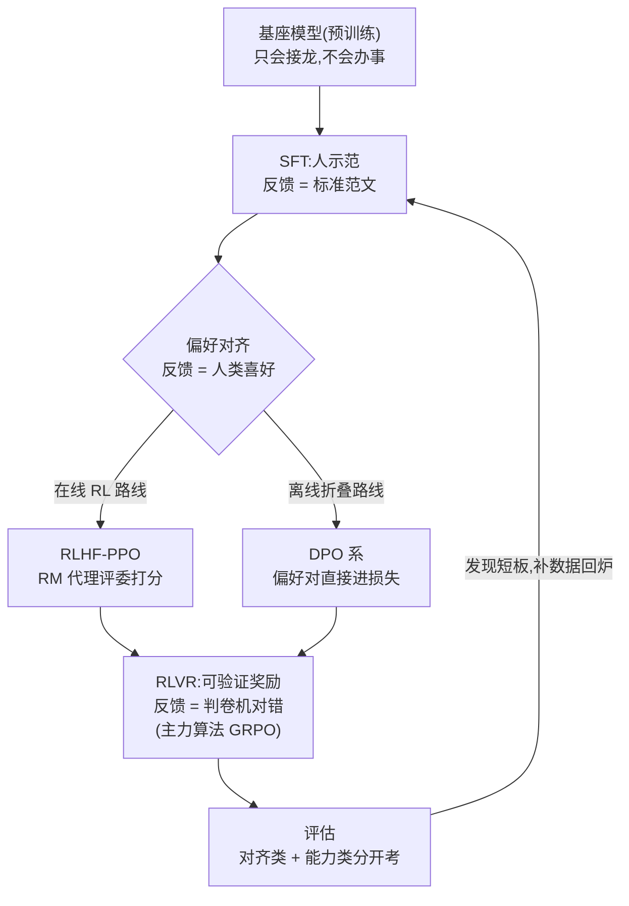

# 后训练总览(SFT → RLHF → DPO → RLVR)

一句话:**后训练回答一个问题——怎么把「只会文字接龙的基座」变成「有用、听话、会思考的助手」**。预训练像让模型读完了整个图书馆,后训练是上岗培训;四代技术的本质,是四种**反馈来源**的进化:照人写的范文抄(SFT)→ 听人类口味的代理评委打分(RLHF)→ 不请评委、直接看两份答案的对比(DPO)→ 不问口味、直接对标准答案(RLVR)。

本篇是全景索引:每代技术只讲「是什么、强在哪、卡在哪」,公式推导、训练细节与坑全部在各分篇(SFT 篇、PPO 篇、DPO 篇、GRPO 篇、LoRA 篇、RL训练框架篇、rollout引擎篇)。

## 一、全景图:一条流水线,四种反馈

读图三个要点:

- **叠加不是替代**:四代不是「后浪拍死前浪」,现代模型几乎从左到右全走一遍,后一阶段建立在前一阶段的输出上;
- **偏好对齐是分岔口**:同一批偏好数据,走在线 RL(PPO)还是离线折叠(DPO)是路线之争,不是先后关系;
- **评估会回流**:评估不是终点站——发现短板 → 定位缺口 → 造数据 → 回炉对应阶段,是个循环。

## 二、四代技术速览

### SFT:学示范——「照范文抄」

把「prompt → 人写的好回答」当普通监督数据训练,教基座「别接龙了,要接任务」。

- **强在**:便宜、稳定,格式/语气/指令跟随立竿见影,是一切后续阶段的地基;
- **卡在**:能力上限就是数据里有什么——范文没示范过的它不会,范文里的错误它照单全收,只会模仿、不会比较;
- 数据配比、模板与损失细节见 SFT 篇。

### RLHF(PPO):学偏好——「评委打分」

人写不出完美范文,但很容易在两个回答里挑出更好的那个:先用偏好数据训一个 reward model(RM)当「人类口味的代理评委」,再用 PPO 让策略在评委面前反复答题、按分数更新。

- **强在**:能超越示范水平——评委认得出比范文更好的答案,在线采样还自带探索;
- **卡在**:RM 只是口味的代理,会被策略钻空子讨好(reward hacking);四模型同台,最贵最难调;
- clip 目标、GAE 与四模型工程形态见 PPO 篇。

### DPO 系:偏好折成监督损失——「不请评委,直接看对比」

DPO 发现 RLHF 目标有闭式解,可以跳过显式 RM 和在线采样,把偏好学习直接写成一个二分类式损失——「你的语言模型悄悄就是个奖励模型」。

- **强在**:只剩两个模型、纯离线数据,训起来像 SFT 一样稳,成本低一个量级;
- **卡在**:离线是天花板——数据不动、策略在动,训着训着就走出数据覆盖范围,而且没有探索;
- 三步推导链、logp 双降陷阱与 IPO/KTO/SimPO 变体见 DPO 篇。

### RLVR(GRPO):学对错——「判卷机对答案」

把评委换成判卷机:数学题精确比对答案、代码跑单元测试,奖励来自**可自动验证的对错**——规则写死,讨好不动(不可 hack),于是可以放心大规模刷题。配上免 critic 的 GRPO(组内相对得分当优势),成为推理能力的发动机:DeepSeek-R1 用「SFT 冷启动 → 推理 RL → 蒸馏」配方引爆了长思维链。

- **强在**:奖励干净可靠、题目可以无限刷,推理能力上限最高;
- **卡在**:只覆盖可验证领域(math/code/精确指令),写诗没法判对错;整组全对或全错就没梯度;
- 注意两个概念正交:**RLVR 说的是「奖励从哪来」,GRPO 说的是「怎么优化」**——RLVR 也能用 PPO 跑(Tulu 3 就是);优势估计与 rollout 细节见 GRPO 篇。

## 三、什么时候用什么:决策表

按「目标 × 数据形态 × 预算」三个坐标查表:

| 目标 | 手里的数据 | 预算 | 推荐路线 |
| --- | --- | --- | --- |
| 格式/指令跟随/领域知识注入 | 几千~几万条示范 | 小 | 只做 SFT(显存紧张上 LoRA,见 LoRA 篇) |
| 主观偏好:语气/安全/风格 | 离线偏好对 | 小~中 | SFT → DPO 系,要快要稳 |
| 主观偏好 + 长期在线滚动优化 | 偏好对 + 持续标注管线 | 大 | SFT → RM + PPO |
| 推理能力:math/code/agent | 可验证题库 | 中~大 | SFT 冷启动 → GRPO 系 RLVR |
| 全能助手(工业界标配) | 以上都有 | 大 | SFT → DPO → RLVR 混合套餐 |

## 四、对比大表

| 维度 | SFT | RLHF(PPO) | DPO 系 | RLVR(GRPO) |
| --- | --- | --- | --- | --- |
| 信号来源 | 人写的示范 | RM(偏好的代理) | 偏好对的隐式 reward | verifier 判对错 |
| 在线性 | 离线 | 在线 rollout | 离线(iterative 可近在线) | 在线 rollout |
| 成本 | 低 | 最高(四模型) | 低(近似 SFT) | 中(免 critic,但要多倍采样) |
| 天花板 | 数据里有什么 | RM 的辨别力 | 离线数据的覆盖范围 | 题库规模与可验证边界 |
| 典型失败模式 | 过拟合、错误照抄 | reward hacking、训崩 | logp 双降、越训越啰嗦 | 零梯度组、长度漂移 |

失败模式一句话版:

- **reward hacking**:学生猜中评委口味,分数涨、真实水平没涨(详见 PPO 篇);
- **logp 双降**:DPO 只考核「领先第二名多少」,chosen/rejected 的绝对概率可能一起跌(详见 DPO 篇);
- **零梯度组**:GRPO 一组回答全对或全错,组内标准化后优势全为 0,这批题白采了(详见 GRPO 篇)。

## 五、贯穿后半程的公共零件:reference 模型与 KL 约束

SFT 之后的每一代都拴着同一根「风筝线」——用 reference 模型加 KL 约束,防止策略为了拿分说胡话,只是形态不同:

- PPO 把 per-token KL 折进 reward;GRPO 把 KL 当独立项直接加在 loss 上(两篇的经典对比点);
- DPO 根本不显式算 KL——β 就是隐式的弹簧劲度,越大越贴着 reference;
- 纯可验证奖励下(R1-Zero 风格)反而常把 KL 去掉换更快提升——判卷机不怕被讨好,风筝线可以松。

## 六、真实配方快讲

- **InstructGPT(2022)**:确立「SFT → 训 RM → PPO」三阶段范式,一切故事的起点;1.3B 对齐后的模型人评胜过 175B 基座——对齐比堆参数便宜。
- **Tulu 3(2024)**:开源全配方样板,SFT → DPO → RLVR 三段全走,数据/代码/评估全公开;「RLVR」这个词就出自它(用数学、精确指令跟随等可验证任务做 RL)。
- **DeepSeek-R1(2025)**:多轮 SFT + RL 交替——R1-Zero 先证明纯 RL 能自发长出推理;正式版走「少量长 CoT 冷启动 SFT → 推理 RL(GRPO)→ 拒绝采样造新 SFT 数据 → 全场景再 RL」,最后蒸馏到小模型。

共同规律:**SFT 永远先行**——先教会格式与作答骨架,RL 才有可优化的起点(直接上 RL 连格式分都拿不到,全是零梯度组);偏好与可验证奖励在其上分层叠加,现代 pipeline 常是「SFT → DPO → RLVR」混合套餐。

## 七、工程串联

- **双引擎系统**:RL 阶段一半是推理(rollout 采样)、一半是训练(参数更新),两边还要频繁同步权重;整体架构与框架选型见 RL训练框架篇;
- **采样端**:rollout 吃掉大头算力,vLLM 等引擎的吞吐优化、权重同步与数值一致性坑见 rollout引擎篇;
- **省钱开关**:SFT/DPO 配 LoRA 能把门槛打到消费级显卡;RL 也可只训 LoRA 降成本,但追上限的大厂通常全参——取舍见 LoRA 篇。

## 八、评估:「讨喜」与「做对」分开考

- **对齐类**(像不像好助手):MT-Bench、Chatbot Arena、AlpacaEval 这类主观胜率评审;
- **能力类**(答没答对):AIME/MATH、LiveCodeBench 这类硬指标。

两条曲线必须分开画:对齐训练可能刷高讨喜度却掉能力,RLVR 可能拉高做题分却让闲聊变机械。过优化的报警信号:

- RM 分数还在涨、人评开始降——评委被讨好了;
- 回答无理由变长——长度 hack 上身;
- 熵持续崩塌——只剩一种套路,探索死了。

任何一条出现,先停训查 reward 设计,而不是继续加步数。

## 九、面试考点串联

1. 四代技术的反馈来源各是什么,一句话区分 →「开头 + 四、对比大表」
2. DPO 为什么便宜、又为什么不能完全替代 RL(离线、无探索、覆盖受限)→「二、DPO 段 + DPO 篇」
3. RLVR 为什么近两年突然爆发(奖励不可 hack + GRPO 降门槛 + R1 配方示范)→「二、RLVR 段 + GRPO 篇」
4. RLVR 和 GRPO 是什么关系(奖励来源 vs 优化算法,正交)→「二、RLVR 段」
5. 配方顺序为什么 SFT 先行、跳过会怎样 →「六、共同规律」
6. reward hacking / logp 双降 / 零梯度组分别属于哪代、怎么发现 →「四、失败模式一句话版」
7. KL 约束在 PPO/GRPO/DPO 里各长什么样 →「五、公共零件」

## 相关文献

- InstructGPT(确立 SFT→RM→PPO 三阶段范式)— [arXiv:2203.02155](https://arxiv.org/abs/2203.02155)
- DPO(把偏好学习折成监督损失)— [arXiv:2305.18290](https://arxiv.org/abs/2305.18290)
- DeepSeekMath(GRPO 首次提出)— [arXiv:2402.03300](https://arxiv.org/abs/2402.03300)
- DeepSeek-R1(SFT 冷启动 → RL → 蒸馏配方)— [arXiv:2501.12948](https://arxiv.org/abs/2501.12948)
- Tulu 3(开源后训练全配方,RLVR 一词出处)— [arXiv:2411.15124](https://arxiv.org/abs/2411.15124)
