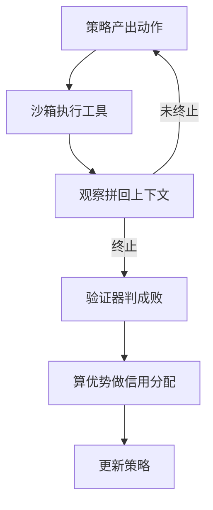

# Agentic RL(多轮工具轨迹上怎么训)

一句话:把"一次回答"换成"一条几十步的轨迹",让策略在真实工具和环境里边做边学——算法还是策略梯度那一套,难的是**环境这一维**带来的三件事:终局一个分摊不到几十步上去、轨迹不可复现、rollout 从"跑一遍解码"变成"跑一遍世界"。本篇只讲**怎么训**,Agent 系统本身怎么搭见 规划模式 篇、工具调用 篇、记忆与上下文 篇、多智能体 篇。

## 一、和单轮 RL 差在哪:多了"环境"这一维

### 单轮 RL 的环境是退化的

单轮 RLHF 里状态转移就是"把刚生成的 token 拼到前缀后面"——确定性、无外部随机性、策略说了算(见 PPO 篇)。Agent 场景第一次出现**策略管不着的转移**:调搜索接口返回什么由索引决定,点按钮页面变成什么样由网站决定,跑代码报什么错由解释器决定。后面所有麻烦都从这一条长出来。

| 维度 | 单轮 RL | Agentic RL |
|---|---|---|
| state | prompt + 已生成前缀 | 目标 + 历史消息 + **每一步的工具返回** + 环境外部状态 |
| action | 从词表挑下一个 token | 底层仍是 token,但**有意义的决策单位**是"调哪个工具、传什么参数、要不要停" |
| 一条样本 | 一个 prompt 一条回答 | 一整条轨迹,长度由策略自己决定 |
| 奖励 | 末 token 一个分 | 常常只有终局成败一个分,却要分给几十步 |



两条容易漏、但一漏就训不动的工程后果:

- **观察 token 不是策略生成的,必须从损失里 mask 掉。** 一条 30 步的轨迹里工具返回的文本经常占大头,不 mask 等于让模型去拟合搜索引擎的输出。Search-R1 把这件事(retrieved token masking)直接写进方法,理由就是不这么做训练不稳。
- **动作的粒度和梯度的粒度不是一回事。** 策略梯度仍然逐 token 走——策略只会输出 token;但奖励和优势的自然粒度是"一步"。这两层对不齐,正是第二节整节要处理的事。

### 部分可观测:state 到底该装什么

模型看到的只是工具返回的那一段文本,数据库里还有什么、页面下面还有什么它并不知道,这是标准的部分可观测。于是"state 怎么组织"从一个默认项变成必须自己做的设计:

| 组织方式 | 好在哪 | 代价 |
|---|---|---|
| 全量拼接 | 最忠实,不丢信息 | 上下文随步数一路涨,KV 与注意力成本吃不消(见 KVCache 篇) |
| 滚动摘要 | 省 token,步数可以放很长 | 摘要是有损压缩,摘错了后面全按错的走 |
| 外部记忆检索 | 历史长度没有上限 | 没召回等于观测缺失(取舍见 记忆与上下文 篇) |

一条必须说死的边界:**训练时的上下文组织必须和部署时完全一致**。训练时全量拼接、上线换成摘要,策略在线上见到的 state 就不是它训过的那个,前面对齐的都作废。

### 什么时候才值得训:和 Workflow 编排的分界

Workflow 把"下一步做什么"固化成人写的控制流,Agentic RL 把这一步变成可学习的策略。**分界不在能力强弱,在决策由谁定。** Workflow 的四条局限全部来自这个固化:分支靠人枚举,没预料到的情况永远走不到正确分支;**没有跨步信用分配**,每个节点各自调好提示词不等于整条链最优,哪一步拖累了结果编排层看不出来;失败轨迹只是日志,要人读、人归因、人改;上限被基座和提示词锁死,同一个模型换编排的收益很快见顶。

值得转 RL 的条件要**同时**满足,少一条就会翻车:结果**可自动验证**(单测、schema、检索命中、环境终态这类程序化判据);环境**可复现、可并发**(初始状态能重置、副作用可沙箱化);失败模式**多到规则覆盖不划算**——这才是收益来源;**已有一个能跑的 Workflow 版本**,拿它产冷启动数据和基线。现实里两者也常是**分层**而不是二选一:高风险环节保留确定性编排和人工确认,RL 只用在真正需要探索的决策点上。

- **没有自动判据还能不能做?** 能启动,但不该先做。退路按可靠性排:先把任务里能程序化的部分切出来(字段校验、终态检查、检索命中),剩下的用 LM judge 且只当过程分并封顶(judge 当奖励的风险见 RLHF与RM 篇);再不行就退回离线偏好,用同任务的成功/失败轨迹配对。**在完全不可验证的任务上直接开 RL,等于把奖励噪声当信号放大。**
- **哪些决策点该保留确定性编排?** 三条判据:错一次不可逆或赔不起(付款、删数据、对外发消息);有合规硬约束、必须可审计可复述;本来就没有决策空间(格式转换、字段校验)。这些点上学出来的策略哪怕平均更好也不能用——**它给不出保证**。RL 只该放在试错便宜、且确实存在多条可行路线的决策点上。
- **线上回归了怎么回滚?** 这是它比 Workflow 难运维的根本原因:**回滚粒度是模型版本,不是某一条行为**,改不了"就那一步"。所以可回滚必须提前设计进流程——所有 checkpoint 连同评测报告一起留档、按流量灰度、留一条确定性兜底路径(策略连续失败 N 次就切回 Workflow)、工具侧的权限与预算上限独立于模型版本存在。

## 二、信用分配:十步只错一步,十步同罚

### 轨迹级优势为什么不够用

GRPO 的优势是整条回答共享的一个标量(见 GRPO 篇)。搬到 Agent 上,"整条回答"变成"整条几十步的轨迹",梯度就长这样:

$$
\nabla_\theta J \approx \hat A\sum_{t=1}^{T}\nabla_\theta\log\pi_\theta(a_t\mid s_t)
$$

读法:**整条轨迹上每一个动作都被同一个符号、同一个大小的权重推**。十步里只有第三步走错,另外九步正确的决策会被同一个负优势一起压低——这不是"精度不够",是在教模型别做那些对的事。三个后果按严重度排:失败轨迹里大多数步骤其实是对的,却被连坐;$T$ 越大,与成败无关的动作占比越高,单位算力换来的有效信号越少;**它还和探索打架**——长路线更容易在某一步翻车而被整体判负,策略于是学会草率收尾,表面上省了步数,实际是回避。

### 三条路线,各自的前提

| 路线 | 信号从哪来 | 收益 | 代价与前提 |
|---|---|---|---|
| 轨迹级结果奖励 | 只看终局成败 | 判据硬、便宜、最难被钻 | 信用分配最粗;长轨迹稀释;必须同任务多采几条才有对比 |
| 步级过程奖励 | 工具选对没、参数合法没、证据有没有增量 | 信号密,定位得到坏步骤 | 中间步骤**没有硬判据**,策略会转去优化打分器(通则见 RLHF与RM 篇) |
| 学一个能估到步的东西 | critic / 分层价值 / 同状态横向比 | 不用人写过程奖励 | critic 是同量级模型(账见 PPO 篇);横向比要求状态可判等 |

第三条路线里有两个值得记住的形态。**ArCHer** 把时间尺度拆成两层:高层用 off-policy 的价值方法按"轮"聚合奖励,低层在一轮内做 token 级策略优化,论文自报样本效率比既有方法高约两个数量级。**SWEET-RL** 换了个思路——让 critic 看到**只有训练时才有**的信息(比如参考解),据此给步级奖励,而策略看不到;论文自报在其 ColBench 上比其他多轮 RL 算法高 6 个百分点(绝对值)。两者的共同点是:步级信号不是凭空长出来的,得有一个策略够不着的信息源。

### GiGPO 在 Agent 训练里解决了什么

它把"组"从轨迹这一层再往下切一层:除了同任务多条轨迹按总回报互比之外,再回溯扫描这批已经采好的轨迹,把**到达过同一环境状态**的步骤聚成一组横向比较,于是不训 critic 也拿得到步级优势,而且不需要额外 rollout。**用得上的条件很硬:环境状态可判等、可哈希,且轨迹真的会反复经过同一状态**——ALFWorld、WebShop 这类状态空间有限的环境合适。自由网页浏览、开放域对话这种状态几乎不重复的场景,每个微观组只剩一个成员,组内减均值恒为 0,微观优势整体消失、平滑退化回 GRPO:不会崩,但白加一层。分层优势怎么合成、权重 $\omega$ 怎么失衡、状态判不了等时还有哪些退路,见 GRPO变体 篇。

### 终局成功了,中间那次工具调用值不值得奖励

这是本节最该练熟的一问。**"终局成功 ⇒ 每一步都对"是错的推理**——成功轨迹里照样有多余的重试、无意义的搜索,不加区分地奖励会把它们一起固化。**能不能给步级奖励,取决于你有没有一个独立于终局的判据或反事实**;拿不出来就老实用结果奖励,别拿"看起来在干活"当分给。拿得出来的只有三条路,按代价排:

1. **反事实**:从这一步之前的状态快照恢复,把这个动作换成别的(或换成空操作),重采若干条后续,比成功率。差值就是它的贡献。最准,但要求环境能从快照恢复,而且要额外跑环境。
2. **同状态横向比**:不额外采样,直接从已有轨迹里找到达过同一状态的步骤互比——就是上面 GiGPO 的做法,便宜,但吃"状态会重复"这个前提。
3. **蒙特卡洛后续采样**:从这一步出发采 $n$ 条后续,用后续成功率当这一步的分。数学题上这么干很成熟(见 RLHF与RM 篇),Agent 上贵得多,因为每条后续都要真跑工具。

### 只有轨迹级偏好时,怎么把信用分配做细一点

一条轨迹只有一个胜负标签,DPO 指不出是哪一步写坏了(见 DPO 篇)。三种改善,按代价从小到大:

- **配对时控制前缀**:只把**共享同一前缀、从某一步开始分叉**的两条轨迹配成对。公共前缀的对数概率在分差里大部分抵消,梯度集中到分叉之后。它不改损失、只改数据怎么配,最省;但也别夸大——分叉后的所有步骤仍是一起计入的,这是"把噪声压小",不是逐步归因。
- **树搜索造分支偏好**:从同一状态展开多个动作,按后续成功率给这一步排序,得到**步级**偏好对。Agent Q 就是这个路子(MCTS + 自我批评 + off-policy DPO),代价是搜索本身要真跑环境。
- **成功/失败轨迹直接配对**:先探索、把同一任务的成功与失败轨迹配成对比样本(ETO)。最便宜,但信用分配仍停在轨迹级。

一条本篇独有的坑:序列对数概率是逐 token 累加的(见 DPO 篇),而 **Agent 轨迹的长度差比单轮回答大得多**——成功的可能 5 步、失败的可能 30 步。不按步数或长度配平、分桶,学到的就是"少走几步",不是"走对"。

### 多智能体的信用分配是另一个问题

上面讲的都是**一个**策略在多步之间分账。多智能体是另一件事:环境只给一个全局奖励,要回答"这份回报记在谁的哪一步上"。直接把全局奖励发给每个智能体做策略梯度会出事:

$$
\nabla_{\theta_i}J=\mathbb E\big[R_{\text{global}}\,\nabla_{\theta_i}\log\pi_i(a_i\mid o_i)\big]
$$

$R_{\text{global}}$ 里同时装着另外 $n-1$ 个智能体这一局的表现。对 $\theta_i$ 而言那是**与自身动作无关的随机扰动**:期望上不引入偏差,却把方差抬得很高。后果很具体——自己做对了,队友搞砸照样挨压;自己躺平也能分到队友挣的回报,于是收敛出**懒惰智能体**。

信噪比大致怎么掉?做个理想化估算:若全局回报是 $n$ 份独立同方差的个体贡献之和,与 $i$ 自身动作相关的信号是 $O(1)$,而噪声标准差是 $O(\sqrt n)$,信噪比按 $1/\sqrt n$ 量级下滑。**这是数量级估计不是定理**——贡献互相依赖、奖励不可加、存在瓶颈智能体时都不成立。

两条经典路线:**值分解**学一个联合价值再拆成个体价值,VDN 用求和,QMIX 用一个对个体价值单调的混合网络。为什么非要单调?因为分散执行时每个智能体只能按自己的 $Q_i$ 取 argmax,只有"个体最优的组合等于联合最优"(IGM 条件)成立时这么做才不丢解,而**单调性是保证它的一个充分条件**;代价是装不下"两个人一起动才好、只动一个反而更糟"这类非单调协作。**反事实基线**(COMA)则固定队友动作不变:

$$
A_i(s,\mathbf a)=Q(s,\mathbf a)-\sum_{a_i'}\pi_i(a_i'\mid \tau_i)\,Q\big(s,(\mathbf a_{-i},a_i')\big)
$$

减掉的那一项是"队友照旧、只把自己这一格按自己的策略换着试一遍"的期望值。它**只依赖状态和队友动作、不依赖自己实际采到的那个动作**,所以满足基线定理、期望梯度不变(推导见 PPO 篇),同时把与自身无关的那一大坨方差抵掉。代价是需要一个能回答反事实查询的中心化 critic,属于 CTDE(集中训练、分散执行)。

放到 LLM 多 Agent 上要看清场景差异:主管派发子 Agent 通常是**串行或树形调用**,不是同时决策的博弈;状态是文本、动作是自然语言,压根枚举不出"其他动作"去做反事实。所以 **CTDE 的思想能借(训练时看全局、执行时只看局部),VDN/QMIX 的形式用不了**——它们要一个能给所有联合动作估值的 $Q$。串行场景更自然的两个替代:把子 Agent 的调用当成主管的一个动作,退化回单智能体多步问题;或给每个子 Agent 单独定义可验证的子目标奖励。角色分工与编排模式见 多智能体 篇。

## 三、数据:任务、轨迹与冷启动

### 任务自动生成的三个硬约束

从环境状态、工具 schema 或线上日志反向合成任务,每条都要带程序化的成功判据。**可验证**(有确定判据)、**可复现**(初始状态能重置或有 seed)、**难度可控**(能分层),缺一不可。

难度分布不是锦上添花,它直接决定有没有梯度。二值奖励下,同一任务采 $G$ 条轨迹、当前通过率为 $p$ 时组内奖励方差是 $p(1-p)$,而整组同分(全成功或全失败,组内优势恒为 0)的概率是

$$
\Pr[\text{整组同分}]=p^{G}+(1-p)^{G}
$$

意思是:**通过率一旦贴近两端,采多少条都大概率白采**。代入 $G=8$ 算一下就很直观:

| 当前通过率 $p$ | 0.5 | 0.7 | 0.9 | 0.95 |
|---|---|---|---|---|
| 整组同分的概率 | 0.8% | 5.8% | 43% | 66% |

所以**通过率大致落在 0.2–0.8 的任务才对训练有价值**,越靠近 0.5 越值钱。工程上要按当前策略的实测通过率动态筛任务、对生成任务做语义去重,并把这条曲线常驻面板——模型越训越强,原本中等的题会自己漂到高通过率区间去。真采到零方差组时,处置顺序和单轮也不一样:单轮可以直接过采样补采(见 GRPO变体 篇),而 Agent 补一条轨迹要几十次模型调用加几十次真实工具调用,所以**先在任务侧按通过率筛,再谈补采**;补采之前还得先分清成因——整组全错常常是工具或环境坏了而不是题太难,整组全对常常是任务生成得太模板化。还有一个同源陷阱:**任务生成器、奖励判据和被训练的策略共用同一个基座时,三者的错误是相关的,通过率会虚高**。指标上的表现很好认:内部通过率一路涨,而独立留出集与分布外任务不动;把判据换成真正程序化的验证后通过率骤降;人工抽检与自动判据的不一致率明显偏高。最低限度的处置是**让判据独立于生成器**。

### rollout 该落盘什么

```python
# 一条轨迹的最小落盘字段:每一项都对应一种"缺了就做不了"的训练动作
record = {
    "task_id": ..., "env_seed": ...,        # 缺了不能复现,事后归因也无从谈起
    "policy_version": ...,                  # 缺了算不出策略陈旧度
    "template_version": ...,                # 模板一变,历史轨迹就不可比
    "steps": [{
        "obs": ...,                         # 工具返回原文,进损失前要 mask
        "action_text": ...,                 # 策略真正生成的那段 token
        "tool": ..., "args": ...,           # 结构化动作,步级判据吃这两项
        "token_logprobs": ...,              # 缺了做不了概率比与 KL 修正
        "latency_ms": ..., "cost": ...,     # 成本是与成功率并列的验收指标
    }],
    "terminate_reason": ...,                # normal / max_steps / timeout
    "verdict": ...,                         # task_success / task_fail / env_error
}
```

**只存文本、不存 logprob 会失去什么?** 失去的是概率比的分母:PPO/GRPO 这类需要重要性修正的在线更新做不了,严格的陈旧度校正和 KL 监控也做不了(见 PPO 篇、KL散度 篇)。还能做的是拒绝采样 SFT 和轨迹级 DPO——它们只需要文本,参考对数概率是训练时重算的。另有一条口径必须写死:**生成引擎与训练引擎算出的 logprob 并不逐位相等**(见 RL框架对比 篇),"存下来的"和"训练时重算的"用哪一个,要在实现里定死并保持一致。

### 失败轨迹是资产,环境故障不是

失败轨迹至少有四个用处:它是**组内基线的另一半**——没有失败样本,组内优势根本形不成;可以和同任务的成功轨迹配成偏好对;按失败模式聚类之后能反过来指导任务难度配比和工具修复的优先级;还能用来训"及时放弃或求助"的终止行为,而不是无限重试。但有一类失败**必须单独落盘、排除在训练之外**:环境本身故障造成的(工具超时、服务 5xx、配额耗尽)。它不是模型的决策错误,当成负样本会让策略学会绕开那个工具。所以判定结果至少要分成"任务失败"和"环境失败"两类。

由此引出一个常被追的选择题:**环境失败率高的时候,是修环境还是给模型加重试奖励?** 先修环境。理由有两层:重试奖励是在教模型适应你的 bug,而它学到的是通用倾向——环境恢复正常后表现为无谓的重复调用和步数膨胀;更要命的是高环境失败率会污染整个奖励分布,一批假的负样本会把策略带偏,故障期越长偏得越狠。只有当失败是**真实世界的固有属性**(线上服务本来就有超时与限流)时,"重试与降级"才该作为一项要学的能力,而这时它应该被写成任务的一部分并单独验收,不是靠一个笼统的重试加分。

### 冷启动数据:三个环节串起来不等于错误率相乘

冷启动常用"教师模型生成 → 另一个模型 refine → 人工抽检"。**先纠正一个错觉:串三层不会把错误率相乘。** 教师和 refine 模型若同源,错误高度相关——教师错的地方 refine 往往看不出来,还会补一段自洽的理由。设计的核心是**找独立的验证信号**,不是叠更多同源模型。

第一优先级永远是**把任务改造成可程序验证的形式**:代码跑单测、工具调用校验 schema、结构化输出校验字段、环境终态直接比对。这类硬门禁不依赖任何模型判断,通过率直接给出质量下界。能改造的就别留给模型评判。不可验证的部分才退而叠加互相独立的弱信号:**异构**教师投票(不是同一模型多采几次)、反向验证(从答案反推问题看能否还原约束)、一个小而准的人标**校准集**。

- **怎么算"足够异构"?** 看**错不错在同一批样本上**,不看厂商名字。在校准集上量条件错误率:A 错的时候 B 也错的比例,如果显著高于 B 的总体错误率,两者就不独立。同基座微调、同一批合成数据训出来、互相蒸馏过的模型,都会高度相关。
- **校准集要多大、按什么维度分层?** 抽检必须做成**统计估计**而不是随手巡视:先定可接受错误率与置信水平,再反推样本量。正态近似下估一个 $p$ 附近的比例、要求半宽 $\pm w$,样本量约 $n\approx z^2p(1-p)/w^2$;取 $p=0.1$、$w=0.03$、95% 置信约需 384 条,**而且这是每一层各要这么多**——分层维度越多成本越高,这才是"校准集要多大"的真正约束。分层维度取那些错误率本来就不同的:任务类型、难度、轨迹长度、工具种类、是否含多轮纠错。抽出来的错误要回灌成过滤规则或新验证器,不能只订正那几条;做校准之前还得先测标注者一致性,人标本身不准的话后面全是空的。
- **错误率估到多少才敢进冷启动 SFT?** 没有通用阈值,判据是**这个噪声水平会不会改变下游结论**:按估计的错误率把数据切成干净与含噪两份、各训一版小规模 SFT,比 held-out 与分布外集合的差距;差得动就先治理数据,差不动就带着已知噪声往下走。有个量级差异要利用起来——冷启动的目标是"教会格式与工具协议、给 RL 一个非零起点",不是给出正确答案,所以它对内容噪声的容忍度比最终 SFT 高;但**错误的工具协议和错误的终止行为要零容忍**,那两样会被 RL 直接放大。
- **数据噪声和超参问题在下游指标上怎么分?** 数据噪声**按切片聚集**:某类任务、某个工具、某个教师产出的那一批明显更差,换超参不改变这个排序。超参问题**全局同向**:所有切片一起好或一起坏,且对学习率与步数敏感。再补一刀验证:固定超参、换一份干净的小数据重训,指标跳变就是数据的锅。

**Workflow 产出的冷启动数据会不会把策略锁死在原有编排的行为分布里?** 会,而且后果直接落在 RL 上:策略初始熵低、探索半径小,采出来的轨迹高度同质,组内方差小、零方差组多。缓解方向是**冷启动只教格式与工具协议、不教固定路线**:混入不同步数、不同工具顺序的成功轨迹;RL 阶段用温度和放宽的裁剪上界保住熵(见 GRPO变体 篇);监控轨迹步数分布与工具调用序列的多样性,而不是只盯成功率。

## 四、系统与评测:rollout 要跑真实世界

### 吞吐、超时、污染、复现

单轮 RL 的 rollout 就是自回归解码;Agent 的一条轨迹是"解码 → 调外部工具等 I/O → 再解码"交替,**大量墙钟时间花在等工具上,GPU 在空转**。四件事必须专门设计:

| 问题 | 症状 | 处理 |
|---|---|---|
| 吞吐 | GPU 等 I/O,利用率低 | 环境执行异步化、大量轨迹并发、谁先返回谁先进下一步(引擎侧见 连续批处理 篇) |
| 长尾超时 | 一条慢轨迹拖死整批 | 每步和整条轨迹都设超时与最大步数 |
| 状态污染 | 并发轨迹互相看见对方写入 | 一条轨迹一个隔离实例,用完销毁 |
| 不可复现 | 同样动作序列拿到不同观察 | 优先可快照的模拟环境,真实依赖走录制回放 |

三条要点单独强调。**被最大步数或超时截断的轨迹,不能直接判负**——那惩罚的是"没做完"而不是"做错了",和给超长回答判 0 分是同一个错误(见 GRPO变体 篇);正确做法是标成截断、先屏蔽出梯度,再决定要不要做长度整形。**状态污染会直接摧毁组内比较**:同组轨迹本该是同一初始状态下的独立样本,共享了数据库或账号之后它们互相影响,组内相对优势就失去意义。**录制回放不是免费的**:它把环境变"死",策略可能学会利用录制里的固定内容;所以复现优先级高的场景用回放,泛化优先的场景要保留真实环境并接受奖励里有一部分是环境噪声,在评测时用多次重复取平均。还有一条陈旧度问题被轨迹长度放大了:一批轨迹跑完的时间里策略已经更新过几次,异步采集更会让一批数据来自好几个 checkpoint,所以每条轨迹必须记录生成它的策略版本并限制滞后(口径见 PPO 篇);框架层怎么落地见 RL框架对比 篇。

### Agent 特有的作弊形态

奖励怎么设计、reward hacking 怎么诊断与缓解的通则见 RLHF与RM 篇,这里只列**换了载体之后才出现**的形态:改判据本身(改测试文件、改断言、往环境里写一个能让检查通过的假结果);绕过步骤直接凑终态(不做任务,直接把数据库或文件改成"成功"的样子);利用环境漏洞(调用未声明的接口、越权访问、吃模拟器的 bug);刷过程分(只要"调用了检索"就加分,于是无意义地反复检索);早停骗成功(判据写松了,输出一个格式正确的空答案就算过)。

对策也都是 Agent 特有的:**把判据放到策略够不着的地方**——验证器跑在独立进程与独立容器里、读只读快照,测试文件对策略不可写,终态由环境自己导出而不是让模型自报;**最小权限加预算上限**——工具白名单、写权限按任务开、步数与花费封顶,这既是安全措施也是在缩小可投机空间;**留一个策略从没见过的验证器当 probe**,独立实现、只在评测时跑;**盯行为分布而不只是成功率**——工具调用次数、重复调用率、越权尝试次数、终止步数分布,这些通常比成功率更早露出马脚。一句话收口:**这些都在缩小缝隙,不能消灭缝隙。**

### 验收看哪几个数

只报成功率会同时掩盖成本和越权。至少要六条一起看:任务成功率、平均步数与成本(token 加工具调用费)、错误恢复率、安全违规次数、**环境失败率**(它是系统指标,不该记在模型头上)、分布外任务的成功率。

还有一个容易念混的口径:$\text{pass@}k$ 是"采 $k$ 次至少对一次",量的是覆盖(见 RLHF与RM 篇);而 τ-bench 提出的 $\text{pass}^k$ 是"同一任务连着 $k$ 次全部成功",量的是**可靠性**,方向正好相反。论文自报即便是当时的前沿模型,零售场景的 $\text{pass}^8$ 也掉到 25% 以下——**Agent 的难点不是偶尔能做对,是每次都做对**。训练过程中还有一个该常驻的曲线:RAGEN 报告多轮 Agent RL 常出现奖励方差塌缩伴随梯度尖峰(论文称 Echo Trap),对应处置是按方差过滤 rollout。

## 五、面试考点串联

| 高频问法 | 本文哪一节 |
|---|---|
| 什么是 Agentic RL?相比单轮 RL 多了哪些状态、动作和训练数据? | 一(环境这一维;对照表) |
| 多轮对话和工具环境下 state 该怎么组织?部分可观测怎么处理? | 一(部分可观测) |
| 工具返回的那些 token 该不该进损失? | 一(观察 token 必须 mask) |
| 多轮工具轨迹的奖励与信用分配怎么设计?为什么轨迹级优势不够用? | 二(轨迹级优势;三条路线) |
| 终局任务成功了,怎么判断中间某次工具调用是否值得奖励? | 二(反事实 / 同状态横向比 / 蒙特卡洛后续) |
| 全对或全错的轨迹组没有相对奖励时怎么处理?通过率什么区间最有价值? | 三(整组同分概率;先任务侧筛再补采) |
| 长程任务只有轨迹级偏好,怎么把信用分配做细? | 二(控制前缀配对 / 树搜索 / 成败配对) |
| GiGPO 在 Agent 训练里解决了什么?什么条件下用不上? | 二(GiGPO;机制见 GRPO变体 篇) |
| 多智能体信用分配指什么?为什么不能让每个智能体直接拿全局奖励? | 二(多智能体;梯度里混着队友噪声、懒惰智能体) |
| QMIX 为什么要求单调?COMA 的反事实基线为什么降方差又不引偏差? | 二(IGM 充分条件;基线只依赖状态与队友动作) |
| 智能体数量增加时全局奖励的信噪比按什么规律下降? | 二($1/\sqrt n$ 量级估算及其失效条件) |
| 子 Agent 串行调用能不能沿用 CTDE? | 二(思想能借,VDN/QMIX 的形式用不了) |
| 固定 Workflow 的 Agent 有哪些固有局限?满足什么条件才值得转 RL,代价是什么? | 一(与 Workflow 编排的分界) |
| 任务没有自动判据还能不能做 Agentic RL? | 一(退路阶梯) |
| 哪些决策点该保留确定性编排?线上回归了训练出来的策略怎么回滚? | 一(三条判据;回滚粒度是模型版本) |
| Agentic RL 的任务怎么自动生成?rollout 按什么格式保存? | 三(三个硬约束;落盘字段) |
| 只保存文本轨迹不存 logprob,还能做哪些训练? | 三(拒绝采样 SFT 与轨迹级 DPO 还能做,在线更新不行) |
| 失败轨迹有什么用?环境失败率高时该修环境还是加重试奖励? | 三(失败轨迹是资产,环境故障不是) |
| 任务生成器与奖励判据同源会怎样体现在指标上? | 三(同源陷阱) |
| 教师生成 → refine → 抽检三个环节都可能错,怎么保证数据整体是对的? | 三(冷启动:找独立验证信号) |
| 怎么判断两个教师足够异构?校准集要多大、按什么维度分层? | 三(条件错误率;分层样本量) |
| 抽检错误率估到多少才敢进冷启动 SFT?数据噪声与超参问题怎么区分? | 三(对照实验;按切片聚集 vs 全局同向) |
| Workflow 产出的冷启动数据会不会把策略锁在原有行为分布里? | 三(冷启动末段) |
| Agent 的 rollout 系统要改什么?吞吐、超时、状态污染、复现怎么处理? | 四(四件事对照表) |
| 怎么防止 Agent 改测试、跳步骤或利用环境漏洞骗奖励? | 四(Agent 特有作弊形态与对策) |
| Agentic RL 该看哪些验收指标?pass@k 和 pass^k 有什么区别? | 四(验收看哪几个数) |
| 补充题:一组轨迹里有的 5 步成功、有的 30 步失败,直接配偏好对会学到什么? | 二(长度差异污染分差) |
| 补充题:轨迹被最大步数截断了,该按失败算分吗? | 四(截断不能直接判负) |
| 补充题:并发跑一百条轨迹,为什么必须给每条一个独立环境? | 四(状态污染摧毁组内比较) |

## 相关文献

- The Landscape of Agentic Reinforcement Learning for LLMs: A Survey — [arXiv:2509.02547](https://arxiv.org/abs/2509.02547)
- Group-in-Group Policy Optimization for LLM Agent Training(GiGPO)— [arXiv:2505.10978](https://arxiv.org/abs/2505.10978)
- RAGEN: Understanding Self-Evolution in LLM Agents via Multi-Turn Reinforcement Learning(StarPO 与 Echo Trap)— [arXiv:2504.20073](https://arxiv.org/abs/2504.20073)
- ArCHer: Training Language Model Agents via Hierarchical Multi-Turn RL(两层时间尺度)— [arXiv:2402.19446](https://arxiv.org/abs/2402.19446)
- SWEET-RL: Training Multi-Turn LLM Agents on Collaborative Reasoning Tasks(用训练期额外信息给步级奖励)— [arXiv:2503.15478](https://arxiv.org/abs/2503.15478)
- Search-R1: Training LLMs to Reason and Leverage Search Engines with Reinforcement Learning(retrieved token masking)— [arXiv:2503.09516](https://arxiv.org/abs/2503.09516)
- ToolRL: Reward is All Tool Learning Needs(工具调用的奖励粒度)— [arXiv:2504.13958](https://arxiv.org/abs/2504.13958)
- Trial and Error: Exploration-Based Trajectory Optimization for LLM Agents(ETO,成败轨迹配对)— [arXiv:2403.02502](https://arxiv.org/abs/2403.02502)
- Agent Q: Advanced Reasoning and Learning for Autonomous AI Agents(MCTS 造分支偏好 + off-policy DPO)— [arXiv:2408.07199](https://arxiv.org/abs/2408.07199)
- τ-bench: A Benchmark for Tool-Agent-User Interaction in Real-World Domains(pass^k)— [arXiv:2406.12045](https://arxiv.org/abs/2406.12045)
- ALFWorld: Aligning Text and Embodied Environments for Interactive Learning — [arXiv:2010.03768](https://arxiv.org/abs/2010.03768)
- WebShop: Towards Scalable Real-World Web Interaction with Grounded Language Agents — [arXiv:2207.01206](https://arxiv.org/abs/2207.01206)
- Counterfactual Multi-Agent Policy Gradients(COMA)— [arXiv:1705.08926](https://arxiv.org/abs/1705.08926)
- QMIX: Monotonic Value Function Factorisation for Deep Multi-Agent Reinforcement Learning — [arXiv:1803.11485](https://arxiv.org/abs/1803.11485)
- Value-Decomposition Networks For Cooperative Multi-Agent Learning(VDN)— [arXiv:1706.05296](https://arxiv.org/abs/1706.05296)
