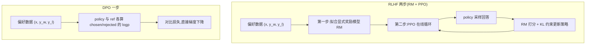

# DPO(Direct Preference Optimization)

> ⚠️ 旧版:本篇写于写作契约确立之前,尚未按新标准审查重写。标准见 docs/05-知识库写作契约.md,样板见「GPU架构与执行模型」。

一句话:**DPO 在成对偏好数据上直接训练策略,省去显式奖励模型和在线强化学习循环。** 它利用 KL 正则奖励目标与偏好模型之间的数学关系,但有限数据和模型上的训练不保证与 PPO 得到同一策略。

## 一、动机:PPO 流水线太重

标准 RLHF(InstructGPT 配方)分两步:先在偏好数据上拟合一个奖励模型(RM,相当于先培养一位「评委」),再用 PPO 让策略在评委面前反复表演、按打分更新。痛点:

- **四个逻辑角色要协同**:policy(训练)、reference(防跑偏)、reward model(打分)、critic(估价值)。它们可以共享、量化或卸载,实际显存取决于实现,但生成、打分和价值学习的调度链仍较长;
- **超参敏感、训练不稳**:clip 范围、GAE、KL 系数、reward 归一化……任何一个没调好都可能崩,复现困难;
- **贵**:训练全程要不停在线采样(rollout),生成本身就吃掉大头算力。

DPO 的问题意识:RLHF 的优化目标其实有解析结构,能不能**跳过显式 RM 和在线采样,直接对偏好数据写出一个损失函数**?答案是能,而且推导出奇地干净。

## 二、推导链:三步从 RLHF 走到 DPO

### 第 1 步:KL 约束下的奖励最大化有闭式解

RLHF 的目标——最大化奖励,同时不许离参考模型太远。KL 项像一根把策略拴在 $\pi_{\mathrm{ref}}$ 上的弹簧,$\beta$ 是弹簧的劲度系数:

$$
\max_{\pi}\ \mathbb{E}_{x\sim\mathcal{D},\,y\sim\pi}\!\left[r(x,y)\right] - \beta\, D_{\mathrm{KL}}\!\left(\pi(\cdot|x)\,\|\,\pi_{\mathrm{ref}}(\cdot|x)\right)
$$

这个目标不用任何迭代,最优策略可以直接写出(闭式解,「一步到位的公式解」):

$$
\pi^{*}(y|x) = \frac{1}{Z(x)}\,\pi_{\mathrm{ref}}(y|x)\,\exp\!\left(\frac{r(x,y)}{\beta}\right)
$$

直觉:最优策略 = 参考策略 × 按奖励做指数加权,奖励越高的回答概率被放大得越多,$\beta$ 越大放大得越保守。$Z(x)$ 是配分函数(归一化分母)——把所有可能回答的权重加总,保证概率和为 1;它要遍历整个回答空间,**根本算不动**,这正是下面推导的关键伏笔。

### 第 2 步:反解奖励——从「最优行为」反推「评分标准」

把闭式解取对数、移项,奖励就能用策略反表示出来(类比:从学霸的答题偏好反推出阅卷细则):

$$
r(x,y) = \beta \log\frac{\pi^{*}(y|x)}{\pi_{\mathrm{ref}}(y|x)} + \beta \log Z(x)
$$

### 第 3 步:代入 Bradley-Terry,配分函数抵消

Bradley-Terry 是经典的成对比较模型(Elo 等级分的底层假设):两个回答谁被偏好,由奖励差经 sigmoid 压成 0–1 的胜率:

$$
P(y_w \succ y_l \mid x) = \sigma\!\left(r(x,y_w) - r(x,y_l)\right)
$$

把第 2 步的 $r$ 代进去:两项都带 $\beta \log Z(x)$,同一个 $x$ 下相减**恰好抵消**——就像两名选手的成绩都加了同一个底分,比高低时底分无所谓。算不动的 $Z(x)$ 彻底消失,对偏好数据做极大似然(负对数似然),就得到 DPO 损失:

$$
\mathcal{L}_{\mathrm{DPO}} = -\,\mathbb{E}_{(x,y_w,y_l)\sim\mathcal{D}}\left[\log\sigma\!\left(\beta\log\frac{\pi_\theta(y_w|x)}{\pi_{\mathrm{ref}}(y_w|x)} - \beta\log\frac{\pi_\theta(y_l|x)}{\pi_{\mathrm{ref}}(y_l|x)}\right)\right]
$$

训练批次只需计算 policy 在 chosen/rejected 上的 logp,以及对应的 reference logp；固定离线数据时后者可预计算。优化本身是一个二分类式损失,不需要在线采样、显式 RM 或 critic。模型数量和前向次数取决于缓存、共享与卸载方式,不能写成固定硬件结论。

### 与显式 Reward Model 训练的边界

两者都可读取 $(x,y_w,y_l)$,也都出现 Bradley-Terry 的 logistic 似然,但被训练的对象不同。RM 学标量 $r_\phi(x,y)$,产物是给新回答打分的评委;DPO 学 $\pi_\theta$,把策略相对 reference 的 logp 差当隐式奖励,产物就是生成策略。RM 训练结束后还需 PPO/GRPO 等优化策略,DPO 则在这一阶段直接更新策略。

这不表示 DPO “显式建模了一个更准确的 RM”。它只是通过特定参数化消去了独立 RM;标注偏差、BT 假设和离线覆盖问题仍在。PPO 可以在当前策略分布上持续采样并接收外部奖励,DPO 的标准版只能学习已有偏好对。

## 三、隐式奖励、β 与梯度直觉

### 隐式奖励

定义 $\hat{r}_\theta(x,y) = \beta \log\dfrac{\pi_\theta(y|x)}{\pi_{\mathrm{ref}}(y|x)}$,DPO 损失就是「用隐式奖励差做二分类」。训练完的策略自带一个奖励函数:logp 相对参考模型抬升多少,就是它给这个回答打的分——这就是「你的语言模型悄悄就是个奖励模型」的确切含义。这个隐式奖励也能单独拿出来当 RM 用(给候选回答排序)。

### β 的作用

$\beta$ 在原始 KL 正则奖励目标中控制偏离 reference 的代价:对固定奖励,较大 β 的最优策略更保守。DPO 的成对损失里,β 同时缩放偏好分差和梯度,因此实际训练轨迹还依赖学习率、训练轮数与数据;不能把“β 调大”当作所有异常的通用解法。

β 太大时,已排对样本的 sigmoid 可能较快饱和,错排样本的梯度则仍可能很大;β 太小时,固定学习率下的初始梯度也较小,并不意味着每一步都更激进。用验证集同时比较偏好收益、策略偏移与通用能力,再与学习率共同选取。

### 梯度形态:权重 = 隐式奖励估错的程度

对损失求梯度:

$$
\nabla_\theta \mathcal{L}_{\mathrm{DPO}} = -\,\beta\,\mathbb{E}\left[\;\underbrace{\sigma\!\left(\hat{r}_\theta(x,y_l) - \hat{r}_\theta(x,y_w)\right)}_{\text{把偏好排反的程度}}\;\Big(\nabla_\theta\log\pi_\theta(y_w|x) - \nabla_\theta\log\pi_\theta(y_l|x)\Big)\right]
$$

形式上是提高 chosen 相对 rejected 的 logp,前面乘自适应权重:偏好分差越负,该样本的权重越大;正分差足够大时权重才趋近零。这不是对单条回答绝对概率单调升降的保证,因为所有回答共享参数,训练仍可能过优化。

## 四、细节与常见坑

### 偏好数据构造与有效训练批次

每对优选/劣选回答应来自同一提示词且可比较。先明确标注维度与判断标准,对含糊样本复标、仲裁,按任务与难度覆盖实际输入;按提示词和近重复分组拆分训练/验证集,避免泄漏。检查回答长度与来源分布,防止模型把“更长”或某个模板当作质量本身。回答掩码、chosen/rejected 次序、截断及序列 logp 口径必须一致。

标准 DPO 的 reference 保持冻结。策略从 reference 初始化时,所有隐式奖励分差都为零,这不代表数据无价值;不能按“小分差说明已经区分好”把样本全删。分差只是当前策略相对参考策略的变化,样本质量还需依靠标注与独立检查。

联合搜索 β 与学习率,再比较训练长度。有效全局批次由每卡微批次、梯度累积次数和数据并行数决定,更大批次改变梯度噪声与更新次数,并没有“至少 64”的统一门槛。监控梯度范数;需要裁剪时,在累积完成并进行必要的反缩放后处理,裁剪阈值须结合实际梯度与验证表现选择。裁剪不能修复错误偏好或 NaN 的源头。

策略偏移要注明样本来自当前策略还是离线数据,按 token 还是整段序列统计。序列长度和估计方式不同,KL 数值不可直接比较,更不能设一个跨任务通用阈值。训练分差、梯度与偏好准确率要和独立任务评测、实际生成质量一起看,避免只对训练指标调参。

### SFT 与偏好数据的衔接

SFT 用 prompt/对话与示范回答,DPO 用同一 prompt 的 chosen/rejected。公开数据适合快速建立任务覆盖,但须检查领域、许可、隐私、模板和质量;自建数据贴近业务并便于统一标准,代价是采样、标注与复核。公开数据不匹配时先按任务和语义筛选、补缺口,改写要保持事实及约束并再次验证,不能只换业务名词。

常见衔接是从合适的 SFT checkpoint 初始化策略和冻结 reference,采样多个候选,按正确性、安全性及业务要求标注。筛除重复和无法比较的回答,同时覆盖清晰错误及接近但有可靠优劣的困难样本;始终选择最高分对最低分可能让长度、格式成为捷径。拒绝采样先过滤不合格候选,保留胜者可继续SFT,保留可靠胜负关系才产生DPO信号。

降低偏好标注成本可用可验证规则、模型初评与去重,把分歧和高价值样本交人工复核;随机交换候选顺序、盲化来源并抽检,处理位置、自我偏好和长度偏置。SFT质量不佳会影响起始策略及候选分布,DPO不能凭坏偏好自动补齐基础能力。

SFT答案成为DPO劣选不自动等于泄漏:若另一个回答更好,相对监督可以一致。应排除的是互相矛盾的评判标准、同源训练/评测污染和重复样本,按prompt及来源分组划分。

### 数据效率与阶段配比

离线DPO可重用既有偏好对,减少在线rollout与RM训练成本;PPO可在当前策略分布采样并利用外部奖励,却需支付生成、打分和价值估计成本。数据效率必须说明按人工标注、生成token还是算力计量,没有统一排序。

SFT与DPO的数据规模分别按学习曲线和验证收益决定。基础任务不合格先补示范;能完成任务但质量排序不理想再补可靠偏好。来源配比随业务分布、收益饱和和能力回退调整,按有效token和标注成本记账,没有固定70/30或跨阶段样本比例。SFT的通用质量流程见 SFT 篇。

### 正负例损失同降:先查日志口径

标准 DPO 是一个成对损失,不是两个独立的“正例损失”“负例损失”。记第三节的隐式奖励差为 $m=\hat r_w-\hat r_l$,单对损失为 $-\log\sigma(m)$。它只要求相对 reference 的分差增大,不要求两侧绝对概率一升一降。

由于 $0<\sigma(m)<1$,标准负对数似然 $-\log\sigma(m)$ 不会为负。日志出现负数时先确认记录的是待最大化的 $\log\sigma(m)$、带符号的 objective,还是含其他加权项的总目标;若确认单独 DPO loss 为负,应查符号或实现。发散时再检查 chosen/rejected 次序、response mask、截断、序列求和口径、reference 缓存、学习率、β 和混合精度。

如果日志记录的是负对数似然 NLL,两侧同降意味着两个回答概率都增大。举例,固定 reference,chosen/rejected 的 logp 从 $(-10,-12)$ 变成 $(-8,-11)$,原始分差从 2 增到 3,DPO 损失仍下降。相反,两侧 logp 都下降但 rejected 降得更多,也能满足目标;只是概率可能转移到数据未覆盖的回答上,需检查实际生成质量。这两个例子说明“同降”本身既不能证明失败,也不能证明对齐成功。

### 诊断指标与调整顺序

1. **查计算与数据。** 确认同一 prompt 的偏好对、chosen/rejected 次序、回答掩码、截断及 reference 冻结正确;按长度与任务分桶,排除统计口径变化。
2. **查留出集。** 看隐式奖励准确率 $P(m>0)$、分差分布、两侧 logp,再监测策略偏移。偏好准确率没有通用 80% 门槛;训练分差增大而验证退步,可能是在拟合噪声。
3. **查真实生成。** 同一组 prompt、相同采样设置下,用独立人评或任务指标判断效果;训练损失、隐式奖励不是独立裁判。监控 KL 时说明采样与估计口径,不能把一组离线样本的 logp 差均值直接当作精确 KL。
4. **按原因调整。** 清洗含糊/错标偏好,补充可靠且有区分度的样本;过优化时降低学习率、提前停止,必要时加优质回答的 SFT 目标。β 与学习率联合比较,不要仅因同降就逐步放大 β。

### 模式崩溃与离线覆盖

模式崩溃指输出集中到少数套路、有效多样性或任务覆盖下降。固定 prompt 与温度、top-p 等采样参数,比较训练前后的重复率、长度、多次生成多样性和任务分桶表现,先排除解码设置与重复模板造成的假象。

若退化随训练加深,回退到较早 checkpoint,减少学习率或更新步数,补齐被忽略的任务及多样偏好;单纯提高采样温度不能修复训练。离线偏好对若主要来自旧模型,新策略输出可能超出数据覆盖;可采集当前策略的回答并重新标注,再迭代训练,但数据质量与独立评测仍不可省。

序列 logp 按 token 累加,回答长短可能混入偏好信号。先配平或分桶评估长度;改成平均 logp 会改变目标,不能把“长度归一化”当作不改变算法的日志调整。

固定数据、tokenizer、模板和 reference 时,可以预计算 reference logp,省去训练中的参考模型前向;这些条件变动后缓存应重算。定期用 EMA 更新 reference 属于修改训练方法,不是标准 DPO 的默认步骤,也会使原参考分数缓存失效。

### 标注噪声与对齐税

对错标或分歧偏好,先重新标注、多标注者仲裁或按可靠性筛选/加权,并保留分歧类别用于验证。优化侧可降低学习率、减少训练步数并早停;标签平滑或稳健变体会改变目标,要单独比较。β 同时影响约束解释、梯度和饱和,噪声大不能简单推出“一律增大 β”。

对齐税指偏好目标改善时其他能力受损,指令遵循退化只是其中一种。用固定任务集定位哪类能力下降,回退到较早版本或降低优化强度,补充覆盖不足的任务偏好;必要时加入优质回答的 SFT 目标,重新权衡偏好收益与能力保留。InstructGPT 在其 RLHF 实验中讨论过混入预训练目标来缓解部分对齐税,不能直接把那里的数值收益搬到 DPO。DPO 中的混合目标和比例仍须实测,更完整的能力评测背景见 RLHF与RM 篇。

## 五、变体一族:IPO / KTO / SimPO / ORPO

| 变体 | 关键改动 | 解决 DPO 的什么问题 | 数据需求 |
| --- | --- | --- | --- |
| IPO | 对未乘缩放系数的相对 logp 分差做有限目标的平方回归 | 减少可分偏好数据上无止境增大分差的倾向 | 成对偏好 |
| KTO | 用前景理论(人对损失比对收益更敏感)构造损失,逐条样本可训 | 成对数据贵;线上只有点赞/点踩这类单条信号 | 单条「好/坏」二元标注 |
| SimPO | 去掉 ref,用**长度归一化**的平均 logp 当隐式奖励,再加目标 margin $\gamma$ | ref 前向开销 + 长度偏置 | 成对偏好 |
| ORPO | SFT 损失 + odds ratio 惩罚项合一,单阶段、免 ref | 「先 SFT 再 DPO」两阶段繁琐 | 成对偏好 |

一句话类比:IPO 是「分差达标就行,别贪」;KTO 是「不用 A/B 对比,点赞点踩就能学」;SimPO 是「不照旧版的镜子,直接看每 token 平均自信度」;ORPO 是「上课顺便讲错题,不单独补课」。

具体说,IPO 论文式 17 定义相对 reference 的未缩放分差 $h=\log(\pi_w/\pi_{\mathrm{ref},w})-\log(\pi_l/\pi_{\mathrm{ref},l})$,用平方损失把 h 回归到 $1/(2\tau)$,$\tau$ 是该文的正则系数。不要把 h 与前文已乘 β 的隐式奖励差混用。若有可靠成对反馈,可先建 DPO 基线;担心过度拉大分差时比较 IPO;只有单条好/坏反馈时考虑 KTO。反馈类型决定可用方法,效果仍取决于数据与验证,没有哪个变体天然消除所有噪声。

### ORPO 的联合目标与成本

ORPO把优选回答的SFT损失和赔率比损失放在同一个阶段。定义平均token logp对应的分数 $p_\theta(y|x)=\exp(|y|^{-1}\sum_t\log\pi_\theta(y_t|x,y_{<t}))$,以及 $o_\theta=p_\theta/(1-p_\theta)$,则:

$
L_{\rm ORPO}=L_{\rm SFT}(y_w)
-\lambda\log\sigma\left(\log\frac{o_\theta(y_w|x)}{o_\theta(y_l|x)}\right)
$

这里的 p 是平均logp得到的分数,不是整个回答空间上归一化的序列概率。SFT项提高优选答案似然,赔率比项区分胜负,两者权重须共同验证。ORPO可从预训练基座做联合微调,不表示从零预训练,也不保证极少样本就有效。

相对单独SFT,ORPO增加劣选回答处理;相对DPO,两者都处理优劣对,ORPO省去参考前向,SFT项可复用优选侧结果,不能预设它更贵。DPO预缓存固定参考分数时,差距会缩小,应在同token和质量目标下实测。

### BT 假设与反馈缺失

Bradley-Terry用标量效用差描述偏好概率,不一定能表达群体分歧、循环偏好或评判标准随上下文变化。可显式区分任务及人群标准、复核分歧、按可靠性筛选或加权,并比较稳健目标;单纯放大分差不能消除冲突。

只有可靠正例时可做SFT,标准DPO/ORPO及成对RM则缺少胜负关系。可采样候选并重新标注,不能直接把随机文本当可靠负例。有单条好/坏信号时可考虑KTO;若另有规则或其他可靠奖励,也可支持PPO/GRPO,但反馈条件已经变化。

## 六、DPO vs PPO vs GRPO

| 维度 | PPO | GRPO | DPO |
| --- | --- | --- | --- |
| 在线/离线 | 在线(训练中 rollout) | 在线(训练中 rollout) | 离线(标准版不采样) |
| reward 来源 | 显式 RM 或 verifier | verifier/RM + 组内相对化 | 隐式:logp 比值,由偏好标注驱动 |
| 典型角色 | policy/ref/RM/critic,可有参数共享 | policy/ref 与奖励信号,无独立 critic | policy/ref,固定参考分数可预计算 |
| 主要成本与风险 | 在线采样、价值估计及耦合更新 | 组内采样和打分,仍需防过优化 | 偏好对训练较简单,仍有数据噪声与离线覆盖风险 |
| 适用场景 | 通用对齐、长期在线优化 | 可验证奖励的推理训练(数学/代码) | 偏好/风格/安全对齐、资源有限、快速迭代 |

有可靠离线偏好时可先建 DPO 基线;有在线采样预算和可验证奖励时可比较 PPO/GRPO;复杂主观任务仍需可靠的奖励评判。没有效果上限必然高低或必须某算法的通则,算法细节见 PPO 篇与 GRPO 篇。

### DPO 减少哪些不稳定来源

RM 训练会受标注噪声、同一回答重复组成偏好对的过拟合、长度等伪特征影响;RM 被策略反复优化时还会遇到分布偏移。DPO 直接在偏好对上计算策略与 reference 的概率比,省去单独拟合 RM 的误差以及在线 actor-critic 的耦合、价值估计和 rollout 工程。RM 本身的质量控制见 RLHF与RM 篇。

但 DPO 没有把坏标注变成好标注,也没有消除离线数据覆盖不足和过优化。PPO 能使用当前策略的新回答及外部奖励,标准 DPO 则依赖已有偏好对;选型应看可获得的反馈、采样预算与评测结果,不能简化成“DPO 一定更稳、更好”。

## 七、面试考点串联

| 问法 | 本文哪一节 |
| --- | --- |
| DPO 怎样从 KL 正则目标与 BT 模型推导,为何能直接用偏好更新策略? | 二、推导链:三步从 RLHF 走到 DPO;三、隐式奖励、β 与梯度直觉 |
| 正负例损失都下降意味着什么,怎样判断真的学到了偏好? | 正负例损失同降:先查日志口径;诊断指标与调整顺序 |
| β、学习率、批次与梯度怎样联合调,如何监控策略偏移? | β 的作用;梯度形态:权重 = 隐式奖励估错的程度;诊断指标与调整顺序;偏好数据构造与有效训练批次 |
| 模式崩溃与离线覆盖不足怎样诊断,如何刷新训练信号? | 模式崩溃与离线覆盖 |
| DPO 与显式 RM、PPO、GRPO 的训练产物和不稳定来源有何不同,隐式奖励何时失效? | 与显式 Reward Model 训练的边界;DPO 减少哪些不稳定来源;六、DPO vs PPO vs GRPO |
| IPO、KTO怎样选,ORPO的赔率比、成本与只有正例的边界是什么? | 五、变体一族:IPO / KTO / SimPO / ORPO;ORPO 的联合目标与成本;BT 假设与反馈缺失 |
| SFT与DPO怎样衔接公开/自建数据、采样标注、拒绝采样和阶段配比? | SFT 与偏好数据的衔接;数据效率与阶段配比 |
| 如何构造可靠偏好对、处理BT假设下的分歧、错标与对齐税? | 偏好数据构造与有效训练批次;标注噪声与对齐税;BT 假设与反馈缺失 |

> 本篇仍保留旧稿重写状态。

## 相关文献

- DPO(原论文,Your Language Model is Secretly a Reward Model)— [arXiv:2305.18290](https://arxiv.org/abs/2305.18290)
- IPO / ΨPO(偏好学习一般理论框架,平方损失防过拟合)— [arXiv:2310.12036](https://arxiv.org/abs/2310.12036)
- KTO(前景理论对齐,免成对数据)— [arXiv:2402.01306](https://arxiv.org/abs/2402.01306)
- SimPO(免 reference + 长度归一化)— [arXiv:2405.14734](https://arxiv.org/abs/2405.14734)
- ORPO(与 SFT 合一的单阶段偏好优化)— [arXiv:2403.07691](https://arxiv.org/abs/2403.07691)
- InstructGPT(对齐税及混合训练目标的实验背景)— [arXiv:2203.02155](https://arxiv.org/abs/2203.02155)
