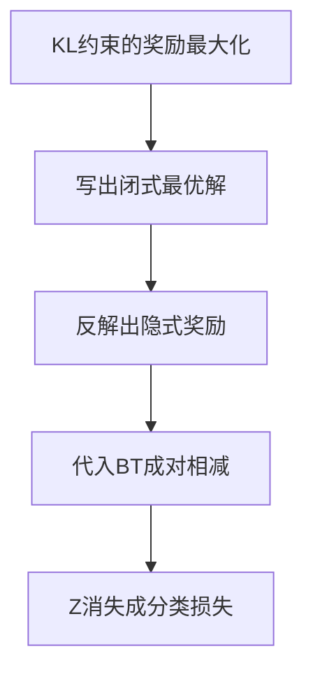

# DPO(Direct Preference Optimization)

一句话:DPO 用一个**代数恒等式**把 RLHF 的两步流水线压成一个成对分类损失——既然"带 KL 约束的奖励最大化"的最优策略有闭式解,那就反过来用策略把奖励表示出来、代进偏好模型,显式奖励模型和在线采样就都不需要了。

## 一、它省掉了什么,又不是什么

### RLHF 那条链上,DPO 砍掉了哪几节

标准 RLHF 先在偏好数据上训一个奖励模型(RM)当评委,再用 PPO 让策略在评委面前反复表演、按打分更新。这条链有三处贵:**一轮迭代同时站着四个模型角色**(policy / reference / RM / critic);**每次更新前都要先生成**,自回归解码是整个流程里最贵的一环;**超参多且互相耦合**,裁剪范围、GAE、KL 系数、奖励尺度任何一项没调好都可能崩(这些细节见 PPO 篇)。DPO 的问题意识很朴素:RLHF 的优化目标不是拍脑袋写的,它有解析结构——**能不能把这个结构解出来,直接对偏好数据写一个损失函数?** 答案是能。省下来的是显式 RM、critic 和在线 rollout;留下来的训练循环长得和 SFT 一样:读一批 $(x, y_w, y_l)$,前向,算一个标量损失,反传。

### 三句话摆正它的位置

- **它不是 RL。** 标准 DPO 不采样、不估优势、没有环境交互,是一个在固定数据上算的成对监督损失。准确叫法是**离线直接偏好优化**,不是 Q-learning 意义上的 off-policy RL(on/off-policy 与 online/offline 两组概念的区分见 PPO 篇)。
- **它不是"把 RM 训得更准"。** 它用一种特定的参数化把独立的 RM **消掉**了。标注偏差、Bradley-Terry 假设、离线覆盖这些毛病一个也没走(RM 怎么训、奖励怎么设计、reward hacking 怎么防见 RLHF与RM 篇)。
- **它和 RM 训练的产物完全不同。** 两者读的都是 $(x,y_w,y_l)$,损失里都有同一个 logistic 似然,但 RM 学的是标量打分函数 $r_\phi(x,y)$,产物是一位能给任意新回答打分的评委,训完还要接 PPO 才动策略;DPO 学的是 $\pi_\theta$ 本身,训完直接就是能用的生成策略。

## 二、推导:配分函数为什么会消失



### 第 1 步:带 KL 约束的奖励最大化有闭式解

先说这一步要算什么:**在"别离参考模型太远"的前提下,把奖励拉到最高**。KL 项像一根把策略拴在 $\pi_{\mathrm{ref}}$ 上的弹簧,$\beta$ 是弹簧的劲度系数:

$$
\max_{\pi}\ \mathbb{E}_{x\sim\mathcal{D},\,y\sim\pi(\cdot|x)}\big[r(x,y)\big]\;-\;\beta\,D_{\mathrm{KL}}\big(\pi(\cdot|x)\,\|\,\pi_{\mathrm{ref}}(\cdot|x)\big)
$$

$x$ 是 prompt,$y$ 是一整段回答,$r$ 是给整段回答打分的奖励函数。这个目标对每个 $x$ 独立,而且不用任何迭代就能解出来:

$$
\pi^{*}(y|x)=\frac{1}{Z(x)}\,\pi_{\mathrm{ref}}(y|x)\,\exp\!\Big(\frac{r(x,y)}{\beta}\Big),\qquad Z(x)=\sum_{y}\pi_{\mathrm{ref}}(y|x)\,\exp\!\Big(\frac{r(x,y)}{\beta}\Big)
$$

读法:**最优策略 = 参考策略 × 按奖励做指数加权**。奖励越高的回答概率被放大得越多;$\beta$ 越大,$r/\beta$ 越小,指数项越接近 1,$\pi^*$ 就越贴着 $\pi_{\mathrm{ref}}$——这就是"$\beta$ 大更保守"在原目标里的含义。**为什么最优解一定长这样**:把整个目标除以 $-\beta$ 后可以配成 $D_{\mathrm{KL}}(\pi\|\pi^{*})-\log Z(x)$,后一项与 $\pi$ 无关,前一项非负且只在 $\pi=\pi^{*}$ 时取零,所以最大值点唯一。$Z(x)$ 是配分函数(归一化分母),要遍历整个回答空间——长度 $T$、词表 $V$ 时是 $V^{T}$ 条候选,**根本算不动**。这是后面的伏笔。

### 第 2 步:反解出隐式奖励

把上式取对数、移项,奖励就用策略表示出来了(类比:从学霸的答题偏好倒推出阅卷细则):

$$
r(x,y)=\beta\log\frac{\pi^{*}(y|x)}{\pi_{\mathrm{ref}}(y|x)}+\beta\log Z(x)
$$

注意这是**恒等式改写,不是近似**:任何奖励函数都能用它自己诱导出的最优策略这样表示。反过来读更有用——**给定 reference,一个策略就唯一确定了一个奖励函数**。这正是论文标题"你的语言模型悄悄就是个奖励模型"的确切含义。把这个量单独命名:

$$
\hat{r}_\theta(x,y)=\beta\log\frac{\pi_\theta(y|x)}{\pi_{\mathrm{ref}}(y|x)}
$$

$\hat r_\theta$ 叫**隐式奖励**:策略把这条回答的对数概率相对参考模型抬高了多少,乘上 $\beta$,就是它给这条回答打的分。训练器日志里的 `rewards/chosen`、`rewards/rejected` 记的就是它。

### 第 3 步:代入 Bradley-Terry,$Z(x)$ 相减抵消

Bradley-Terry(BT)是成对比较的经典模型,也是 Elo 等级分的底层假设:每个回答有一个标量"实力值",谁被偏好只由实力差经 sigmoid 决定。

$$
P(y_w \succ y_l \mid x)=\sigma\big(r(x,y_w)-r(x,y_l)\big)
$$

把第 2 步的 $r$ 代进去。**关键在于 $\beta\log Z(x)$ 只依赖 $x$、不依赖 $y$**:同一个 prompt 下的两项一模一样,相减恰好抵消——就像两名选手的成绩都加了同一个底分,比高低时底分无所谓。算不动的 $Z(x)$ 就此彻底消失。把 $\pi^{*}$ 换成待训练的 $\pi_\theta$,对偏好数据做极大似然,记分差 $m=\hat r_\theta(x,y_w)-\hat r_\theta(x,y_l)$:

$$
\mathcal{L}_{\mathrm{DPO}}=-\,\mathbb{E}_{(x,y_w,y_l)\sim\mathcal{D}}\big[\log\sigma(m)\big],\qquad m=\beta\log\frac{\pi_\theta(y_w|x)}{\pi_{\mathrm{ref}}(y_w|x)}-\beta\log\frac{\pi_\theta(y_l|x)}{\pi_{\mathrm{ref}}(y_l|x)}
$$

这就是一个标准的二分类交叉熵:$m$ 是 logit,标签恒为"优选那条赢"。$m$ 是**优选相对 reference 的抬升**减去**劣选相对 reference 的抬升**,训练做的唯一一件事就是把 $m$ 推大。两个必须记住的口径:序列对数概率是**逐 token 累加、不做长度归一化**的($\log\pi_\theta(y|x)=\sum_t\log\pi_\theta(y_t|x,y_{<t})$),prompt 段必须被 mask 掉不计入——前者是后面长度偏置的病根,后者错了整个分差就没意义。

### 梯度长什么样:权重就是"排反了多少"

$$
\nabla_\theta\mathcal{L}_{\mathrm{DPO}}=-\,\beta\,\mathbb{E}\Big[\;\sigma(-m)\;\big(\nabla_\theta\log\pi_\theta(y_w|x)-\nabla_\theta\log\pi_\theta(y_l|x)\big)\Big]
$$

括号里是方向:**抬 chosen 的对数概率、压 rejected 的对数概率**;前面乘的 $\sigma(-m)$ 是自适应权重。$m$ 为负(当前隐式奖励把顺序排反了)时权重接近 1,$m$ 已经很正时权重趋近 0。所以 **DPO 自带难例挖掘:错得越离谱的样本权重越大,已经学会的样本几乎不再产生梯度**。DPO 原论文把这个系数直接读作"隐式奖励模型排错的程度",并说明去掉它的朴素版本会让模型退化。两个边界一起记:这个权重是**样本级**的,不是 token 级——它调的是"这一对值不值得学",不告诉你回答里哪几个 token 该改;而且梯度只作用在 $y_w$ 与 $y_l$ 这两条具体回答上,**数据没覆盖到的回答不受任何约束**(第四节展开)。

### $\beta$ 的含义变了:不再是"惩罚强度"

$\beta$ 在原始目标里是 KL 惩罚系数,越大越保守。可在 DPO 损失里它**只出现在 $m$ 的缩放上**,把 log-ratio 差换算成偏好的对数几率;梯度里它又整体乘在最前面。所以"$\beta$ 调大 = 更保守"在这里不成立,正确的读法是**它同时改两件事**:

| 调 $\beta$ | 对已排对的样本 | 对排反的样本 | 常见表现 |
|---|---|---|---|
| 调大 | $m$ 更大 → $\sigma(-m)$ 更快趋零,提早熄火 | 权重仍近 1,而前置系数 $\beta$ 变大,单步推得更狠 | 分差涨得慢但两侧绝对似然掉得少 |
| 调小 | 饱和来得晚,同一批数据能一直吃 | 前置系数小,单步温和 | 分差容易被推很大,chosen 侧也更容易被一起压低 |

所以 $\beta$ 必须**和学习率联合扫**,判据是留出集的分差与偏好准确率加独立评测,不能只按"约束强弱"推断。参考量级:主流训练框架把 `beta` 默认设成 0.1,并把 DPO 的默认学习率专门下调到 1e-6(通用训练器基类的默认值是 5e-5,差了近两个数量级)——DPO 是在一个已经训好的策略上做小幅修正,学习率给大了最先崩的就是 chosen 侧似然。DPO 原论文自述"没有认真调过 $\beta$",别把任何一个数字当成最优值。$\beta$ 在 PPO 里的角色(显式 KL 惩罚项、怎么按目标 KL 自适应)见 KL散度 篇。

## 三、训练诊断:两侧 logp 同时下降正不正常

### 先反问一句:你说的 loss 是哪个量

**标准 DPO 只有一个损失,不存在"chosen loss"和"rejected loss"两个独立损失。** 训练器另外记录的是诊断量:两侧序列对数概率 `logps/chosen`、`logps/rejected`,两侧隐式奖励 `rewards/chosen`、`rewards/rejected`,分差 `rewards/margins`,以及偏好准确率 `rewards/accuracies`($m>0$ 的样本比例)。面试里第一步就该问清对方看的是哪一个,否则后面的分析没有落点。

```python
# 一对样本一个损失;两侧的 logp 与隐式奖励是另外记录的诊断量
logp_w = seq_logprob(policy, x, y_w)          # 整段 token 求和,prompt 段必须 mask 掉
logp_l = seq_logprob(policy, x, y_l)
ref_w, ref_l = ref_cache_w, ref_cache_l       # reference 冻结,可全量预计算

r_w = beta * (logp_w - ref_w)                 # 隐式奖励:相对 reference 抬升了多少
r_l = beta * (logp_l - ref_l)
margin = r_w - r_l                            # 目标真正优化的量,全篇只有这一个
loss = -logsigmoid(margin).mean()             # 恒 > 0;出负数先怀疑日志口径

log(margin=margin.mean(),                     # 该稳定涨
    accuracy=(margin > 0).float().mean(),      # 该稳定涨
    logp_chosen=logp_w.mean(),                 # 允许降,但不该断崖
    logp_rejected=logp_l.mean())               # 通常降得更快
```

### 为什么"两侧同降、rejected 降得更快"是常态

看损失就明白:括号里只有一个 $m$,**目标对两侧的绝对高度没有任何约束**,只要差在扩大,损失就下降。两侧同向移动不是错误,它是目标函数留下的自由度。再看梯度:它是 $\nabla\log\pi_w-\nabla\log\pi_l$ 这个**差**,不是两个独立目标。抬高 $\log\pi_\theta(y_w)$ 得把概率质量从别的 token 搬过来(softmax 归一化,总量守恒),而压低 $\log\pi_\theta(y_l)$ 只需要往下推,阻力小得多;两条路共享同一份参数,梯度自然走省力的那条。TRL 的文档把这件事写成了默认现象:实践中分差主要靠**压低劣选回答**而不是抬高优选回答实现。Smaug/DPOP 那篇论文也从理论上给了说明——只要相对概率在改善,标准 DPO 损失**可以同时降低优选样本的似然**(论文自报)。

两个数值例子(固定 reference,只看两侧 logp):$(-10,-12)\to(-8,-11)$,两侧都升,分差从 2 涨到 3,损失下降;$(-10,-12)\to(-11,-14)$,两侧都降,分差同样从 2 涨到 3,损失一样下降。**两个方向都合法**,所以"同降"本身既不能证明失败,也不能证明对齐成功。

### 该看的三个数

1. **分差与偏好准确率**,而且要看**留出集**的。这才是目标真正优化的量;训练集分差猛涨而留出集准确率不动,是在拟合噪声。别设通用门槛——有系统性研究测得多数偏好微调模型在常见偏好数据上的排序准确率**不到 60%**(论文自报),照着"必须过 80%"调参只会调坏。
2. **chosen 的绝对对数概率掉得有多狠**。允许降,但断崖式下跌意味着模型在整体压低这一类回答、连正例一起牺牲,典型伴随症状是输出变短、模板化、重复。先查学习率是不是偏大、$\beta$ 是不是偏小,再查 chosen 是不是本来就落在策略分布之外(第四节)。
3. **独立评测有没有跟着涨**。同一组 prompt、同一套采样设置,用人评或任务指标判断;训练曲线好看而 held-out 胜率、通用能力下滑,就是过优化或对齐税。DPO 侧能拧的旋钮有四个:回退到较早 checkpoint、降低学习率或提前停止、补齐退化那类任务的偏好数据、在损失里混入优质回答的 SFT 目标;哪类能力在掉、怎么区分遗忘与过优化见 RLHF与RM 篇。

### 什么时候才是真出问题

- **分差不涨而两侧同向漂移**:模型整体在漂,没学到偏好信号。多半是偏好对区分度太低、标注噪声大,或者 chosen 与 rejected 来自不同分布——长度、模板、语气差异被当成了偏好信号。这时候先回去查数据,不是先调 $\beta$。
- **分差涨、生成质量掉**:概率质量被压出了数据覆盖范围。检查重复率、平均长度、同 prompt 多次采样的多样性,并按任务分桶。
- **模式崩溃**:输出收敛到少数套路、有效多样性下降。**先固定 prompt 与温度、top-p 再比较**,排除解码设置和模板造成的假象;确认是训练退化就回退到较早 checkpoint、降低学习率或训练步数、补齐被忽略的任务与多样偏好。**只调高采样温度修不了训练问题**,那只是把尖分布重新摊平。
- **loss 出现负数**:$-\log\sigma(m)>0$ 恒成立,标准 DPO 损失不可能为负。先确认日志记的是不是待最大化的 $\log\sigma(m)$、带符号的 objective,或含其他加权项的总目标;确认是 DPO 损失本身为负,那就是实现有问题。
- **发散**:按这个顺序查——chosen/rejected 有没有反、response mask、截断策略、序列求和口径(sum 还是 mean)、reference 是否真冻结且缓存未过期,然后才是学习率、$\beta$ 与混合精度。

还有几条连带的口径要先说清:有效批次由每卡微批 × 梯度累积 × 数据并行数共同决定,"至少 64"不是定律;梯度裁剪要在累积完成并做完必要的反缩放之后再做,而且**裁剪修不了错标和 NaN 的源头**。监控策略偏移时必须写清口径——样本来自当前策略还是离线数据、按 token 还是整序列、有没有除以长度;**一组离线样本的 logp 差均值不等于精确 KL**(估计器与口径见 KL散度 篇)。

## 四、数据、衔接与边界

### 偏好对怎么造

一条偏好对只有满足"同一个 prompt、语境一致、判断标准明确、优劣可信"才有信号。落地时的硬动作:

- **先定标注维度再标**(正确性、安全性、格式、语气),含糊样本复标或仲裁;第一轮意图本来就模糊的对话,应把"澄清问题问得合不合理"写进标准,而不是替用户猜一个唯一目标。
- **盲化来源 + 随机交换 A/B 次序**,对冲位置偏好与自我偏好;按 prompt 与近重复**分组**切训练/验证集,同一问题的多个回答不能分散到两侧,否则泄漏。
- **查长度与来源分布**。序列 logp 是逐 token 累加的,chosen 系统性更长时"更长"本身就会被学成偏好——所以**两侧长度分布差得明显时,分差扩大证明不了模型学到了偏好**,它可能只是学会了多写。已有工作把 DPO 的长度利用归因于分布外自举,并给出长度正则,报告控长后胜率最多提升约 20%(论文自报)。先配平或按长度分桶评估;把损失改成平均 logp 是**换了目标**(那已经是 SimPO 一路),不是"在日志上做个长度归一化"。
- **覆盖要有层次**。既要清晰错误(好学),也要"接近但确有可靠优劣"的困难样本;只配"最好对最差"最容易让模型学到长度或格式捷径。小样本预算下优先标高分歧、业务高频、模型最不确定的 prompt,验收看按场景分桶的一致率、留出胜率和当前策略新回答的人评——**样本条数本身不能证明覆盖充分**。降低标注成本可以靠规则验证、模型初评和去重,把分歧与高价值样本留给人工复核。
- **噪声**先走数据治理:重标、仲裁、按可靠性筛选或加权,并留一个分歧切片专门做验证;优化侧再降学习率、早停。标签平滑与稳健变体会改变目标,要单独比较,不能拿"增大 $\beta$"当万能解药。公开偏好数据适合快速铺覆盖,但要审查领域、许可、隐私与模板;领域不匹配时先按任务和语义筛选补缺口,改写必须保住事实与约束,不能只换业务名词。

### 为什么通常先 SFT,reference 取谁

标准配方是:**reference = 用来初始化策略的那个 SFT checkpoint,全程冻结**。三条理由:

1. **reference 定义了隐式奖励的零点。** $\hat r_\theta$ 量的是"相对 reference 抬升了多少",换一个 reference,零点、$\beta$ 的效果和分差数值就全不可比了。
2. **它决定了训练的起点。** 策略从 reference 初始化时所有 $\hat r$ 恒为 0、$m=0$、$\sigma(0)=0.5$,梯度权重最大,训练从最敏感的点出发。所以**第 0 步分差全是零并不说明数据没区分度**,不能据此把样本删掉。
3. **DPO 补不了基础能力。** 它只在给定的两条回答上算 logp,基座还不会做这个任务时,两个候选都是错的,学到的只是"哪个错得好看一点"。SFT 质量差会同时污染起始策略和候选分布。SFT 的模板、loss mask 与数据配比见 SFT 篇。

工程上,只要数据、tokenizer、对话模板和 reference 全都固定,**参考模型的 logp 可以全量预计算**(训练器里就是 `precompute_ref_log_probs` 这类开关),训练中就不必再跑一次参考前向,显存里也不必常驻这份权重。这是 DPO 相对 PPO/GRPO 的一个结构性便宜——后者每批都产生新 rollout,预计算无从谈起。以上任何一项变了,缓存必须重算。**标准 DPO 不做 EMA 或周期性同步 reference**,那属于改算法(另有专门论文),不是默认步骤;reference 的显存与更新策略见 KL散度 篇。

顺序也不能随便交换:DPO 之后再补普通 SFT 可以修格式、补新知识,但**普通 SFT 目标不保留偏好分差**,可能冲淡刚学到的对齐,需要混合目标或回放偏好数据,并分阶段评测。

### chosen 落在 SFT 分布外会怎样

这是本篇最值得记的一条因果。如果 chosen 来自一个更强的外部模型,而当前策略几乎不会生成它,$\log\pi_\theta(y_w)$ 的起点就很低,抬起来要搬运大量概率质量;梯度于是更倾向走"压 rejected"的省力路线,前面说的"两侧同降"会走到极端版本——chosen 也被一起压下去。

更深的一层是理论上的:DPO 只在数据点上约束 logp 之比,**对数据没覆盖的回答不做任何约束**。有工作证明 DPO 的解集是 PPO 解集的**真超集**,并给出反例:存在把 90% 概率分配给偏好数据里从未出现过的动作、却仍然最小化 DPO 损失的策略(论文自报)。直觉版本是一句话——**压低了 rejected,概率质量总要去别处,而"别处"无人监督**。这也是它和 PPO 最本质的差别:PPO 的 KL 惩罚对**整个分布**生效,DPO 的 reference 只出现在两条具体回答的比值里。

缓解办法都指向同一件事——**让 chosen 尽量落在策略自己的分布里**:用当前策略采多个候选再标注;先拿外来的优质回答做一轮 SFT 把它拉进分布再做 DPO;或者在损失里保留一个优选回答的 SFT 项,把 chosen 侧的绝对似然也管起来。拒绝采样是常用的前置步骤:先用规则筛掉不满足硬条件的候选,只留胜者继续 SFT,而保留胜负关系才产生 DPO 信号。

### on-policy 偏好对为什么更好

- **覆盖对得上。** 偏好对若来自旧模型,新策略真正会犯的错根本没被标注,训练信号打不到痛点。
- **有对照实验支持。** 一项系统研究把在线与离线对齐的差距主要归因于 on-policy 采样,并观察到**离线算法擅长成对分类却不擅长生成**,而且单纯放大策略规模填不上这个差(论文自报)。这条和上一小节的"分布外"是同一件事的两个侧面。
- **落地形态**有两种:迭代式 DPO(用当前策略采候选 → 重新标注 → 再训一轮,循环几次),以及在线 AI 反馈(每步用当前模型采两条,当场让 judge 判优劣)。代价是把"省掉在线采样"这个最大的优点交回去一部分——所以它是一个连续谱,不是开关。
- **什么时候必须刷新数据**:当前策略新回答的人评或分桶胜率停滞、生成长度与模板明显漂移、留出分差还在涨而实际生成质量已经背离。

数据效率没有统一排序:DPO 复用已有偏好对、省掉在线采样与 RM 训练,PPO 花钱买到的是"能评价数据外的新回答",比较时必须说明按人工标注条数、生成 token 还是算力计量。SFT 与偏好数据的规模各自按学习曲线定:**基础任务还没学会先补示范,能做但排序不理想再补可靠偏好**;按有效 token 与标注成本记账,业务分布改变、收益饱和或旧能力回退时再调配比,没有 70/30 之类的通用比例。

### 已知局限:四条

| 局限 | 具体是什么 | 症状与应对 |
|---|---|---|
| BT 假设 | 用单个标量效用差解释所有成对偏好 | 装不下群体分歧、循环偏好、随上下文变的标准;先统一或显式区分评判标准、复核分歧、比较稳健变体,放大分差解决不了冲突 |
| 离线覆盖 | 只学已有偏好对 | 策略走出覆盖就没有信号;靠迭代采样 + 重新标注刷新 |
| 没有探索 | 标准版不采样 | 发现不了数据里根本没有的更好答案;需要探索时换在线方法 |
| 概率质量外流 | 约束只在数据点上,解集比 PPO 大 | 压 rejected 时质量流向未监督区域;靠 on-policy chosen、混合 SFT 项、早停压制 |

再加一条边界:**信用分配是序列级的**。一整条回答只有一个胜负标签,DPO 指不出是哪一步写坏了;多步 Agent 任务尤其吃亏,因为成败常由多步决策共同造成。改善方向是比较同一中间状态之后的分支、增加子目标反馈,或改用能与环境继续交互的在线方法——多轮轨迹与信用分配见 AgenticRL 篇。

### 按机制比:PPO、ORPO 与其他偏好优化方法

只比机制,不做算法选型;PPO/DPO/GRPO 的横向选型表见 RLHF与RM 篇。先说死一句:**这些方法之间没有无条件的效果高低**,"DPO 长文本上一定不如 PPO"之类的断言不成立,能比的只有反馈条件、成本口径和实测。

| 方法 | 偏好信号怎么进梯度 | reference 的角色 | 关键机制差异 |
|---|---|---|---|
| RM + PPO | RM 打分 → 优势 → 裁剪的策略梯度 | 独立的 KL 惩罚项,约束整个分布 | 在线采样,能评价数据外的新回答 |
| DPO | 成对 logistic 损失直接对 logp 求导 | 藏在 log-ratio 里,定义隐式奖励零点 | 离线,只约束数据点上的比值 |
| IPO | 对**未乘 $\beta$** 的 log-ratio 差做有限目标的平方回归 | 同 DPO | 目标有上限,可分数据上不会把分差无止境推大 |
| KTO | 逐条回答的"好/坏"信号 + 前景理论效用 | 当参考点 | 不要求成对标注 |
| SimPO | 用**长度归一化的平均 logp** 当隐式奖励,再加目标 margin | **去掉** | 免参考前向,并直接压长度偏置 |
| ORPO | 优选回答的 SFT 损失 + 赔率比项,同一阶段 | **去掉** | 单阶段,不分 SFT / 偏好两步 |
| ODPO | 在分差上加一个由偏好强度决定的偏移 | 同 DPO | 不再把每对偏好一视同仁 |

ORPO 值得单独展开,因为它最常被拿来和 DPO 比成本。令 $p_\theta(y|x)=\exp\big(\frac{1}{|y|}\sum_t\log\pi_\theta(y_t|x,y_{<t})\big)$ 是由**平均 token logp** 得到的分数(**不是**整段归一化的序列概率),$o_\theta=p_\theta/(1-p_\theta)$ 是它对应的赔率,则

$$
\mathcal{L}_{\mathrm{ORPO}}=\mathcal{L}_{\mathrm{SFT}}(y_w)-\lambda\log\sigma\!\Big(\log\frac{o_\theta(y_w|x)}{o_\theta(y_l|x)}\Big)
$$

第一项照常提高优选答案的似然,第二项按"胜者赔率比败者赔率高多少"给一个 logistic 惩罚,$\lambda$ 是两者的权重。**机制差异在对比基准**:DPO 的基准是**另一个模型**(reference),ORPO 的基准是**同一个模型在劣选回答上的赔率**,所以它压根不需要参考前向。成本上不能预设谁更贵——相对单独 SFT,ORPO 多处理一条劣选回答;相对 DPO,它省掉参考前向而 SFT 项可复用优选侧的结果,而 DPO 一旦预缓存参考分数差距又会缩小,要在相同 token、硬件与质量目标下实测。

还有两条常被追问的边界。其一,**"离线偏好优化"是一类方法而不是某个算法**,DPO、IPO、SLiC 都在里面,理论目标、损失形状和是否依赖 reference 各不相同,不能只凭一个缩写反推出公式。其二,**只有正例没有负例时**,标准 DPO、ORPO 和成对 RM 都缺少比较信号:可以做 SFT,或者另采候选后可靠标注补齐成对数据,**不能随手把随机文本当负例**(那学到的是"别说胡话",不是偏好);只有单条好/坏反馈时考虑 KTO;另有可验证奖励时 PPO/GRPO 仍可训,但反馈条件已经变了。组内相对优势怎么算见 GRPO 篇,DAPO/Dr.GRPO/GSPO 各修了什么见 GRPO变体 篇。

## 五、面试考点串联

| 高频问法 | 本文哪一节 |
| --- | --- |
| 从 KL 正则奖励目标和 Bradley-Terry 推一遍 DPO 损失,$Z(x)$ 为什么会消失? | 二(第 1–3 步) |
| DPO 和显式 Reward Model 都吃偏好对,为什么产物和用途不同? | 一(三句话摆正位置);二(隐式奖励) |
| reference 在 DPO 里到底做什么?能不能去掉、能不能预计算? | 二(第 2 步);四(先 SFT,reference 取谁) |
| $\beta$ 是什么含义?调大调小分别怎么影响两条曲线?为什么要和学习率一起调? | 二($\beta$ 的含义变了);三(该看的三个数) |
| DPO 的梯度长什么样?为什么说它自带难例加权? | 二(梯度长什么样) |
| chosen 和 rejected 两侧同时下降,训练是不是坏了?该看哪些指标? | 三(为什么是常态;该看的三个数) |
| 为什么 DPO 更容易压低 rejected,而不是抬高 chosen? | 三(为什么是常态) |
| 什么形态才是真出问题?怎么提前发现"分差在涨但模型在退化"? | 三(什么时候才是真出问题) |
| DPO loss 出现负数或训练发散,按什么顺序排查?出现模式崩溃又怎么诊断和处理? | 三(什么时候才是真出问题) |
| 偏好对怎么构造?噪声、长度偏差、泄漏各怎么防? | 四(偏好对怎么造) |
| 为什么通常先 SFT 再 DPO?DPO 之后再补 SFT 有什么风险?SFT 质量差会怎样影响 DPO? | 四(先 SFT,reference 取谁) |
| chosen 来自更强的外部模型会怎样?DPO 为什么容易把概率推到分布外?拒绝采样怎么改善偏好对? | 四(chosen 落在 SFT 分布外) |
| on-policy 偏好对为什么更好?离线方法怎么发现分布外退化、什么时候该刷新数据? | 四(on-policy 偏好对) |
| DPO 和 PPO 的数据效率怎么比?SFT 与偏好数据的比例何时要调? | 四(on-policy 偏好对,末两段) |
| BT 假设什么时候失效?离线覆盖不足有什么后果? | 四(已知局限四条) |
| RLHF、DPO、ORPO 在目标和优化方向上本质差在哪? | 四(按机制比) |
| ORPO 的赔率比是什么?它的计算开销一定比 DPO 高吗? | 四(按机制比,ORPO 展开) |
| IPO、KTO、SimPO、ODPO 各改了哪一处?分别适合什么反馈条件? | 四(按机制比,表格) |
| 只有正例没有负例时,这些方法还能怎么用? | 四(按机制比,末段) |
| "离线偏好优化"是一个算法还是一类方法? | 四(按机制比,末段) |
| 补充题:$\beta\log Z(x)$ 为什么能消掉?换成非成对的目标还消得掉吗? | 二(第 3 步:只依赖 $x$ 不依赖 $y$) |
| 补充题:训练刚开始时分差全是 0,是不是说明这批数据没区分度? | 四(先 SFT,理由 2) |
| 补充题:偏好准确率要到多少才算训好了? | 三(该看的三个数,第 1 条) |

## 相关文献

- Direct Preference Optimization: Your Language Model is Secretly a Reward Model — [arXiv:2305.18290](https://arxiv.org/abs/2305.18290)
- Is DPO Superior to PPO for LLM Alignment? A Comprehensive Study(DPO 解集是 PPO 解集的真超集)— [arXiv:2404.10719](https://arxiv.org/abs/2404.10719)
- From $r$ to $Q^*$: Your Language Model is Secretly a Q-Function(token 级 MDP 视角与隐式奖励随训练下滑)— [arXiv:2404.12358](https://arxiv.org/abs/2404.12358)
- Smaug: Fixing Failure Modes of Preference Optimisation with DPO-Positive(优选样本似然被一起压低的失败模式)— [arXiv:2402.13228](https://arxiv.org/abs/2402.13228)
- Preference Learning Algorithms Do Not Learn Preference Rankings(排序准确率不足 60%)— [arXiv:2405.19534](https://arxiv.org/abs/2405.19534)
- Disentangling Length from Quality in Direct Preference Optimization(长度利用与长度正则)— [arXiv:2403.19159](https://arxiv.org/abs/2403.19159)
- Understanding the performance gap between online and offline alignment algorithms(on-policy 采样是主因)— [arXiv:2405.08448](https://arxiv.org/abs/2405.08448)
- Direct Language Model Alignment from Online AI Feedback(OAIF,在线偏好反馈)— [arXiv:2402.04792](https://arxiv.org/abs/2402.04792)
- A General Theoretical Paradigm to Understand Learning from Human Preferences(ΨPO 与 IPO)— [arXiv:2310.12036](https://arxiv.org/abs/2310.12036)
- KTO: Model Alignment as Prospect Theoretic Optimization — [arXiv:2402.01306](https://arxiv.org/abs/2402.01306)
- SimPO: Simple Preference Optimization with a Reference-Free Reward — [arXiv:2405.14734](https://arxiv.org/abs/2405.14734)
- ORPO: Monolithic Preference Optimization without Reference Model — [arXiv:2403.07691](https://arxiv.org/abs/2403.07691)
- Direct Preference Optimization with an Offset(ODPO)— Findings of ACL 2024 — https://aclanthology.org/2024.findings-acl.592/
- Training language models to follow instructions with human feedback(InstructGPT,RLHF 三阶段与对齐税)— [arXiv:2203.02155](https://arxiv.org/abs/2203.02155)
- TRL DPOTrainer 文档(`beta` 默认 0.1、默认学习率 1e-6、`precompute_ref_log_probs` 与日志指标口径)— https://huggingface.co/docs/trl/main/en/dpo_trainer
