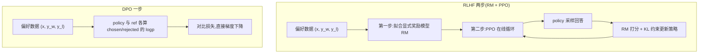

# DPO(Direct Preference Optimization)

> ⚠️ 旧版:本篇写于写作契约确立之前,尚未按新标准审查重写。标准见 docs/05-知识库写作契约.md,样板见「GPU架构与执行模型」。

一句话:**把 RLHF 的「先训奖励模型、再跑 PPO」两步折叠成一个监督式对比损失**——直接在偏好数据上做类似二分类的微调,数学上等价于原 RLHF 目标的最优解。论文标题的后半句就是全部精髓:Your Language Model is Secretly a Reward Model——你的语言模型悄悄就是个奖励模型。

## 一、动机:PPO 流水线太重

标准 RLHF(InstructGPT 配方)分两步:先在偏好数据上拟合一个奖励模型(RM,相当于先培养一位「评委」),再用 PPO 让策略在评委面前反复表演、按打分更新。痛点:

- **四个模型同时在场**:policy(训练)、reference(防跑偏)、reward model(打分)、critic(估价值)——像一个剧组同时养四位主演,显存与工程量翻倍;
- **超参敏感、训练不稳**:clip 范围、GAE、KL 系数、reward 归一化……任何一个没调好都可能崩,复现困难;
- **贵**:训练全程要不停在线采样(rollout),生成本身就吃掉大头算力。

DPO 的问题意识:RLHF 的优化目标其实有解析结构,能不能**跳过显式 RM 和在线采样,直接对偏好数据写出一个损失函数**?答案是能,而且推导出奇地干净。

## 二、推导链:三步从 RLHF 走到 DPO

### 第 1 步:KL 约束下的奖励最大化有闭式解

RLHF 的目标——最大化奖励,同时不许离参考模型太远。KL 项像一根把策略拴在 $\pi_{\mathrm{ref}}$ 上的弹簧,$\beta$ 是弹簧的劲度系数:

$$
\max_{\pi}\ \mathbb{E}_{x\sim\mathcal{D},\,y\sim\pi}\!\left[r(x,y)\right] - \beta\, D_{\mathrm{KL}}\!\left(\pi(\cdot|x)\,\|\,\pi_{\mathrm{ref}}(\cdot|x)\right)
$$

这个目标不用任何迭代,最优策略可以直接写出(闭式解,「一步到位的公式解」):

$$
\pi^{*}(y|x) = \frac{1}{Z(x)}\,\pi_{\mathrm{ref}}(y|x)\,\exp\!\left(\frac{r(x,y)}{\beta}\right)
$$

直觉:最优策略 = 参考策略 × 按奖励做指数加权,奖励越高的回答概率被放大得越多,$\beta$ 越大放大得越保守。$Z(x)$ 是配分函数(归一化分母)——把所有可能回答的权重加总,保证概率和为 1;它要遍历整个回答空间,**根本算不动**,这正是下面推导的关键伏笔。

### 第 2 步:反解奖励——从「最优行为」反推「评分标准」

把闭式解取对数、移项,奖励就能用策略反表示出来(类比:从学霸的答题偏好反推出阅卷细则):

$$
r(x,y) = \beta \log\frac{\pi^{*}(y|x)}{\pi_{\mathrm{ref}}(y|x)} + \beta \log Z(x)
$$

### 第 3 步:代入 Bradley-Terry,配分函数抵消

Bradley-Terry 是经典的成对比较模型(Elo 等级分的底层假设):两个回答谁被偏好,由奖励差经 sigmoid 压成 0–1 的胜率:

$$
P(y_w \succ y_l \mid x) = \sigma\!\left(r(x,y_w) - r(x,y_l)\right)
$$

把第 2 步的 $r$ 代进去:两项都带 $\beta \log Z(x)$,同一个 $x$ 下相减**恰好抵消**——就像两名选手的成绩都加了同一个底分,比高低时底分无所谓。算不动的 $Z(x)$ 彻底消失,对偏好数据做极大似然(负对数似然),就得到 DPO 损失:

$$
\mathcal{L}_{\mathrm{DPO}} = -\,\mathbb{E}_{(x,y_w,y_l)\sim\mathcal{D}}\left[\log\sigma\!\left(\beta\log\frac{\pi_\theta(y_w|x)}{\pi_{\mathrm{ref}}(y_w|x)} - \beta\log\frac{\pi_\theta(y_l|x)}{\pi_{\mathrm{ref}}(y_l|x)}\right)\right]
$$

只剩两个模型的四次前向(policy/ref 各过一遍 chosen/rejected),一个二分类式的损失——没有采样、没有显式 RM、没有 critic。

## 三、隐式奖励、β 与梯度直觉

### 隐式奖励

定义 $\hat{r}_\theta(x,y) = \beta \log\dfrac{\pi_\theta(y|x)}{\pi_{\mathrm{ref}}(y|x)}$,DPO 损失就是「用隐式奖励差做二分类」。训练完的策略自带一个奖励函数:logp 相对参考模型抬升多少,就是它给这个回答打的分——这就是「你的语言模型悄悄就是个奖励模型」的确切含义。这个隐式奖励也能单独拿出来当 RM 用(给候选回答排序)。

### β 的作用

$\beta$ 控制隐式 KL 约束的松紧:**β 越大,偏离 ref 的惩罚越狠,策略越贴近 ref**(弹簧越硬);β 越小越放飞,拟合偏好更激进但更易崩坏。常用 0.1 量级:风格类任务可小,安全类任务宜大。

### 梯度形态:权重 = 隐式奖励估错的程度

对损失求梯度:

$$
\nabla_\theta \mathcal{L}_{\mathrm{DPO}} = -\,\beta\,\mathbb{E}\left[\;\underbrace{\sigma\!\left(\hat{r}_\theta(x,y_l) - \hat{r}_\theta(x,y_w)\right)}_{\text{把偏好排反的程度}}\;\Big(\nabla_\theta\log\pi_\theta(y_w|x) - \nabla_\theta\log\pi_\theta(y_l|x)\Big)\right]
$$

方向就是「抬 chosen 的 logp、压 rejected 的 logp」,但前面乘了个自适应权重:**模型当前把 rejected 排到 chosen 前面排得越离谱,这条样本梯度越大**——像老师优先讲学生错得最冤的题;已经排对的样本权重趋近 0,防止过度优化。这是 DPO 与朴素做法(chosen 做 SFT、rejected 做反向 SFT)的本质区别:后者没有这个自适应权重。

## 四、细节与常见坑

- **chosen 和 rejected 的 logp 常常一起下降**:损失只看两者的 margin(差距),margin 拉大 loss 就降,哪怕两条的绝对 logp 双双下跌——像只考核「比第二名领先多少」而不考核绝对成绩。后果:概率质量被挤到训练数据之外的回答上,输出变差但 loss 曲线看不出异常。监控必须分开画 chosen/rejected 各自的 logp 曲线,不能只看 loss 和 margin。
- **长度偏置**:logp 逐 token 累加,像按字数累计的罚款,回答越长绝对值越大,margin 容易被长度绑架;偏好数据里 chosen 往往更长,训完模型显著变啰嗦。缓解:数据侧配平长度,或用 SimPO 式长度归一化。
- **ref 前向开销**:每条样本要多算一遍 $\pi_{\mathrm{ref}}$ 的 logp。要么常驻一份 ref 占显存,要么训练前**离线预计算**全部样本的 ref logp 存盘(数据固定时一劳永逸)。
- **离线数据的分布外退化**:标准 DPO 纯离线,偏好数据常采自别的模型或旧版本;策略一更新,生成分布漂移出数据覆盖范围——按旧地图开车,越开越出地图边界,隐式奖励在没见过的区域纯属外推。
- **缓解:iterative / on-policy DPO**:用当前策略采样新回答、由人或 RM 标偏好、再训一轮,循环数次——边开车边更新地图,把「离线」逐步变「近在线」,通常显著好于单轮 DPO。
- **实践超参**:学习率要比 SFT 低一个量级(1e-6 以下常见),1–2 个 epoch 即止;epoch 一多 margin 无限膨胀、输出退化,是最常见的翻车原因。

## 五、变体一族:IPO / KTO / SimPO / ORPO

| 变体 | 关键改动 | 解决 DPO 的什么问题 | 数据需求 |
| --- | --- | --- | --- |
| IPO | 把 $\log\sigma$ 换成平方损失,margin 被钉在 $\frac{1}{2\beta}$ 附近 | sigmoid 会无止境追求更大 margin → 过拟合 | 成对偏好 |
| KTO | 用前景理论(人对损失比对收益更敏感)构造损失,逐条样本可训 | 成对数据贵;线上只有点赞/点踩这类单条信号 | 单条「好/坏」二元标注 |
| SimPO | 去掉 ref,用**长度归一化**的平均 logp 当隐式奖励,再加目标 margin $\gamma$ | ref 前向开销 + 长度偏置 | 成对偏好 |
| ORPO | SFT 损失 + odds ratio 惩罚项合一,单阶段、免 ref | 「先 SFT 再 DPO」两阶段繁琐 | 成对偏好 |

一句话类比:IPO 是「分差达标就行,别贪」;KTO 是「不用 A/B 对比,点赞点踩就能学」;SimPO 是「不照旧版的镜子,直接看每 token 平均自信度」;ORPO 是「上课顺便讲错题,不单独补课」。

## 六、DPO vs PPO vs GRPO

| 维度 | PPO | GRPO | DPO |
| --- | --- | --- | --- |
| 在线/离线 | 在线(训练中 rollout) | 在线(训练中 rollout) | 离线(标准版不采样) |
| reward 来源 | 显式 RM 或 verifier | verifier/RM + 组内相对化 | 隐式:logp 比值,由偏好标注驱动 |
| 在场模型数 | 4:policy/ref/RM/critic | 3:policy/ref + 打分器 | 2:policy/ref(预计算可省成 1) |
| 成本与稳定性 | 最贵、最难调 | 中等 | 最便宜,训起来像 SFT 一样稳 |
| 适用场景 | 通用对齐、长期在线优化 | 可验证奖励的推理训练(数学/代码) | 偏好/风格/安全对齐、资源有限、快速迭代 |

选型直觉:有可验证 reward、追推理上限 → GRPO 系(细节见 GRPO 篇);只有离线偏好数据、要快要稳 → DPO 系;预算充足且要长期在线滚动 → PPO 系。

## 七、面试考点串联

高频问法(与题库联动的切片点):

1. DPO 为什么不需要显式奖励模型 →「推导链」+ 隐式奖励
2. 手推:闭式解 → 反解 $r$ → 配分函数怎么消掉的 →「推导链」三步(必考,重点背)
3. β 是什么、调大调小会怎样 →「隐式奖励、β」
4. DPO 梯度里的 sigmoid 权重是什么含义 →「梯度形态」
5. 训 DPO 时 chosen 的 logp 也在降,正常吗 →「细节与坑」第一条(高频陷阱题)
6. DPO 与 PPO/GRPO 怎么选 →「六、对照表」
7. IPO/KTO/SimPO/ORPO 各解决什么问题 →「变体一族」
8. 纯离线 DPO 的极限在哪、如何缓解 →「分布外退化 + iterative DPO」

## 相关文献

- DPO(原论文,Your Language Model is Secretly a Reward Model)— [arXiv:2305.18290](https://arxiv.org/abs/2305.18290)
- IPO / ΨPO(偏好学习一般理论框架,平方损失防过拟合)— [arXiv:2310.12036](https://arxiv.org/abs/2310.12036)
- KTO(前景理论对齐,免成对数据)— [arXiv:2402.01306](https://arxiv.org/abs/2402.01306)
- SimPO(免 reference + 长度归一化)— [arXiv:2405.14734](https://arxiv.org/abs/2405.14734)
- ORPO(与 SFT 合一的单阶段偏好优化)— [arXiv:2403.07691](https://arxiv.org/abs/2403.07691)
