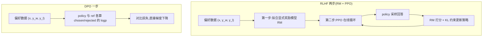

# DPO(Direct Preference Optimization)

> ⚠️ 旧版:本篇写于写作契约确立之前,尚未按新标准审查重写。标准见 docs/05-知识库写作契约.md,样板见「GPU架构与执行模型」。

一句话:**DPO 在成对偏好数据上直接训练策略,省去显式奖励模型和在线强化学习循环。** 它利用 KL 正则奖励目标与偏好模型之间的数学关系,但有限数据和模型上的训练不保证与 PPO 得到同一策略。

## 一、动机:PPO 流水线太重

标准 RLHF(InstructGPT 配方)分两步:先在偏好数据上拟合一个奖励模型(RM,相当于先培养一位「评委」),再用 PPO 让策略在评委面前反复表演、按打分更新。痛点:

- **四个模型同时在场**:policy(训练)、reference(防跑偏)、reward model(打分)、critic(估价值)——像一个剧组同时养四位主演,显存与工程量翻倍;
- **超参敏感、训练不稳**:clip 范围、GAE、KL 系数、reward 归一化……任何一个没调好都可能崩,复现困难;
- **贵**:训练全程要不停在线采样(rollout),生成本身就吃掉大头算力。

DPO 的问题意识:RLHF 的优化目标其实有解析结构,能不能**跳过显式 RM 和在线采样,直接对偏好数据写出一个损失函数**?答案是能,而且推导出奇地干净。

## 二、推导链:三步从 RLHF 走到 DPO

### 第 1 步:KL 约束下的奖励最大化有闭式解

RLHF 的目标——最大化奖励,同时不许离参考模型太远。KL 项像一根把策略拴在 $\pi_{\mathrm{ref}}$ 上的弹簧,$\beta$ 是弹簧的劲度系数:

$$
\max_{\pi}\ \mathbb{E}_{x\sim\mathcal{D},\,y\sim\pi}\!\left[r(x,y)\right] - \beta\, D_{\mathrm{KL}}\!\left(\pi(\cdot|x)\,\|\,\pi_{\mathrm{ref}}(\cdot|x)\right)
$$

这个目标不用任何迭代,最优策略可以直接写出(闭式解,「一步到位的公式解」):

$$
\pi^{*}(y|x) = \frac{1}{Z(x)}\,\pi_{\mathrm{ref}}(y|x)\,\exp\!\left(\frac{r(x,y)}{\beta}\right)
$$

直觉:最优策略 = 参考策略 × 按奖励做指数加权,奖励越高的回答概率被放大得越多,$\beta$ 越大放大得越保守。$Z(x)$ 是配分函数(归一化分母)——把所有可能回答的权重加总,保证概率和为 1;它要遍历整个回答空间,**根本算不动**,这正是下面推导的关键伏笔。

### 第 2 步:反解奖励——从「最优行为」反推「评分标准」

把闭式解取对数、移项,奖励就能用策略反表示出来(类比:从学霸的答题偏好反推出阅卷细则):

$$
r(x,y) = \beta \log\frac{\pi^{*}(y|x)}{\pi_{\mathrm{ref}}(y|x)} + \beta \log Z(x)
$$

### 第 3 步:代入 Bradley-Terry,配分函数抵消

Bradley-Terry 是经典的成对比较模型(Elo 等级分的底层假设):两个回答谁被偏好,由奖励差经 sigmoid 压成 0–1 的胜率:

$$
P(y_w \succ y_l \mid x) = \sigma\!\left(r(x,y_w) - r(x,y_l)\right)
$$

把第 2 步的 $r$ 代进去:两项都带 $\beta \log Z(x)$,同一个 $x$ 下相减**恰好抵消**——就像两名选手的成绩都加了同一个底分,比高低时底分无所谓。算不动的 $Z(x)$ 彻底消失,对偏好数据做极大似然(负对数似然),就得到 DPO 损失:

$$
\mathcal{L}_{\mathrm{DPO}} = -\,\mathbb{E}_{(x,y_w,y_l)\sim\mathcal{D}}\left[\log\sigma\!\left(\beta\log\frac{\pi_\theta(y_w|x)}{\pi_{\mathrm{ref}}(y_w|x)} - \beta\log\frac{\pi_\theta(y_l|x)}{\pi_{\mathrm{ref}}(y_l|x)}\right)\right]
$$

只剩两个模型的四次前向(policy/ref 各过一遍 chosen/rejected),一个二分类式的损失——没有采样、没有显式 RM、没有 critic。

## 三、隐式奖励、β 与梯度直觉

### 隐式奖励

定义 $\hat{r}_\theta(x,y) = \beta \log\dfrac{\pi_\theta(y|x)}{\pi_{\mathrm{ref}}(y|x)}$,DPO 损失就是「用隐式奖励差做二分类」。训练完的策略自带一个奖励函数:logp 相对参考模型抬升多少,就是它给这个回答打的分——这就是「你的语言模型悄悄就是个奖励模型」的确切含义。这个隐式奖励也能单独拿出来当 RM 用(给候选回答排序)。

### β 的作用

$\beta$ 在原始 KL 正则奖励目标中控制偏离 reference 的代价:对固定奖励,较大 β 的最优策略更保守。DPO 的成对损失里,β 同时缩放偏好分差和梯度,因此实际训练轨迹还依赖学习率、训练轮数与数据;不能把“β 调大”当作所有异常的通用解法。

β 太大时,已排对样本的 sigmoid 可能较快饱和,错排样本的梯度则仍可能很大;β 太小时,固定学习率下的初始梯度也较小,并不意味着每一步都更激进。用验证集同时比较偏好收益、策略偏移与通用能力,再与学习率共同选取。

### 梯度形态:权重 = 隐式奖励估错的程度

对损失求梯度:

$$
\nabla_\theta \mathcal{L}_{\mathrm{DPO}} = -\,\beta\,\mathbb{E}\left[\;\underbrace{\sigma\!\left(\hat{r}_\theta(x,y_l) - \hat{r}_\theta(x,y_w)\right)}_{\text{把偏好排反的程度}}\;\Big(\nabla_\theta\log\pi_\theta(y_w|x) - \nabla_\theta\log\pi_\theta(y_l|x)\Big)\right]
$$

形式上是提高 chosen 相对 rejected 的 logp,前面乘自适应权重:偏好分差越负,该样本的权重越大;正分差足够大时权重才趋近零。这不是对单条回答绝对概率单调升降的保证,因为所有回答共享参数,训练仍可能过优化。

## 四、细节与常见坑

### 正负例损失同降:先查日志口径

标准 DPO 是一个成对损失,不是两个独立的“正例损失”“负例损失”。记第三节的隐式奖励差为 $m=\hat r_w-\hat r_l$,单对损失为 $-\log\sigma(m)$。它只要求相对 reference 的分差增大,不要求两侧绝对概率一升一降。

如果日志记录的是负对数似然 NLL,两侧同降意味着两个回答概率都增大。举例,固定 reference,chosen/rejected 的 logp 从 $(-10,-12)$ 变成 $(-8,-11)$,原始分差从 2 增到 3,DPO 损失仍下降。相反,两侧 logp 都下降但 rejected 降得更多,也能满足目标;只是概率可能转移到数据未覆盖的回答上,需检查实际生成质量。这两个例子说明“同降”本身既不能证明失败,也不能证明对齐成功。

### 诊断指标与调整顺序

1. **查计算与数据。** 确认同一 prompt 的偏好对、chosen/rejected 次序、回答掩码、截断及 reference 冻结正确;按长度与任务分桶,排除统计口径变化。
2. **查留出集。** 看隐式奖励准确率 $P(m>0)$、分差分布、两侧 logp,再监测策略偏移。偏好准确率没有通用 80% 门槛;训练分差增大而验证退步,可能是在拟合噪声。
3. **查真实生成。** 同一组 prompt、相同采样设置下,用独立人评或任务指标判断效果;训练损失、隐式奖励不是独立裁判。监控 KL 时说明采样与估计口径,不能把一组离线样本的 logp 差均值直接当作精确 KL。
4. **按原因调整。** 清洗含糊/错标偏好,补充可靠且有区分度的样本;过优化时降低学习率、提前停止,必要时加优质回答的 SFT 目标。β 与学习率联合比较,不要仅因同降就逐步放大 β。

### 模式崩溃与离线覆盖

模式崩溃指输出集中到少数套路、有效多样性或任务覆盖下降。固定 prompt 与温度、top-p 等采样参数,比较训练前后的重复率、长度、多次生成多样性和任务分桶表现,先排除解码设置与重复模板造成的假象。

若退化随训练加深,回退到较早 checkpoint,减少学习率或更新步数,补齐被忽略的任务及多样偏好;单纯提高采样温度不能修复训练。离线偏好对若主要来自旧模型,新策略输出可能超出数据覆盖;可采集当前策略的回答并重新标注,再迭代训练,但数据质量与独立评测仍不可省。

序列 logp 按 token 累加,回答长短可能混入偏好信号。先配平或分桶评估长度;改成平均 logp 会改变目标,不能把“长度归一化”当作不改变算法的日志调整。

固定数据、tokenizer、模板和 reference 时,可以预计算 reference logp,省去训练中的参考模型前向;这些条件变动后缓存应重算。

## 五、变体一族:IPO / KTO / SimPO / ORPO

| 变体 | 关键改动 | 解决 DPO 的什么问题 | 数据需求 |
| --- | --- | --- | --- |
| IPO | 把 $\log\sigma$ 换成平方损失,margin 被钉在 $\frac{1}{2\beta}$ 附近 | sigmoid 会无止境追求更大 margin → 过拟合 | 成对偏好 |
| KTO | 用前景理论(人对损失比对收益更敏感)构造损失,逐条样本可训 | 成对数据贵;线上只有点赞/点踩这类单条信号 | 单条「好/坏」二元标注 |
| SimPO | 去掉 ref,用**长度归一化**的平均 logp 当隐式奖励,再加目标 margin $\gamma$ | ref 前向开销 + 长度偏置 | 成对偏好 |
| ORPO | SFT 损失 + odds ratio 惩罚项合一,单阶段、免 ref | 「先 SFT 再 DPO」两阶段繁琐 | 成对偏好 |

一句话类比:IPO 是「分差达标就行,别贪」;KTO 是「不用 A/B 对比,点赞点踩就能学」;SimPO 是「不照旧版的镜子,直接看每 token 平均自信度」;ORPO 是「上课顺便讲错题,不单独补课」。

## 六、DPO vs PPO vs GRPO

| 维度 | PPO | GRPO | DPO |
| --- | --- | --- | --- |
| 在线/离线 | 在线(训练中 rollout) | 在线(训练中 rollout) | 离线(标准版不采样) |
| reward 来源 | 显式 RM 或 verifier | verifier/RM + 组内相对化 | 隐式:logp 比值,由偏好标注驱动 |
| 典型角色 | policy/ref/RM/critic,可有参数共享 | policy/ref 与奖励信号,无独立 critic | policy/ref,固定参考分数可预计算 |
| 主要成本与风险 | 在线采样、价值估计及耦合更新 | 组内采样和打分,仍需防过优化 | 偏好对训练较简单,仍有数据噪声与离线覆盖风险 |
| 适用场景 | 通用对齐、长期在线优化 | 可验证奖励的推理训练(数学/代码) | 偏好/风格/安全对齐、资源有限、快速迭代 |

选型直觉:有可验证 reward、追推理上限 → GRPO 系(细节见 GRPO 篇);只有离线偏好数据、要快要稳 → DPO 系;预算充足且要长期在线滚动 → PPO 系。

### DPO 减少哪些不稳定来源

RM 训练会受标注噪声、同一回答重复组成偏好对的过拟合、长度等伪特征影响;RM 被策略反复优化时还会遇到分布偏移。DPO 直接在偏好对上计算策略与 reference 的概率比,省去单独拟合 RM 的误差以及在线 actor-critic 的耦合、价值估计和 rollout 工程。RM 本身的质量控制见 RLHF与RM 篇。

但 DPO 没有把坏标注变成好标注,也没有消除离线数据覆盖不足和过优化。PPO 能使用当前策略的新回答及外部奖励,标准 DPO 则依赖已有偏好对;选型应看可获得的反馈、采样预算与评测结果,不能简化成“DPO 一定更稳、更好”。

## 七、面试考点串联

| 问法 | 本文哪一节 | 来源 |
|---|---|---|
| DPO 怎样直接用偏好更新策略,为何不用显式 RM? | 二、推导链:三步从 RLHF 走到 DPO;三、隐式奖励、β 与梯度直觉 | P002-Q009、Q012、Q013 追问 |
| 正负例损失都下降意味着什么,如何判断真的学到了偏好? | 正负例损失同降:先查日志口径;诊断指标与调整顺序 | P002-Q013 |
| β 起什么作用,过大过小会怎样,应该一律调大吗? | β 的作用;诊断指标与调整顺序 | P002-Q013 追问 |
| DPO 后出现模式崩溃,如何诊断和修复? | 模式崩溃与离线覆盖 | P002-Q013 追问 |
| RM/PPO 的哪些不稳定来源能由 DPO 减少,哪些仍然存在? | DPO 减少哪些不稳定来源;六、DPO vs PPO vs GRPO | P002-Q009、Q012、Q013 追问 |
| DPO 梯度中的权重为什么会随偏好分差改变? | 梯度形态:权重 = 隐式奖励估错的程度 | 自拟 |
| IPO、KTO、SimPO、ORPO 分别改了什么,需要怎样的数据? | 五、变体一族:IPO / KTO / SimPO / ORPO | 自拟 |
| 离线数据为什么可能跟不上策略,如何刷新训练信号? | 模式崩溃与离线覆盖 | 自拟 |

> 本表含平台整理题 P002-Q009、Q012、Q013 与自拟题,非面经原题。本次增补训练诊断和方法边界,全文仍保留旧稿重写状态。

## 相关文献

- DPO(原论文,Your Language Model is Secretly a Reward Model)— [arXiv:2305.18290](https://arxiv.org/abs/2305.18290)
- IPO / ΨPO(偏好学习一般理论框架,平方损失防过拟合)— [arXiv:2310.12036](https://arxiv.org/abs/2310.12036)
- KTO(前景理论对齐,免成对数据)— [arXiv:2402.01306](https://arxiv.org/abs/2402.01306)
- SimPO(免 reference + 长度归一化)— [arXiv:2405.14734](https://arxiv.org/abs/2405.14734)
- ORPO(与 SFT 合一的单阶段偏好优化)— [arXiv:2403.07691](https://arxiv.org/abs/2403.07691)
