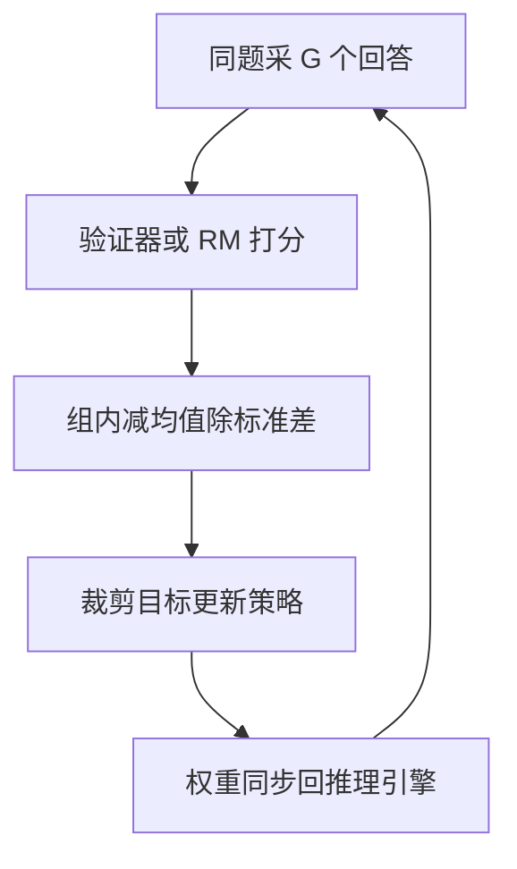

# GRPO(Group Relative Policy Optimization)

一句话:GRPO 把 PPO 里那个"随时预估比分的教练"(critic)撤了,改成**同一道题多考几遍,拿这一组的平均分当及格线**——同一个 prompt 采一组回答,谁比组内平均高就抬概率、低就压概率,于是那个和策略同量级的价值网络就不用养了。出自 DeepSeekMath,DeepSeek-R1 之后成了推理类 RL 的默认起点。

## 一、动机:PPO 的 critic 到底贵在哪

### 贵在它是第二个同量级模型

PPO 要一个 critic 给每个前缀估"从这里写完还能拿多少分",它和 reward model 的分工见 PPO 篇。麻烦出在它的**规模**:要在同样长的上下文上做逐 token 的价值估计,它通常就得是一个和策略差不多大的 Transformer——DeepSeekMath 原文的说法是,PPO 用的价值函数"通常是另一个与策略模型规模相当的模型,带来可观的显存与计算负担"。

算笔账。一个 7B 模型进入训练态,按 bf16 权重 2 + bf16 梯度 2 + fp32 主副本 4 + Adam 一阶二阶动量 4+4 ≈ **16 字节/参数**估,约 112 GB;actor 加 critic 就是两份、约 224 GB,还没算激活、KV cache 和 rollout 的中间结果。**去掉 critic,砍掉的正是这一整份训练态开销。** 但别把它说成一个固定百分比:actor 与 critic 是否共享底座、参数和优化器怎么分片、要不要卸载、rollout 引擎单独占几张卡,每一项都会改变实际比例(显存账怎么拆见 显存管理与OOM 篇)。**"GRPO 省一半显存"是一句不能报的话。**

### 还贵在它难训准

critic 的回归目标是"从当前前缀出发的期望回报",可 RLHF 的奖励几乎全落在最后一个 token 上。它得从这一个终局分,在几千个前缀位置上学出一条平滑的价值曲线,explained variance(它解释了多少回报方差)常常低得可怜;一旦估歪,GAE 会把这份偏差原样传给 actor(见 PPO 篇)。再加上 $\gamma$、$\lambda$、value clip、critic 单独的学习率这一串只为它存在的调参点,工程负担是实打实的。

所以 GRPO 的取舍一句话说得清:**用"同一题多采几个样本"这种能并行、能共享 prefill 的成本,换掉"再训一个同量级模型"这种既占显存又难调准的成本。**

### 去掉的只有 critic,别顺手多去掉三样

这是最容易顺口说错的一处。GRPO 拿掉的是价值网络,别的都还在:

| 还在不在 | 说明 |
|---|---|
| 奖励信号 | **在**。规则验证器、单元测试、过程或结果 RM 都行,但必须能形成可比较的标量(奖励怎么设计、怎么被钻空子见 RLHF与RM 篇) |
| reference 与 KL | **在**。原始 GRPO 目标里就带 $\beta D_{\mathrm{KL}}$;后来不少可验证奖励配方把它调弱甚至去掉,那是配方选择,不能反过来当成 GRPO 的定义 |
| 在线 rollout | **在**。每一组回答都由本轮策略现采,所以它**不是"在线 DPO"**(DPO 见 DPO 篇) |

还有一条反向的边界要说死:**组内相对化只负责"同一个输入下,这几个候选谁更好",它不负责奖励本身怎么合成。** 标准 GRPO 里没有向量奖励、也没有分段奖励这种东西——图文一致性、OCR 结果、安全规则、人类偏好这类多路反馈,必须先被显式聚合成一个可比较的标量(或写成约束优化)才能进组内标准化,各分量怎么定尺度、怎么处理冲突不属于 GRPO 的机制(多模态那一路的奖励怎么搭见 多模态RL 篇)。

## 二、核心机制:组内相对优势

### 一组回答,一条相对分

对 prompt $q$ 用旧策略采 $G$ 个回答 $o_1,\dots,o_G$,各自打分得 $r_1,\dots,r_G$,组内标准化就是优势:

$$
\hat A_i=\frac{r_i-\operatorname{mean}(r_1,\dots,r_G)}{\operatorname{std}(r_1,\dots,r_G)}
$$

读法:**分子把"你考了几分"换成"你比同组平均高多少分"**,这才是该拿去更新的信号;**分母把不同题的分数尺度拉到可比**,免得难题上的 +0.5 和水题上的 +3 混进同一个 batch 里打架。$\hat A_i$ 是**整条回答共享的一个标量**:

```python
# r: 同一道题 G 个回答的奖励,形状 [G]
mu, sd = r.mean(), r.std()
adv = (r - mu) / (sd + 1e-6)          # sd≈0 时整组优势≈0,这批算力白花
alive = sd > 1e-6                     # 零方差组的判据,占比要上监控面板
adv_tok = adv[:, None].expand(-1, T)  # 同一回答所有 token 共用,无逐 token 价值
```

顺手澄清一个容易混的地方:PPO 里的 advantage 白化是在**整个 batch** 内减均值除标准差,GRPO 是在**同一道题的组内**做,两者分母的口径完全不同,不是同一个操作换了个名字。

### 为什么"同组平均分"就能当基线

基线定理说:只要减掉的量**只依赖状态、不依赖动作**,期望梯度就不变(推导见 PPO 篇)。GRPO 把整条回答看成一次动作,那"状态"就是 prompt 本身,而这个状态的价值恰好是

$$
V(q)=\mathbb E_{o\sim\pi(\cdot\mid q)}\big[r(q,o)\big]
$$

也就是"这道题在当前策略下平均能拿几分"。**组内均值 $\bar r$ 正是它的蒙特卡洛估计**——PPO 让 critic 回归着去学这个数,GRPO 现场采 $G$ 个样本当场把它算出来。一个是**学出来的基线**,一个是**采出来的基线**,这是两者最本质的一句话区别。

减均值这一步还能算得更细。因为 $\bar r$ 里含着 $r_i$ 自己,严格展开得到

$$
\mathbb E\Big[\tfrac1G\textstyle\sum_i (r_i-\bar r)\,\nabla\log\pi(o_i)\Big]=\tfrac{G-1}{G}\,\nabla J
$$

意思是:**方向完全正确,只是整体缩了 $\frac{G-1}{G}$ 倍**(把自己从均值里剔掉连这个系数都没有了,这正是 RLOO 的留一法基线)。这条式子还顺手解释了 $G=1$ 为什么彻底废掉——系数变成 0,梯度恒为零。

**除以标准差就不是这回事了。** 它是一个**逐题不同、且非线性依赖本组样本**的缩放,不满足基线定理的前提,会实打实改变不同题之间的梯度权重。这是第三节那个难度偏置的来源。

### 和 PPO 的 GAE 是什么关系

把 GAE 取 $\gamma=1$、$\lambda=1$,它退化成 $\hat A_t=R-V(s_t)$:整条回答的回报,减去**写到当前这个 token 时**的价值。GRPO 相当于在这个式子里,把所有 $V(s_t)$ 统统换成同一个 $V(q)$ 的采样估计。所以一句话:

**GAE 的基线随"写到第几个 token"变,GRPO 的基线只随"这是哪道题"变。**

基线一旦在整条回答上是常数,token 之间就不再有任何差别——这就是"只有序列级信用分配、没有逐 token 价值"的出处。补一句边界:原论文其实还给了一个过程监督版本(每一步给分,某个 token 的优势是它之后各步归一化奖励之和),但通常说的 GRPO 是上面这个结果监督版。

### 目标函数,以及 KL 为什么单独放

$$
\mathcal J_{\text{GRPO}}=\mathbb E\left[\frac1G\sum_{i=1}^{G}\frac{1}{|o_i|}\sum_{t=1}^{|o_i|}\Big(\min\big(\rho_{i,t}\hat A_i,\ \operatorname{clip}(\rho_{i,t},1-\varepsilon,1+\varepsilon)\hat A_i\big)-\beta\, D_{\mathrm{KL}}\big[\pi_\theta\Vert\pi_{\text{ref}}\big]\Big)\right]
$$

逐项读:$\rho_{i,t}$ 仍是**逐 token** 的新旧策略概率比,裁剪也原样保留(这两件的原理见 PPO 篇);$\frac1G\sum_i$ 表示组内每条回答同等份量;$\frac{1}{|o_i|}\sum_t$ 表示一条回答内部按 token 取平均;最后减掉的那一项就是**独立的 KL 惩罚**。

**KL 为什么被拎出来单独放?** 论文给的理由很朴素:折进逐 token 奖励会把优势的计算搞复杂——终局分要先扣掉每个位置的 KL 罚,那组内标准化该在扣之前还是扣之后做,就凭空多出一个必须回答的问题。做成独立项之后,组内标准化只处理那一个干净的终局分,KL 单走一路直接作用到参数上。代价是这一项**不乘优势、也不过裁剪**,推参数的力度全交给 $\beta$ 和估计器;GRPO 用的是 k3 估计器,而 k3 在"数值上无偏、当损失反传时梯度却对应反方向那个 KL"这件事上有个很深的坑,连同 $\beta$ 怎么调,都见 KL散度 篇。



## 三、代价与旋钮

### 代价一:生成量乘以 G

有效轨迹数 = prompt 数 × $G$,DeepSeekMath 每道题采了 64 个回答(论文口径)。省掉的是 critic 的显存与训练算力,花出去的是生成算力。有一点能缓解:同一 prompt 的 $G$ 次生成共享同一段前缀,prefill 靠 prefix caching 只算一次,**真正随 $G$ 线性涨的是 decode 那一半**。

### 代价二:信用分配只到序列级

一条 500 token 的回答可能只错在第三步,但 500 个 token 共享同一个 $\hat A_i$、被一起压低;token 之间唯一的差别只来自 $\rho_{i,t}$。GRPO 做区分的地方在**同组不同回答之间**,不在一条回答的内部。所以需要细粒度状态价值的场景(长多轮 agent 轨迹尤其明显)这个粒度就不够用,多轮的信用分配见 AgenticRL 篇。顺带说清一个常见误答:免 critic 只是降低了工程复杂度,**不代表更抗 OOD 退化**(见 RLHF与RM 篇)。

### 组大小 $G$:两头都有代价

| $G$ | 会怎样 |
|---|---|
| 太小 | 均值和标准差都由几个样本估出来,本身就抖;标准差还在分母上,把抖动放大。$G=1$ 时优势恒为 0,完全没有信号 |
| 太大 | 生成成本近似线性涨;**固定总生成预算下,$G$ 翻倍等于能覆盖的不同 prompt 减半** |

所以真正的取舍轴不是"$G$ 越大越好",而是:**同样多的生成算力,是花在同一道题的更多解法上,还是花在更多不同的题上。** 没有通用的 8 或 16,DeepSeekMath 的 64 是那篇论文的设置,不是默认值。判据应该落在两个可观测量上——非零方差组的占比,以及每单位生成算力换来的任务收益。

### 零方差组:白采的那一批

整组全对或全错时,$r_i$ 全一样,分子全为 0、分母也趋近 0(实现上给分母加个小常数),**整组优势全是 0:对梯度一分贡献没有,生成算力却照花**。这是 GRPO 特有的、最该上面板的一个数。

反过来看,这条也解释了 GRPO 为什么在数学、代码这类任务上特别顺手:有自动判据所以打分便宜,同一道题又天然有多种解法、多种错法,组内容易出现好坏混合、$\operatorname{std}$ 不为 0。**组内相对化能不能工作,前提就是同一题采得出有区分度的候选**;组内经常同分的任务(开放写作、笼统的"质量好不好")会大面积退化成零方差组。

它为什么会成批出现:题目对当前策略太简单(全会)或太难(全不会);冷启动阶段模型连输出格式都不对,一律 0 分。处理方向分三类——**入库前**用当前模型预跑,按通过率把两头的题筛掉;**训练中**检测到零方差组就丢弃并补采,直到凑够足额有效组;**训练前**先做一轮小规模 SFT 教会格式与长思维链骨架,否则开局全是零方差组。其中"检测到就动态补采"被后续变体做成了标准动作,具体怎么补见 GRPO变体 篇。

### 两个偏置从哪来

这两条都不是实现 bug,而是目标函数写法带来的系统性倾斜。面试里能说清**来源**比能背修法值钱得多(各家怎么改见 GRPO变体 篇):

- **长度偏置来自 $\frac{1}{|o_i|}$。** 它让每条回答不论长短对损失的贡献相同,于是摊到单个 token 上的梯度权重是 $\hat A_i/|o_i|$。回答错了($\hat A_i<0$)时,写得越长,每个 token 挨的罚越轻——等于在告诉模型"答不对就多写点"。所以生成长度的分布必须常盯,异常漂移常常就是这一项在起作用。
- **难度偏置来自标准差那个分母。** 一道题若组内答案高度一致(几乎全对或几乎全错),$\operatorname{std}$ 很小,除下去会把那点微弱差异放大成很大的优势;而 std 大的中等难度题反被压小。结果是梯度被那些几乎没有信息量的题主导。

### 陈旧度:去掉 critic 不改变数据从哪来

去掉 critic 改的是**优势怎么算**,不改**数据分布属性**:一组回答仍由本轮冻结的旧策略采出,仍靠概率比加裁剪有限复用几个 mini-epoch,所以 GRPO 和 PPO 一样是**近似 on-policy**(口径与"一批数据被用几次"见 PPO 篇)。想让它长期吃离线轨迹是另一回事:支持集覆盖不住、重要性权重方差爆炸,把 epoch 调大解决不了,得上截断校正或更保守的目标。GRPO 还多一个自己的陈旧点——**组内的均值和标准差是采样那一刻算好的**,mini-epoch 越多,这条"及格线"越过期。

面板最少要有:组内奖励的均值与方差、零方差组占比、生成长度分布、熵、KL,以及 pass@1 与 pass@$G$(这两个数怎么读见 RLHF与RM 篇)。

## 四、和 PPO 摆在一起:哪些零件留下,哪些拆了

| 零件 | PPO | GRPO |
|---|---|---|
| 优势怎么来 | critic 学出 $V(s_t)$ 再走 GAE,逐 token | 组内标准化,整条回答共享一个标量 |
| 基线 | 学出来的,随前缀变 | 采出来的,只随 prompt 变 |
| 概率比 $\rho_{i,t}$ | 保留,逐 token | **保留,仍是逐 token** |
| 裁剪 | 保留 | **保留** |
| 价值回归项 | 有,还常配 value clip | **整项删掉** |
| $\gamma$、$\lambda$ | 要调 | **不存在** |
| 参考 KL | 常折进逐 token 奖励 | **独立损失项** |
| 训练态模型 | actor + critic | 只有 actor |
| 每个 prompt 的生成量 | 1 条即可 | $G$ 条 |

一句话总结这张表:**GRPO 留下了 PPO 负责"限步长"的那一半(概率比 + 裁剪),换掉了负责"降方差"的那一半(critic + GAE → 组内相对化)。** 至于某个任务该选 PPO、GRPO 还是 DPO,判据在反馈形态而不在算法名气,见 RLHF与RM 篇;GRPO 一族各变体分别修了上面哪个毛病,见 GRPO变体 篇。

最后一条和机制无关、但真被问到过的答题边界:题干里出现对不上号的缩写(比如"SFTQ"这种既没论文也没全称的写法),正确做法是**先要论文、全称和训练目标**;澄清之前最多按普通 SFT 讨论,不能自己编一套损失去和 GRPO 比。编出来的对比,面试官一追就穿。

## 五、面试考点串联

| 高频问法 | 本文哪一节 |
|---|---|
| GRPO 为什么要对同一个 prompt 采一组回答?核心目标长什么样? | 二(一组回答,一条相对分;目标函数,以及 KL 为什么单独放) |
| 组内平均分凭什么能当基线?它和 PPO 的 GAE 基线是什么关系? | 二(为什么"同组平均分"就能当基线;和 GAE 是什么关系) |
| GRPO 省掉 critic 到底省了什么?能报一个固定的显存比例吗? | 一(贵在它是第二个同量级模型) |
| 去掉 critic 的代价是什么?什么时候这个粒度不够用? | 三(代价二:信用分配只到序列级) |
| group size 怎么选?调大调小分别有什么影响? | 三(组大小 $G$) |
| 一组回答全对或全错会发生什么?工程上怎么处理? | 三(零方差组) |
| GRPO 是不是免奖励模型?还要不要 reference?它是"在线 DPO"吗? | 一(去掉的只有 critic) |
| PPO 和 GRPO 把 KL 放在哪里?GRPO 为什么要单独放,代价是什么? | 二(目标函数,以及 KL 为什么单独放) |
| GRPO 的目标函数和 PPO 比,哪些项保留了、哪些删了? | 四(零件对照表) |
| 去掉 critic 之后还算 on-policy 吗?想复用旧数据要注意什么? | 三(陈旧度) |
| GRPO 的长度偏置和难度偏置分别是从哪一项来的? | 三(两个偏置从哪来) |
| 长序列任务上 GRPO 为什么可能吃亏? | 三(生成量乘以 G;信用分配只到序列级;两个偏置从哪来) |
| GRPO 为什么在数学、代码上顺手?多模态的混合反馈怎么接进来? | 三(零方差组,开头一段);一(去掉的只有 critic,表下一段) |
| 补充题:$G=1$ 时 GRPO 会怎样,为什么? | 二(缩放系数 $\frac{G-1}{G}$) |
| 补充题:题干给了一个查不到出处的算法缩写,你怎么答? | 四(末段答题边界) |

## 相关文献

- DeepSeekMath: Pushing the Limits of Mathematical Reasoning in Open Language Models(GRPO 首次提出,§4)— [arXiv:2402.03300](https://arxiv.org/abs/2402.03300)
- DeepSeek-R1: Incentivizing Reasoning Capability in LLMs via Reinforcement Learning — [arXiv:2501.12948](https://arxiv.org/abs/2501.12948)
- Proximal Policy Optimization Algorithms(概率比与裁剪的出处)— [arXiv:1707.06347](https://arxiv.org/abs/1707.06347)
- Back to Basics: Revisiting REINFORCE Style Optimization for Learning from Human Feedback in LLMs(RLOO 的留一法基线)— [arXiv:2402.14740](https://arxiv.org/abs/2402.14740)
- Approximating KL Divergence(k1/k2/k3 估计器)— John Schulman 博客 — http://joschu.net/blog/kl-approx.html
