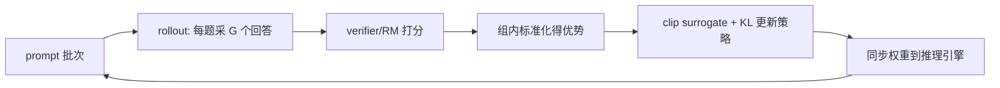

# GRPO(Group Relative Policy Optimization)

> ⚠️ 旧版:本篇写于写作契约确立之前,尚未按新标准审查重写。标准见 docs/05-知识库写作契约.md,样板见「GPU架构与执行模型」。

一句话:**去掉 critic 的 PPO 变体**——对同一个 prompt 采样一组回答,用组内相对得分代替价值网络来估计优势。出自 DeepSeekMath,后成为 DeepSeek-R1 及大量推理模型 RL 训练的默认起点。

## 一、动机:PPO 的痛点

PPO 需要一个与 policy 同量级的 value model(critic)来估计每个 token 的优势:

- **critic 开销高**:训练时要维护 policy、critic(外加可能存在的 reference、reward 模型),critic 还带来参数、梯度与优化器状态;实际增量依模型是否共享、分片和卸载方式而定;
- **critic 难训**:LLM 场景 reward 稀疏(只有序列末尾有分),token 级价值估计噪声大,critic 学不好会拖垮整个训练;
- **工程复杂**:GAE 超参、value loss 裁剪等一堆调参点。

GRPO 的取舍:放弃 token 级的精细优势估计,换取**免 critic** 的简单与省显存。

## 二、核心机制

对每个 prompt $q$,用当前策略采样 $G$ 个回答 $\{o_1, \dots, o_G\}$,打分得 $\{r_1, \dots, r_G\}$,组内标准化作为该回答**所有 token 共享**的优势:

$$
\hat{A}_i = \frac{r_i - \mathrm{mean}(r_1, \dots, r_G)}{\mathrm{std}(r_1, \dots, r_G)}
$$

目标函数仍是 PPO 式的 clip surrogate,外加一个独立的 KL 正则项:

$$
\mathcal{J} = \mathbb{E}\left[ \frac{1}{G}\sum_{i=1}^{G} \frac{1}{|o_i|} \sum_{t} \min\!\left(\rho_{i,t}\,\hat{A}_i,\ \mathrm{clip}(\rho_{i,t},\, 1\!-\!\varepsilon,\, 1\!+\!\varepsilon)\,\hat{A}_i\right) \right] - \beta\, D_{\mathrm{KL}}(\pi_\theta \,\|\, \pi_{\mathrm{ref}})
$$

其中 $\rho_{i,t}$ 是新旧策略在 token $t$ 上的概率比。两个易被追问的细节:

- **KL 的位置**:PPO 通常把 per-token KL 惩罚折进 reward;GRPO 把 KL 作为独立项直接加在 loss 上,并用 k3 估计器 $\mathrm{KL} \approx \pi_{ref}/\pi_\theta - \log(\pi_{ref}/\pi_\theta) - 1$(无偏、恒正、低方差);
- **优势是 response 级的**:组内同一回答的所有 token 用同一个 $\hat{A}_i$,token 级差异只来自 ratio。

### 与 PPO 对比

| 维度 | PPO | GRPO |
| --- | --- | --- |
| 优势估计 | critic + GAE(token 级) | 组内标准化(response 级) |
| 额外模型 | 需 value model | 不需要 |
| 显存 | critic 带来额外训练态开销 | 省去 critic,实际节省依实现而定 |
| 方差控制 | critic 基线 + GAE | 组内相对基线;组大小、相关性与离群奖励都会影响方差 |
| 适用 | 通用 | 奖励可自动判定的场景尤佳(数学/代码) |

### 与 DPO 的本质区别

GRPO 不是“在线 DPO”。DPO 使用固定的优选/劣选回答对,把 KL 正则奖励目标改写成策略与 reference 概率比上的分类式损失,训练流程接近监督学习;GRPO 则由当前或近期策略在线采样一组回答,对每条回答计算标量奖励,再用新旧策略概率比做裁剪更新。因此 DPO 不需要在线 rollout、独立奖励模型和 critic,但受离线偏好对覆盖限制;GRPO 可以探索数据中没有的回答,代价是采样、打分和策略陈旧问题。

### 免 critic 不等于免奖励

GRPO 只去掉价值模型。奖励可以来自数学答案匹配、代码单元测试、规则验证器、过程/结果奖励模型或人类/AI 偏好评委;最终都要形成可比较的标量或明确的多目标组合。可验证奖励通常更容易审计,但测试覆盖、格式解析和规则漏洞仍可能被策略利用。原始 GRPO 目标可包含相对 reference 的 KL 项,是否保留及其权重属于具体训练配方,不能从“免 critic”推导出“没有 reference”或“没有正则”。

### 训练循环

## 三、训练细节与常见坑

- **组大小 $G$**:增大组大小能提供更多同题候选,但不保证单调降低方差;候选相关、奖励离群和难度分布都会影响统计。rollout 成本随生成数增长,预算固定时 G 与 prompt 覆盖面需要权衡,没有跨任务通用的固定范围。
- **零梯度组**:整组全对或全错 → std 为 0、优势全 0,这组白采了。处理:入库前按难度预筛、训练中过滤并**动态补采**(DAPO 的 dynamic sampling)。
- **长度偏置**:$1/|o_i|$ 归一化让正优势偏爱短回答、负优势偏爱长回答;Dr. GRPO 建议去掉该归一化。务必监控生成长度是否异常漂移(变相长度 hack 常见)。
- **clip 上限压探索**:低概率 token 的上行空间被 $1+\varepsilon$ 卡死,熵易崩塌;DAPO 的 clip-higher 把上限单独调大(如 0.28)。
- **KL 要不要**:有些可验证奖励配方会减弱或去掉 reference KL,另一些仍保留。应根据实测 KL、独立任务指标和 reward hacking 风险决定,不能把无 KL 当成 GRPO 定义。
- **样本复用程度**:同一轮 rollout 做多个 mini-epoch 时,后续更新与采样策略逐渐偏离,概率比和 clip 用来限制代理目标继续从大偏移中获益。即使只更新一步,策略梯度仍不是普通加权 SFT;clip 也不是把实际策略硬投影到某个区间。
- **监控面板最少要有**:组内 reward 均值/方差、零梯度组占比、生成长度、熵、KL、pass@1/pass@G。

## 四、数据(prompt 池)怎么构建

- **可验证性优先**:数学答案匹配、代码单元测试等 rule-based verifier 通常便宜且可审计,但仍要防解析漏洞、答案泄漏与测试覆盖不足;
- **难度分布是命门**:整组奖励完全相同时,组相对优势没有有效信号。可用基线模型预跑并按实际零方差组占比调整难度,不应把某个通过率区间写成通用门槛;
- **多样性与去污染**:题型/领域去重,严格与评测集去重;
- **冷启动**:先做小规模 SFT(教会目标格式与长 CoT 骨架)再上 RL,否则初期连格式分都拿不到,全是零梯度组;
- **reward 组成**:结果分(对/错)必备;格式分(如 `<think>` 标签)帮助早期收敛;长度惩罚按需。

## 五、rollout 细节

- **采样参数**:组内需要足够多样性才能产生相对信号;温度或 top-p 太低容易让回答同质化,太高又可能放大无效样本。具体范围应由任务、模型和奖励分布验证,没有通用固定值;
- **截断处理**:超 max length 被截断的回答,reward 记 0、软惩罚还是直接丢弃,必须显式约定(DAPO 提出 overlong 过滤/软惩罚),否则模型学会用"说不完"逃避判分;
- **引擎分离与同步**:rollout 用 vLLM 等推理引擎,训练若干步后同步权重;注意推理端与训练端对同一 token 的 logprob 存在数值差异,严格实现会用训练端重算;
- **batch 组织**:有效样本数 = prompt 数 × G;同一 prompt 的 G 次生成可共享 prefill(prefix caching)显著省算力;进一步可做异步 rollout 掩盖训练空泡。

### 长序列、多模态与噪声奖励的边界

GRPO 在可验证推理任务中常见,原因是结果奖励清楚、同题能采出多种解法,且免 critic 能降低训练复杂度。这不代表组相对机制自动改善长上下文或多轮对话。长回答会增加 rollout 成本,终局奖励难以判断具体哪一步有功,按回答长度归一化还可能引入长度偏置。奖励稀疏但可靠、组内能形成好坏混合时,GRPO 较自然;组内经常同分、生成昂贵或需要细粒度状态价值时,PPO 的 critic 仍可能有价值。奖励噪声大时,两者都会把错误信号放大,应先校准奖励、增加独立评测并限制更新幅度。

多模态任务可把图文一致性、OCR/检测结果、安全规则和人类偏好组合成奖励,但要先定义各分量的尺度、冲突处理与独立验收。标准 GRPO 没有内置的“广义向量奖励”或“分段奖励”机制;多目标反馈仍需显式聚合或做约束优化,组内相对优势只负责比较同一输入下的候选。

## 六、面试考点串联

| 问法 | 本文回答位置 |
| --- | --- |
| GRPO 的全称、组内相对优势和核心目标是什么? | 二、核心机制 |
| GRPO 与 PPO 在 critic、方差、稳定性和训练成本上怎样比较? | 一、动机;二、与 PPO 对比 |
| GRPO 是否免奖励模型,规则奖励、神经 RM 与 reference KL 各负责什么? | 二、免 critic 不等于免奖励 |
| GRPO 与 DPO 的数据、目标和在线探索有何区别? | 二、与 DPO 的本质区别 |
| 多模态反馈怎样接入,组相对机制是否自带向量奖励? | 长序列、多模态与噪声奖励的边界 |
| 长序列、稀疏或噪声奖励下怎样在 GRPO 与 PPO 间选择? | 长序列、多模态与噪声奖励的边界 |
| “SFTQ”未给论文或完整定义时能否直接与 GRPO 比较? | 本表下方说明 |

> 本篇仍保留旧稿重写状态。

“SFTQ”不是可唯一识别的通用算法缩写。遇到此类问法应先索要论文、全称、数据格式和训练目标;未澄清前最多与普通 SFT 比较,不能自行构造“SFTQ”的损失或性能结论。

## 相关文献

- DeepSeekMath(GRPO 首次提出,§4)— [arXiv:2402.03300](https://arxiv.org/abs/2402.03300)
- DeepSeek-R1(GRPO 大规模实战与 R1-Zero 配方)— [arXiv:2501.12948](https://arxiv.org/abs/2501.12948)
- DAPO(clip-higher / 动态采样 / overlong 处理)— [arXiv:2503.14476](https://arxiv.org/abs/2503.14476)
- Dr. GRPO / Understanding R1-Zero-Like Training(长度偏置修正)— [arXiv:2503.20783](https://arxiv.org/abs/2503.20783)
- GSPO(序列级重要性采样,Qwen 后续改进)— [arXiv:2507.18071](https://arxiv.org/abs/2507.18071)
- KL 估计器 k1/k2/k3 — John Schulman, *Approximating KL Divergence*:http://joschu.net/blog/kl-approx.html
- DPO(离线成对偏好目标)— [arXiv:2305.18290](https://arxiv.org/abs/2305.18290)
