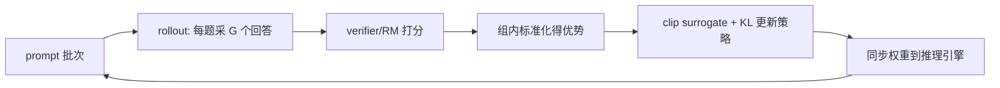

# GRPO(Group Relative Policy Optimization)

> ⚠️ 旧版:本篇写于写作契约确立之前,尚未按新标准审查重写。标准见 docs/04-知识库写作契约.md,样板见「GPU架构与执行模型」。

一句话:**去掉 critic 的 PPO 变体**——对同一个 prompt 采样一组回答,用组内相对得分代替价值网络来估计优势。出自 DeepSeekMath,后成为 DeepSeek-R1 及大量推理模型 RL 训练的默认起点。

## 一、动机:PPO 的痛点

PPO 需要一个与 policy 同量级的 value model(critic)来估计每个 token 的优势:

- **显存/算力翻倍**:训练时要同时维护 policy、critic(外加 reference、reward 模型);
- **critic 难训**:LLM 场景 reward 稀疏(只有序列末尾有分),token 级价值估计噪声大,critic 学不好会拖垮整个训练;
- **工程复杂**:GAE 超参、value loss 裁剪等一堆调参点。

GRPO 的取舍:放弃 token 级的精细优势估计,换取**免 critic** 的简单与省显存。

## 二、核心机制

对每个 prompt $q$,用当前策略采样 $G$ 个回答 $\{o_1, \dots, o_G\}$,打分得 $\{r_1, \dots, r_G\}$,组内标准化作为该回答**所有 token 共享**的优势:

$$
\hat{A}_i = \frac{r_i - \mathrm{mean}(r_1, \dots, r_G)}{\mathrm{std}(r_1, \dots, r_G)}
$$

目标函数仍是 PPO 式的 clip surrogate,外加一个独立的 KL 正则项:

$$
\mathcal{J} = \mathbb{E}\left[ \frac{1}{G}\sum_{i=1}^{G} \frac{1}{|o_i|} \sum_{t} \min\!\left(\rho_{i,t}\,\hat{A}_i,\ \mathrm{clip}(\rho_{i,t},\, 1\!-\!\varepsilon,\, 1\!+\!\varepsilon)\,\hat{A}_i\right) \right] - \beta\, D_{\mathrm{KL}}(\pi_\theta \,\|\, \pi_{\mathrm{ref}})
$$

其中 $\rho_{i,t}$ 是新旧策略在 token $t$ 上的概率比。两个易被追问的细节:

- **KL 的位置**:PPO 通常把 per-token KL 惩罚折进 reward;GRPO 把 KL 作为独立项直接加在 loss 上,并用 k3 估计器 $\mathrm{KL} \approx \pi_{ref}/\pi_\theta - \log(\pi_{ref}/\pi_\theta) - 1$(无偏、恒正、低方差);
- **优势是 response 级的**:组内同一回答的所有 token 用同一个 $\hat{A}_i$,token 级差异只来自 ratio。

### 与 PPO 对比

| 维度 | PPO | GRPO |
| --- | --- | --- |
| 优势估计 | critic + GAE(token 级) | 组内标准化(response 级) |
| 额外模型 | 需 value model | 不需要 |
| 显存 | 高 | 约省一半训练态模型 |
| 方差控制 | critic 拟合 | 靠组内多样本(G 越大越稳) |
| 适用 | 通用 | 奖励可自动判定的场景尤佳(数学/代码) |

### 训练循环

## 三、训练细节与常见坑

- **组大小 $G$**:常用 4–16。越大优势估计越稳,但 rollout 成本线性增长;预算固定时 G 与 prompt 数是权衡。
- **零梯度组**:整组全对或全错 → std 为 0、优势全 0,这组白采了。处理:入库前按难度预筛、训练中过滤并**动态补采**(DAPO 的 dynamic sampling)。
- **长度偏置**:$1/|o_i|$ 归一化让正优势偏爱短回答、负优势偏爱长回答;Dr. GRPO 建议去掉该归一化。务必监控生成长度是否异常漂移(变相长度 hack 常见)。
- **clip 上限压探索**:低概率 token 的上行空间被 $1+\varepsilon$ 卡死,熵易崩塌;DAPO 的 clip-higher 把上限单独调大(如 0.28)。
- **KL 要不要**:纯可验证奖励 + 从较强 SFT 起点训练时,常直接去 KL(R1-Zero 风格)换更快提升;用神经 RM 时建议保留,防 reward hacking。
- **off-policy 程度**:一轮 rollout 训多个 mini-epoch 时 ratio 才明显偏离 1,clip 才真正起作用;完全 on-policy(训 1 步)时 GRPO 退化接近加权 SFT。
- **监控面板最少要有**:组内 reward 均值/方差、零梯度组占比、生成长度、熵、KL、pass@1/pass@G。

## 四、数据(prompt 池)怎么构建

- **可验证性优先**:数学(答案精确匹配)、代码(单元测试)可用 rule-based verifier,不可 hack,优于神经 RM;
- **难度分布是命门**:只有 $0 < \text{pass@}G < 1$ 的题才产生梯度。离线用基线模型预跑,保留通过率在约 0.1–0.9 区间的题,太易太难都是无效算力;
- **多样性与去污染**:题型/领域去重,严格与评测集去重;
- **冷启动**:先做小规模 SFT(教会目标格式与长 CoT 骨架)再上 RL,否则初期连格式分都拿不到,全是零梯度组;
- **reward 组成**:结果分(对/错)必备;格式分(如 `<think>` 标签)帮助早期收敛;长度惩罚按需。

## 五、rollout 细节

- **采样参数**:温度 ~1.0、top-p 0.95–1.0。组内多样性就是优势信号的来源——温度太低组内同质化,等于自制零梯度组;
- **截断处理**:超 max length 被截断的回答,reward 记 0、软惩罚还是直接丢弃,必须显式约定(DAPO 提出 overlong 过滤/软惩罚),否则模型学会用"说不完"逃避判分;
- **引擎分离与同步**:rollout 用 vLLM 等推理引擎,训练若干步后同步权重;注意推理端与训练端对同一 token 的 logprob 存在数值差异,严格实现会用训练端重算;
- **batch 组织**:有效样本数 = prompt 数 × G;同一 prompt 的 G 次生成可共享 prefill(prefix caching)显著省算力;进一步可做异步 rollout 掩盖训练空泡。

## 六、面试考点串联

高频问法(与题库联动的切片点):

1. GRPO 相比 PPO 改了什么、为什么省显存 →「动机 + 对比表」
2. 优势怎么算、是 token 级还是 response 级 →「核心机制」
3. KL 为什么放 loss 里、k3 估计器 →「核心机制」
4. 整组全对/全错怎么办 →「训练细节:零梯度组」
5. GRPO 有哪些已知偏置与改进(DAPO、Dr. GRPO)→「训练细节」
6. RL 数据怎么造、难度怎么控 →「数据构建」
7. rollout 温度、截断、引擎同步 →「rollout 细节」

## 相关文献

- DeepSeekMath(GRPO 首次提出,§4)— [arXiv:2402.03300](https://arxiv.org/abs/2402.03300)
- DeepSeek-R1(GRPO 大规模实战与 R1-Zero 配方)— [arXiv:2501.12948](https://arxiv.org/abs/2501.12948)
- DAPO(clip-higher / 动态采样 / overlong 处理)— [arXiv:2503.14476](https://arxiv.org/abs/2503.14476)
- Dr. GRPO / Understanding R1-Zero-Like Training(长度偏置修正)— [arXiv:2503.20783](https://arxiv.org/abs/2503.20783)
- GSPO(序列级重要性采样,Qwen 后续改进)— [arXiv:2507.18071](https://arxiv.org/abs/2507.18071)
- KL 估计器 k1/k2/k3 — John Schulman, *Approximating KL Divergence*:http://joschu.net/blog/kl-approx.html
