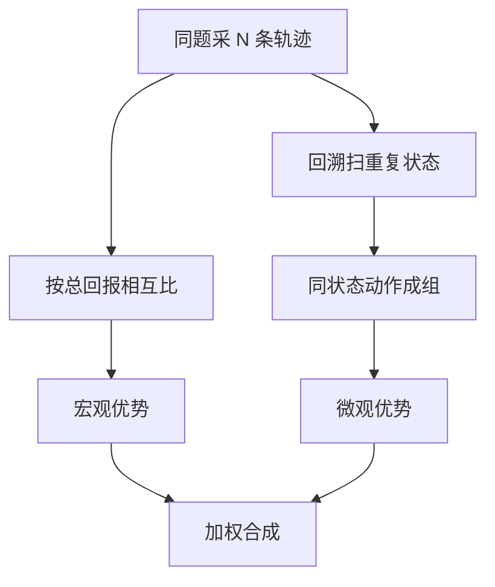

# GRPO 变体(DAPO / Dr. GRPO / GSPO / GiGPO)

一句话:这篇不讲 GRPO 怎么工作,只讲**它在大规模训练里暴露出的几个具体故障,以及四组改法各自动了哪一处、换来什么、又付出什么代价**——组内相对优势怎么算、为什么能免掉 critic、组大小 $G$ 怎么影响方差,见 GRPO 篇。

## 一、病历:GRPO 留下的五个口子

GRPO 把一道题采一组回答、用组内相对得分当优势,省掉了 critic。但"省"是有代价的:**价值函数原本干的两件事——给每个位置一个基线、把终局奖励沿轨迹往前摊——现在被一个"整条回答共享的标量"顶替了**;再加上组统计和逐 token 概率比这两处实现选择,一共漏出五个口子。下面每个变体登场时,都先回到它盯上的那一条。

| 口子 | 面板上的症状 | 谁来修 |
|---|---|---|
| 裁剪上界把探索压死 | 训练早期熵急速下滑,一组回答越采越像 | DAPO 的 clip-higher |
| 零方差组 | 整组全对或全错,优势恒为 0,这批 rollout 白采 | DAPO 的动态采样 |
| 长回答在梯度里被稀释 | 长 CoT 里的好模式学不进去、坏模式也罚不动 | DAPO 的 token 级损失 |
| 两处归一化带来的偏置 | 错误回答越写越长;最没区分度的题权重最高 | Dr. GRPO |
| token 级概率比的噪声 | 长序列上比率分布出尖峰;MoE 直接训崩 | GSPO |
| 整条轨迹共享一个优势 | 多轮任务里十步只错一步,十步同罚 | GiGPO |

两条边界先说死。其一,**这些是 GRPO 的病,不是 PPO 的病**:PPO 的不稳主要来自 critic/GAE 的估计误差、多 epoch 复用后的策略陈旧和奖励噪声(见 PPO 篇),两套故障不能混着讲。其二,**时间线别搞反**:DeepSeek-R1 用 GRPO 家族是为了免掉同规模 critic,配的是可验证的准确性与格式奖励;下面四组改法全是 R1 之后的工作,**不能反向归因给 R1**。

## 二、DAPO:四个补丁,一个补丁对一个故障

DAPO 是一整套配方而不是单点改动,论文自报在 Qwen2.5-32B base 上把 AIME 2024 从朴素 GRPO 的 30 分做到 50 分,四条补丁在消融表里是逐级叠上去的。**默认的 GRPO 实现不自带这些**——别把"我用了 GRPO"当成"我有这些"。(它还顺手去掉了 reference KL 项,理由是长 CoT 训练本来就要让分布大幅偏离初始模型,这个约束没必要;KL 该不该留、$\beta$ 怎么调见 KL散度 篇。)

### clip-higher:熵塌缩,以及低概率 token 被系统性压死

旧问题出在"上下界共用一个 $\varepsilon$"(裁剪本身、以及"裁的是激励而不是把概率硬投影回区间"这个要点,见 PPO 篇)。看一眼这个乘性上界对不同概率的 token 意味着什么:$\varepsilon=0.2$ 时,一个旧概率 0.9 的 token,目标函数最多鼓励它涨到 1.08——概率本来就封顶 1,等于没约束;而一个旧概率 0.01 的探索性 token,激励在 0.012 就到顶,**绝对增量只有 0.002**。同一条规则,对已经占优的 token 几乎不设限,对冷门 token 卡得死死的。后果就是策略越训越尖:少数强势 token 吃掉全部上行空间,冷门但可能正确的路径永远爬不上来,熵急速下滑,一组 rollout 高度同质——**而 GRPO 的优势全靠组内差异,组一同质,信号就没了**。

新设计是把上下界拆开:$\mathrm{clip}(\rho_{i,t},\,1-\varepsilon_{\text{low}},\,1+\varepsilon_{\text{high}})$,论文取 $\varepsilon_{\text{low}}=0.2$、$\varepsilon_{\text{high}}=0.28$。只放宽上行,下行照旧——压概率那一侧本来就不缺力度。收益是策略熵回升、样本多样性变高,消融里这一条把 36 分推到 38 分。

代价:上界不是越大越好。$\varepsilon_{\text{high}}$ 放太大,低概率 token 的上行激励一步就能放大十几倍,而它们的优势估计恰恰最不可靠(组内被采到的次数最少),这时的"探索"其实是被噪声推着走。这条也只治"上行空间不对称",治不了奖励本身有偏。

### 动态采样:零方差组是在白烧 rollout

组内奖励全一样时,减完均值优势全是 0,这道题对本次更新的贡献是零。模型越训越强,"整组全对"的比例就越高,于是**一个 batch 里真正产生梯度的样本数越来越少、还上下抖**——等效 batch 缩水、梯度噪声变大,而 rollout 的钱一分没省。

新设计:过采样,把准确率恰好为 0 或 1 的 prompt 直接滤掉,继续采直到凑满一个"全是中等难度"的 batch。消融里这是分数拉升最大的一条(42 → 50),因为它同时稳住了有效样本数和梯度尺度。

代价很实在。**采样预算不再固定**:到训练后期,为了凑满一个 batch 可能要多采好几倍,论文的做法是允许采样轮数上浮。而且过滤等于**动态改写了训练集的难度分布**——太简单和太难的题被系统性排除,如果这些题本身重要,得靠 prompt 池设计补回来(池子怎么建见 GRPO 篇)。

### token 级损失:长回答在梯度里被摊薄

问题出在 GRPO 的两层平均:先在每条回答内部除以自己的长度,再对 $G$ 条回答取平均。**这等于给每条回答同样的话语权,不管它是 200 token 还是 8000 token**;于是长回答里每个 token 分到的权重只有短回答的几十分之一。长 CoT 训练最想学的恰恰是长回答里那些正确的推理模式,最想罚的也是长回答里的重复、车轱辘话和乱码——两件事一起被稀释。DAPO 把分母换成**这一组的 token 总数**,让每个 token 话语权相等:

```python
# 同一批 rollout、同一份 per_token_loss,三种聚合只差一个分母
# mask 标记有效 token(padding 不计),G 是组大小

# GRPO:先在每条回答内部按自己的长度平均,再对 G 条回答平均
#   → 每条回答话语权相等,长回答里单个 token 被摊薄
loss_grpo = ((per_token_loss * mask).sum(-1) / mask.sum(-1)).mean()

# DAPO:整组 token 一起平均,分母是这一组的 token 总数
#   → 每个 token 话语权相等,长回答的好坏模式都学得动
loss_dapo = (per_token_loss * mask).sum() / mask.sum()

# Dr. GRPO:分母换成常数(全局最大生成长度),与回答长短彻底脱钩
#   → 消掉"负优势时长回答挨罚更轻"的不对称
loss_dr_grpo = (per_token_loss * mask).sum() / (G * MAX_GEN_LEN)
```

收益是长度曲线与熵曲线都更健康,消融里 41 → 42。代价是长回答对更新方向的影响随之变大:奖励里只要存在"写长了容易得分"的漏洞,这条会把漏洞放大得更快,所以它通常和下面的超长整形以及长度监控一起上。

### 超长回答的奖励整形:别为"没说完"判死刑

被最大长度截断的回答怎么算分?直接给 0 或负分,惩罚的是"没写完"而不是"写错了"——一段推理完全正确、只是超了预算,却拿到和胡言乱语一样的信号,这是**纯噪声进梯度**。

DAPO 分两步:先做 **overlong filtering**,把截断样本的损失屏蔽掉,不让它们污染梯度;再上 **soft punishment**——最大长度设 20480,其中留 4096 当缓冲带,回答在 16384 以内不扣分,落进 16384–20480 这段按超出长度线性加罚,越过上限则罚满。光是把截断样本先屏蔽掉,消融里就从 30 分到 36 分,**说明噪声奖励的破坏力比大多数人估计的大**。

代价:这等于往奖励里塞了一个长度先验,两个阈值都是任务相关的超参——设太紧会压掉本来就需要长推理的题,设太松等于没设。它也替代不了对长度 hack 的监控(奖励侧的诊断见 RLHF与RM 篇)。

## 三、Dr. GRPO 与 GSPO:一个删掉除法,一个换掉粒度

### Dr. GRPO:两个归一化悄悄改了目标

GRPO 的优势和损失里各藏着一个除法(完整目标见 GRPO 篇):

$$
\hat A_i=\frac{r_i-\mathrm{mean}(\mathbf r)}{\mathrm{std}(\mathbf r)},\qquad
\mathcal J=\frac1G\sum_{i=1}^{G}\frac{1}{|o_i|}\sum_{t=1}^{|o_i|}\big(\cdots\big)
$$

左边除的是**组内奖励的标准差**,右边除的是**这条回答自己的长度**。Dr. GRPO(论文里展开为 "GRPO Done Right")的论断是:这两个除法都不是中性缩放,它们各自往梯度里塞了一个权重。

**长度归一化 → 错误回答越写越长。** 除以 $|o_i|$ 之后,回答级优势摊到每个 token 的份额与长度成反比。优势为正(答对了)时,短回答的每个 token 拿到更大推力,策略偏好把对的答案写短;优势为负(答错了)时,**长回答的每个 token 被罚得更轻**,于是在"反正都是错的"这堆样本里,写得长的相对占便宜。训几千步后就出现那个很反直觉的现象:正确回答长度还算稳,**错误回答的长度一路膨胀**——不少人把它当作"模型学会了深度思考",其实是优化偏置的产物。

**标准差归一化 → 简单题和难题被加权。** $\mathrm{std}(\mathbf r)$ 小意味着这组分数扎堆,也就是题目太简单(几乎全对)或太难(几乎全错)。除以一个小数等于**放大**这组的优势,于是最没有区分度的题目在更新里权重最高。

### 去掉之后是什么,以及和 DAPO 撞在哪

Dr. GRPO 的改动就是把这两个除法拿掉:优势只保留减均值,回到"蒙特卡洛回报减一个无偏基线"(基线为什么必须只依赖状态、为什么不改变期望梯度见 PPO 篇);损失分母换成一个**常数**,实现上取全局最大生成长度,所有回答按同一把尺子归一(见上面代码的第三种写法)。论文自报的收益不是刷分,而是**token 效率**:错误回答的长度不再失控,过度思考被抑制,推理性能保持。

和 DAPO 的 token 级损失对照着看更清楚:**两者动的是同一个 $1/|o_i|$,但诊断不同**。DAPO 说它稀释了长回答的话语权,换成"组内 token 总数"作分母;Dr. GRPO 说它给正负优势制造了不对称,换成"固定常数"作分母。两条都让每个 token 的权重与回答长度脱钩,但分母取法不同,**同时套用两套写法只会得到一个谁也说不清的缩放**——选一套写死,然后重新校学习率。

代价在于:去掉 $\mathrm{std}$ 之后**优势不再被自动归一到 $O(1)$**,奖励尺度、组大小、难度分布都会直接改变梯度量级,原来那套学习率和 $\varepsilon$ 大概率要重调,训练时得盯梯度范数和优势分布。也别把结论推成"所有归一化都是偏置"——batch 内的优势白化在 PPO 里有它自己的理由和适用边界(见 PPO 篇),两件事不是一回事。

### GSPO:token 级比率的毛病不在大小,在于它根本没在做校正

GRPO 沿用了 PPO 的逐 token 概率比 $\rho_{i,t}=\pi_\theta(y_{i,t}\mid\cdot)/\pi_{\text{old}}(y_{i,t}\mid\cdot)$ 当权重(重要性采样在修什么见 PPO 篇)。GSPO 的论断很尖锐:**重要性采样要靠对同一个分布的多个样本取平均,才谈得上"校正分布差异";每个 token 位置只有一个样本,这个权重起不到校正作用,留下的只有方差**,而且噪声沿位置累加,回答越长越糟。还有一层粒度不匹配:GRPO 的奖励和优势本来就是**序列级**的(一整条回答一个分、一个优势),却用一串 token 级权重去乘它,分子分母讲的不是同一件事。

$$
s_i(\theta)=\left(\frac{\pi_\theta(y_i\mid x)}{\pi_{\text{old}}(y_i\mid x)}\right)^{1/|y_i|}=\exp\!\left(\frac{1}{|y_i|}\sum_{t=1}^{|y_i|}\log\frac{\pi_\theta(y_{i,t}\mid x,y_{i,<t})}{\pi_{\text{old}}(y_{i,t}\mid x,y_{i,<t})}\right)
$$

读法:先算整条回答的似然比,再开 $|y_i|$ 次方——等价于**把逐 token 的 log 比率求平均再指数化,也就是几何平均**。开方这步不是装饰:不开方的话长回答的似然比是几千个数连乘,量级指数发散(长序列权重为什么会炸见 PPO 篇);开方之后长短不一的回答被拉到同一数值量程,才好共用一个裁剪区间。裁剪也跟着挪到序列级——**一裁就是整条回答被排除在梯度之外**,而不是挑几个 token 关掉。

### 为什么 MoE 训练尤其吃这一条

MoE 的每个 token 要先过路由选专家(路由机制见 MoE路由 篇),而路由对参数变化极其敏感:论文实测,**一次梯度更新之后,同一条 rollout 上大约 10% 的 token 激活到了和采样时不同的专家**。专家换了,这个 token 的似然就是另一个子网络算出来的,token 级比率剧烈跳变,训练直接不收敛。

此前的绕法叫 **Routing Replay**:把采样时每个 token 激活的专家缓存下来,算比率时强制让新策略"回放"同一套路由,保证分子分母走同一个子网络。它有效,但要额外存和传一份路由记录,而且**训练时优化的计算图和真正要部署的模型不是同一个**。GSPO 只关心整条序列的似然——语言建模能力整体是稳的,个别 token 换了专家不会让序列似然剧烈波动——于是 Routing Replay 可以直接扔掉。

### GSPO 的代价:裁得更狠,而且优势必须是序列级的

论文报告 GSPO 裁掉的 token 比例比 GRPO **高两个数量级**,用于梯度估计的 token 反而更少,训练效率却更高;作者的解读是被裁掉的那些本来就噪声大于信号。这话对面试的直接含义是:**你不能拿 GRPO 的 clip fraction 经验判断 GSPO 训得好不好,两套指标不可比**;同理 $\varepsilon$ 在两个算法里差一个数量级,**照抄 0.2 毫无意义——比率的定义都换了**,必须在自己的口径下重新标定。

另一条边界:序列级比率天然配序列级优势。**要给同一条回答里的不同 token 不同优势时**(过程奖励、多轮里按步给分),得用论文给的 GSPO-token 变体,它在"整条回答共享同一个优势"时与 GSPO 数值等价,只是把 per-token 的调整口子留出来。最后,几何平均意味着单个 token 的剧烈偏离会被 $1/|y_i|$ 摊薄——好处是抗噪,坏处是"某一步错得离谱"这个信息在比率里被冲淡了。

## 四、GiGPO,以及四个变体怎么选

### 旧问题:一条轨迹一个优势,十步只错一步也十步同罚

前三个变体都在单轮 RLVR 的框架里打转:一个 prompt、一条回答、一个分。到了多轮 Agent 任务(工具调用、网页操作、具身环境),轨迹动辄几十步,奖励往往只在最后给一次成败。**GRPO 的组内优势是轨迹级的:同一条轨迹里所有动作共享一个数**,十步里只有第三步走错,十步一起挨罚。这不是实现问题,是"用组内比较替代价值函数"的直接后果——**组只在轨迹这一层存在**。

经典解法是分层 GAE:有 critic 就能给每步算 TD 残差,再按子目标分段折扣(TD 与 GAE 见 PPO 篇)。**但这里有个关系必须说清:GAE 和 GRPO 是互斥的基线选择**——要么学一个 $V(s)$,要么用同组样本横向比,同一次更新里二选一,不存在"在 GRPO 上再叠一层 GAE"。

### GiGPO:把"组"再往下切一层



- **宏观(episode 级)**:一组完整轨迹按总回报相互比较,得到每条轨迹的相对优势——这一层就是 GRPO。
- **微观(step 级)**:回溯扫描这批轨迹,把**出现过相同环境状态**的步骤聚成一组(论文称 anchor state 分组),组内比较各自的**折扣 return-to-go** $\sum_{k\ge t}\gamma^{k-t}r_k$。直觉很朴素:同样站在这个房间门口,有的轨迹开门后拿到了目标,有的转身走了——**在同一个状态下横向比较,才谈得上"这一步走得好不好"**。
- **合成**:

$$
A(a_t^{(i)})=A^{E}(\tau_i)+\omega\,A^{S}(a_t^{(i)})
$$

即每个动作的优势 = 它所在轨迹的宏观优势 + $\omega$ 倍的这一步微观优势;论文默认 $\omega=1$,消融显示两项缺一不可。收益是**不需要 critic、不需要额外 rollout**——微观组是从已经采好的这批轨迹里回溯扫出来的,论文自报额外开销不到每轮训练时间的 0.002%;Qwen2.5-1.5B 在 ALFWorld 上从 GRPO 的 72.8% 成功率到 86.1%,WebShop 从 75.8 到 83.5(均为论文自报)。**注意 GiGPO 是 GRPO 的替换,不是在 GRPO 之上再叠一层。**

### 边界:状态要能判等;判不了会退化成什么

微观分组的前提是**环境状态可判等、可哈希**。ALFWorld、WebShop 这类状态空间有限、会反复访问同一状态的环境适用;自由网页浏览、开放域对话这种状态几乎不重复的场景,每个微观组只有一个成员,组内减均值恒等于 0,**微观优势整体消失,算法平滑退化回 GRPO**——不会崩,但也白加了一层。

$\omega$ 失衡的两头:太小等于回到轨迹级;太大则单步的局部比较主导更新,而微观组常常只有两三个成员、统计噪声很大,轨迹整体质量的信号会被淹掉——表现是单步行为看着"更聪明",整体成功率不动甚至下滑。

**状态判不了等时的退路**(按代价从小到大):放宽判等粒度,只对状态里真正决定决策的字段做哈希(代价是把不同状态错并成一组,引入偏差);把长任务显式切成可验证的子目标,在子目标边界给中间奖励(代价是要人写奖励,且容易被钻空子);回到 critic + 分层 GAE(代价见下段);训一个过程奖励模型逐步打分(代价是又多一个会被 hack 的模型,见 RLHF与RM 篇)。多轮环境怎么搭、rollout 系统要改什么,见 AgenticRL 篇。

**什么信号说明"轨迹级优势太粗"**:同组轨迹前缀高度重合、成败却只差一两个动作;成功率长期停滞而失败集中在少数几个环节;组内优势方差主要由题目难度贡献而非行为质量。**引入 critic 与换 GiGPO 的成本差多少**:critic 是一个训练态的同量级模型,7B 按 16 字节/参数(权重+梯度+fp32 master+Adam 动量)算就是 110 GB 量级(账怎么拆见 PPO 篇),还要额外调 $\gamma$、$\lambda$、value clip、critic 学习率并盯 explained variance;GiGPO 不增加任何模型,新增超参基本只有 $\omega$ 和步级折扣 $\gamma$,代价是"状态可判等"那条硬假设。

### 四个变体横向对照

| 变体 | 盯上的病 | 动了目标函数的哪一处 | 主要代价 | 前提 |
|---|---|---|---|---|
| DAPO | 熵塌缩、零方差组、长回答被稀释、截断噪声 | 裁剪上界、batch 组成、损失分母、奖励整形 | 采样预算不再固定;难度分布被改写;长度阈值要调 | 结果奖励可自动判定 |
| Dr. GRPO | 长度归一化与 std 归一化引入的偏置 | 优势不再除 std,损失分母换常数 | 优势尺度不再自动归一,学习率与 $\varepsilon$ 要重调 | 无 |
| GSPO | token 级比率的噪声;MoE 上的路由抖动 | 重要性比率与裁剪整体挪到序列级 | 裁掉比例高两个数量级;$\varepsilon$ 与 clip 指标不可与 GRPO 比 | 优势是序列级(否则用 GSPO-token) |
| GiGPO | 多轮长轨迹的信用分配 | 优势拆成 episode 级 + step 级两层 | 多一个 $\omega$;状态不重复时白加一层 | 环境状态可判等、可哈希 |

### 能不能叠加

- **DAPO 内部四条彼此正交**,可以逐条上、逐条看消融,论文本身就是这么加的。
- **DAPO 的 token 级损失和 Dr. GRPO 的去长度归一化动的是同一处**(损失分母),必须二选一。
- **Dr. GRPO 去 std 和 DAPO 的动态采样**都在处理组内统计,但一个改权重、一个改样本组成,可以共存;共存时优势尺度会被改两次,要重新看梯度范数。
- **上了 GSPO,clip-higher 和 token 级损失基本失去对象**:裁剪与长度归一化都已在序列级完成,再叠 token 级补丁没有意义,$\varepsilon$ 也必须按序列级比率重新标定。
- **GiGPO 与前三者原则上正交**(它改优势怎么算,GSPO 改比率怎么算),但同时上会让两个新超参一起动,先分开验再合。

### 按症状选,而不是按名字选

**先选算法族,再选变体。** 只有可靠的离线偏好对、不需要在线探索时先用 DPO 建基线;有可自动判定的结果奖励且同题能多采几条,走 GRPO 系;需要细粒度状态价值、组内经常同分或生成极贵时,PPO 的 critic 仍有价值(三者的完整对照见 RLHF与RM 篇,PPO 自身的取舍见 PPO 篇,DPO 的假设与坑见 DPO 篇)。定了 GRPO 系,再照监控面板对症下药:

| 面板症状 | 先排查 | 再考虑 |
|---|---|---|
| 熵早期骤降,一组 rollout 高度同质 | 采样温度、prompt 多样性、复用轮数是否太多 | clip-higher |
| 零方差组占比高且随训练上升 | prompt 池的难度分布 | 动态采样(采样预算会涨) |
| 错误回答长度持续膨胀,正确回答不变 | 奖励里有无长度漏洞、截断怎么算分 | Dr. GRPO 去长度归一化 + 超长整形 |
| 长序列比率分布出尖峰;MoE 训练发散 | 生成端与训练端 logprob 是否一致(见 RL框架对比 篇) | GSPO |
| 多轮任务成功率停滞,失败集中在少数步骤 | 环境与奖励是否正确、轨迹长度分布 | GiGPO(前提:状态可判等) |

最后一条必须说死:**这些变体改的全是"怎么用信号",没有一个能修正"信号本身是错的"**。训练奖励一路上涨而人评或独立验证器掉头、长度格式拒答率同时异常,那是 reward hacking——换目标函数只会让模型更快找到漏洞,诊断与兜底手段见 RLHF与RM 篇。

## 五、面试考点串联

| 高频问法 | 本文哪一节 |
|---|---|
| PPO 与 GRPO 为什么会训练不稳、样本效率低?GRPO 特有的问题是哪些? | 一(五个口子;PPO 侧见 PPO 篇) |
| DAPO 的 clip-higher 在解决什么?为什么只放上界不放下界? | 二(clip-higher) |
| 什么是零方差组?动态采样怎么处理,代价是什么? | 二(动态采样) |
| GRPO 的损失为什么要改成 token 级?长回答原来吃了什么亏? | 二(token 级损失) |
| 被截断的超长回答该怎么算分?直接给 0 会怎样? | 二(超长回答的奖励整形) |
| Dr. GRPO 说 GRPO 有偏,偏在哪两处?除以组内标准差为什么有问题? | 三(两个归一化) |
| 为什么 GRPO 训着训着错误回答越写越长? | 三(长度归一化的不对称) |
| 去掉那两个归一化之后目标变成什么?代价是什么? | 三(去掉之后是什么) |
| GSPO 为什么说 token 级重要性比率没在做校正?序列级比率怎么算? | 三(GSPO;序列级比率) |
| 为什么 GSPO 对 MoE 训练尤其重要?Routing Replay 是干什么的? | 三(为什么 MoE 尤其吃这一条) |
| 多轮训练里分层 GAE、GRPO、GiGPO 是什么关系?能并存吗? | 四(旧问题;GiGPO) |
| GiGPO 的宏观与微观优势怎么合成?权重失衡会怎样? | 四(GiGPO;边界) |
| 状态不可判等的环境里,还能怎么做步级信用分配? | 四(边界:退路) |
| 什么信号说明轨迹级优势太粗、该换更细的方案了? | 四(边界) |
| 引入 critic 与换 GiGPO,显存和调参成本各是多少? | 四(边界) |
| 实际落地里怎么选 GRPO 的变体版本?这几个能不能叠着上? | 四(能不能叠加;按症状选) |
| PPO、GRPO、DPO 怎么取舍? | 四(按症状选;完整对照见 RLHF与RM 篇) |
| 训练里出现 reward hacking,换个变体能解决吗?怎么诊断? | 四(末段;手段见 RLHF与RM 篇) |
| DeepSeek-R1 用的 GRPO 里包含这些改进吗? | 一(时间线声明) |
| 补充题:$\varepsilon_{\text{high}}$ 是不是放得越大越好? | 二(clip-higher 的代价) |
| 补充题:动态采样把全对全错的组丢掉,会不会偷偷改变训练集? | 二(动态采样的代价) |
| 补充题:GSPO 的 clip 区间为什么不能照抄 GRPO 的那一套? | 三(GSPO 的代价) |
| 补充题:同时上 DAPO 的 token 级损失和 Dr. GRPO 的去归一化会怎样? | 四(能不能叠加) |

## 相关文献

- DAPO: An Open-Source LLM Reinforcement Learning System at Scale — [arXiv:2503.14476](https://arxiv.org/abs/2503.14476)
- Understanding R1-Zero-Like Training: A Critical Perspective(提出 Dr. GRPO)— [arXiv:2503.20783](https://arxiv.org/abs/2503.20783)
- Group Sequence Policy Optimization(GSPO)— [arXiv:2507.18071](https://arxiv.org/abs/2507.18071)
- Group-in-Group Policy Optimization for LLM Agent Training(GiGPO)— [arXiv:2505.10978](https://arxiv.org/abs/2505.10978)
- DeepSeekMath: Pushing the Limits of Mathematical Reasoning in Open Language Models(GRPO 原始提出)— [arXiv:2402.03300](https://arxiv.org/abs/2402.03300)
- DeepSeek-R1: Incentivizing Reasoning Capability in LLMs via Reinforcement Learning — [arXiv:2501.12948](https://arxiv.org/abs/2501.12948)
