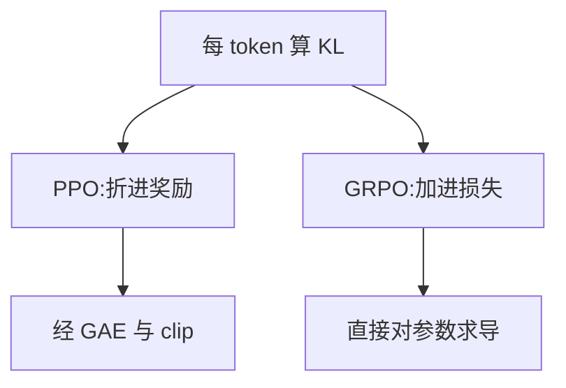
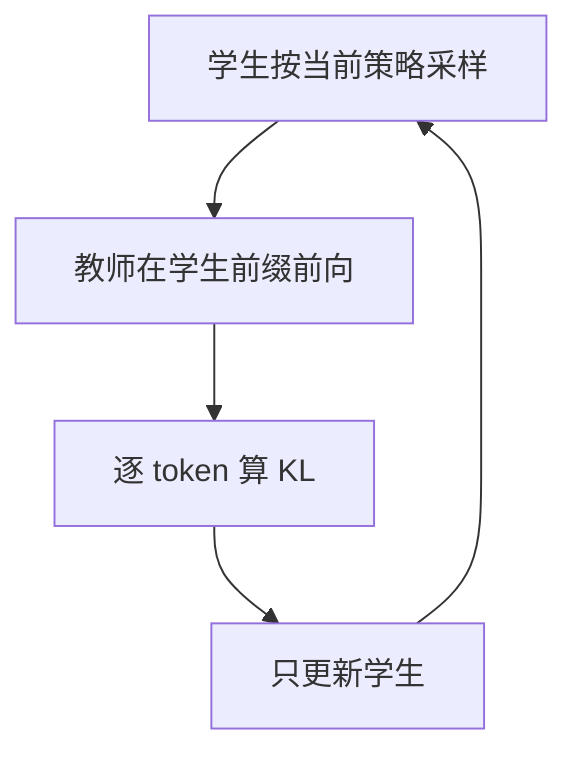

# KL 散度

一句话:KL 散度衡量的是「**把 Q 当 P 用,平均每次要多付多少代价**」——它在后训练里同时干两件事,当**缰绳**拴住策略别跑离 reference 太远,当**尺子**量学生离老师有多远,而这两件事都卡在同一个问题上:方向选哪边、只有采样时怎么估。

## 一、KL 是什么:一把有方向的尺子

先说它要算什么:两个分布 P 和 Q 定义在同一批事件上,我们想知道"世界按 P 出牌、我却按 Q 的信念下注,平均每局吃多少亏"。

$$
D_{KL}(P \,\|\, Q) = \mathbb{E}_{x \sim P}\left[\log \frac{P(x)}{Q(x)}\right]
$$

符号:$x$ 是一个事件(LLM 里就是某个位置采到的 token,或整条回答),$P(x)$、$Q(x)$ 是两个模型给它的概率。期望取自 **P**——"在谁的地盘上算账"是全篇最要紧的一件事,第二节整节都在讲它。信息论的读法:数据真按 P 出,你却照 Q 设计压缩编码,KL 就是平均每个样本多花的信息量(自然对数下单位是 nat,以 2 为底才是 bit)。

三条张口就来的性质:

- **非负**,且当且仅当两分布相同时为 0。因为 $-\log$ 是凸函数,Jensen 不等式直接给出结论。但**这是期望非负,不是逐点非负**——单个样本上的 $\log(P/Q)$ 完全可以是负的,这个伏笔第三节收。
- **不对称**,$D_{KL}(P\|Q) \ne D_{KL}(Q\|P)$,也不满足三角不等式,所以它不是数学意义上的距离。它更像单程机票:同一对城市,来回不一个价。
- **等于交叉熵减去熵**,见下式。

$$
H(P, Q) = H(P) + D_{KL}(P \,\|\, Q)
$$

其中 $H(P,Q) = -\mathbb{E}_{x\sim P}[\log Q(x)]$ 是"按 Q 编码 P 的总代价",$H(P)$ 是 P 自己的熵、也就是最优编码的代价,两者之差才是 KL。**这条恒等式解释了为什么训练代码里几乎只见交叉熵不见 KL**:P 固定时 $H(P)$ 是常数,对参数梯度为零,两者优化等价。

### 什么时候能直接写成交叉熵,什么时候不行

判据只有一条:**被取期望的那个分布(第一个参数)是不是固定的**。

- **分类**:标签分布 P 固定,可换。独热标签 $H(P)=0$,两者数值都等于 $-\log Q(c)$;软标签或标签平滑时 $H(P)>0$,但只是个常数,梯度一样。所以工程上直接算数值稳定的交叉熵即可,不必为了名字叫 KL 再算一遍目标熵。
- **冻结教师的蒸馏**:同理可换。注意「软标签」和「目标可学习」是两件事——教师逐轮更新、但本步把教师输出当常数(stop-gradient)时,这个等价性照样成立。但**师生联合训练、或者目标分布本身依赖被优化参数时就不能换了**,那些熵项和采样梯度都得留着。
- **PPO 单轮更新里的 $D_{KL}(\pi_{old}\|\pi_\theta)$**:可换,旧策略这一轮是冻的。但**当上界约束用**时阈值要平移:KL 预算 $\delta$ 对应的交叉熵预算是 $\delta$ 加上同一批状态上的旧策略熵。
- **RLHF 的 $D_{KL}(\pi_\theta\|\pi_{ref})$:不能换。** 第一个参数就是正在学的策略,展开是 $H(\pi_\theta,\pi_{ref}) - H(\pi_\theta)$。只留交叉熵就丢了 $-H(\pi_\theta)$,后果很具体:目标变成"把概率往 reference 最高的那个 token 上堆,越尖越好"——那是压熵,不是靠拢参考分布。

多标签 BCE、InfoNCE 这类目标的选型不在本篇,InfoNCE 见 Embedding 篇;VAE 里 ELBO 那个"近似后验到先验"的 KL 见 VAE 篇。

### 无穷大、只有样本、以及要不要换别的度量

$P(x)>0$ 而 $Q(x)=0$ 时 KL 真的发散,$P(x)=0$ 的项按极限记为 0。但实践里看到 `inf`,先怀疑浮点下溢:有限 logits 过 softmax 后概率恒为正,用 `log_softmax` 拿 logprob 再相减,就不会先算出一个 0 再取对数。真有硬零(比如 logits 被 mask 成 $-\infty$),那是支持集问题;加平滑会改变被比较的分布,不能平滑完还宣称测的是原来那个 KL。

**只有 P 的样本、算不出 $P(x)$ 时**:优化没问题——最小化 $-\log Q(x)$ 的样本均值就是在最小化前向 KL,因为差的 $H(P)$ 与参数无关。但**报绝对数值不行**,那个交叉熵不是 KL。要数值就得另外估密度或密度比(低维用直方图/核密度,或训一个分辨 P/Q 样本的分类器、用它的 odds 反推密度比),每种都自带估计误差,高维稀疏样本尤其要独立验证。

那为什么后训练几乎不换成 JS 或 Wasserstein?**因为 KL 能沿自回归链按 token 拆开**:序列级 KL 正好等于逐位置条件 KL 的累加,拿现成的 logprob 一路加就行。JS 要用中间分布 $M=(P+Q)/2$,而**序列级的 $M$ 不等于逐 token 中间分布连乘**,这套便利立刻没了。Wasserstein 需要 token 空间上一个有意义的底层距离,而 token 编号之差显然不是语义距离。JS 的好处是对称、有界(自然对数下不超过 $\log 2$)、支持集不重叠也不发散,拿来当**诊断指标**可以;换成训练目标就得重新论证目标是什么。

## 二、方向:mode-covering 与 mode-seeking

全节约定:**P 是目标**(数据 / 老师 / reference),**Q 是被优化的模型**。

- **前向 $D_{KL}(P\|Q)$**,期望取自 P:罚单开在 P 采出的样本上。P 有质量而 Q 趋近于零的地方,$\log(P/Q)$ 爆炸。所以它逼着 **Q 把 P 的每个峰都罩住**,叫 mode-covering(全覆盖)。
- **反向 $D_{KL}(Q\|P)$**,期望取自 Q:罚单开在 Q 自己采出的样本上。Q 押注而 P 认为几乎不可能的地方,罚款爆炸。所以它逼着 **Q 只在自己有把握的地方下注**,叫 mode-seeking(押峰)。Q 放弃 P 的某个峰是不挨罚的——反正它自己不往那儿采样,永远不会因为"漏学"被抓到。

| | 前向 $D_{KL}(P\Vert Q)$ | 反向 $D_{KL}(Q\Vert P)$ |
| --- | --- | --- |
| 期望取自 | P(目标的地盘) | Q(自己的地盘) |
| 重罚 | 漏报:P 有而 Q 没有 | 误报:Q 有而 P 没有 |
| 容忍 | Q 往 P 的谷底也撒质量 | Q 丢掉 P 的部分峰 |
| 受限容量下的倾向 | mode-covering,摊平覆盖 | mode-seeking,收窄押峰 |
| 论文里的别名 | inclusive / zero-avoiding | exclusive / zero-forcing |
| LLM 出场 | SFT、词级离线蒸馏 | RLHF 的 KL 惩罚、MiniLLM |

> 🖼️ 占位:双峰目标分布 P 下的两条最优 Q——前向 KL 解摊成一个盖住两峰的矮胖单峰(峰谷之间也有质量),反向 KL 解收成一个尖峰只押住其中一个峰

**这是"模型装不下 P"时才显现的倾向,不是任意分布的定律。** 如果 Q 的表达能力足够精确表示 P,两个方向的最优解都是 Q=P,反向 KL 并不丢峰。所以别把"反向 KL 必然塌成单峰"当结论背,它是受限容量下的一种典型解。

选方向时问自己要的是哪一句:「**目标会说的话,模型都得会**」→ 前向;「**模型说出的话,目标都得认**」→ 反向。SFT 学数据、离线蒸馏学老师软标签属于前者;RLHF 拴缰绳、MiniLLM 那种生成任务的蒸馏要的是后者——MiniLLM 论文自己给的理由就是用反向 KLD 防止学生"高估教师分布的低概率区域"。

### 反向 KL 的代价:多样性会掉,先用什么确认

反向 KL 鼓励收窄,训久了输出就变单调:同一个 prompt 采十次,答案越来越像。这不是玄学,是目标函数本来就在奖励这件事。要先确认再归因,别一看到质量波动就怪 KL:

- 同 prompt 多次采样的**去重率**、distinct-n 或 self-BLEU;
- 生成时的**平均 token 熵**(是不是整体变尖了);
- **pass@k 相对 pass@1 的走势**——pass@1 涨而 pass@k 掉,基本就是多样性被压掉了,模型只是把原来会的那条路走得更稳。

## 三、只有采样时怎么估:k1 / k2 / k3

先说为什么要"估"。**单个位置的 KL 其实能精确求**:两个模型在同一前缀下都能给出整个词表的分布,对着词表求和即可。不这么做是因为要为此把 reference 的完整 logits 物化下来——按 12.8 万词表、一批 $8\times4096$ 个 token、bf16 算,那是接近 8 GiB 的额外激活,而训练里通常只需要采样到的那个 token 的一个 logprob 差。更根本的是,**整条回答的 KL 是对轨迹分布的期望**,轨迹这一维无论如何都只能采样,词表求和救不了它。

所以通行做法是:每个位置只拿实际采出的那个 token 在两个模型下的 logprob 算一个数。设 $x \sim \pi_\theta$,记

$$
r = \frac{\pi_{ref}(x)}{\pi_\theta(x)}, \qquad D_{KL}(\pi_\theta \,\|\, \pi_{ref}) = \mathbb{E}_{x\sim\pi_\theta}[-\log r]
$$

也就是说,要估的真值是 $-\log r$ 的期望,而我们手里只有一个样本。Schulman 给了三把仪器:

$$
k_1 = -\log r, \qquad k_2 = \tfrac{1}{2}(\log r)^2, \qquad k_3 = r - 1 - \log r
$$

三个都只吃 $r$ 这一个输入——也就是同一个 token 上两份 logprob 的差,量的是同一段路(策略离 reference 多远),区别只在读数的抖法:

- **k1 是定义的直接单点版**,期望就是 KL,所以无偏。问题是**约一半样本上它是负的**(该 token 的策略概率低于参考概率时),而真值恒非负,于是读数抖得厉害。
- **k2 恒非负、看着更像"距离"**,但期望不是 KL,是另一个量;两个分布接近时它和 KL 的二阶近似相同,所以偏差很小,分布拉开就不小了。
- **k3 = k1 + (r−1),加了一个控制变量。** 因为样本来自 $\pi_\theta$ 时 $\mathbb{E}[r] = \sum_x \pi_\theta \cdot \frac{\pi_{ref}}{\pi_\theta} = 1$,所以 $r-1$ 是零均值量,加上去**不改期望**;而 $r$ 偏大时 $-\log r$ 偏负、$r-1$ 偏正,两股抖动反向相消,方差就下来了。非负性直接来自切线不等式 $\log x \le x - 1$。泰勒展开看得更清:$r\approx1$ 时 $k_3 \approx \frac12(r-1)^2 \approx k_2$——长得像 k2,期望却像 k1 一样准。

Schulman 博客里的实测($q=N(0,1)$ 采样,$p$ 取不同均值),标准差按真值归一:

| 真值 KL | 口径 | k1 | k2 | k3 |
| --- | --- | --- | --- | --- |
| 0.005 | 相对偏差 | 0 | 0.002 | 0 |
| 0.005 | 相对标准差 | 20 | 1.42 | 1.42 |
| 0.5 | 相对偏差 | 0 | 0.25 | 0 |
| 0.5 | 相对标准差 | 2 | 1.73 | 1.7 |

两个读点:真值很小时 k1 的标准差是真值的 **20 倍**,基本没法看;而 k2 的偏差从 0.2% 涨到 **25%**,印证了"只在近邻才准"。k3 两栏都占优,GRPO 用的就是它。

```python
# r = pi_ref / pi_theta,只用采样到的那个 token 的 logprob
log_r = ref_logp - policy_logp        # log r
k1 = -log_r                            # 无偏,单点可负
k2 = 0.5 * log_r.pow(2)                # 恒非负,近邻才准
k3 = log_r.exp() - 1 - log_r           # 无偏且恒非负
```

一个容易被追到的细节:**k3 的"恒非负"和"无偏"来源不同**。非负是逐点的不等式,任何 $r>0$ 都成立,跟样本从哪来无关;无偏靠的是 $\mathbb{E}[r]=1$,只有样本真来自 $\pi_\theta$ 才成立。

### 采样分布对不上时会塌掉的是哪一半

PPO/GRPO 的 mini-epoch 里,样本是 $\pi_{old}$ 采的,而 $\pi_\theta$ 已经更新过了。此时 $\mathbb{E}_{\pi_{old}}[r]\ne1$,**无偏性没了**(非负还在)。要么补重要性权重 $\pi_\theta/\pi_{old}$,要么就承认这是个有偏近似、只当监控用。同理,rollout 开了 top-k/top-p 或温度,实际采样分布已不是 $\pi_\theta$,拿它算的数不是那个 KL。

### 数值无偏 ≠ 梯度无偏:这是最深的一层

把 k3 写进 loss 让 autograd 去降它,降的真是这个 KL 吗?**不是。** 对采样到的 token 直接求导(把 $x$ 当常数)时:

$$
\nabla k_1 = \nabla\log\pi_\theta,\quad
\nabla k_2 = \log\tfrac{\pi_\theta}{\pi_{ref}}\nabla\log\pi_\theta,\quad
\nabla k_3 = (1-r)\,\nabla\log\pi_\theta
$$

三个梯度都长成"某个系数乘 $\nabla\log\pi_\theta$",差别全在系数上,取期望后结论截然不同:

- $\mathbb{E}[\nabla k_1] = 0$。因为 $\mathbb{E}_{\pi_\theta}[\nabla\log\pi_\theta]=0$ 是恒等式。**k1 当损失是纯噪声**,平均下来一点约束都不产生;Tang 与 Munos 的表格实验里,这样训 KL 反而随步数上涨,因为参数在做零均值随机游走。
- $\mathbb{E}[\nabla k_2] = \nabla D_{KL}(\pi_\theta\|\pi_{ref})$,**正是想要的那个梯度**。有偏的估计器,梯度反倒是对的。
- $\mathbb{E}[\nabla k_3] = \nabla D_{KL}(\pi_{ref}\|\pi_\theta)$,**方向反过来的那个 KL**。单独优化时它和目标 KL 的最小点相同(都是 $\pi_\theta=\pi_{ref}$),所以"能把策略拉回去"这件事没错;但**一旦和奖励最大化合在一起,收敛到的策略就不是原目标的最优策略了**——它的正则强度还完全来自那个本被当作"可选方差削减"的控制变量项。

要拿到无偏梯度,就用 k2,或等价地反传 $\mathrm{sg}\!\left[\log\frac{\pi_\theta}{\pi_{ref}}\right]\cdot\log\pi_\theta$ 这个代理损失($\mathrm{sg}$ 是 stop-gradient)。另外自回归还有第二层坑:前面的 token 会影响后面所有位置的分布,逐位置各自求导只拿到部分梯度。

## 四、两个用场:拴住 reference,和 OPD 蒸馏

### Reference Model 与 rollout 旧策略不是一个角色

对齐训练里有两个"旧模型",混起来就把"单步别迈太大"和"别忘了本来会什么"写成同一件事了:

| | 什么时候冻的 | 管什么 |
| --- | --- | --- |
| Reference Model | 冻在 SFT 或阶段起点 | 多批更新后的**累计行为漂移** |
| rollout 旧策略 | 每批采样后冻,下批就换 | 本批的概率比与 clip |

要 reference 的理由是:奖励模型有漏洞,策略不受约束就会跑到参考模型几乎不会生成的区域去薅奖励,表现为语言退化、模式收缩、能力遗忘。**但 KL 只比较分布,不判断内容对不对**——它压低跑偏的概率,不认识 reward hacking 本身(奖励侧的事见 RLHF与RM 篇)。

reference 是否更新?**看配方。** 一次性对齐通常全程冻死;而 GRPO 原论文的迭代版本在每个外层 iteration 开始时把 reference 换成当前策略,让锚点跟着往前挪。工程上 reference 不参与梯度,`no_grad` 省的是激活不是权重,那份权重照样占显存;常见做法是低精度/量化、卸载、或 LoRA 训练时直接共享冻结基座只切适配器。DPO 那种固定离线数据可以把 reference logprob 预计算好,PPO/GRPO 每批都产生新 rollout,预计算无从谈起。

不用 reference 时,更小的学习率、更少的同批更新轮数、旧策略信赖域、目标 KL 早停、SFT 混合目标都能限制一部分风险,但它们约束的对象不同(单步大小 vs 累计漂移),不能宣称等价。那**为什么不干脆量参数距离**?因为参数空间和行为空间不是一回事:网络存在重标度、神经元置换这类等价参数化,同样大小的参数改动可以对应天差地别的输出变化,反过来参数动了一大截也可能几乎不改行为。KL 是在同一个输入下直接比动作概率,量的就是行为本身。

### 折进奖励,还是加进损失



- **PPO-RLHF 折进 per-token reward**:$r_t = r_\varphi(q, o_{\le t}) - \beta\log\frac{\pi_\theta(o_t)}{\pi_{ref}(o_t)}$,减的那一项就是 k1,单点可正可负,不能拿单个 token 判断整体 KL。它在 rollout 时用采样那一刻的策略算出来、之后当常数用,再进优势估计、经 clip 目标间接影响梯度——**和"对当前 KL 求导"根本不是一回事**(完整目标与 GAE 见 PPO 篇)。
- **GRPO 加进损失**:目标里直接减 $\beta D_{KL}$,用 k3 估。论文写明这是为了"避免把优势的计算搞复杂"——不经过组内归一化、不经过 clip,是一支独立的回锚力(细节见 GRPO 篇)。一句话对照:折奖励是"改评分让 RL 自己学",会改变优势的相对排序;独立项是"直接推参数",而且躲不开第三节那个梯度问题。
- **DPO 里的 reference 又是第三种角色**:损失里没有单独的 KL 项,reference 出现在 log-ratio 中,是从"带 KL 约束的奖励最大化"的闭式最优解反解出来的,$\beta$ 的含义也从惩罚强度变成偏好对数几率的缩放(推导见 DPO 篇)。

$\beta$ 怎么调:太小,策略快速漂走并利用奖励漏洞;太大,策略钉在 reference 上,任务奖励学不动。可行做法是设一个目标 KL,实测高于目标就调大 $\beta$、低于就调小,同时盯真实任务指标、人评和熵——这仍是软控制,给不出严格上界。**没有跨实现通用的 KL 阈值**,因为同一次训练换个口径数字就差一个数量级:方向、逐 token 还是整序列、有没有除以长度、评估 prompt 从哪来,任一项不同都不可比。所以先在自己的口径下跑一条基线曲线,再谈目标值。

曲线怎么读:缓慢爬升是正常远离,好不好看奖励和生成样本;突然抬升先查学习率、采样分布变化和估计器异常,再怀疑奖励投机;长期贴零先查 $\beta$ 和实现,也可能是任务本来就不需要偏离多少。

### On-Policy Distillation:方向和"谁采样"是两个维度



图里最后那条回边——学生一更新就重新采样——才是 "on-policy" 的全部含义。**只采一次然后反复训几个 epoch,轨迹很快就不再是当前学生会走的路,方法就退化成离线蒸馏了**;症状是训练 KL 在 epoch 内继续降,但重新采样后的 KL 不降,生成长度和重复率开始漂,held-out 生成质量与训练损失脱钩。

动机是 **exposure bias**(曝光偏差:训练时喂的都是标准答案的前缀,推理时喂的却是自己写出来的前缀,两者不是一回事)。离线蒸馏在教师的轨迹上教,学生推理时一旦走偏,后续那些状态训练里从没出现过,没人教它怎么把话圆回来。OPD 让教师在**学生真正走到的前缀**上给密集反馈,专治学生自己会犯的错。

这里有个最容易答错的区分:**采样分布和散度方向是两个正交维度**。前缀由学生生成,不代表目标就一定是反向 KL;拿到学生前缀后,两个模型在该位置的完整词表分布都在手里,前向、反向甚至两者的混合(如广义 JSD)都能直接算——GKD 正是把散度当成一个可选项的。

也正因为要在任意前缀上拿到教师的完整分布,**OPD 死死依赖 teacher logits**:监督信号就是那份归一化的全词表分布。这也决定了成本结构——每轮都要教师在新轨迹上前向一遍。好消息是这次前向是纯 prefill(序列已经生成完),没有 decode 的逐 token 依赖,可以大 batch 打满算力;还能只在学生熵高或师生分歧大的位置打分来省算力。

学生和教师差距很大时,**先 SFT 再 OPD**。因为差距大时学生采出的前缀落在教师分布的极低概率区,教师在那种上下文上本来就没被训练过,给出的分布不可靠,密集信号变成密集噪声。同理,数据再多也不能从随机初始化直接 OPD:随机学生的前缀远离有效语言分布,而教师要同时教词法、知识、指令和任务,支持集差距太大且生成成本极高。

### 三方对比,和教师给不了 logits 时的退路

差别落在两个正交维度上——轨迹谁生成、监督是软分布还是硬 token:

| 方案 | 轨迹来自 | 监督粒度 | 对教师的要求 |
| --- | --- | --- | --- |
| 离线知识蒸馏 | 教师或固定数据集 | 逐 token 全词表分布 | 能拿到完整分布 |
| 教师数据做 SFT | 教师 | 硬 token(one-hot) | 只要文本 |
| OPD | 学生自己 | 逐 token 全词表分布 | 完整分布 + 能在任意前缀前向 |

教师数据 SFT 最省事,但每个位置只留一个答案,"第二、第三选择分别有多可能"全丢了——**软目标的收益在"有多个都对的说法"的任务上最明显**(翻译、摘要、开放式生成),答案唯一的任务收益小。离线蒸馏补回了软分布,但还在教师轨迹上训,exposure bias 依旧。蒸馏方法的分类学见 蒸馏 篇。

教师是只返回文本、至多几个 top-k logprob 的商业 API 时,**做不了标准 OPD**,只能沿这个阶梯往下退:

| 教师能给 | 可行做法 | 丢了什么 |
| --- | --- | --- |
| top-k logprob | 在 top-k 上算截断 KL,余下质量归"其他"桶 | 长尾;k 越小、分布越平偏差越大 |
| 仅文本 | 学生采样,教师在其前缀上改写/纠错,再 SFT | 逐 token 密集信号,退化成序列级 |
| 仅偏好或打分 | 组偏好对做 DPO,或当 RLAIF 的奖励 | 监督退化成序列级标量 |
| 有标准答案 | 转可验证奖励,不再依赖教师分布 | 只适用可自动判对错的任务 |

这些方案保住了 OPD 最本质的那一半(样本来自学生自己),所以仍能缓解 exposure bias;丢掉的是另一半,**目标函数已经不是 KL 最小化,答题时别继续叫它标准 OPD**。截断 KL 的偏差有多大是可以实测的:学生侧拿得到完整分布,先量一量自己分布的 top-k 覆盖了多少质量,就知道这层近似有多糙。

还有两个前提不确认,上面全不成立:一是**tokenizer 必须一致**,分词边界对不上时一个教师 token 可能横跨学生的两三个 token,任何拆分方案都是在猜条件概率怎么分配,有损;二是**要问清返回的 logprob 是哪个分布的**,如果 API 在温度和 top-p 截断之后才给,那已经不是教师原始分布,拿它当目标会把对方的解码超参一起学进来。

## 五、面试考点串联

| 高频问法 | 本文哪一节 |
| --- | --- |
| 交叉熵和 KL 什么关系?分类里能直接互换吗?PPO 里呢? | 一(判据:第一个参数是否固定) |
| RLHF 为什么不能把 $D_{KL}(\pi_\theta\Vert\pi_{ref})$ 换成交叉熵? | 一(丢掉 $-H(\pi_\theta)$ 就变成压熵) |
| KL 遇到无穷大怎么办?和 JS、Wasserstein 怎么取舍? | 一(下溢 vs 支持集;能否按 token 分解) |
| 只有真实分布的样本时,还能优化前向 KL 吗?能报绝对值吗? | 一(能优化,不能当数值) |
| 前向和反向 KL 各重罚什么?蒸馏时怎么选方向? | 二(表格 + 两句判据) |
| 反向 KL 为什么可能压低多样性?你怎么先确认? | 二(去重率/熵/pass@k 对 pass@1) |
| 为什么用 $r-\log r-1$ 而不是 $-\log r$ 估 KL? | 三(控制变量 + 实测方差) |
| 训练时明明有完整 logits,为什么不直接对词表精确求 KL? | 三(显存量级,且轨迹维度救不了) |
| 样本来自 $\pi_{old}$ 而不是 $\pi_\theta$ 时,估计要怎么修正? | 三(重要性权重;非负还在,无偏没了) |
| k3 的梯度期望和 $\nabla D_{KL}$ 差在哪?哪个估计器梯度才无偏? | 三(k1 为零、k3 反方向、k2 才对) |
| 为什么需要固定的 Reference Model?它和 rollout 旧策略差在哪? | 四(累计漂移 vs 单批步长) |
| PPO 和 GRPO 把 KL 放在哪里?这个差异带来什么影响? | 四(折奖励 vs 独立损失项) |
| PPO 的 reference KL 和 DPO 的 reference log-ratio 有什么区别? | 四(显式惩罚项 vs 闭式解反解) |
| $\beta$ 太大太小各会怎样?怎么按目标 KL 调? | 四(软控制,先定口径再定目标) |
| 实际训练 KL 该控制在什么范围?为什么不能照搬别人的阈值? | 四(方向/聚合/长度归一化口径不同) |
| Reference Model 会更新吗?怎么降它的显存开销? | 四(迭代版会挪锚点;共享基座/量化/卸载) |
| 不用 Reference Model 会怎样?还有哪些办法限制策略?为什么不能量参数距离? | 四(约束对象不同;参数空间有重标度与置换) |
| OPD 的训练流程是什么?和离线蒸馏、教师数据 SFT 差在哪? | 四(重新采样;轨迹 × 监督粒度两维) |
| on-policy 只是说学生采样吗?它和用哪个方向的 KL 有关系吗? | 四(两个正交维度) |
| 教师是只给文本的 API,还能做 OPD 吗?有哪些退路? | 四(阶梯表 + tokenizer/logprob 两个前提) |
| 数据足够多能不能跳过预训练直接 OPD? | 四(支持集差距 + 教师在低概率区不可靠) |
| 补充题:k3 的"恒非负"和"无偏",哪条依赖样本来自当前策略? | 三(逐点不等式 vs $\mathbb{E}[r]=1$) |
| 补充题:两个人报同一次训练的 KL 差一个数量级,都没算错,差在哪? | 四(口径) |

## 相关文献

- Approximating KL Divergence(k1/k2/k3 与实测偏差方差)— John Schulman 博客,2020 — http://joschu.net/blog/kl-approx.html
- On a few pitfalls in KL divergence gradient estimation for RL — [arXiv:2506.09477](https://arxiv.org/abs/2506.09477)
- Proximal Policy Optimization Algorithms — [arXiv:1707.06347](https://arxiv.org/abs/1707.06347)
- Training language models to follow instructions with human feedback(per-token KL 折进 reward)— [arXiv:2203.02155](https://arxiv.org/abs/2203.02155)
- DeepSeekMath(GRPO 把 k3 作为独立损失项)— [arXiv:2402.03300](https://arxiv.org/abs/2402.03300)
- Direct Preference Optimization: Your Language Model is Secretly a Reward Model — [arXiv:2305.18290](https://arxiv.org/abs/2305.18290)
- MiniLLM: On-Policy Distillation of Large Language Models(反向 KL 蒸馏)— [arXiv:2306.08543](https://arxiv.org/abs/2306.08543)
- On-Policy Distillation of Language Models: Learning from Self-Generated Mistakes(GKD)— [arXiv:2306.13649](https://arxiv.org/abs/2306.13649)
- Distilling the Knowledge in a Neural Network(固定教师软目标)— [arXiv:1503.02531](https://arxiv.org/abs/1503.02531)
- Sequence-Level Knowledge Distillation(序列级退路的出处)— [arXiv:1606.07947](https://arxiv.org/abs/1606.07947)
