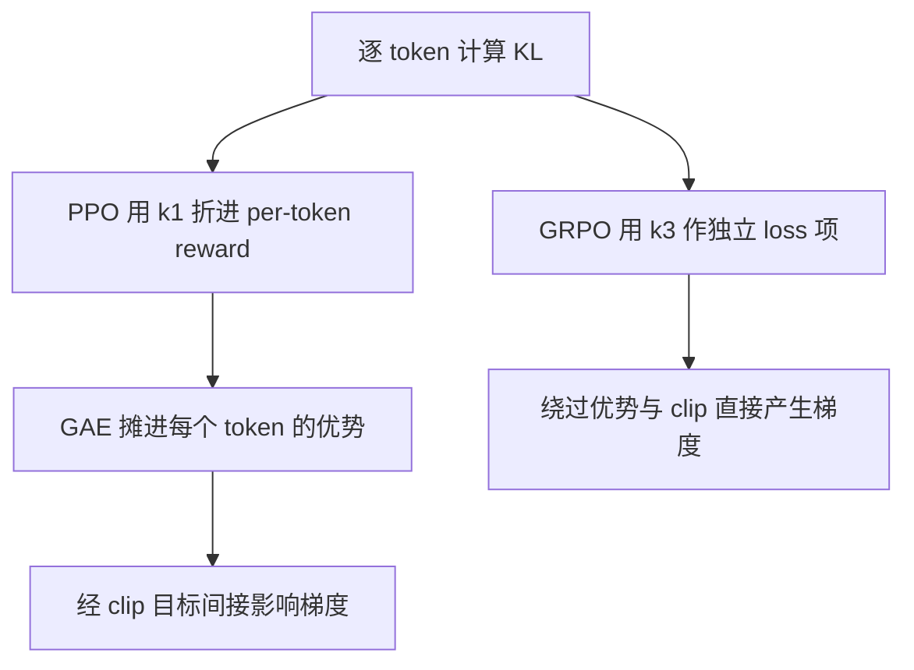

# KL 散度(前向/反向与 k1/k2/k3 估计器)

> ⚠️ 旧版:本篇写于写作契约确立之前,尚未按新标准审查重写。标准见 docs/05-知识库写作契约.md,样板见「GPU架构与执行模型」。

一句话:KL 散度(Kullback–Leibler divergence)度量「**用 Q 来近似 P,平均要多付多少信息代价**」。LLM 训练里它一人分饰两角:**蒸馏的尺子**(量学生分布离老师多远)与 **RL 的缰绳**(拴住策略别离 reference 太远)——前者的关键是「方向选哪边」(前向/反向),后者的关键是「怎么估、放哪里」(k1/k2/k3、折 reward 还是独立 loss)。

## 一、定义与三条性质

$$
D_{KL}(P \,\|\, Q) = \mathbb{E}_{x \sim P}\left[\log \frac{P(x)}{Q(x)}\right] = \sum_x P(x) \log \frac{P(x)}{Q(x)}
$$

信息论解读:数据真按 P 出,你却按 Q 设计压缩编码,KL 是平均每个样本多付的编码代价。以 2 为底时单位是 bit,自然对数时是 nat。通俗版:你按 Q 的世界观下注、世界按 P 出牌,平均每局多付的「惊讶费」——两个分布完全一致时惊讶费为零。

三条必背性质:

- **非负**:由 Jensen 不等式($-\log$ 是凸函数)可证 $D_{KL} \ge 0$,当且仅当 P、Q 相等时取 0（连续分布按几乎处处相等理解）。注意这是**期望**非负——单点的 $\log(P/Q)$ 完全可以是负的,这个伏笔到 k1 估计器处收回;
- **不对称**:$D_{KL}(P \,\|\, Q) \ne D_{KL}(Q \,\|\, P)$,也不满足三角不等式,所以它不是数学意义上的「距离」,更像单程报价:同一对分布,换个方向价钱不同。不对称的根源是**在谁的地盘上算账**——期望对谁取,谁的高概率区就说了算,这直接引出下一节的前向/反向之分;
- **与交叉熵的关系**:

$$
H(P, Q) = H(P) + D_{KL}(P \,\|\, Q)
$$

  P 是固定的数据分布时 $H(P)$ 是常数,所以**最小化交叉熵 ≡ 最小化前向 KL**——预训练和 SFT 每天做的事,本质就是把模型分布按前向 KL 的方式拉向数据分布。

### 支持集与稳定计算

连续分布把定义中的求和改成 $\int p(x)\log[p(x)/q(x)]\,dx$。这里比较同一空间上的概率密度，KL 仍非负；离散熵的非负结论则不能直接搬到微分熵上。

若 $p(x)>0$ 而 $q(x)=0$，KL 为无穷大；$p(x)=0$ 的项按极限记为 0。实际出现 `inf` 要先区分数学发散与浮点下溢：有限 logits 的 softmax 本有正概率，直接用 `log_softmax` 或 logprob 差能避免先求极小概率再取对数。模型真的排除某些事件时，则应重新检查支持集；加平滑并归一化会改变分布，需要说明，不能只裁成有限数后仍宣称测得原 KL。

### KL、JS 与 Wasserstein 的取舍

令 $M=(P+Q)/2$，Jensen–Shannon 散度为

$$
\mathrm{JS}(P,Q)=\frac12D_{KL}(P\|M)+\frac12D_{KL}(Q\|M)
$$

它分别比较两者与中间分布，因此对称，且在自然对数下位于 $[0,\log2]$；支持集不重叠也不会发散。注意 JS 本身不是这里所说的距离，$\sqrt{\mathrm{JS}}$ 才满足距离公理。

KL 适合似然优化和非对称的参考约束；JS 适合需要对称、有界比较的场景，但支持不相交时达到上界，不会继续反映两个支持集相隔多远。Wasserstein 则计算搬运概率质量的最小成本，利用样本位置的几何距离；需有合适的底层度量和矩条件，通常还要解运输问题或采用近似。对文本不能把 token 编号之差当作语义距离，换度量也不保证任务收益。

### 分类损失:独热和软标签都能等价

交叉熵 $H(P,Q)$ 是按 Q 编码 P 的**总成本**,KL 则扣除了 P 本来的熵,只保留多出的成本。P 固定时,二者对被优化的 Q 给出相同梯度,不要求 P 必须独热。

- 独热标签:P 把全部质量放在正确类别 $c$,熵为零,交叉熵和 KL 都是 $-\log Q(c)$。
- 软标签或标签平滑:P 的熵通常大于零,但只要目标固定,二者仍只差常数。工程上可直接计算稳定的交叉熵,不需要为了形式叫 KL 就重新计算目标熵。
- 若 P 本身依赖待训练参数,不能再把 $H(P)$ 当常数;策略场景见「策略更新:谁固定决定能不能换成交叉熵」。

### 蒸馏:软目标与可学习目标的区别

冻结教师产生的软标签仍是固定目标。给定输入及相同温度,只训练学生 Q 时,教师到学生的 $D_{KL}(P\|Q)$ 与软标签交叉熵给出相同梯度。**标签是否独热,与目标是否参与求导是两回事。** 教师每轮更新、但本步将教师输出视为常数时,对学生的这一等价性仍成立;目标熵的数值随轮次变化,不等于它对本步学生参数有梯度。

如果教师与学生联合学习,或目标分布、输入采样分布本身依赖被优化参数,就需保留相应的熵和采样梯度。学生到教师的反向 KL 又包含学生熵,不能直接改成以学生为权重的交叉熵。分类常用交叉熵是因为它直接表达标签的负对数似然且有稳定实现,并非 KL 在数学上必然更慢或更不稳定。分类梯度的具体推导属于分类损失主题;本文承接分布方向和等价条件。

### 策略更新:谁固定决定能不能换成交叉熵

PPO 的一轮更新把旧策略固定,在固定的旧状态样本上优化新策略。因此 $D_{KL}(\pi_{old}\|\pi_\theta)$ 与 $H(\pi_{old},\pi_\theta)$ 在这一轮只差旧策略熵。**作为惩罚项,梯度相同;作为上界约束,必须平移阈值**:若平均 KL 预算为 $\delta$,对应交叉熵预算是 $\delta$ 加上同一状态分布下的平均旧策略熵。旧策略在下一轮才改变,不能用“它会改变”否定本轮的等价性。

RLHF 中另一个常见方向是当前策略对固定参考模型:

$$
D_{KL}(\pi_\theta\|\pi_{ref})=H(\pi_\theta,\pi_{ref})-H(\pi_\theta)
$$

这里被取期望的当前策略也在学习。只保留交叉熵,就漏了鼓励保留熵的项;例如参考分布不均匀时,它会倾向把质量集中到参考概率最高的动作,即使这已偏离参考分布。**比较损失时先写清 KL 的方向,再检查两个分布和采样分布谁固定。**

## 二、前向与反向:同一把尺子的两种拿法

约定:P 是目标分布(数据/老师/reference),Q 是被优化的模型。两个方向的差别全在「在谁的样本上开罚单」:

- **前向 $D_{KL}(P \,\|\, Q)$**(期望取自 P):罚单开在 P 采出的样本上——若某处 $P(x) > 0$ 而 $Q(x) \to 0$,罚款 $\log(P/Q) \to \infty$。翻译:「**P 有质量的地方,Q 都得罩住**」,即 mode-covering(全覆盖)。代价:当 Q 容量不够罩住 P 的所有峰时,某些受限模型族的最优解会把概率铺到峰间,连 P 几乎为零的谷底也分到质量;
- **反向 $D_{KL}(Q \,\|\, P)$**(期望取自 Q):罚单开在 Q 自己采出的样本上——若 Q 押注之处 $P(x) \approx 0$,罚款爆炸。翻译:「**Q 押注的地方,P 必须靠谱**」,即 mode-seeking(押峰)。Q 完全可以放弃 P 的某些峰——反正自己不往那儿采样,就永远不会因「漏学」挨罚——在受限模型族下可能集中到其中一个峰。

**这是受模型族与优化过程影响的倾向，不是任意分布的定律。** 若 Q 能精确表示 P，两种 KL 都在 Q=P 时最小，反向 KL 不必丢峰。蒸馏时先看教师误差、学生容量以及所需的覆盖率与多样性，再比较方向、温度或混合目标。

术语对照(读论文用):前向又叫 inclusive / zero-avoiding(P 非零处 Q 不许为零);反向又叫 exclusive / zero-forcing(P 为零处 Q 被迫为零)。

> 🖼️ 占位:双峰分布 P 下的对比图——前向 KL 的 Q 摊成一个矮胖单峰盖住两峰(峰谷之间也有质量,四不像);反向 KL 的 Q 收窄成尖峰押住其中一个峰

| | 前向 $D_{KL}(P \Vert Q)$ | 反向 $D_{KL}(Q \Vert P)$ |
| --- | --- | --- |
| 期望取自 | P(目标的地盘) | Q(自己的地盘) |
| 受限模型族中的常见倾向 | mode-covering,更在意漏掉目标质量 | mode-seeking,更在意落入目标低概率区 |
| 重罚 | 漏报:P 有而 Q 无 | 误报:Q 有而 P 无 |
| 容忍 | Q 在 P 的谷底放质量 | Q 丢掉 P 的部分峰 |
| LLM 出场 | CE/SFT、标准词级蒸馏 | RLHF 的 KL 惩罚、MiniLLM 蒸馏 |

### 蒸馏:为什么 MiniLLM 换成反向

标准知识蒸馏用词级 CE 对齐老师的软标签,就是前向 KL。学生容量远小于老师时,前向更在意覆盖老师的概率质量，在某些任务上可能把有限容量用在较多模式上，并给老师低概率区分配过多质量。MiniLLM 的论点:生成任务要的是「学生说出的话老师认可」,而不是「老师会说的话学生全会」,于是改用反向 KL——学生在**自己生成的样本**上被老师打分(mode-seeking:集中学老师的主峰),并把优化写成 on-policy 的 policy gradient,相当于把蒸馏做成了一场以老师似然为 reward 的小型 RL。

### RLHF 的 KL 惩罚是哪个方向?

RLHF 的 KL 项在**当前策略**的采样上计算:

$$
\mathbb{E}_{x \sim \pi_\theta}\left[\log \frac{\pi_\theta(x)}{\pi_{ref}(x)}\right] = D_{KL}(\pi_\theta \,\|\, \pi_{ref})
$$

期望取自当前策略，因此在把 reference 叫目标 P 的约定下属于反向 KL。它重罚策略在参考模型低概率处放质量，但收窄分布也可能产生明显代价，不能说放弃模式几乎免费。KL 只比较分布，不会识别文本是否正确或是否利用了奖励漏洞；用它控制漂移仍须看实际任务表现。

为什么不直接限制参数距离？神经网络有参数重标度、置换等不同表示，同样大小的参数变化也可能导致不同程度的输出变化。KL 从同一输入下的动作概率出发，更贴近策略行为；小步时还能与 Fisher 局部度量建立联系。它不因此成为唯一合理的约束。

## 三、蒙特卡洛估计:测同一段路的三种仪器

先说为什么需要「估计」:单个 token 位置的 KL 理论上可对整个词表精确求和,但要同时物化两个模型的完整分布(词表十万级);而整条回答的 KL 是对轨迹分布的期望，实际语言模型通常只能用采样近似。通行做法:每个位置只用实际采出的那个 token 在两个模型下的 logprob 算一个数,当作该位置 KL 的单点估计——PPO/GRPO 的 per-token KL 就是这么来的,这套单点估计器体系出自 Schulman 的博客。

设定:$x \sim \pi_\theta$,记 $r = \pi_{ref}(x) / \pi_\theta(x)$,要估的真值是 $D_{KL}(\pi_\theta \,\|\, \pi_{ref}) = \mathbb{E}[-\log r]$:

$$
k_1 = -\log r, \qquad k_2 = \frac{1}{2}(\log r)^2, \qquad k_3 = r - 1 - \log r
$$

同一段路(策略离 ref 多远),三种仪器:

- **k1:直接估计，但可能有较大方差**。定义的直接单点版,期望等于 KL;单次读数可能为负，因为该 token 的策略概率可能低于参考概率。有限样本均值仍有采样误差;
- **k2:局部近似，存在系统偏差**。平方保证非负，但不保证方差总小；它是 KL 的局部二阶近似，并非无偏估计。函数 $f(r)=\frac12(\log r)^2$ 并不全局凸，不能不加条件称作标准 f-散度；远离近邻区域时应重新检查近似误差;
- **k3:加控制变量，近邻分布常有较低方差**。构造是 control variate(控制变量):$k_3 = k_1 + (r - 1)$,在共同支持集且采样来自 $\pi_\theta$ 时，$\mathbb{E}_{\pi_\theta}[r - 1] = \sum_x \pi_{ref}(x) - 1 = 0$——加一个期望为零的项,均值不动,**仍然无偏**;$r$ 偏大时 $-\log r$ 偏负、$r - 1$ 偏正,两股抖动反向相消,在分布接近时往往降低方差;再由切线不等式 $\log x \le x - 1$ 得 $r - 1 - \log r \ge 0$,**非负**。泰勒展开看得更清:$r \approx 1$ 时 $k_3 \approx \frac{1}{2}(r-1)^2 \approx k_2$——长得像 k2,期望却像 k1 一样准。GRPO 采用的正是它。

| 估计器 | 公式 | 无偏（按上述采样条件） | 非负 | 方差 |
| --- | --- | --- | --- | --- |
| k1 | $-\log r$ | ✅ | ❌ 单点可负 | 依分布而定 |
| k2 | $\frac{1}{2}(\log r)^2$ | ❌ 局部近似 | ✅ | 依分布而定 |
| k3 | $r - 1 - \log r$ | ✅ | ✅ | 近邻分布常较小，非普遍保证 |

如何使用：k1 的样本平均可作直接监控；k3 是 GRPO 原论文采用的非负形式，分布接近时常有较好的方差表现。若概率比呈重尾，k3 的 $r$ 项反而可能产生极大数值，不能按名字认定它永远更稳。

**数值无偏不等于梯度无偏。** 上述期望假设样本来自被比较的当前策略；复用旧策略样本，或 top-k/top-p 截断改变实际采样分布时，都要检查采样分布与概率比是否匹配。对已采样的离散 token 直接求导，并不会自动补上采样分布随参数变化的梯度。具体更新目标及估计修正应按 PPO、GRPO 篇的算法设定判断。

### 只有样本时怎样估计

能采到 $x\sim P$ 且能算 $p(x),q(x)$ 时，直接平均 $\log p(x)-\log q(x)$。若只有 P 的样本、没有其密度，仍可平均 $-\log q(x)$ 来**优化固定 P 下的前向 KL**，因为未知的 $H(P)$ 对模型参数是常数；但这个交叉熵数值不能冒充 KL 绝对值。

要报告数值可估计密度或密度比：低维离散场景用带样本量检查的频率估计，连续场景可选参数模型、核密度等；也可训练区分 P/Q 样本的校准分类器，由预测 odds 与训练采样先验比推回密度比。方法都引入估计误差，高维稀疏样本尤其要做独立验证，不能把一次有限样本估计当成真实散度。

## 四、工程放法:同一根缰绳的两种系法

PPO 篇与 GRPO 篇各提过一句的「经典差异」,在这里补全:

- **PPO:折进 per-token reward**。生成 rollout 时，每个 token 的 reward 扣掉 $\beta \log(\pi_b/\pi_{ref})$，其中 $\pi_b$ 是本批采样策略；更新中通常固定这些 reward。这里使用 **k1**，单项可负，不能按单个 token 判断整体 KL。它经 GAE 进入优势、再经 clip 目标间接影响更新(详见 PPO 篇);
- **GRPO:独立 loss 项**。$-\beta \, D_{KL}$ 直接加在目标函数上,用 **k3** 估计。梯度直接对 KL 做下降,不经过优势归一化——不经过组内标准化、不经过 clip,是一支独立的「回锚力」(详见 GRPO 篇);
- 梯度含义一句话:折 reward 是「改评分,让 RL 自己学」,KL 会改变优势的相对排序;独立项是「直接推参数」,仍与奖励梯度共同更新同一组参数。

**β 怎么调**:惩罚过弱可能允许过度漂移，过强可能妨碍任务优化。可比较固定 β，或设定目标 KL，以实测偏差调整 β；这仍是软控制，不能保证严格上界。是否移除 KL 属于具体训练配方的取舍，不能据此保证训练更快或效果更好，见 GRPO 篇。

**KL 曲线怎么读**:先固定参考策略、评估输入和逐 token/序列的统计口径，再判断分布变化:

- 缓慢爬升说明离参考分布逐步变远，是否有益仍看奖励、任务指标与生成样本;
- 突然抬升时检查学习率、采样分布、数据变化和估计器异常，再排查奖励投机，不能只凭曲线确诊;
- 长期接近零时检查 β、学习率、梯度与实现，也可能是任务无需明显偏离参考分布;
- PPO 的 mini-epoch 内还会用 approx-KL 超阈值提前停掉本批更新(PPO 篇的「超速断油」)。

平台 P002-Q026 关于 KL 阈值、TRPO/PPO 约束区别及其他更新控制手段的三项追问,见 PPO 篇。

## 五、其他出场:一条 KL 串起半个后训练

- **DPO**:带 KL 约束的 reward 最大化存在闭式解

$$
\pi^*(y \mid x) = \frac{1}{Z(x)}\, \pi_{ref}(y \mid x)\, e^{r(x, y)/\beta}
$$

  DPO 把它反解出 $r$、代进 Bradley–Terry 偏好模型,整个 RLHF 塌缩成一个二分类损失(详见 DPO 篇)——KL 在这里不是惩罚项,而是推导的起点;
- **SFT = 前向 KL**:第一节的直接推论——CE 训练就是对数据分布做 mode-covering,这也解释了纯 SFT 模型为什么倾向「数据里的风格都会一点」;
- **蒸馏温度**:软标签温度 $T$ 把师生分布同时抹平后再算 KL,放大非最大 logit 之间的「暗知识」,实现时软损失梯度要乘 $T^2$ 平衡尺度。

### 行为克隆与 VAE

行为克隆把专家状态-动作对当监督数据，优化 $-\log\pi_\theta(a\mid s)$。固定专家状态分布和条件动作分布时，它等价于这些状态上的专家到策略的前向 KL；部署后策略可能进入专家数据未覆盖的状态，因此训练误差小仍不保证闭环表现。

VAE 的变分下界把可计算的重构项与潜变量 KL 连起来：

$$
\mathcal L(x)=\mathbb E_{q_\phi(z\mid x)}\log p_\theta(x\mid z)-D_{KL}(q_\phi(z\mid x)\|p(z))
$$

第一项鼓励潜变量解释观测，第二项让近似后验靠近先验。利用贝叶斯公式可得 $\log p_\theta(x)=\mathcal L(x)+D_{KL}(q_\phi(z\mid x)\|p_\theta(z\mid x))$，所以 $\mathcal L$ 是对数边际似然的下界。这里优化的是近似后验到真实后验的 KL，后验 $q_\phi$ 的熵依赖参数，不能丢掉。

把先验正则项任意替成 JS 或 Wasserstein 后，可能得到有用的新目标，但不再自动满足上面的 ELBO 恒等式；需要重新说明所优化的量及理论边界，不能继续沿用原下界证明。

## 六、面试考点串联

| 问法 | 来源 | 本文回答位置 |
|---|---|---|
| KL 怎样定义,为什么非负、为什么不是距离? | 旧稿问法;平台 P002-Q125/Q133/Q172/Q203/Q204 | 一、定义与三条性质 |
| KL 与交叉熵有什么区别,独热、软标签和多标签时能否互换? | 平台 P001-Q03、P002-Q003/Q005/Q020/Q026/Q030/Q032/Q035/Q057/Q172/Q203/Q204/Q210/Q212 | 一、定义与三条性质;分类损失:独热和软标签都能等价 |
| 冻结或更新教师时哪些熵项能忽略,前向/反向 KL 与 MiniLLM 怎样取舍? | 平台 P002-Q057/Q125/Q172/Q204 | 蒸馏:软目标与可学习目标的区别;二、前向与反向 |
| RLHF 用哪个方向的 KL,能否换成交叉熵,参数距离为何不能代替行为变化? | 平台 P002-Q026/Q057/Q125/Q133/Q172/Q203/Q204 | RLHF 的 KL 惩罚是哪个方向?;策略更新:谁固定决定能不能换成交叉熵 |
| k1/k2/k3 在估什么,各有什么偏差与方差特点? | 旧稿问法,来源待核对 | 三、蒙特卡洛估计:测同一段路的三种仪器 |
| PPO 与 GRPO 的 KL 放在哪里,曲线和 β 怎样读与调? | 平台 P002-Q026;其余旧稿问法待核对 | 四、工程放法:同一根缰绳的两种系法 |
| KL 无穷大时怎样处理,与 JS/Wasserstein 有何取舍,只有样本时怎样估计? | 平台 P002-Q125/Q133/Q203/Q204 | 支持集与稳定计算;KL、JS 与 Wasserstein 的取舍;只有样本时怎样估计 |
| 行为克隆和 VAE 中的 KL 各是什么,替换度量后 ELBO 还成立吗? | 平台 P002-Q172/Q203 | 行为克隆与 VAE |

> 本表含平台整理题与旧稿问法,非面经原题。平台来源不适用 🔴;本次只增补这些来源的覆盖,全文仍待按新契约重写。

## 相关文献

- Approximating KL Divergence(k1/k2/k3 估计器)— John Schulman 博客:http://joschu.net/blog/kl-approx.html
- PPO — [arXiv:1707.06347](https://arxiv.org/abs/1707.06347)
- 平台整理题 — [老师平台](https://course.terminiai.com/interview),P001-Q03、P002-Q003/Q005/Q020/Q026/Q030/Q032/Q035/Q057、P002-Q125/Q133/Q172/Q203/Q204/Q210/Q212。
- Distilling the Knowledge in a Neural Network(固定教师软目标)— [arXiv:1503.02531](https://arxiv.org/abs/1503.02531)。
- DeepSeekMath(GRPO 的 k3 实践)— [arXiv:2402.03300](https://arxiv.org/abs/2402.03300)
- MiniLLM(反向 KL 蒸馏)— [arXiv:2306.08543](https://arxiv.org/abs/2306.08543)
- Auto-Encoding Variational Bayes（ELBO 与后验 KL）— [arXiv:1312.6114](https://arxiv.org/abs/1312.6114)。
- [SciPy：Jensen–Shannon 距离](https://docs.scipy.org/doc/scipy/reference/generated/scipy.spatial.distance.jensenshannon.html)、[Wasserstein 距离](https://docs.scipy.org/doc/scipy/reference/generated/scipy.stats.wasserstein_distance.html)。
