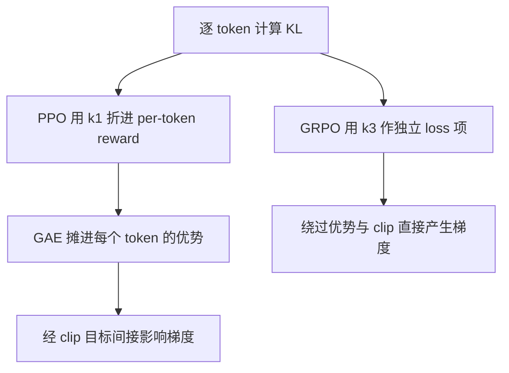

# KL 散度(前向/反向与 k1/k2/k3 估计器)

> ⚠️ 旧版:本篇写于写作契约确立之前,尚未按新标准审查重写。标准见 docs/05-知识库写作契约.md,样板见「GPU架构与执行模型」。

一句话:KL 散度(Kullback–Leibler divergence)度量「**用 Q 来近似 P,平均要多付多少信息代价**」。LLM 训练里它一人分饰两角:**蒸馏的尺子**(量学生分布离老师多远)与 **RL 的缰绳**(拴住策略别离 reference 太远)——前者的关键是「方向选哪边」(前向/反向),后者的关键是「怎么估、放哪里」(k1/k2/k3、折 reward 还是独立 loss)。

## 一、定义与三条性质

$$
D_{KL}(P \,\|\, Q) = \mathbb{E}_{x \sim P}\left[\log \frac{P(x)}{Q(x)}\right] = \sum_x P(x) \log \frac{P(x)}{Q(x)}
$$

信息论解读:数据真按 P 出,你却按 Q 设计压缩编码,KL 是平均每个样本多付的编码代价。以 2 为底时单位是 bit,自然对数时是 nat。通俗版:你按 Q 的世界观下注、世界按 P 出牌,平均每局多付的「惊讶费」——两个分布完全一致时惊讶费为零。

三条必背性质:

- **非负**:由 Jensen 不等式($-\log$ 是凸函数)可证 $D_{KL} \ge 0$,当且仅当 P、Q 处处相等时取 0。注意这是**期望**非负——单点的 $\log(P/Q)$ 完全可以是负的,这个伏笔到 k1 估计器处收回;
- **不对称**:$D_{KL}(P \,\|\, Q) \ne D_{KL}(Q \,\|\, P)$,也不满足三角不等式,所以它不是数学意义上的「距离」,更像单程报价:同一对分布,换个方向价钱不同。不对称的根源是**在谁的地盘上算账**——期望对谁取,谁的高概率区就说了算,这直接引出下一节的前向/反向之分;
- **与交叉熵的关系**:

$$
H(P, Q) = H(P) + D_{KL}(P \,\|\, Q)
$$

  P 是固定的数据分布时 $H(P)$ 是常数,所以**最小化交叉熵 ≡ 最小化前向 KL**——预训练和 SFT 每天做的事,本质就是把模型分布按前向 KL 的方式拉向数据分布。

### 分类损失:独热和软标签都能等价

交叉熵 $H(P,Q)$ 是按 Q 编码 P 的**总成本**,KL 则扣除了 P 本来的熵,只保留多出的成本。P 固定时,二者对被优化的 Q 给出相同梯度,不要求 P 必须独热。

- 独热标签:P 把全部质量放在正确类别 $c$,熵为零,交叉熵和 KL 都是 $-\log Q(c)$。
- 软标签或标签平滑:P 的熵通常大于零,但只要目标固定,二者仍只差常数。工程上可直接计算稳定的交叉熵,不需要为了形式叫 KL 就重新计算目标熵。
- 若 P 本身依赖待训练参数,不能再把 $H(P)$ 当常数;策略场景见「策略更新:谁固定决定能不能换成交叉熵」。

### 蒸馏:软目标与可学习目标的区别

冻结教师产生的软标签仍是固定目标。给定输入及相同温度,只训练学生 Q 时,教师到学生的 $D_{KL}(P\|Q)$ 与软标签交叉熵给出相同梯度。**标签是否独热,与目标是否参与求导是两回事。** 教师每轮更新、但本步将教师输出视为常数时,对学生的这一等价性仍成立;目标熵的数值随轮次变化,不等于它对本步学生参数有梯度。

如果教师与学生联合学习,或目标分布、输入采样分布本身依赖被优化参数,就需保留相应的熵和采样梯度。学生到教师的反向 KL 又包含学生熵,不能直接改成以学生为权重的交叉熵。分类常用交叉熵是因为它直接表达标签的负对数似然且有稳定实现,并非 KL 在数学上必然更慢或更不稳定。分类梯度的具体推导属于分类损失主题;本文承接分布方向和等价条件。

### 策略更新:谁固定决定能不能换成交叉熵

PPO 的一轮更新把旧策略固定,在固定的旧状态样本上优化新策略。因此 $D_{KL}(\pi_{old}\|\pi_\theta)$ 与 $H(\pi_{old},\pi_\theta)$ 在这一轮只差旧策略熵。**作为惩罚项,梯度相同;作为上界约束,必须平移阈值**:若平均 KL 预算为 $\delta$,对应交叉熵预算是 $\delta$ 加上同一状态分布下的平均旧策略熵。旧策略在下一轮才改变,不能用“它会改变”否定本轮的等价性。

RLHF 中另一个常见方向是当前策略对固定参考模型:

$$
D_{KL}(\pi_\theta\|\pi_{ref})=H(\pi_\theta,\pi_{ref})-H(\pi_\theta)
$$

这里被取期望的当前策略也在学习。只保留交叉熵,就漏了鼓励保留熵的项;例如参考分布不均匀时,它会倾向把质量集中到参考概率最高的动作,即使这已偏离参考分布。**比较损失时先写清 KL 的方向,再检查两个分布和采样分布谁固定。**

## 二、前向与反向:同一把尺子的两种拿法

约定:P 是目标分布(数据/老师/reference),Q 是被优化的模型。两个方向的差别全在「在谁的样本上开罚单」:

- **前向 $D_{KL}(P \,\|\, Q)$**(期望取自 P):罚单开在 P 采出的样本上——若某处 $P(x) > 0$ 而 $Q(x) \to 0$,罚款 $\log(P/Q) \to \infty$。翻译:「**P 有质量的地方,Q 都得罩住**」,即 mode-covering(全覆盖)。代价:当 Q 容量不够罩住 P 的所有峰时,最优解是把概率摊平在峰间,连 P 几乎为零的谷底也分到质量;
- **反向 $D_{KL}(Q \,\|\, P)$**(期望取自 Q):罚单开在 Q 自己采出的样本上——若 Q 押注之处 $P(x) \approx 0$,罚款爆炸。翻译:「**Q 押注的地方,P 必须靠谱**」,即 mode-seeking(押峰)。Q 完全可以放弃 P 的某些峰——反正自己不往那儿采样,就永远不会因「漏学」挨罚——把全部质量押在学得会的那一个峰上。

术语对照(读论文用):前向又叫 inclusive / zero-avoiding(P 非零处 Q 不许为零);反向又叫 exclusive / zero-forcing(P 为零处 Q 被迫为零)。

> 🖼️ 占位:双峰分布 P 下的对比图——前向 KL 的 Q 摊成一个矮胖单峰盖住两峰(峰谷之间也有质量,四不像);反向 KL 的 Q 收窄成尖峰押住其中一个峰

| | 前向 $D_{KL}(P \Vert Q)$ | 反向 $D_{KL}(Q \Vert P)$ |
| --- | --- | --- |
| 期望取自 | P(目标的地盘) | Q(自己的地盘) |
| 行为 | mode-covering,全都要 | mode-seeking,押一峰 |
| 重罚 | 漏报:P 有而 Q 无 | 误报:Q 有而 P 无 |
| 容忍 | Q 在 P 的谷底放质量 | Q 丢掉 P 的部分峰 |
| LLM 出场 | CE/SFT、标准词级蒸馏 | RLHF 的 KL 惩罚、MiniLLM 蒸馏 |

### 蒸馏:为什么 MiniLLM 换成反向

标准知识蒸馏用词级 CE 对齐老师的软标签,就是前向 KL。学生容量远小于老师时,前向逼着学生「老师会的都得会一点」,学出摊平的四不像——生成时表现为采到老师低概率区的劣质 token。MiniLLM 的论点:生成任务要的是「学生说出的话老师认可」,而不是「老师会说的话学生全会」,于是改用反向 KL——学生在**自己生成的样本**上被老师打分(mode-seeking:集中学老师的主峰),并把优化写成 on-policy 的 policy gradient,相当于把蒸馏做成了一场以老师似然为 reward 的小型 RL。

### RLHF 的 KL 惩罚是哪个方向?

RLHF 的 KL 项在**当前策略**的采样上计算:

$$
\mathbb{E}_{x \sim \pi_\theta}\left[\log \frac{\pi_\theta(x)}{\pi_{ref}(x)}\right] = D_{KL}(\pi_\theta \,\|\, \pi_{ref})
$$

期望取自 $\pi_\theta$(自己的地盘)——是**反向**(把 $\pi_{ref}$ 当目标 P)。含义随之清晰:策略可以**收窄**,放弃 ref 的部分模式(比如不再闲聊、只输出规范格式)几乎不受罚;但**不能跑到 ref 没有质量的地方**——胡言乱语、reward hacking 式的怪异文本在 ref 下概率极低,罚款巨大。PPO 篇把 KL 惩罚比作风筝线,方向进一步说明这根线的脾气:允许你只在空域的一角飞,但飞出空域立刻猛拉。

## 三、蒙特卡洛估计:测同一段路的三种仪器

先说为什么需要「估计」:单个 token 位置的 KL 理论上可对整个词表精确求和,但要同时物化两个模型的完整分布(词表十万级);而整条回答的 KL 是对轨迹分布的期望,无论如何只能靠采样。通行做法:每个位置只用实际采出的那个 token 在两个模型下的 logprob 算一个数,当作该位置 KL 的单点估计——PPO/GRPO 的 per-token KL 就是这么来的,这套单点估计器体系出自 Schulman 的博客。

设定:$x \sim \pi_\theta$,记 $r = \pi_{ref}(x) / \pi_\theta(x)$,要估的真值是 $D_{KL}(\pi_\theta \,\|\, \pi_{ref}) = \mathbb{E}[-\log r]$:

$$
k_1 = -\log r, \qquad k_2 = \frac{1}{2}(\log r)^2, \qquad k_3 = r - 1 - \log r
$$

同一段路(策略离 ref 多远),三种仪器:

- **k1:无偏,但指针狂抖**。定义的直接单点版,平均下来严格准;但单次读数抖动大,甚至会给出**负的距离**(第一节的伏笔:单点 log 比可负)——拿它当惩罚项,策略在某个 token 上比 ref 更保守时反而「被奖励」;
- **k2:读数稳,但刻度有系统偏差**。平方保证恒正、方差小;但它其实在测另一个散度(对应 $f(x) = \frac{1}{2}(\log x)^2$ 的 f-散度),两分布接近时与 KL 只差高阶小量,离得越远偏得越多;
- **k3:挂了配重的 k1,三者兼得**。构造是 control variate(控制变量):$k_3 = k_1 + (r - 1)$,而 $\mathbb{E}_{\pi_\theta}[r - 1] = \sum_x \pi_{ref}(x) - 1 = 0$——加一个期望为零的项,均值不动,**仍然无偏**;$r$ 偏大时 $-\log r$ 偏负、$r - 1$ 偏正,两股抖动反向相消,**方差大降**;再由切线不等式 $\log x \le x - 1$ 得 $r - 1 - \log r \ge 0$,**恒正**。泰勒展开看得更清:$r \approx 1$ 时 $k_3 \approx \frac{1}{2}(r-1)^2 \approx k_2$——长得像 k2,期望却像 k1 一样准。GRPO 采用的正是它。

| 估计器 | 公式 | 无偏 | 恒正 | 方差 |
| --- | --- | --- | --- | --- |
| k1 | $-\log r$ | ✅ | ❌ 单点可负 | 大 |
| k2 | $\frac{1}{2}(\log r)^2$ | ❌ 距离越远偏越大 | ✅ | 小 |
| k3 | $r - 1 - \log r$ | ✅ | ✅ | 小 |

什么时候用哪个:

- **loss 里的惩罚项 → k3**:恒正保证「惩罚永远是惩罚」,低方差保证单样本也稳(GRPO 的选择);
- **纯监控日志 → k1 的 batch 均值就够**:样本一多,大数定律替你抹平抖动,还严格无偏;
- 一个边界情况:两分布已经拉得很远时 $r$ 呈重尾,k3 的 $r$ 项会偶发爆出巨大读数——不过 KL 惩罚的职责本来就是在走到那么远之前把策略拉回来。

## 四、工程放法:同一根缰绳的两种系法

PPO 篇与 GRPO 篇各提过一句的「经典差异」,在这里补全:

- **PPO:折进 per-token reward**。每个 token 的 reward 扣掉 $\beta \log(\pi_\theta/\pi_{ref})$——注意这正是 **k1**,可负:某 token 比 ref 更保守时反而拿到小额奖励,把策略往 ref 拉回。KL 由此成为奖励信号的一部分,经 GAE 摊进优势、再经 clip 目标间接传导——靠 RL 机制自己「领会」要远离惩罚(详见 PPO 篇);
- **GRPO:独立 loss 项**。$-\beta \, D_{KL}$ 直接加在目标函数上,用 **k3** 估计。梯度直接对 KL 做下降,与优势信号完全解耦——不经过组内标准化、不经过 clip,是一支独立的「回锚力」(详见 GRPO 篇);
- 梯度含义一句话:折 reward 是「改评分,让 RL 自己学」,KL 会改变优势的相对排序;独立项是「直接推参数」,与奖励信号互不干扰。

**β 怎么调**:固定 β 要扫——太小拴不住(reward hacking),太大学不动。更省心的是**自适应 KL 控制器**(PPO 篇的恒温器):设定目标 KL,实测高于目标就调大 β、低于就调小。纯可验证奖励 + 较强 SFT 起点的场景,常干脆去掉 KL 换更快提升(GRPO 篇讲过 R1-Zero 风格的取舍)。

**KL 曲线怎么读**:监控面板上的 KL(step) 是「离出发点的里程表」,看的是**漂移速度**:

- 缓慢、近似线性爬升:正常,策略在稳步吸收 reward 信号;
- 斜率突然抬头:警报——学习率过大,或策略找到了 reward 漏洞正在狂奔(reward hacking 前兆),该去抽查生成样本了;
- 长期贴零:β 太大或学习率太小,等于白训;
- PPO 的 mini-epoch 内还会用 approx-KL 超阈值提前停掉本批更新(PPO 篇的「超速断油」)。

平台 P002-Q026 关于 KL 阈值、TRPO/PPO 约束区别及其他更新控制手段的三项追问,见 PPO 篇。

## 五、其他出场:一条 KL 串起半个后训练

- **DPO**:带 KL 约束的 reward 最大化存在闭式解

$$
\pi^*(y \mid x) = \frac{1}{Z(x)}\, \pi_{ref}(y \mid x)\, e^{r(x, y)/\beta}
$$

  DPO 把它反解出 $r$、代进 Bradley–Terry 偏好模型,整个 RLHF 塌缩成一个二分类损失(详见 DPO 篇)——KL 在这里不是惩罚项,而是推导的起点;
- **SFT = 前向 KL**:第一节的直接推论——CE 训练就是对数据分布做 mode-covering,这也解释了纯 SFT 模型为什么倾向「数据里的风格都会一点」;
- **蒸馏温度**:软标签温度 $T$ 把师生分布同时抹平后再算 KL,放大非最大 logit 之间的「暗知识」,实现时软损失梯度要乘 $T^2$ 平衡尺度。

## 六、面试考点串联

| 问法 | 来源 | 本文回答位置 |
|---|---|---|
| KL 怎样定义,为什么非负、为什么不是距离? | 旧稿问法,来源待核对 | 一、定义与三条性质 |
| KL 与交叉熵有什么区别,独热和软标签时能否互换,CE 最小化哪个方向的 KL? | 平台 P001-Q03、P002-Q003、P002-Q005、P002-Q020、P002-Q026、P002-Q030、P002-Q032、P002-Q035、P002-Q057 | 一、定义与三条性质;分类损失:独热和软标签都能等价 |
| 蒸馏中软标签是否意味着目标不固定,教师更新或联合学习时能否互换 CE 与 KL? | 平台 P002-Q057 | 蒸馏:软目标与可学习目标的区别 |
| 前向与反向各重罚什么,为什么一个倾向覆盖、一个倾向选峰? | 旧稿问法,来源待核对 | 二、前向与反向:同一把尺子的两种拿法 |
| MiniLLM 为什么换成反向 KL? | 旧稿问法,来源待核对 | 蒸馏:为什么 MiniLLM 换成反向 |
| RLHF 用哪个方向的 KL,策略更新中能否直接换成交叉熵? | 旧稿问法;平台 P002-Q026、P002-Q057 | RLHF 的 KL 惩罚是哪个方向?;策略更新:谁固定决定能不能换成交叉熵 |
| k1/k2/k3 在估什么,k3 为什么能无偏、非负,方差有什么特点? | 旧稿问法,来源待核对 | 三、蒙特卡洛估计:测同一段路的三种仪器 |
| PPO 与 GRPO 的 KL 各放在哪,梯度含义有何不同? | 旧稿问法,来源待核对 | 四、工程放法:同一根缰绳的两种系法 |
| KL 曲线怎么读、β 怎么调? | 旧稿问法,来源待核对 | 四、工程放法:同一根缰绳的两种系法 |

> 本表含平台整理题,非面经原题。平台来源为老师平台 P001-Q03、P002-Q003/Q005/Q020/Q026/Q030/Q032/Q035/Q057;旧稿其余问法保留,来源尚待核对。本次只增补这些平台来源的覆盖,全文仍待按新契约重写。

## 相关文献

- Approximating KL Divergence(k1/k2/k3 估计器)— John Schulman 博客:http://joschu.net/blog/kl-approx.html
- PPO — [arXiv:1707.06347](https://arxiv.org/abs/1707.06347)
- 平台整理题 — [老师平台](https://course.terminiai.com/interview),P001-Q03、P002-Q003/Q005/Q020/Q026/Q030/Q032/Q035/Q057。
- Distilling the Knowledge in a Neural Network(固定教师软目标)— [arXiv:1503.02531](https://arxiv.org/abs/1503.02531)。
- DeepSeekMath(GRPO 的 k3 实践)— [arXiv:2402.03300](https://arxiv.org/abs/2402.03300)
- MiniLLM(反向 KL 蒸馏)— [arXiv:2306.08543](https://arxiv.org/abs/2306.08543)
