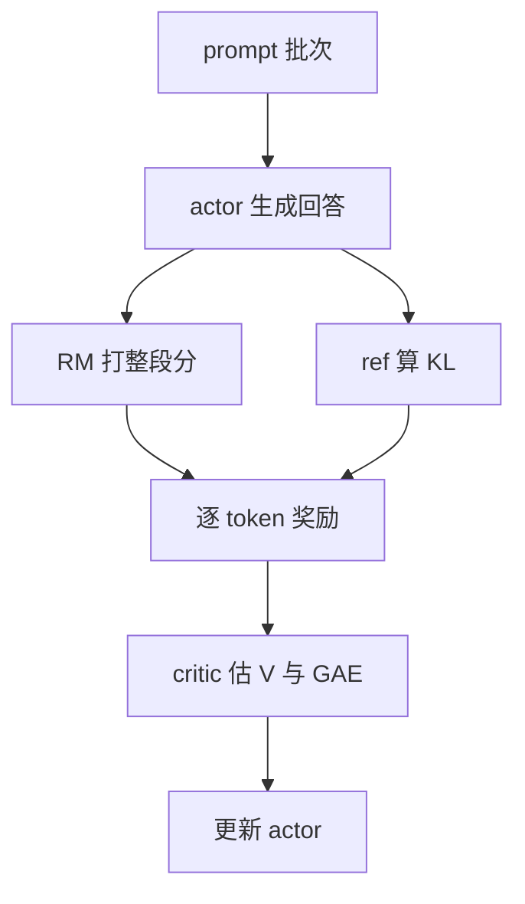

# PPO(Proximal Policy Optimization)

一句话:PPO 是**用一个廉价的裁剪操作,把"这一步别迈太大"直接写进目标函数**的策略梯度算法——它让语言模型能拿一个不可微的打分(人类偏好、单元测试、规则校验)当训练信号,又不至于一步把自己训崩。

## 一、动机与建模

### 为什么要上 RL:奖励不可微,而 REINFORCE 方差太大

监督学习的梯度从 loss 一路反传到参数,所以 loss 必须可微。但"这个回答讨不讨人喜欢""这段代码过不过测试"根本没有导数。策略梯度绕开了这件事:目标是最大化轨迹期望回报 $J(\theta)=\mathbb E_{\tau\sim\pi_\theta}[R(\tau)]$,用对数导数技巧展开后

$$
\nabla_\theta J(\theta)=\mathbb E_{\tau\sim\pi_\theta}\!\left[R(\tau)\sum_t \nabla_\theta\log\pi_\theta(a_t\mid s_t)\right]
$$

读法是:**梯度只从 $\log\pi_\theta$ 这一项来,$R(\tau)$ 全程只是乘在外面的一个标量权重**。所以奖励可以是纯黑盒——规则脚本、人工判断、编译器返回码都行,因为我们从来不需要 $\nabla R$。回报为正就整体抬高这条路径上各动作的概率,为负就整体压低,像"卷子发下来,考得好的那套做法整体加分"。两条梯度路径别混:**训 reward model 时**梯度要穿过 RM 自己的参数(它是从偏好数据学出来的评分函数);**用 RM 更新策略时** RM 冻结,梯度仍只走 $\log\pi_\theta$。RM 怎么训、奖励怎么设计、reward hacking 怎么防,见 RLHF与RM 篇。反过来也别绝对化:参考策略 KL 由两个概率分布算出,本身对策略参数可导,估计器与方向选择见 KL散度 篇。

上式就是 REINFORCE,它无偏,但**方差大到几乎没法用**,三个来源在语言模型上条条被放大:一段 500 token 的回答只拿一个分,**整条轨迹共用一个权重**,好分数会把其中那些其实很平庸的 token 一起抬高;RM 给 +3 还是 +8 大半反映题目难易而非动作好坏,**回报的绝对尺度直接乘进梯度**;一个 batch 几百上千条回答,却要估一个上亿维参数空间的梯度方向,**样本太少**。后果是只能用很小的学习率慢慢磨。而 RL 又不像监督学习有一份固定教材——**数据是策略自己采的**,一次过大的坏更新把策略推下悬崖,之后采出来的全是垃圾,爬不回来。PPO 要解决的正是这两件事:**降方差**(优势估计,第二节)与**限步长**(裁剪,第三节)。

### 语言模型上的 MDP:最常用的是 token 级建模

| 概念 | 在语言模型里是什么 | 备注 |
|---|---|---|
| 状态 $s_t$ | prompt + 已生成前缀,即 $(x,\,y_{<t})$ | 状态不断变长,不是固定维向量;转移只是把 $y_t$ 拼上去,确定性、无环境随机性 |
| 动作 $a_t$ | 从词表挑出下一个 token,即 $y_t$ | $\pi_\theta(a_t\mid s_t)$ 就是模型的 next-token 分布 |
| 轨迹 / episode | 从 prompt 到 EOS 的一整条回答,也叫 rollout | **不是"另一种粒度的动作"** |

另一种合法口径是**上下文 bandit**:环境一次性接收整段文本、返回一个结果,整段回答就是一次动作。两种都能用,但答题时**必须先声明用哪个**——不能一边说 token 是动作、一边说整段回答也是动作,那样优势、概率比、KL 的定义全对不上。多轮对话不改这套框架:把"到当前轮为止的完整对话(含工具返回、用户回复)"当 state,本轮回复是由多个 token 动作组成的子轨迹,用户回复与工具结果属于**环境转移**而非策略动作;奖励可按 token、按轮或按整段会话给。多轮信用分配与工具环境怎么搭见 AgenticRL 篇。

### 一轮迭代里同时站着四个模型



| 模型 | 干什么 | 状态 | 类比 |
|---|---|---|---|
| actor(policy) | 逐 token 生成回答,并接受策略梯度更新 | 训练态 | 台上答题的学生 |
| critic(value) | 输入当前**前缀**,输出标量 $V(s_t)$,估"从这里写完还能拿多少分" | 训练态 | 场边随时预估比分的教练 |
| reward model | 给**完整回答**打一个偏好分 | 冻结、只前向 | 只看卷面的评委 |
| reference | 开训前的 SFT 模型,提供 KL 锚点 | 冻结、只前向 | "原来的自己" |

**critic 不是 RM**:RM 判断成品有多符合偏好、只在末尾出一个数;critic 预测当前策略从某个半成品状态出发还能拿多少回报、每个 token 位置都出一个数(两者职责差异见 RLHF与RM 篇)。同样要分清两个"旧策略":$\pi_{\text{old}}$ 是**本轮采样时冻结的快照**,当次概率比的分母;$\pi_{\text{ref}}$ 是**长期固定的 SFT 模型**,限制累计漂移。二者不冗余——一个管单批次的步子,一个管离出发点多远。RLHF 里常把参考 KL 折进每步奖励:

$$
r_t=r_{\text{RM}}(x,y)\cdot\mathbf 1[t=T]-\beta\log\frac{\pi_b(a_t\mid s_t)}{\pi_{\text{ref}}(a_t\mid s_t)}
$$

即:**RM 那一个分只挂在最后一个 token($t=T$)上,而每个 token 都按偏离 reference 的程度扣一点**——风筝可以飞高,线不能断。另一些实现不折进 reward,而把 KL 作为独立 loss 项;两种放法的差别与估计器选择见 KL散度 篇。

## 二、优势:PPO 的"往哪走"从哪来

### reward、return、value、advantage 各是什么

$$
G_t=\sum_{k=0}^{T-t-1}\gamma^k r_{t+k},\qquad V^\pi(s)=\mathbb E[G_t\mid s_t=s]
$$

reward $r_t$ 是环境某一步给的信号,return $G_t$ 是**从当前步往后累计**的折扣奖励,value $V^\pi(s)$ 是当前策略在该状态下的期望 return。

$$
Q^\pi(s,a)=\mathbb E[G_t\mid s_t=s,a_t=a],\qquad A^\pi(s,a)=Q^\pi(s,a)-V^\pi(s)
$$

advantage 回答"**在这个状态下,选这个动作比平均水平好多少**"。注意 $A$ 的定义是 $Q-V$;一步 TD 残差只是它的一种估计,不是定义。**为什么不能直接拿 reward 当权重**:RLHF 的奖励几乎全落在末尾,中间 token 原生 reward 是 0,直接用等于告诉模型"前面写什么都无所谓";就算把终局分复制给每个 token,也只是让它们共享同一个高方差数字,还混进了题目难易——难题上的好回答可能只有 +0.5,简单题上的平庸回答就有 +3。减基线之所以是"白送的降方差":

$$
\mathbb E_{a\sim\pi}\big[\nabla_\theta\log\pi_\theta(a\mid s)\,b(s)\big]=b(s)\,\nabla_\theta\sum_a\pi_\theta(a\mid s)=b(s)\,\nabla_\theta 1=0
$$

只要基线 $b(s)$ **只依赖状态、不依赖动作**,它在期望里恒等于 0(概率之和永远是 1,对参数求导当然是 0)。所以减去 $V(s)$ 期望不变,却抵掉了"这道题本身难不难"这个所有动作共有的偏移,剩下的才是动作之间的相对好坏。

### TD 残差与 GAE

$$
\delta_t=r_t+\gamma\,(1-d_t)\,V(s_{t+1})-V(s_t)
$$

$\delta_t$ 是"惊喜值":实际拿到的(即时奖励 + 下一状态预期)比教练原本的预期好多少。$d_t$ 标记**真终止**(生成了 EOS);只是撞上最大长度被截断时 $d_t$ 仍为 0,还要用 $V(s_{t+1})$ 做 bootstrap,否则等于告诉模型"写到 4096 就一分不值"。GAE 把往后每步的惊喜值按指数权重叠起来:

$$
\hat A_t=\sum_{l=0}^{T-t-1}(\gamma\lambda)^l\,\delta_{t+l}
$$

它等价于**把所有长度的 n-step 优势估计按几何权重混合**($l=0$ 项是 1-step,前两项偏向 2-step,依此类推)。之所以不固定挑某个 $n$:任何单一 $n$ 都是在偏差和方差之间硬选一个点,几何加权把这些估计平滑融在一起,对 $n$ 的误选不敏感。工程上不必真做双重求和,从后往前扫一遍即可:

```python
# 一次反向扫描算完整批 GAE,复杂度 O(T),不用存 T×T 的中间量
adv, last = zeros_like(rewards), 0.0                 # rewards: [B, T]
for t in reversed(range(T)):
    nonterm = 1.0 - done[t]                          # 只有真 EOS 才置 0,截断不算
    delta = rewards[t] + gamma * values[t + 1] * nonterm - values[t]
    last = delta + gamma * lam * nonterm * last      # 截断处仍靠 V 做 bootstrap
    adv[t] = last
returns = adv + values                               # critic 的回归目标
adv = (adv - adv[m].mean()) / (adv[m].std() + 1e-8)  # m = pad_mask,padding 位不进统计
```

### $\gamma$、$\lambda$ 与必须记牢的工程细节

两个旋钮长得像,管的事完全不同:

| 旋钮 | 管什么 | 调小 | 调大 |
|---|---|---|---|
| $\gamma$(折扣) | 未来奖励折多少,即**看多远** | 只顾眼前,长程依赖学不到 | 看得远,远期噪声也一起收进来 |
| $\lambda$(GAE) | 更信 critic 的短期预测还是真实回报,即**信谁** | $\lambda=0$ 时 $\hat A_t=\delta_t$,方差最小,但 critic 估错就全是偏差 | $\lambda=1$ 时接近蒙特卡洛回报减基线,偏差小、方差大 |

两个边界值都要带条件:$\lambda=1$ **只有在完整 episode、终止与 bootstrap 都处理正确时**才接近"蒙特卡洛回报减基线",不能无条件称为无偏。有限长度的 LLM 任务常把 $\gamma$ 设为 1(一条回答就是一个 episode),但这仍取决于终止、截断和奖励定义的口径。$\lambda$ 也没有通用最优值:critic 可靠、奖励噪声大时可偏小;critic 明显有偏、长程影响重要时偏大。判据是 value loss、explained variance(critic 解释了多少回报方差)、优势方差和最终评测,不是照抄 0.95;按训练进度调度 $\lambda$ 是超参数策略,不是自适应算法。

**终局奖励怎么摊到每个 token**:GAE 的作用是**把末尾那个分沿轨迹向前传播**,靠 $V(s_{t+1})-V(s_t)$ 这条链逐位记下"写到这里有没有变得更有希望"。但必须说清:**GAE 没有消除稀疏奖励**,它只给出一个带价值基线的信用分配估计;真正的信号还是那一个数,离结果越远的 token 估计越不可靠,critic 学起来也越难。更密的信号只能靠可靠的过程奖励,而过程奖励一旦有偏,错误方向反而传得更快。长序列还有几个纯工程的坑:按有效长度做 mask(padding 位不能进 $\delta$、也不能进白化的均值方差)、分段反向扫描控显存、截断处正确 bootstrap、累加用较高精度——错一条优势就是错的,而 loss 曲线往往看不出来。**advantage 白化**是每个 batch 内减均值除标准差,把"绝对分"换算成"全班排名",这样学习率与 $\varepsilon$ 的行为不随奖励尺度漂移。代价是:若一个 batch 里几乎所有回答都不错,白化会硬把一半样本压成负优势,凭空造出"这条要减概率"的信号——batch 太小或奖励分布极端偏斜时要警惕。

## 三、核心机制:重要性采样 + 裁剪 + 完整损失

### 重要性采样:旧数据的汇率

生成一批 rollout 是 PPO 里最贵的一步(几百上千条、每条几千 token 的自回归解码),只更新一次就扔掉太浪费。可数据是 $\pi_{\text{old}}$ 采的,要更新已经走远的 $\pi_\theta$,就得换算:

$$
\mathbb E_{x\sim p}[f(x)]=\mathbb E_{x\sim q}\!\left[\frac{p(x)}{q(x)}f(x)\right]
$$

只要 $p(x)>0$ 的地方 $q(x)$ 也大于 0(**覆盖条件**),就能用 $q$ 采的样本估 $p$ 下的期望,权重是 $p/q$——像拿旧账本上的外币记账,按当前汇率折算才作数。落到 PPO 就是逐 token 概率比:

$$
\rho_t(\theta)=\frac{\pi_\theta(a_t\mid s_t)}{\pi_{\text{old}}(a_t\mid s_t)}
$$

$\rho_t=1$ 说明新旧策略对这一步看法一致,偏离 1 越远这条旧数据越"不作数"。**长序列的权重为什么会炸**:若按整条轨迹算,权重是每步比率的连乘,500 个略大于 1 的数相乘就指数放大,少数样本支配整个估计,有效样本量(ESS)塌到个位数。缓解手段有 per-decision IS(逐步用比率而非连乘)、截断权重、自归一化、V-trace 类校正,以及最直接的**缩短策略滞后**;这些几乎都以偏差换方差,没有免费午餐。

### 裁剪目标:给方向盘装限位器

先把比率夹一刀:

$$
\rho_t^{\text{clip}}=\mathrm{clip}\big(\rho_t(\theta),\,1-\varepsilon,\,1+\varepsilon\big)
$$

再在"原版"和"夹过的"两个目标里取更保守的那个:

$$
L^{\text{CLIP}}=\mathbb E_t\Big[\min\big(\rho_t(\theta)\,\hat A_t,\ \rho_t^{\text{clip}}\,\hat A_t\big)\Big]
$$

拆开看:优势为正时,把概率提到旧概率的 $1+\varepsilon$ 倍就到顶,再往上目标不增、梯度归零;优势为负时压到 $1-\varepsilon$ 倍也到顶。$\min$ 保证被截掉的永远是"继续朝有利方向多迈一步"的额外收益,不利方向的惩罚一分不减。$\varepsilon=0.2$ 是原论文与多数实现的常见起点,**不是跨任务常数**:太小则有效更新过少、学不动,太大则保守作用被削弱。**它裁的到底是什么**,这是最常答错的一点:裁掉的是**样本对代理目标的激励**,不是把实际概率比强行投影回区间。同一批里其他样本、共享参数、value 与熵项都可能继续把某个 token 的概率推出区间,所以监控时看到 clip fraction 大于 0 且实际比率越界是正常的。由此:**PPO-clip 不提供任何 KL 上界,也不保证回报单调上升**,它是一阶优化下的软约束,代价是引入偏差。

### 完整损失:四项各司其职

统一写成**最小化**形式(符号最容易混,先声明口径):

$$
\mathcal L=-L^{\text{CLIP}}+c_v\,\mathcal L_V-c_H\,\mathcal H(\pi_\theta)+\beta\,D_{\text{KL}}(\pi_\theta\Vert\pi_{\text{ref}})
$$

四项依次是:策略项(要最大化,故取负号)、价值回归项、熵奖励(要最大化,故取负号)、参考策略 KL 惩罚。价值项是 critic 对回报目标做回归:

$$
\mathcal L_V=\mathbb E_t\Big[\big(V_\theta(s_t)-\hat R_t\big)^2\Big],\qquad \hat R_t=\hat A_t+V_{\text{old}}(s_t)
$$

回归目标由本批优势加回旧 value 得到,这样 critic 与 actor 用的是同一份 GAE 结果、口径一致。常见起点是 $c_v$ 取 0.5–1、$c_H$ 取 0.01 量级,都要随奖励尺度重调。value 侧一般还配 **value clip**:限制新估值偏离 $V_{\text{old}}$ 的幅度,动机与策略 clip 一致——critic 在 rollout 之间跳得太狠,GAE 就跟着抖,actor 被带偏。熵项与 KL 项在 RLHF 里都是可选的:$\beta$ 若已折进 per-token reward,就不该在 loss 里再加一遍,**同一根缰绳系两次是常见的实现事故**。$\beta$ 本身也难固定:太小防不住漂移,太大几乎学不动,早期 RLHF 工作的做法是按实测 KL 高于/低于目标值动态增减(自适应 KL 控制器),像恒温器按室温调功率;它到底在读哪个方向的 KL、用哪个估计器,见 KL散度 篇。

### 一批数据被用几次,以及 on-policy / off-policy 到底指什么

面试有个陷阱问法:"真实采样量是不是等于 rollout 数?"答案是**先定口径,否则这问题无解**——环境交互条数、轨迹条数、transition 数、token 数、optimizer step 数是五个不同的量。设采到 $N$ 条样本,训 $E$ 个 epoch,每个 epoch 切 $K$ 个 mini-batch:

| 口径 | 数值 |
|---|---|
| 新的环境交互 / 轨迹 | $N$(不随 $E$、$K$ 变) |
| optimizer step | $E\times K$ |
| 总样本呈现次数 | $N\times E$ |
| **每条样本被用几次** | $E$,**不是** $E\times K$ |

具体一点:采 16,384 条,训 4 个 epoch、每 epoch 切 4 个 mini-batch,得到 16 次 optimizer step,每条数据出现 4 次,总呈现量 65,536 条次。多 epoch 的收益是把昂贵的交互数据榨干,代价是**越往后的更新看到的数据越旧**——策略已经走了十几步,数据还是第 0 步采的;表现为比率分布出现尖峰、clip fraction 上冲、approx-KL 飙升,以及对本批奖励噪声过拟合。控制手段按直接程度排:减少 epoch 数 → 按 approx-KL 提前停掉本批剩余 mini-batch(一些实现取 0.01–0.02 量级阈值,口径必须和监控一致)→ 及时重采;再配更小学习率、更保守的 $\varepsilon$ 和梯度裁剪。要点破一个误区:**reference KL 管不了数据陈旧**,它约束的是当前策略离 SFT 有多远,和"这批数据是谁采的"无关,陈旧 rollout 不会因为 KL 项重新变回 on-policy。

**on/off-policy 与 online/offline 是两组正交概念**,混着说必错:**on/off-policy** 看行为策略与目标策略是否一致;**online/offline** 看训练时还能否收集新交互。PPO 由本轮冻结的 $\pi_{\text{old}}$ 采样、有限个 epoch 更新、随即刷新数据,只要策略滞后有限、比率算得对,它就是**近似 on-policy**,不是普通的 off-policy replay 算法(顺带分清:RM 是在静态偏好数据上**离线**训好再冻结的,PPO 的策略阶段才持续产出新回答,所以这个阶段是 online 的)。GRPO 同理——去掉 critic 改变的是优势怎么算,不改变数据分布属性(见 GRPO 篇);DPO 用固定偏好对做监督式成对损失,准确叫法是**离线直接偏好优化**,不是 Q-learning 意义上的 off-policy RL(见 DPO 篇)。

| 算法 | 归类 | 数据怎么用 | 在 LLM 对齐上的处境 |
|---|---|---|---|
| PPO / GRPO | 近似 on-policy | 旧策略快照采一批,概率比修正,复用几个 epoch | 主力:直接用预训练模型自带的随机策略,吃得下序列级奖励 |
| DQN | off-policy | replay buffer 打散样本相关性并复用;target network 让 bootstrap 目标别跟着抖 | 状态是不断变长的文本前缀,要在海量前缀上学稳定的 $Q$,误差逐层传播 |
| DDPG / TD3 | off-policy | 确定性策略 + 动作噪声探索;TD3 用双 critic、延迟 actor 更新压过估计 | 面向连续动作,token 是离散采样,套不上 |
| SAC | off-policy | 随机策略,目标是"奖励 + $\alpha\times$熵",$\alpha$ 可按目标熵自动调 | 同样面向连续动作;它的熵是核心目标而非可选正则 |

数据极贵、想提样本效率时,先判断能不能学到够准的环境模型:能,则 model-based 可省真实交互,代价是模型偏差与规划开销;不能,就只能靠 replay、离线数据、示范预训练或限制策略滞后的校正方法。**没有只看 on/off-policy 标签就能选出的"最高效算法"。**

### 各种"限步长"手段到底保证了什么

| 手段 | 怎么约束 | 真正保证了什么 |
|---|---|---|
| TRPO | 近似求解带平均 KL 约束的优化问题,配线搜索 | 对实测 KL 的控制最明确;代价是 Fisher 矩阵 + 共轭梯度这套二阶机器,和参数共享、dropout 也不好配 |
| PPO-penalty | 目标里加 KL 惩罚,按目标 KL 自适应调系数 | 软惩罚,不等于每步严格不超阈值 |
| PPO-clip | 截去过大比率带来的额外代理收益 | **不保证任何 KL 上界**,但只需一阶优化器,工程上简单得多 |
| approx-KL 早停 / 梯度裁剪 | 前者本批 KL 超阈值就丢掉剩余 mini-batch,后者限制参数梯度的范数 | 前者限制的是"更新机会",超速就断油;后者控的是参数空间步幅,和概率分布上的 KL 不是一回事 |

PPO 取代 TRPO 成为默认选择,不是因为约束更强,而是因为**它足够便宜,便宜到可以配上一堆工程细节反复调**——这一点有专门的对照实验支持(见相关文献 Engstrom 等)。

## 四、训练细节与常见坑

### 策略熵与熵塌缩

$$
\mathcal H(\pi(\cdot\mid s))=-\sum_{a}\pi(a\mid s)\log\pi(a\mid s)
$$

熵衡量**同一状态下动作分布有多分散**:高熵表示多个 token 都有机会被采到,低熵表示策略接近确定性。给目标加 $c_H\mathcal H$ 能保留随机性、减少过早锁死在局部方案的风险,但两点要说清:**它改变了优化目标本身**(最优解不再是纯奖励最优),而且**不自动降低策略梯度方差**。熵系数要不要衰减看任务——探索需求逐渐降低的可以衰减,多解或非平稳任务反而要保留;太大则模型为了随机牺牲奖励,太小则很快塌缩、rollout 高度同质。

**熵和参考 KL 不能互换**:熵只看当前策略自身散不散,KL 比的是当前策略与另一个分布像不像;高熵策略照样可能离 reference 很远,低熵策略也可能和低熵 reference 贴得很紧。符号上习惯 $\alpha$ 表熵温度、$\beta$ 表 KL 系数。SAC 是另一个极端:它把最大熵写进核心目标,还能自动调温度——实际熵低于目标熵就把 $\alpha$ 调大、高于就调小;PPO 的熵奖励只是可选正则,两者别混成同一个机制。

熵塌缩是 RL 训练里最典型的失败模式:训练早期熵急速下滑,随后性能跟着饱和。近期工作把这一现象刻画为熵的变化与"动作概率和 logit 变化量的协方差"相关,而该协方差在训练中大多为正,所以熵单调下降(论文自报,见相关文献)。诊断时**不要只看熵一条曲线**,要和奖励、独立评测、KL、优势尺度、clip fraction 一起看;干预手段包括提高熵系数、降学习率或减少复用轮数、修正奖励尺度、补充多样数据,并检查是不是少数模式被 RM 错误放大。只把熵强行拉高,得到的是随机但无用的策略。

### 该盯哪些指标,以及调优顺序

PPO 的 loss 曲线几乎不携带有效信息,只看它等于没看。要同时盯:**实测 approx-KL 与 clip fraction**(被裁样本比例与更新前后的策略距离,直接反映步子大小)、**策略熵 / token 熵**(塌缩的第一预警)、**value loss 与 explained variance**(critic 解释了多少回报方差,低到接近 0 说明它基本在瞎猜,GAE 会把偏差直接传给 actor)、**比率分布与有效样本量**(尖峰意味着数据太旧),以及**reward 曲线加一份独立评测**——**RM 分涨而独立评测不涨甚至下跌,就是 reward hacking 的信号**(成因与缓解见 RLHF与RM 篇)。

调优顺序错了只会更快地训坏,正确的次序是**正确性 → 算法稳定性 → 显存 → 硬件利用率**。第一步用小规模样例逐项核对奖励、终止与 mask、优势、旧策略 log-prob、loss 归一化;特别注意生成引擎与训练引擎算出的 log-prob 并不逐位相等(kernel 实现、精度、并行规约顺序都不同),直接拿生成端的 log-prob 当分母会给概率比引入系统性偏差(见 RL框架对比 篇)。第二步学习率、batch、$\varepsilon$、$\beta$、熵系数逐项改,每次只动一个;actor 与 critic 的损失尺度、初始化、更新次数都不同,"**critic 学习率必须比 actor 小一个数量级**"不是通用规则,正确做法是分别看 KL/熵与 value loss/explained variance——critic 欠拟合就加容量或更新次数,策略漂移过快就先压 actor 的更新强度;critic 初期噪声大时可先冻 actor 单训 critic 若干步,教练还不会估分,比赛没法打。探索强度的调法随算法与动作空间变:离散价值算法用 $\varepsilon$-greedy,连续控制加动作噪声,随机策略用熵奖励,语言模型主要靠采样温度、top-p 加熵/KL 约束,**这几种不能混写**。

### 显存与吞吐

四模型同台的压力是实打实的。以 7B 为例,一个训练态模型按 bf16 权重 2 + bf16 梯度 2 + fp32 master 4 + Adam 一阶二阶动量 4+4 ≈ **16 字节/参数**算,约 112 GB;actor + critic 两份 224 GB,再加冻结的 RM 与 reference 各约 14 GB(bf16 只前向),**常驻参数就逼近 250 GB**,吃掉一台 8×80 GB 机器近四成——还没算激活、KV cache 和 rollout 的中间结果。按代价从小到大:先减每卡 micro-batch 并用**梯度累积**保住 optimizer 看到的有效 batch(注意累积只是把一次前反向拆成几次,**总计算量一分不减**,微批切太小反而掉吞吐),再上混合精度、激活重计算、序列打包、按 token 动态组批,然后参数与优化器分片(见 ZeRO 篇)、参数卸载;冻结模型的分数与 log-prob 在同一个 rollout 批次内可缓存,不必重复前向。显存账怎么拆见 显存管理与OOM 篇。吞吐侧,生成与训练解耦能填掉彼此空泡,但异步过强会制造策略陈旧,**必须记录每批数据由哪个策略版本生成并限制滞后**;还有一条要说死:经验回放与优先回放属于可做分布校正的 off-policy 算法,**不能当作 PPO 的加速插件直接挂上**。判定加速是否有效要同时看端到端 samples/tokens per second 和 reward、KL、熵、clip fraction、value 误差这组训练口径——吞吐涨了而训练口径变了,那不是加速,是换了个算法。想进一步省成本:GRPO 用组内相对优势免掉 critic(见 GRPO 篇),DPO 连在线 rollout 都省掉(见 DPO 篇),GRPO 一族各变体修的是什么问题见 GRPO变体 篇。选型的粗口径是:奖励可靠、需要在线探索或有可验证信号时用 PPO/GRPO;已有覆盖足够的离线偏好且预算紧时先用 DPO 建基线。

## 五、面试考点串联

| 高频问法 | 本文哪一节 |
|---|---|
| PPO 的裁剪目标是什么?完整损失有哪几项?四个模型怎么协作? | 三(裁剪目标;完整损失);一(四个模型) |
| clip 和参考策略 KL 是不是重复了?$\varepsilon$、$\beta$ 分别怎么调? | 一(四个模型);三(裁剪目标);四(该盯哪些指标,以及调优顺序) |
| GAE 怎么写?$\lambda=0$ 和 $\lambda=1$ 各对应什么?它和 n-step TD 什么关系,为什么不固定一个 $n$? | 二(TD 残差与 GAE;$\gamma$、$\lambda$ 与必须记牢的工程细节) |
| RLHF 的终局奖励怎么分到 token?长序列算 GAE 要注意什么? | 二($\gamma$、$\lambda$ 与必须记牢的工程细节) |
| LLM 的 PPO 里 state、action、trajectory 指什么?多轮对话怎么定义? | 一(语言模型上的 MDP) |
| 奖励必须可微吗?不可微的规则打分怎么更新可微的策略?REINFORCE 又为什么方差高? | 一(为什么要上 RL) |
| 基线为什么既降方差又不改变期望梯度?GAE、PPO 在此之上各改善了什么? | 二(reward…advantage);三(裁剪目标) |
| On-policy 和 off-policy 差在哪?"真实采样量"等于 rollout 数吗?多 epoch 复用会带来什么问题? | 三(一批数据被用几次) |
| DQN 的 replay 与 target network 各解决什么?LLM 对齐为什么很少用 DQN/SAC? | 三(一批数据被用几次,算法归类表) |
| 重要性采样在修正什么?长序列权重为什么会炸,裁剪付出了什么代价? | 三(重要性采样;裁剪目标) |
| reward、return、value、advantage 怎么区分?直接拿 reward 当权重会怎样? | 二(reward、return、value、advantage) |
| 策略熵是什么?熵塌缩怎么诊断和干预?它和参考 KL、SAC 的熵有什么区别? | 四(策略熵与熵塌缩) |
| PPO 和 TRPO 各约束了什么?为什么工程上更常用 PPO? | 三(各种"限步长"手段) |
| RL 训练按什么顺序调?actor 和 critic 的学习率怎么定,critic 估不准会怎样? | 四(该盯哪些指标,以及调优顺序) |
| 显存不够又要保住有效 batch,有哪些手段?哪些能真的省算力? | 四(显存与吞吐) |
| value loss 为什么也要 clip?不 clip 会怎样?(补充题) | 三(完整损失) |
| advantage 为什么要在 batch 内白化?什么时候反而有害?(补充题) | 二($\gamma$、$\lambda$ 与必须记牢的工程细节) |

## 相关文献

- Proximal Policy Optimization Algorithms — [arXiv:1707.06347](https://arxiv.org/abs/1707.06347)
- Trust Region Policy Optimization — [arXiv:1502.05477](https://arxiv.org/abs/1502.05477)
- High-Dimensional Continuous Control Using Generalized Advantage Estimation(GAE)— [arXiv:1506.02438](https://arxiv.org/abs/1506.02438)
- Training language models to follow instructions with human feedback(InstructGPT,确立 RLHF-PPO 三阶段范式)— [arXiv:2203.02155](https://arxiv.org/abs/2203.02155)
- Implementation Matters in Deep Policy Gradients: A Case Study on PPO and TRPO — [arXiv:2005.12729](https://arxiv.org/abs/2005.12729)
- Secrets of RLHF in Large Language Models Part I: PPO — [arXiv:2307.04964](https://arxiv.org/abs/2307.04964)
- The Entropy Mechanism of Reinforcement Learning for Reasoning Language Models(熵塌缩)— [arXiv:2505.22617](https://arxiv.org/abs/2505.22617)
- Soft Actor-Critic: Off-Policy Maximum Entropy Deep RL with a Stochastic Actor — [arXiv:1801.01290](https://arxiv.org/abs/1801.01290)
- Williams, R. J. (1992). Simple statistical gradient-following algorithms for connectionist reinforcement learning(REINFORCE)— https://doi.org/10.1007/BF00992696
- The 37 Implementation Details of Proximal Policy Optimization(ICLR Blog Track, 2022)— https://iclr-blog-track.github.io/2022/03/25/ppo-implementation-details/
