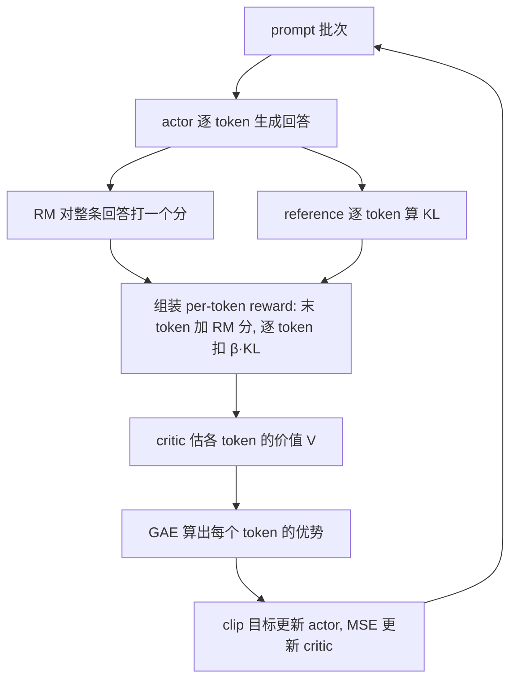

# PPO(Proximal Policy Optimization)

> ⚠️ 旧版:本篇写于写作契约确立之前,尚未按新标准审查重写。标准见 docs/05-知识库写作契约.md,样板见「GPU架构与执行模型」。

一句话:**TRPO 信任域思想的一阶平价近似**——靠 clip 概率比这一个廉价操作实现"每次更新步子别迈太大",从 InstructGPT 到 ChatGPT 一路沿用,是 RLHF 的老牌主力算法(免 critic 的后继者详见 GRPO 篇)。

## 一、动机:一步崩坏与太贵的信任域

### vanilla policy gradient 的两大痛点

朴素策略梯度(policy gradient)$\nabla_\theta J = \mathbb{E}\left[\nabla_\theta \log \pi_\theta(a_t \mid s_t)\, A_t\right]$ 的更新逻辑是"好动作加概率、坏动作减概率",问题有二:

- **方差大**:梯度靠采样少量轨迹估计,奖励噪声随轨迹长度累积——像抽三五个人估全国平均收入,结果抖动剧烈,只能用小学习率慢慢磨;
- **步长敏感、一步崩坏**:on-policy(在线策略)训练的数据由当前策略自己生成。监督学习里教材是固定的,走错一步下次还能被拉回来;RL 里等于"教材是自己写的"——一次过大的坏更新把策略推下悬崖后,之后采出的数据也全是垃圾,再也爬不回来。

### TRPO:对症,但太贵

TRPO 的解法:限制每次更新前后策略的 KL 散度不超过阈值,只在"信任域"(trust region)内挪动——像在悬崖边行走,规定每步只许落在以脚下为圆心的安全圈内。代价是要解一个带 KL 约束的优化问题:Fisher 信息矩阵、共轭梯度、线搜索,一整套二阶机器,实现复杂、算得慢,还与 dropout、参数共享等常用结构不兼容。

### PPO:用一阶优化限制过大的更新动机

PPO 改造代理目标,降低继续扩大某些动作概率比的收益,从而可用一阶优化器训练。它比求解带约束问题更简单,但不保证每一步满足严格的 KL 上界。

## 二、核心机制:clip 目标 + GAE

### 1. 重要性采样比:旧数据的汇率

$$
\rho_t(\theta) = \frac{\pi_\theta(a_t \mid s_t)}{\pi_{\theta_{old}}(a_t \mid s_t)}
$$

一批数据由旧策略 $\pi_{\theta_{old}}$ 采集,却要拿来更新走远了的新策略 $\pi_\theta$(同一批数据会复用训多个 epoch,见第四节),就得乘上这个折算系数——重要性采样(importance sampling),好比拿旧账本记的外币账,要按当前汇率换算成新币种才作数。$\rho_t = 1$ 表示新旧策略对该动作看法一致;偏离 1 越远,策略在这一步改得越多,旧数据也就越"不作数"。

### 2. clip 代理目标:方向盘限位器

$$
L^{CLIP}(\theta) = \mathbb{E}_t\left[ \min\left( \rho_t(\theta)\, \hat{A}_t,\ \mathrm{clip}\left(\rho_t(\theta),\ 1-\varepsilon,\ 1+\varepsilon\right) \hat{A}_t \right) \right]
$$

$\varepsilon=0.2$ 是原论文实验和许多实现中的常见起点,不是跨任务固定值。两个部件各司其职:

- **clip**:把 $\rho_t$ 卡进 $[1-\varepsilon,\ 1+\varepsilon]$,像给方向盘装限位器——优势为正、想加大该动作概率?加到旧概率的 $1+\varepsilon$ 倍就到顶,再往上没有额外收益,梯度自动归零;
- **min**:取"未裁剪"与"裁剪"两版的较小值,得到更保守的**代理目标值**,让 clip 只在会继续改善样本目标的方向截去额外收益。它不是对真实环境回报的通用下界。

裁剪的是代理目标中的收益,**不是把实际策略概率比强制投影回区间**。某个样本的对应项不再鼓励外移,其他样本、共享参数和辅助损失仍可能推动策略变化。因此 PPO-clip 不是 TRPO 的硬约束实现。PPO 原论文还提出自适应 KL 惩罚版,两种版本不要混为一个公式。

### 3. GAE:优势估计的偏差-方差旋钮

优势 $\hat{A}_t$ 回答"这个动作比该状态下的平均水平好多少"。先请一位"心里有预期的教练"——critic(价值网络)$V(s)$,定义一步 TD 残差,即"惊喜差":实际这步的所得(即时奖励 + 下一状态的预期)比教练原本的预期好多少:

$$
\delta_t = r_t + \gamma V(s_{t+1}) - V(s_t)
$$

GAE(Generalized Advantage Estimation)把未来各步惊喜差按指数权重叠加:

$$
\hat{A}_t = \sum_{l=0}^{\infty} (\gamma\lambda)^l\, \delta_{t+l}
$$

$\lambda$ 是偏差-方差的旋钮:

- $\lambda = 0$:只信教练的一步预估——低方差,但教练估不准就有偏(高偏差);
- $\lambda = 1$:在完整 episodic 轨迹且终止与 bootstrap 处理正确时,退化为蒙特卡洛回报减基线 $V(s_t)$——偏差较小,但把一路噪声全收进来(高方差);不能脱离这些条件直接称为无偏;
- 实践常从 0.9–0.98 小范围试验,相当于"天气预报和实况各听一半"的折中;不少有限长度的 LLM 任务把 $\gamma$ 设为 1,仍要以终止、截断和奖励定义为准。

### 4. 三项合成总 loss

写成最小化形式:

$$
L = \mathbb{E}_t\left[ -L^{CLIP}_t + c_1 \left(V_\theta(s_t) - V^{targ}_t\right)^2 - c_2\, \mathcal{H}\left[\pi_\theta\right](s_t) \right]
$$

- **value loss**:critic 对回报目标做 MSE 回归,常配 value clip——限制新估值偏离旧估值的幅度,与策略 clip 的动机类似;
- **entropy bonus**:给策略的随机性"发奖金",防止过早收敛成确定性策略。$c_1=0.5,c_2=0.01$ 只是常见配置起点,都要随奖励尺度和任务验证。

### 5. reward、return、value 与 advantage

这四个量经常被混用。reward $r_t$ 是环境某一步给的信号;return $G_t$ 是从当前步开始的折扣累计奖励;value $V^\pi(s)$ 是当前策略在状态 $s$ 下的期望 return;advantage 则比较某个动作与该状态平均水平:

$$
A^\pi(s,a)=Q^\pi(s,a)-V^\pi(s)
$$

减去只依赖状态的基线不会改变策略梯度的期望,却能去掉不同状态本身难易造成的共同波动,所以 PPO 用 advantage 而不是直接用即时 reward。$r_t+\gamma V(s_{t+1})-V(s_t)$ 是一步 TD 残差,可用来估计 advantage,但不是 advantage 的定义。

### 6. 奖励为什么不必可微

策略梯度把采样回报当作权重,梯度走的是动作对数概率:

$$
\nabla_\theta J=\mathbb E\left[R(\tau)\sum_t\nabla_\theta\log\pi_\theta(a_t\mid s_t)\right]
$$

因此奖励可以来自不可微规则、人工判断或黑盒程序。奖励模型用神经网络,是因为训练奖励模型自身时要反传;PPO 更新 actor 时奖励模型通常冻结,不需要把梯度穿过奖励值。参考策略 KL 若直接写进目标则本身可微,也可作为采样到的逐 token 惩罚进入策略梯度。

## 三、RLHF 工程形态:四个模型同台

先把语言模型套进 RL 的框架:**状态 = prompt + 已生成的前缀,动作 = 从词表挑出下一个 token,一条完整回答 = 一条轨迹**。上下文 bandit 也可把整段回答视为一次动作,但不能和 token MDP 的口径混用。常见 RLHF-PPO 有"四人剧组";它们在逻辑上同时参与一轮训练,物理上可以分片、卸载或分阶段驻留:

| 模型 | 干什么 | 训练? | 类比 |
| --- | --- | --- | --- |
| actor(policy) | 逐 token 生成回答 | 训练 | 台上答题的学生 |
| critic(value model) | 估每个 token 处的预期总回报 | 训练 | 场边随时预估得分的教练 |
| reward model(RM) | 给完整回答打一个标量分 | 冻结 | 只看最终卷面的评委 |
| reference(SFT 模型) | 提供 KL 锚点 | 冻结 | 开训之前的"原来的自己" |

两个 LLM 特有的设计:

- **reward 常很稀疏**:常见结果 RM 对完整序列打一个分,记在最后一个 token 上,中间 token 的原生 reward 为零;若有可靠的过程奖励,也可以逐步给分;
- **per-token KL 惩罚折进 reward**:为防 actor 一味讨好 RM 说胡话(reward hacking),每个 token 都按偏离 reference 的程度扣分——风筝可以飞高,但线不能断:

$$
r_t = r_{RM}(x, y)\cdot \mathbf{1}[t = T] - \beta\, \mathrm{KL}_t
$$

其中 $\mathrm{KL}_t = \log \frac{\pi_\theta(a_t \mid s_t)}{\pi_{ref}(a_t \mid s_t)}$,$T$ 为末 token 位置。一些实现把 KL 折进 reward,再经由 GAE 影响各 token 的优势;另一些实现把 KL 直接写成 loss 正则。应以公式和实现口径判断,不能只按 PPO 或 GRPO 的算法名断定放置位置。

若是多轮对话,state 应包含做当前决策所需的对话历史和环境结果;模型生成的 token 是 action,用户回复、工具返回和外部状态变化属于环境转移。奖励可在 token、单轮或整段会话给出。只有终局奖励时,早期 token 的信用分配更难,GAE 只能改善估计,不能凭空创造过程监督。

一轮迭代的数据流:

## 四、训练细节与常见坑

- **advantage 白化**:每个 batch 内把优势减均值、除标准差——把绝对分换算成"全班排名"再讲评,稳住不同 batch 之间的梯度尺度;
- **reward / value clip**:RM 分数裁剪到固定区间防离群值把梯度打飞;value clip 限制 critic 的单步更新幅度;
- **KL 系数自适应**:$\beta$ 固定时难调——太小防不住漂移,太大学不动;可按实测 KL 高于/低于目标值动态增减(早期 RLHF 工作的 adaptive KL controller),像恒温器根据室温调功率;
- **critic warmup**:开训先冻结 actor、只训 critic 若干步——教练还不会估分,比赛没法打:初期 critic 输出全是噪声,GAE 会把 actor 带偏;
- **mini-epoch 与 early stop**:同一批 rollout 复用训练多个 epoch(这正是需要 $\rho_t$ 的原因);但 approx-KL 一旦超过阈值(如 0.02)立即停掉本批剩余更新,像超速就自动断油,防 ratio 跑飞;
- **四模型显存压力**:actor 与 critic 是训练态,RM 与 reference 通常是推理态。可用参数分片、混合精度、梯度检查点、模型或优化器卸载、序列打包、设备微批次和高吞吐 rollout 引擎降低峰值;冻结模型的分数与 log-prob 可在单个 rollout 批次内缓存。免 critic 的 GRPO 和离线 DPO 进一步减少模型或在线生成成本,详见 GRPO 篇与 DPO 篇。

### On-policy 与有限数据复用

PPO 由本轮冻结的 $\pi_{old}$ 生成 rollout,对同一批数据做有限个 minibatch epoch,然后刷新策略和数据。概率比修正的是这几步内的新旧差异;若长期混入任意陈旧 replay,覆盖不足和极端权重会让估计失真。因此 PPO 仍是近似 on-policy,而不是普通 off-policy replay 算法。

On/off-policy 描述行为策略与目标策略的关系;online/offline 描述训练时还能否收集新交互,两组概念不能画等号。DPO 使用固定偏好对,更准确地说是离线直接偏好优化,并不是传统 Q-learning 意义下的 off-policy RL。标准 GRPO 也从旧策略快照采样、计算概率比并限制更新,去掉 critic 不会自动改变其 on-policy 属性。

一般重要性采样可用目标分布与采样分布的比率修正期望,但长轨迹上的连乘权重可能爆炸。截断、自归一化、per-decision 权重和缩短策略滞后都在偏差与方差之间取舍;PPO 的 clip 正是其中一种保守处理,不保证无偏。

### 策略熵与塌缩诊断

策略熵 $\mathcal H(\pi(\cdot\mid s))$ 衡量动作分布有多分散。PPO 可加熵奖励保留探索,但高熵不等于高质量,熵正则也不保证降低梯度方差。SAC 则把最大熵作为核心目标,还可自动调整温度 $\alpha$ 以逼近目标熵;两种用法不要混成同一个算法机制。

熵只看当前策略自身,参考策略 KL 比较当前策略与另一个分布,二者不能互换。熵下降过快时一起检查奖励、独立评测、KL、优势尺度和 clip fraction;可尝试提高熵系数、降低学习率或更新轮数、修正奖励尺度和补充多样数据,而不是只强行增加随机性。

### KL 阈值、裁剪与其他步幅控制

先区分两个比较对象:本轮采样策略与更新后策略的 KL 用来观察**单轮更新**;当前策略与固定 reference 的 KL 用来限制**偏离初始行为**。方向、按 token 求均值还是按序列累加、精确计算还是采样估计都必须一致,否则阈值没有可比性。

阈值过小可能让更新过早停止、学不到有效改进;过大则容易让旧样本失去代表性或允许策略明显漂移。先观察小步更新时的 KL、回报、熵与任务评测,再做小范围比较。没有对不同模型、奖励尺度和归一化口径都适用的固定阈值;前文的数值只作配置举例。

| 方法 | 怎样约束更新 | 能保证什么 |
|---|---|---|
| TRPO | 求解带平均 KL 约束的近似优化问题,结合线搜索 | 比直接无约束更新更明确地控制实测约束,实际有限样本与近似求解仍需检查 |
| PPO-penalty | 在目标中加入 KL 惩罚,按目标 KL 调整系数 | 软惩罚,不等于每一步严格不超阈值 |
| PPO-clip | 截去部分过大概率比带来的额外收益 | 不直接保证整个策略的 KL 上界 |
| 实用控制 | 降学习率、减少复用轮数、按 KL 提前停止、裁剪梯度 | 限制更新机会或参数梯度,单独使用也不等于概率分布上的硬信任域 |

梯度裁剪控制的是参数更新相关的梯度幅度,不是 KL 本身。交叉熵能否代替 KL 还取决于哪个分布可学习、是否保留熵项,见 KL散度 篇。

## 五、与 GRPO / DPO 一行对照

| 维度 | PPO | GRPO | DPO |
| --- | --- | --- | --- |
| 优势/信号来源 | critic + GAE(token 级) | 组内得分标准化(response 级) | 偏好对的隐式 reward(无显式 RL) |
| 额外模型 | critic + RM + reference | RM/verifier + reference(免 critic) | 仅 reference |
| 成本 | 最重:四模型在线训练 | 中:三模型 + 每题多倍采样 | 最轻:离线训练,流程近似 SFT |

## 六、面试考点串联

| 问法 | 本文哪一节 | 来源 |
|---|---|---|
| PPO 的 clip、完整 loss、四个模型和 RLHF 流程怎样串起来? | 二、核心机制;三、RLHF 工程形态;四、训练细节 | P003-Q001/P003-Q009/P003-Q049/P003-Q053/P003-Q057/P003-Q081/P003-Q101/P003-Q103 |
| GAE 的公式、$\lambda$ 两个极端与长轨迹处理是什么? | 二、核心机制 / GAE | P003-Q015/P003-Q123 |
| LLM 中 action、state、trajectory 怎样定义,奖励不可微时为什么仍能更新策略? | 二、奖励为什么不必可微;三、RLHF 工程形态 | P003-Q018/P003-Q027 |
| PPO、GRPO 为什么是近似 on-policy,DPO 又该怎样定位? | 四、训练细节 / On-policy 与有限数据复用 | P003-Q025/P003-Q028/P003-Q056/P003-Q068/P003-Q069/P003-Q072/P003-Q073/P003-Q110/P003-Q112/P003-Q113 |
| 重要性采样怎样修正分布,裁剪为何会引入偏差? | 二、核心机制 / 重要性采样比;四、On-policy 与有限数据复用 | P003-Q077 |
| 策略熵、SAC 温度与参考策略 KL 有什么区别? | 二、完整 loss;四、策略熵与塌缩诊断 | P003-Q045/P003-Q067 |
| reward、return、value 与 advantage 怎样区分? | 二、reward、return、value 与 advantage | P003-Q075 |
| KL 阈值、PPO-clip 与 TRPO 各自约束什么? | 一、动机;二、clip 代理目标;四、KL 阈值 | P002-Q026 |

> 本表含平台整理题 P002-Q026 与 P003 所列编号,非面经原题。仅本轮关联内容做增补,全文仍为待重写旧稿。

## 相关文献

- PPO(clip 目标提出)— [arXiv:1707.06347](https://arxiv.org/abs/1707.06347)
- TRPO(信任域策略优化)— [arXiv:1502.05477](https://arxiv.org/abs/1502.05477)
- GAE(广义优势估计)— [arXiv:1506.02438](https://arxiv.org/abs/1506.02438)
- InstructGPT(确立 RLHF 三阶段范式)— [arXiv:2203.02155](https://arxiv.org/abs/2203.02155)
- Learning to summarize from human feedback(RLHF-PPO 早期实践)— [arXiv:2009.01325](https://arxiv.org/abs/2009.01325)
- SAC(最大熵与自动温度)— [arXiv:1801.01290](https://arxiv.org/abs/1801.01290)
