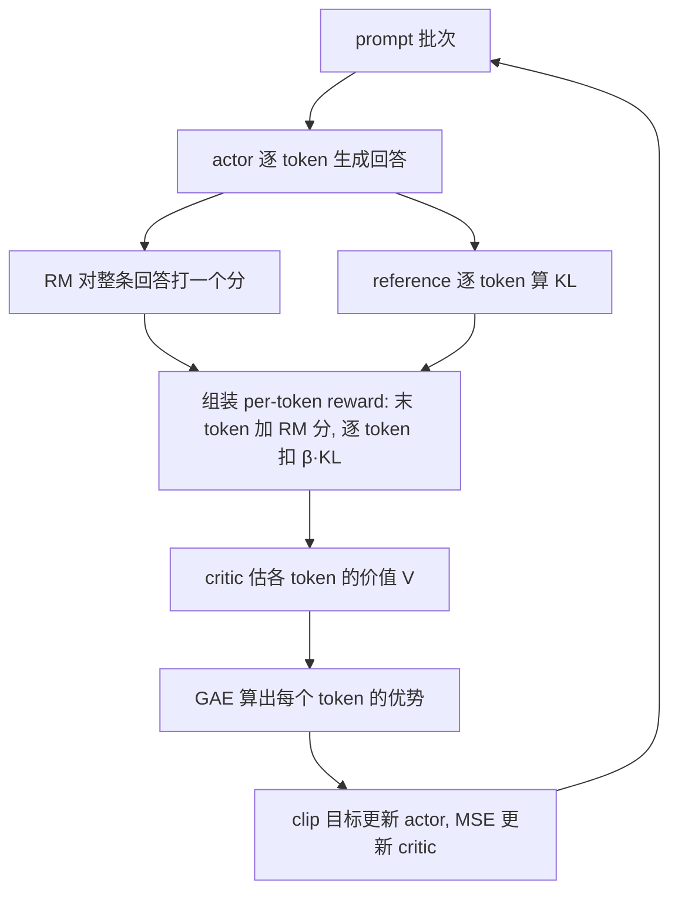

# PPO(Proximal Policy Optimization)

一句话:**TRPO 信任域思想的一阶平价近似**——靠 clip 概率比这一个廉价操作实现"每次更新步子别迈太大",从 InstructGPT 到 ChatGPT 一路沿用,是 RLHF 的老牌主力算法(免 critic 的后继者详见 GRPO 篇)。

## 一、动机:一步崩坏与太贵的信任域

### vanilla policy gradient 的两大痛点

朴素策略梯度(policy gradient)$\nabla_\theta J = \mathbb{E}\left[\nabla_\theta \log \pi_\theta(a_t \mid s_t)\, A_t\right]$ 的更新逻辑是"好动作加概率、坏动作减概率",问题有二:

- **方差大**:梯度靠采样少量轨迹估计,奖励噪声随轨迹长度累积——像抽三五个人估全国平均收入,结果抖动剧烈,只能用小学习率慢慢磨;
- **步长敏感、一步崩坏**:on-policy(在线策略)训练的数据由当前策略自己生成。监督学习里教材是固定的,走错一步下次还能被拉回来;RL 里等于"教材是自己写的"——一次过大的坏更新把策略推下悬崖后,之后采出的数据也全是垃圾,再也爬不回来。

### TRPO:对症,但太贵

TRPO 的解法:限制每次更新前后策略的 KL 散度不超过阈值,只在"信任域"(trust region)内挪动——像在悬崖边行走,规定每步只许落在以脚下为圆心的安全圈内。代价是要解一个带 KL 约束的优化问题:Fisher 信息矩阵、共轭梯度、线搜索,一整套二阶机器,实现复杂、算得慢,还与 dropout、参数共享等常用结构不兼容。

### PPO:一阶方法拿到八成效果

PPO 的洞察:不必精确求解约束优化,直接改造目标函数,让"迈得太远"的那部分更新**自动失去梯度**即可。只需一阶梯度、Adam 直训、几行代码就能实现,效果与 TRPO 相当——所以叫"平价近似"。

## 二、核心机制:clip 目标 + GAE

### 1. 重要性采样比:旧数据的汇率

$$
\rho_t(\theta) = \frac{\pi_\theta(a_t \mid s_t)}{\pi_{\theta_{old}}(a_t \mid s_t)}
$$

一批数据由旧策略 $\pi_{\theta_{old}}$ 采集,却要拿来更新走远了的新策略 $\pi_\theta$(同一批数据会复用训多个 epoch,见第四节),就得乘上这个折算系数——重要性采样(importance sampling),好比拿旧账本记的外币账,要按当前汇率换算成新币种才作数。$\rho_t = 1$ 表示新旧策略对该动作看法一致;偏离 1 越远,策略在这一步改得越多,旧数据也就越"不作数"。

### 2. clip 代理目标:方向盘限位器

$$
L^{CLIP}(\theta) = \mathbb{E}_t\left[ \min\left( \rho_t(\theta)\, \hat{A}_t,\ \mathrm{clip}\left(\rho_t(\theta),\ 1-\varepsilon,\ 1+\varepsilon\right) \hat{A}_t \right) \right]
$$

$\varepsilon$ 通常取 0.2。两个部件各司其职:

- **clip**:把 $\rho_t$ 卡进 $[1-\varepsilon,\ 1+\varepsilon]$,像给方向盘装限位器——优势为正、想加大该动作概率?加到旧概率的 $1+\varepsilon$ 倍就到顶,再往上没有额外收益,梯度自动归零;
- **min**:取"未裁剪"与"裁剪"两版的较小值,构成原目标的**悲观下界**,让 clip 只单侧生效:朝"变好"的方向限制幅度(防冒进),朝"变坏"的方向不设限(纠错不封顶)——只挡激进,不挡回头。

与 TRPO 是同一思想的两种实现:TRPO 用 KL 约束显式画圈,PPO 让出圈的更新拿不到梯度,殊途同归,后者便宜一个数量级。另注:PPO 论文其实给了两个版本——clip 版与自适应 KL 惩罚版(PPO-penalty),实践中 clip 版更稳、更简单,成了事实标准。

### 3. GAE:优势估计的偏差-方差旋钮

优势 $\hat{A}_t$ 回答"这个动作比该状态下的平均水平好多少"。先请一位"心里有预期的教练"——critic(价值网络)$V(s)$,定义一步 TD 残差,即"惊喜差":实际这步的所得(即时奖励 + 下一状态的预期)比教练原本的预期好多少:

$$
\delta_t = r_t + \gamma V(s_{t+1}) - V(s_t)
$$

GAE(Generalized Advantage Estimation)把未来各步惊喜差按指数权重叠加:

$$
\hat{A}_t = \sum_{l=0}^{\infty} (\gamma\lambda)^l\, \delta_{t+l}
$$

$\lambda$ 是偏差-方差的旋钮:

- $\lambda = 0$:只信教练的一步预估——低方差,但教练估不准就有偏(高偏差);
- $\lambda = 1$:退化为蒙特卡洛回报减基线 $V(s_t)$——无偏,但把一路噪声全收进来(高方差);
- 实践常取 0.9–0.98,相当于"天气预报和实况各听一半"的折中;LLM 场景 $\gamma$ 常直接取 1(序列不长,无需时间折扣)。

### 4. 三项合成总 loss

写成最小化形式:

$$
L = \mathbb{E}_t\left[ -L^{CLIP}_t + c_1 \left(V_\theta(s_t) - V^{targ}_t\right)^2 - c_2\, \mathcal{H}\left[\pi_\theta\right](s_t) \right]
$$

- **value loss**(系数 $c_1 \approx 0.5$):critic 对回报目标的 MSE 回归,常配 value clip——限制新估值偏离旧估值的幅度,与策略 clip 同理;
- **entropy bonus**(系数 $c_2 \approx 0.01$):给策略的随机性"发奖金",防止过早收敛成确定性策略——鼓励学生别太早偏科,保住探索。

## 三、RLHF 工程形态:四个模型同台

先把语言模型套进 RL 的框架:**状态 = prompt + 已生成的前缀,动作 = 从词表挑出下一个 token,一条完整回答 = 一条轨迹**。然后是著名的"四人剧组",训练时需同时驻留显存:

| 模型 | 干什么 | 训练? | 类比 |
| --- | --- | --- | --- |
| actor(policy) | 逐 token 生成回答 | 训练 | 台上答题的学生 |
| critic(value model) | 估每个 token 处的预期总回报 | 训练 | 场边随时预估得分的教练 |
| reward model(RM) | 给完整回答打一个标量分 | 冻结 | 只看最终卷面的评委 |
| reference(SFT 模型) | 提供 KL 锚点 | 冻结 | 开训之前的"原来的自己" |

两个 LLM 特有的设计:

- **reward 极度稀疏**:评委不给过程分——RM 只对完整序列打一个分,记在最后一个 token 上,中间 token 的原生 reward 为零;
- **per-token KL 惩罚折进 reward**:为防 actor 一味讨好 RM 说胡话(reward hacking),每个 token 都按偏离 reference 的程度扣分——风筝可以飞高,但线不能断:

$$
r_t = r_{RM}(x, y)\cdot \mathbf{1}[t = T] - \beta\, \mathrm{KL}_t
$$

其中 $\mathrm{KL}_t = \log \frac{\pi_\theta(a_t \mid s_t)}{\pi_{ref}(a_t \mid s_t)}$,$T$ 为末 token 位置。注意:PPO 把 KL 折进 reward、经由 GAE 摊到每个 token 的优势里;GRPO 则把 KL 作为独立项直接加在 loss 上——这是两者的经典差异之一(详见 GRPO 篇)。

一轮迭代的数据流:

## 四、训练细节与常见坑

- **advantage 白化**:每个 batch 内把优势减均值、除标准差——把绝对分换算成"全班排名"再讲评,稳住不同 batch 之间的梯度尺度;
- **reward / value clip**:RM 分数裁剪到固定区间防离群值把梯度打飞;value clip 限制 critic 的单步更新幅度;
- **KL 系数自适应**:$\beta$ 固定时难调——太小防不住漂移,太大学不动;可按实测 KL 高于/低于目标值动态增减(早期 RLHF 工作的 adaptive KL controller),像恒温器根据室温调功率;
- **critic warmup**:开训先冻结 actor、只训 critic 若干步——教练还不会估分,比赛没法打:初期 critic 输出全是噪声,GAE 会把 actor 带偏;
- **mini-epoch 与 early stop**:同一批 rollout 复用训练多个 epoch(这正是需要 $\rho_t$ 的原因);但 approx-KL 一旦超过阈值(如 0.02)立即停掉本批剩余更新,像超速就自动断油,防 ratio 跑飞;
- **四模型显存压力**:actor 与 critic 是训练态(参数 + 梯度 + 优化器状态三份开销),RM 与 reference 是推理态——这是 PPO 在 LLM 场景最大的工程痛点,直接催生了免 critic 的 GRPO(详见 GRPO 篇)。

## 五、与 GRPO / DPO 一行对照

| 维度 | PPO | GRPO | DPO |
| --- | --- | --- | --- |
| 优势/信号来源 | critic + GAE(token 级) | 组内得分标准化(response 级) | 偏好对的隐式 reward(无显式 RL) |
| 额外模型 | critic + RM + reference | RM/verifier + reference(免 critic) | 仅 reference |
| 成本 | 最重:四模型在线训练 | 中:三模型 + 每题多倍采样 | 最轻:离线训练,流程近似 SFT |

## 六、面试考点串联

高频问法(与题库联动的切片点):

1. vanilla PG 为什么一步就能崩、监督学习为什么不会 →「动机」
2. 默写 clip 目标;min 和 clip 各起什么作用、为什么是悲观下界 →「核心机制 2」
3. $\rho_t$ 为什么会偏离 1(一批数据训多个 mini-epoch)→「核心机制 1 + 细节与坑」
4. GAE 公式;$\lambda = 0/1$ 各退化成什么 →「核心机制 3」
5. RLHF-PPO 四个模型各干什么、哪两个冻结 →「工程形态」
6. KL 惩罚为什么折进 reward、与 GRPO 放 loss 里的差异 →「工程形态 + GRPO 篇」
7. 训练发散怎么排查:approx-KL、熵、value loss 曲线各看什么 →「细节与坑」
8. 为什么后来大家转向 GRPO(显存 + critic 难训)→「细节与坑 + 对照表」

## 相关文献

- PPO(clip 目标提出)— [arXiv:1707.06347](https://arxiv.org/abs/1707.06347)
- TRPO(信任域策略优化)— [arXiv:1502.05477](https://arxiv.org/abs/1502.05477)
- GAE(广义优势估计)— [arXiv:1506.02438](https://arxiv.org/abs/1506.02438)
- InstructGPT(确立 RLHF 三阶段范式)— [arXiv:2203.02155](https://arxiv.org/abs/2203.02155)
- Learning to summarize from human feedback(RLHF-PPO 早期实践)— [arXiv:2009.01325](https://arxiv.org/abs/2009.01325)
