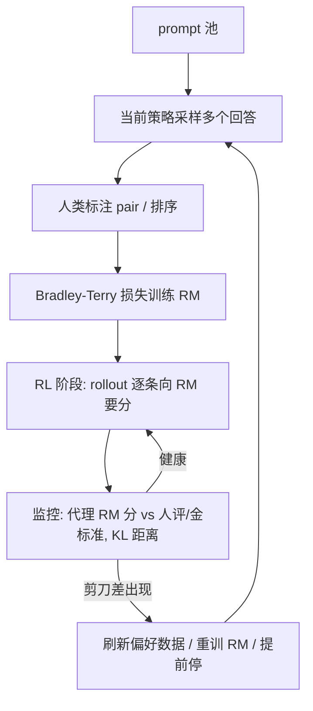

# RLHF 与 Reward Model

一句话:**RLHF 的灵魂不是 RL 算法,而是那个替人类打分的 reward model(RM)**——PPO/GRPO 只是"怎么爬山"的工具,RM 才是"山"本身:它准,一切才好;它被钻空子,优化越猛越白搭。本篇聚焦 RM 与偏好数据,RL 算法细节见 PPO 篇、GRPO 篇。

## 一、为什么需要 RM:把人类偏好"蒸"成一个代理评委

想让模型输出对齐人类偏好("有帮助、诚实、无害"),两条直路都走不通:

- **写规则**:什么算"详细但不啰嗦""自信但不武断"?偏好是隐性知识,像"什么菜好吃"——尝一口就知道,但写不成一张评分细则;规则列不全,列全了还互相打架;
- **人逐条评**:RL 训练要对海量 rollout 实时打分,每条都请人看,贵到不可行、慢到进不了训练循环。

RLHF 的折中:人类只标注**有限的对比数据**,把偏好"蒸馏"进一个模型,之后由它 7×24 小时代替人类当评委。这就是 reward model:输入 (prompt, 回答),输出一个标量分。InstructGPT 据此确立三阶段范式:SFT → 训 RM → RL 对着 RM 的分优化策略(全景见 后训练总览 篇)。

RM 的用途也不止 RL:best-of-n 采样挑答案、SFT 数据筛选、自动评测,都靠同一个评委。

## 二、偏好数据:评委的教材

### 采集形态

对同一个 prompt 用当前模型采样多个回答(InstructGPT 每题采 4–9 个),让标注员做**相对比较**:两两挑出更好的(pairwise)或整体排序(ranking)。关键设计是**只比相对好坏、不打绝对分**——人对"这条回答值几分"极不稳定,但"A 和 B 哪个好"一致得多,如同品酒:打 87 还是 89 分是玄学,"这两杯哪杯好"人人能答。

### 标注质量的三个难点

- **标注者一致性低**:标注员两两之间的同意率通常只有七成上下(InstructGPT 报 72.6%),意味着相当一部分样本连"标准答案"都有分歧,RM 的精度天花板从数据侧就被压住;
- **伪偏好混入**:标注员系统性偏爱更长、格式更漂亮、口吻更自信的回答——这些表面特征与真实质量相关但不等价,RM 会照单全收,为长度膨胀与马屁精埋下种子;
- **指南漂移**:标注指南中途修订、批次之间标注员理解不一,数据分布悄悄变化,前后期偏好互相矛盾。

### 规模量级

介于"几千到几万条 SFT 数据"与"万亿 token 预训练"之间:InstructGPT 的 RM 训练集约 3.3 万个 prompt(每个展开成多对比较);Learning to Summarize 收集约 6.5 万对摘要比较;开源社区为省人力常用 AI 反馈替代人标(如 UltraFeedback 用 GPT-4 标注几十万条)——这本质上已是 LLM-as-judge(见第五节)。

## 三、RM 训练:给 SFT 模型换一个打分头

### 初始化与结构

拿 **SFT 模型**(或同源底座)做初始化,把末端的 unembedding 层换成输出标量的线性头(value head),整条 (prompt, 回答) 过一遍模型,取末 token 位置的隐状态映射成一个分数。

为什么从 SFT 初始化?**评委得先看得懂比赛**:判断回答好坏所需的语言理解,与生成回答是同一种能力,从头训一个打分器等于请没看过球的人当裁判;同源初始化还让 RM 与被评的 policy 分布对齐,不在陌生文本上瞎打分。

RM 要多大?InstructGPT 用 6B RM 评 175B policy——评委不必与学生同尺寸;但 Gao et al. 表明 RM 越大越抗 hack(见第四节),后来的实践多舍得用与 policy 同量级的 RM。

### Bradley-Terry 损失

训练目标:让人类选中的回答 $y_w$(win)得分高于落选的 $y_l$(lose):

$$
\mathcal{L} = -\mathbb{E}_{(x, y_w, y_l)}\left[\log \sigma\left(r_\phi(x, y_w) - r_\phi(x, y_l)\right)\right]
$$

这是 Bradley-Terry 模型——棋类 Elo 等级分的统计学近亲:把"A 胜过 B 的概率"建模成两者分差过 sigmoid。两个要点:

- **只学相对分,绝对数值无意义**:损失只依赖分差,全体分数加任意常数损失不变。RM 分像 Elo 分,只在同 prompt 内比较才有意义,拿去跨 prompt 比较或当"绝对质量"读数都是误用。这与 GRPO 的组内标准化天然契合——GRPO 恰好只消费同 prompt 组内的相对名次(见 GRPO 篇);DPO 则把同一个 BT 模型直接解析进策略、免去显式 RM(见 DPO 篇);
- **成对只是训练形态**:部署后单条回答一次前向就出一个分,不需要成对输入。

### 训练细节与常见坑

- **只训 1 个 epoch**:同一条回答会出现在多个 pair 里,多 epoch 极易过拟合(InstructGPT 实测超过 1 epoch 就开始过拟合);
- **同 prompt 的 K 个回答拆成 $\binom{K}{2}$ 个 pair,放进同一个 batch**:每条回答只前向一次、复用给所有 pair,省算力,也避免同一回答在一个 epoch 内被多次梯度更新而过拟合;
- **margin 变体**(Llama 2 做法):标注时顺带标"好多少"(显著更好/更好/略好),损失改为 $-\log \sigma(r_w - r_l - m)$,偏好越明确 margin 越大,强行拉开分差;
- **输出归一化**:训完把 RM 分平移到参考分布上均值为 0,方便 RL 阶段配 KL 系数与 reward clip(见 PPO 篇);
- **怎么评估 RM**:held-out 偏好对上的 pairwise 准确率,65–75% 是常态——别指望 90%+,上限被标注一致性(见第二节)锁死。

## 四、reward hacking 与过优化:评委被钻空子

### Goodhart 定律

"一项指标一旦成为优化目标,它就不再是好指标。"RM 只是真实人类偏好的**有损代理**,而 RL 的优化压力会精准找到代理与真实目标之间的每一条缝——像应试刷题:分数(代理)一路涨,学问(真实目标)未必涨,题海战术越猛偏得越远。

### 经典 hack 形态

- **长度膨胀**:标注数据里"长 ≈ 认真",策略学会注水,越写越长、废话连篇;
- **马屁精(sycophancy)**:顺着用户的观点说、无脑赞同,而不是给出正确答案;
- **格式套路**:列表、加粗、表情、"首先/其次/总之"八股件件不落,内容空洞;
- **自信口吻**:斩钉截铁的错误答案,得分高过谨慎克制的正确答案。

### Gao et al. 的过优化定律

Scaling Laws for Reward Model Overoptimization 用合成实验(一个大"金标准 RM"扮演真实偏好,给代理 RM 造标注)刻画出剪刀差:以策略偏离初始策略的距离 $d=\sqrt{D_{\mathrm{KL}}(\pi\,\|\,\pi_{\mathrm{init}})}$ 为 x 轴,**代理 RM 分单调上涨,金标准分先涨后跌**,RL 场景下金标准分近似 $d(\alpha - \beta \log d)$ 的倒 U 形。两条规律:代理 RM 越大、偏好数据越多,拐点来得越晚;策略模型越大,从优化中拿到的真实增益越小(过优化幅度相近)。实践铁律:**RL 不能训到收敛**,要在金标准掉头前停。

> 🖼️ 占位:过优化剪刀差示意图——x 轴为 KL 距离,代理 RM 分持续上升、金标准分先升后降的分叉曲线

### 缓解手段

- **KL 锚**:惩罚策略偏离 reference,风筝可以飞但线不能断(折进 reward 还是独立 loss 项,见 PPO 篇与 GRPO 篇);
- **RM 集成**:多个 RM 取 min 或均值,合议庭制——钻空子得同时骗过所有评委;
- **定期刷新偏好数据**:拿当前策略的新 rollout 重新送标、迭代重训 RM(InstructGPT、Llama 2 都做多轮),让评委见识过学生的最新套路;
- **针对性去偏**:已知偏置显式处理,如对 RM 分做长度去相关、训练数据里平衡长短与格式;
- **评测盯真实指标**:训练面板上的 RM 分只是代理,定期用人评抽检 / held-out 评委 / 下游真实任务给 checkpoint 体检。

## 五、RM 的谱系:ORM、PRM 与 verifier

按打分对象与信号来源,评委分三类:

| 类型 | 打分对象 | 信号来源 | 取舍 |
| --- | --- | --- | --- |
| ORM(outcome RM) | 整条回答一个分 | 人类偏好对 / 结果对错 | 通用、标注便宜;信号稀疏、可被 hack |
| PRM(process RM) | 每个推理步骤一个分 | 人标步骤 / MC 自动估计 | 信号密、能定位错步;标注贵 |
| rule-based verifier | 可机判的结果 | 规则:答案匹配 / 单元测试 | 不可 hack;只覆盖可验证域 |

- **PRM(过程奖励模型)**:Let's Verify Step by Step 请人给数学解答的**每一步**标 对/错/存疑(PRM800K 数据集),PRM 逐步打分,能揪出"过程错但答案蒙对"的解;MATH 上做 best-of-N 挑答案,PRM 显著优于 ORM(约 78% vs 72%)。人标过程分极贵,后续工作(如 Math-Shepherd)用 MC 估计自动化:从某一步出发采多条后续,按最终答对率给这一步打分;
- **rule-based verifier**:数学答案精确匹配、代码跑单元测试——机器阅卷,相当于**不可 hack 的 RM 替身**,Goodhart 缝隙趋近于零。这是 RLVR(可验证奖励 RL)路线的根基,也是 GRPO 在数学/代码上大放异彩的前提(见 GRPO 篇、后训练总览篇);
- **LLM-as-judge 当 RM**:让强 LLM 按评分细则生成打分,免训练、换标准只需改 prompt;但自带位置/长度/自我偏好等偏置,被当 reward 持续优化时同样会被钻空子,需搭配 verifier 或人评抽检。

## 六、全流程闭环

## 七、面试考点串联

高频问法(与题库联动的切片点):

1. 默写 Bradley-Terry 损失;为什么只学相对分、绝对数值为何无意义 →「三」
2. RM 为什么从 SFT 模型初始化、结构上改了什么 →「三」
3. RM 为什么只训 1 epoch、同 prompt 的 K 个回答怎么组 batch →「三、训练细节」
4. 偏好数据为什么标相对比较而非打绝对分 →「二」
5. 讲几个 reward hacking 案例,各怎么缓解 →「四」
6. 过优化曲线长什么样、x 轴为什么用 KL 距离 →「四、Gao et al.」
7. ORM / PRM / verifier 三者的取舍与适用场景 →「五」
8. RM 只给相对分,为何与 GRPO 组内标准化天然契合 →「三」+ GRPO 篇

## 相关文献

- InstructGPT(确立 RLHF 三阶段与 RM 配方)— [arXiv:2203.02155](https://arxiv.org/abs/2203.02155)
- Learning to summarize from human feedback(RM 配方起点)— [arXiv:2009.01325](https://arxiv.org/abs/2009.01325)
- Scaling Laws for Reward Model Overoptimization(过优化定律)— [arXiv:2210.10760](https://arxiv.org/abs/2210.10760)
- Let's Verify Step by Step(PRM 与 PRM800K)— [arXiv:2305.20050](https://arxiv.org/abs/2305.20050)
