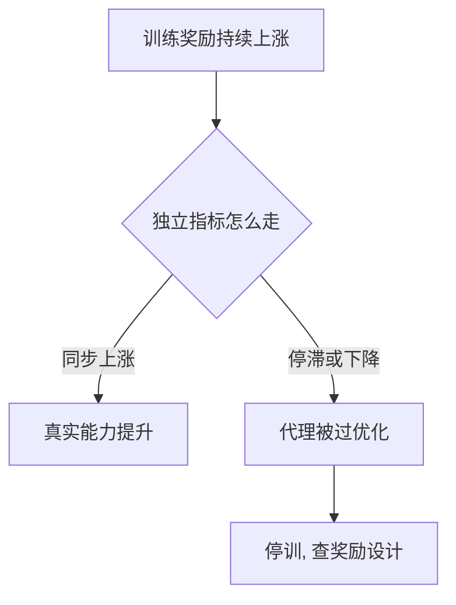

# RLHF 与 Reward Model

一句话:RLHF 就是**把"人类觉得哪个回答更好"训练成一个能 7×24 小时打分的模型(reward model,RM),再让策略去追这个分**。本篇只讲这条链路的**奖励侧**——评委怎么训出来、奖励怎么设计、评委怎么被钻空子、追分追过头要付什么代价;至于"怎么爬山",裁剪目标见 PPO 篇、组内相对优势见 GRPO 篇、免评委的离线做法见 DPO 篇。

## 一、后训练全景:三个阶段,三种反馈

预训练完的基座只会一件事:文字接龙。要它办事,后训练得补三样它没有的东西。

| 阶段 | 教它什么 | 数据长什么样 | 训谁 | 产物 |
|---|---|---|---|---|
| SFT | "别接龙,要答题" | prompt + 人写的示范回答 | 策略本身,对回答 token 做交叉熵 | 初始策略 |
| RM | "同一题,两个回答谁更好" | 同 prompt 的优选 / 劣选回答 | 语言模型换一个标量输出头 | 一个代理评委 |
| RL | "照评委的分改进自己" | prompt + 策略**当场现采**的回答 | 策略;RM 冻结不动 | 对齐后的策略 |

这是 InstructGPT 确立的典型路线,不是所有系统的必经工序;现在更常见的是 SFT → DPO → 可验证奖励 RL 的混搭。SFT 的模板、loss mask 与数据配比见 SFT 篇。

### 为什么不能只多训几轮 SFT

最高频的一道开场题。**因为两者拿到的监督信号根本不是一回事。** SFT 优化的是"复现这条参考回答的似然",再训十轮也只是把同一份范文背得更熟,**不会凭空长出"A 比 B 好"这条信息**——范文里压根没有 B,更没有"B 差在哪";偏好数据引入的是**比较**:同一道题下两个都通顺的回答,人挑了一个,这条信号能表达安全、事实性、语气这些"写不进范文、但一比就知道"的维度。要澄清一个流传很广的说法:"SFT 的天花板是标注者水平"**不是定理**,反过来"RL 一定能超过标注者"也不是。真正成立的只有一句朴素的话——两种信号不同,能不能超过取决于评委分不分得出来。

### 语言模型怎么套进 RL,以及为什么只剩策略梯度

**state** = prompt + 已生成的前缀,**action** = 从词表挑下一个 token,**trajectory** = 一条完整回答。三个特点决定了算法选择:动作空间是**十万量级的离散集合**,轨迹长达几千步,奖励常常只在最后一个 token 上给一次。

| 算法族 | 原本擅长 | 放到 LLM 上卡在哪 |
|---|---|---|
| DQN 等 value-based | 小型离散动作;replay 打散样本相关性并复用数据,target network 冻住一份旧权重当 bootstrap 目标、防自举发散 | 要给每个前缀估十万个 token 的 Q 值;长轨迹 + 终局奖励让 bootstrap 误差仍层层累积 |
| DDPG / TD3 | 连续控制,确定性策略 + 噪声探索 | 动作根本不是连续向量 |
| SAC | 连续控制,随机策略靠熵探索,样本效率高 | 把它稳定扩到超大离散动作空间仍是公开难点 |
| A2C / PPO 等策略梯度 | 直接输出并更新动作分布 | **策略分布就是语言模型本身**,采样即 rollout,天然对得上 |

一句话总结:**预训练模型已经是一台训好的动作分布发生器**,策略梯度可以直接用它,而 value-based 路线得从零再建一个规模相当的 Q 网络。这就是"为什么 RLHF 用 PPO 不用 DQN"的标准答法。顺带把 RL 与监督学习的差别说死:监督学习的标签外部给定、分布固定;RL 的"标签"是**行动之后才知道的回报**,而且**数据分布随策略一起漂移**——今天采出来的回答,下周的策略不会再生成。这条"分布自己会动"是本篇后面所有奖励失效问题的总根源。

两个常被追问的边角:**部分可观测**在 LLM 里对应多轮对话与工具环境——state 必须装下做当前决策所需的历史和工具返回,装不下就要靠记忆或摘要补(多轮轨迹与信用分配见 AgenticRL 篇);**真实交互极贵**时才轮得到 Model-based 规划先学环境模型,但模型在关键区域不准时,规划会系统性地去利用模型漏洞——那和后面讲的 reward hacking 是同一种病,此时宁可用保守的 model-free 或离线方法。

## 二、Reward Model:把人类偏好蒸成一个评委

### 为什么是"比较"而不是"打分"

让人直接给回答打绝对分不可行:同一条回答今天打 7 分明天打 8 分,不同标注员之间尺度更是各说各话。但"A 和 B 哪个好"人人能答,像品酒——说这杯值 87 还是 89 分是玄学,说"这两杯哪杯好"却相当一致。即便如此,一致性也就到这个量级:InstructGPT 报告训练标注员**两两同意率 72.6 ± 1.5%**(留出标注员 77.3 ± 1.3%)。也就是说近三成样本连"标准答案"本身都有分歧,**RM 的精度天花板从数据侧就被压住了**——这也解释了为什么 RM 准确率做不到 95% 以上并不奇怪。采集时的三条硬规矩直接对着已知偏置来:候选**盲化来源**(别让人看出哪条是自家新模型)、**随机交换 A/B 次序**(对冲位置偏好)、**按 prompt 分组切留出集**(同一问题的多个回答绝不能分散到训练集和验证集两侧,否则泄漏)。

### 训练目标:Bradley-Terry

目标是让人选中的 $y_w$ 得分高于落选的 $y_l$:

$$
\mathcal{L} = -\mathbb{E}_{(x,\,y_w,\,y_l)}\Big[\log \sigma\big(r_\phi(x, y_w) - r_\phi(x, y_l)\big)\Big]
$$

这句公式在说:把"$y_w$ 胜过 $y_l$ 的概率"建模成两者**分差**过一个 sigmoid,再最大化它的对数似然。它是棋类 Elo 等级分的统计学近亲。两个必须记住的推论:

- **只有相对分有意义,绝对值没有**。损失只依赖分差,给全体分数加任意常数损失不变。所以 RM 分像 Elo 分——跨 prompt 比大小、当"绝对质量读数"用都是误用。这正是 GRPO 用组内标准化的天然理由(见 GRPO 篇),也是 DPO 能把同一个 BT 模型解析进策略、免掉显式 RM 的起点(见 DPO 篇)。
- **成对只是训练形态**。部署后单条回答一次前向就出一个分,不需要成对输入。
- **margin 变体**(Llama 2):标注时顺带记录"好多少"(四档),损失改成 $-\log\sigma(r_w - r_l - m(r))$,偏好越明确 margin 越大,强行把分差拉开。注意 Llama 3 又把这一项去掉了——数据量上去之后收益递减,**这类技巧是数据规模的函数,不是普适定理**。

### 结构、初始化与训练细节

拿 **SFT 模型或同源底座**初始化,把末端的 unembedding 层换成一个输出标量的线性头,整条 (prompt, 回答) 过一遍,取末 token 位置的隐状态映射成一个分。为什么必须从语言模型初始化?**评委得先看得懂比赛**——判断回答好坏和生成回答是同一种语言理解能力,从头训个打分器等于请没看过球的人当裁判;同源初始化还让 RM 与被评策略的分布对齐,不至于在陌生文本上乱打分。

RM 要多大?InstructGPT 用 **6B RM 去评 175B 策略**,并明确说 175B 的 RM 训练不稳、不适合当 RL 的价值来源——**评委不必和学生同尺寸**;但过优化实验表明 RM 越大越抗钻空子(见第三节),所以后来的实践更舍得给 RM 上尺寸。数据量级参考:InstructGPT 的 RM 训练集约 **3.3 万个 prompt**,夹在"几千到几万条 SFT 示范"和"万亿 token 预训练"之间。

- **同 prompt 的 $K$ 个回答拆成 $\binom{K}{2}$ 对,整组放进同一个 batch 元素**。InstructGPT 让标注员一次排 $K=4\!\sim\!9$ 个回答;这么做有两个理由:每条回答只前向一次就能复用给所有对,省算力;更关键的是,**打散混进数据集会让同一条回答在一个 epoch 内被更新几十次,直接过拟合**。
- **训练轮数与输出归一化**:InstructGPT 只训 1 个 epoch(它的配方,不是普适上限,应按留出集准确率和下游生成质量选停止点);训完把分数平移到参考分布上均值为 0(用标注员示范的均分做基准),RL 阶段配 KL 系数、设 reward clip 才有可比量纲。
- **怎么评估 RM**:用留出偏好对的成对准确率,并按任务、长度、标注一致性**分桶**看。没有通用及格线;真正的验收是"被这个 RM 优化过的策略,在人评和真实任务上有没有进步"。
- **"RM 训练不稳"要拆成三种故障**:loss 震荡多半是学习率、批间奖励尺度或数值问题;训练 loss 降而留出准确率降是过拟合;**RM 离线准确、策略却越训越差**——那不是 RM 训练问题,是分布偏移与钻空子(第三节)。

### RM 与 Critic:一个定终点,一个估路程

本篇最高频的一道题:**既然 RM 已经会打分,PPO 为什么还要再训一个 Critic?**

| 角色 | 学的是什么 | 输入 → 输出 | 什么时候更新 |
|---|---|---|---|
| Reward Model | 人类(或 AI)的**相对偏好** | prompt + 完整回答 → 一个偏好分 | 先用偏好对训好,RL 阶段通常冻结 |
| Critic(value model) | **当前策略**下的期望未来回报 $V(s_t)$ | prompt + 已生成前缀 → 每个位置一个值 | 跟着最新 rollout 持续做价值回归 |
| Actor(policy) | 哪个 token 该更可能被采出 | 前缀 → token 分布 | 用优势加权的策略梯度目标更新 |

差别不在"都输出标量",而在**回答的问题不同**:RM 回答"这**整段**回答有多符合偏好",Critic 回答"走到这个**前缀**,后面还能拿多少分"。所以**RM 分不能直接当每个前缀的 $V(s_t)$**——它压根没在前缀上训练过,也不随策略更新,拿它当基线优势的尺度和符号都会错。

信号是这样串起来的:RM 在末 token 给一个序列级分,再叠上逐 token 的 reference KL 惩罚,组成训练奖励;Critic 用这些奖励拟合回报(MSE 或 Huber 回归),TD 残差经 GAE 变成优势;Actor 拿优势做策略梯度更新。**梯度不会穿过离散 token 采样从 RM 反传回 Actor**——所以奖励不必可微,规则、单元测试、黑盒程序都能当奖励。GAE 与裁剪细节见 PPO 篇。三个常见追问:

- **不要 Critic 行不行?** 行。把终局 RM 分直接乘 $\nabla\log\pi$ 就是 REINFORCE,数学上没问题;代价是同一个终局分要摊给整条几千 token 的序列,**方差大、信用分配粗**。Critic 提供随状态变化的基线,GAE 再给一个偏差-方差旋钮,所以 PPO 更新更可控。DPO 不需要 Critic 是因为它压根不在线采样(见 DPO 篇);GRPO 用同组回答的相对分当基线顶掉 Critic(见 GRPO 篇)。
- **能共享参数吗?** Actor 与 Critic 可以共享主干各接一个头,省参数和前向,代价是策略目标与价值回归抢同一份表征。RM 与 Critic 技术上也能共底座、或用 RM 的 checkpoint 初始化 Critic——但那只是**初始化选择**,value head 仍须按当前策略回报重训。要共享就必须分头、隔离两个目标的梯度、分别验收,不能理解成"一个分数同时干两件事"。
- **Critic 失准怎么看?** 优势的符号或尺度会错。联合看 value loss、explained variance、回报方差、KL 与 clip fraction,再读实际生成。排查顺序是先查 terminal/padding mask、奖励尺度和 bootstrap(这几项错了调参没用),再动 value 学习率、GAE 的 $\lambda$、value clipping 和更新轮数。**Actor/Critic 更新比没有通用值。**

### LM Judge:能拿来评测,不等于能拿来当 RM

用强模型按 rubric 打分很香:免训练、换标准只改 prompt。MT-Bench 报告 GPT-4 判官与人类偏好的一致率**超过 80%**,和人与人之间的一致率同级。但换一个新 judge 上线前四件事必做:**在有人标的校准集上测一致率并读错例分布**(整体八成一致、难例上全错的 judge 不能用)、**逐项测四类已知偏差**(位置——交换 A/B 看结论翻不翻;长度——长答案是否系统性高分;自我偏好——是否偏爱同源模型输出;格式——分点和加粗是否加分)、**冻结并记录版本**(模型版本、提示词、温度、rubric 任何一项变了历史分数就不可比)、**准一批已知好坏的锚点做回归测试**。

那为什么不直接当 RM?核心差别是**它有没有被主动优化**。评测是**被动**的:样本分布固定,judge 只要平均无偏,个别打偏会被平均掉;当 RM 就成了**被主动搜索的目标**——评测里"偏爱长答案"只是几个百分点的噪声,当奖励用会被放大成"越写越长"的 reward hacking。其次,RM 必须在**策略当前的分布上**准,而 judge 通常只在人类回答或基线模型输出上校准过,策略一漂移就进了没校准的区域。最后是成本:judge 只在评测时调用,RM 每步 rollout 都要调。也不是完全不能用,RLAIF 走的就是这条路(注意:换成 AI 反馈**没有自动消除评委偏差**,只是把人的偏差换成模型的偏差)。可行做法是:任务要有明确 rubric、把 judge 蒸馏成小模型压成本(见 蒸馏 篇)、用当前策略的新样本**周期性重训**、再配 KL 约束和可验证的终局锚点。前提是接受它会随训练退化,更新是常设动作而不是一次性配置。

## 三、奖励设计与 Reward Hacking

### 训练奖励 ≠ RM 分

面试里最容易露怯的一处:**RM 只是完整 reward function 的一个分量**。真实训练奖励通常长这样:

$$
R(x, y) = \sum_i w_i\,\widetilde{r}_i(x, y) \;-\; \beta\,\mathrm{KL}\big(\pi_\theta \,\|\, \pi_{\mathrm{ref}}\big)
$$

意思是:把有用性、事实性、安全性、格式、可验证结果等分量各自**校准到可比尺度**后加权求和,再减去偏离参考策略的惩罚。权重 $w_i$ 是待验证的超参数,不是查表能查到的常数;KL 项的方向、估计器与放置位置(折进 reward 还是当独立 loss 项)见 KL散度 篇。任务连"什么算成功"都说不清时,顺序是:先写评分细则,再照细则收集成对偏好并复核分歧,把其中**能机器验的子目标拆给规则**,剩下的才交给评委——这样奖励既可学又可审计。

| 信号 | 适合什么 | 主要风险 |
|---|---|---|
| 成对偏好 RM | 写不成规则的总体质量 | 长度、风格、标注群体与分布偏差 |
| 规则 / 程序验证器 | 代码单测、格式、有唯一答案的题 | 测试覆盖不足、规则有漏洞、答案泄漏 |
| ORM(结果奖励) | 整条回答好不好 | 信号稀疏,定位不到哪一步错 |
| PRM(过程奖励) | 推理每一步靠不靠谱 | 需要可信步骤标注或验证,成本高 |

**但不是所有目标都该进这个加权和。** 线性加权只适合可以互相交换的软目标;合规、资金操作这类**不可违反**的条件必须做门控或约束——先拦截,再在可行答案里优化软目标,因为线性加权下一个足够大的有用性分**可以把安全违规抵消掉**。反方向也有坑:简单地给所有拒答加分,模型会学成"什么都拒绝"。所以安全侧的正确形态是**约束**(违反即否决),不是**奖励**(拒绝就加分)。Llama 2 干脆训了 Helpfulness 和 Safety **两个独立 RM** 再在 RL 阶段组合——这两个目标会互相拉扯,一个模型很难同时学好。

### Goodhart 与过优化定律:所以 RL 不能训到收敛

> "一项指标一旦成为优化目标,它就不再是好指标。"

RM 是真实人类偏好的**有损代理**,而 RL 的优化压力会精准找到代理与真实目标之间的每一条缝——像应试刷题,分数(代理)一路涨,学问(真实目标)未必涨。典型形态就那么几种:**长度膨胀**(标注数据里"长 ≈ 认真",策略学会注水;有工作发现 RLHF 的奖励提升很大程度上由回答变长驱动,甚至只用一个纯长度奖励就能复现掉大部分相对 SFT 的收益)、**马屁精**(顺着用户观点说而不给正确答案)、**格式套路**(列表、加粗、"首先/其次/总之"件件不落,内容空洞)、**自信口吻**(斩钉截铁的错误答案得分高过谨慎克制的正确答案)、**绕过薄弱测试**(代码任务里专挑单测覆盖不到的路径)。

Gao 等人用合成实验把这条剪刀差量化了:拿一个大的"金标准 RM"扮演真实偏好、给代理 RM 造标注,再以 $d = \sqrt{D_{\mathrm{KL}}(\pi \| \pi_{\mathrm{init}})}$ 为横轴看两条曲线。**代理分单调上涨,金标准分先涨后跌**,且两种优化方式的形状不同:

$$
R_{\mathrm{bon}}(d) = d\,(\alpha_{\mathrm{bon}} - \beta_{\mathrm{bon}}\, d), \qquad
R_{\mathrm{RL}}(d) = d\,(\alpha_{\mathrm{RL}} - \beta_{\mathrm{RL}} \log d)
$$

两式都是"先升后降"的倒 U 形:best-of-n 的下降项是 $d$ 的一次项,RL 的是 $\log d$,即**同样走出去这么远,RL 掉得更慢**。论文还给出两条规律:代理 RM 越大、偏好数据越多,拐点来得越晚;策略模型越大,从优化里拿到的真实增益反而越小。工程结论只有一句:**RL 不能训到收敛,要在金标准掉头之前停。**

> 🖼️ 占位:过优化剪刀差示意图——横轴为到初始策略的 KL 距离,代理 RM 分单调上升、金标准分先升后降的分叉曲线

### 怎么发现、怎么缓解



发现靠三个动作。**画两条独立的曲线**:训练 RM 分是一条,**完全没参与训练**的指标是另一条——可验证任务用执行结果,不可验证任务用固定人评集或未参与训练的 judge;只有 RM 分涨算不出任何结论。**固定解码设置、按分桶看**:长度、格式、任务类型各分一桶,总均值最擅长藏住"某一类样本模板化"。**定期人读高分样本**:均值看不出套路化,只有读原文才看得见;再配一个训练中完全没接触过的验证器当 probe。

顺带回答"能不能彻底避免":不能。**reward hacking 不是可以修完的 bug,而是优化的必然结果**——只要奖励与真实目标之间有缝,优化就会去钻,所以监控是常设机制。缓解手段分五层:

- **KL 锚**:惩罚策略偏离 reference,风筝可以飞高但线不能断。太大策略几乎冻结、奖励学不上去;太小容易漂移和钻漏洞。**先统一口径(逐 token 还是整序列、KL 哪个方向)再调系数**,不能照搬别家常数;而且 KL 只限制漂移距离,**它判断不了事实、更保证不了安全**——安全必须由规则和评测另管。
- **改数据与评委**:复核分歧样本、平衡长短与格式、用**当前策略的新回答**重新送标并重训 RM。RM 一定会被策略追上,它是**会过期的**。刷新频率没有固定比例,触发条件是策略跑出了 RM 的训练分布——表现为独立评测与 RM 分开始背离、或出现新的套路化模式。
- **多评委合议**:多个 RM 取 min 或均值,钻空子得同时骗过所有评委;成本高时可离线批量打分、共享主干做多头、或蒸馏成小评委(它们不必在部署推理时常驻),但每种省法都要**重新验一遍偏差**。
- **缩小可投机空间 + 独立验收**:能改成可验证信号的就改掉,把 RM 的判断面积压小,配合较小的更新幅度、奖励上界裁剪和早停;验收用分维度留出集、红队、人评抽检和线上 A/B,**绝不能让训练用的那个 RM 同时兼任唯一裁判**。顺带回答另一个常见问题:**RLHF 不能保证消除幻觉**——事实核验奖励、引用检查和领域评测能压低特定错误,但它们本身也是规则,一样会被钻;上线仍要靠检索、校验和拒答机制兜底。

### 过程奖励(PRM):更细的信号,也有更细的漏洞

结果奖励只在最后给一个分,信用分配粗;过程奖励给推理的每一步打分。Let's Verify Step by Step 让人给数学解答**逐步**标对/错/存疑,在 MATH 子集上做 best-of-1860,**PRM 78.2% > ORM 72.4% > 多数投票 69.6%**,且 N 越大差距越拉开——因为它能揪出"过程错、答案蒙对"的解。人标过程分极贵,Math-Shepherd 用蒙特卡洛自动化:从某一步出发采多条后续,按最终答对率给这一步打分。

但**过程奖励有自己的失效方式,而且更隐蔽**:结果奖励至少还锚在"答对没有"上,中间步骤的正确性**没有硬判据**,只能由 PRM 说了算——于是策略去优化 PRM 的偏好而不是任务本身。典型症状是一句话:**过程分一路涨,终局正确率不涨甚至掉**,并伴随四种表现:输出向 PRM 偏好的模板收敛(固定开头、固定步数、堆"因此/综上");推理越写越长但每步信息增量下降;中间步骤各自自洽却与最终答案脱节;组内优势方差塌缩、采样多样性下降。处置思路是**约束而不是逐个补漏洞**:用终局奖励做锚、给过程分的权重设上限(它只是 shaping)、加 KL 与长度惩罚、周期性用当前策略的新样本重训 PRM、对奖励做上界裁剪防单一维度独占优势。判断"推理变长是能力提升还是长度 hack",用的也是同一条判据:**变长的同时终局正确率有没有跟着涨**。

### 自定义奖励函数:工程接口为什么长这样

ms-swift 这类训练框架把奖励做成插件,最小契约是 `score(completions, context) -> rewards`:一批生成进去,返回**等长的有限标量**列表。

```python
# 一批进,等长的有限标量出;每个分量单独记录再聚合
def score(completions, solution, trainer_state=None, **kwargs):
    rewards = []
    for text, gold in zip(completions, solution):
        try:
            correct = float(verify(text, gold))     # 外部验证器,可能超时或抛异常
        except VerifierTimeout:
            rewards.append(float("nan"))            # 标成缺失,交上层丢弃或重试
            continue                                # 绝不能当成"模型得 0 分"
        fmt = 1.0 if match_required_format(text) else 0.0
        log_components(correct=correct, fmt=fmt)    # 分量分开记,别只看总均值
        rewards.append(correct + 0.2 * fmt)
    return rewards                                  # 长度必须等于 len(completions)
```

四条设计理由,每条都是面试点:**为什么按批返回**——框架要把奖励与 rollout 样本、组内优势、分布式 batch 逐条对齐,返回长度或顺序错位会静默地把 A 的分算到 B 头上;用多个奖励函数时还得核对返回顺序与权重配置的对应关系。**为什么要带样本字段和训练状态**——标准答案、工具返回、任务元数据得跟着样本走,训练状态允许做有依据的课程或阈值调度;但同一条回答不能仅因进程或重试不同就变分,奖励必须确定,否则实验不可复现。**为什么要异步**——调 API、查库、跑外部验证器都是 I/O 等待,异步能把它和策略计算重叠。**为什么超时不能返回 0**——0 分是一个**有含义的评价**("这个回答很差"),验证器宕机是**系统失败**;混为一谈会让策略被一批假的负样本带偏,故障期越长偏得越狠,正确做法是标成缺失并走可区分的降级路径。

上线前至少做两件事:用固定的 completions 覆盖正确、错误、格式异常、超长、投机五类样本,检查确定性与单调性;在小规模 rollout 上确认奖励上涨伴随真实任务或人评改善。**框架的具体类名与参数随版本变化,面试时先说清契约,再落到当前版本的官方实现。**

## 四、代价与边界

### pass@k:RL 到底有没有扩展模型能力

**pass@1 衡量"一次就答对"的可靠性**(概率质量有没有压在正确答案上),**pass@k 衡量"采 $k$ 次至少对一次"**(正确解还在不在采样空间里)。一个测排序,一个测覆盖。估计必须用无偏形式,每题采 $n$ 个样本、其中 $c$ 个正确:

$$
\text{pass@}k = 1 - \frac{\binom{n-c}{k}}{\binom{n}{k}}
$$

它算的是"抽 $k$ 个全错"的补。直接用 $1-(1-\hat p)^k$(其中 $\hat p = c/n$)是有偏的,而且**系统性偏低**:这个函数对 $\hat p$ 是凹的,由 Jensen 不等式取期望后小于真值,$c$ 很小时偏得尤其厉害。这是 Codex 论文就点明的坑。

差距怎么读,直接对应"该做 SFT 还是该做 RL":

| 形态 | 含义 | 该做什么 |
|---|---|---|
| pass@1 低、pass@k 高 | 会做但不稳,正确解在分布里只是排序靠后 | **RL 的适用区间**:把已有的正确模式提概率 |
| 两者都低 | 能力缺失,采样再多也出不来 | 补数据补能力(SFT 或继续预训练) |
| pass@1 高、与 pass@k 接近 | 分布已经很尖,多样性被压缩 | 谨慎继续 RL,同时盯熵与多样性 |

中间一行有个硬工程理由:GRPO 一类用**组内回报均值当基线**,同一题采样的一组轨迹若**全错**,组内优势全为零,根本没有梯度。所以"两者都低"的任务不是 RL 调得不好,是**压根喂不进去**。

由此引出那个大问题:**RL 扩展了能力,还是只是重新分配了概率?** 有系统性研究发现,RLVR 训练后的模型在小 $k$(尤其 pass@1)上明显更好,但**大 $k$ 的 pass@k 反而被基座模型反超**——当前这批算法主要在**收窄分布、把已有的正确路径提上来**,推理能力的外沿仍受基座约束。这不是说 RL 没用(可靠性本身就是巨大价值),而是说**两个数必须一起报**:只报 pass@1 会掩盖多样性的损失。边界也要交代清楚:pass@k 对温度**极其敏感**,跨模型或跨 checkpoint 比较必须固定温度和 $n$,且 $n$ 要显著大于 $k$ 才压得住方差(采样参数见 解码策略 篇);它**只对有自动判据的任务有意义**,开放任务只能退回固定人评集或冻结版本的 judge。

### 对齐税与能力退化:遗忘和过优化是两回事

**对齐税**指偏好对齐之后某些原有能力反而下降。InstructGPT 在若干公开 NLP 任务上观察到这种回退,把预训练目标混进 PPO(PPO-ptx)能缓解相当一部分,**但没有完全消除**。不能说 RLHF 会自动解决对齐税。诊断的关键是**分清两种病因**,它们的药完全不同:

| 症状 | 更像哪一种 | 判据 |
|---|---|---|
| 通用语言损失、基座基准、**没参与奖励设计**的旧任务普遍下降 | 灾难性遗忘 | 掉的是"没被训到的东西" |
| 训练 RM 分继续升,但人评 / 独立验证器 / 真实业务指标下降,并伴随长度和格式捷径 | 奖励过优化 | 掉的是"被训过头的东西" |

两者可以同时发生,所以要保留基座、SFT 和各个 RL checkpoint,在**相同模板和解码参数**下按任务、难度、长度、分布切片对比。三类缓解手段各管一层:**限制漂移**(加 reference KL、减小学习率或更新 epoch、按实测 KL 与独立指标早停)、**保留旧能力**(在 RL 目标旁混入高质量 SFT 或预训练保留数据的交叉熵,也可冻结部分参数;注意这里重放的是**保留数据**,和"长期复用旧 rollout"那种策略陈旧完全是两码事)、**扩大覆盖并改进奖励**(补领域、难度和对抗 prompt,校准各奖励分量,用独立评委和留出集选 checkpoint)。RL 与 SFT 的**数据比例没有通用常数**:先让各损失按 token 和有效样本正确归一化,再按梯度尺度、关键旧任务掉点和目标任务增益做小范围扫描:旧能力先掉就加大保留项,目标学不动就反向调。**这个比例是控制器,不是行业配方。** 最后澄清一个常见误答:**GRPO 免 critic 不等于更抗 OOD 退化**——它可能降低工程复杂度、用组内相对化削弱 prompt 间的奖励尺度差异,但训练分布和奖励还是同一套,组大小也不是泛化机制。

### 对齐算法选型:PPO / DPO / GRPO

只做选型层面的横向对比,机制各有专篇。

| 方法 | 训练信号 | 优势怎么来 | 主要成本与边界 |
|---|---|---|---|
| DPO | **离线**偏好对 | 不估优势,直接优化相对 reference 的 logp 分差 | 省 RM 和在线循环;受离线数据覆盖限制,没有探索 |
| PPO | **在线**采样 + RM 或验证器 | Critic 估价值,GAE 算优势 | rollout + 打分 + 价值学习都要钱;易被奖励投机放大 |
| GRPO | **在线**采样,同题一组 | 组内奖励相对化当优势,不训独立 Critic | 组内多倍采样仍贵;省多少显存取决于共享与部署方式 |

按**反馈形态**选,而不是按算法名气选:只有可靠的**离线偏好对**就先做 DPO,快且稳,当基线;有**可验证的结果奖励**且同题能多次采样(数学、代码、精确指令)走 GRPO 系;需要**状态价值、长轨迹或通用在线奖励**时 PPO 更灵活;工业界常见的是混合——SFT/DPO 建立起点,再用 PPO 或 GRPO 处理可在线评分的任务,每一段都用独立评测查能力回退。三条必须记住的澄清:**没有"必须做 RLHF"或"PPO 效果上限必然更高"的定理**;偏好有噪声时也**不能断言 DPO 或 PPO 谁更鲁棒**——DPO 受 BT 假设和离线覆盖限制,PPO 受 RM 偏差和奖励投机限制,是两种不同的脆弱;**拒绝采样**(采多个候选、用 RM 或规则筛出优胜者再 SFT)是介于两者之间的轻量路线,流程稳定但受候选覆盖与筛选器偏差限制,而**只在推理时挑 best-of-N 不更新任何权重,不算训练**。裁剪目标见 PPO 篇,组大小与零方差组见 GRPO 篇,BT 假设与模式崩溃见 DPO 篇,DAPO/Dr.GRPO/GSPO 各修了什么见 GRPO变体 篇。

## 五、面试考点串联

| 高频问法 | 本文哪一节 |
| --- | --- |
| 后训练三阶段各用什么数据、训什么?为什么不能只多训几轮 SFT? | 一 |
| LLM 的 state/action/trajectory 怎么映射?为什么用 PPO 不用 DQN、DDPG、SAC? | 一 |
| RM 为什么用成对比较而不是打绝对分?怎么防标注偏置和重复 pair 泄漏? | 二(Bradley-Terry;结构、初始化与训练细节) |
| **已经有 RM 了,为什么还要 Critic?两者能共享参数吗?** | 二(RM 与 Critic) |
| Critic 估不准会怎样?该看哪些指标、按什么顺序排查? | 二(RM 与 Critic) |
| 换一个新 LM Judge 怎么保证它不出问题?既然能打分,为什么不直接当 RM? | 二(LM Judge) |
| 奖励函数怎么设计?安全和有用打架时,加权还是硬约束? | 三(训练奖励 ≠ RM 分) |
| Reward hacking 怎么发生的?你怎么发现的?能彻底避免吗? | 三(Goodhart 与过优化定律;怎么发现、怎么缓解) |
| RL 为什么不能训到收敛?KL 系数开大开小分别什么后果? | 三(过优化定律;缓解五层的第一条) |
| 过程奖励被 hack 有什么表现?怎么处置?PRM 多久重训? | 三(过程奖励) |
| 自定义 reward function 怎么接?验证器超时为什么不能返回 0? | 三(工程接口) |
| pass@1 和 pass@k 各衡量什么?差距大该做 SFT 还是 RL? | 四(pass@k) |
| RL 到底扩展能力了没有?RL 之后大 $k$ 的 pass@k 掉了能接受吗? | 四(pass@k) |
| 对齐后 OOD 掉点,怎么区分灾难性遗忘和奖励过优化?RL:SFT 比例怎么定? | 四(对齐税) |
| PPO、DPO、GRPO 怎么选?GRPO 免 critic 是不是更抗退化? | 四(算法选型;对齐税末段) |
| 补充题:RM 分能跨 prompt 比大小吗?为什么? | 二(Bradley-Terry 的两个推论) |
| 补充题:RM 必须和策略一样大吗? | 二(结构、初始化与训练细节) |
| 补充题:为什么 RLHF 里的奖励不必可微? | 二(RM 与 Critic 的信号链) |

## 相关文献

- Training language models to follow instructions with human feedback(InstructGPT,确立 SFT→RM→PPO 三阶段)— [arXiv:2203.02155](https://arxiv.org/abs/2203.02155)
- Learning to summarize from human feedback(RM 配方起点)— [arXiv:2009.01325](https://arxiv.org/abs/2009.01325)
- Scaling Laws for Reward Model Overoptimization(过优化定律与两条函数形式)— [arXiv:2210.10760](https://arxiv.org/abs/2210.10760)
- Llama 2: Open Foundation and Fine-Tuned Chat Models(margin 损失、Helpfulness/Safety 双 RM)— [arXiv:2307.09288](https://arxiv.org/abs/2307.09288)
- A Long Way to Go: Investigating Length Correlations in RLHF(长度膨胀的实证)— [arXiv:2310.03716](https://arxiv.org/abs/2310.03716)
- Let's Verify Step by Step(PRM 与 PRM800K,MATH 上 78.2% vs 72.4%)— [arXiv:2305.20050](https://arxiv.org/abs/2305.20050)
- Math-Shepherd(蒙特卡洛自动构造过程标注)— [arXiv:2312.08935](https://arxiv.org/abs/2312.08935)
- Judging LLM-as-a-Judge with MT-Bench and Chatbot Arena(位置/长度/自我偏好偏差)— [arXiv:2306.05685](https://arxiv.org/abs/2306.05685)
- Evaluating Large Language Models Trained on Code(Codex,pass@k 无偏估计)— [arXiv:2107.03374](https://arxiv.org/abs/2107.03374)
- Does Reinforcement Learning Really Incentivize Reasoning Capacity in LLMs Beyond the Base Model?(RL 与 pass@k 能力边界)— [arXiv:2504.13837](https://arxiv.org/abs/2504.13837)
- ms-swift 自定义奖励函数文档 — https://github.com/modelscope/ms-swift/blob/main/docs/source_en/Instruction/GRPO/DeveloperGuide/reward_function.md
