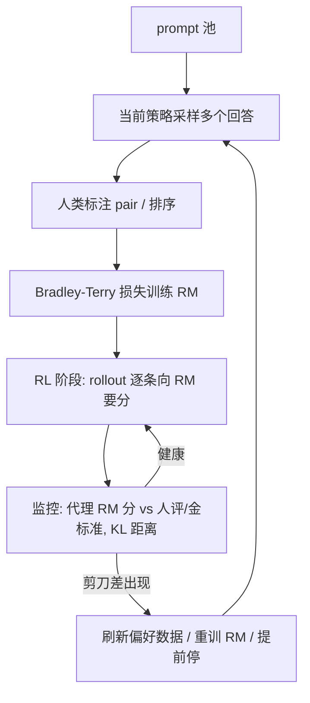

# RLHF 与 Reward Model

> ⚠️ 旧版:本篇写于写作契约确立之前,尚未按新标准审查重写。标准见 docs/05-知识库写作契约.md,样板见「GPU架构与执行模型」。

一句话:**RLHF 的灵魂不是 RL 算法,而是那个替人类打分的 reward model(RM)**——PPO/GRPO 只是"怎么爬山"的工具,RM 才是"山"本身:它准,一切才好;它被钻空子,优化越猛越白搭。本篇聚焦 RM 与偏好数据,RL 算法细节见 PPO 篇、GRPO 篇。

## 一、为什么需要 RM:把人类偏好"蒸"成一个代理评委

想让模型输出对齐人类偏好("有帮助、诚实、无害"),两条直路都走不通:

- **写规则**:什么算"详细但不啰嗦""自信但不武断"?偏好是隐性知识,像"什么菜好吃"——尝一口就知道,但写不成一张评分细则;规则列不全,列全了还互相打架;
- **人逐条评**:RL 训练要对海量 rollout 实时打分,每条都请人看,贵到不可行、慢到进不了训练循环。

RLHF 的折中:人类只标注**有限的对比数据**,把偏好"蒸馏"进一个模型,之后由它 7×24 小时代替人类当评委。这就是 reward model:输入 (prompt, 回答),输出一个标量分。InstructGPT 据此确立三阶段范式:SFT → 训 RM → RL 对着 RM 的分优化策略(全景见 强化学习章总览)。

RM 的用途也不止 RL:best-of-n 采样挑答案、SFT 数据筛选、自动评测,都靠同一个评委。

## 二、偏好数据:评委的教材

### 采集形态

对同一个 prompt 用当前模型采样多个回答(InstructGPT 每题采 4–9 个),让标注员做**相对比较**:两两挑出更好的(pairwise)或整体排序(ranking)。关键设计是**只比相对好坏、不打绝对分**——人对"这条回答值几分"极不稳定,但"A 和 B 哪个好"一致得多,如同品酒:打 87 还是 89 分是玄学,"这两杯哪杯好"人人能答。

### 标注质量的三个难点

- **标注者一致性低**:标注员两两之间的同意率通常只有七成上下(InstructGPT 报 72.6%),意味着相当一部分样本连"标准答案"都有分歧,RM 的精度天花板从数据侧就被压住;
- **伪偏好混入**:标注员系统性偏爱更长、格式更漂亮、口吻更自信的回答——这些表面特征与真实质量相关但不等价,RM 会照单全收,为长度膨胀与马屁精埋下种子;
- **指南漂移**:标注指南中途修订、批次之间标注员理解不一,数据分布悄悄变化,前后期偏好互相矛盾。

### 规模量级

介于"几千到几万条 SFT 数据"与"万亿 token 预训练"之间:InstructGPT 的 RM 训练集约 3.3 万个 prompt(每个展开成多对比较);Learning to Summarize 收集约 6.5 万对摘要比较;开源社区为省人力常用 AI 反馈替代人标(如 UltraFeedback 用 GPT-4 标注几十万条)——这本质上已是 LLM-as-judge(见第五节)。

## 三、RM 训练:给 SFT 模型换一个打分头

### 初始化与结构

拿 **SFT 模型**(或同源底座)做初始化,把末端的 unembedding 层换成输出标量的线性头(value head),整条 (prompt, 回答) 过一遍模型,取末 token 位置的隐状态映射成一个分数。

为什么从 SFT 初始化?**评委得先看得懂比赛**:判断回答好坏所需的语言理解,与生成回答是同一种能力,从头训一个打分器等于请没看过球的人当裁判;同源初始化还让 RM 与被评的 policy 分布对齐,不在陌生文本上瞎打分。

RM 要多大?InstructGPT 用 6B RM 评 175B policy——评委不必与学生同尺寸;但 Gao et al. 表明 RM 越大越抗 hack(见第四节),后来的实践多舍得用与 policy 同量级的 RM。

### Bradley-Terry 损失

训练目标:让人类选中的回答 $y_w$(win)得分高于落选的 $y_l$(lose):

$$
\mathcal{L} = -\mathbb{E}_{(x, y_w, y_l)}\left[\log \sigma\left(r_\phi(x, y_w) - r_\phi(x, y_l)\right)\right]
$$

这是 Bradley-Terry 模型——棋类 Elo 等级分的统计学近亲:把"A 胜过 B 的概率"建模成两者分差过 sigmoid。两个要点:

- **只学相对分,绝对数值无意义**:损失只依赖分差,全体分数加任意常数损失不变。RM 分像 Elo 分,只在同 prompt 内比较才有意义,拿去跨 prompt 比较或当"绝对质量"读数都是误用。这与 GRPO 的组内标准化天然契合——结果奖励版 GRPO 使用同 prompt 组内标准化后的相对分数,不只是名次(见 GRPO 篇);DPO 则把同一个 BT 模型直接解析进策略、免去显式 RM(见 DPO 篇);
- **成对只是训练形态**:部署后单条回答一次前向就出一个分,不需要成对输入。

### 训练细节与常见坑

- **防止重复偏好对过拟合**:同一条回答会出现在多个 pair 里,重复更新会放大记忆效应。InstructGPT 的 RM 配方采用 1 个 epoch,不代表所有 RM 都只能训练一轮;应按留出集与下游生成评测选择停止点;
- **同 prompt 的 K 个回答拆成 $\binom{K}{2}$ 个 pair,放进同一个 batch**:每条回答只前向一次、复用给所有 pair,省算力,也避免同一回答在一个 epoch 内被多次梯度更新而过拟合;
- **margin 变体**(Llama 2 做法):标注时顺带标"好多少"(显著更好/更好/略好),损失改为 $-\log \sigma(r_w - r_l - m)$,偏好越明确 margin 越大,强行拉开分差;
- **输出归一化**:训完把 RM 分平移到参考分布上均值为 0,方便 RL 阶段配 KL 系数与 reward clip(见 PPO 篇);
- **怎么评估 RM**:用 held-out 偏好对的 pairwise 准确率,并按任务、长度和标注一致性分桶。准确率没有通用门槛;还要检查被优化后的策略在人评和真实任务上是否进步。

### RM 训练不稳与偏好泛化

“不稳定”要分开看:loss 震荡可能来自学习率、批间奖励尺度或数值问题;训练 loss 下降而留出准确率下降更像过拟合;RM 离线准确但策略越训越差,则要查分布偏移与奖励被钻空子。它们不是同一个故障。

数据上先检查同 prompt 的回答是否可比、偏好次序是否正确、是否有冲突标注和重复样本;划分留出集时按 prompt 分组,避免同源回答泄漏。再用长度与格式匹配的对照判断 RM 是否只学到伪特征。优化上降低过大的学习率,检查分数和梯度尺度,按验证效果早停,并用当前策略的新回答刷新标注。

DPO 的改进思路是把偏好建模改写为策略与 reference 的概率比,直接优化成对损失,省去独立 RM 训练和在线 actor-critic 耦合。它减少这部分误差与工程环节,但偏好噪声和覆盖不足仍在,详见 DPO 篇。

### Reward Model 与 Critic:一个定终点,一个估路程

RM 通常回答“这整段回答有多符合偏好”,Critic 则估计当前策略从 token 前缀 $s_t$ 出发的未来回报 $V(s_t)$。PPO rollout 先由 RM 给终局分,再叠加逐 token KL 等训练奖励;Critic 用这些奖励拟合回报,并通过 TD 残差与 GAE 构造优势。Actor 使用优势做策略梯度更新,不会把 Critic 梯度沿离散 token 采样反传。

不用 Critic 仍可把蒙特卡洛终局回报用于 REINFORCE,但信用分配粗、方差通常更大。Critic 是随当前策略数据更新的基线,RM 是偏好代理,因此 RM 分不能直接当作每个前缀的 $V(s_t)$。二者可共享语言模型主干,也可独立部署;共享省参数但会引入目标间梯度干扰。用 RM 主干初始化 Critic 只是初始化选择,value head 仍须按当前策略回报重训。

Critic 失准时,优势的符号或尺度会错,应联合检查 value loss、explained variance、回报方差、KL、clip fraction 和实际生成。先排查 terminal/padding mask、奖励尺度与 bootstrap,再比较 value 学习率、GAE 参数、value clipping 和更新轮数,没有固定的 Actor/Critic 更新比例。RM 与 Critic 也可共用冻结底座或从同一 checkpoint 初始化,但 PPO 中 RM 常保持稳定而 Critic 要跟随策略更新;若联合共享可训练参数,必须隔离两个目标的梯度并分别验收评分和价值估计。

## 四、reward hacking 与过优化:评委被钻空子

### Goodhart 定律

"一项指标一旦成为优化目标,它就不再是好指标。"RM 只是真实人类偏好的**有损代理**,而 RL 的优化压力会精准找到代理与真实目标之间的每一条缝——像应试刷题:分数(代理)一路涨,学问(真实目标)未必涨,题海战术越猛偏得越远。

### 经典 hack 形态

- **长度膨胀**:标注数据里"长 ≈ 认真",策略学会注水,越写越长、废话连篇;
- **马屁精(sycophancy)**:顺着用户的观点说、无脑赞同,而不是给出正确答案;
- **格式套路**:列表、加粗、表情、"首先/其次/总之"八股件件不落,内容空洞;
- **自信口吻**:斩钉截铁的错误答案,得分高过谨慎克制的正确答案。

### Gao et al. 的过优化定律

Scaling Laws for Reward Model Overoptimization 用合成实验(一个大"金标准 RM"扮演真实偏好,给代理 RM 造标注)刻画出剪刀差:以策略偏离初始策略的距离 $d=\sqrt{D_{\mathrm{KL}}(\pi\,\|\,\pi_{\mathrm{init}})}$ 为 x 轴,**代理 RM 分单调上涨,金标准分先涨后跌**,RL 场景下金标准分近似 $d(\alpha - \beta \log d)$ 的倒 U 形。两条规律:代理 RM 越大、偏好数据越多,拐点来得越晚;策略模型越大,从优化中拿到的真实增益越小(过优化幅度相近)。实践铁律:**RL 不能训到收敛**,要在金标准掉头前停。

> 🖼️ 占位:过优化剪刀差示意图——x 轴为 KL 距离,代理 RM 分持续上升、金标准分先升后降的分叉曲线

### 缓解手段

- **KL 锚**:惩罚策略偏离 reference,风筝可以飞但线不能断(折进 reward 还是独立 loss 项,见 PPO 篇与 GRPO 篇);
- **RM 集成**:多个 RM 取 min 或均值,合议庭制——钻空子得同时骗过所有评委;
- **定期刷新偏好数据**:拿当前策略的新 rollout 重新送标、迭代重训 RM(InstructGPT、Llama 2 都做多轮),让评委见识过学生的最新套路;
- **针对性去偏**:已知偏置显式处理,如对 RM 分做长度去相关、训练数据里平衡长短与格式;
- **评测盯真实指标**:训练面板上的 RM 分只是代理,定期用人评抽检 / held-out 评委 / 下游真实任务给 checkpoint 体检。

### 多目标 Reward Function:先定底线,再加权优化

完整训练奖励不等于 RM 分。它可以组合偏好 RM、事实或代码验证器、格式规则、过程/结果奖励以及 reference KL。组合前先按训练分布校准各分量的尺度;线性加权适合可交换的软目标,合规和安全底线更适合门控、词典序优先级或约束优化。否则一个很大的有用性分可能抵消安全违规,而给所有拒答加分又会诱发过度拒答。

PRM 只有在步骤标签或验证器可信时才提供更细信用分配,不是稀疏奖励的免费修复。多个 RM 可在训练时批量打分、共享主干、蒸馏或先经规则筛选,不要求部署推理时全部常驻。RM 通常在一段策略优化期间冻结;当当前策略跑出训练分布、独立评测与 RM 分背离时,再收集新回答、复标并刷新 RM。是否刷新及频率由漂移和评测决定,没有统一比例。

多目标验收要同时看每个奖励分量、长度/格式分桶、held-out 人评、红队和真实任务指标。总奖励上涨而这些指标下降,才是代理过优化的直接警报;不能让训练用的同一个 RM 兼任唯一裁判。

## 五、RM 的谱系:ORM、PRM 与 verifier

按打分对象与信号来源,评委分三类:

| 类型 | 打分对象 | 信号来源 | 取舍 |
| --- | --- | --- | --- |
| ORM(outcome RM) | 整条回答一个分 | 人类偏好对 / 结果对错 | 通用、标注便宜;信号稀疏、可被 hack |
| PRM(process RM) | 每个推理步骤一个分 | 人标步骤 / MC 自动估计 | 信号密、能定位错步;标注贵 |
| rule-based verifier | 可机判的结果 | 规则:答案匹配 / 单元测试 | 信号明确;仍可能受规则漏洞或测试覆盖不足影响 |

- **PRM(过程奖励模型)**:Let's Verify Step by Step 请人给数学解答的**每一步**标 对/错/存疑(PRM800K 数据集),PRM 逐步打分,能揪出"过程错但答案蒙对"的解;MATH 上做 best-of-N 挑答案,PRM 显著优于 ORM(约 78% vs 72%)。人标过程分极贵,后续工作(如 Math-Shepherd)用 MC 估计自动化:从某一步出发采多条后续,按最终答对率给这一步打分;
- **rule-based verifier**:数学答案匹配、代码跑单元测试,能提供较明确的结果信号,是 RLVR(可验证奖励 RL)的一类反馈来源。验证器仍可能有格式漏洞、答案泄漏或测试覆盖不足,不能把它当成“绝不可能被钻空子”的奖励替身,详见 GRPO 篇;
- **LLM-as-judge 当 RM**:让强 LLM 按评分细则生成打分,免训练、换标准只需改 prompt;但自带位置/长度/自我偏好等偏置,被当 reward 持续优化时同样会被钻空子,需搭配 verifier 或人评抽检。

## 六、全流程闭环

### SFT、RM 与 PPO 的目标和数据

后训练把基础语言模型变成更能遵循指令、符合偏好的模型。InstructGPT 式流程先做 SFT,再训练 RM,最后用 PPO 优化策略;这是典型路线,不是所有系统必经的固定工序。

| 阶段 | 数据形式 | 更新对象与机制 | 产物 |
|---|---|---|---|
| SFT | prompt 与示范回答,可含多轮对话 | 全参或 PEFT;对回答 token 做交叉熵训练 | 初始指令策略 |
| RM | 同 prompt 的优选/劣选回答或排序 | 语言模型加评分头;用成对分差拟合偏好 | 冻结用于 RL 的评分器 |
| PPO | prompt 与策略新采样的回答 | 用 RM 奖励、critic 价值估计及优势更新策略 | 经过偏好优化的策略 |

SFT 具体数据和损失掩码见 SFT 篇。PPO 的 critic 预测后续回报,RM 评估回答偏好,两者不是同一个角色。PPO 裁剪新旧策略概率比以限制单次更新;RLHF 常另加对固定 reference 的 KL 惩罚,控制相对初始策略的累计偏移。token 级优势通常结合后续奖励与价值估计,可由 GAE 计算,不能一律写成终局奖励减一个常数;细节见 PPO 篇。

SFT本身属于后训练。除RM+PPO外,还可在同一基座上选择DPO、拒绝采样后的SFT或其他偏好目标,没有固定的SFT→DPO→PPO工序。拒绝采样用RM或规则筛选候选,保留优选回答再SFT会更新模型;仅在推理时best-of-N选答案不属于参数训练。不同路线的数据衔接见 DPO 篇。

### 为什么不只增加 SFT 轮次

继续训练同一份示范,仍是在提高参考回答的似然,不会自动产生“两个回答哪个更符合偏好”的新监督。RM 加策略优化利用比较反馈,让模型在自己生成的回答上改善目标;但 SFT 没有“不能超过标注者”的理论天花板,RL 也不保证一定生成更好的答案。

PPO 不稳定时要分别检查 RM 质量、奖励尺度、优势估计、学习率、裁剪与 KL,而非只增加 SFT 轮次。标准 DPO 直接用现有偏好对训练策略,免去显式 RM、critic 和在线 rollout;代价是受偏好数据覆盖限制,机制见 DPO 篇。

### 后训练数据与算法选择

高质量SFT示范要覆盖业务任务、难度和拒答边界,检查正确性、模板与去重。数量不足时定位缺口,可利用公开、合成或业务数据并复核,不以固定样本量替代质量。偏好采集对同一问题生成多个候选,盲化来源、随机交换次序、统一指南、复核分歧,按prompt与来源分组划分,防止长度和格式被误当作偏好。

SFT与偏好阶段分别根据学习曲线配置预算:基础任务未学好先补示范,基本能力合格但质量排序不足再补偏好,同时监测通用能力。不存在统一数量比例或自建/公开配方;来源选择、拒绝采样构造偏好与标注成本控制见 DPO 篇,SFT质量流程见 SFT 篇。

| 方法 | 训练信号与区别 | 主要成本和边界 |
|---|---|---|
| PPO | 在线采样,RM或验证器给奖励,critic估计优势 | 生成、评分和价值学习;需防奖励投机与耦合不稳 |
| GRPO | 同题一组回答的相对奖励作为优势,不训练独立critic | 组内采样仍昂贵,不能保证所有配置都更省 |
| DPO | 离线优劣回答对,直接优化相对reference的概率差 | 省RM及在线循环,但受偏好噪声和覆盖限制 |

PPO最大化裁剪的概率比目标。对正优势,超过上界不再奖励继续增大概率;对负优势,低于下界不再奖励继续减小概率。这不等于把所有更新硬限制在区间内;对rollout旧策略的clip与对固定reference的KL也不同,详见 PPO 篇。

结果奖励版GRPO用组内分数减均值、除标准差来构造优势。组更大可能采到更多不同质量答案,但固定总回答预算下会减少问题覆盖;组太小估计噪声大,全同分组没有相对训练信号,组大小1也无法比较。应比较非零方差组比例、目标质量和单位计算收益,不照搬某个固定组大小,详见 GRPO 篇。

RLHF是人类反馈学习范畴,不能与某个PPO实现完全等同。有可靠离线偏好可先用DPO,有持续可靠奖励和在线采样预算可比较PPO/GRPO;没有必须RLHF或PPO效果上限必高的定理。DPO的模式崩溃、IPO有限分差目标、ORPO联合SFT与偏好等细节见 DPO 篇。

### 对齐税与评测闭环

对齐税是偏好对齐后某些原有任务表现下降,不是“有用和无害”两个指标之间所有取舍的统称。InstructGPT 观察到这种下降,混入预训练目标可缓解部分回退,但并未完全消除。不能说 RLHF 自动解决对齐税。

每轮应同时看偏好收益、通用能力和真实任务质量;若 RM 分继续涨而人评下降,按第四节检查 reward hacking 和过优化。收集当前策略的新回答、刷新偏好数据和 RM、保留独立评测集,再决定继续优化、回退还是停止。无需保证每一轮都重新做完整三阶段。

## 七、面试考点串联

| 问法 | 本文哪一节 |
| --- | --- |
| SFT、RM、PPO各用什么数据,与DPO及拒绝采样怎样衔接? | SFT、RM 与 PPO 的目标和数据;三、RM 训练:给 SFT 模型换一个打分头 |
| 为什么不能只增加SFT轮次,怎样决定数据质量、来源和阶段比例? | 为什么不只增加 SFT 轮次;后训练数据与算法选择 |
| RM 与 Critic 各负责什么,RM 训练不稳、分布外失效或 Critic 失准怎样处理? | RM 训练不稳与偏好泛化;Reward Model 与 Critic:一个定终点,一个估路程 |
| 多目标奖励怎样组合,如何识别和缓解 reward hacking? | 多目标 Reward Function:先定底线,再加权优化;四、reward hacking 与过优化;对齐税与评测闭环 |
| 什么是对齐税,怎样迭代而不只追RM分数? | 对齐税与评测闭环 |
| RM为何学同prompt相对分,如何控制采集偏置与重复pair泄漏? | 二、偏好数据:评委的教材;Bradley-Terry 损失;训练细节与常见坑;RM 训练不稳与偏好泛化 |
| PPO、DPO、GRPO怎样选,PPO裁剪和GRPO组大小影响什么? | 后训练数据与算法选择 |
| ORM、PRM和规则验证器适合什么反馈,有哪些漏洞? | 五、RM 的谱系:ORM、PRM 与 verifier |

> 本篇仍保留旧稿重写状态。

## 相关文献

- InstructGPT(确立 RLHF 三阶段与 RM 配方)— [arXiv:2203.02155](https://arxiv.org/abs/2203.02155)
- Learning to summarize from human feedback(RM 配方起点)— [arXiv:2009.01325](https://arxiv.org/abs/2009.01325)
- Scaling Laws for Reward Model Overoptimization(过优化定律)— [arXiv:2210.10760](https://arxiv.org/abs/2210.10760)
- Let's Verify Step by Step(PRM 与 PRM800K)— [arXiv:2305.20050](https://arxiv.org/abs/2305.20050)

- DPO — [arXiv:2305.18290](https://arxiv.org/abs/2305.18290)
- PPO — [arXiv:1707.06347](https://arxiv.org/abs/1707.06347)
- DeepSeekMath(GRPO) — [arXiv:2402.03300](https://arxiv.org/abs/2402.03300)
