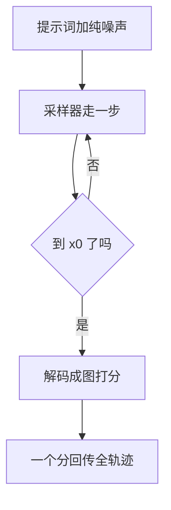
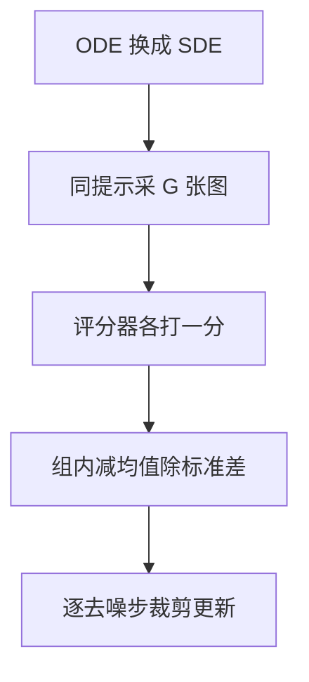

# 多模态RL

一句话:把图像/视频生成模型的**一次去噪采样当成一条轨迹**,拿一个不可微的打分(好不好看、对不对得上提示词、招牌上的字拼没拼对)当奖励去改它——算法零件几乎全是从文本 RL 搬过来的,真正换掉的只有两样:**轨迹长什么样**,和**奖励从哪来**。

## 一、为什么生成模型要上 RL

### 训练目标和用户在意的东西不是一回事

扩散与 flow matching 的训练目标本质是**似然的一个近似**:给一张加了噪的图,预测该往哪个方向去噪,做的是回归(加噪去噪的构造见 Diffusion 篇,速度场怎么定义见 FlowMatching 篇)。可用户在意的从来不是似然——这张图好不好看、有没有把"三只猫"画成三只、招牌上的字有没有拼对、有没有多长出一只手。这些**既不在训练目标里,又大多不可微**:检测器数出来的物体个数、OCR 认出来的字符串,都没有导数。这个错位和语言模型那边一模一样——预训练学接龙,"回答得体"要靠后训练补(见 RLHF与RM 篇)。所以 RL 在这里的定位很清楚:**它是在基础生成模型已经能出图之后加的一层微调**,不负责教模型画画,只负责把它已有的输出分布往评分器指的方向挪。

### 三条必须先划清的边界

- **GAN 的判别器不是"隐式 RL"。** 判别器和生成器打的是一场**可微的对抗博弈**,梯度直接穿过生成器;RL 里奖励是黑盒标量,梯度只走 $\nabla\log\pi$,压根不需要 $\nabla R$(这条对照见 PPO 篇)。两边都"有个东西在打分",但信号怎么进梯度完全不同。相比 GAN 式目标,RL 的真正优势是**能把人类比较、不可微规则和外部工具分数混在一起用**,而且是从一个已经很强的预训练生成器接着优化。
- **扩散时代重新重视 RL,是两件事凑到了一起**:最终偏好越来越依赖不可微的人评与外部工具;而逐步去噪本身天然就是一条多步决策链,策略梯度可以直接套上去。
- **但推不出"RL 一定更好"。** 方差大、每条样本都要跑完整条采样链、评分器会被钻空子,这三条代价是实打实的。RL、监督微调、直接偏好优化谁划算,取决于反馈形态和预算,不取决于名字。

## 二、把去噪轨迹当序列决策

### MDP 怎么映射

DDPO 的做法是把一次完整采样看成一条长度等于采样步数的轨迹:

| MDP 要素 | 在扩散 / flow 采样里是什么 |
|---|---|
| 状态 $s_t$ | $(c,\ t,\ x_t)$:提示词、当前时间步、当前带噪潜变量 |
| 动作 $a_t$ | $x_{t-1}$,即采样器这一步吐出来的下一个潜变量 |
| 策略 $\pi_\theta(a_t\mid s_t)$ | 采样器那一步的条件分布 $p_\theta(x_{t-1}\mid x_t,c)$ |
| 轨迹与转移 | $x_T\to\cdots\to x_0$ 共几十步;转移是确定性的(把 $x_{t-1}$ 原样搬进下一步),没有环境随机性 |
| 奖励 | 只在 $t=0$、解码成图之后给一次 |

$$
r(s_t,a_t)=\begin{cases}R\big(\mathcal D(x_0),\,c\big), & t=0\\[2pt] 0, & t>0\end{cases}
$$

它在说:**整条去噪链上只有最后一步有分,中间几十步的原生奖励全是 0**($\mathcal D$ 是把潜变量还原成像素的解码器,见 VAE 篇)。这和 RLHF 里"RM 分只挂在最后一个 token 上"是同一个形状,所以关于基线、信用分配、方差的那一整套讨论都能对着文本那边读。

### 和文本自回归 RL 的四条根本差别

| | 文本 RL | 扩散 / flow RL |
|---|---|---|
| 一个动作是什么 | 从词表里离散采一个 token,动作空间是十万量级的离散集合 | 从一个连续高斯里采**一整张**潜变量,动作空间连续、维数等于潜变量大小 |
| 轨迹多长 | 几百到几千步 | 几十步,训练时还能再压 |
| 策略概率从哪来 | softmax 直接给 | 采样器那一步的高斯密度;**ODE 采样器根本没有密度** |
| 中间状态能评价吗 | 前缀就是半句话,能判 | $x_t$ 是带噪潜变量,人和评分器都看不懂 |

- **轨迹短是好事**,这也是后面算法选择的第一个前提。几十步意味着信用分配的跨度小得多,重要性权重连乘炸掉的风险也远小于几千 token 的序列(长序列权重为什么会炸见 PPO 篇)。
- **中间状态没法评价,这是最本质的一条**。文本可以给前缀打过程分,扩散走到一半的 $x_5$ 是一团噪声,**没有任何评分器能在上面给出可信的分,也没有 critic 能在上面学出可信的价值**。这一条同时解释了两件事:为什么密集过程奖励在这里比在文本里难做得多,以及为什么"用同题一组样本当基线"的组相对方法在这里特别顺手。
- **确定性采样器没有策略可言**。DDIM 的确定性版本、flow matching 的原始 ODE 都是一条给定初值就唯一确定的路径,$\log\pi$ 无从谈起,更没有探索。这就是 Flow-GRPO 第一步要做 ODE→SDE 的原因。

### 概率比、KL 与 reference 在这里指什么

零件名字没变,口径全变了,答题前要先声明。**概率比**是**逐去噪步**的 $\rho_t=p_\theta(x_{t-1}\mid x_t,c)/p_{\text{old}}(x_{t-1}\mid x_t,c)$,不是逐 token 的;**reference** 是微调前的那个生成器,KL 拴的还是同一件事——别为了薅评分器的分跑到原模型几乎不会生成的区域去。**KL 怎么算**在这里反而更省事:每步都是高斯对高斯、有闭式解,不必用 k1/k3 那套单样本估计器(方向、估计器与口径见 KL散度 篇);但**必须写清是逐步累加还是整轨迹、有没有除以步数**,否则两个人报的数会差一个数量级。

## 三、四条路线,以及它们各自在修什么

### 路线一:在线策略梯度(DDPO / DPOK)

**旧问题**:在 DDPO 之前,拿奖励改扩散模型的主流做法是**奖励加权回归**——采一批图、按分数给样本加权、再做一遍去噪回归,说白了是加权版 SFT。它只用"这个样本值几分"这一个标量去缩放整条样本的似然,采样过程内部发生了什么完全不进梯度;目标一旦是提示词表达不出来的(比如"生成可压缩的图"),就很难推得动。

**新设计**:把去噪当成上一节那个多步决策问题,直接对**每一步**的 $\log\pi_\theta$ 做策略梯度。能这么做的关键是:样本的边缘似然 $p_\theta(x_0)$ 算不出来,但**每一步的条件密度是现成的**——采样器那一步本来就从一个已知均值方差的高斯里采,精确的 log-probability 直接就有。

**工作机制**:采一批完整轨迹 → 只在末尾解码打分 → 把这个分当整条轨迹的回报 → 逐去噪步更新。论文给了两个估计器:`DDPO_SF` 是朴素的 score function(REINFORCE),`DDPO_IS` 加上新旧策略的概率比并对权重裁剪,于是一批 rollout 能复用几次更新;后者是论文里更有效的那个,实现基本就是 PPO(概率比与裁剪见 PPO 篇)。DPOK 走同一路,额外把**对 reference 的 KL 正则**显式写进目标。

**收益**:DDPO 论文自报能优化提示词表达不出来的目标(图像可压缩性)与来自人类反馈的美学分,还能靠一个视觉语言模型的反馈改善图文对齐、不需要新增标注;DPOK 论文自报在图文对齐和图像质量上都优于监督微调。

**代价**:最贵的一条是**每拿到一个标量,都得先跑完一整条采样链**(几十次网络前向);奖励只有一个数、几十步共享,方差大;DanceGRPO 直接点名 DDPO 与 DPOK 的问题是**prompt 集一大一杂就稳不住**——这正是组相对方法登场的理由。

### 路线二:可微奖励直接反传(ReFL / DRaFT)——严格说它不是 RL

**旧问题**:美学打分器、CLIP、ImageReward 这些评分器**本身就是可微的神经网络**,而策略梯度只取了它输出的一个标量,把 $\nabla R$ 整个扔掉。信息利用率低,收敛自然慢。

**新设计**:让奖励的梯度**穿过去噪过程**一路反传到生成器参数上。

**工作机制**:正常采样到 $x_0$ → 解码 → 送进可微奖励 → 反传。ImageReward 附带的 ReFL 是早期形态;DRaFT 把它做成完整方案并给了两个省法:**DRaFT-K 只对采样的最后 $K$ 步反传**,DRaFT-LV 在 $K=1$ 时用一个更低方差的梯度估计。

**收益**:一次更新拿到的是整个梯度向量而不是一个标量,收敛所需步数比策略梯度少得多;实现上也不需要 rollout 缓存、概率比、优势这一整套。

**代价**:三条,每条都能卡死一个场景。**奖励必须可微**——OCR 认没认对、检测器数出几只猫,这类离散判定接不上,而它们恰恰是最难被钻空子的信号。**显存**——完整反传要保住整条采样链的激活,所以必须截断步数、开梯度检查点、只训 LoRA(重计算与显存账见 显存管理与OOM 篇)。最要命的是**它是在直接对着评分器做梯度上升,过拟合评分器特别快**,视觉上就是过饱和、纹理堆砌那一套。

**边界**:这一路**不满足 RL 的前提**(奖励是黑盒、梯度只走策略),它是可微目标上的直接优化。面试里把它一并叫 RL 一追就穿;正确说法是"直接奖励优化",和 RL 并列而不是从属。

### 路线三:离线偏好优化(Diffusion-DPO / D3PO)

**旧问题**:前两路都要在线采样,而偏好数据是现成的——Pick-a-Pic 这类数据集已经攒了几十万对"同一个提示词下人更喜欢哪张"。DPO 那套"用策略自己表示隐式奖励,把 RM 和在线 rollout 一起省掉"的思路(见 DPO 篇)显然该搬过来。**难点只有一个:DPO 的损失要 $\log\pi_\theta(y\mid x)$,而扩散模型给不出样本的边缘似然。**

**新设计**:用**证据下界**(ELBO)顶替算不出来的似然,推出一个可微目标。

**工作机制**:随机采一个时间步 $t$,把优选图和劣选图各自加噪到 $t$,再分别算模型与 reference 的去噪回归误差 $\ell$:

$$
\mathcal L=-\log\sigma\Big(-\beta\big[(\ell^{w}_\theta-\ell^{w}_{\text{ref}})-(\ell^{l}_\theta-\ell^{l}_{\text{ref}})\big]\Big)
$$

括号里是"模型在**优选图**上比 reference 多降了多少去噪误差",减去"在**劣选图**上多降了多少"。整体取负号再过 sigmoid,于是训练做的唯一一件事是:**在优选图上比 reference 更会去噪,在劣选图上更不会**。形状和文本 DPO 一模一样,只把"序列对数概率"换成了"去噪误差"。D3PO 走另一条:不训 RM、也不显式算似然,直接把偏好当成每一步的相对目标,论文论证它等价于在用一个最优奖励模型。

**收益**:不用在线 rollout、不用显式 RM,训练循环长得和普通微调一样。Diffusion-DPO 用 Pick-a-Pic 的 **851K 对**偏好微调 SDXL-1.0 的 base,人评在视觉吸引力和提示词对齐上都超过 base、也超过 base 加 refiner 的完整 SDXL(论文自报);它还做了一个用 AI 反馈的变体,效果相当。

**代价**:文本 DPO 的病一条不落——离线数据覆盖不住策略后来走到的区域、BT 假设装不下有分歧的审美、概率质量会流向没被监督的地方(见 DPO 篇)。扩散特有的两条:**ELBO 只是似然的下界**,所以"隐式奖励"这个量的口径不如文本那边干净;**时间步是随机采的**,一次更新的梯度只落在去噪链的某一段上,方差比看上去大。SPO 正是冲着后一条来的——在每个去噪步上从同一个潜变量出发采多个候选,用一个步感知的偏好模型当场判优劣,论文自报能让模型盯住细粒度视觉差异而不是整体版式。

### 路线四:组相对(Flow-GRPO / DanceGRPO)

**旧问题**:三条叠在一起。其一,在线路线想降方差就得有基线,可扩散的中间状态是带噪潜变量,**没有 critic 能在上面估出可信的价值**;其二,DDPO/DPOK 在大而杂的 prompt 集上不稳;其三,flow matching 的默认采样是**确定性 ODE**,没有随机性就没有密度,策略梯度根本无从谈起。

**新设计**:把 GRPO 那招搬过来——**同一个提示词采一组图,用组内均值当基线**。它天生绕开第一条,因为它只需要终局那个分,从头到尾不碰中间状态的价值。

**工作机制**分三步:

1. **ODE→SDE**:Flow-GRPO 先把确定性 ODE 换成一个**每个时刻边缘分布都与原来相同**的 SDE。换的是采样过程、不是模型;换完之后每步有了高斯密度,既能算 log-probability,也重新有了探索的随机性。
2. **组内相对优势**:同提示采 $G$ 张 → 各自打分 → 组内减均值除标准差得到一个标量优势 → 这条轨迹上所有去噪步共享它 → 逐步概率比加裁剪更新,并保留对 reference 的 KL 项(组内标准化的原理、$G$ 怎么选、零方差组见 GRPO 篇)。
3. **Denoising Reduction**:训练时用比推理**更少**的去噪步采样。Flow-GRPO 训练取 $T=10$、推理仍用默认的 $T=40$(论文口径)。这么做站得住,是因为优势本来就整条共享、信用分配的粒度不随步数变细,而 rollout 成本几乎正比于步数。

**收益**:Flow-GRPO 论文自报把 GenEval 从 63% 做到 95%、视觉文字渲染准确率从 59% 做到 92%,且 reward hacking 很轻;DanceGRPO 自报在扩散与 rectified flow 上都能稳定优化,横跨三类任务、四个基座模型、五个奖励模型,在 HPS-v2.1、CLIP Score、VideoAlign、GenEval 上最多超基线 181%(均为论文自报)。

**代价**:生成量乘以 $G$,而这里一条样本是整条几十步的去噪链,比文本一条回答贵得多;零方差组原样继承(一组图全达标或全不达标,这批算力白花),二值可验证奖励尤其容易撞上;还有一条**它本来就不负责**的事——组内标准化处理的是**合成之后那一个标量**,多路奖励怎么合成、各分量什么权重,必须在进组之前解决,那是下一节的内容。

### 四条路线横向对照

| | 在线策略梯度 | 可微奖励反传 | 离线偏好优化 | 组相对 |
|---|---|---|---|---|
| 代表 | DDPO、DPOK | ReFL、DRaFT | Diffusion-DPO、D3PO | Flow-GRPO、DanceGRPO |
| 要在线采样吗 | 要 | 要(但只为拿到 $x_0$) | **不要** | 要,且同题采一组 |
| 奖励必须可微吗 | 不必 | **必须** | 不需要奖励,只要偏好对 | 不必 |
| 算不算 RL | 是 | 否,是直接奖励优化 | 否,是离线偏好优化 | 是 |
| 最大的坑 | 方差大,prompt 集一杂就不稳 | 过拟合评分器最快 | 离线覆盖 + ELBO 口径 | 生成量 $\times G$、零方差组 |

降方差的口径也各不相同:策略梯度那一路没有显式基线,只能靠裁剪与归一压;组相对的基线就是组内均值;可微反传和离线偏好优化压根不是策略梯度,不存在这个问题。一句话选型:**有不可微或可验证的信号、且同题采得出有区分度的一组 → 组相对;只有现成偏好对且预算紧 → 离线偏好优化;奖励是可微评分器、只想把某一个维度快速拉上去 → 直接反传,但必须配独立验收;想沿用 PPO 那一整套零件做在线控制 → 策略梯度。**

## 四、奖励怎么搭,以及它会怎么坏

### 三类信号,量纲完全不同

| 信号 | 典型实现 | 值域与性质 | 主要风险 |
|---|---|---|---|
| 美学 / 人类偏好 | LAION 的 CLIP+MLP 美学打分器;ImageReward(13.7 万条专家比较);HPS v2(43.3 万对图上的 79.8 万次人类选择);PickScore | 连续标量,**只有相对分有意义**(和 RM 一样由成对比较训出) | 图像版的"长度膨胀":过饱和、高对比、糖水片 |
| 图文对齐 | CLIP 相似度(CLIP 本身见 视觉编码器 篇);VLM 判官打分 | 余弦相似度,实际集中在很窄的区间 | CLIP 对计数、空间关系、属性绑定本来就弱,拿它当奖励等于把它的盲区变成模型的盲区 |
| 可验证约束 | GenEval 那套:用检测器查物体共现、位置、**数量**、颜色;OCR 查招牌上的字对不对;尺寸与安全规则 | 天然 0/1 或比例 | 检测器与 OCR 自己会错;二值信号容易整组同分,直接造出零方差组 |

三者的关系一句话说清:**前两类便宜、覆盖广,但都是有损代理;第三类最难被钻空子,可它只覆盖得了"能写成判据"的那一小块。** Flow-GRPO 涨得最猛的两个任务(物体组合、文字渲染)恰好都属于第三类,不是巧合。

### 尺度校准:合成之前必须先做的事

训练奖励通常长这样(通用形式与安全约束的讨论见 RLHF与RM 篇):

$$
R(x,c)=\sum_i w_i\,\tilde r_i(x,c)\;-\;\beta\,D_{\mathrm{KL}}\big(\pi_\theta\,\Vert\,\pi_{\text{ref}}\big)
$$

关键在那个波浪号:$\tilde r_i$ 是**校准之后**的分量,不是评分器的原始输出。为什么非校准不可——原始分直接相加时,美学分可能在 5 到 7 之间摆、CLIP 相似度在 0.25 到 0.35 之间摆、OCR 只有 0 和 1,三者的**动态范围差一到两个数量级**;加权和的梯度会被波动最大的那一项统治,而它未必是你最在乎的维度。$w_i$ 看着像"重要性",**实际生效的是 $w_i\times$ 该分量的标准差**。

- 每个分量先在**当前策略采的一批样本上**估均值和标准差,做 z-score 或分位数归一,再加权。基准必须取当前策略的分布,而不是一组写死的常数——**策略一漂移,分量的动态范围就变了**,固定常数会悄悄改变实际权重。
- 每个分量单独设上界裁剪防止某一维独占优势,并**各记一条曲线**:只看合成后的总均值时,一维塌了、另一维猛涨,均值可能纹丝不动。

还要说死一条:**GRPO 的组内标准化救不了这件事。** 它标准化的是**合成完的那一个标量**,分量之间的相对权重在进组之前就已经定死;标准 GRPO 里既没有向量奖励也没有分段奖励(见 GRPO 篇)。

### 冲突怎么处理

图像上的典型冲突有三对:**美学 vs 图文对齐**(把画面做"好看"往往要牺牲提示词里那些拗口的约束,比如"左边三只猫右边两只狗");**对齐 vs 多样性**(对齐分拉满,同一提示词的不同种子会越来越像);**安全 vs 有用**。按目标性质分三档处理:

| 目标性质 | 怎么处理 | 理由 |
|---|---|---|
| 真能互换的软目标(美学、风格、清晰度) | 校准后线性加权 | 加权和本来就假设可替代 |
| 不可违反的硬条件(安全、必须出现的物体、水印) | **门控**:违反即否决,再在可行解里优化软目标 | 线性加权下,一个足够高的美学分能把违规抵消掉 |
| 互相拉扯、一个模型很难同时学好的 | 分开训评分器,RL 阶段再组合 | 和 Llama 2 训双 RM 是同一个理由(见 RLHF与RM 篇) |

最后一档在多模态里已经是常态:DanceGRPO 同时挂了五个奖励模型(图像/视频美学、图文对齐、视频运动质量、二值反馈)。

### 独立验收

三条硬规矩。**训练用的评分器不能同时当唯一裁判**:至少留一个**完全没进奖励**的评分器,再加一个固定的人评集。**分维度看,别看总均值**:图文对齐、结构正确、美学、多样性(同提示词多种子之间的差异)、安全各一条曲线。**固定解码设置再比较**:采样步数、CFG scale、随机种子、分辨率任何一项变了分数就不可比——这条在图像上比在文本上更容易踩,因为 CFG scale 本身就能大幅改变"看起来的质量"(条件怎么注入见 条件控制 篇)。

### reward hacking 的图像形态

通用成因、诊断与缓解见 RLHF与RM 篇;这里只讲图像/视频**特有的长相**:

- **过饱和、高对比与纹理堆砌**:美学打分器偏爱色彩浓郁、景深虚化的"糖水片",也吃高频细节;优化久了每张图都像开了同一个滤镜,而构图与语义被挤掉。
- **对齐分涨而人看着没对上**:CLIP 相似度对计数和空间关系不敏感,策略于是去优化"CLIP 觉得像"而不是"人觉得对";只奖励 OCR 认对时同理,模型会把字写得又大又正,把整幅构图牺牲掉。
- **多样性塌缩**:同一提示词换种子,出图越来越像。它和文本 RL 的熵塌缩同源——策略被推向评分器的那几个高分模式。

诊断动作也是三个:换一个没参与训练的评分器画第二条曲线;固定提示词与种子看多张图之间的差异;定期人眼读高分样本(均值最擅长藏住"全都长一个样")。扩散模型上的奖励过优化有专门研究(见相关文献 TDPO-R),结论和文本那边一致:**这不是能修完的 bug,是优化的必然结果,只能靠监控与早停压住。**

### 视频:多出来的那本账

先把最容易混的地方拆开:**视频里有两条"长轨迹",不能混着说。**

| | 去噪轨迹 | 视频时间轴 |
|---|---|---|
| 长什么样 | $x_T\to\cdots\to x_0$,还是几十步 | 几十到几百帧 |
| 稀疏在哪 | 只有 $x_0$ 能打分,中间步天然无分 | 整段看完才知道好不好 |
| 变长了吗 | **没有**,和图像一样 | 是,成本随它涨 |

所以"视频轨迹长"这句话,长的是**帧数与算力**,不是决策步数。三本账各自要付:

- **算力**:一条 rollout = 几十步去噪 × 一个时空潜变量(比单帧大一到两个数量级),再加一遍视频评分器;组相对方法还要乘 $G$。常规降本手段是从**短片段、低分辨率**起步逐步加长的课程,以及训练时压去噪步数(时空潜变量怎么压见 视频VAE 篇)。
- **奖励里怎么装时序**:静态图那套(美学、图文对齐)不认识运动,必须另加**运动质量与时序一致性**分量——VideoReward 那类多维度视频奖励模型就是干这个的,DanceGRPO 也专门列了"视频运动质量"这一路;人物与物体的跨帧一致性属于同一类信号(长片段一致性本身的机制见 长视频一致性 篇)。
- **信用分配**:整段一个分,要摊给所有帧和所有去噪步。可做的有:按**片段或关键帧**分段打分再聚合;**分层**——先定故事板/关键帧、再优化局部细节;用**同提示多候选的相对基线**降方差,这正是组相对方法在视频上受欢迎的原因。

一条红线:**任何逐帧、逐片段的密集分数,上线前必须先验证它和最终人评的相关性。** 逐帧分数有偏时,你不是缓解了稀疏奖励,而是**把偏差提前注入了每一步**——每帧都好看、整段不成立,就是这条最典型的失败样子。过程奖励被 hack 的通用症状与处置见 RLHF与RM 篇。

### 合成数据 + RL 闭环

价值很直接:用生成器自己造长尾场景、难负例和偏好候选,再用验证器或人评筛一遍,数据与策略互相迭代,标注成本降得很猛。

风险同样直接,三条:**放大生成器已有的偏见与重复模式**(它造的数据长得像它自己);**评委的漏洞被反复利用**(闭环等于给策略无限次机会去找评分器的缝);**污染评测**(合成内容混进留出集,分数就没意义了)。所以闭环必须配四件事:**记录数据来源与模型版本**;**保留一份真实或人工标注的留出集**,永不参与训练;**限制合成数据占比**,并做去重、多样性与污染检查;**训练奖励之外另设独立评委与人工抽检**。一句话:闭环放大的是**你已经有的东西**——包括你的漏洞。

## 五、面试考点串联

| 高频问法 | 本文哪一节 |
|---|---|
| RL 现在怎么用在图像与视频生成上?主要解决什么问题? | 一(训练目标和用户在意的不是一回事);三(四条路线) |
| 在线策略优化、可微奖励反传、离线偏好优化怎么比?哪个严格说不算 RL?可微反传收敛更快,为什么还要留着策略梯度? | 三(路线一 / 二 / 三;路线二的代价与边界;横向对照表) |
| RLHF 用在图像生成上比 GAN 强在哪?为什么扩散时代又重新重视 RL? | 一(三条必须先划清的边界) |
| 扩散模型怎么套进 MDP?state、action、轨迹分别是什么?和文本逐 token 决策差在哪? | 二(MDP 怎么映射;四条根本差别) |
| 视频生成的稀疏奖励怎么解决?时序一致性怎么进奖励?为什么不能随手用逐帧分数? | 四(视频:多出来的那本账) |
| "合成数据 + RL"闭环的价值和风险是什么?工程上要配什么? | 四(合成数据 + RL 闭环) |
| 图文混合奖励怎么接进来?各分量尺度怎么校准、冲突怎么处理、怎么验收?组内相对化能不能顺便把多目标解决掉? | 四(三类信号;尺度校准;冲突怎么处理;独立验收);三(路线四的代价) |
| 图像上的 reward hacking 长什么样?怎么发现? | 四(reward hacking 的图像形态) |
| 扩散 RL 为什么很难做过程奖励、critic 为什么用不上?Flow-GRPO 又为什么要先把 ODE 换成 SDE? | 二(中间状态没法评价;确定性采样器没有策略);三(路线四) |
| Diffusion-DPO 怎么绕开"扩散模型算不出样本似然"?它的损失在优化什么? | 三(路线三) |
| 视频/图像 RL 的系统成本主要花在哪?怎么降? | 三(路线一、四的代价);四(视频,算力那条) |
| 补充题:训练用 10 步去噪、推理用 40 步,为什么不会把模型训坏? | 三(路线四,Denoising Reduction) |
| 补充题:美学分和 CLIP 分直接相加会出什么事? | 四(尺度校准,动态范围那段) |
| 补充题:同一个提示词出的一组图评分器给了几乎一样的分,这组还有用吗? | 三(路线四的代价);详见 GRPO 篇 |

关联篇目的分工:去噪与采样器本身见 Diffusion 篇,flow matching 的构造见 FlowMatching 篇,骨干网络见 DiT 篇;PPO 的裁剪与 GAE 见 PPO 篇,组内相对优势见 GRPO 篇,DAPO/Dr.GRPO/GSPO 见 GRPO变体 篇,偏好优化的推导见 DPO 篇;多轮工具轨迹的信用分配见 AgenticRL 篇。

## 相关文献

- Training Diffusion Models with Reinforcement Learning(提出 DDPO,把去噪当多步决策)— [arXiv:2305.13301](https://arxiv.org/abs/2305.13301)
- DDPO 作者博客(DDPO_SF 与 DDPO_IS 的区别)— https://bair.berkeley.edu/blog/2023/07/14/ddpo/
- DPOK: Reinforcement Learning for Fine-tuning Text-to-Image Diffusion Models(策略优化 + KL 正则)— [arXiv:2305.16381](https://arxiv.org/abs/2305.16381)
- Directly Fine-Tuning Diffusion Models on Differentiable Rewards(DRaFT、DRaFT-K、DRaFT-LV)— [arXiv:2309.17400](https://arxiv.org/abs/2309.17400)
- ImageReward: Learning and Evaluating Human Preferences for Text-to-Image Generation(13.7 万条专家比较;附带 ReFL)— [arXiv:2304.05977](https://arxiv.org/abs/2304.05977)
- Diffusion Model Alignment Using Direct Preference Optimization(Diffusion-DPO,用 ELBO 替代似然,Pick-a-Pic 851K 对)— [arXiv:2311.12908](https://arxiv.org/abs/2311.12908)
- Using Human Feedback to Fine-tune Diffusion Models without Any Reward Model(D3PO)— [arXiv:2311.13231](https://arxiv.org/abs/2311.13231)
- Aesthetic Post-Training Diffusion Models from Generic Preferences with Step-by-step Preference Optimization(SPO,逐去噪步的偏好优化)— [arXiv:2406.04314](https://arxiv.org/abs/2406.04314)
- Flow-GRPO: Training Flow Matching Models via Online RL(ODE→SDE 与 Denoising Reduction)— [arXiv:2505.05470](https://arxiv.org/abs/2505.05470)
- DanceGRPO: Unleashing GRPO on Visual Generation(扩散与 rectified flow 上的组相对,五个奖励模型)— [arXiv:2505.07818](https://arxiv.org/abs/2505.07818)
- Improving Video Generation with Human Feedback(VideoReward 多维度视频奖励,Flow-DPO / Flow-RWR / Flow-NRG)— [arXiv:2501.13918](https://arxiv.org/abs/2501.13918)
- Confronting Reward Overoptimization for Diffusion Models: A Perspective of Inductive and Primacy Biases(TDPO-R)— [arXiv:2402.08552](https://arxiv.org/abs/2402.08552)
- GenEval: An Object-Focused Framework for Evaluating Text-to-Image Alignment(共现、位置、计数、颜色的可验证判据)— [arXiv:2310.11513](https://arxiv.org/abs/2310.11513)
- Human Preference Score v2: A Solid Benchmark for Evaluating Human Preferences of Text-to-Image Synthesis(HPD v2:43.3 万对图上的 79.8 万次选择)— [arXiv:2306.09341](https://arxiv.org/abs/2306.09341)
- Pick-a-Pic: An Open Dataset of User Preferences for Text-to-Image Generation(PickScore)— [arXiv:2305.01569](https://arxiv.org/abs/2305.01569)
- LAION improved-aesthetic-predictor(CLIP 特征 + MLP 的美学打分器)— https://github.com/christophschuhmann/improved-aesthetic-predictor
