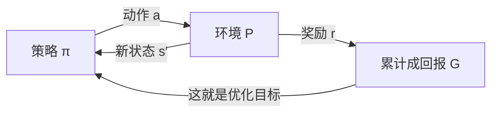
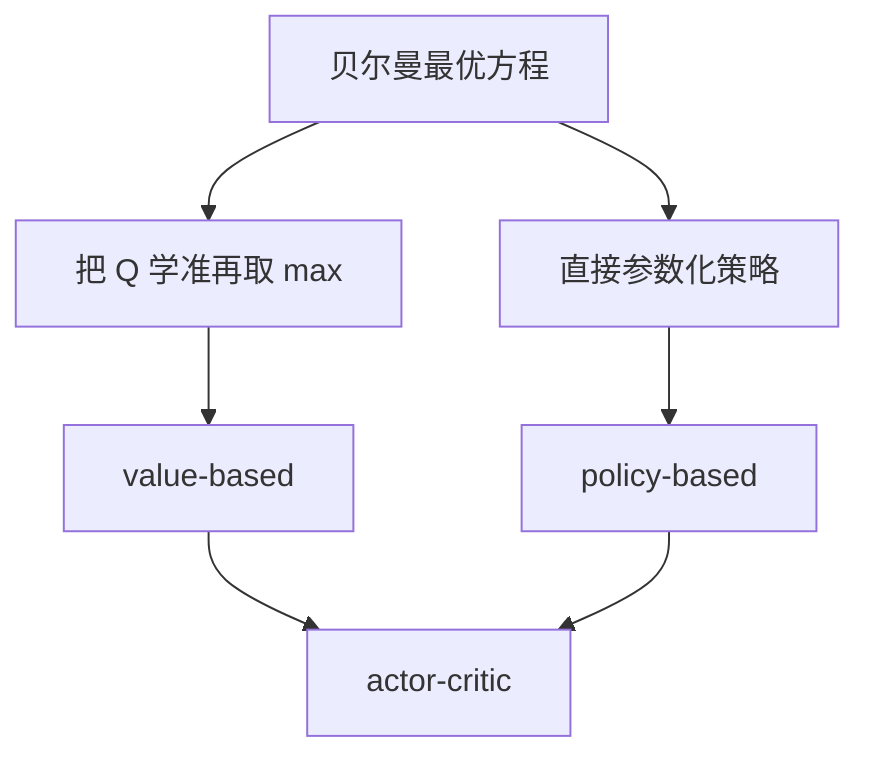

# 强化学习基础

一句话:强化学习研究的是**没有标准答案、只能靠事后打分来学的决策问题**——它先给出一套写问题的语言(MDP),再给出三条解问题的路线(学价值 / 学策略 / 两个都学)。本篇讲 LLM 之外的经典地基:MDP 要素与贝尔曼方程、三条路线的分野、DQN 与 DDPG/TD3/SAC 各修了什么,以及稀疏奖励下探索该怎么设计。PPO 自身的裁剪、GAE 与重要性采样见 PPO 篇;「LLM 对齐该选哪个算法」是 RLHF与RM 篇的题,本篇只讲这些算法本身怎么回事。

## 一、MDP:强化学习到底在算什么

### 五个要素,和那条闭环

一个强化学习问题,只要写成马尔可夫决策过程(MDP)就算定义清楚了:

| 要素 | 是什么 | 最容易踩的坑 |
|---|---|---|
| 状态 $s$ | 做当前决策所需的全部信息 | **马尔可夫性**要求"知道 $s$ 就够了,不必回看历史" |
| 动作 $a$ | 智能体能改变环境的手段 | 离散(上下左右)还是连续(关节力矩),决定了后面能用哪条路线 |
| 奖励 $r(s,a)$ | 环境给的**即时**标量分 | 它就是任务本身的定义;写歪了,模型只会忠实地去钻它 |
| 转移 $P(s'\mid s,a)$ | 做了这个动作,环境会变成什么样 | model-free 方法不学它,只从样本里间接感受 |
| 折扣 $\gamma\in[0,1]$ | 未来的分现在值多少 | 它不只是个超参,还悄悄定义了"看多远" |



**马尔可夫性**说白了是一句话:**状态得把该记的都记住**。棋盘的当前局面是马尔可夫的(前面怎么下的不影响之后的最优走法);一张赛车的静态照片就不是——看不出速度,得叠几帧才行。观测不满足这条时叫**部分可观测**,补法有三种:堆一个历史窗口、用循环网络把历史压成隐状态、或显式维护一个对真实状态的信念分布(belief state)。

### 折扣为什么必须有

$\gamma$ 看着像个可有可无的旋钮,其实扛三件事。**数学上**:任务可能永不终止,$\sum r$ 会发散;奖励有界($|r|\le r_{\max}$)时 $\gamma<1$ 保证 $|G|\le r_{\max}/(1-\gamma)$,和式一定收敛。**建模上**:早拿到的收益更值钱,和金融里的贴现是一回事。**工程上**最有用的一条:$\gamma$ 决定了**有效视野**,大约 $1/(1-\gamma)$ 步——$\gamma=0.9$ 只看十来步,$\gamma=0.99$ 看约一百步。所以"$\gamma$ 调大才学得到长程依赖"是对的,代价是把远处的噪声也一并收了进来。

### 回报、$V$ 与 $Q$

$$
G_t=\sum_{k=0}^{\infty}\gamma^{k}r_{t+k},\qquad V^{\pi}(s)=\mathbb E_{\pi}\big[G_t\mid s_t=s\big],\qquad Q^{\pi}(s,a)=\mathbb E_{\pi}\big[G_t\mid s_t=s,\ a_t=a\big]
$$

这三个量是同一件事的三个切面:$G_t$ 是**这一次**从当前时刻往后实际拿到的折扣总分(一个随机数),$V^{\pi}(s)$ 是**照策略 $\pi$ 一直走下去**的平均分(把随机性期望掉),$Q^{\pi}(s,a)$ 是"这一步先强行选 $a$、之后再照 $\pi$ 走"的平均分。$Q$ 比 $V$ 多带一个动作维度,所以它**能直接拿来挑动作**,$V$ 不能——这就是 value-based 一路为什么学 $Q$ 而不是学 $V$ 的全部理由。

### 贝尔曼方程:整个领域的递归骨架

先说它要算什么:把"从这里往后的全部未来"这个看不到头的量,**拆成"这一步拿到的 + 下一步开始的同类量"**,于是一个关于无穷序列的定义,变成一个只看一步的方程。

$$
Q^{\pi}(s,a)=\mathbb E_{s'}\Big[r(s,a)+\gamma\,\mathbb E_{a'\sim\pi}\big[Q^{\pi}(s',a')\big]\Big]
$$

读法:**$(s,a)$ 的价值 = 立刻拿到的奖励 + 折扣后的"下一状态照 $\pi$ 继续走的价值"**。这叫贝尔曼期望方程,回答的是"$\pi$ 有多好"。把里面那层"照 $\pi$ 走"换成"挑最好的",就得到贝尔曼最优方程:

$$
Q^{*}(s,a)=\mathbb E_{s'}\Big[r(s,a)+\gamma\max_{a'}Q^{*}(s',a')\Big]
$$

它说的是:最优价值只需要假设**从下一步起就一直最优**。这里的 $\max$ 是本篇后面所有故事的分水岭——正是它让"学价值"这条路能直接推出策略,也正是它在连续动作上算不动、在函数近似下会把误差系统性放大。

### on-policy 与 off-policy 的原始定义

先分清两个策略:**行为策略**是真正去环境里采数据的那个,**目标策略**是你想改进、最后要拿去用的那个。**两者必须一致就是 on-policy,允许不一致就是 off-policy。** 最干净的对照是同族的两个算法,差别只在更新式里的一项:

$$
\begin{aligned}
\text{Q-learning:}\quad & Q(s,a)\leftarrow Q(s,a)+\alpha\Big[r+\gamma\max_{a'}Q(s',a')-Q(s,a)\Big]\\
\text{SARSA:}\quad & Q(s,a)\leftarrow Q(s,a)+\alpha\Big[r+\gamma\,Q(s',a')-Q(s,a)\Big]
\end{aligned}
$$

两式都在把 $Q(s,a)$ 往"实测的一步 + 对未来的估计"上拉,差别只有一处:Q-learning 用 $\max_{a'}$,**它评估的是"如果下一步最优会怎样"**,和数据实际怎么走无关,所以谁采的数据都能用(off-policy);SARSA 里的 $a'$ 是行为策略**真的采出来**的那个动作,评估的就是行为策略自己(on-policy)。

经典的直观差别出现在悬崖行走那类任务上:带 $\varepsilon$-greedy 探索时,SARSA 会把"偶尔手滑掉下悬崖"算进自己的价值里,学出一条绕远的安全路;Q-learning 只算最优路径的价值,学出贴着悬崖的最短路,执行时因为探索噪声反而更容易掉下去。**这不是谁对谁错,是两者在回答不同的问题。**

off-policy 换来两个能力:**复用历史数据**(replay buffer)和**边探索边学最优**。代价是训练分布和目标策略对不上,必须靠重要性采样、$\max$ 这类结构或保守目标来收拾——这笔账下一节接着算。

### 和监督学习到底差在哪

三条,少一条都答不完整:

1. **标签是行动之后才知道的。** 监督学习每条样本都配好答案;RL 只有一个事后的标量分,还常常迟到很久,中间哪一步该负责得自己分配(信用分配)。
2. **数据分布随策略漂移。** 今天的策略采出的样本,下周的策略不会再产生;监督学习的训练集是一份固定教材。
3. **动作会改变将来看到的东西**,构成闭环。这是前两条的根源,也是"一次坏更新可能爬不回来"的原因——策略被推坏之后,采到的全是坏数据。顺带把自监督学习摆进来:它从数据自身构造监督(遮住一部分预测另一部分),**标签是自动生成的,但分布仍然固定、也没有闭环**,所以它属于监督学习的一种,不是 RL。

## 二、三条路线:学价值、学策略,还是两个都学

### 三条路是怎么分出来的

从贝尔曼最优方程出发,只有两个走法。**第一个**:老老实实把 $Q^{*}$ 学准,策略就是 $\pi(s)=\arg\max_a Q^{*}(s,a)$——策略是价值的**副产品**,不单独存在,这是 value-based;它的前提被 $\arg\max$ 写死了,**动作必须能枚举**。**第二个**:绕开价值,直接把策略参数化成 $\pi_\theta(a\mid s)$,拿回报对 $\theta$ 求梯度往上推,这是 policy-based;它天然吃得下连续动作和随机策略,代价是只能用蒙特卡洛回报当权重,**方差大**(方差为什么大、怎么压,见 PPO 篇)。**两边各取一半**就是 actor-critic:策略照样直接参数化,另学一个价值函数当基线或评估器把方差压下去。



| 路线 | 学的是什么 | 动作怎么出来 | 动作空间 | 主要毛病 | 代表 |
|---|---|---|---|---|---|
| value-based | $Q(s,a)$ | $\arg\max_a Q$ | **只能离散且可枚举** | bootstrap 误差会自我放大;表达不了随机策略 | Q-learning、DQN |
| policy-based | $\pi_\theta(a\mid s)$ | 从分布里采 | 离散、连续都行 | 方差大、样本效率低 | REINFORCE |
| actor-critic | 两个都学 | 从分布里采 | 离散、连续都行 | 多一个网络要调;critic 估歪会把偏差传给 actor | A2C/A3C、DDPG、TD3、SAC、PPO |

一句话记住分工:**value-based 把"怎么做"藏在"值多少"里,policy-based 直接学"怎么做",actor-critic 用"值多少"给"怎么做"当参照物。**

### 随机策略本身也是一种能力,不只是探索手段

value-based 只能输出确定性策略($\arg\max$ 挑一个),这在两类任务上直接就是错的。**部分可观测**时,两个看起来一样、实际不同的状态,确定性策略只能给同一个动作;随机策略至少能按概率蒙对(石头剪刀布是最极端的例子——任何确定性策略都会被针对)。**多解任务**上,确定性策略必须在几个等价解里硬挑一个,把其余的丢掉。这是 policy-based 一路除连续动作以外的第二个存在理由,也是 SAC 把随机性写进目标的动机之一。

## 三、四个经典算法各修了什么

### DQN:把 Q-learning 塞进神经网络,会炸

小规模问题用一张表存 $Q(s,a)$ 就够;状态一变成图像,就得用神经网络近似 $Q_\theta$。麻烦是三件事凑齐会发散——**函数近似 + bootstrap(拿自己的估计当回归目标)+ off-policy 的数据分布**,合在一起收敛性就没有保证了。DQN 的两个招数,一个对着数据,一个对着目标。

**experience replay(经验回放)**:把每条 transition $(s,a,r,s')$ 存进一个环形缓冲区(Nature 版存最近 **100 万条**),更新时从里面**随机抽一小批**。它同时办两件事。一是**打散相关性**:连续采到的样本几乎一模一样,按顺序喂等于让梯度在一小段轨迹上反复过拟合,而且策略一变数据分布跟着晃;随机抽样把批次拉回接近独立同分布,梯度才稳。二是**复用数据**:一条真实交互只用一次太奢侈,replay 让它被重复采到几十次,样本效率直接上去。**代价是 buffer 里装的全是旧策略的数据,所以 replay 只对 off-policy 算法合法**;近似 on-policy 的策略梯度方法挂不上它(见 PPO 篇)。

**target network(目标网络)**:回归目标 $y=r+\gamma\max_{a'}Q_\theta(s',a')$ 里的 $Q$ 也是自己,参数一动目标就跟着动,像追自己的影子;误差还会顺着 $\max$ 被系统性挑出来放大。做法是**冻一份旧权重 $\theta^-$ 专门算目标,每隔一段时间同步一次**(Nature 版每 1 万步同步)。这样在两次同步之间目标是常数,那一段训练就退化成"有固定标签的监督回归",稳得多。历史口径也值得记一句:**replay 在 2013 年的 workshop 版就有,target network 是 2015 年 Nature 版补上的**;后者才在 49 款 Atari 游戏上用同一套网络和超参达到与专业人类玩家可比的水平(论文口径)。

### Double 与 Dueling 各修了什么

```python
# 同一条 transition,三种 bootstrap 目标只差在"谁选动作、谁估价值"
q_next_online = q_online(s_next)                         # 在线网络,参数每步都在动
q_next_target = q_target(s_next)                         # 冻结副本,每 N 步同步一次

y_naive  = r + gamma * q_next_online.max(-1).values      # 没有目标网络:追自己的影子
y_dqn    = r + gamma * q_next_target.max(-1).values      # DQN:目标冻住,但选与估仍是同一个网络
a_star   = q_next_online.argmax(-1)                      # Double DQN:在线网络只负责"选哪个"
y_double = r + gamma * q_next_target.gather(-1, a_star)  #             冻结网络负责"值多少"
y = where(done, r, y_double)                             # 终止状态不 bootstrap,错了整条链都歪
```

- **Double DQN 修的是高估。** $\max$ 里同一个网络既选动作又估它的价值,估计噪声正好偏高的那个动作总会被选中,误差不会互相抵消而是被**系统性挑出来**,再经 bootstrap 一层层传下去。拆成"在线网络选、目标网络估"之后,一个动作得在两份独立噪声里同时偏高才骗得过去,偏差明显收敛。
- **Dueling 修的是样本利用。** 把 $Q(s,a)=V(s)+A(s,a)$ 拆成"这个状态本身好不好"和"在这个状态里选谁更好"。很多状态下**动作压根不重要**(赛车在空旷直道上怎么打方向都一样),拆开后 $V$ 那一路能被该状态下**所有**动作的样本共同更新,学得快得多。实现上必须把 $A$ 减去它在动作维度上的均值,否则 $V$ 和 $A$ 可以同时加减一个常数,无法辨识。
- 两个常一起被问的配件:**优先回放**按 TD 误差大小决定抽样概率,让"意外的"样本多学几次,但它改了采样分布,得配重要性采样权重纠偏;**Rainbow** 是把六类改进(双 Q、优先回放、dueling、多步回报、分布式价值、噪声网络)合体的工程集大成之作。

### DDPG:连续动作不能 argmax,那就学一个 argmax

连续动作上 $\max_a Q(s,a)$ 是一个**每一步都要现解的连续优化问题**,枚举不了。DDPG 的办法是再养一个**确定性**策略网络 $\mu_\theta(s)$,训练它输出让 $Q$ 最大的那个动作——等于用梯度上升去近似那个算不动的 $\arg\max$;critic 那边照 DQN 的套路学,replay 和 target network 都继承下来。

代价立刻就来:**确定性策略自己不产生任何探索**,同一个状态每次都返回同一个动作。所以必须**在动作上外加噪声**(高斯噪声,或原论文用的时间相关 OU 噪声),这就是"确定性策略 + 噪声探索"的由来。DDPG 出名地难调,根源是一个正反馈:critic 的高估会被 actor 直接利用——**actor 的工作就是去找 $Q$ 的最高点,而 $Q$ 最虚高的地方恰恰最容易被找到**;一旦追过去,那里根本没有真实奖励来纠正它。

### TD3:三个补丁,全冲着高估去

$$
y=r+\gamma\min_{i=1,2}Q_{\theta_i^{-}}\big(s',\ \mu_{\theta^{-}}(s')+\epsilon\big),\qquad \epsilon\sim\mathrm{clip}\big(\mathcal N(0,\tilde\sigma),\,-c,\,c\big)
$$

这个式子算的是**一个刻意压低、并且被抹平过的 bootstrap 目标**,三个补丁全在里面:

1. **双 critic 取 min。** 养两个独立的 critic,目标取小的那个。这确实引入了低估偏差,但方向选得讲究:**actor 只会去追高的地方,不会去追低的地方,所以低估不会被放大,高估会。** 用一点不会自我强化的低估,换掉会自我强化的高估,这笔交易划算。
2. **延迟 actor 更新。** critic 更新 $d$ 次 actor 才更新一次(论文用 $d=2$),让 actor 追的是一个已经相对稳的 critic,而不是跟着噪声一起抖。
3. **目标策略平滑。** 给目标动作加一点截断噪声(论文用 $\mathcal N(0,0.2)$ 截到 $[-0.5,0.5]$),相当于在动作维度上对 $Q$ 做了一次平滑,让 actor 卡不进那种又窄又高的虚假尖峰。

### SAC:熵不是可选正则,是目标本身

$$
J(\pi)=\sum_t\mathbb E_{(s_t,a_t)\sim\rho_\pi}\Big[r(s_t,a_t)+\alpha\,\mathcal H\big(\pi(\cdot\mid s_t)\big)\Big]
$$

这个目标要最大化的**不是"回报",而是"回报 + 随机性"**。换成人话:同样能拿到分的做法,策略应该**尽量都保留**,而不是压成一个。这一改带来三件事——探索是**自带的**(不必像 DDPG 那样外挂噪声)、多解任务上不会过早锁死在其中一条、以及对环境扰动更鲁棒(手里留着备份方案)。因为目标变了,贝尔曼方程也跟着变:bootstrap 那一项要减去 $\alpha\log\pi$,这就是 soft value / soft Q 里那个 "soft" 的来历。

**这也是 SAC 的熵和 PPO 熵奖励的本质区别**:PPO 的熵项是一个可加可不加、加了才改变最优解的正则;SAC 的熵**写在目标的定义里**,它的最优策略从一开始就是带温度的玻尔兹曼分布,不是"纯奖励最优解外面套了个补丁"(PPO 侧的熵塌缩见 PPO 篇)。

$\alpha$ 手调很痛苦:合适的值随奖励尺度和训练阶段一直在变,早期该多探索、后期该收敛。SAC 的做法是把它改写成一个**带约束的问题**——"平均熵不低于 $\bar{\mathcal H}$,在此前提下最大化回报"——温度正是这个约束的对偶变量,可以自动学出来:

$$
J(\alpha)=\mathbb E_{a_t\sim\pi_t}\Big[-\alpha\big(\log\pi_t(a_t\mid s_t)+\bar{\mathcal H}\big)\Big]
$$

读法:括号里是"实际熵与目标熵之差"($-\log\pi$ 的期望就是熵)。**实际熵低于目标时括号为负,梯度把 $\alpha$ 推大,于是更重探索;高于目标时反过来把 $\alpha$ 压小,更重奖励**——像恒温器按室温调功率。连续控制里目标熵有个好用的启发式:取动作维度的负数 $-\dim(\mathcal A)$(论文口径),换任务不必重调。最后补一句边界:SAC 是面向**连续动作**设计的,把它稳定扩展到超大离散动作空间至今仍是公开难点;对齐场景该选谁,结论见 RLHF与RM 篇。

### 四个摆在一起

| | 动作空间 | 策略形态 | 探索从哪来 | 主要修的问题 |
|---|---|---|---|---|
| DQN | 离散、可枚举 | 隐式($\arg\max Q$) | $\varepsilon$-greedy | 相关样本 + 会自己乱动的 bootstrap 目标 |
| DDPG | 连续 | 确定性 | **外加动作噪声** | 连续动作上 $\arg\max$ 算不动 |
| TD3 | 连续 | 确定性 | 外加动作噪声 | DDPG 的价值高估与脆弱性 |
| SAC | 连续(离散版存在但非主线) | 随机 | **目标里的熵,温度自动调** | 探索靠外挂、$\alpha$ 难调 |

四个都是 off-policy、都用 replay,这不是巧合:**能不能挂 replay,取决于算法有没有办法处理"数据不是当前策略采的"**,而 $\max$、min-double-Q、soft Q 这些结构就是它们各自的处理方式。

## 四、样本效率与探索设计

### model-free 与 model-based:省的是真实交互

**model-free** 只学价值或策略,从不显式建模 $P(s'\mid s,a)$;**model-based** 额外学(或直接已知)一个环境模型,再拿它做规划,或用它**造想象数据**喂给 model-free 学习器(MBPO 一类)。省下来的东西很具体:**真实交互次数**——模型里可以随便跑,真实系统里每一步都要钱、要时间,机器人上还可能要命。

代价三条,第三条才是要害。模型本身要训练、规划要算力;**复合误差**——模型每往前推一步就多攒一点误差,rollout 越长偏得越远,所以实用做法通常只敢从真实状态出发推很短几步;最要命的是**规划会主动去利用模型的漏洞**——优化器会精准找到模型高估回报的那些区域然后一头扎进去,那和奖励被钻空子是同一种病(RLHF 场景下的形态见 RLHF与RM 篇)。所以模型在关键区域不准时,**宁可退回保守的 model-free 或离线方法**。判据因此不是"采样贵就上 model-based",而是两条:**动力学好不好学**(规则明确的棋类、刚体仿真最好学,MuZero 甚至把规则一起学了;接触碰撞多、随机性强的真实系统就难),以及**模型误差能不能被检测和限制**(能不能只信短 rollout、能不能在模型不确定时退回真实数据)。

### 稀疏奖励下,探索才是主要矛盾

先说清为什么。奖励密的时候,随便走两步就有信号,梯度自己会把策略往好的方向推;奖励稀疏的时候(比如"通关才给 1 分"),策略在拿到**第一个**正奖励之前**梯度恒等于零**——再多算力也只是在原地随机游走。所以稀疏奖励的问题从来不是"学得慢",而是**根本没开始学**。这也解释了它为什么总和"高维状态"一起出现:表示不好,连"我到过没到过这里"都判断不了。

| 手段 | 怎么做 | 适用与代价 |
|---|---|---|
| $\varepsilon$-greedy | 以 $\varepsilon$ 的概率均匀随机挑一个动作 | 离散价值算法的默认。它是**无向探索**,在"要连着蒙对几十步才有奖励"的任务上成功概率指数级低 |
| 玻尔兹曼采样 | 按 $Q$ 值的 softmax 采样 | 比 $\varepsilon$-greedy 更偏向次优动作,但温度和 $Q$ 的尺度耦合,难调 |
| UCB | 给每个动作加一个正比于 $\sqrt{\ln t/N(a)}$ 的乐观奖金 | **试得少的动作自动更值得试**;bandit 与小状态空间上有 regret 保证,状态一大计数就失效 |
| 动作噪声 | 连续动作上加高斯或 OU 噪声 | 确定性策略(DDPG/TD3)唯一的探索来源 |
| 最大熵 | 把熵写进优化目标 | 随机策略(SAC);语言模型侧对应的是采样温度与熵/KL 约束(见 PPO 篇) |
| 内在动机 | 给"新奇"额外发奖:预测误差(ICM)、随机网络蒸馏(RND)、访问计数 | 极稀疏奖励下的主力,代价见下 |
| 课程学习 | 从易到难排任务,难的等策略够强再放出来 | 需要一条能定义出来的难度轴 |
| 目标重标记(HER) | 把失败轨迹按"实际到达的位置"重标成成功 | 目标条件任务;要求奖励能按任意目标重算 |
| 示范与离线预训练 | 用人类或脚本轨迹先把策略拉进有信号的区域 | 最直接有效,代价是覆盖被示范限死 |

两个值得说透的。**HER 的巧劲在"同一条轨迹换个目标重读一遍"。** 机械臂本来要把方块推到 A、结果推到了 B:这条轨迹对"推到 A"是彻底失败(奖励 0,没有梯度),但对"推到 B"是一次**完美示范**。把目标重写成 B 再存进 buffer,稀疏奖励就凭空变密了。前提是任务必须目标条件化($\pi(a\mid s,g)$),而且奖励能对任意 $g$ 重新算出来。

**内在动机有一个著名的坑。** 用"预测误差"当新奇度时,环境里**本来就随机**的东西永远预测不准,于是永远高新奇——智能体会盯着一台雪花屏电视看到天荒地老(noisy-TV 问题)。RND 换了个思路:拿一个**固定的随机网络**当被蒸馏的目标,见得多的状态蒸馏误差自然降下去,而环境自身的随机性并不影响这个固定映射,对这类噪声更稳。

**探索之前得先有表示。** 像素输入下,"新不新"必须在一个有语义的表示上判断,否则一帧雪花噪声就是全场最新奇的东西。所以高维任务里,卷积编码器和自监督辅助任务这些**表示学习往往是探索能不能工作的前提**,而不是锦上添花。

## 五、面试考点串联

| 高频问法 | 本文哪一节 |
|---|---|
| 强化学习的核心要素有哪些?折扣因子调大调小分别什么后果? | 一(五个要素;折扣为什么必须有) |
| 强化学习与监督学习、自监督学习的核心区别是什么? | 一(和监督学习到底差在哪) |
| 贝尔曼方程在说什么?期望方程和最优方程差在哪一处? | 一(贝尔曼方程) |
| on-policy 和 off-policy 的原始定义是什么?Q-learning 和 SARSA 差在哪一项? | 一(原始定义) |
| value-based、policy-based、actor-critic 各学什么?为什么会分出这三条路? | 二(三条路是怎么分出来的) |
| DQN 的 experience replay 和 target network 分别解决什么问题? | 三(DQN) |
| Value-based 方法还能怎么改进?Double 和 Dueling 各修了什么? | 三(Double 与 Dueling) |
| 连续动作为什么不能直接 argmax?DDPG 怎么绕过去,探索又从哪来? | 三(DDPG) |
| TD3 在 DDPG 上加了什么?双 critic 取 min 为什么划算? | 三(TD3) |
| SAC 的熵和 PPO 的熵正则差在哪?温度 $\alpha$ 怎么自动调? | 三(SAC) |
| 部分可观测该怎么处理? | 一(马尔可夫性一段) |
| 样本收集极贵时,该选 model-based 还是高样本效率的 model-free? | 四(model-free 与 model-based) |
| 稀疏奖励和高维状态下怎么设计探索? | 四(稀疏奖励下…;手段表) |
| 为什么 LLM 的 RLHF 通常不直接用 DDPG 或 SAC?(机制侧) | 三(DDPG 的连续动作前提;SAC 末段边界);对齐侧结论见 RLHF与RM 篇 |
| 补充题:为什么 replay buffer 不能直接挂到 PPO 上? | 三(experience replay 末句);PPO 篇 |
| 补充题:$Q$ 和 $V$ 都是价值函数,为什么 value-based 一定要学 $Q$? | 一(回报、$V$ 与 $Q$) |
| 补充题:随机策略除了探索,还有什么非要不可的理由? | 二(随机策略本身也是一种能力) |
| 补充题:HER 为什么能把稀疏奖励变密?它要求任务满足什么条件? | 四(HER 的巧劲) |
| 补充题:用预测误差当好奇心奖励会踩什么坑? | 四(内在动机的坑) |

## 相关文献

- Reinforcement Learning: An Introduction(Sutton & Barto,第 2 版,MIT Press 2018。MDP、贝尔曼方程、Q-learning 与 SARSA 的标准**教科书**,非论文)— http://incompleteideas.net/book/the-book-2nd.html
- Watkins & Dayan (1992). Q-learning. *Machine Learning* 8(3–4): 279–292(收敛性证明;**期刊论文,无 arXiv**)— https://doi.org/10.1007/BF00992698
- Human-level control through deep reinforcement learning(Nature 版 DQN,target network 在此引入;*Nature* 518: 529–533, 2015,**非 arXiv 首发**)— https://doi.org/10.1038/nature14236
- Playing Atari with Deep Reinforcement Learning(2013 NIPS workshop 版:已有 experience replay,尚无 target network)— [arXiv:1312.5602](https://arxiv.org/abs/1312.5602)
- Deep Reinforcement Learning with Double Q-learning — [arXiv:1509.06461](https://arxiv.org/abs/1509.06461)
- Dueling Network Architectures for Deep Reinforcement Learning — [arXiv:1511.06581](https://arxiv.org/abs/1511.06581)
- Prioritized Experience Replay — [arXiv:1511.05952](https://arxiv.org/abs/1511.05952)
- Rainbow: Combining Improvements in Deep Reinforcement Learning — [arXiv:1710.02298](https://arxiv.org/abs/1710.02298)
- Deterministic Policy Gradient Algorithms(DPG,ICML 2014 / PMLR v32,**会议论文,无 arXiv**)— https://proceedings.mlr.press/v32/silver14.html
- Continuous control with deep reinforcement learning(DDPG)— [arXiv:1509.02971](https://arxiv.org/abs/1509.02971)
- Addressing Function Approximation Error in Actor-Critic Methods(TD3;$d=2$ 与目标平滑噪声口径出自此文)— [arXiv:1802.09477](https://arxiv.org/abs/1802.09477)
- Soft Actor-Critic: Off-Policy Maximum Entropy Deep Reinforcement Learning with a Stochastic Actor — [arXiv:1801.01290](https://arxiv.org/abs/1801.01290)
- Soft Actor-Critic Algorithms and Applications(自动温度与目标熵 $-\dim(\mathcal A)$ 的出处)— [arXiv:1812.05905](https://arxiv.org/abs/1812.05905)
- Hindsight Experience Replay(HER)— [arXiv:1707.01495](https://arxiv.org/abs/1707.01495)
- Curiosity-driven Exploration by Self-supervised Prediction(ICM)— [arXiv:1705.05363](https://arxiv.org/abs/1705.05363)
- Exploration by Random Network Distillation(RND 与 noisy-TV)— [arXiv:1810.12894](https://arxiv.org/abs/1810.12894)
- When to Trust Your Model: Model-Based Policy Optimization(MBPO,短 rollout 与模型误差)— [arXiv:1906.08253](https://arxiv.org/abs/1906.08253)
- Mastering Atari, Go, Chess and Shogi by Planning with a Learned Model(MuZero)— [arXiv:1911.08265](https://arxiv.org/abs/1911.08265)
- Finite-time Analysis of the Multiarmed Bandit Problem(UCB1;*Machine Learning* 47: 235–256, 2002,**期刊论文,无 arXiv**)— https://doi.org/10.1023/A:1013689704352
