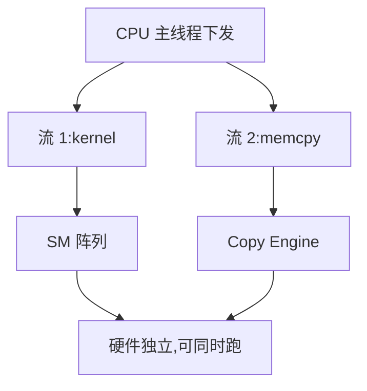

# CUDA 流与异步执行

> 🔴 重点考点:本篇是当前复习重点,文末「面试考点串联」给出问法对照。

一句话:CPU 和 GPU 是两台**各干各的机器**,stream 就是 CPU 递给 GPU 的一条条任务队列——异步执行的全部功夫,都在于让这两台机器谁都别停下来等对方。

## 一、先搞清楚"异步"到底异步在哪

写 `kernel<<<g, b>>>(...)` 这一行时,CPU 做的事情是:**把这个任务的描述塞进一个队列,然后立刻返回**。GPU 什么时候真正开始算、算没算完,CPU 一概不知道。

> **类比**:CPU 是点菜的服务员,GPU 是后厨。服务员把菜单贴到后厨的挂单栏上就转身走了,不会站在窗口盯着厨师炒完这道菜。

为什么非要这么设计?因为**下发一次任务的 CPU 侧开销在几微秒量级**,而很多 kernel 本身也只跑几微秒到几十微秒。如果每下发一个就等它跑完,时间会被"下发—等待—再下发"的往返吃掉一大半,GPU 大部分时间在空转。异步下发让 CPU 能**跑在 GPU 前面**:趁 GPU 还在算第 3 个 kernel,CPU 已经把第 10 个塞进队列了。

这就引出一个贯穿全文的心智模型:**队列深度**。健康状态是队列里始终压着一堆待办任务,GPU 做完一个立刻拿下一个;一旦队列被排空,GPU 就得停下来等 CPU 递活,profiler 上就出现一段空白(gap)。

哪些操作天生是异步的:kernel launch、`cudaMemcpyAsync`(前提见第三节)、`cudaMemsetAsync`。哪些天生是同步的:`cudaMemcpy`(不带 Async 的版本)、`cudaDeviceSynchronize`、`cudaStreamSynchronize`。

## 二、stream:一条按序的队列,队与队之间可以并发

### stream 的定义只有两条规则

1. **同一条 stream 内,操作严格按下发顺序执行**,前一个没做完,后一个不会开始(in-order 队列)
2. **不同 stream 之间没有任何顺序保证**,硬件资源允许时它们就并发跑

记住这两条,几乎所有 stream 相关的问题都能推出来。所谓"多流并行",本质就是**开多条互不相干的队列,让 GPU 有更多可以同时调度的独立任务**。

并发发生在三个层次上:

| 并发层次 | 说的是什么 | 需要什么条件 |
|---|---|---|
| host 与 device 并发 | CPU 下发完就走,不等 GPU | 用异步 API(这是默认行为) |
| kernel 之间并发 | 多个 kernel 同时占用 SM | 分属不同 stream,且**单个 kernel 吃不满整卡** |
| 传输与计算并发 | 搬数据的同时在算 | 分属不同 stream + host 内存是 pinned |



### 关键提醒:并发是"允许",不是"承诺"

面试里很容易答漏这句。开了 4 条 stream 不等于快 4 倍——如果每个 kernel 本身就把 SM 占满了,它们照样**排队串行**,多流一点用没有。多流真正有价值的场景是:**每个任务都吃不满 GPU**(小 batch decode、大量小算子),或者**任务用的是不同硬件单元**(计算 vs 拷贝 vs 通信)。

### 默认流的坑(高频追问)

不指定 stream 时,任务进的是**默认流**,也叫 **legacy default stream / NULL stream**。它的特殊之处在于:**它是一条 blocking stream**——往它里面下发任何操作,会先等所有其它 blocking stream 干完;反过来,其它 blocking stream 也要等它干完。

后果就是那个经典翻车现场:开了几条 stream 想做重叠,中间不小心夹了一个没指定 stream 的操作,**所有流被这一下全串起来了**,重叠完全失效,而且代码看不出任何毛病。

两条出路(官方文档里都有):

- 用 `cudaStreamCreateWithFlags(&s, cudaStreamNonBlocking)` 建流——这样建出来的流**不与默认流互相同步**
- 编译时加 `nvcc --default-stream per-thread`(或在包含 CUDA 头文件前定义 `CUDA_API_PER_THREAD_DEFAULT_STREAM` 宏),让每个 host 线程有自己独立的默认流,不再共享那条全局 NULL 流

PyTorch 里所有算子默认下发在当前设备的默认流上,想做重叠要显式用 `torch.cuda.Stream()` 和 `with torch.cuda.stream(s):`。

## 三、cudaMemcpyAsync 背后发生了什么,以及 pinned memory

### 为什么传输能和计算重叠:copy engine 是独立硬件

GPU 上除了跑 kernel 的 SM 阵列,还有专门的 **DMA 引擎(copy engine)**,它是一套独立的硬件,专职在 host 内存和显存之间搬数据。**搬数据这件事从头到尾不占用 SM**,所以传输和计算在物理上就是可以同时发生的。

数据中心卡通常配**两个 copy engine,H2D 和 D2H 各一个方向**(`cudaDeviceProp::asyncEngineCount` 报告数量),所以"一边往上传下一批数据、一边往下取上一批结果、同时 SM 在算当前这批"三件事可以真正同时跑。

### pinned memory:不是可选项,是前提

操作系统的普通内存是**可分页的(pageable)**——OS 随时可能把某一页换到磁盘上,或者搬到别的物理地址。而 DMA 引擎干活时**绕过 CPU 直接按物理地址搬数据**,它没法应对"我正在搬的这页突然被挪走了"。

**pinned memory(页锁定内存,`cudaHostAlloc`/`cudaMallocHost` 分配)**就是告诉 OS:这块内存钉死在物理内存里,永远不许换页。这样 DMA 才能拿到一个稳定的物理地址,直接搬。

那么不用 pinned 会怎样?这是本节的核心考点:

> 从**可分页内存**发起 `cudaMemcpyAsync`,驱动没法直接 DMA,只能先把数据拷到自己内部的一块 pinned 暂存区(staging buffer),再从那里 DMA 到显存。多了一次 CPU 参与的内存拷贝,而且**这个函数会失去异步性**。CUDA 官方文档的措辞是:涉及可分页内存时,该函数**"可能对 host 是同步的"**(might be synchronous with respect to host);如果需要经 pinned 暂存,驱动**可能与该流同步**。

翻译成人话:**你写了 Async,但它退化成了同步行为**——CPU 卡在这里等,重叠没了,而且还白白多付一次内存拷贝。这是"明明用了异步 API 却没有任何加速"的头号原因。

| | 可分页内存(pageable) | 页锁定内存(pinned) |
|---|---|---|
| DMA 能否直接搬 | ❌ 要先拷到驱动的暂存区 | ✅ 直接搬 |
| `cudaMemcpyAsync` 行为 | **可能退化为同步** | 真异步,立刻返回 |
| 有效带宽 | 明显更低(多一次 CPU 拷贝) | 打满 PCIe / NVLink |
| 分配开销 | 快(就是普通 malloc) | 慢,要走驱动做页锁定与注册 |
| 代价 | 无 | **占住物理内存,不可换页** |

**pinned 不是越多越好**:页锁定的内存 OS 收不回去,分配过量会挤压系统可用内存,让别的进程频繁换页,**拖慢的是整台机器**,严重时直接触发 OOM。实践中的做法是**分配一块固定大小的 pinned 缓冲区反复复用**,而不是每次传输都新分配一块。

PyTorch 对应写法是一对,**必须成对出现才有意义**:DataLoader 开 `pin_memory=True`(让 host 侧张量落在 pinned 内存),搬运时写 `.to('cuda', non_blocking=True)`。只写 `non_blocking=True` 而源张量不是 pinned,等于白写。

## 四、同步点:危害在哪、什么时候必须留、什么时候消收益最高

### 危害:流水线被打断,GPU 出 gap

一个同步点做的事情是**把 CPU 钉在原地,直到 GPU 追上来**。它的伤害是双份的:

1. **CPU 停止下发** → 队列深度一路掉到 0 → GPU 干完手头的活就没事干了,出现 gap
2. **同步解除后要重新填队列** → GPU 得等 CPU 重新下发第一个任务,这段启动延迟每次都要重付一遍

所以同步点的代价**不等于"等待的那一下"**,而是"等待 + 之后重新把流水线灌满"。在小 kernel 密集的场景下,后半部分往往比前半部分还贵。

### 但不是所有同步都要消——这些必须留

面试问"一定要消同步点吗",标准答案是**不**。同步点存在是为了正确性,该留的必须留:

- **要把结果给 CPU 用**:写日志、存 checkpoint、根据数值决定控制流——数据不搬回来就是没有
- **计时**:异步下发不代表执行完,不 sync 测出来的是 launch 耗时,不是执行耗时
- **复用或释放 host 侧缓冲区之前**:DMA 可能还在读那块内存,提前覆盖就是数据竞争,结果随机错
- **调试**:`CUDA_LAUNCH_BLOCKING=1` 是**故意**把异步变同步,好让报错栈指向真正出问题的那行

真正要做的不是"删掉同步",而是**把同步换成更细的粒度**。同步有三档,能用细的就别用粗的:

| API | 等谁 | 什么时候用 |
|---|---|---|
| `cudaDeviceSynchronize` | 等整张卡上所有流 | 几乎总能换成更细的;这是最该被消掉的一档 |
| `cudaStreamSynchronize` | 只等一条流 | 确实要拿这条流的结果时 |
| `cudaEventSynchronize` / `cudaStreamWaitEvent` | 只等流里的一个**点** | 表达跨流依赖的首选 |

### 什么场景消同步点收益最高

| 场景 | 收益 | 为什么 |
|---|---|---|
| **小 kernel 密集**(decode 阶段、一堆逐元素小算子) | **最高** | 单个 kernel 只跑几微秒,同步造成的 gap 可能比 kernel 本身还长,GPU 利用率直接掉到个位数 |
| **CPU 侧还有活可干**(数据预处理、下一批的 launch) | **高** | 同步等于把 CPU 钉死,本来可以提前干完的活全被推迟,CPU 反而成了瓶颈 |
| **本可多流重叠**(传输与计算、通信与计算) | **高** | 一个全局 sync 会把所有流拉平到同一个时间点,重叠机会归零 |
| 单个 kernel 就跑几十毫秒的大计算 | 低 | 几微秒的同步开销被摊薄到 1% 以下,消了也看不出来 |
| 一个 epoch 才触发一次的地方 | 可忽略 | **频率决定影响**,不是"看见同步就是错" |

一句话总结判据:**同步的伤害 ≈ 同步频率 × 单次 gap,而 gap 的大小取决于队列被排空后有多难重新灌满**。

## 五、怎么消同步点、怎么做 overlap

### 手段一:用 event 表达依赖,代替全局 sync

CUDA event 是**插在流里的一个标记**。它能干两件事:让 CPU 等(`cudaEventSynchronize`),以及**让另一条流在 GPU 侧等**(`cudaStreamWaitEvent`)——后者是关键,因为它只让 GPU 排队,**host 立刻返回,继续下发**。

```cuda
cudaStream_t s1, s2;  cudaEvent_t done;
cudaStreamCreateWithFlags(&s1, cudaStreamNonBlocking);   // 别用默认流
cudaStreamCreateWithFlags(&s2, cudaStreamNonBlocking);
cudaEventCreate(&done);

cudaMemcpyAsync(d_a, h_a, n, cudaMemcpyHostToDevice, s1); // h_a 必须是 pinned
kernel_a<<<g, b, 0, s1>>>(d_a);
cudaEventRecord(done, s1);            // 在流 1 上打一个"这里算完了"的标记

cudaStreamWaitEvent(s2, done, 0);     // 流 2 在 GPU 侧等这个点;host 不停
kernel_b<<<g, b, 0, s2>>>(d_a, d_c);  // 与流 1 后续的活可以并发

// ... CPU 继续下发别的任务,队列保持有深度 ...
cudaStreamSynchronize(s2);            // 只在真正要用结果时才等
```

### 手段二:干掉隐式同步

最难查的同步点都是**你没写 sync 但它偷偷同步了**的。PyTorch 里的常见来源:

| 会同步的写法 | 为什么 | 改法 |
|---|---|---|
| `loss.item()` / `.cpu()` / `.tolist()` / `float(t)` | D2H 取值,必须等 GPU 算完 | 在 GPU 上累加,循环外取一次 |
| `print(tensor)`、`assert t.sum() > 0` | 打印和断言都要读到实际数值 | 只在调试期开,或按 N 步采样 |
| `if t > 0:` 这类 host 侧分支 | 控制流依赖 GPU 上的数 | 改成 `torch.where` / 掩码,在 GPU 上做 |
| `torch.nonzero(t)`、`x[mask]`、`torch.unique` | **输出形状取决于数据**,必须把 size 拉回 host 才能分配输出 | 改用固定形状 + 掩码,或接受这次同步 |
| `cudaMemcpy`(不带 Async)、非 pinned 源的 `non_blocking=True` | 见第三节 | 换 pinned + `cudaMemcpyAsync` |
| `torch.tensor(标量, device='cuda')` 放在热循环里 | 每次都触发一次 H2D | 循环外建好张量复用 |

核心思路是同一条:**别把 GPU 上的数拉回 host 做判断**。要么把判断挪到 GPU 上(`torch.where`、掩码、GPU 上累加),要么**延后**——日志、指标这类不影响计算的东西,攒到几十步之后一次性取回来。

排查工具:`torch.cuda.set_sync_debug_mode("warn")` 会在触发同步时报警,`"error"` 直接抛异常。把训练步包在里面跑一遍,能把散落的 `.item()` 揪出来(注意官方说明它覆盖不全,不含 `torch.distributed` 等)。

另一类 launch 开销问题——小算子太多、CPU 下发根本跟不上——靠消同步点解决不了,那是把整段固定序列打包成一次提交的活,见「CudaGraph」篇。

### 手段三:分块流水,把大传输切成小块

多流 + event 只是搭好了框架,真正让传输"藏进"计算里的是**分块(chunking)**:把一次大传输切成 N 块,第 k 块传完就立刻开算,同时开始传第 k+1 块。

假设传输和计算耗时相当,各占 4 个时间片,切成 4 块后:

| 时间片 | 1 | 2 | 3 | 4 | 5 |
|---|---|---|---|---|---|
| Copy Engine | 传块 1 | 传块 2 | 传块 3 | 传块 4 | — |
| SM 阵列 | — | 算块 1 | 算块 2 | 算块 3 | 算块 4 |

总耗时从 **8 片降到 5 片**:只剩首尾两次"填流水线 / 排空流水线"的空转。**块分得越多,首尾占比越小**;但块太小,每块的传输和 kernel 都跑不满硬件,launch 开销反而占主导——所以块大小要实测调。

重叠的天花板也很清楚:**理想情况下总时间 = max(总传输时间, 总计算时间)**,谁长谁说了算。如果传输本来就比计算慢一倍,再怎么重叠也快不过传输。

集合通信(AllReduce 等)与计算的重叠是同一套思路的延伸——通信走的是又一套独立引擎,细节见「集合通信」篇。

### 最后一条:计时必须 sync 或用 event

异步下发的直接后果是:`t0 = time(); kernel(); t1 = time()` 测出来的是**下发耗时**,通常只有几微秒,和真实执行时间毫无关系。正确做法是计时前后 `cudaDeviceSynchronize()`(或 `torch.cuda.synchronize()`),或者用 `cudaEventRecord` 在流里前后各打一个点、用 `cudaEventElapsedTime` 取差值——后者更准,因为它测的是 GPU 时间线上的间隔,不含 host 抖动。profiler 里怎么看 gap 和同步点,见「性能分析与Profiling」篇。

## 六、面试考点串联

| 高频问法 | 本文哪一节 |
| --- | --- |
| 什么是 stream?stream 之间是怎么并行的? | 二(两条规则 + 三个并发层次) |
| 开了多流为什么没变快? | 二(并发是"允许"不是"承诺";默认流把所有流串起来了) |
| 默认流有什么特殊的?怎么避开它的坑? | 二(legacy NULL stream 是 blocking stream;`cudaStreamNonBlocking` / per-thread) |
| 同步点的危害是什么? | 四(队列排空 + 重新灌满的双份代价) |
| 一定要消同步点吗?什么场景消收益最高? | 四(该留的必须留;小 kernel 密集 / CPU 有活 / 本可重叠三种高收益场景) |
| 怎么消同步点? | 五(event 换全局 sync;干掉隐式同步;判断挪到 GPU 或延后) |
| PyTorch 里哪些写法会偷偷同步? | 五(`.item()`、`print`、host 分支、动态 shape 算子) |
| 异步传输一定要用 pinned memory 吗?不用会怎样? | 三(退化为同步 + 多一次 CPU 拷贝) |
| `cudaMemcpyAsync` 背后发生了什么? | 三(DMA copy engine 独立于 SM,所以能与计算重叠) |
| 传输/通信怎么和计算 overlap? | 五(多流 + event 依赖 + 分块流水;上限是 max(传输, 计算)) |
| 怎么正确给 kernel 计时? | 五(必须 sync 或用 event) |

延伸阅读顺序:GPU架构与执行模型(硬件底座)→ 本篇 → CudaGraph(消 launch 开销)→ 集合通信(通信与计算重叠)→ 性能分析与Profiling(怎么量出来)。

## 相关文献

- CUDA Programming Guide — Asynchronous Execution(stream 语义、默认流、event)— https://docs.nvidia.com/cuda/cuda-programming-guide/02-basics/asynchronous-execution.html
- CUDA C++ Programming Guide(旧版 Asynchronous Concurrent Execution 章)— https://docs.nvidia.com/cuda/cuda-c-programming-guide/
- CUDA C++ Best Practices Guide — Pinned Memory / Asynchronous and Overlapping Transfers — https://docs.nvidia.com/cuda/cuda-c-best-practices-guide/index.html#asynchronous-and-overlapping-transfers-with-computation
- CUDA Runtime API — API Synchronization Behavior(可分页内存下 `cudaMemcpyAsync` 措辞的出处)— https://docs.nvidia.com/cuda/cuda-runtime-api/api-sync-behavior.html
- CUDA Runtime API — Stream Synchronization Behavior(legacy 与 per-thread 默认流)— https://docs.nvidia.com/cuda/cuda-runtime-api/stream-sync-behavior.html
- NVIDIA 开发者博客 — How to Overlap Data Transfers in CUDA C/C++ — https://developer.nvidia.com/blog/how-overlap-data-transfers-cuda-cc/
- PyTorch 文档 — `torch.cuda`(含 `set_sync_debug_mode`、`Stream`、`Event`)— https://docs.pytorch.org/docs/main/cuda.html
