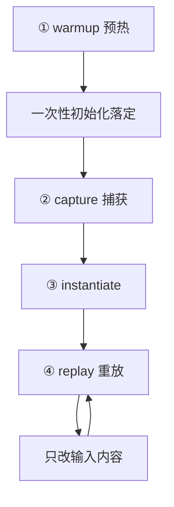

# CUDA Graph

> 🔴 重点考点:本篇直接对应真实面经高频问法,文末「面试考点串联」给出问法对照。

一句话:CUDA Graph 把"成百上千次 kernel 逐个下发"打包成"**一次提交、整图重放**",省掉的是 CPU 侧每次几微秒的下发开销——所以它**只在 kernel 又多又短的时候才有用**,代价是整张图的形状被彻底冻结。

## 一、它到底省掉了什么:launch 开销,以及"一定奏效吗"

### 省的是 CPU 侧的下发时间

每写一次 `kernel<<<...>>>`,CPU 都要做一遍固定动作:校验参数、打包 kernel 描述、写进流队列、通知驱动。这套动作**大约几微秒**,而 decode 阶段的小 kernel 本身也可能只跑几微秒。异步下发已经让 CPU 跑在 GPU 前面(见「CUDA流与异步执行」篇),但那只是把下发**藏起来**,没有把它**消掉**——当每个 kernel 的下发时间比它自己的执行时间还长时,GPU 就会追上 CPU,然后干等着队列被填。

CUDA Graph 的做法是把这堆下发动作**提前做完一次、存成一个可执行对象**,之后每步只提交这一个对象。NVIDIA 官方博客给的实测(V100,20 个 kernel × 1000 步,单个 kernel 执行 2.9 μs):

| 下发方式 | 每 kernel 实测耗时 |
|---|---|
| 每次 launch 后同步 | 9.6 μs |
| 纯异步、重叠下发(eager 常态) | 3.8 μs |
| **CUDA Graph 重放** | **3.4 μs** |

注意两件事:一是从 3.8 降到 3.4,**只快了约 12%**,不是数量级提升;二是 kernel 自己只要 2.9 μs,说明**即使用了图,每个 kernel 仍有约 0.5 μs 的残余开销**——图重放不是免费的,只是比逐个下发便宜。另外建图 + 实例化本身约 400 μs,靠重复重放几千次才摊薄。

### 判据:什么时候有效,什么时候白干

在异步下发下,每个 kernel 的墙钟时间大致是 CPU 下发和 GPU 执行两者取大(谁慢谁是瓶颈)。用图把下发压到接近 0,则:

$$
\text{加速比上限} \approx \frac{\max(t_{\text{launch}},\ t_{\text{kernel}})}{t_{\text{kernel}}}
$$

这句话翻译成人话:**只有当"下发一个 kernel 的时间"比"这个 kernel 自己跑的时间"还长时,CUDA Graph 才有东西可省**;一旦 kernel 比下发慢,分子分母相等,加速比就是 1——一点收益也没有。

| 场景 | 收益 | 为什么 |
|---|---|---|
| **小 batch decode**(batch 1–8) | **最高** | 每层十几个 kernel、每个只跑几微秒,launch 占比可以过半 |
| 大量逐元素小算子(norm、激活、RoPE、残差) | 高 | 单个 kernel 又小又多,典型 launch-bound |
| CPU 弱 / Python 开销大 / 单机多卡抢一个主进程 | 高 | 下发端本来就跟不上,图把 CPU 的活直接砍掉 |
| 长 prefill、大 batch 训练 | **几乎为零** | 单个 GEMM 就跑几毫秒,几微秒的下发被摊到 0.1% 以下 |
| 本来就 memory-bound 且 kernel 够大 | 零 | 瓶颈在带宽,和谁下发无关 |

一句话记法:**CUDA Graph 治的是"CPU 喂不动 GPU"这个病,不治"GPU 自己算得慢"**。上图之前先看 profiler 里有没有大片 gap,没有 gap 就别指望它(怎么看见 gap 见「性能分析与Profiling」篇)。

## 二、原理:warmup → capture → instantiate → replay



**capture(捕获)**:进入捕获模式后,所有下发到这条流上的操作**不再真正执行**,而是被记录成一张 DAG(有向无环图)——节点是 kernel / memcpy / memset,边是它们之间的依赖(同一条流上的先后顺序就是依赖链,跨流的依赖靠 event 记录)。这一步的关键性质是:**所有东西按值记录**——kernel 的 grid/block 尺寸、每个指针参数的**具体地址**、每个标量参数的**当前数值**,全部被冻进图里。

**instantiate(实例化)**:把 DAG 编译成一个"可执行图",提前把每个节点的下发描述准备好、依赖关系解析好。省时间就省在这里——重放时驱动不用再逐个组装。

**replay(重放)**:一次 `cudaGraphLaunch`,整张图交给 GPU。CPU 从此不再参与逐个下发。

PyTorch 里的骨架长这样:

```python
# ① warmup:在侧流上 eager 跑几步,把一次性初始化全部触发掉
s = torch.cuda.Stream()
s.wait_stream(torch.cuda.current_stream())
with torch.cuda.stream(s):
    for _ in range(3):                        # DDP 场景官方要求 11 次
        out = model(static_input)             # 结果丢弃,只为触发初始化
torch.cuda.current_stream().wait_stream(s)

# ② capture:录 kernel 序列;static_input 的地址从此被冻结
g = torch.cuda.CUDAGraph()
with torch.cuda.graph(g, pool=shared_pool):   # pool 让多张图共用一个显存池
    static_out = model(static_input)

# ③ replay:每步只做"原地改内容 + 重放"
static_input.copy_(new_input)                 # 必须写回同一块地址,不能重新赋值
g.replay()
print(static_out)                             # 结果永远落在同一块 static_out 里
```

最容易犯的错在倒数第三行:写成 `static_input = new_input` 就变成了换指针,图里录的还是老地址——**不报错,但每步都在算同一批陈旧数据**。这是 CUDA Graph 最典型的静默 bug。

### 为什么捕获前必须 warmup

warmup 不是"跑热身让性能稳定"这么简单,它在干三件必须**发生在图外面**的事:

1. **触发一次性初始化**:cuBLAS / cuDNN handle 创建、GEMM 算法启发式选择与 autotune 选核、Triton / `torch.compile` 的 JIT 编译、NCCL 通信域建立
2. **让显存分配进入稳态**:第一次走到的路径会向 allocator 要新块(可能触发真正的 `cudaMalloc`);warmup 之后这些块已在缓存里,捕获时直接命中
3. **稳定时钟频率**:GPU 从低功耗态爬到稳定频率,前几次的耗时数据本来就不可信

**不 warmup 会怎样?** 上面这些动作会被**录进图里**:轻则图中多了一堆只该做一次的操作,每次重放都白跑;重则它们内部含有 host 侧同步(autotune 要测时间、handle 创建要等驱动),而捕获模式下遇到同步会**直接让捕获失败**。PyTorch 官方还额外要求 warmup 必须跑在**侧流**上(见上面代码),就是为了不污染将被捕获的那条流。

## 三、为什么按 batch 分档捕获,而不是按 seq

图的形状是冻结的,所以**不可能为一个连续变化的量建图**,只能挑少数**离散档位**各捕获一张。decode 时有两个会变的量,必须选一个当"分档变量":

| | batch size(同时解码几条) | seq 长度(每条已有多少 token) |
|---|---|---|
| 取值范围 | **有界且小**,1 到最大并发数(常见 ≤ 256) | 1 到 context length,几万甚至几十万 |
| 变化方式 | 请求进出时才变,变化不频繁 | **每步 +1**,而且每条序列各不相同 |
| 是不是一个标量 | 是,整个 batch 共用一个 | **不是**,是每条一个值的向量 |
| 能否 padding 上去 | ✅ 能,补 dummy 行算完丢弃,代价可控 | 补到 max_len 等于每步都算满上下文,代价爆炸 |
| 结论 | **拿它分档** | **不可能分档** |

所以实践中的做法是:**按 batch size 分成一组对数递增的档位,每档捕获一张图**;真实 batch 落在两档之间时**向上 padding 到最近的档**;超过最大档位就**回退 eager 执行**。vLLM 的默认档位就是 `[1, 2, 4] + range(8, 256, 8) + ...` 这种形状,SGLang 用一组 `capture_bs` 再靠二分查找定位档位,两家结构一致。

**那 seq 长度怎么办?** 靠"**预分配 + 传参数**"把它从形状里挪出去:

- KV cache 按**最大长度预分配**(分页管理见「PagedAttention」篇),地址固定不变
- 每条序列的**实际长度**存在一个形状为 `[max_batch]` 的**设备端张量**里,当普通参数传给 attention kernel
- kernel 内部读这个张量决定循环多少步

于是"长度变化"就变成了**张量里的数值变化**,而张量的地址和形状从头到尾没动过——图完全不知道长度变了。这也是下一节的核心:**图冻结的是地址和形状,不是内容**。

## 四、能变的和不能变的:动态性的确切边界

| 项目 | 重放之间能不能变 | 为什么 |
|---|---|---|
| 张量里的**数值内容** | ✅ 能 | 图记的是地址,kernel 运行时读到的是当下的内容 |
| **KV cache 的内容** | ✅ 能 | 同上。decode 每步往 KV 里写新 token 完全没问题 |
| 有效序列长度、block 表 | ✅ 能(间接) | 放在设备端张量里当参数传,形状不变、只变数值 |
| 输入张量的**地址** | ❌ 不能 | 按值录进图了,只能 `copy_` 原地写回同一块 |
| 张量**形状** | ❌ 不能 | grid/block 尺寸、指针偏移全被冻结 |
| kernel 启动配置、标量参数 | ❌ 不能(除非显式 update) | 捕获期按值记录 |
| **host 侧 if / `.item()` / `print`** | ❌ 不能 | 图里根本没有 host 参与 |

**"kvcache 一直在变还能生效吗?"——能,而且这正是设计目标。** 变的是内容,不是地址;只要预分配好、原地写,图完全无感。

**"图里能有同步点吗?"——不能。** 捕获期间任何依赖 host 的操作都是非法的:`cudaDeviceSynchronize`、不带 Async 的 `cudaMemcpy`、`.item()` / `.cpu()` 取值、根据 GPU 上的数在 host 侧走 if、输出形状取决于数据的算子(`nonzero`、`x[mask]`)。它们要么让捕获直接报错,要么更糟——捕获时那一次的判断结果被**当成常数录进图**,之后每次重放都按那个陈旧结果走,静默算错。所以上图前的必修课,就是先把这些隐式同步清干净(清单见「CUDA流与异步执行」篇)。

需要有限动态性时,官方给了三条逃生口,但都不改变"形状固定"这条底线:重录后用 `cudaGraphExecUpdate` 做整图更新(拓扑不变就不用重新实例化)、按参数组合缓存多张图、以及新版的**条件节点**(IF/WHILE/SWITCH,把分支判断放到设备端做)。

## 五、显存:图有自己的池,和常规池不能混用

### 捕获期的分配走图专属池

PyTorch 的 caching allocator 会**检测到捕获正在进行**,把这期间的所有分配转到一个**图私有池**里。为什么必须这样?因为图重放时,kernel 用的是捕获那一刻记下的**绝对地址**:

- 如果这块显存被常规 allocator **释放归还**,下次重放就是非法访存,直接崩
- 如果被**分给了别的张量**,重放会安静地写坏别人的数据,或读到垃圾——不报错,结果全错

所以这块地址必须**跨所有重放一直有效**。PyTorch 的规则是:图私有池活到 `CUDAGraph` 对象和捕获期创建的所有张量都析构为止。这就是"cudagraph 的存储不能和常规 PyTorch 显存池共用"的确切原因——**不是不想共用,是地址生命周期的要求根本不兼容**。

### 多张图之间可以共享一个池

默认每次捕获建一个独立私有池,最保险但很浪费:几十个 batch 档位就是几十份中间张量。所以 PyTorch 提供 `graph_pool_handle()`,把同一个 pool token 传给多次捕获,**让多张图共用一块显存**——依据是同一条流上的图不会并发执行,内存可以复用。SGLang 就是这么做的:进程内维护**一个全局图内存池**,所有档位的图捕获都往里挤。代价是共享的图之间必须由你保证重放不会互相踩(PyTorch 文档特别提醒 `make_graphed_callables` 传入的顺序必须和实际运行顺序一致)。

### 为什么开了 cudagraph 更容易 OOM

三个原因叠在一起:

1. **每个档位一张图**,档位越多,要常驻的中间张量越多
2. **图池里的中间张量不释放**——常规 eager 下,一层算完中间结果就还给 allocator 复用;在图里它们必须常驻,因为地址被冻结了。峰值由**最大档位**的激活量决定
3. **图池占的显存,KV cache 就用不上了**。推理引擎通常把"剩余显存"全部划给 KV cache,图池吃掉一块,能装的 KV 就少一块 → 最大并发数下降,或者启动时直接 OOM

对策也就三条:调小最大捕获 batch(SGLang 的 `--cuda-graph-max-bs`)、减少档位数量、多图共享同一个池。显存总账怎么算见「显存管理与OOM」篇。

## 六、Eager 与 CUDA Graph 的差异,以及推理里用在哪

| 维度 | Eager 逐个下发 | CUDA Graph 重放 |
|---|---|---|
| CPU 侧工作量 | 每个 kernel 一次 launch,几微秒 | 整图一次提交,每 kernel 摊薄到亚微秒 |
| 形状 | 每步可以不一样 | **冻结**,一张图只服务一种形状 |
| 控制流 | 可以有 host 侧 if、`.item()` | **不允许**,捕获失败或静默走错分支 |
| 显存 | 常规 caching allocator,用完即还 | 图专属池,地址常驻不释放 |
| 首次开销 | 无 | warmup + capture + instantiate,每档一次 |
| 调试 | 报错栈直指出错那行 | profiler 里只看到一个图节点,难定位 |
| 典型翻车 | — | 换指针而非原地写 → 静默算旧数据 |
| 适用阶段 | prefill、训练、形状多变 | **decode**、形状规整、kernel 碎 |

**大模型推理里用在哪:只用在 decode。** 理由三条正好对上前面各节:decode 每步只产 1 个 token,单个 kernel 极小、数量极多,**launch 占比最高**(第一节);decode 的形状只由 batch 决定,**可以分档冻结**(第三节);而 prefill 的输入长度千变万化,分档要么档位爆炸要么 padding 浪费算力,通常直接不上图。

**哪些操作最适合被纳入**:线性层(QKV 投影、MLP)、LayerNorm / RMSNorm、激活、RoPE、残差加——这些算子的形状**只由 batch 决定**,天然满足冻结要求。最难纳入的是 **attention**:它的行为依赖每条序列的实际长度和 block 表,必须由 backend 专门改造成"形状固定 + 元数据全走设备端张量"才能被捕获。现代引擎的图友好 backend 已经做到了这一点,所以实践中是**整个 decode step 一起捕获**,而不是只捕获一部分。

和 `torch.compile` 的关系要分清:两者解决的是**不同层面**的问题——compile 优化的是 kernel 本身(融合、选核、去掉 Python 开销),CUDA Graph 优化的是**提交方式**。PyTorch 把两者串起来的开关是 `mode="reduce-overhead"`,它在编译产物之上自动套一层 CUDA Graph(实现叫 CUDAGraph Trees,对每个不同输入形状**重新录一张图**,并让所有图共用一个内存池)。细节见「TorchCompile」篇。

## 七、面试考点串联

| 高频问法 | 本文哪一节 |
|---|---|
| CUDA Graph 的好处是什么? | 一(把 N 次下发合成 1 次提交) |
| 一定奏效吗?什么场景优势明显? | 一(加速比上限公式;小 batch decode 最高,大 kernel 几乎为零) |
| 原理是怎么做的? | 二(capture 成 DAG → instantiate → replay;所有参数按值冻结) |
| capture 时以 batch 还是 seq 为变量?为什么不用另一个? | 三(batch 有界可 padding;seq 每步 +1 且是逐条向量,不可能分档) |
| seq 长度一直在变,怎么绕过去? | 三(预分配到 max_len + 长度放设备端张量当参数传) |
| capture 时怎么复用 HBM? | 五(图私有池;多图共享一个 pool token) |
| CUDA Graph 里可以有动态性吗? | 四(内容可变、地址与形状不可变的完整边界表) |
| kvcache 一直在变,cudagraph 还能生效吗? | 四(能——变的是内容不是地址,这正是预分配的意义) |
| 图里能有同步点吗? | 四(不能;`.item()` / host 分支会让捕获失败或静默录成常数) |
| eager 和 cudagraph 有什么差异? | 六(八维对照表) |
| 推理时哪个阶段、哪部分操作用 cudagraph? | 六(decode 阶段;线性层/norm/激活天然可捕获,attention 需 backend 配合) |
| 推理为什么要 warmup?warmup 在干什么? | 二(触发 JIT/autotune/handle、稳定显存与时钟;不做会把一次性动作录进图) |
| cudagraph 的存储能和常规显存池共用吗?为什么? | 五(不能;地址必须跨重放保持有效) |
| 开了 cudagraph 为什么更容易 OOM? | 五(每档一张图 + 中间张量常驻 + 挤占 KV cache) |

延伸阅读顺序:CUDA流与异步执行(先搞懂 launch 与同步)→ 本篇 → TorchCompile(编译层怎么自动套图)→ 显存管理与OOM(图池怎么算进总账)。

## 相关文献

- CUDA Programming Guide — CUDA Graphs(定义/实例化/执行三阶段、流捕获、图内存节点、条件节点)— https://docs.nvidia.com/cuda/cuda-programming-guide/04-special-topics/cuda-graphs.html
- NVIDIA 开发者博客 — Getting Started with CUDA Graphs(9.6 / 3.8 / 3.4 μs 实测数据出处)— https://developer.nvidia.com/blog/cuda-graphs/
- NVIDIA 开发者博客 — Employing CUDA Graphs in a Dynamic Environment(重录 + `cudaGraphExecUpdate`、按配置缓存图)— https://developer.nvidia.com/blog/employing-cuda-graphs-in-a-dynamic-environment/
- NVIDIA 开发者博客 — Constructing CUDA Graphs with Dynamic Parameters — https://developer.nvidia.com/blog/constructing-cuda-graphs-with-dynamic-parameters/
- NVIDIA 开发者博客 — Dynamic Control Flow in CUDA Graphs with Conditional Nodes — https://developer.nvidia.com/blog/dynamic-control-flow-in-cuda-graphs-with-conditional-nodes/
- NVIDIA — CUDA Graph Best Practice for PyTorch — https://docs.nvidia.com/dl-cuda-graph/reference.html
- PyTorch 文档 — CUDA semantics · CUDA Graphs(侧流 warmup、图私有池、`graph_pool_handle`)— https://docs.pytorch.org/docs/stable/notes/cuda.html
- PyTorch 博客 — Accelerating PyTorch with CUDA Graphs — https://pytorch.org/blog/accelerating-pytorch-with-cuda-graphs/
- PyTorch 文档 — CUDAGraph Trees(`torch.compile` 的 reduce-overhead 模式如何按形状重录并共用内存池)— https://docs.pytorch.org/docs/main/user_guide/torch_compiler/torch.compiler_cudagraph_trees.html
