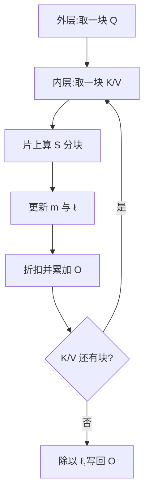

# FlashAttention

> 🔴 重点考点:本篇直接对应真实面经高频问法,文末「面试考点串联」给出问法对照。

一句话:FlashAttention 是**精确**注意力(不是近似、不丢任何一项),它唯一做的事情是**不让那张 $L \times L$ 的注意力矩阵落进显存**——靠分块 + 在线 softmax,把四个算子融成一个 kernel,算的还是同一个结果,搬的数据少了好几倍。

## 一、动机:注意力慢在"搬那张大表",不在算

### 标准注意力要走四趟显存

标准写法是 $O = \mathrm{softmax}\!\left(QK^\top/\sqrt{d}\right)V$,在 GPU 上被拆成三个独立 kernel,中间量必须落显存:

1. **kernel A**:算 $S = QK^\top/\sqrt{d}$,把 $L \times L$ 的 $S$ **写回 HBM**
2. **kernel B**:**读回 $S$**,做 softmax(还要 mask、dropout),把同样大的 $P$ **写回 HBM**
3. **kernel C**:**读回 $P$**,算 $O = PV$

那张 $L \times L$ 的表被**写两遍、读两遍**,一共四趟 HBM。而它是个纯中间产物——最终输出 $O$ 只有 $L \times d$ 那么大。

### 算一笔账:多离谱

取长序列推理/训练里很常见的一组数:序列 $L = 8192$、单头维度 $d = 128$、fp16。**下面全部按"一个头、一层"计**。

| 项 | 大小 |
|---|---|
| $L \times L$ 的 $S$(或 $P$) | $8192^2 \times 2\text{B} = 128$ MiB |
| 四趟(写 S、读 S、写 P、读 P) | **512 MiB** |
| $Q, K, V, O$ 四个张量合计 | $4 \times 8192 \times 128 \times 2\text{B} = 8$ MiB |

**中间量的流量是输入输出的 64 倍**。而这一层的计算量只有 $4L^2d = 34.4$ GFLOP(两个矩阵乘各 $2L^2d$)。放到 A100 上对一下:

- 算:按 fp16 Tensor Core 实测 200 TFLOPS 量级 → 约 **172 µs**
- 搬:537 MB ÷ 实测有效带宽 1.5 TB/s → 约 **358 µs**

搬运时间是计算时间的两倍多。换成算术强度看得更清楚:

$$
I = \frac{34.4 \times 10^9\ \text{FLOP}}{5.37 \times 10^8\ \text{Byte}} \approx 64\ \text{FLOP/Byte}
$$

这个数远低于 A100 的拐点 153 FLOP/Byte(bound 怎么判定见 Roofline与Bound分析 篇),所以**注意力本身是访存受限的**——GPU 的 Tensor Core 有一大半时间在等 $S$ 从显存爬回来。

一个必须记牢的推论:**优化注意力的方向不是"少算几次乘法",而是"别把这张表搬来搬去"**。计算量一分不减,时间照样能砍掉大半。顺带还有第二个问题:$O(L^2)$ 的中间量不只是慢,它还**存不下**——$L$ 翻倍 $S$ 就变四倍,训练时反向还要一直留着,这是长上下文早期最硬的墙。

## 二、核心机制:tiling + online softmax

### tiling:让中间结果只活在片上

把 $Q$ 沿行切成块、$K/V$ 沿行切成块,两层循环:外层遍历 $Q$ 块,内层遍历 $K/V$ 块。每一步只把三个小块从 HBM 载入 **shared memory**(每 SM ~164 KB,比 HBM 快一个数量级,见 GPU架构与执行模型 篇),在片上算出 $S$ 的一个小分块、直接吃掉它、累加到输出上,**这个分块从头到尾没有离开过 SM**。块大小是按 shared memory 容量倒推的:要同时装下 $Q$ 块、$K/V$ 块和 $S$ 分块,典型是 64 或 128 行。

### 卡点在 softmax:分母要看完整行

分块本身不难,难的是 softmax **不是逐元素操作**——它要除以整行的指数和,而整行分散在所有 $K$ 块里。天真做法只能等扫完所有块才知道分母,那就必须把整行的 $S$ 存下来,又回到原点。

**online softmax** 解决的就是这个:边扫边维护两个统计量(当前见过的最大值 $m$、当前的指数和 $\ell$),每来一个新块就把之前的结果"重定标"一次。

### 递推公式

设行方向已经扫完 $j-1$ 个 $K/V$ 块,现在来第 $j$ 块,其分数矩阵为 $S_j$:

$$
m_j = \max\bigl(m_{j-1},\ \mathrm{rowmax}(S_j)\bigr), \qquad
\ell_j = e^{\,m_{j-1}-m_j}\,\ell_{j-1} + \mathrm{rowsum}\bigl(e^{\,S_j-m_j}\bigr)
$$

**人话**:第一式是"最大值只增不减,拿新块的行最大值去挑战旧纪录";第二式是"旧的分母先按新纪录打个折 $e^{m_{j-1}-m_j}$,再把新块的贡献加进来"。因为最大值变大了,旧的那些指数项相对而言都该变小,折扣系数正好补上这个差。

输出用同一个折扣系数同步更新:

$$
O_j = e^{\,m_{j-1}-m_j}\,O_{j-1} + e^{\,S_j-m_j}\,V_j, \qquad O = \ell_J^{-1}\,O_J
$$

**人话**:$O_j$ 是**未归一化**的加权和——每来一块,先把已累加的部分打折对齐到新的最大值,再加上新块的 $\exp \times V$。全部块扫完后**只在最后除一次** $\ell_J$。这样 $O$ 始终是 $L \times d$ 的小块,而 $L \times L$ 的 $S_j$ 用完即弃。

### 为什么数学上完全等价

关键只有一个恒等式:

$$
e^{\,x-m_{j-1}} \times e^{\,m_{j-1}-m_j} = e^{\,x-m_j}
$$

**人话**:用旧最大值算出来的每一项,乘上折扣系数后,和"一开始就用新最大值算"得到的结果**一模一样**。所以重定标不是近似,是精确的代数改写——分子分母被同一个正数缩放,softmax 的值不变。这就是为什么 FlashAttention 敢叫 **exact attention**:它和逐位对齐的标准实现只有浮点舍入级别的差异,不是近似算法(和 Linformer / Performer 那类低秩、核近似有本质区别)。

减去最大值这件事本身也不是为了省事,而是**数值稳定**:$e^{S}$ 在 fp16 下极易溢出,减最大值后指数最大是 $e^0 = 1$。

### 省了多少

论文给出的 HBM 访问复杂度对比($M$ 是 SRAM 容量):

$$
\Theta\bigl(Ld + L^2\bigr) \quad \longrightarrow \quad \Theta\!\left(\frac{L^2 d^2}{M}\right)
$$

**人话**:标准实现的访存量被 $L^2$ 那一项统治;FlashAttention 里 $K/V$ 会被外层每个 $Q$ 块重读一次,所以是 $L^2$ 乘上一个和"块能装多少"有关的系数 $d^2/M$。在常见的 $d = 64$–$128$、$M \approx 100$ KB 下,$d^2$ 比 $M$ 小很多,整体是**几倍到十倍**的访存下降。回到前面那笔账:强度从 64 FLOP/Byte 跳到几百,**越过拐点,attention 从访存受限变成计算受限**——这才有了 v2/v3 继续压榨算力利用率的空间。

显存侧同样受益:需要长期保留的中间量从 $O(L^2)$ 降到 $O(L)$(每行只存一个标量统计量,见下节)。

> 一句话定性:**FlashAttention 就是把 `QK^T → scale/mask → softmax → PV` 四个算子融成一个 kernel、让最大的中间张量彻底不落显存——算子融合思想在 attention 上的极致案例**,通用的融合账本见 算子融合 篇。

## 三、反向传播:为什么是重算,而不是存下来

### 存中间量等于自废武功

反向要算 $dQ, dK, dV$,数学上绕不开 $S$ 和 $P$。最直觉的做法是前向把它们存下来给反向用——但这**正好把前向省下的东西又还回去了**:$O(L^2)$ 的中间量重新落显存,访存量、显存占用一起打回原形。FlashAttention 的全部收益建立在"这张表不存在"上,存下来就没有意义了。

FlashAttention 前向真正存下来的只有两样:输出 $O$($L \times d$),以及每行一个标量的 logsumexp 统计量 $L_{\text{se}} = m + \log \ell$——**$O(L)$ 量级**。反向时用它就能在片上重新恢复出任意分块的 $P$,不需要再走一遍 online 递推。

### 重算要多付多少 FLOPs

按每头 $L^2 d$ 为单位数(忽略 softmax 等非矩阵乘部分):

| 阶段 | 矩阵乘 | FLOPs |
|---|---|---|
| 前向 | $QK^\top$、$PV$ | $4L^2d$ |
| 标准反向 | $dV$、$dP$、$dQ$、$dK$ 四个 | $8L^2d$ |
| **重算的额外开销** | 反向里重做一次 $QK^\top$ | **$+2L^2d$** |

总量从 $12L^2d$ 涨到 $14L^2d$,**多约 17%**。

### 为什么净收益仍然是正的

因为省下来的是访存,而这两者的单价差着两个数量级:**从 HBM 取一个数 400–600 周期,做一次乘加只要几个周期**。多算 17% 的 FLOPs、换掉几倍的 HBM 流量,在访存受限的算子上这笔账怎么算都赚。这和激活重计算(gradient checkpointing)是同一个道理——**只不过 FlashAttention 的重算发生在 kernel 内部、数据全程在片上,连"重算的输入"都不用额外读**,比框架层的 checkpoint 还便宜。

一个容易被追问的细节:反向的循环顺序和前向不同(前向外层 $Q$、内层 $K/V$;反向为了让 $dK/dV$ 的累加落在同一个块里,外层走 $K/V$),因此 $dQ$ 会被多个块并发累加,需要原子加或额外的分区策略——这正是 v2 重新设计并行划分时动的地方之一。

## 四、v1 / v2 / v3:每一代解决什么

| 版本 | 目标硬件 | 核心痛点 | 主要手段 | 论文自报效果 |
|---|---|---|---|---|
| **v1**(2022) | Ampere | 中间矩阵反复过 HBM | tiling + online softmax + 反向重算 | GPT-2 训练快 3×、BERT-large 快 15%;显存 $O(L^2) \to O(L)$ |
| **v2**(2023) | Ampere | 算力利用率只有 25–40% | 减少非矩阵乘运算、加一维并行、改 warp 分工 | 比 v1 快约 2×,A100 上达峰值算力 50–73% |
| **v3**(2024) | **Hopper** | v2 在 H100 上只用到 35% | TMA 异步搬运、warp specialization、FP8 | 比 v2 快 1.5–2.0×,FP16 达 740 TFLOPS(75%),FP8 近 1.2 PFLOPS |

### v2 具体改了三件事

1. **减少非矩阵乘 FLOPs**。A100 上 fp16 矩阵乘峰值 312 TFLOPS,而非矩阵乘的 FP32 通用运算只有 19.5 TFLOPS——**每一个非矩阵乘 FLOP 贵 16 倍**。v1 每处理一个块都把输出除以当前的 $\ell$;v2 改成全程累加未归一化的 $O$、**最后只除一次**(就是第二节给出的形式),把大量除法从内循环里删掉。
2. **并行维度加一维**。v1 只在 batch × head 上并行;长序列 + 小 batch 时(比如 batch=1、L=32K)block 数量远少于 SM 数量,GPU 一大半车间空转。v2 额外在**序列长度维**上并行,把 $Q$ 的不同块分给不同 block。
3. **warp 间的工作划分(work partitioning)**。v1 在一个 block 内把 $K/V$ 切给 4 个 warp、$Q$ 共享,导致每个 warp 都要把自己那份中间结果写进 shared memory、同步、再相加。v2 反过来:**切 $Q$、共享 $K/V$**,每个 warp 独立负责若干输出行,**warp 之间不再需要交换中间结果**,省掉一大批 shared memory 读写和 barrier。

### v3 具体吃到了 Hopper 的什么

1. **TMA(Tensor Memory Accelerator)**:Hopper 上的专用搬运引擎,发一条指令就能异步把一整块数据从 HBM 搬进 shared memory,不占用计算 warp 的指令槽。
2. **warp specialization(生产者—消费者异步)**:把 warp 分成两拨角色——**生产者**只负责用 TMA 预取下一块 $K/V$,**消费者**只负责在 Tensor Core 上算当前块。搬运和计算真正重叠起来,而不是靠指令级的交错碰运气。
3. **matmul 与 softmax 交错(pingpong)**:softmax 跑在特殊函数单元上、矩阵乘跑在 Tensor Core 上,是两条独立流水线。v3 刻意让一个 warpgroup 做 softmax 时另一个做 matmul,**把非矩阵乘的部分藏到矩阵乘底下**。
4. **FP8**:配合分块量化(block quantization)与 incoherent processing(用 Hadamard 变换打散离群值)控制误差,论文报告在有离群特征时数值误差比 per-tensor 量化的 FP8 基线低 2.6×。

一句话记忆:**v1 解决"访存太多",v2 解决"算力没喂饱",v3 解决"新硬件的异步能力没用上"**。

## 五、和 PagedAttention 的关系:算得快 vs 存得省

### FA 的隐含假设:KV 在连续显存里

FlashAttention 的 kernel 是按"一整块连续内存"设计的:给一个基地址和 stride,就能算出第 $j$ 块 $K/V$ 在哪。变长 batch 也只是把多条序列**紧凑拼接**,额外传一个 `cu_seqlens`(累积序列长度)告诉 kernel 每条从哪开始。**本质仍然是连续的。** 这个假设在推理服务里会出问题:每条请求要预留到最大长度才能保证连续,显存碎片和浪费极大。

### PagedAttention 改的是"存在哪",不是"怎么算"

PagedAttention 借操作系统的分页思路,把 KV cache 切成固定大小的块(典型 16 个 token 一块)散落在显存各处,再用一张 **block table**(每条序列的逻辑块 → 物理块编号)把它们串起来。于是 kernel 的入参多了一样东西:**取第 $j$ 块 $K/V$ 之前,先查表拿到物理地址**。分页与块表的细节见 PagedAttention 篇。

| | FlashAttention | PagedAttention |
|---|---|---|
| 解决的问题 | attention **算得快**(访存/算力) | KV cache **存得省**(碎片/共享) |
| 手段 | tiling + online softmax + 融合 | 固定块 + 块表 + 按需分配 |
| KV 布局要求 | 连续(或紧凑拼接) | 任意分散 |
| kernel 额外入参 | `cu_seqlens` | **block table** |
| 省的是 | 时间 | 空间 |

### 它们不是二选一,现代引擎是结合使用

这是最容易答错的一点:两者**正交**。分页只改变了"K/V 块从哪里读",不改变 tiling 和 online softmax 的任何一步。所以主流做法是——**用 FlashAttention 的内核,吃分页布局的 KV**:kernel 在内层循环取块时多做一次块表查表,其余完全不变。

之所以代价很小,是因为**块表的粒度和 tile 的粒度对得上**:一个 16 token 的块对应一次(或几次)tile 加载,查表是"每块一次指针查找",不是"每个元素一次",相对于块内的搬运和计算完全可忽略。工程上 flash-attn 自身也提供了带 page/block table 入参的接口,vLLM、SGLang 这类引擎默认就是"FlashAttention(或 FlashInfer)内核 + 分页 KV"的组合。具体到某个引擎的调用路径,见开源解读模块。

## 六、chunked prefill 下的 attention 有什么不同

### 形态:变长 query + 变长 KV + causal 偏移

chunked prefill 把一条长 prompt 切成若干 chunk 分批送进模型(**为什么要这么调度**——平衡 TTFT 与吞吐、让 prefill 和 decode 混在一个 batch 里——见 连续批处理 篇)。它对 attention kernel 提出的要求是:一次前向里,**query 只有新 chunk 的那几百个 token,但要 attend 的 KV 是"已缓存的历史 + 本 chunk"**。于是出现了整段 prefill 里没有的情况——**query 长度 ≠ KV 长度**。

### 最容易踩的坑:causal mask 要按右下对齐

当 $L_q \ne L_k$ 时,"因果"到底怎么算?chunk 里第 $i$ 个 query 的**绝对位置**是 $\text{past} + i$,它应该能看到 KV 的第 $0 \ldots \text{past}+i$ 位。也就是说 mask 的对角线必须**从矩阵右下角出发**,偏移量正是 $L_k - L_q = \text{past}$。

如果按"左上对齐"画对角线(即 query $i$ 只看 KV $0..i$),chunk 里的 token 就看不见自己的历史,结果直接错——而且是那种 loss 不炸、只是效果变差的隐蔽错误。flash-attn 在 2.1 版本把 $L_q \ne L_k$ 时 `causal` 的语义从左上对齐改成右下对齐,就是为了这个场景。

### 三种形态的入参对照

| 形态 | query 长度 | KV 长度 | causal | 关键入参 |
|---|---|---|---|---|
| 整段 prefill | $L$ | $L$ | 左右对齐等价 | 一套 `cu_seqlens` 够用 |
| 纯 decode | 1 | past + 1 | 退化,不需要 mask | KV 长度数组 + block table |
| **chunked prefill(混合 batch)** | chunk 长 $c$(各请求不同) | past$_i$ + $c$(各请求不同) | **必须右下对齐,偏移 = past$_i$** | `cu_seqlens_q` 与 `cu_seqlens_k` **两套**、各自的 `max_seqlen`、block table |

核心差别一句话:**从"一套 cu_seqlens 描述一切"变成"query 和 KV 各有一套长度前缀和,再加每条序列的历史偏移"**。同一个 batch 里既有 query 长度为 1 的 decode 请求、又有 query 长度为 $c$ 的 prefill chunk,kernel 靠这两套前缀和把它们统一处理——这就是所谓 varlen 接口存在的理由。

## 七、面试考点串联

| 高频问法 | 本文哪一节 |
|---|---|
| FlashAttention 解决什么问题?为什么标准注意力慢? | 一(四趟 HBM;$L^2$ 中间量) |
| 注意力是计算受限还是访存受限?给个数 | 一(强度 64 vs A100 拐点 153;判定见 Roofline与Bound分析 篇) |
| FlashAttention 的核心机制讲一下 真题来源:[B002-Q016](../../../docs/references/面经原题.md#b002-g01-q016)、[B002-Q018](../../../docs/references/面经原题.md#b002-g01-q018)、[B002-Q049](../../../docs/references/面经原题.md#b002-g01-q049)、[B002-Q050](../../../docs/references/面经原题.md#b002-g01-q050)、[B002-Q074](../../../docs/references/面经原题.md#b002-g01-q074)、[B002-Q075](../../../docs/references/面经原题.md#b002-g01-q075)、[B002-Q106](../../../docs/references/面经原题.md#b002-g01-q106)、[B002-Q149](../../../docs/references/面经原题.md#b002-g01-q149)、[B002-Q176](../../../docs/references/面经原题.md#b002-g01-q176)、[B002-Q179](../../../docs/references/面经原题.md#b002-g01-q179)、[B002-Q180](../../../docs/references/面经原题.md#b002-g01-q180)、[B002-Q198](../../../docs/references/面经原题.md#b002-g01-q198)、[B002-Q199](../../../docs/references/面经原题.md#b002-g01-q199) | 二(tiling + online softmax) |
| online softmax 的递推公式?为什么和标准 softmax 等价? 真题来源:[B002-Q051](../../../docs/references/面经原题.md#b002-g01-q051)、[B002-Q069](../../../docs/references/面经原题.md#b002-g01-q069)、[B002-Q070](../../../docs/references/面经原题.md#b002-g01-q070)、[B002-Q125](../../../docs/references/面经原题.md#b002-g01-q125)、[B002-Q126](../../../docs/references/面经原题.md#b002-g01-q126)、[B002-Q150](../../../docs/references/面经原题.md#b002-g01-q150) | 二(三组公式 + 重定标恒等式) |
| 它是近似算法吗? | 二(exact,只差浮点舍入) |
| 减最大值是为了什么? | 二(数值稳定,fp16 防溢出) |
| 反向为什么重算而不是把 $S/P$ 存下来? | 三(存了就违背初衷;只存 $O$ 和 logsumexp) |
| 重算多花多少算力?为什么还是划算? | 三(FLOPs +17%,换几倍访存下降) |
| v1/v2/v3 分别改了什么? | 四(访存 → 算力利用率 → Hopper 异步) |
| v2 为什么要减少非矩阵乘运算? | 四(A100 上非矩阵乘 FLOP 贵 16 倍) |
| FlashAttention 和 PagedAttention 什么关系?能一起用吗? | 五(正交,现代引擎结合使用) |
| 两者 kernel 入参差在哪? | 五(`cu_seqlens` vs block table) |
| chunked prefill 用的 attention 有什么差异? | 六(变长 q/kv + 右下对齐 + 两套 cu_seqlens) |
| 为什么说它是算子融合的典范? | 二末尾(四算子一 kernel;见 算子融合 篇) |
| 在使用Flash Attention进行大模型训练和推理时，若采用固定的分块策略，是否会导致训练与推理阶段出现数值不一致问题？请分析其根本原因、潜在影响，并结合实际场景说明可能的解决方案及其权衡。 真题来源:[B002-Q043](../../../docs/references/面经原题.md#b002-g01-q043) | 二（exact attention 与浮点舍入边界） |

延伸阅读顺序:GPU架构与执行模型 → Roofline与Bound分析 → 算子融合 → 本篇 → PagedAttention / 连续批处理。

## 相关文献

- FlashAttention: Fast and Memory-Efficient Exact Attention with IO-Awareness — [arXiv:2205.14135](https://arxiv.org/abs/2205.14135)
- FlashAttention-2: Faster Attention with Better Parallelism and Work Partitioning — [arXiv:2307.08691](https://arxiv.org/abs/2307.08691)
- FlashAttention-3: Fast and Accurate Attention with Asynchrony and Low-precision — [arXiv:2407.08608](https://arxiv.org/abs/2407.08608)
- Online normalizer calculation for softmax(online softmax 的原始推导)— [arXiv:1805.02867](https://arxiv.org/abs/1805.02867)
- Efficient Memory Management for Large Language Model Serving with PagedAttention — [arXiv:2309.06180](https://arxiv.org/abs/2309.06180)
- Dao-AILab/flash-attention 官方仓库(含 varlen / paged KV 接口说明)— https://github.com/Dao-AILab/flash-attention
