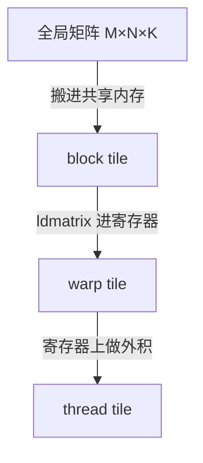

# GEMM 优化

> 🔴 重点考点:本篇是当前复习重点,文末「面试考点串联」给出问法对照。

一句话:GEMM(General Matrix Multiply,通用矩阵乘)是大模型里绝大部分算力的去处,而**把它写快的全部秘诀只有一句话——想尽办法让每个从显存搬上来的数被反复用很多次**。本篇把这句话展开成一套可算的账、三层分块、一条流水线和一张调参表。

## 一、先算一笔账:计算量、访存量、算术强度

记 $C = A \times B$,其中 $A$ 是 $M \times K$、$B$ 是 $K \times N$,输出 $C$ 是 $M \times N$。设数据类型每个元素占 $b$ 字节(FP16 时 $b=2$)。

### 计算量:唯一不能省的部分

$$
\text{FLOPs} = 2MNK
$$

意思是:$C$ 有 $MN$ 个输出元素,每个元素要把 $K$ 对数乘起来再累加,一次「乘加」算 2 次浮点运算,所以是 $2MNK$。**这个数不随实现方式改变**——不管你写得多烂多好,乘加次数是固定的。所以 GEMM 优化从来不是"少算",而是"别让计算单元等数据"。

### 朴素实现的访存量:灾难现场

最朴素的写法是一个线程负责一个输出元素:读 $A$ 的一整行(K 个数)、读 $B$ 的一整列(K 个数),乘加累起来,写回一个数。

$$
\text{Bytes}_{\text{naive}} = (2MNK + MN) \cdot b
$$

意思是:每个输出元素都要独立地把 $2K$ 个数从显存拉一遍,谁也不复用谁。$MN$ 个元素就是 $2MNK$ 次读,再加最后 $MN$ 次写。

把两者一除,得到**算术强度**(Arithmetic Intensity,每搬 1 字节能干多少次浮点运算):

$$
I_{\text{naive}} = \frac{2MNK}{2MNK \cdot b} = \frac{1}{b}
$$

意思是:朴素实现的算术强度是个**常数**,FP16 下只有 0.5 FLOP/byte,和矩阵多大完全无关。对照一下 **A100 40GB**:FP16 Tensor Core 峰值 312 TFLOPS、HBM 带宽 1555 GB/s,机器的"拐点"在 $312 / 1.555 \approx 200$ FLOP/byte(**本篇后面一律用这个 SKU 的 200**;80GB 版带宽 2.0 TB/s、拐点 153,见 Roofline与Bound分析 篇——拐点跟着显存型号走,答题时先问清是哪一版)。0.5 距离 200 差了 400 倍——朴素 GEMM 是**彻底的访存受限**,算力基本闲置。

具体一点:$M=N=K=4096$ 的 FP16 GEMM,计算量 137 GFLOP,理论算时间 0.44 ms;而朴素访存量是 275 GB,搬完要 177 ms。

### 分块之后:算术强度正比于 tile 边长

改成一个 thread block 负责输出 $C$ 的一个 $BM \times BN$ 小块。那么这个 block 只需要读 $A$ 的 $BM \times K$ 一条横带和 $B$ 的 $K \times BN$ 一条竖带,块内所有输出元素**共享**这两条带子:

$$
\text{Bytes}_{\text{tiled}} = MNK\left(\frac{1}{BM} + \frac{1}{BN}\right) \cdot b
$$

意思是:总共有 $\frac{M}{BM} \cdot \frac{N}{BN}$ 个 block,每个读 $(BM + BN) \cdot K$ 个元素,乘开就是上式。**tile 越大,访存量越小,而且是成反比地小**。

取方形 tile $BM = BN = T$,算术强度变成:

$$
I_{\text{tiled}} = \frac{2MNK}{MNK \cdot \frac{2}{T} \cdot b} = \frac{T}{b}
$$

意思是:**算术强度直接正比于 tile 的边长**。FP16 下 $T = 128$ 就是 64 FLOP/byte,比朴素实现高了 128 倍。这就是"为什么 GEMM 是计算受限的典型"的真正答案——**GEMM 的计算量是 $O(N^3)$ 而数据量只有 $O(N^2)$,这个立方与平方之差给了分块巨大的复用空间**,只要矩阵够大,你总能把算术强度堆到拐点之上。

还差一步值得说清楚:$T=128$ 给出的 64 FLOP/byte 仍低于 A100 40GB 的拐点 200,因为上面的推导**悲观地假设 L2 完全不命中**。实际上同一行的多个 block 读的是同一条 $A$ 横带,只要它们同时在跑,第二个 block 就能从 40 MB 的 L2 里拿到。理想情况下 $A$、$B$、$C$ 各只从 HBM 读一次(4096³ 时共 100 MB),算术强度可达 1365 FLOP/byte,远在拐点之上。**「让并发的 block 尽量共享 L2 里的同一条带子」就是后面 swizzle 这个调参项存在的全部理由。**

> bound 的判定方法与 roofline 图怎么画,见「Roofline与Bound分析」篇,本篇只用结论。

## 二、分块的三个层次:每层复用一次

分块不是一次分完,而是**对着内存层级分三次**,每往下一层就再复用一次数据。

### block tile:HBM → shared memory

一个 block 认领 $C$ 的 $BM \times BN$ 块,沿 K 方向每次搬 $BK$ 厚的一片:$A$ 的 $BM \times BK$ 和 $B$ 的 $BK \times BN$ 进 shared memory,同步一下,块内所有 warp 一起啃这两片,啃完换下一片。**复用倍数 = 块内 warp 数**——同一片 $A$ 被所有列方向的 warp 用,同一片 $B$ 被所有行方向的 warp 用。典型取 $BM = BN = 128$、$BK = 32$。

### warp tile:shared memory → 寄存器 fragment

block tile 再切给若干 warp,比如 $128 \times 128$ 切成 4 个 $64 \times 64$(2×2 排布,4 个 warp)。每个 warp 从 shared memory 把自己那份 $A$ 片段和 $B$ 片段读进**寄存器 fragment**。这一层的意义是:**一个 warp 读进来的 A fragment 会沿 N 方向被重复使用,B fragment 沿 M 方向被重复使用**,把「多次读 shared」压成「一次读 shared + 多次读寄存器」。warp 之间不需要通信,天然并行。

### thread tile:寄存器上的外积

最里层,每个线程负责 $TM \times TN$ 个输出(典型 8×8),持有 $TM$ 个 $A$ 元素和 $TN$ 个 $B$ 元素,做一次**外积**累加到 $TM \times TN$ 个累加器上。它的计算访存比是 $\frac{TM \cdot TN}{TM + TN}$:8×8 时是 16 次寄存器读换 64 次乘加,比值 4;若只做 4×4 则是 8 换 16,比值 2。**外积形式是这层的精髓——它让寄存器里的数据被用满**。

代价是寄存器压力:8×8 需要 64 个 FP32 累加器常驻,加上操作数和地址计算,单线程接近 100 个寄存器。一个线程最多 255 个,超了会 spill 到 local memory(物理上就是显存),性能断崖式下跌。

| 层次 | 数据落在哪 | 谁在复用 | 典型尺寸 |
|---|---|---|---|
| block tile | shared memory | block 内所有 warp | 128×128×32 |
| warp tile | 寄存器 fragment | warp 内所有线程 | 64×64 |
| thread tile | 寄存器累加器 | 单线程的外积循环 | 8×8 |

## 三、双缓冲与多级流水(pingpang)

分完块还有个问题:mainloop 里"搬第 k 片 → 算第 k 片 → 搬第 k+1 片 → 算第 k+1 片"是**串行**的。搬一次要 400–600 周期,这段时间 Tensor Core 完全空转。

**双缓冲(ping-pong)的做法**:开两块 buffer,**算第 k 片的同时,把第 k+1 片从 HBM 预取进另一块 buffer**,算完交换指针。这样访存延迟被计算时间盖住了。

和分块一样,双缓冲也发生在两个 scope:

- **shared memory 级**:两份 shared tile,一份在被计算,一份在接收 global 来的数据
- **寄存器 fragment 级**:两组 fragment,一组正喂给 Tensor Core,一组正在从 shared memory 读回

Ampere 之后有了 `cp.async`(异步拷贝,数据从 global 直达 shared 而不经过寄存器),双缓冲被推广成 **multistage 多级流水**:同时有 3–5 片在途,层层掩盖。级数记作 `Stages`,是重要的调参项。

它的成本是 shared memory:用量 $= \text{Stages} \times (BM + BN) \times BK \times b$。128/128/32 的 FP16 配置下,3 级要 48 KB,5 级要 80 KB;A100 每个 SM 只有 164 KB,所以 3 级还能驻留 3 个 block,5 级就只剩 2 个——**这就是 stage 和 occupancy 的跷跷板**。

Hopper 上进一步演化成 TMA(硬件搬运引擎)+ warp specialization:专门划出"生产者 warp"只负责搬数、"消费者 warp"只负责算,流水线由硬件 barrier 驱动。原理还是同一个:让搬和算重叠。

## 四、Tensor Core:形状约束、数据布局与 ldmatrix

> Tensor Core 与 CUDA Core 的硬件差异见「GPU架构与执行模型」篇,这里只讲**怎么把数据喂进去**。

### 形状是硬约束,不是建议

Tensor Core 不接受任意形状,它只做**固定尺寸的小矩阵乘加**,由一个 warp 的 32 个线程协同发射一条指令完成:

- `wmma` API(C++ 层):FP16 下形状是 **16×16×16**,即 $M{\times}N{\times}K$
- `mma.sync` PTX(Ampere 起,性能更好):FP16 主力形状是 **m16n8k16**,INT8/FP8 上有 m16n8k32

**关键后果:$M$、$N$、$K$ 必须补齐到指令粒度**。$M=1$ 时也得按 16 行算,15/16 的算力白扔——这是下一节 decode 慢的直接原因之一。此外操作数地址通常要求 128-bit 对齐,所以 $K$ 方向不是 8 的倍数时也要 padding。

### 数据布局:fragment 是"打散"的

`mma` 的操作数不是"一个线程拿一行",而是**按硬件规定的固定图案打散在 32 个线程的寄存器里**:以 m16n8k16 为例,每个线程持有 A 的 8 个 half、B 的 4 个 half、累加器的 4 个 float,而且**它们在原矩阵里并不连续**(一个线程会同时拿到第 g 行和第 g+8 行)。

如果老老实实按这个图案让每个线程自己去 shared memory 里挑数据,会变成一堆细碎的跨步访问,bank conflict 拉满,搬数比算数还慢。

### 所以要用 ldmatrix

`ldmatrix.sync.aligned.m8n8.x4.shared.b16` 是专门为此设计的**warp 级共享内存加载指令**:32 个线程里的 8 个(或 16、32 个)各提供**一行的首地址**,硬件负责把 8×8 的小块读出来、按 mma 要求的图案分发到各线程的寄存器。一条指令就能装满一个 16×16 的 A fragment。

它解决三件事:

1. **一条指令替代几十条细碎 load**,指令数大幅下降
2. **硬件完成打散重排**,不用手写复杂的索引计算
3. **带 `.trans` 变体**,可以在加载时顺手做转置,让 row-major 的数据直接对上 Tensor Core 要的列主序布局,省掉一次显式转置

配套还需要给 shared memory 做 **swizzle 布局**(用 XOR 打乱行内偏移),否则 8 个线程读的 8 行会落在同一批 bank 上。这属于通用访存技巧,细节见「访存与算子优化」篇。

## 五、GEMM 怎么 tune?tune 哪些参数?

这是面试高频题,答案要成体系:**GEMM kernel 的调参空间 = 三层 tile 尺寸 + 流水线级数 + K 方向切分 + block 调度顺序**。

| 参数 | 调大的后果 | 调小的后果 |
|---|---|---|
| **block tile BM/BN** | 算术强度 ∝ tile 边长而升,HBM 流量下降;但 shared/寄存器占用上升、occupancy 下降;M、N 不整除时**尾块浪费**变大;矩阵小时 block 数不足,填不满 SM | 访存量成倍上升,容易退回访存受限;好处是小矩阵下 block 多、负载均衡好、尾块浪费小 |
| **BK(K 方向厚度)** | 每次 mainloop 迭代干的活更多,`__syncthreads` 摊薄,单次 `cp.async` 传输更宽更高效;但 shared 用量 ∝ Stages×(BM+BN)×BK,会挤掉流水级数 | 省 shared、能开更多 stage;但同步频率变高、每次传输太窄,带宽利用率下降 |
| **warp tile WM/WN** | 每 warp 复用更好、fragment 重复读 shared 更少;但 block 内 warp 数减少(warp 数 = BM·BN/(WM·WN)),调度弹性差、寄存器压力大 | warp 多、延迟掩盖好;但同一份 shared 数据被更多 warp 重复读,shared 带宽成瓶颈 |
| **thread tile TM/TN** | 计算访存比 $\frac{TM \cdot TN}{TM+TN}$ 上升,寄存器复用更充分;但累加器数量 ∝ TM×TN,**超过 255 寄存器就 spill 到显存,性能崩塌** | 寄存器宽松、occupancy 高;但外积摊不开,寄存器层的复用变差,shared 读放大 |
| **Stages(流水级数)** | 更能掩盖 global→shared 延迟;但 shared 占用线性上升、驻留 block 数下降;延迟被盖满后**收益饱和**,再加只亏 occupancy | shared 省、occupancy 高;=1 时退化为无双缓冲,搬和算串行,SM 大量空转 |
| **split-K(K 维切分)** | M、N 小时把 K 切给多个 block,并行度上升填满 SM;但要额外写 workspace + 跑归约 kernel,访存与 kernel 启动开销上升,用原子加时结果**不可复现** | 无归约开销、数值确定;但 M、N 小时 grid 太小,大量 SM 闲置 |
| **swizzle(block 调度顺序)** | 分组越大,同时在跑的 block 在 M/N 上越聚集,共享的 A/B 条带越可能命中 L2;过大则工作集超出 L2 容量,反而下降,且尾部负载不均 | 退化成朴素 row-major 遍历,并发 block 分散在整行上,L2 命中率低,HBM 流量接近第一节那个悲观估计 |

补两个必须知道的坑,来自官方的 GEMM 性能指南:

- **tile quantization(尾块量化)**:$M$ 或 $N$ 不是 tile 尺寸整数倍时,边缘 block 大部分线程在算无效数据。$M=257$、$BM=128$ 时要开 3 行 block,最后一行只有 1/128 有用
- **wave quantization(波次量化)**:block 总数不是 SM 数整数倍时,最后一"波"只用到少数 SM。A100 有 108 个 SM,109 个 block 的耗时约等于 216 个

**实践中谁来 tune**:cuBLAS 内部有预编译的 kernel 集合 + 启发式选择(cuBLASLt 暴露成 `cublasLtMatmulAlgoGetHeuristic`);CUTLASS 提供 profiler 对模板实例做穷举;Triton 用 `@triton.autotune` 声明候选 config 实测挑选;`torch.compile` 的 max-autotune 模式会把 cuBLAS 和 Triton 候选一起 benchmark。**没有一套参数通吃所有 shape,所以"选 kernel"本身才是库的核心竞争力。**

## 六、小 batch 与瘦长矩阵:decode 为什么慢

把第一节的公式套到 $M=1$(decode 阶段一次只解一个 token)上。此时权重矩阵 $K \times N$ 的搬运完全主导访存:

$$
I_{\text{GEMV}} = \frac{2MNK}{NK \cdot b} = \frac{2M}{b}
$$

意思是:**算术强度只和 batch 大小 $M$ 有关,和矩阵多大完全无关**。FP16 下 $I = M$——$M=1$ 时算术强度是 1 FLOP/byte,比朴素 GEMM 还惨。要够到 A100 40GB 的拐点 200,batch 得堆到 $M \approx 200$。

decode 慢是三件事叠加:

1. **彻底访存受限**:算术强度 $O(1)$,时间完全由"把权重从 HBM 读一遍"决定。跑一层 7B 模型的 FFN,读权重的时间和算的时间差两个数量级
2. **Tensor Core 利用率极低**:mma 的 M 维粒度是 16,$M=1$ 要补到 16 行,**理论利用率上限 6.25%**。所以很多 decode kernel 干脆放弃 Tensor Core,用 CUDA Core 写专门的 GEMV
3. **并行度不足**:$M=1$、$N=4096$、$BM{=}BN{=}128$ 时 grid 只有 32 个 block,A100 的 108 个 SM 有 2/3 在闲着

对应的解法也就清晰了:**用 split-K 把 K 维切开填满 SM**;**用 weight-only 量化(INT8/INT4 权重)直接把访存量砍掉 2–4 倍**,因为瓶颈本来就是搬权重;**用 continuous batching 把多个请求的 M 拼起来**,让 $M$ 从 1 涨到几十上百;**用投机解码把 $M=1$ 变成 $M=k$**;MoE 场景用 grouped GEMM 合并多个专家的小矩阵乘。

> 两阶段的形状差异、attention 侧的 kernel 选择、batch 如何改变 bound,见「Prefill与Decode的矩阵形状」篇。

## 七、cuBLAS 与 CUTLASS 的分层抽象

| | cuBLAS | CUTLASS |
|---|---|---|
| 形态 | 闭源二进制库 | 开源 C++/CUDA 模板库 |
| 你能控制什么 | 只能选 API 和(cuBLASLt 下)algo 句柄 | **每一层 tile 尺寸、流水级数、swizzle 都是模板参数** |
| 强项 | 标准 shape 上开箱即用,长期调优积累 | 非标准数据类型、自定义 epilogue、融合算子 |
| 典型用途 | PyTorch 默认 matmul 后端 | FlashAttention、量化 GEMM、MoE grouped GEMM 的底座 |

CUTLASS 的价值在于:**它把本文第二到第五节的每一层都变成了一个可替换的模板参数**。CUTLASS 2.x 里你直接写出 `ThreadblockShape<128,128,32>`、`WarpShape<64,64,32>`、`InstructionShape<16,8,16>`、`Stages=3`、`ThreadblockSwizzle`,一一对应本文的 block tile / warp tile / mma 形状 / 流水级数 / 调度顺序。3.x 引入 CuTe 之后抽象换成了 CollectiveMainloop + CollectiveEpilogue,但分层的骨架没变。

还有一件 cuBLAS 做不到的事:**epilogue 融合**。GEMM 算完之后的 bias、激活、量化缩放、residual add,可以在结果还留在寄存器里时直接做掉,不用把 $C$ 写回显存再读一遍。这也是 FlashAttention、量化推理 kernel 普遍基于 CUTLASS 而不是 cuBLAS 的原因。

## 八、面试考点串联

| 高频问法 | 本文哪一节 |
| --- | --- |
| GEMM 的计算量和访存量怎么算? | 一(2MNK 与三个访存量公式) |
| 为什么说 GEMM 是 compute-bound 的典型? | 一(计算 $O(N^3)$ vs 数据 $O(N^2)$,分块后算术强度 ∝ tile 边长) |
| GEMM 怎么优化?讲讲分块 | 二(block / warp / thread 三层,每层复用一次) |
| 什么是双缓冲/pingpang?为什么要多级流水? | 三(掩盖 400–600 周期的取数延迟) |
| Tensor Core 怎么用?为什么要 ldmatrix? | 四(mma 形状约束 + fragment 打散布局) |
| GEMM 怎么 tune?tune 哪些参数? | 五(七参数表 + 两类 quantization) |
| 分块开大开小分别有什么影响? | 五(BM/BN 行:算术强度 vs occupancy vs 尾块) |
| 什么时候用 split-K? | 五、六(M、N 小导致 grid 填不满 SM 时) |
| 小 batch / GEMV 为什么效率骤降?decode 为什么慢? | 六(算术强度 = $2M/b$,Tensor Core 利用率 6.25%,并行度不足) |
| cuBLAS 和 CUTLASS 有什么区别?为什么要 CUTLASS? | 七(模板化分层 + epilogue 融合) |

前置阅读:GPU架构与执行模型(内存层级、Tensor Core)→ Roofline与Bound分析(bound 判定)→ 本篇 → 访存与算子优化(通用访存技巧)。

## 相关文献

- NVIDIA CUTLASS 官方仓库 — https://github.com/NVIDIA/cutlass
- Efficient GEMM in CUDA(CUTLASS 分层分块与软件流水的官方说明)— https://github.com/NVIDIA/cutlass/blob/main/media/docs/cpp/efficient_gemm.md
- cuBLAS 官方文档(含 cuBLASLt 的 algo 启发式选择)— https://docs.nvidia.com/cuda/cublas/
- Matrix Multiplication Background User's Guide(算术强度、tile/wave quantization 的官方口径)— https://docs.nvidia.com/deeplearning/performance/dl-performance-matrix-multiplication/index.html
- PTX ISA(`mma` 各形状的 fragment 布局与 `ldmatrix` 语义)— https://docs.nvidia.com/cuda/parallel-thread-execution/
- Stream-K: Work-centric Parallel Decomposition for Dense Matrix-Matrix Multiplication on the GPU — [arXiv:2301.03598](https://arxiv.org/abs/2301.03598)
- NVIDIA A100 Tensor Core GPU Architecture(白皮书,本文算力/带宽数字来源)— https://www.nvidia.com/content/dam/en-zz/Solutions/Data-Center/nvidia-ampere-architecture-whitepaper.pdf
