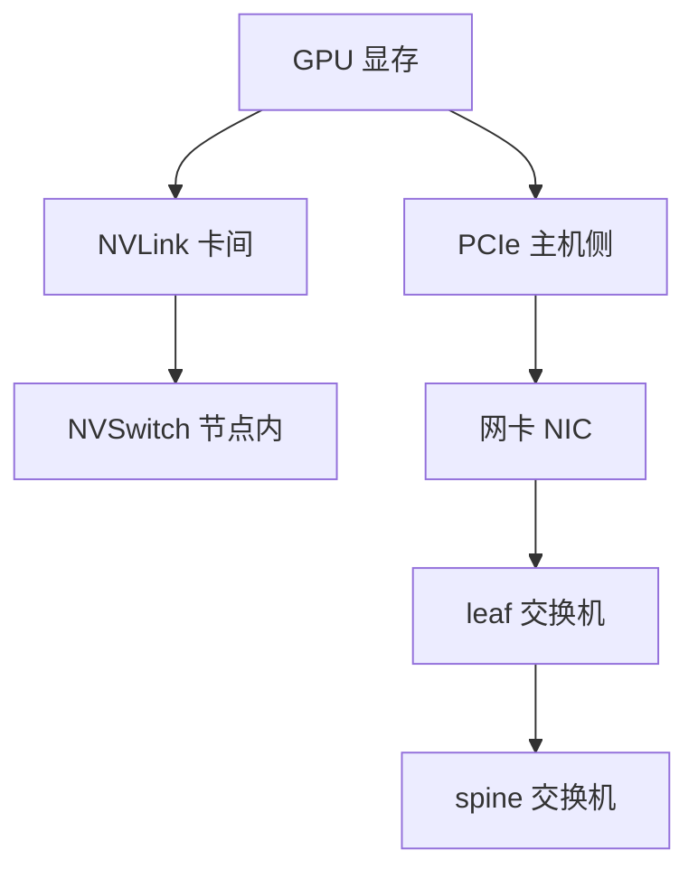

# GPU 互联与组网

> 🔴 重点考点:本篇直接对应真实面经高频问法,文末「面试考点串联」给出问法对照。

一句话:GPU架构与执行模型 篇讲的是**一张卡里面**的事,本篇接着讲**出了这张卡之后**——数据每往外走一层,带宽就掉一截,「TP 不出节点」「跨机贵」这类经验法则的硬件根源全在这里。

## 一、出了这张卡,只有两条路

在卡内,SM 从 HBM 取一个数已经要 400–600 周期。一旦数据要离开这张卡,出口只有两个:

- **左边是 GPU 专用道**:NVLink 直连另一张 GPU,节点内多卡再经 NVSwitch 做全互联。这是 NVIDIA 自家协议,只服务 GPU(以及 Grace 这类自家 CPU)
- **右边是通用道**:PCIe 挂在主机的 root complex(根复合体,CPU 侧统管所有 PCIe 设备的那个根节点)上,GPU 靠它跟 CPU 内存、网卡、NVMe 打交道。要出机器,必须先过 PCIe 到网卡,再进交换网络

后面所有性能结论,本质上都在问同一句话:**你的数据被迫走到了哪一段?**越往外,越慢。

## 二、带宽层级表:先把口径说清楚

带宽最容易错的不是数值,是**口径**。三个坑:

1. **单向还是双向**。NVIDIA 报 NVLink 一律是「双向聚合」——H100 的 900 GB/s 是收发相加,每个方向 450 GB/s。PCIe 习惯报单向。拿 900 直接去比 64 是错的
2. **每卡还是每链路**。NVLink 4.0 是「每条链路 50 GB/s 双向 × 18 条 = 每卡 900 GB/s」,别把每链路数字当成每卡
3. **Gb 还是 GB**。网络说比特(400 Gb/s),GPU 说字节(GB/s),差 8 倍。IB NDR 的 400 Gb/s 折成字节只有 **50 GB/s**

统一折算到「**每 GPU、单向、GB/s**」,H100 一代长这样:

| 层级 | 代表规格 | 厂商官方口径 | 折成每卡单向 | 典型用途 |
|---|---|---|---|---|
| HBM(卡内) | H100 SXM · HBM3 | 3.35 TB/s(读写合计,不分方向) | ~3350 | 权重与 KV 进出计算单元 |
| **NVLink(卡间)** | NVLink 4.0 · 18 条链路 | 900 GB/s 双向 / 卡 | **450** | TP 的激活同步、EP 的 all-to-all |
| **NVSwitch(节点内全互联)** | HGX H100 · 8 卡 | 节点二分带宽 3.6 TB/s | 450(任意两卡都是) | 8 卡域内的集合通信 |
| PCIe(主机侧) | Gen5 x16 | 128 GB/s 双向 | 63 | H2D/D2H、GPU ↔ 网卡 |
| RDMA / IB(跨机) | InfiniBand NDR | 400 Gb/s / 端口 | 50 | 跨节点数据面 |
| 以太网(跨机) | 100 GbE | 100 Gb/s | 12.5 | 管理面;跑 RoCE 时也做数据面 |

PCIe 那一行的 GB/s 是折算来的:PCI-SIG 只规定每 lane 的信号速率,Gen5 是 32 GT/s,乘 16 条 lane、乘 128b/130b 的编码效率、除以 8,得 63 GB/s 单向;Gen4 是 16 GT/s,同样算法得 31.5 GB/s。A100 一代是同样形状、整体降一档:HBM2e 2039 GB/s、NVLink 3.0 每卡 600 GB/s 双向(单向 300)、PCIe Gen4 x16 单向 31.5 GB/s、IB HDR 200 Gb/s(25 GB/s);Blackwell 则是 NVLink 5.0 每卡 1800 GB/s 双向,GB200 NVL72 把 72 张卡放进同一个 NVLink 域,聚合 130 TB/s。

**落差出现在哪里**,比绝对值更值得记:

- HBM → NVLink:3350 → 450,**差约 7 倍**。能在卡内解决的绝不要出卡
- NVLink → PCIe:450 → 63,**又差约 7 倍**。这就是「别让 GPU 之间的数据绕道主机」的由来
- PCIe → 网卡:63 → 50,**几乎不差**。这不是巧合:400 Gb/s 的网卡本来就插在 PCIe Gen5 x16 槽上,**槽位带宽就是网卡的天花板**;想上 800 Gb/s 网卡,PCIe 得同步升代
- 节点内 → 跨机(按每卡算):450 → 50,**差约 9 倍**。这一步是所有「跨机贵」结论的数值根源

所以准确的说法是:**相邻层常常差一个数量级,但不是每一层都差**——PCIe 和网卡被同一根总线绑在一起,是同一档。

## 三、NVLink 和 PCIe:差的不只是数字

| | NVLink | PCIe |
|---|---|---|
| 拓扑 | GPU 之间**点对点直连**,或全部接进 NVSwitch | **树状总线**,根是 CPU 的 root complex |
| 访问语义 | **内存语义**:对端显存映射进本卡地址空间,可直接 load/store,也支持远端原子操作 | **搬运语义**:本质是 DMA 传包,原子能力有限 |
| 带宽归属 | 每卡独占自己那些链路 | 同一颗 PCIe switch 下的多张卡**共享上行带宽** |
| CPU 参与 | 不参与 | 要过 root complex;跨 CPU socket 还要走 CPU 间互联 |
| 扩展性 | 受链路条数限制,靠 NVSwitch 破局 | 受槽位与 lane 数限制 |

「内存语义」这条最值得展开:NVLink 域内,一个 GPU 线程可以像读自己显存一样去读邻卡显存,不需要「发起一次传输」——NCCL、NVSHMEM 这类库就建在这个能力上。而 PCIe 上任何跨卡访问都得组织成一次 DMA 搬运。

**为什么纯 PCIe 机器上多卡 all-reduce 会塌**,三条叠加:

1. **总量本来就小**:单向 63 GB/s(Gen5),只有 NVLink 的七分之一
2. **带宽是共享的,不是每卡的**:8 张卡挂在一两颗 PCIe switch 下,同时收发时人均只剩几 GB/s;而 NVLink 的 450 GB/s 是每张卡各自拥有
3. **跨 socket 再腰斩**:若通信的两张卡挂在不同 CPU 上,数据要走 CPU 之间的互联,NVIDIA 官方文档对这条路径的措辞是「可能性能极差甚至无法可靠工作」

结果就是 all-reduce 从毫秒级掉到几十毫秒级,而它**卡在关键路径上**——GPU 只能干等。算法怎么匹配拓扑(ring 还是 tree、总线带宽怎么折算)见 集合通信 篇。

## 四、NVSwitch:把「有限条链路」变成「全互联」

NVLink 的硬伤是**链路条数有限**。H100 每卡 18 条,若卡与卡直连,要让 8 卡两两互通,每对之间只分得到 18/7 ≈ 2 条——带宽被切成七份,而且卡数再多就连不满(A100 只有 12 条,更紧张)。这是「点对点」的天花板。

NVSwitch 是一颗**交换芯片**,思路和以太网交换机一样:GPU 不再互相直连,而是把自己全部链路都接进交换机,由交换机做无阻塞转发。

| | HGX A100 | HGX H100 |
|---|---|---|
| NVSwitch 代际 / 数量 | 二代 · 6 颗(36 口) | 三代 · 4 颗(64 口) |
| 每卡链路怎么分 | 12 条,每颗交换机 2 条 | 18 条,按 5/4/4/5 分给 4 颗 |
| 域内任意两卡 | 全速 600 GB/s 双向 | 全速 900 GB/s 双向 |
| 节点二分带宽 | 2.4 TB/s | 3.6 TB/s |

关键性质是**「任意两卡都是全带宽,而且与通信模式无关」**:不管是 ring 式的邻居对传,还是 all-to-all 的人人对人人,每张卡都能跑满自己那 450 GB/s。这正是 TP 那种「每层要对好几次答案」的通信模式所需要的。

**「TP 不出节点」的硬件根源就在这里**:NVSwitch 域(通常 8 卡)之内是全互联全带宽,跨出这个域带宽掉到约九分之一,还要过网卡和交换网络。域的边界就是并行策略的边界——具体怎么摆 TP/PP/DP 见 并行策略 篇。Blackwell 的 NVL72 把这个域从 8 卡撑到 72 卡,等于把「节点内」的定义整个改写了。

## 五、RDMA:跨机为什么还能快

出了节点就得走网络。走裸 TCP 有多亏,把路径列出来就清楚了:

| | 传统 TCP/IP | RDMA |
|---|---|---|
| 数据路径 | 用户 buffer → 内核 socket buffer → 协议栈(分片、校验、拥塞控制全在 CPU 上)→ 网卡 | 应用把内存**预先注册**给网卡,之后网卡**直接 DMA 读写**这块内存 |
| CPU 开销 | 每个包都要中断/软中断,大流量能吃掉好几个核 | 传输、重传、校验都在网卡硬件里,CPU 基本不参与 |
| 拷贝次数 | 至少一次用户态 ↔ 内核态拷贝 | 零(数据不进内核) |
| 对端参与 | 必须有进程在收 | **单边操作**:WRITE/READ 不打扰对端 CPU |

三个关键词:**内核旁路(kernel bypass)、零拷贝、单边操作**。第三条尤其重要——把 KV cache 写进对端显存靠的就是单边 WRITE,对端不需要为此调度一次接收(见 PD分离 篇)。代价是**注册很贵**:要把页 pin 住(禁止换出),再把虚拟地址到物理地址的映射与访问权限交给网卡,是毫秒级的慢操作;所以工程上一律**预先注册一块常驻 buffer 反复用**,绝不在数据路径上现注册。

### IB 和 RoCE 的区别

| | InfiniBand | RoCE v2 |
|---|---|---|
| 跑在什么上 | 专用链路层 + 专用交换机 + 子网管理器 | 标准以太网,封装在 UDP/IP 里 |
| 无损从哪来 | **基于信用的流控**:收方通告有多少 buffer,发方才发多少,链路层天生不丢包 | 得**配**出来:PFC 逐优先级反压 + ECN 拥塞标记 + DCQCN 调速 |
| 丢包代价 | 基本不发生 | 丢一个包可能触发整段重传,尾延迟直接爆 |
| 运维 | 贵、自成体系,但开箱即用 | 便宜、复用以太网生态;PFC/ECN 极难调,PFC 本身还可能引发死锁 |

一句话:**IB 把「无损」做进了硬件协议,RoCE 是把「无损」配置出来的**。所以「RoCE 和 IB 差不多快」这句话只在**网络调好了**的前提下成立,而那个前提正是 RoCE 的主要风险。

## 六、零拷贝:到底省掉了哪几次拷贝

「零拷贝」被说滥了,先把最朴素路径上到底有几次拷贝列清楚。一份数据从本机显存发到对端显存:

1. **显存 → 主机内存**(D2H)
2. **pageable → pinned 暂存区**:主机内存默认可被 OS 换出(pageable),而 DMA 引擎只能操作 page-locked 内存,所以驱动会先把数据 memcpy 进一块内部 pinned 缓冲,再 DMA
3. **用户态 → 内核态**(走 TCP 的话)
4. 网卡发出

对端再反着来一遍。零拷贝的两条硬件路径,各消掉其中几步:

| 机制 | 消掉哪几步 | 前提条件 |
|---|---|---|
| **GPUDirect P2P** | 1、2 —— 卡间直传,不落主机内存 | NVLink 域内直接可用;**只有 PCIe 时两张卡必须挂在同一个 root complex 下**,跨 CPU socket 的路径官方标注为可能极慢甚至不可靠;IOMMU 需 passthrough |
| **GPUDirect RDMA** | 1、2、3 —— 网卡直读显存 | 网卡与 GPU **同一 root complex**(最好同一颗 PCIe switch);显存必须是设备内存并**注册**给网卡、按 64 KB 对齐;驱动与网卡固件支持 |

第 2 步值得单独说,它是最常被忽略的一次拷贝:**用 pageable 主机内存做中转,不只多一次 CPU memcpy,还会让异步失效**——异步拷贝 API 遇到 pageable 指针时实际是同步执行的,你以为在重叠,其实在串行(见 CUDA流与异步执行 篇)。所以凡是走主机内存的中转 buffer,一律要 pinned。

### 条件不满足会怎样:静默退化

这是本篇最该记住的坑:**前提不满足时程序不会报错,只会变慢**。

- P2P 不可用时,peer 拷贝会自动改走「经系统内存中转」的备用路径——功能正常,带宽掉一个数量级
- GPUDirect RDMA 不可用时,通信库通常退回「先 D2H 到主机 pinned buffer 再发」,同样只是慢

所以线上遇到「带宽只有预期的几分之一」,第一件事不是看代码,是**查拓扑**:`nvidia-smi topo -m` 打出的矩阵里,两个设备之间标的是 `NV#`(NVLink)、`PIX`(同一颗 PCIe switch)、`NODE`(同 NUMA,过 root complex)还是 `SYS`(跨 socket)——后两种就是退化路径。

## 七、多机组网:胖树、收敛比、rail-optimized

### 胖树与收敛比

多机集群的主流拓扑是**胖树(fat-tree)**,工程上通常做成两层的 leaf-spine:服务器接 leaf(接入层)交换机,leaf 全部上连 spine(汇聚层)。名字里的「胖」指**越往上带宽越粗**,好让任意两台机器之间都有接近全带宽的路径。

衡量够不够胖的指标是**收敛比(oversubscription ratio)** = leaf 的下行容量 : 上行容量。1:1 叫无阻塞;3:1 表示接入带宽是上行的三倍,一旦大家同时跨 leaf 通信,人均只剩三分之一。训练集群的计算面一般要求 **1:1 不收敛**,存储面才允许收敛——因为集合通信是「全员同时开动」,看平均值没用,得看最坏情况。

### rail-optimized:让跨机通信别上 spine

现代 GPU 服务器给**每张 GPU 配一张自己的网卡**(DGX H100:8 张 GPU 各配一张 400 Gb/s 单端口网卡,节点计算面合计 3.2 Tb/s)。rail-optimized 是一条**布线规则**:所有节点的 0 号卡接同一台 leaf 交换机,1 号卡接另一台,以此类推——8 张卡对应 8 条 **rail(轨道)**。

> 🖼️ 占位:rail-optimized 组网示意——横排 4 个节点各 8 张 GPU,同号卡的网卡用同色线连到同一台 leaf 交换机(8 条 rail 用 8 种颜色),leaf 再统一上连 spine

为什么这么接:并行训练里绝大多数跨机流量发生在**同号 rank 之间**(DP 的梯度同步就是各节点的 0 号卡对 0 号卡)。同号卡都挂在同一台 leaf 上,这类流量**一跳就到、根本不上 spine**,延迟低也不跟别的 rail 抢上行带宽。少量跨 rail 的流量则可以先在节点内用 NVLink 把数据挪到「和目的地同号」的那张卡上,再从它的网卡发出去,把跨 rail 变回同 rail(NCCL 里这个特性叫 PXN)。

### 跨机到底贵在哪:四条,按重要性排

1. **带宽低一个数量级**:每卡 50 GB/s,对比节点内 450 GB/s
2. **延迟高一个数量级**:NVSwitch 一跳是亚微秒级;跨机至少要走 网卡 → leaf →(spine → leaf)→ 网卡,加上协议处理,典型在**几微秒**。小消息的集合通信被延迟主导时,这一项比带宽更致命
3. **收敛比**:上行不够粗时,跨 leaf 的人均带宽还要再除以收敛比
4. **拥塞与排队**:多条流撞同一个上行口就得排队;RoCE 上一旦触发 PFC 反压还会往回蔓延,波及无关的流。而集合通信**要等最慢的那条**——尾延迟就是总延迟

## 八、哪些并行能跨机:一道除法

把前面全部内容收拢成一个判据。某种并行能不能跨机,不看它「是什么」,看这个式子:

$$
T_{\text{comm}} \;\approx\; \frac{\text{每 step 通信次数} \times \text{单次通信量}}{\text{该层链路带宽}}
$$

意思是:把通信量除以你**实际能拿到**的那层带宽,得出每步花在通信上的时间;再问两个问题——这段时间**能不能被计算盖住**?盖不住的话占一步总时长的几成?(式子里的精确系数取决于用什么集合通信算法,见 集合通信 篇;这里只看数量级。)

| 并行 | 每 step 通信次数 | 单次量级 | 在关键路径上? | 跨机 |
|---|---|---|---|---|
| **TP** | 每层前向 2 次 + 反向 2 次,几十层累计几百次 | 一份激活 | **是**,算完这次才能算下一步 | ❌ 必死 |
| **PP** | 每个 micro-batch 过一次 stage 边界 | 一份边界激活 | 部分可与别的 micro-batch 重叠 | ✅ 合适 |
| **DP** | 每 step 一次梯度同步 | 参数量级(可分桶) | **否**,能与反向计算重叠 | ✅ 可以 |
| **EP** | 每个 MoE 层 dispatch / combine 各一次 all-to-all | token 打包,随路由分布波动 | 是 | ⚠️ 敏感 |

代入数字看两个极端(取 $b$=8、$s$=2048、$h$=8192、bf16,一份激活约 **268 MB**;以下只做量级估算,不含算法系数与固定延迟):

- **TP 跨机为什么必死**:一次同步在 NVLink 上约 0.6 ms,在 NDR 网卡上约 5.4 ms。一层前反向 4 次、80 层就是 320 次——节点内约 0.19 s,跨机约 1.7 s,而这段时间 GPU 全在等。差的不是「慢一点」,是一个数量级的空转
- **DP 跨机为什么可以**:7B 模型的 bf16 梯度约 14 GB,按每卡 50 GB/s 算是**几百毫秒**量级,看着不小;但它**每 step 只发生一次**,而且梯度是从后往前逐层算出来的,可以算完一层就传一层,整段藏进反向计算里

EP 的 all-to-all 是「人人给人人寄包裹」,跨机时既吃带宽又吃延迟,还怕专家负载不均,缓解手段见 MoE并行与DeepEP 篇;PD 分离下 KV 的跨实例传输是同一套硬件判据的另一个应用,分层流水的做法见 PD分离 篇。取舍到此为止——**本篇只回答「这条链路扛不扛得住」**,具体怎么组合 TP/PP/DP/EP 见 并行策略 篇。

## 面试考点串联

| 高频问法 | 本文哪一节 |
|---|---|
| 讲下 pcie、nvlink、nvswitch、rdma? | 二(带宽层级总表)→ 三、四、五 |
| NVLink 报的 900 GB/s 和 PCIe 报的 63 GB/s 能直接比吗?比带宽要注意什么口径? | 二(单向/双向、每卡/每链路、Gb/GB) |
| NVLink 和 PCIe 的区别只是带宽吗?为什么纯 PCIe 的机器上多卡 all-reduce 会塌? | 三 |
| 有了 NVLink 为什么还要 NVSwitch?它到底解决了什么问题? | 四 |
| RDMA 为什么比走 TCP 快?快在哪几件事上? | 五 |
| IB 和 RoCE 是什么关系?上 RoCE 要额外操心什么? | 五(无损靠配置,不是天生的) |
| 零拷贝是怎么回事?什么条件下它其实没生效? | 六(两条 GPUDirect 路径 + 静默退化) |
| 多机组网时这些怎么构建网络通信 topo?跨机为什么贵? | 七(胖树与收敛比、rail-optimized) |
| 为什么 TP 不出节点,而 DP 可以跨机? | 八(那道除法)+ 四 |

> 本表混有面经原题与自拟题;自拟题按写作契约第九节的出题标准补出。

延伸阅读顺序:GPU架构与执行模型(卡内)→ 本篇(卡外的链路)→ 集合通信(算法怎么匹配拓扑)→ 并行策略(怎么把并行摆到合适的链路上)。

## 相关文献

- NVIDIA H100 Tensor Core GPU Architecture(NVLink 4.0 与 NVSwitch 三代)— https://resources.nvidia.com/en-us-tensor-core/gtc22-whitepaper-hopper
- NVIDIA A100 Tensor Core GPU Architecture(NVLink 3.0)— https://images.nvidia.com/aem-dam/Solutions/Data-Center/nvidia-ampere-architecture-whitepaper.pdf
- NVIDIA HGX A100 Datasheet(8 卡 NVSwitch 全互联与 600 GB/s 口径)— https://www.nvidia.com/content/dam/en-zz/Solutions/Data-Center/HGX/pdf/nvidia-hgx-a100-datasheet.pdf
- NVIDIA NVLink / NVLink Switch 产品页(各代每卡带宽)— https://www.nvidia.com/en-us/data-center/nvlink/
- The NVLink-Network Switch(Hot Chips 34,NVSwitch 代际与 DGX 二分带宽)— https://hc34.hotchips.org/assets/program/conference/day2/Network%20and%20Switches/NVSwitch%20HotChips%202022%20r5.pdf
- NVIDIA GB200 NVL72 产品页(NVLink 5.0、72 卡 NVLink 域、130 TB/s)— https://www.nvidia.com/en-us/data-center/gb200-nvl72/
- NVIDIA GPUDirect RDMA 文档(root complex 限制、pin 与注册、拓扑分级)— https://docs.nvidia.com/cuda/gpudirect-rdma/
- Doubling all2all Performance with NCCL 2.12(PXN:用 NVLink 把跨 rail 变成同 rail)— https://developer.nvidia.com/blog/doubling-all2all-performance-with-nvidia-collective-communication-library-2-12/
- InfiniBand Roadmap(HDR / NDR / XDR 每端口速率)— https://www.infinibandta.org/infiniband-roadmap-charting-speeds-for-future-needs/
- NVIDIA DGX SuperPOD Reference Architecture(H100):rail-optimized 计算面组网 — https://docs.nvidia.com/dgx-superpod/reference-architecture-scalable-infrastructure-h100/latest/index.html
- PCI-SIG 规范库(只定义每 lane 的 GT/s,GB/s 需按编码效率自行折算)— https://pcisig.com/specifications
- Rail-only: A Low-Cost High-Performance Network for Training LLMs with Trillion Parameters — [arXiv:2307.12169](https://arxiv.org/abs/2307.12169)
