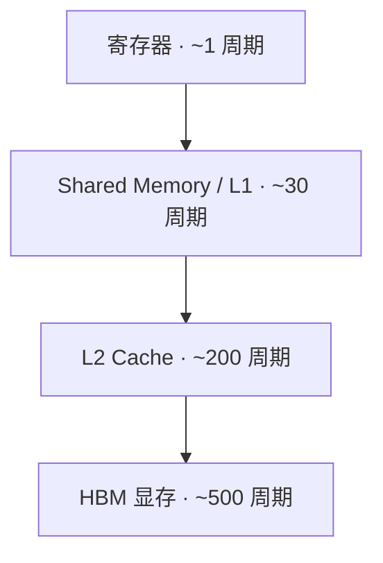

# GPU 架构与执行模型

> 🔴 重点考点:本篇是当前复习重点,文末「面试考点串联」给出问法对照。

一句话:GPU 是一台**用极多的并发线程去掩盖极慢的内存访问**的机器——理解它的关键不是"算得快",而是"怎么让计算单元不闲着等数据"。这是整个 Infra 原理章的地基,后面所有 kernel 优化、bound 分析、显存讨论都从这里发问。

## 一、先建立一个直觉:GPU 和 CPU 的分工不同

> **类比**:CPU 像几位博士生——每人都很聪明(强大的分支预测、乱序执行、超大缓存),适合处理复杂、互相依赖的任务。GPU 像几千名小学生——每人只会做简单算术,但可以同时开工,适合"同一件事重复做几百万遍"。

这个差异体现在芯片面积上:CPU 把大量晶体管花在**控制逻辑和缓存**上,GPU 把绝大部分面积给了**计算单元**。代价是 GPU 的单线程很慢、缓存很小,所以它必须靠"线程多"来掩盖等待。

一个必须记住的量级对比:**从显存(HBM)读一个数据要 400–600 个时钟周期,而做一次浮点乘加只要几个周期**。也就是说,取一次数的时间够算一百多次。这条不等式解释了后面几乎所有优化手段——**绝大多数算子的瓶颈不在算力,而在把数据搬过来**。

## 二、执行模型:SIMT 与 warp

### 线程是怎么组织的

写 kernel 时你面对三级抽象,它们各自对应一层硬件:

| 软件概念 | 硬件对应 | 关键性质 |
|---|---|---|
| thread(线程) | CUDA Core 上的一条执行流 | 有自己的寄存器 |
| **warp(线程束,32 线程)** | **调度的最小单位** | 32 个线程锁步执行同一条指令 |
| block(线程块) | 被分配到**一个 SM** 上 | 块内线程可用 shared memory 通信、可同步 |
| grid(网格) | 整个 GPU | block 之间不能直接通信 |

SM(Streaming Multiprocessor,流多处理器)是 GPU 的基本"车间",一张 A100 有 108 个。**block 一旦被分配给某个 SM 就不会迁移**,这也是为什么 block 内能共享内存、block 之间不能。

### SIMT 是什么,和 SIMD 差在哪

**SIMT(Single Instruction, Multiple Threads)**:一条指令,32 个线程各自拿自己的数据去执行。

和 CPU 的 **SIMD**(一条指令处理一个宽向量,如 AVX-512 一次算 16 个 float)相比:

| | SIMD(CPU 向量指令) | SIMT(GPU) |
|---|---|---|
| 编程视角 | 你要显式操作"向量" | 你写的是**单个线程**的标量代码 |
| 数据地址 | 必须连续、对齐 | 每个线程可以访问**任意地址**(但连续时最快) |
| 遇到分支 | 靠掩码,程序员/编译器处理 | 硬件自动处理,但会**串行执行两个分支** |
| 灵活性 | 低 | 高,代价是硬件复杂 |

一句话概括:**SIMT 是"带了自动掩码和地址自由度的 SIMD"**——你可以像写单线程一样写代码,硬件替你并行。

### warp divergence(分支发散):最常见的性能陷阱

因为一个 warp 的 32 个线程**必须执行同一条指令**,当它们走进不同的 if 分支时,硬件只能:先让走 A 分支的线程干活、其余的关掉;再让走 B 分支的干活、前一批关掉。**两个分支串行执行,时间相加。**

```cuda
// 坏:同一个 warp 里的线程走不同分支,耗时 = 两个分支之和
if (threadIdx.x % 2 == 0) { do_a(); } else { do_b(); }

// 好:让分支在 warp 之间发生,而不是 warp 之内
if ((threadIdx.x / 32) % 2 == 0) { do_a(); } else { do_b(); }
```

这就是优化清单里"减少分支"的真实含义:**不是不能有 if,而是别让 if 在一个 warp 内部劈叉**。

## 三、内存层级:哪些能编程,哪些只能间接影响

这是本篇最该记牢的一张表(以 A100 量级为参考,不同代际有出入):

| 存储 | 容量量级 | 访问延迟 | 作用域 | 能否显式编程 |
|---|---|---|---|---|
| 寄存器 | 每 SM 256 KB | ~1 周期 | 单线程私有 | 间接(靠编译器,可控总用量) |
| **Shared Memory** | 每 SM 最多 ~164 KB | ~20–30 周期 | **block 内共享** | ✅ **完全显式,由你分配和读写** |
| L1 Cache | 与 shared 共用同一块物理 SRAM | ~30 周期 | 单 SM | ❌ 只能间接影响 |
| L2 Cache | 40–50 MB | ~200 周期 | **全 GPU 共享** | ❌ 只能间接影响(有 persisting 提示) |
| HBM(显存) | 40–80 GB | **~400–600 周期** | 全 GPU | ❌ 只能优化访问方式 |



**面试直答**:"写 kernel 时能显式编程的存储" = **寄存器(通过控制变量数量)+ Shared Memory(完全手工管理)**。L1/L2 是硬件自动管理的缓存,你只能通过**改变访问模式**来间接提高命中率。

### Shared Memory 为什么这么关键

它是**唯一由你掌控、且比显存快一个数量级**的存储。所有 tiling(分块)优化的本质都是同一件事:**把一块数据从 HBM 搬进 shared memory,让 block 内的线程反复复用它,把"多次慢访问"变成"一次慢访问 + 多次快访问"**。

### 怎么提高 L1 / L2 命中率

面试常问,记这四条:

1. **合并访存(coalescing)**:让同一个 warp 的 32 个线程访问**连续地址**。硬件会把它们合并成少数几个宽事务;地址跳着走就会退化成 32 次独立访问,带宽利用率直接崩掉
2. **提高数据复用**:tiling + shared memory,减少对同一份数据的重复读取
3. **缩小工作集**:让热点数据能装进 L2(40 MB 量级)。这也是推理里 KV cache 分块、算子融合能提速的原因之一——**融合后中间结果不落显存,直接留在片上**
4. **调整数据布局**:按实际访问顺序排布(如把 NCHW 换成 NHWC),让相邻线程读到相邻地址

> 注意:GPU 的 cache 主要是**用来提高带宽利用率**的,不像 CPU 那样指望它把数据长期留住。GPU 掩盖延迟主要靠"线程多",不靠"缓存大"。

## 四、计算单元:CUDA Core 与 Tensor Core

| | CUDA Core | Tensor Core |
|---|---|---|
| 干什么 | 通用标量运算(FP32/INT32 的加减乘除) | **专做小矩阵乘加**($D = A \times B + C$) |
| 粒度 | 一次一个数 | 一次一小块矩阵(如 16×16) |
| 精度 | FP32/FP64 为主 | FP16/BF16/FP8/INT8 输入,FP32 累加 |
| 算力差距 | 基准 | **同代下高一个数量级** |

**能并行吗?能。** 它们是 SM 内**两套独立的执行流水线**,指令可以交错发射:一个 warp 在 Tensor Core 上算矩阵乘的同时,另一个 warp 可以用 CUDA Core 做地址计算或激活函数。这正是高性能 GEMM kernel 的常规操作——**用 CUDA Core 干搬运和后处理,让 Tensor Core 一刻不停地算**。

但要注意:两者**共享同一份寄存器堆和访存带宽**。所以"并行"是指令层面的重叠,不是算力简单相加;真正的瓶颈往往还是喂数据的速度。

## 五、Occupancy:为什么"线程多"能掩盖延迟

**Occupancy(占用率)= SM 上实际驻留的 warp 数 / 硬件上限**。

它为什么重要:当一个 warp 因为等 HBM 数据而停住时,SM 会**立刻切换到另一个就绪的 warp** 去执行——切换零开销(因为每个 warp 的寄存器是独立常驻的,不需要保存/恢复现场)。驻留的 warp 越多,能填补的空档越多。

$$
\text{驻留 warp 数} = \min\left(\frac{\text{每 SM 寄存器总量}}{\text{每线程寄存器数} \times 32},\ \frac{\text{每 SM shared memory}}{\text{每 block 用量}} \times \text{每 block warp 数},\ \text{硬件上限}\right)
$$

这个式子的意思是:**每个线程用的寄存器越多、每个 block 占的 shared memory 越多,能同时驻留的 warp 就越少**。这是一个跷跷板——这也解释了"分块开太大会怎样"这类问题:块大了单线程复用更好,但资源占用上升、occupancy 下降,延迟掩盖能力变差。

**但 occupancy 不是越高越好**。它只是"掩盖延迟的能力",不是性能本身:

- 对**访存受限**的算子,提高 occupancy 通常有效(更多 warp 在排队取数,带宽被打满)
- 对**计算受限**的算子,50% 甚至更低的 occupancy 可能反而更快——每个线程拿到更多寄存器,能在片上复用更多数据,减少访存

## 六、面试考点串联

| 高频问法 | 本文哪一节 |
| --- | --- |
| GPU 的内存模型是什么?写 kernel 时能显式编程的存储有哪些? | 三 |
| L1 / L2 命中率怎么提升? | 三(四条手段) |
| SIMD 和 SIMT 的差异? | 二 |
| Tensor Core 和 CUDA Core 是什么?能并行吗?怎么并行? | 四 |
| warp 是什么?为什么要减少分支? | 二(divergence) |
| 分块开大/开小、shared memory 占用多/少分别有什么影响? | 五(occupancy 跷跷板;GEMM 侧的调参见 GEMM优化 篇) |
| 为什么绝大多数算子是访存受限的? | 一(取数与计算的周期量级差) |

延伸阅读顺序:本篇 → Roofline与Bound分析(怎么定量判断瓶颈)→ 访存与算子优化(具体手段)→ GEMM优化(综合案例)。

## 相关文献

- NVIDIA CUDA C++ Programming Guide — https://docs.nvidia.com/cuda/cuda-c-programming-guide/
- NVIDIA A100 Tensor Core GPU Architecture(白皮书)— https://www.nvidia.com/content/dam/en-zz/Solutions/Data-Center/nvidia-ampere-architecture-whitepaper.pdf
- CUDA Best Practices Guide(合并访存与占用率章节)— https://docs.nvidia.com/cuda/cuda-c-best-practices-guide/
