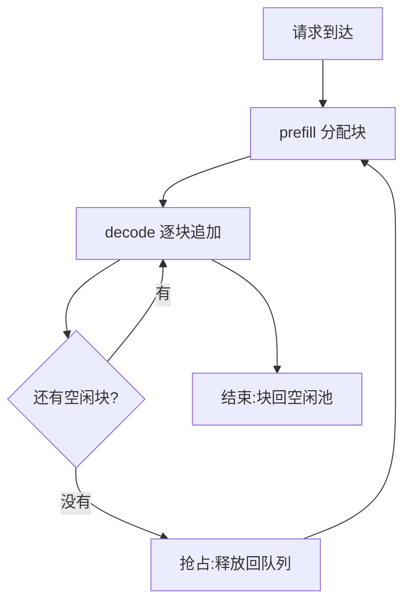

# KV Cache

> 🔴 重点考点:本篇直接对应真实面经高频问法,文末「面试考点串联」给出问法对照。

一句话:KV cache 是用**显存换计算**的一笔交易——把每个 token 算过一次的 K/V 存下来,让 decode 从"每步重算全部历史"变成"读一遍缓存、只算一个新 token";代价是它成了推理系统里唯一随负载线性膨胀的显存项,也是 decode 阶段的带宽瓶颈。

## 一、为什么要缓存:不缓存的 decode 在重复劳动

自回归生成第 $t+1$ 个 token 时,attention 需要**当前这一个 token 的 Q**,去和**前面所有 token 的 K、V** 做交互。Q 只需要一个,K/V 却要一整排。

关键前提是**因果掩码**:第 $i$ 个 token 只能看到它自己和它之前的内容,所以它的 K 和 V 一旦算出来,**在后续任何一步里都不会再变**。不变 = 可缓存。这就是 KV cache 成立的全部理由,也解释了为什么 Q 不缓存(每步只用一次,存了也没人再读)。

不缓存会发生什么?为了拿到第 2 层的 K/V,你得先有第 1 层对所有历史 token 的输出——于是**每生成一个 token,就要把前面所有 token 完整地 prefill 一遍**。设模型参数量 $P$,生成 $n$ 个 token:

$$
\text{不缓存} \approx \sum_{t=1}^{n} 2Pt = Pn^2 \qquad\text{vs}\qquad \text{缓存后} \approx 2Pn
$$

左边:第 $t$ 步要重新前向 $t$ 个 token,每 token 约 $2P$ FLOPs,累加是 $n^2$ 量级;右边:每步只前向 1 个新 token。**比值是 $n/2$——生成 1000 个 token,不缓存要多做约 500 倍的计算。**

缓存之后,一个 decode step 只剩两件事:**把整份 cache 从显存读进来** + **算一个新 token 的 QKV/FFN**。注意这两件事的量级完全不同:计算量降到了 $O(1)$,访存量还是 $O(\text{序列长度})$。第三节讲的所有事情都是这个不对称的后果。

## 二、它长什么样:形状与显存账

### 逻辑形状

$$
[\ \text{层数} L,\ 2\ (K/V),\ \text{batch } B,\ \text{KV 头数 } H_{kv},\ \text{序列长度 } S,\ \text{head 维度 } d\ ]
$$

六个维度里,**只有 $B$ 和 $S$ 随负载变**,其余四个都是模型常量——这就是"KV cache 按 token 计费"的由来。真实实现的维度顺序不长这样:分页之后每层单独存一份 `[2, 块数, 块内 token 数, KV 头数, head_dim]`,batch 与序列长度两个维度被"块表"取代了,见「PagedAttention」篇。

### 每 token 占多少字节

$$
m_{\text{token}} = 2 \times L \times H_{kv} \times d \times b
$$

$2$ 是 K 和 V 各一份,$b$ 是每个元素的字节数(fp16/bf16 是 2)。总量再乘上 $B \times S$ 即可。**这个式子里没有 $H_q$(Q 头数)——省 KV cache 的唯一入口是 $H_{kv}$,这正是 GQA 存在的意义。**

### 代入 Llama-3 算一笔账

| 模型 | $L$ | Q 头数 | **KV 头数** | $d$ | 每 token(fp16) | 8K 上下文/请求 | 128K 上下文/请求 |
|---|---|---|---|---|---|---|---|
| Llama-3-8B | 32 | 32 | **8**(GQA 4:1) | 128 | **128 KiB** | 1 GiB | 16 GiB |
| Llama-3-70B | 80 | 64 | **8**(GQA 8:1) | 128 | **320 KiB** | 2.5 GiB | 40 GiB |

验算 70B:$2 \times 80 \times 8 \times 128 \times 2 = 327680$ 字节 $= 320$ KiB。

第一个该记住的对照:**8B 的 fp16 权重是 16 GiB,而一个 128K 上下文请求的 KV cache 也正好是 16 GiB**——单个长上下文请求就能吃掉一整份模型那么多显存。

再算并发。4×A100-80G 上跑 Llama-3-70B(TP=4):

| 项 | 数值 |
|---|---|
| 卡上显存合计 | 320 GB |
| 权重 fp16 | 140 GiB ≈ 150 GB |
| 扣掉激活/通信 buffer/框架开销后可用于 KV | ≈ 130 GiB |
| 每请求(8K 上下文) | 2.5 GiB |
| **最大并发** | **约 52 个请求** |

**并发上限是被 KV cache 直接算出来的,不是调出来的。** 显存总账的其他项与 OOM 排查见「显存管理与OOM」篇。

### GQA 把分母砍掉了

| 方案 | KV 头数 | 70B 每 token | 相对 |
|---|---|---|---|
| MHA(每个 Q 头配一套 KV) | 64 | 2.5 MiB | **8×** |
| **GQA(8 个 Q 头共享一套 KV)** | **8** | **320 KiB** | 1× |
| MQA(全部 Q 头共享一套) | 1 | 40 KiB | 1/8× |

GQA 是**当前唯一被普遍采用的 KV 缩减手段**,而且它省的是"每 token 的单价",对显存和带宽同时生效。没有 GQA,长上下文推理在经济上根本不成立。

## 三、为什么 KV cache 是 decode 的带宽瓶颈

decode 每一步都要**把整份 KV cache 从 HBM 完整读一遍**,却只算一个 token 的乘加。把 attention 这部分的算术强度写出来:

$$
I = \frac{4 S H_q d}{2 S H_{kv} d\, b} = \frac{2}{b} \cdot \frac{H_q}{H_{kv}} \xrightarrow{\ b=2\ (\text{fp16})\ } g
$$

分子是 $QK^\top$ 和 $\text{attn}\cdot V$ 两次乘加,分母是把这份 cache 读进来的字节数。**序列长度 $S$ 上下约掉了**——decode attention 的算术强度恒等于 GQA 的组数 $g$(70B 是 8,8B 是 4),与上下文长度无关,与 batch 也无关。对照 A100 的 Roofline 拐点 153 FLOP/Byte,这是深度访存受限,详见「Roofline与Bound分析」篇。

**最容易被追问的一点:增大 batch 救不了它。**

| | 权重(线性层) | KV cache(attention) |
|---|---|---|
| 每步读多少 | 一份,**与 batch 无关** | 每个请求各读自己的一份,**随 batch 线性增长** |
| batch 翻倍 | 被摊薄,算术强度 ∝ batch | **强度纹丝不动**(恒为 $g$) |
| 结论 | 加 batch 有效 | **加 batch 无效** |

具体到上面那台机器(batch 32、8K 上下文),每个 decode step 要读:

| 读什么 | 字节 |
|---|---|
| 权重 | 150 GB |
| KV cache(32 × 2.5 GiB) | 86 GB |
| 合计 ÷ 聚合带宽 8 TB/s | **≈ 30 ms / step** |

KV cache 占了 36%。**并发或上下文一翻倍,这 36% 就跟着翻倍,而权重那 150 GB 一动不动**——它是唯一随负载增长的带宽项。这就是"KV cache 是 decode 带宽瓶颈"的准确含义,也是 H20 这类砍算力保带宽的卡为什么专供 decode。prefill/decode 形状差异见「Prefill与Decode的矩阵形状」篇,attention kernel 怎么把这份 cache 读得更高效见「FlashAttention」篇。

## 四、生命周期:分配、增长、释放、抢占

四个阶段:prefill 时按 prompt 长度一次性申请;decode 每步序列长度 +1,**只有跨过块边界才申请新块**;请求结束(EOS / 达到 max_tokens / 客户端断开)立刻释放;显存不够时触发抢占。

**KV cache 的生命周期严格绑定请求**——没有跨请求的常驻状态(前缀缓存是例外,见第六节)。这也是为什么它的显存曲线随并发量剧烈起伏,而不像权重那样是一条直线。

### 抢占:重算还是换出

| 方案 | 做法 | 代价 | 现状 |
|---|---|---|---|
| **重算(recompute)** | 块全部释放,请求退回等待队列队首,轮到时重新 prefill | 白做一次 prefill(计算) | vLLM 当前的**唯一**方式 |
| **换出(swap)** | 把 KV 拷到 CPU 内存,轮到时再拷回来 | 两趟 PCIe 传输(带宽) | 早期支持,**现已废弃** |

**为什么重算赢了**,两条原因:一是 prefill 是计算受限、恰好是 GPU 最擅长的胖大 GEMM 形状;而 PCIe 即使 Gen5 也只有几十 GB/s,比 HBM 慢一到两个数量级,搬几 GiB 的 cache 往往比重算还慢。二是开了前缀缓存之后,被释放的块**不会立刻被覆盖**——它们带着哈希留在空闲队列里等着被淘汰,重新 prefill 时很可能直接命中,"重算"的实际代价常常远低于账面。

注意区分两个容易混的概念:**抢占换出 ≠ KV 卸载**。当前的 KV offloading 是把**前缀缓存**下沉到 CPU 内存或外部存储做跨请求复用,不是给被抢占的请求腾地方。

抢占频率是个好用的健康信号:日志里频繁出现抢占 = KV 显存不够,该降并发上限、缩上下文,或者上量化。抢占与调度的配合见「连续批处理」篇。

## 五、block-size 怎么选

分页之后,一个块存 `block_size` 个 token 的 K/V(覆盖该层所有 KV 头)。这个值大了小了各有什么影响:

| | block_size 偏大(如 128) | block_size 偏小(如 1~4) |
|---|---|---|
| 内部碎片 | **差**:每个序列最后一块平均浪费半块 | 好,几乎无浪费 |
| 块表长度 | 短,索引开销小 | **长**:8K 上下文 + block=1 就是 8192 个表项,**每步都要读一遍** |
| kernel 效率 | **好**:一次连续读一大段,访存易合并 | **差**:每块查一次表跳一次地址,访存离散 |
| 前缀缓存粒度 | **粗**:整块相同才算命中,差一个 token 丢一整块 | 细,命中率高 |
| 调度灵活度 | 差 | 好 |

内部碎片是可以算的:平均浪费 = 半块 token。70B 上 block=128 时,每请求浪费 $64 \times 320\ \text{KiB} = 20$ MiB,并发 100 就是 **2 GiB 白扔**;block=16 时只有 2.5 MiB/请求,共 250 MiB。

**一般用多少:16。** 这是 vLLM 的默认值,也是实践中最常见的取值。可选值通常是 2 的幂,但会被 attention 后端卡住下限——FlashAttention 后端要求 block_size 必须是 **16 的倍数**,所以 16 就是地板。

16 为什么是甜点,三条理由:

1. **碎片可接受**:平均只浪费 8 个 token 的位置
2. **访存粒度合适**:16 token × head_dim 128 × 2 字节 = 4 KB 一个连续段,正好够一次高效的宽事务
3. **与 kernel tile 对齐**:FlashAttention 类 kernel 本来就按 16/32/64 的 tile 处理 K/V,块大小对齐上去不用额外补边

什么时候调:上下文特别长、并发不高 → 调到 32/64 换 kernel 效率;前缀复用密集 → **不必**为了命中率去缩小物理块,vLLM 另有一个前缀哈希粒度参数可以设得比物理块更细(比如物理块 16、哈希粒度 8),两者解耦。

## 六、两条扩容路:量化与跨请求复用

### 量化:拿容量换吞吐

fp16 → fp8/int8 让 $b$ 从 2 变 1,每 token 字节直接减半。好处**不主要来自"算得快"**(反量化本身还要花时间),而是三层连锁:

1. **同样显存装 2× 的 token**:上面那台机器的并发从 52 涨到约 104,或者并发不变而上下文从 8K 拉到 16K
2. **decode 每步读的 KV 字节减半**:第三节那 36% 的带宽占比降到 22%,每步时间下降
3. **权重被摊得更薄**:batch 翻倍后,那 150 GB 的权重读取分摊到 2× 的 token 上——**这才是吞吐提升的大头**

一句话答法:**KV cache 量化是用精度换容量,再用容量换吞吐。** 具体怎么量化(scale 按 token 还是按 head、静态还是动态、CUDA Graph 与 TP 下怎么拿参数、fp8 还是 int8)见「KVCache量化」篇,本篇不展开。

### 前缀缓存:让公共前缀只算一次

同一个 system prompt、同一套 few-shot 模板、多轮对话里不变的历史——这些前缀在不同请求里**逐 token 完全相同**,K/V 自然也完全相同,没必要各算各的。把这些块留下来给后来的请求命中,省掉的是整段 prefill 的计算。自动发现公共前缀的数据结构见「RadixAttention」篇;把缓存下沉到 CPU 内存或远端存储做集群级共享,见开源解读模块的 LMCache 系列。

## 七、面试考点串联

| 高频问法 | 本文哪一节 |
|---|---|
| KV cache 的原理是什么?为什么能缓存 K/V 不缓存 Q? | 一(因果掩码 ⇒ K/V 不变) |
| 不用 KV cache 要多算多少? | 一($Pn^2$ vs $2Pn$,差 $n/2$ 倍) |
| KV cache 的形状是什么?显存占用怎么算? | 二(六维形状 + 每 token 公式) |
| Llama-3-70B 一个 8K 请求占多少 KV?一台机器能并发多少? | 二(2.5 GiB;TP=4 约 52 并发) |
| GQA 为什么能省 KV cache?省多少? | 二(公式里只有 $H_{kv}$;70B 省 8 倍) |
| 为什么 decode 是访存受限?KV cache 在带宽里占多少? | 三(强度 = $g$;实例中占 36%) |
| 增大 batch 能不能缓解 KV cache 的带宽压力? | 三(不能——权重摊薄,KV 不摊薄) |
| KV cache 什么时候分配、什么时候释放? | 四(严格绑定请求生命周期) |
| 显存不够时怎么办?抢占是重算还是换出,为什么? | 四(重算赢:PCIe 太慢 + 前缀缓存兜底) |
| block-size 大了/小了分别有什么影响?一般用多少? | 五(五维对照表;默认 16) |
| 对 KV cache 做量化有什么好处? | 六(容量换吞吐的三层连锁) |
| 多个请求共享同一个 system prompt 怎么省? | 六(前缀缓存) |

延伸阅读顺序:本篇(是什么、多大、为什么慢)→ PagedAttention(怎么分页管)→ RadixAttention(怎么跨请求复用)→ KVCache量化(怎么压小)→ 显存管理与OOM(整体显存账)。

## 相关文献

- Efficient Memory Management for Large Language Model Serving with PagedAttention(vLLM / 分页与块管理)— [arXiv:2309.06180](https://arxiv.org/abs/2309.06180)
- GQA: Training Generalized Multi-Query Transformer Models from Multi-Head Checkpoints — [arXiv:2305.13245](https://arxiv.org/abs/2305.13245)
- Fast Transformer Decoding: One Write-Head is All You Need(MQA 原始论文,最早点明 KV 读取是 decode 的带宽瓶颈)— [arXiv:1911.02150](https://arxiv.org/abs/1911.02150)
- Efficiently Scaling Transformer Inference(推理访存/延迟的解析模型,含 MQA 对长上下文的作用)— [arXiv:2211.05102](https://arxiv.org/abs/2211.05102)
- SGLang: Efficient Execution of Structured Language Model Programs(RadixAttention 前缀复用)— [arXiv:2312.07104](https://arxiv.org/abs/2312.07104)
- vLLM 官方文档(block_size、前缀缓存、KV 卸载等配置口径)— https://docs.vllm.ai/
