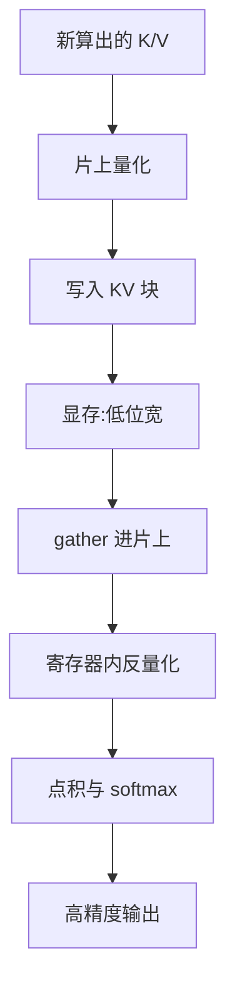

# KVCache 量化

> 🔴 重点考点:本篇直接对应真实面经高频问法,文末「面试考点串联」给出问法对照。

一句话:KV cache 量化是在"**写进缓存**"和"**读出来算**"之间插一层压缩——收益全部来自 HBM 的容量与流量(账已经在 KVCache 篇算过),难点全部来自两件事:**K 和 V 的分布不一样**,以及 **scale 这份小小的元数据要在分页、CUDA Graph、TP 三重约束下活下来**。

## 一、换成 KV 之后,难点全变了

量化公式、scale/zero-point、per-x 粒度的通用定义见 量化 篇;权重侧的 GPTQ/AWQ 与激活离群值处理见 权重与激活量化 篇;"压小 KV 能换多少吞吐"见 KVCache 篇第六节。本篇默认这些都看过,只讲**怎么做**。

| | 权重 | 激活 | **KV cache** |
|---|---|---|---|
| 什么时候产生 | 训完就定,离线 | 每层算完即用即弃 | **在线产生,产生后长期存活** |
| 被读几次 | 每步一次 | 一次 | **被此后每一步反复读** |
| 误差怎么传播 | 固定偏差,可离线补偿 | 当步即消 | **写进去就固化,污染此后所有步** |
| scale 存在哪 | 打包进 checkpoint | 不用存 | **要和 KV 一起活到请求结束** |

三条推论,后面所有设计都是它们的后果:**① 量化一次、反量化无数次**——一个 token 的 K/V 只量化一次,却要被后续几百上千步各读一遍,"量化那侧多花点、反量化那侧少花点"永远划算;**② 写进去的误差没有补救机会**——权重量化能用二阶信息补偿、激活量化错了下一步就翻篇,KV 一旦低精度落盘原始值就丢了;**③ scale 是一份必须跟着 KV 走的元数据**,要跟着块被分配、释放、前缀共享,甚至跨节点搬运(见 PD分离 篇),所以"scale 存在哪"是真问题、不是实现细节。

## 二、K 和 V 为什么要分开:四重矛盾

### 分布事实:K 有离群通道,V 平缓

KIVI 论文系统测过 KV cache 的元素分布,结论是**非对称**的:**K 应该按 channel 量化,V 应该按 token 量化**。原因是 K 的幅度沿 head_dim 有几条固定的"大通道"(和 Massive Activations 一文描述的输入无关的极大激活是同一类现象),而 V 沿哪个方向切都差不多平。

> 🖼️ 占位:同一层的 K cache 与 V cache 幅度热力图并排——K 图上几条固定通道呈亮色竖条,V 图整体平缓无明显条纹

### 算术事实:scale 落在求和维上就提不出来

"求和维上的 per-channel scale 提不出点积"这条一般原理见 量化 篇。放到 attention 上要**分两次乘法**看:

$$
S_{t} = \sum_{c=1}^{d} Q_c K_{t,c}, \qquad O_{d'} = \sum_{t} P_t V_{t,d'}
$$

人话:第一次乘法沿 **channel** 维求和,第二次沿 **token** 维求和。一个 scale 免不免费,只看它落不落在**当前这次求和的那一维**上。

| 张量 | 粒度 | 在求和维上? | 代价 |
|---|---|---|---|
| K | per-token($s_t$) | 否 | **免费**:MMA 出来后每行乘一个数 |
| K | **per-channel($s_c$)** | **是** | 只能逐元素反量化;或折进 $Q$(数学等价,但要求同组 token 共用一套 $s_c$,kernel 遍历顺序被绑死) |
| V | per-token($s_t$) | 是 | **仍然便宜**:$\sum_t (P_t s_t)\hat V_{t,d'}$,而 $P_t$ 本就是寄存器里的标量,多一次乘法而已 |
| V | per-channel | 否 | 便宜,但 V 没有离群通道,做了没收益 |

矛盾于是很清楚:**K 的分布想要 per-channel,K 的算术想要 per-token;V 两边都不为难。** 这才是"K 按 channel、V 按 token"背后真正被考的东西。注意第三行那顿免费午餐有前提——**只有 $P$ 还是浮点时才成立**;想让 $PV$ 也走整数 MMA,$P$ 得先量化成整数,就吃不下一个逐 token 的浮点因子了。

### 第三重:RoPE 会把通道结构抹匀

RoPE 把 head_dim 上的通道**两两配对做旋转,旋转角随 token 位置变化**。于是 post-RoPE 的 K 里,同一个通道在不同位置上是两个原始通道的、随位置摆动的线性组合——per-channel scale 想抓的那个"跨 token 稳定的通道结构"正好被破坏。KVQuant 的解法是 **pre-RoPE 量化**:加 RoPE 之前就把 K 量化存下来,读出来反量化之后再补 RoPE。代价是读路径上多一步按绝对位置算的旋转;而 decode 侧本来就访存受限、算力闲着,**这是少见的"拿算力换精度"真划算的地方**。

### 第四重:per-channel 的 scale 跨 token,而 decode 逐 token 追加

per-token 的 scale 只统计这个 token 自己的 $d$ 个数,写完就定死。per-channel 的 scale 要统计**该通道上所有 token** 的范围:新来一个 token 若在通道 $j$ 上更大,通道 $j$ 的 scale 就该变;scale 一变,**该通道上此前所有已量化的值全部作废,要整份重写**。decode 每步都来一个新 token,这就是灾难。两条真实解法:**KIVI** 把 token 按固定大小分组,每组封口时定一次 per-channel scale、组内不再改,最近的若干 token(residual)保持全精度、凑满一组才封口;**KVQuant** 干脆**离线校准**出 per-channel scale、运行时不再更新,论文明确写了理由——在线算 scale 精度更好,但 per-channel 每来一个 K 都要重算并回改所有历史 K,不可行。**结论**:per-channel K 是学术线(2/3-bit 靠它),per-token / per-head 是工程线(fp8/int8 靠它)。答这道题要能说出 KIVI 的结论,再点破它同时和 RoPE、求和维、追加写三处打架。

## 三、粒度在 KV 上的具体形态

设 head_dim $=d$(常见 128),KV 以 $b$ 字节/元素存:

| 粒度 | 一个 scale 覆盖 | scale 张量(每层) | 谁在用 |
|---|---|---|---|
| per-tensor | 该层全部 token × 全部 KV head × $d$ | 标量,K/V 各一 | vLLM 默认、TensorRT-LLM 默认 |
| per-head | 一个 KV head 的全部 token × $d$ | `[KV 头数]` | vLLM 的 per-head 方案(仅 FlashAttention 后端) |
| per-token | 一个 token 一个 head 的 $d$ 个数 | `[token 数, KV 头数]`,随 cache 增长 | KIVI 的 V 侧 |
| per-channel(每 $G$ 个 token 一组) | 一个通道上连续 $G$ 个 token | `[token 数/G, KV 头数, d]` | KIVI / KVQuant 的 K 侧 |

分野在**第三列**:前两种的 scale 是**模型级常量**,和权重一起放在 checkpoint 里、加载时读进一小块常驻显存,分页管理器对它完全无感——块的分配、释放、前缀共享一个字都不用改(分页机制见 PagedAttention 篇)。后两种是**随 KV 一起增长的张量**,必须和 KV 块同生共死:要么塞进块本身的尾部(块的物理大小变成"数据 + 元数据"),要么另开一个和块池一一对应的 scale 池、用同一个块号索引;后者实现简单,但**多一次独立且散点的显存访问**。**这是静态量化在工程上碾压动态量化的一个隐藏原因**——静态 scale 让分页对量化完全无感。元数据开销则可以直接算:

$$
\text{元数据占比} = \frac{\text{每组 scale / zero-point 的字节数}}{\text{组内元素数} \times b}
$$

人话:摊到每个元素头上,一个 scale 要多背多少字节。代进几组常见配置($d=128$,每组 4 字节元数据):

| 配置 | 组内元素数 | 占比 |
|---|---|---|
| fp8 / int8 per-token | 128 | **3.1%** |
| int4 per-token | 128 | **6.2%** |
| int8 per-channel,$G=32$ | 32 | **12.5%** |
| 2-bit per-channel,$G=32$ | 32 | **50%** |

最后一行是低位宽方案的隐性成本:**位宽越低、分组越细,元数据越吃掉压缩收益**,"2-bit KV" 的实际压缩比远达不到 8 倍。per-tensor / per-head 每层只有几个数,占比可以直接当 0。

## 四、动态 vs 静态:收益各来自哪里

| | 动态量化 | 静态量化 |
|---|---|---|
| scale 从哪来 | 每步现算(absmax / min-max) | 离线校准定死,或直接取 1.0 |
| 精度 | 好,scale 永远贴着当前数据 | 取决于校准集是否覆盖线上分布 |
| 运行时开销 | 多一遍规约 + 多一份元数据读写 | **零** |
| 分页 / CUDA Graph 友好度 | 要额外处理 | 天然友好 |
| 分布漂移 | 自动跟随 | **掉点的主要来源** |
| 谁在用 | 研究方案 | **主流推理引擎的唯一选择** |

**动态那三笔开销**:① **一遍规约**——量化前要求组内 absmax,per-token 的组只有 $d=128$ 个元素、一次 warp 内规约就完事,per-channel 的组跨 token 就是上一节那个灾难;② **一份额外流量**——每读一块 KV 就要多读一份 scale,而且是按块表散点访问,**decode 本来就被访存卡死**,多一次不合并的访存不是零成本;③ **潜在同步**——若 scale 读回 host 再当标量参数传给 kernel,那就是一个 d2h 同步点,后果见第八节。

**静态的收益不是"算得快",是整条链上什么都不用做**:写时乘一个常数再转格式,读时乘另一个常数,没有规约、没有额外元数据、没有同步、没有生命周期管理。极端情况更彻底:**fp8 + scale = 1.0 时连乘法都没有**,写是一条格式转换指令、读是反过来一条。vLLM 的 `--kv-cache-dtype fp8` 默认就是这个配置(不给校准就全取 1.0),它敢这么默认是因为 **E4M3 能表示到 ±448,而 bf16 的 K/V 通常远在这个范围之内**——scale=1.0 不是偷懒,是"这个格式的量程本来就够"。这条在 int8 上完全不成立,见第九节。三家官方口径摆在一起:

| 引擎 | 格式 | scale 怎么来 | 粒度 |
|---|---|---|---|
| vLLM | fp8_e4m3 / fp8_e5m2 | 不校准全取 1.0;或 warmup 时用一批 token 估一次;或 llm-compressor 离线校准 | per-tensor,或 per-head(仅 FlashAttention 后端) |
| SGLang | fp8_e4m3 / fp8_e5m2(fp4_e2m1 实验中) | 校准参数 JSON,或 checkpoint 自带的每层 k_scale / v_scale | per-tensor / 每层 |
| TensorRT-LLM | INT8 / FP8 / NVFP4 KV cache | 离线 PTQ 校准(常见 `calib_size 512`) | per-tensor |

三家都是**静态**。vLLM 那个"warmup 时估一次"看着像动态,其实是**一次性算完就冻结**,本质仍是静态——社区也报告过它在某些混合架构模型上因那一次前向不具代表性而估偏、并一直错下去。

## 五、attention 算子怎么改:反量化放在哪一层存储上

先钉死一件事:**反量化绝不能是一个独立 kernel**。若先起一个 kernel 把低位宽 KV 从显存读出、反量化成 bf16 再写回显存,再让 attention 去读,每个元素的 HBM 流量就从 2 字节变成 1(读)+ 2(写)+ 2(读)= 5 字节,比不量化还差。**量化的全部收益就在"HBM → 片上"这一段,所以反量化必须发生在数据已经过了这道门之后**,也就是在 shared memory 或寄存器里;写侧同理,量化必须和"把新 token 的 K/V 写进块"融进同一个 kernel。

在分页 gather 与 online softmax 之上(原理分别见 PagedAttention 篇、FlashAttention 篇),具体多出三处改动:**写侧** kernel 原本只做"RoPE + 按 slot 散写",现在多做"定 scale + 量化";**读侧** gather 进来的还是低位宽数据,**一次 128-bit 宽事务原本装 8 个 fp16、现在装 16 个 fp8**——这就是"带宽减半"在 kernel 里的具体形态,进了寄存器再展开;**块池布局**上同样的 `block_size`(按 token 计)对应的物理块小一半,可分配块数翻倍。

### 能不能直接开低位宽 MMA 算 $QK^\top$ 和 $PV$

分两个阶段答,答案相反。**decode 侧:能,但没意义。** decode 的 $QK^\top$ 根本不是 GEMM——query 只有一行(GQA 下把同组几个 q head 塞进 M 维也才四到八行),而 Tensor Core 的 MMA 最小 16 行起步。这个形状下算力压根没用满,换整数 MMA 是在一个空闲部件上省时间。**decode 侧 KV 量化省的是访存,一分算力都没省**;主流引擎当前就是"存时量化、读时反量化回 bf16 再算",显存收益是实的、算力收益不一定有。

**prefill 侧:能,而且真在用。** prefill 的 $QK^\top$ 是胖大 GEMM,低位宽 MMA 的算力翻倍是实打实的,FlashAttention-3 在 Hopper 上就有完整 fp8 路径(论文报 fp8 下接近 1.2 PFLOPS,数值误差比朴素 fp8 attention 低 2.6 倍)。但要分清:**那是"把 attention 的计算量化",不是"把 KV cache 量化"**——prefill 的 K/V 是刚算出来的、还没进缓存。两件事可叠加,收益来源不同。

不管哪个阶段,真要走整数 MMA 都还有两处必须处理:**Q 也得量化**(且 $S$ 出来是整数累加值,要乘 $s_q s_k$ 才还原成分数);**softmax 必须在 fp32 里做**,所以 $P$ 出来是浮点,想让 $PV$ 也走整数就得**把 $P$ 再量化一次**,多一层误差,还赔掉第二节那顿免费午餐。

## 六、prefill 与 decode 的处理差异

| | prefill | decode |
|---|---|---|
| 一次产生多少 KV | 整段 prompt | **1 个 token** |
| 能看到什么 | 整段分布,可段内统计 | 只有这一个 token 自己 |
| 能不能做 per-channel | **能**,段内按通道统计一次 | 不能,新 token 会改通道范围而历史已写死 |
| 规约成本 | 摊到几千 token 上,可忽略 | 每步一次,占比更显眼 |
| 本身是什么 bound | 计算受限 | 访存受限 |

两条推论。**一是两个阶段必须用同一套 scale**,这不是选择题:同一条序列的 KV 会被两阶段先后写进同一份缓存、读的时候是一起读的,分别用两套 scale 就等于同一份缓存里混了两种编码。静态 scale 天然满足;动态方案则必须把粒度定在"不跨阶段边界"的单位上——per-token 正好满足(每个 token 自己一套,谁写的都一样),per-channel 正好不满足(它的组跨 token)。**二是 chunked prefill 让这条更严格**:开了分块预填后,一次前向里既有某请求的几百个 prefill token、又有别的请求的一个 decode token(调度见 连续批处理 篇),写 KV 的是同一个 kernel,"按阶段分 scale"连表达都表达不出来。

同理,PD分离 篇里那条约束也是这么来的:prefill 实例算出的 KV 要传给 decode 实例,**两端的量化格式与 scale 必须完全一致**,否则传过去的字节流没法解释——静态 scale 在这里又赢一次,它是模型的一部分,天然两端相同。

## 七、静态量化的校准集与参数统计

- **多少条**:**512 条**是行业默认(llm-compressor 的 KV 量化示例、TensorRT-LLM 的 `calib_size` 都用这个数),超过 1024 收益明显递减。道理不难:静态 scale 要估的只是**一个范围**、不是分布的全部形状,几百条足够把尾部探出来
- **什么分布**:必须和线上任务同分布。这比权重量化更要命——权重量化的校准集只影响"补偿得准不准",KV 量化的校准集直接决定 scale 这个**唯一参数**
- **长上下文样本必须专门放**:llm-compressor 的官方 KV 量化示例用 ultrachat 的 512 条对话、`max_seq_length = 2048`,而这套 scale 会被拿去服务 128K 的请求——**校准时见过的最长序列比部署时短了两个数量级**。第九节说的长上下文掉点,很大一部分出在这里,而不是位宽不够

| 统计方式 | 做法 | 适用 |
|---|---|---|
| **absmax** | 取校准集上见过的最大绝对值 | fp8 的默认:格式量程本来就宽,罩住最大值不浪费分辨率 |
| **百分位裁剪** | 取 99.9% 之类的分位数,超出的饱和 | int8 常用:牺牲极少数离群值,换回大多数值的分辨率 |
| **最小化重构误差** | 网格搜 clip 比例,让量化前后 attention 输出差最小 | 低位宽(int4)才值得花这个时间 |

最后一条容易被忽略的纪律:**校准粒度必须和部署粒度一致**——拿 per-tensor 校准出的 scale 去喂 per-head 的 kernel,或者反过来,都是错的。

## 八、量化参数怎么在 CUDA Graph 和 TP/DP 下活下来

### CUDA Graph:由约束推做法

图冻结的是**地址和形状**、不是内容,且图里不能有任何 host 参与(完整边界见 CudaGraph 篇)。套到 scale 上得到三条硬约束:

| 约束 | 对 scale 意味着什么 |
|---|---|
| kernel 参数按值冻结 | scale **不能当标量参数传**——捕获时那个数会被永久录进图 |
| 张量地址按值冻结 | 存 scale 的张量必须**预分配、地址固定**,每步只能原地写内容 |
| 不允许 host 同步 | 规约结果**不能 `.item()` 回 host**,也不能据此在 Python 里走 if |

由约束直接推出做法:**静态 scale 什么都不用做**——它是一块常驻的、地址固定的、内容永不改变的小张量,kernel 按指针读,和 KV cache 本身"变内容不变地址"是同一个道理;**动态 scale 必须全程留在设备上**——规约 kernel 把结果写进那块预分配的固定地址张量,attention kernel 按**指针**去读,host 从头到尾不知道 scale 是多少,这和投机解码里"接受了几个"必须留在设备上是同一套手法(见 投机解码 篇)。规约 kernel 自己的形状只由 batch 决定,而 batch 正是分档变量,所以它能被一起捕获。

三种典型破图写法(前两种静默出错,第三种直接捕获失败):

1. `scale = k.abs().amax().item()` 再把这个 Python float 传给 kernel → 捕获期那一个值被冻结,此后每步都在用第一批数据的 scale
2. 每步重新分配一个 scale 张量 → 图里录的是老地址,规约写到新地址,attention 读到陈旧内容
3. 依赖设备端数值的 host 分支(如 `if scale > thresh`)→ 捕获直接报错

**面试直答**:静态 scale 天生图友好;动态 scale 能进图,前提是"规约 → 写固定地址 → kernel 按指针读"这条链上一次 host 都不回。vLLM 那个 warmup 估一次的选项,本质就是把动态压成静态,从此没有图的问题。

### TP:每个 rank 只有自己那几个 head,要不要对齐

TP 按 head 切 attention(切法与通信算子见 并行策略 篇),每个 rank 手里只有自己那几个 KV head。判断 scale 要不要 all-reduce,只需问一个问题:**这个 scale 服务的"量化 → 反量化"闭环,跨没跨 rank 边界?** 答案是**没跨**——rank $r$ 量化自己的 K/V、写自己的缓存、自己读回、自己反量化、自己算出这几个 head 的输出;TP 的通信发生在输出投影之后,那时数据早已是高精度的。**scale 从生到死没离开过本 rank。**

| 情形 | 要不要对齐 | 为什么 |
|---|---|---|
| per-head / per-token 动态 scale | **不用** | 只被本 rank 用;各算各的反而更贴(范围更窄、误差更小) |
| per-tensor **动态** scale | **看你怎么定义"tensor"** | 若"整层的 K"是逻辑单位,它的 absmax 是全局量,不 all-reduce 就会得到"TP 度数不同、数值结果不同"的模型 |
| 静态 scale(主流) | **不用通信** | 它是 checkpoint 的一部分,离线在完整张量上算好;per-head 的按 head 切片分发,per-tensor 的广播同一个数 |

两种**必须**对齐的情况,都不是"为了算得对",而是"为了字节流能被别人解释":一是 **KV 块要跨 rank / 跨实例搬运**(PD 分离的 KV 传输、跨实例前缀缓存共享、KV 卸载再加载),接收方必须知道发送方用的是哪个 scale——要么 scale 跟着块一起传,要么两端约定同一个静态 scale,工程上都选后者;二是**要求换 TP 度数结果一致**,per-tensor 动态 scale 下 TP=2 和 TP=4 会算出不同 absmax,静态 scale 没这个问题。**DP 更简单**:每个副本是完整模型、服务各自的请求,**任何一份 KV 都不会被另一个副本读到**,静态 scale 从同一 checkpoint 加载天然一致、动态 scale 各副本各算各的也不影响正确性,attention 做 DP、MoE 做 EP 的混合切法也一样。**一句话答法:量化参数的作用域 = KV 的作用域。**

## 九、fp8 / int8 / int4 选型与精度代价

同样 8 bit,两种格式买了不同的东西:

| | int8 | fp8 E4M3 | fp8 E5M2 |
|---|---|---|---|
| 档位怎么排 | 均匀,256 档等间距 | 指数 + 3 位尾数,每个二进制区间 8 档 | 指数 + 2 位尾数,每区间 4 档 |
| 量程 | 完全由 scale 决定 | **±448 自带** | **±57344 自带** |
| 相对误差 | 量程顶端约 0.4%,到量程 1/100 处涨到约 40% | **全程约 3%–6%,与幅度无关** | 全程约 6%–12% |
| 对 scale 的敏感度 | **极高** | 低 | 极低 |

(量程按 OCP 规范;AMD 的 fnuz 变体 E4M3 上限是 ±240,部分引擎文档写的是后者。)这张表解释了所有事:

- **fp8 为什么近乎免费**:相对精度不随幅度衰减,scale 只要"量级对"就行、连校准都能省;而 Ada / Hopper 起 bf16↔fp8 有原生转换指令,在寄存器里做,不占访存也几乎不占算力。**位宽减半的收益直接落袋,代价接近零**
- **int8 为什么必须更细的粒度 + 离群处理**:均匀档位意味着"罩住最大值"和"分辨小值"是零和的,组里混进一个离群值其余值就全挤进头几档。所以 int8 KV 要么把组切小、要么把离群单独拎出来,这两条在第二、三节都是要付钱的。**int8 位宽和 fp8 一样,工程复杂度却高一个档次**——这才是 fp8 在 Hopper 之后成为默认答案的真正原因,不是"fp8 精度更高"
- **E4M3 还是 E5M2**:KV 是前向激活、分布集中,不需要 5 位指数那么宽的量程,选 E4M3 换一位尾数;E5M2 的位置是"连 scale 都懒得给"的兜底
- **int4 / fp4 要付什么**:元数据反噬(第三节表的后两行,压缩比远达不到名义值)、必须做离群处理(QServe 的 W4A8KV4 专门配了 SmoothAttention 把 KV4 精度找回来,Atom 走"离群通道重排 + 混合精度";SGLang 实验中的 fp4 KV 用 16 个元素共享一个指数的微缩放块,比 OCP MXFP4 规定的 32 还细一倍)、以及 4 bit 解包与非对齐访问带来的 kernel 复杂度

### 哪些任务会掉点

掉点形态和权重量化不一样:**KV 量化的误差全部落在 attention 分数上**,而 softmax 对分数的**相对大小**极其敏感。短上下文里候选就几百个、分差大,一点噪声改不了排序;长上下文里候选几万个,真正相关的那几个 token 与背景的分差可能只有零点几,量化噪声足以把它们冲散。所以掉点最明显的是**长上下文检索类**:大海捞针、多针检索、长文档问答、RAG 里从长上下文定位证据;推理类(数学、代码)反而相对稳,因为它们 decode 密集、上下文不长。

一组有实测口径的数(vLLM 官方博客 2026-04,全部用**未校准的 per-tensor scale = 1.0**,是精度下界):

| 项 | 结果 |
|---|---|
| 推理类(AIME25 / GPQA / MATH500 / LiveCodeBench) | 掉 1–2 个百分点以内 |
| 长上下文检索 MRCR,Llama-3.3-70B @128K | AUC 恢复到 97%–98% |
| 长上下文检索 MRCR,Qwen3-30B-A3B @256K | AUC 恢复到 94%–98% |
| 吞吐,Llama-3.1-8B | 输出吞吐 +14.9%,中位 ITL −14.8% |

最后一行值得单说:**+14.9% 比"KV 减半"的直觉小得多**,因为该测试的上下文没长到让 KV 主导带宽(KV 在总带宽里占多少见 KVCache 篇)。同一篇博客的斜率数据更说明问题:ITL 随上下文增长的斜率降到 bf16 的 54%,盈亏平衡点在 7k token 量级——**上下文越长越赚,短上下文时甚至可能被那点额外开销吃掉**。两条收尾边界:**target 侧 vs draft 侧**——投机解码里 draft 的 KV 通常不量化(收益是零头、代价是接受率指数级传导,见 投机解码 篇),本篇讲的全是 target 侧;**别只看困惑度**——KV 量化的困惑度往往几乎不动,长上下文检索却能掉十几个点,和 量化 篇说的"困惑度会骗人"是同一个陷阱。

## 十、面试考点串联

| 高频问法 | 本文哪一节 |
|---|---|
| KV 量化和权重 / 激活量化的难点差在哪? | 一(一次量化、无数次反量化;误差固化;scale 要跟着 KV 活) |
| 为什么 K 按 channel、V 按 token? | 二(KIVI 的分布结论 + 求和维的算术账) |
| K 的 per-channel 和什么打架? | 二(求和维提不出、RoPE 抹匀通道、decode 追加使历史失效) |
| per-token / per-channel / per-head / per-tensor 在 KV 上是什么形状?scale 存哪?开销多大? | 三(四行对照表;模型级常量 vs 随块增长;3.1%–50%) |
| 动态量化和静态量化的收益各来自哪里?主流引擎用哪种? | 四(动态三笔开销 vs 静态"什么都不做";三家全是静态) |
| attention 算子要怎么改?反量化放在哪一步? | 五(必须融进 kernel,在寄存器/shared 里做) |
| 能不能直接用 int8 GEMM 算 $QK^\top$ 和 $PV$?省的是算力还是访存? | 五(decode 能但没意义、纯省访存;prefill 能且在用,但那是另一件事) |
| prefill 和 decode 的量化时机、scale 更新有什么不同? | 六(能不能段内统计 + 必须共用一套 scale) |
| 静态量化的校准集怎么选?参数怎么统计? | 七(512 条、必须同分布、长上下文样本专门放;absmax vs 百分位裁剪) |
| CUDA Graph 下怎么拿量化参数?什么写法会破图? | 八(三条约束 → 全程留设备端;三种破图写法) |
| TP 下 scale 要不要 all-reduce?DP 呢? | 八(不用——闭环没跨 rank;跨实例搬 KV 时才必须约定) |
| fp8 和 int8 怎么选?为什么说 fp8 近乎免费?int4 又要付出什么? | 九(相对误差不随幅度衰减 + 原生转换指令;int4 的元数据反噬与离群处理) |
| KV 量化会让哪些任务掉点? | 九(长上下文检索;推理类相对稳) |

延伸阅读顺序:KVCache(为什么要压)→ 量化(基本概念)→ 本篇(KV 侧怎么做)→ CudaGraph / 并行策略(工程约束的出处)。

## 相关文献

- KIVI: A Tuning-Free Asymmetric 2bit Quantization for KV Cache(K 按 channel、V 按 token 的出处)— [arXiv:2402.02750](https://arxiv.org/abs/2402.02750)
- KVQuant: Towards 10 Million Context Length LLM Inference with KV Cache Quantization(pre-RoPE 量化、per-channel 离线校准)— [arXiv:2401.18079](https://arxiv.org/abs/2401.18079)
- QServe: W4A8KV4 Quantization and System Co-design for Efficient LLM Serving(KV4 + SmoothAttention)— [arXiv:2405.04532](https://arxiv.org/abs/2405.04532)
- Atom: Low-bit Quantization for Efficient and Accurate LLM Serving(离群通道重排 + 量化 KV cache)— [arXiv:2310.19102](https://arxiv.org/abs/2310.19102)
- FP8 Formats for Deep Learning(E4M3 / E5M2 的量程与档位定义)— [arXiv:2209.05433](https://arxiv.org/abs/2209.05433)
- FlashAttention-3: Fast and Accurate Attention with Asynchrony and Low-precision(Hopper 上的 fp8 attention 路径)— [arXiv:2407.08608](https://arxiv.org/abs/2407.08608)
- Massive Activations in Large Language Models(输入无关的极大激活,K 侧离群通道的背景)— [arXiv:2402.17762](https://arxiv.org/abs/2402.17762)
- vLLM 文档 — Quantized KV Cache(per-tensor / per-head、scale=1.0 默认、三条校准路径)— https://docs.vllm.ai/en/latest/features/quantization/quantized_kvcache/
- vLLM 博客 — The State of FP8 KV-Cache and Attention Quantization in vLLM(精度与吞吐实测口径)— https://vllm-project.github.io/2026/04/22/fp8-kvcache.html
- LLM Compressor — KV Cache 量化示例(512 条 ultrachat、`max_seq_length=2048`)— https://github.com/vllm-project/llm-compressor/tree/main/examples/quantization_kv_cache
- SGLang 文档 — Quantized KV Cache(`--kv-cache-dtype`、校准参数 JSON、实验性 fp4)— https://docs.sglang.io/docs/advanced_features/quantized_kv_cache
- TensorRT-LLM 文档 — Numerical Precision(INT8/FP8 KV cache 与 per-tensor/per-token/per-channel 的定义)— https://nvidia.github.io/TensorRT-LLM/reference/precision.html
