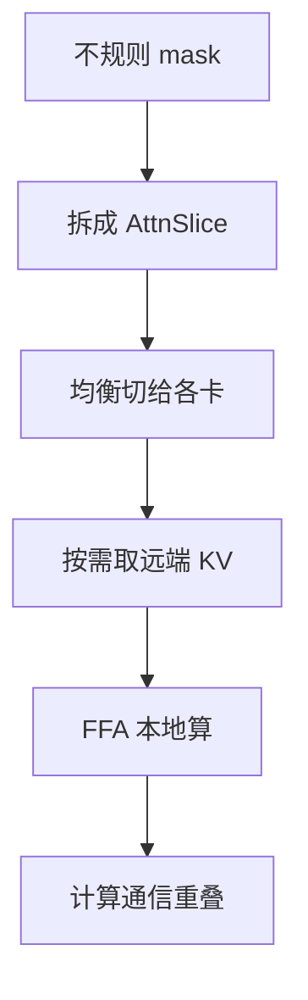

# MagiAttention(分布式注意力实现)

一句话:**它不是一种新的注意力算法,而是一套把注意力算子铺到几十上百张卡上去跑的分布式实现**——出自 Sand.ai 的视频生成模型 MAGI-1,专治「上下文几百万 token + mask 形状七零八落」这种训练场景。它算出来的结果和普通全注意力逐位一致,省的不是 FLOPs,是**多卡协作时白搬的字节和干等的时间**。

> **本篇的证据强度,请先看这一段。** MagiAttention **没有独立论文**:一手材料只有官方仓库、官方技术博客,以及 MAGI-1 arXiv 报告里的一节。「近线性扩展」是**作者自报**,而且只以曲线图呈现、正文没有列出数值;博客自己也写明「这些结果用于展示设计的潜力,实际生产性能可能不同、需要专门调优」。**没有任何第三方复现过它的性能数字。** 所以本篇的写法是:机制讲透,数字讲清出处,第五节专门交代能信到什么程度。

## 一、先把它放对位置:它不在「省注意力成本」的那三条路上

被问到长上下文怎么省钱时,常见的三条路是**压缩、稀疏、线性**。MagiAttention 一条都不属于:

| 路线 | 改的是什么 | 结果还等于标准注意力吗 | 代表 |
|---|---|---|---|
| 压缩 KV | 每个 token 的 K/V **存多大** | 否,低秩近似 | MLA(见 MLA 篇);减头数见 KV共享注意力 篇 |
| 稀疏 | **算哪些边**(连接图) | 否,加了结构假设 | NSA / DSA / 滑窗(见 稀疏注意力 篇、SWA 篇) |
| 换计算形式 | 去掉 softmax,**怎么算** | 否,是近似或换建模 | 线性注意力 / SSM(见 线性注意力 篇) |
| **分布式(本篇)** | **谁来算、数据怎么在卡间流动** | **是,逐位一致** | Ring Attention、Ulysses、**MagiAttention** |

**关键判据只有一条:它改数学,还是只改执行?** 前三条路都改了注意力算出来的值,精度要单独验;MagiAttention 一个 mask 都没删、一个维度都没压,同样的 $Q,K,V$ 进去,出来的还是那个全注意力,只是被拆到多张卡上算完再拼回来。这和 FlashAttention 属于同一类「不改数学只改执行」的手段——差别是 FlashAttention 优化的是**一张卡内部的 HBM 读写**(见 FlashAttention 篇),MagiAttention 优化的是**跨卡的通信与负载**。

所以它真正的近亲是 **Ring Attention 那一支上下文并行(CP)**,不是 MLA、不是 DSA。CP 本身的原理(为什么要沿序列切、K/V 怎么环传、zigzag 怎么做负载均衡)是 并行策略 篇的内容,本篇只讲 MagiAttention 相对它做了什么改动。

一句话记法:**MLA 压 KV,稀疏减边,线性换状态,MagiAttention 换的是排班表。**

## 二、动机:视频训练把两个麻烦叠在了一起

MAGI-1 报告给出的两条压力,单独看都好办,叠在一起就没有现成方案:

**第一条是长度。** 训练时视频 token 的上下文**最长到约 400 万**。这个量级下单卡连一层的激活都放不下,必须上 CP——这一步不新鲜,Ring Attention 就是干这个的。

**第二条是 mask 形状。** 视频是分块自回归的(块内双向、块间因果),训练又要把长短不一的样本 **pack** 进同一条序列省算力,两件事叠加后,mask 变成一张既有因果三角、又有对角块、还被变长边界切碎的不规则图形。**这一条才是现成 CP 顶不住的地方**,原因有三:

1. **kernel 表达不了。** FlashAttention 系列的接口只认几种预设形状(全连接、因果、变长因果、滑窗);上面那种混合 mask 不在菜单里,退而求其次就得物化一张显式 mask 或者补 padding,长度一上百万就是灾难。
2. **切开之后 mask 还得是合法的。** 把序列切给 64 张卡,每张卡手上是原 mask 的一块子矩形——如果 mask 的表示方式不支持「切完还能描述」,分布式就无从谈起。
3. **负载天然不均。** 因果 mask 下,持有序列开头的卡要算的面积远小于持有结尾的卡;pack 之后每条样本长度还不一样,不均衡程度更没规律。**一步的耗时由最慢的那张卡决定**,不均衡就是纯亏。

MagiAttention 的四个组件正好一一对应:一个 mask 表示法、一个 kernel、一个切分求解器、一套通信原语。

## 三、机制:四件事,每件都对着上面一条麻烦

### AttnSlice:把不规则 mask 拆成可切分的三元组

核心表示法。一张任意 mask 被描述成若干个 **AttnSlice** 三元组的并集,每个三元组是 `(q_range, k_range, mask_type)`——「哪一段 query,对哪一段 key,用哪种基本形状」。基本形状只有四种:**FULL、CAUSAL、INV-CAUSAL、BI-CAUSAL**(全连、下三角、上三角、双向带状)。

> **类比**:与其画出整张 mask 的像素图,不如给一份「施工清单」:第 0–2048 行对第 0–2048 列做下三角,第 2048–4096 行对第 0–4096 列做全连……

**为什么非要这个表示法?因为它对切分封闭。** 一个矩形区域被沿 query 维切成两半,得到的仍然是两个合法的三元组;像素图切开之后就只是两堆散点,没法交给 kernel。变长因果、滑窗、块因果、块因果加全局块,都能写成十几个三元组,而不是一张几百 GB 的布尔矩阵。仓库也提供了从常规 `cu_seqlens`、滑窗参数反推 AttnSlice 的辅助函数,不必手写。

### FFA:能吃这份清单的 kernel

**Flex-Flash-Attention(FFA)** 是在 FlashAttention-3 上改出来的 kernel,把并行粒度从「整张 mask」下放到「单个 AttnSlice」:每个 slice 独立算出自己的局部结果,再用原子操作合并——因为不同 slice 可能覆盖同一段 query,合并时要正确地做在线 softmax 的重规约。作者自报在 Hopper 上性能与 FA3 相当。

硬件支持的现状值得记一下,它直接决定能不能用:**原生 FFA 只有 Hopper 有**;Blackwell 是靠 fork 的 FlashAttention-4 做的临时后端(`FFA_FA4`),Ampere 的支持是后来才补上的。

### dispatch solver:按「面积」均衡,不是按 token 数

先沿 query 维把全局 mask 切成固定大小的 chunk,再决定每个 chunk 归哪张卡。目标函数是:

$$
\min_{\text{分配方案}}\ \max_{r\ \in\ \text{各 CP rank}}\ \text{Area}(r)
$$

意思是:**让「算得最多的那张卡的工作量」尽可能小。** 这里的 `Area(r)` 不是分到的 token 数,而是这张卡手上所有 chunk 在 mask 上**真正要算的面积**——因为一步的墙钟时间等于最慢那张卡的时间,均分 token 数在因果 mask 下会让持有开头的卡闲着。求解用的是贪心 Min-Heap,复杂度 $O(n\log n)$,预处理开销可以忽略。

这是**静态 solver**:假设整张 mask 在前反向、各层之间都不变,可以在预处理阶段一次算好。层与层 mask 不同的混合注意力需要**动态 solver**,官方标注为实验中。

### GroupCast / GroupReduce:去掉环传的冗余

Ring 式 CP 的做法是 K/V 沿环逐跳传一整圈,好处是实现简单、通信规整,坏处是**有些卡收到的块自己根本用不上**——因果 mask 下这部分白传约 **25%**,换成带全局块的变长块因果这类不规则 mask,浪费**超过 33%**(以上为官方博客自报)。

MagiAttention 的替代方案是两个自定义原语:**GroupCast**(前向把 K/V 只发给真正需要它的那几张卡)和 **GroupReduce**(反向把 dK/dV 只归约回该去的地方)。两者都建在 **All-to-All-v** 之上,配 Range-Gather / Range-Scatter-Reduce 两个搬运 kernel;后续版本改成了原生 CUDA 实现,思路取自 DeepEP(该库见 MoE并行与DeepEP 篇;All-to-All 这类算子本身的语义见 集合通信 篇)。

### 多级 overlap:把通信藏进计算

前向在算当前一段 FFA 的同时预取下一段的远端 KV;反向则同时做三件事——预取下一段 KV、归约上一段的部分 dKV、算当前段。理想情况下只有最后一段的通信露在外面。重叠的段数由 `overlap_degree` 控制,可手动指定也可自动搜索;**官方明确建议先手调**,因为自动搜索依赖对计算/通信比值的估计,目前表现不佳。

搬什么也有两档:默认只搬 **KV / dKV**,Q 和输出留在本地;另有一档允许连 **Q / O 一起搬**(哪边便宜搬哪边),但它依赖上面那个动态 solver,同样标为实验中。

### 四件事合起来,相对现有 CP 改了什么

| 维度 | Ring 式 CP | Ulysses 式 CP | MagiAttention |
|---|---|---|---|
| 通信形态 | K/V 沿环逐跳传一圈 | 在头维做 All-to-All | 按需 GroupCast / GroupReduce |
| 不规则 mask | 需物化 mask 或补 padding | 同左 | AttnSlice 原生表达,切完仍合法 |
| 负载均衡 | 因果下靠 zigzag 交错切 | 受头数限制,与 mask 无关 | solver 按 mask 面积最小化最大值 |
| 主要瓶颈 | 冗余通信随环长累加 | **并行度被头数卡住** | 自报可扩到 64 卡近线性(未经复现) |

Ring 与 Ulysses 各自的机制见 并行策略 篇;本表只用来定位 MagiAttention 动了哪几处。

## 四、已知代价与硬约束

这一节的内容全部来自官方文档自己列的限制,不是外部批评——**能把自己的坑写清楚,反而是这个项目比较可信的地方**。

| 代价 / 约束 | 具体是什么 | 意味着什么 |
|---|---|---|
| All-to-All-v 的额外搬运 | Range-Gather / Range-Scatter-Reduce 带来额外的显存内拷贝 | 省下的跨卡字节要先扣掉这部分本地开销 |
| 同一份数据发给多个 peer | 跨机时这份重复会真实占用 RDMA 带宽 | 「零冗余」是指逻辑通信量,不等于物理链路上零重复 |
| 静态 solver 的前提 | 假设 mask 在预处理时已知且不随层变化 | 逐层变化的混合注意力用不了静态路径 |
| 自动 overlap 搜索不成熟 | 官方建议手动调 `overlap_degree` | 上生产要留调参的时间预算 |
| 整除约束 | `seqlen % (cp_size × chunk_size) == 0` | 数据管线要配合,不能随便改 CP 度 |
| 架构绑定 | 原生 FFA 只在 Hopper;Blackwell 走 fork 的 FA4 后端 | 换代硬件时性能画像要重测 |

再加一条不在官方清单里、但选型时必须问的:**它是训练侧的东西。** 解决的是 pack 后异构 mask 的前反向,不碰推理时的 KV cache 管理与解码(那些见 KVCache 篇)。拿它去优化在线推理是问错了对象。

## 五、能信到什么程度:这一节比机制更值得记

新方法的评估比新方法本身更常被问到。MagiAttention 正好是个干净的样本:

**一手出处只有工程材料。** 用 arXiv 全站检索「MagiAttention」,只返回 MAGI-1 一篇。官方推荐的引用格式是指向 GitHub 的 `@misc`,作者两人,年份 2025。**它从来没有作为独立论文投出去过,也就没有经过同行评审。**

**一个必须避开的误引。** 社区里(包括 PyTorch torchtitan 的 RFC)常把 **arXiv:2505.13211** 标成「MagiAttention 论文」——那个编号是 **MAGI-1 视频生成报告**,MagiAttention 只是其中训练基建的一节,附录也没有给出完整数值。引用时把这两件事说成一件,是会被追问的。

**数字只有图,没有表。** 官方 CP 基准的设置是公开且具体的:batch size 1、GQA 头配 64:8:8、head dim 128、bf16,CP 从 8 张卡扩到 64 张,每卡序列长 H100 上 8K、B200 上 16K(总长随卡数线性增长),mask 覆盖 full / causal / varlen full / varlen causal,对比对象是 Ulysses、Ring P2P、Ring AllGather、USP、LoongTrain、Megatron HybridCP。**设置无可挑剔,但结论只以曲线图呈现,正文不给数值。** 换句话说,「近线性」这个说法你无法独立核对。

**第三方是「有人用」,不是「有人复现」。** 这两件事差别很大:

| 证据类型 | 现状 |
|---|---|
| 独立论文 / 同行评审 | ❌ 无 |
| 第三方性能复现 | ❌ 无。现有唯一一个专门的长上下文 CP 基准(LongCA-Bench,arXiv:2510.17896,96 卡 / 512K)评测了 Ulysses、Ring P2P、Ring AllGather、USP、LoongTrain,**没有把 MagiAttention 纳入** |
| 第三方消融 | ❌ 无。四个组件谁贡献了多少,只有作者的说法 |
| 第三方使用 | ✅ 有。如 LocateAnything(arXiv:2605.27365)用它处理 NTP+MTP 混合流产生的异构 mask,但**没有单独报任何归因于它的加速数字** |
| 框架集成 | 🟡 进行中。有 Megatron-LM 的官方 fork 与示例;PyTorch torchtitan 侧是 RFC 加 PR,尚未合入 |

**该怎么下结论?** 「有真实项目在用、官方把限制写得很清楚」是正面信号,说明它不是纸面工作;但「无论文、无复现、无消融、数字只有图」意味着**你不能把它的扩展性曲线当作已确立的事实去引用**。要用它,判据不是别人的曲线,是**在你自己的 mask 和集群上跑一遍**——这也是它的博客自己给的建议。

## 六、面试考点串联

**下表全部是补充题**:全库检索确认题库中没有任何题目的 `topic` 指向本篇。前沿工程项目本身不是常见考点,所以出题重心放在**可迁移的判断力**上——怎么给一个新方法归类、怎么评估一个没被复现的结果——而不是背它的组件名。

| 高频问法(补充题) | 本文哪一节 |
|---|---|
| 有人推荐一个新注意力方法说能「线性扩展」,你会先问什么?怎么判断值不值得上生产? | 五(改数学还是改执行 / 有无一手出处与复现 / 硬约束);分类框架见 一 |
| MagiAttention 和 MLA、稀疏注意力是一回事吗?它省的到底是什么? | 一(改数学 vs 改执行;它省通信与等待,不省 FLOPs) |
| 训练时把多条样本 pack 进一条序列,mask 会变成什么样?为什么现成的 FlashAttention 接不住? | 二(三条原因)+ 三(AttnSlice 为什么要对切分封闭) |
| 长序列切到几十张卡上,为什么按 token 数均分反而不均衡?该按什么均? | 三(dispatch solver:按 mask 面积均衡最大值,因为一步耗时由最慢的卡决定) |
| Ring 式环传 K/V 有什么浪费?能怎么改?改完的代价是什么? | 三(GroupCast / GroupReduce)+ 四(本地搬运与 RDMA 重复);Ring 本身见 并行策略 篇 |
| 这类工程优化上生产前,你会关心哪些硬约束? | 四(整除约束、架构绑定、静态 solver 前提、手调 overlap) |

## 相关文献

**一手来源(注意:没有独立论文)**

- MagiAttention 官方仓库(推荐引用格式即指向此处)— https://github.com/SandAI-org/MagiAttention
- MagiAttention 官方技术博客(AttnSlice、FFA、dispatch solver、GroupCast/GroupReduce、已知限制的完整说明;**不是论文**)— https://sandai-org.github.io/MagiAttention/docs/main/blog/magi_attn.html
- MagiAttention CP 基准博客(基准设置与曲线图;**结果无数值表**)— https://sandai-org.github.io/MagiAttention/docs/main/blog/cp_benchmark.html
- MAGI-1: Autoregressive Video Generation at Scale(把 MagiAttention 作为训练基建的一节;**这不是 MagiAttention 的论文**)— [arXiv:2505.13211](https://arxiv.org/abs/2505.13211)

**对照与背景**

- Ring Attention with Blockwise Transformers for Near-Infinite Context(环传 K/V 的 CP 基线)— [arXiv:2310.01889](https://arxiv.org/abs/2310.01889)
- FlashAttention-3: Fast and Accurate Attention with Asynchrony and Low-precision(FFA 的基座)— [arXiv:2407.08608](https://arxiv.org/abs/2407.08608)
- Long-Context Attention Benchmark: From Kernel Efficiency to Distributed Context Parallelism(第三方 CP 基准,**未纳入 MagiAttention**)— [arXiv:2510.17896](https://arxiv.org/abs/2510.17896)
- LocateAnything: Fast and High-Quality Vision-Language Grounding with Parallel Box Decoding(第三方使用案例,未报归因数字)— [arXiv:2605.27365](https://arxiv.org/abs/2605.27365)
