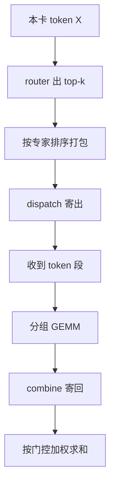

# MoE 并行与 DeepEP

> 🔴 重点考点:本篇直接对应真实面经高频问法,文末「面试考点串联」给出问法对照。

一句话:router 一旦决定了每个 token 去哪几个专家,**剩下的全是系统问题**——怎么把 token 寄到专家所在的卡、怎么把结果收回来、怎么让这两趟通信不白白霸占关键路径。MoE 本身是什么、专家怎么切细,见 MoE基础 篇;router 怎么打分、训练时怎么用 aux loss 均衡,见 MoE路由 篇;EP 的一句话定义与它在 3D 并行里的位置,见 并行策略 篇。本篇从「路由结果已经出来了」这一刻往下接。

## 一、一层 MoE 在多卡上到底发生了什么

### 四步流水与每步的形状

记号先立好:本卡这一层拿到 $T$ 个 token,隐藏维 $h$,top-$k$ 路由,专家摊在 $E$ 张卡上($E$ 就是 EP 规模),每个元素 $b$ 字节。



| 步骤 | 输入形状 | 输出形状 | 关键点 |
|---|---|---|---|
| router | $[T, h]$ | 专家 id $[T, k]$、门控权重 $[T, k]$ | 一个小矩阵乘加 top-k,耗时可忽略 |
| 排序打包 | $[T, h]$ + id | 发送缓冲 $[Tk, h]$、每个目标 rank 的条数 $[E]$ | 一个 token 被**复制 $k$ 份**,分别排进 $k$ 个目标段 |
| **dispatch** | $[Tk, h]$ | $[T_{\text{recv}}, h]$ | $T_{\text{recv}}$ 由别人送来多少决定,**运行时才知道** |
| 专家 GEMM | $[T_{\text{recv}}, h]$ | $[T_{\text{recv}}, h]$ | 收到的 token 已按专家分好段,每段配一份专家权重 → **分组 GEMM** |
| **combine** | $[T_{\text{recv}}, h]$ | $[Tk, h]$ | 原路寄回,收发方向与 dispatch 互换 |
| 加权求和 | $[Tk, h]$ | $[T, h]$ | 每个 token 的 $k$ 份结果按门控权重相加 |

形状这条线一句话记住:**进出 MoE 层的都是 $[T, h]$,中间那一段被放大了 $k$ 倍,而且长度是动态的**。

### 「不规则」到底不规则在哪

这是 MoE 通信和普通集合通信最大的差别,也是面试最容易问到第二层的地方。三处不规则:

1. **收发长度是数据决定的**。TP 的 all-reduce 每次都是同样大小的张量,编译期就能定死;dispatch 要送多少条,取决于这一批 token 恰好选了谁。所以每层都得先把「谁给谁发几条」这张计数表交换一遍,才能开通信。
2. **发送前必须重排内存**。同一个目标 rank 的 token 在原始 buffer 里是散落的,直接发就是几百次小拷贝。所以要先做一次按专家 id 的排序(本质是 argsort + gather),把同目的地的 token 拼成连续一段。这一步的开销真实存在,不是可以忽略的边角。
3. **形状动态 → CUDA Graph 不好用**。decode 阶段本来最指望 CUDA Graph 把 kernel launch 开销压掉(机制见 CudaGraph 篇),偏偏 MoE 这段的张量形状每步都变。后面 DeepEP 的 masked layout 就是冲着这条来的。

至于 all-to-all / AllGather / AllReduce / ReduceScatter 这些算子本身怎么实现、Ring 与 Tree 怎么选、算法带宽怎么算,见 集合通信 篇,本篇只用它们并算通信量。

## 二、四种 dispatch 方案(本篇核心)

### 通信量怎么估

只看**每张卡进出的字节数**(这是带宽账真正关心的量)。两条基准:

$$
V_{\text{All2All}} \;\le\; k\,T\,h\,b, \qquad V_{\text{AllGather}} \;\approx\; E\,T\,h\,b \quad\Longrightarrow\quad \frac{V_{\text{AllGather}}}{V_{\text{All2All}}} \;\approx\; \frac{E}{k}
$$

左式:All2All 只寄该寄的,本卡最多把每个 token 复制 $k$ 份送出去(落在本卡的专家不用送,所以是上界)。中式:AllGather 要求每张卡都拿到**全部** $E$ 张卡的 token,和 top-k 无关。一相除就得到那句该记住的话:**AllGather 的冗余倍数就是「EP 规模除以 top-k」**。DeepSeek-V3 那种 256 选 8 的配置,EP=32 时要多搬 4 倍,EP 上到几百卡就是几十倍——这既是大规模 EP 必须换 All2All 的原因,也是小规模下 AllGather 还活得好好的原因。

### 四种方案对照表

| 方案 | dispatch 每卡通信量 | combine 每卡通信量 | 规则性 | 适用阶段 | 主要缺点 |
|---|---|---|---|---|---|
| **AllGather + ReduceScatter** | $\approx E\,Thb$(拿全所有卡的 token,各自挑本卡专家要的算) | $\approx E\,Thb$(把 $[ET, h]$ 归约后切回各家) | **完全规则**:形状静态、无需交换计数表、CUDA Graph 友好 | EP 小(单节点量级)、作为默认与兜底路径 | 通信量随 EP 线性涨,$E/k$ 倍冗余;还要多出一块全量 token 的显存 |
| **AllReduce** | 同上(或在 TP 布局下**免费**,见下) | $\approx 2E\,Thb$(ring all-reduce ≡ ReduceScatter + AllGather) | 完全规则,实现最省事 | 正确性基线、极小规模 | 最贵的一档;非本卡专家的位置**填零后照样参与求和**,大半带宽在搬 0 |
| **朴素 All2All** | $\le k\,Thb$ | $\le k\,Thb$ | **不规则**:要先排序打包、先交换 split sizes | 通用;EP 一大就只剩这条路 | 对延迟敏感;排序打包本身有开销;负载一歪整层跟着慢;动态形状难上 CUDA Graph |
| **DeepEP** | 与 All2All 同阶,**常数更小**(FP8 dispatch 把 $b$ 减半;跨节点按「节点」而非「GPU」去重) | 同阶(BF16 combine) | 仍不规则,但把不规则性封进库里 | 高吞吐 kernel → 训练与 prefill;低时延 kernel → decode | 依赖 NVSHMEM 与 RDMA 网络、对硬件与网络配置挑剔,运维门槛高 |

三条容易被追问的补充:

- **AllReduce 方案为什么至今没淘汰**:如果 attention 侧走的是 TP,每张 TP rank 本来就持有全量 token,dispatch 这一步的通信**根本不需要发生**,整层只剩最后一次 AllReduce。写起来最短、最不容易错,所以它长期是「先跑通再说」的那条路。
- **combine 侧为什么不能省**:dispatch 送的是输入、combine 送的是输出,两边的字节数同阶。只优化 dispatch 是常见的想当然,实际两趟一样痛。
- **表里的量级只到阶**。真实系统里还要加上路由元数据、padding、FP8 的 scale 这些零头,别把系数当精确值。

## 三、DeepEP:为 MoE 定制的 all-to-all

DeepEP 是 DeepSeek 开源的专家并行通信库,提供的就是 MoE 的 dispatch 与 combine 这一对 GPU kernel。它不是一个更快的通用 all-to-all,而是**把 MoE 的先验知识写进了通信实现里**。

### 两套 kernel,对应两个阶段

官方文档把 kernel 分成两类,分工非常清楚:

| | 高吞吐 kernel | 低时延 kernel |
|---|---|---|
| 面向 | 训练与推理 prefill | 推理 decode |
| 关键设计 | 非对称域带宽转发(见下);可控制占用多少 SM | 纯 RDMA 路径,把延迟压到最短 |
| 重叠方式 | 与计算抢 SM,靠手工划分 SM 配额 | 基于 hook 的重叠,**不占用任何 SM** |
| 数据布局 | 连续 layout:token 紧密排布、每专家一段,不浪费算力 | masked layout:每专家固定槽位 + 掩码,**形状静态,可被 CUDA Graph 捕获** |

分成两套的理由,就是 prefill 与 decode 的瓶颈本来就不同(为什么一个算力受限、一个访存受限,见 PD分离 篇):prefill 一批几千个 token,包大、看的是带宽;decode 一步只有几十上百个 token,包小到带宽根本用不满,唯一重要的是**这一跳要多少微秒**。一个求吞吐、一个求延迟,不可能用同一套 kernel 都做到最好。

### 非对称域带宽转发:省的是慢链路那一段

集群里有两级链路:节点内快、跨节点慢(具体带宽数字与拓扑见 GPU互联与组网 篇)。朴素 all-to-all 完全无视这个差异——一个 token 要去某节点上的 3 张卡,它就跨节点发 3 份。

DeepSeek-V3 的做法是:跨节点**只发一份**,先把 token 沿慢链路送到目标节点里「同槽位」的那张卡,到岸后立刻沿节点内的快链路转发给真正的目标 GPU。慢链路上的流量于是从「每个目标 GPU 一份」降到「每个目标节点一份」。DeepEP 的高吞吐 kernel 就是为这个转发模式写的。

这套转发要成立,得有人保证「目标节点数」不会失控——那就是 **node-limited routing**:路由时限制每个 token 最多落到 4 个节点。V3 报告给的配套数字是,在这个约束下每个 token 平均仍能在每个节点选到 3.2 个专家,几乎不损失路由自由度。两件事是配套的:**架构侧限制扇出,系统侧才敢做转发**。V3 报告同时给出的结论是,这样写下来只需 20 个 SM 就足以打满两级链路的带宽。

### 不占 SM 的重叠,为什么值得单独说

通信 kernel 也是 kernel,也要占 SM。常规的 NCCL 式集合通信会常驻若干 SM 去搬数据,于是「通信与计算重叠」这句话有个隐含代价:**重叠期间计算能用的 SM 变少了**,时间线上看着并行,实际算力被切走一块(SM 与 occupancy 的机制见 GPU架构与执行模型 篇)。

DeepEP 给了两条应对:高吞吐 kernel 允许你显式指定用多少个 SM,把这笔账变成可调参数;低时延 kernel 干脆走 hook 式重叠,官方措辞是「不占用任何 SM 资源」——数据搬运交给网卡的 RDMA 引擎,GPU 只在合适的时刻执行一下收尾的 hook。对 decode 这种 SM 本来就吃紧的场景,这一条比带宽更值钱。

### 两条要标清楚的边界

- **精度配置**:官方给的是 FP8 dispatch + BF16 combine。dispatch 送的是马上要进低精度 GEMM 的输入,降到 FP8 顺理成章;combine 送的是要被门控权重加权累加的输出,精度掉了会直接进残差流。不过**这个「为什么」是笔者的推断,官方只给了配置没给理由**。
- **版本在动**。上面讲的两套 kernel 是 DeepEP 早期(V1)的形态,也是面试里默认的那个版本;仓库后来把接口统一了,并把 V3 式训练场景的 SM 占用从 24 降到 4–6 个。低时延 kernel 最初是纯 RDMA,仓库 roadmap 里另有「为节点内低时延 kernel 支持 NVLink 协议」一项。**具体实现与当前状态以仓库为准,本篇只讲设计取舍。**

## 四、切分方式的组合:attention 用 TP,MoE 用 EP

### 为什么 MoE 层不再 TP 切一刀

细粒度 MoE 时代,单个专家本来就是一个很小的 FFN。再按 TP 切开,每张卡分到的矩阵又瘦又窄,GEMM 效率掉下来(为什么小矩阵吃不满算力,见 GEMM优化 篇);更糟的是 TP 每层要额外的 all-reduce,这笔通信会**叠在 all-to-all 上面**,而两者抢的是同一条节点内链路。反过来 attention 也用不了 EP:它压根没有「专家」这个维度可分。所以工程上的默认配法是:**attention 保持稠密、用 TP 切;MoE 层换成 EP,一张卡放整数个完整专家。**

### EP 的 rank 从哪一维凑出来

卡就那么多,EP 不会凭空多一维——它是把 attention 侧的 **DP 维在 MoE 层重新解释**成 EP 维:同一批 GPU,进 attention 时按 DP 各算各的一份 token,进 MoE 层时按 EP 各持有一部分专家。DeepSeek-V3 的 prefill 部署就写成「MLA 与共享专家走 DP32、路由专家走 EP32」,同一组 32 张卡两种身份。

| 组合 | 怎么摆 | 适合 | 代价 |
|---|---|---|---|
| **DP + EP**(主流) | attention 按 token DP,MoE 层把 DP 组当 EP 组用 | 细粒度专家、大规模推理 | 每层两次 all-to-all,负载均衡责任全在系统侧 |
| **TP + EP** | attention TP,MoE 层内每个专家再 TP 切 | 专家很大、EP 规模开不上去时 | 两种通信抢同一条节点内链路;小 GEMM 效率差 |
| **EP 跨节点** | EP 规模超过单节点卡数 | 大 MoE 的必然选择 | 慢链路进入关键路径,必须配转发 + node-limited routing |

### EP 为什么反而越开越大

看起来 EP 越大通信越痛,但推理侧的实践是往大了开(V3 报告的 decode 配置到了 EP320)。两笔账:**访存账**——每张卡上的专家变少,decode 每步要读的专家权重就少,而 decode 是访存受限的(见 Roofline与Bound分析 篇);**算力账**——EP 越大,能凑进同一批的请求越多,每个专家收到的 token 就越多,分组 GEMM 的每一段变胖,才吃得动 tensor core。稀疏度越高(256 选 8 只激活 3%),越要靠**全局大 batch** 把每个专家的 token 数堆上去。代价写在下面两节:通信规模变大、重叠必须做,负载不均的惩罚随 EP 放大。

## 五、并行的三个必备条件:拆 batch 与两处重叠

### 不重叠为什么等于串行等通信

MoE 这一层的四步是**一条纯串行的数据依赖链**:dispatch 没到齐就没法算,GEMM 没算完就没得寄回。不做任何处理时:

$$
t_{\text{layer}} \;=\; t_{\text{dispatch}} + t_{\text{gemm}} + t_{\text{combine}}
$$

三段首尾相接,两趟通信**全裸露在关键路径上**。这里和 DP 的梯度 all-reduce 有个本质区别:反向传播是逐层产出梯度的,通信天然有别的层的计算可以盖;而 MoE 的 dispatch 和紧随其后的 GEMM 之间**没有第三件事可干**。想重叠,只能人为再造一股独立的工作流——这就是「拆 batch」这个条件的来源。

### 三个条件

1. **拆 batch(前提)**:把一批请求切成两个 micro-batch,让它们错开一拍。DeepSeek-V3 的 prefill 用的就是双 micro-batch 交替,decode 侧则把 attention 拆成两步、凑成一条五阶段流水线。
2. **dispatch–GEMM 重叠**:A 批在飞的时候算 B 批。
3. **combine–GEMM 重叠**:A 批的结果在回程的时候算 B 批。

三条都做到,理想情况下这一层的耗时从「三段相加」变成 $\max(t_{\text{comm}},\, t_{\text{gemm}})$——通信被完全藏进计算里(或反过来),谁长听谁的。真实系统达不到这个理想值,但差距有多大,就是重叠做得好不好的度量。

```python
# 单批次是 dispatch → gemm → combine 三段串行;拆成两个 micro-batch 后:
ha = dispatch_start(a)
for layer in moe_layers:
    hb = dispatch_start(b)           # b 在飞 —— 同时算 a
    ya = grouped_gemm(wait(ha))
    ca = combine_start(ya)           # a 在回程 —— 同时算 b
    yb = grouped_gemm(wait(hb))
    cb = combine_start(yb)
    a, b = wait(ca), wait(cb)
    ha = dispatch_start(a)           # 下一层的 a 提前出发
```

还有一个隐藏条件常被漏掉:**重叠期间通信要少占算力**。如果通信 kernel 吃掉三成 SM,那么「重叠」换来的收益要先扣掉这三成——这正是上一节 SM 配额与 hook 式重叠的价值所在。

## 六、负载不均衡:推理侧的 GPU 负载问题

先划清边界:训练时用 aux loss 或 bias 调节让专家负载均匀,那是**路由算法**的事,归 MoE路由 篇。本节讲的是**线上流量打进来之后,GPU 之间忙闲不均**这个系统问题——训练均衡了,推理照样可能不均衡,因为线上分布和训练分布不是一回事。

### 后果:最慢的那张卡决定整层耗时

all-to-all 是一个**全局同步点**:每张卡都要等所有对端的数据到齐才能开算,combine 之后又要等所有人都回来。于是最忙那张卡的专家 GEMM 时长直接变成整层的时长,其余卡的算力全部烧在等待上。DeepSeek 官方的表述很直白:**一张 GPU 在计算或通信上过载,就会成为整个系统的瓶颈,拖慢全局的同时让其余 GPU 空转。** 记 $\rho$ 为最忙卡分到的 token 数除以平均值,这件事可以量化:

$$
\text{该层的算力利用率上界} \;\approx\; \frac{1}{\rho}
$$

意思是:哪怕只有一张卡拿到平均值的 2 倍,整层就只剩一半的有效算力——**不均衡的惩罚是全局的,不是局部的**。EP 规模越大,每张卡上的专家越少,单个热专家的波动越难被平均掉,这个 $\rho$ 就越难压。

### 在 trace 上长什么样

profiling 工具怎么用、trace 怎么抓,见 性能分析与Profiling 篇;这里只讲**不均衡这一种病的特征长相**,三条一起出现基本可以定案:

1. **all-to-all kernel 之前出现长条空白**:GPU 行整段没活,后面紧跟一个很长的通信 kernel。这不是网络慢,是在等最慢的对端把数据发过来。
2. **各 rank 的分组 GEMM 宽度参差**:把多卡 trace 叠起来看同一层,专家 GEMM 的方块宽度差出好几倍——这是最直接的证据。
3. **通信 kernel 很长,但有效带宽很低**:用「实际传输字节数 ÷ kernel 墙钟时长」算一下,只有峰值的百分之几十甚至个位数。因为那段时长里大部分是在等,真正搬字节的时间很短。

> 🖼️ 占位:多 rank 时间线对照图——上方几行是各 rank 的专家 GEMM 方块(宽度明显参差),下方对齐画出 all-to-all kernel;在最闲的 rank 上标出等待空白,在最忙的 rank 上标出超长 GEMM,并标注「整层耗时 = 最慢 rank」

**怎么和「带宽真不够」区分**,这是第二层追问的标准答案:带宽不够时,各 rank 的通信时长会**一致地**长,而且算出来的有效带宽贴近硬件上限;不均衡时,通信时长离散度大,有效带宽却很低。**先算有效带宽,再下结论**——这一步不做,很容易把不均衡误诊成网络问题去换网卡。

### 解法

| 手段 | 做什么 | 代价 |
|---|---|---|
| **node-limited routing** | 路由时限制每个 token 最多去 $M$ 个节点(V3 取 4) | 损失一点路由自由度;主要压的是跨节点流量,对单卡热点只有间接帮助 |
| **冗余专家 / 热专家复制** | 把高负载专家多复制几份放到不同卡分流(V3 的部署里配了 32 个冗余专家) | 多占显存;要有在线负载统计来决定复制谁 |
| **动态重排专家到卡的映射** | 按线上统计周期性重算「哪个专家放哪张卡」 | 换图时要迁移权重,得挑时机;统计窗口太短会来回抖 |
| **capacity factor + 丢弃** | 给每个专家的容量封顶,超出的 token 走残差旁路 | 训练时代的老方案;**推理侧一般不能丢**,丢 token 直接改变输出 |
| **加大全局 batch** | 更多请求进同一批,让热点被平均掉 | 延迟上升,是吞吐与延迟的老权衡(见 连续批处理、推理服务指标 篇) |

一条实践顺序:**先看是不是 batch 太小**(小 batch 下不均衡是统计噪声,加大 batch 就消失),**再上冗余专家**,**最后才考虑动态重排**——按代价从低到高。

## 面试考点串联

| 高频问法 | 本文哪一节 |
|---|---|
| 详细讲下 moe 的计算流程?专家算完后的聚合发生在哪里,combine 前还是 combine 后? | 一(四步流水表:加权求和在 combine 之后) |
| MoE 的 dispatch 为什么比普通 all-to-all 难写?不规则性从哪来? | 一(计数表 / 排序打包 / 动态形状) |
| moe 的 dispatch 有哪些方案?流程是咋样?优势劣势分别是什么?通信量是多少? | 二(四方案对照表) |
| 用 AllGather 做 dispatch 最简单,那它浪费在哪、浪费多少? | 二($E/k$ 倍冗余怎么推出来) |
| All2All 通信量最省,为什么还有人用 AllGather 或 AllReduce? | 二(规则性、静态形状、TP 布局下 dispatch 免费) |
| deepep 了解吗?说下原理?为啥 moe 下用 deepep 更快、相对 all2all 好在哪? | 三(两套 kernel + 非对称域转发) |
| 什么叫非对称域带宽转发?它和 node-limited routing 什么关系? | 三(跨节点只发一份;架构限扇出,系统才敢转发) |
| 通信和计算都重叠了,为什么还要在意通信占几个 SM? | 三 + 五 |
| moe 有哪些切分方式?tp 切 atten + 专家,和 tp 切 atten + ep 切专家,差在哪? | 四 |
| 专家本身不大,为什么不干脆再 TP 切一刀? | 四(小 GEMM 效率 + 两种通信抢同一条链路) |
| EP 的 rank 是从哪一维凑出来的?和 DP 什么关系? | 四(DP 维在 MoE 层重新解释) |
| EP 开大了图什么?代价是什么? | 四(访存账 + 算力账;代价见五、六) |
| moe 这里可以怎么并行?并行起来的必备条件是啥? | 五(拆 batch、dispatch+GEMM、combine+GEMM) |
| 不拆 micro-batch,直接开两条 stream 让 dispatch 和 GEMM 并行,行不行? | 五(不行,同一批 token 之间是硬依赖) |
| 专家负载不均会有什么后果?能严重到什么程度? | 六($1/\rho$ 的利用率上界) |
| 专家负载不均衡的问题怎么处理?trace 上的表现是啥? | 六(三条 trace 特征 + 解法表与上手顺序) |
| 推理时的负载均衡和训练时的 aux loss 是一回事吗? | 六(不是,训练侧见 MoE路由 篇) |

> 本表混有面经原题与自拟题;自拟题按写作契约第九节的出题标准补出。

延伸阅读顺序:MoE基础 → MoE路由(模型侧)→ 并行策略 → 本篇 → 集合通信 / GPU互联与组网(通信侧底座)→ 性能分析与Profiling(怎么量)。

## 相关文献

- DeepEP: an efficient expert-parallel communication library(仓库主页)— https://github.com/deepseek-ai/DeepEP
- DeepEP V1 设计说明(高吞吐 / 低时延两套 kernel、非对称域转发、不占 SM 的 hook 重叠)— https://github.com/deepseek-ai/DeepEP/blob/main/docs/legacy.md
- DeepSeek-V3 Technical Report(跨节点 all-to-all kernel、node-limited routing 每 token 至多 4 节点、20 SM 打满两级链路、EP32 / EP320 部署)— [arXiv:2412.19437](https://arxiv.org/abs/2412.19437)
- Insights into DeepSeek-V3: Scaling Challenges and Reflections on Hardware for AI Architectures(节点内外带宽比与 MoE 通信的硬件协同设计)— [arXiv:2505.09343](https://arxiv.org/abs/2505.09343)
- DeepSeek-V3/R1 Inference System Overview(冗余专家、双 micro-batch 重叠、三处负载均衡)— https://github.com/deepseek-ai/open-infra-index/blob/main/202502OpenSourceWeek/day_6_one_more_thing_deepseekV3R1_inference_system_overview.md
- Tutel: Adaptive Mixture-of-Experts at Scale(动态负载下的自适应并行与分层 all-to-all)— [arXiv:2206.03382](https://arxiv.org/abs/2206.03382)
- MegaBlocks: Efficient Sparse Training with Mixture-of-Experts(块稀疏 kernel,去掉 capacity factor 与丢 token)— [arXiv:2211.15841](https://arxiv.org/abs/2211.15841)
- GShard: Scaling Giant Models with Conditional Computation and Automatic Sharding(MoE 分片与 all-to-all 的奠基)— [arXiv:2006.16668](https://arxiv.org/abs/2006.16668)
- Switch Transformers: Scaling to Trillion Parameter Models with Simple and Efficient Sparsity(capacity factor 与丢弃策略的出处)— [arXiv:2101.03961](https://arxiv.org/abs/2101.03961)
- vLLM Expert Parallel Deployment(all-to-all 后端清单:默认走 AllGather + ReduceScatter,DeepEP 高吞吐 / 低时延各自的 layout 与适用阶段)— https://docs.vllm.ai/en/latest/serving/expert_parallel_deployment/
