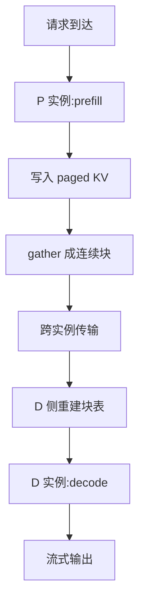

# PD 分离(Prefill / Decode 分离)

> 🔴 重点考点:本篇是当前复习重点,文末「面试考点串联」给出问法对照。

一句话:LLM 推理的两个阶段(读 prompt 的 prefill、吐 token 的 decode)**资源画像完全相反**——一个吃算力、一个吃带宽;把它们塞进同一批 GPU 会互相踩踏,于是干脆拆到两组实例上跑,中间只传一份 KV cache。这是当前大规模推理服务最主流的部署形态。

## 一、prefill 和 decode 到底在干什么

一次请求分成两段,分界线是「第一个输出 token」:

| | prefill(预填充) | decode(解码) |
|---|---|---|
| 干什么 | 一次性把**整段 prompt** 喂进去,算出所有 token 的 KV 并生成第 1 个输出 token | 每步只喂**上一步生成的 1 个 token**,产出下一个 |
| 执行次数 | 每请求 **1 次** | 每请求 **N 次**(N = 输出长度,常见几百到几千) |
| 矩阵形状 | $[S, d] \times [d, d']$,S 是 prompt 长度(2k、8k 很常见)→ **大矩阵乘** | $[B, d] \times [d, d']$,B 是并发请求数(几十到几百)→ **瘦长矩阵,接近 GEMV** |
| 瓶颈 | **计算受限**(compute-bound) | **访存受限**(memory-bound) |
| Tensor Core 利用率 | 高,能吃满 | 低,大部分时间在等数据 |
| 对应指标 | **TTFT**(首 token 延迟) | **TPOT**(每输出 token 时间) |

### 为什么一个 compute-bound、一个 memory-bound

关键看**算术强度**(每从显存搬 1 字节能干多少次浮点运算)。对权重矩阵而言:一次前向必须把整个权重读一遍,而这份权重被 batch 里的多少行复用,就是强度的量级。

- prefill:一个 2048 token 的 prompt 相当于 2048 行同时用这份权重 → 强度上百,远在 A100 FP16 的"脊点"(约 312 TFLOPS ÷ 2.0 TB/s ≈ **150 FLOP/byte**)之上 → 算力才是墙。
- decode:一步只有 B 行(B=32 就是 32)→ 强度只有几十,卡在脊点左侧 → 带宽是墙。

一个必须记住的下限:7B 模型 FP16 权重 14 GB,A100 显存带宽约 2.0 TB/s,**光是把权重读一遍就要 ≈ 7 ms**。这就是 decode 单步耗时的物理地板,和你 batch 多大几乎无关——所以 decode 阶段的优化几乎全在"少读字节"上(量化、GQA、KV 压缩)。

矩阵形状与 bound 的完整推导见 Prefill与Decode的矩阵形状 篇;指标定义见 推理服务指标 篇。

## 二、PD 混合 vs PD 分离:为什么非拆不可

「PD 混合」= 同一组 GPU 上,调度器把 prefill 请求和 decode 请求混在一个 batch 里跑(vLLM 早期默认形态,以及 chunked prefill 的做法)。

### 混合部署的三个病灶

**1. 长 prefill 阻塞 decode,TPOT 抖动。** GPU 上的 kernel 是串行推进的,一个 8k token 的 prefill 可能要几百毫秒。这期间同批的所有 decode 请求全部卡住——用户看到的现象是"字吐着吐着突然顿住一下"。这叫 **prefill-decode 干扰**,是 TPOT p99 崩掉的头号原因。chunked prefill(把长 prefill 切成小块夹进 decode 步里)能缓解,但代价是 prefill 被切碎后矩阵变小、算力利用率下降,TTFT 变长——它只是把矛盾摊平,没有消除。

**2. 最优配置互相打架。** 两个阶段想要的东西根本不是一回事:

| 维度 | prefill 想要 | decode 想要 |
|---|---|---|
| 并行方式 | TP 适中即可(算力已打满),更在意流水线不空 | **TP 开大**——把权重切开,每卡少读字节,直接降 TPOT |
| batch 策略 | 按 **token 总数**攒批(几千 token 就够打满算力),再大只会拉长 TTFT | 按**请求条数**攒批,越大摊薄权重读取越划算,上限由 KV 显存决定 |
| 显存分配 | 主要给激活,KV 只是产物 | 绝大部分给 **KV cache** |
| 硬件偏好 | 算力强的新卡(H100/H200) | 带宽大、显存大即可,**老卡也能干**,功耗更低 |

混跑意味着这两列必须取同一套参数——结果是两边都不最优。

**3. 无法独立扩缩容。** 真实流量里 prompt 长度和输出长度的比例天天在变:代码补全是长 prompt 短输出(prefill 重),聊天是短 prompt 长输出(decode 重)。混合部署下你只能整体加机器;分离之后,prefill 侧压力大就加 P 实例,decode 侧顶不住就加 D 实例,**配比可调**(常见 1p1d、2p1d、1p2d,按负载画像定)。

### 分离的代价

不是白拿的收益:**多了一次 KV cache 的跨实例传输**,以及一套额外的元数据协调(谁传给谁、块怎么对齐、失败怎么回滚)。所以第三节和第四节讲的传输,是 PD 分离能不能落地的胜负手。

## 三、分离之后,KV cache 经历了哪些操作

面试常问"PD 分离下涉及 KV cache 的操作/算子有哪些"。按时间顺序,一条请求的 KV 要过这七道:

| # | 阶段 | 具体做什么 | 算子/机制 |
|---|---|---|---|
| 1 | P 侧写入 | attention 算完当前层的 K/V 后,按 `slot_mapping` **散写**进分页显存的物理块 | cache 写入 kernel(把 [S, H, d] 打散成页) |
| 2 | P 侧导出 | 分页布局是打散的,直接发出去是几千次小块散拷,带宽吃不满 → 先在显存里 **gather 成连续 buffer** | 布局转换 kernel;PD 模式下 buffer 通常直接就是 RDMA 注册区 |
| 3 | 传输 | 连续 buffer → 对端 buffer,机内走 NVLink/P2P,跨机走 RDMA | 传输通道(NIXL/UCX 等) |
| 4 | D 侧接收 | 数据落进预先注册好的显存/内存区 | 单边 RDMA WRITE 或 READ |
| 5 | D 侧建表 | **向本地 block manager 申请物理块 → scatter 回分页布局 → 重建 block table** | 关键:P 和 D 的物理块号是两套独立空间,**映射表必须重建**,不能照搬 |
| 6 | D 侧读取 | 每个 decode step 按 block table 把散落的块 gather 起来算 attention,并 append 当前 token 的新 KV | paged attention kernel |
| 7 | 释放 | P 侧确认传完才能释放块;D 侧请求结束后归还 | 引用计数 / 块回收 |

> 第 5 步是最容易答漏的。**块表重建**的必要性在于:分页显存里"逻辑块 i"到"物理块号"的映射是每个实例私有的,P 侧的第 3 个物理块在 D 侧可能是第 917 个。所以传的是**数据 + 逻辑顺序**,不是指针。分页机制本身见 PagedAttention 篇。

## 四、KV 传输怎么做才快

### 先看要传多少

$$
\text{KV 字节数} = 2 \times L \times H_{kv} \times d_h \times S \times \text{bytes}
$$

2 是 K 和 V 两份,$L$ 层数,$H_{kv}$ 是 KV 头数(GQA 下远小于 Q 头数),$d_h$ 头维度,$S$ 序列长度。代入 Llama-3-8B(L=32,$H_{kv}$=8,$d_h$=128,FP16):每 token 每层 $2\times8\times128\times2$ = 4 KiB,乘 32 层 = **每 token 128 KiB**。一个 8k 的 prompt 就是 **1 GiB**。

### 走什么硬件

| 通道 | 单向带宽量级 | 传 1 GiB 约需 | 用在哪 |
|---|---|---|---|
| **NVLink / NVSwitch** | 300–450 GB/s | **2–4 ms** | 机内 GPU 之间,最快 |
| **RDMA / InfiniBand 400G** | ~50 GB/s | ~21 ms | 跨机主力 |
| InfiniBand 200G | ~25 GB/s | ~43 ms | 跨机 |
| PCIe Gen4 x16 | ~21 GB/s 有效 | ~50 ms | 退化路径,尽量避开 |
| 以太网 TCP | 更低且抖动大 | — | 一般不用于数据面 |

结论很直接:**P 和 D 尽量放在同一机内或同一 NVLink 域**;必须跨机就上 RDMA,靠**单边 RDMA**(WRITE/READ 不打扰对端 CPU)+ **内存预注册**(pin 住并注册给网卡,避免每次传输重新建映射)把延迟压下去。裸 TCP 走内核协议栈、要多次拷贝,数据面基本不用。

### 怎么异步:逐层流水是核心答案

朴素做法是"prefill 全部算完 → 一次性传全部 KV",串行相加:$T_{\text{prefill}} + T_{\text{传输}}$,那 21 ms 的传输就赤裸裸暴露在 TTFT 里。

真实系统的做法是**逐层流水(layer-wise pipelining)**:transformer 的第 $i$ 层算完,它那一层的 KV 就已经定稿了、不会再变,可以**立刻开始传**,同时 GPU 接着算第 $i+1$ 层。传输被藏进后续层的计算里:

$$
T_{\text{prefill}+\text{传输}} \approx T_{\text{prefill}} + \frac{T_{\text{传输}}}{L} \quad (\text{每层传输时间} \le \text{每层计算时间时})
$$

这个式子的意思是:只有**最后一层**的传输还露在外面无处可藏,暴露成本从"整份 KV"降到"1/L 份 KV"。L=32 时,21 ms 的暴露量降到 0.7 ms 左右——这就是为什么 PD 分离的传输开销在实践中可以做到近乎不可见。

四个配套要点:

1. **独立 CUDA stream**:传输发在拷贝流上,计算发在主流上,靠 event 做依赖同步,不占用计算流的时间片。DMA 引擎和 SM 是两套硬件,本来就能并行(见 CUDA流与异步执行 篇)。
2. **非阻塞提交 + 轮询完成**:提交传输请求后立刻返回,后台查状态,不做同步等待。
3. **分层/分块粒度**:粒度太细(每层再切小块)会让传输描述符和握手开销占比上升,太粗又藏不住;实践中按层或按若干层一组是常见折中。
4. **接收侧要提前备好落地**:D 侧的注册 buffer 和物理块必须在数据到达前就分配好,否则 P 传不出去、块被占住,反过来把 P 拖慢。

具体工程实现(生成器流水、NIXL 两阶段握手、gather kernel)见开源解读的 LMCache 篇。

## 五、KV cache 一定是 P → D 单向流动吗

**常规链路是单向的**:P 算完传给 D,P 侧随即释放。但把视角从"一条请求"放大到"集群里的 KV 是一种资源",回流场景是真实存在的:

| 场景 | 流向 | 说明 |
|---|---|---|
| 常规请求 | P → D | 默认路径,一次性交接 |
| **多轮对话 / 前缀缓存** | D → 缓存池 → P | 本轮生成结束后,把 (prompt + 输出) 的 KV **卸载**到 CPU 内存/SSD/远端池;下一轮用户接着聊,P 侧先按 token 哈希 lookup,命中就直接搬回来,**跳过重复 prefill**,TTFT 大幅下降 |
| **请求被抢占** | D → 重新排队 | decode 时 KV 显存不够,调度器抢占低优先级请求。若采取 recompute 策略,该请求的 KV 被丢弃、**退回 prefill 重算**;若采取 swap 策略,KV 换出到 CPU 再换回 |
| **分离式缓存池** | 任意方向 | 把 KV 当集群级共享存储:任何 P 实例可读、任何 D 实例可写,不再是点对点。Mooncake 把 GPU 集群闲置的 CPU 内存与 SSD 组成 KVCache 池并配全局调度器;LMCache 做分层存储与跨实例共享 |

所以标准答案是:**"默认单向,但存在三类回流:缓存复用、抢占重算、集群级 KV 池。"** 只答"单向"会被追问到底。开源实现的细节见开源解读的 LMCache 篇。

## 六、系统分析题:2p2d 下 decode 变快,TTFT 会怎么变

> **题面**:2p2d 部署,高并发场景,TTFT 与 TPOT 都刚好满足 SLO,P 和 D 都满负载。此时在 D 阶段用 KV cache 量化优化,大幅降低了 TPOT。TTFT 会怎么变?为什么?

**结论:TTFT 会变差(而不是不变、更不是变好)。** 这是一道典型的**瓶颈转移**题。推导分五步:

**第 1 步:为什么 KV 量化能降 TPOT。** decode 是访存受限的,每一步都要把整个 KV cache 读一遍。FP16 → INT8/FP8 把 KV 字节数砍半,这部分访存时间直接减半;同时 KV 占用变小,同样显存能塞下更大的 decode batch,权重读取被摊薄得更狠。两个效应叠加,TPOT 明显下降。(KV 量化的精度与实现细节见 KVCache量化 篇。)

**第 2 步:D 侧产能上升,P 侧产能不变。** 单个 D 实例每秒能消化的请求数上去了。而 prefill 是计算受限的,它的耗时由 prompt 长度和算力决定,**和 KV 存成什么精度基本无关**——P 侧产能一点没变。

**第 3 步:反压解除,系统被迫吞更多。** 原来 D 满负载时会形成**反压**:D 没有空闲块接收,P 算完的 KV 传不出去、只能占着 P 侧显存,P 就开不了新请求。也就是说,原来的"P 满负载"里有一部分是**被 D 卡住的假满**。现在 D 变快、反压解除,P 得以全速推进,系统整体吞吐上升。闭环压测(固定并发数)下更直接:请求返回得快了,客户端立刻补新请求,到达率自然上升。

**第 4 步:瓶颈从 D 移到 P,而 P 在满负载区。** 两级串联系统的吞吐 = min(P 产能, D 产能)。现在 D 产能 > P 产能,**瓶颈转到 P**。排队论给出关键放大关系:

$$
W_q \propto \frac{\rho}{1-\rho}, \qquad \rho = \frac{\lambda}{\mu_P}
$$

$\rho$ 是 P 侧利用率,$\lambda$ 是到达率,$\mu_P$ 是 P 的服务率。这个式子的意思是:**利用率越接近 1,排队等待时间越是爆炸式增长**——$\rho$ 从 0.90 涨到 0.95,等待时间从 9 个单位涨到 19 个,直接翻倍。而 TTFT = 排队等待 + prefill 计算 + KV 传输 + D 侧首步,**排队项此时占了大头**。

**第 5 步:核对二阶效应,确认不足以翻盘。**

| 效应 | 对 TTFT 的方向 | 量级 |
|---|---|---|
| P 侧排队变长(瓶颈转移) | ⬆️ **显著变差** | 几十到几百 ms,随 $\rho$ 发散 |
| 若量化后的 KV 直接用于传输,payload 减半 | ⬇️ 略微改善 | 逐层流水下本来就只暴露 ~1 ms,减半只省零点几 ms |
| D 侧空闲块变多,接收更及时 | ⬇️ 略微改善 | 小,且已被第 3 步的吞吐上升吃掉 |
| P 侧 prefill 计算时间 | 不变 | — |

改善项加起来是毫秒级,恶化项是排队发散级——**净效果是 TTFT 变差**。

**边界条件(答完主结论要补,否则显得不严谨)**:如果到达率是外部严格恒定的开环负载,且原本 P 就没有被 D 反压过,那 P 侧的输入分布没变,TTFT 会大致不变(甚至因传输变小略好)。题面说的是"高并发 + 两边都满负载",这正是反压存在的典型状态,所以主答案取"变差"。

**怎么修**:把配比从 2p2d 调成 **3p1d** 之类(D 现在更能打,可以少给一个实例,把机器还给 P);或者给 P 侧上 chunked prefill / 更激进的前缀缓存命中(让重复前缀根本不用算)、加大 P 的 TP 度。核心是**把资源投到新瓶颈上**,而不是继续优化已经不是瓶颈的 D。

> 这道题的通用套路:**任何"优化了某一级"的问题,先问这一级是不是瓶颈,再问优化后瓶颈跑到哪去了,最后看新瓶颈的利用率离 1 有多近**。

## 七、decode 阶段什么时候会 OOM

decode 的显存占用是**单调上升**的——每一步都在给每条序列 append KV。这意味着**准入时不 OOM,不代表 500 步后不 OOM**。典型场景:

| 场景 | 机理 | 典型触发 |
|---|---|---|
| **长上下文 × 大 batch** | KV 随 (batch × 序列长度) **线性增长**。Llama-3-8B 每 token 128 KiB → batch 64 × 8k token = **64 GiB**,单张 80G 卡直接爆 | 长文档问答、长历史多轮 |
| **输出长度不可预测** | 调度器按"当前长度"准入,但一个 `max_tokens=8192` 的请求会一直长下去,慢慢把显存吃满 | 突发长生成请求 |
| **抢占策略不当** | 水位线设太高、抢占太晚就 OOM;抢占太狠又反复重算(thrash),吞吐塌方 | 高并发下水位配置错 |
| **CUDA Graph 显存池叠加** | graph capture 用的是独立显存池,和常规 allocator 池**不共用**,这块预留会挤占 KV 可用块——开了 CUDA Graph 更容易 OOM | 开启 graph 且 KV 池按满显存估算 |
| **PD 分离特有:接收侧预留** | D 侧必须常驻一块 RDMA 注册 buffer(pin 住不可换出),再加上"为在途 KV 预留的物理块";P 传得太猛而 D 没及时腾块,接收侧就撑爆 | 配比失衡、突发长 prompt |
| **碎片与杂项** | 分页机制消灭了 KV 的碎片,但激活峰值、量化 scale、投机解码的 draft 模型都在抢同一块显存 | 组合开了多个特性 |

排查顺序与显存占用构成(权重 / 激活 / KV / 碎片)见 显存管理与OOM 篇;调度器怎么准入与抢占见 连续批处理 篇。

## 八、面试考点串联

| 高频问法 | 本文哪一节 |
| --- | --- |
| 什么是 prefill 和 decode 阶段?有啥差异? | 一(表格 + 算术强度解释) |
| 为什么 prefill 是 compute-bound、decode 是 memory-bound? | 一(脊点 150 FLOP/byte;详见 Prefill与Decode的矩阵形状 篇) |
| PD 混合和 PD 分离的差异?为什么要做 PD 分离? | 二(三个病灶 + 代价) |
| PD 分离下涉及 KV cache 的操作/算子有哪些? | 三(七步表;别漏第 5 步块表重建) |
| KV cache 传输怎么做才快?用什么硬件? | 四(NVLink / RDMA 带宽表 + 单边 RDMA + 预注册) |
| 传输怎么异步?怎么和计算重叠? | 四(**逐层流水**是核心;独立 CUDA stream + 非阻塞提交) |
| KV cache 一定是 P → D 吗?D 会回到 P 吗? | 五(三类回流:缓存复用 / 抢占重算 / 集群 KV 池) |
| 2p2d 满负载下 D 变快,TTFT 怎么变? | 六(瓶颈转移 → **变差**;五步推导 + 边界条件 + 修法) |
| **PD 分离特有**的 decode OOM 有哪些?(通用的显存账与 OOM 分类见 显存管理与OOM 篇) | 七(六类场景表) |
| PD 分离的收益边界在哪?什么时候不该拆? | 二(小集群、短 prompt 为主、跨机只有 PCIe/以太网时,传输开销吃掉收益) |

延伸阅读顺序:推理服务指标(先把 TTFT/TPOT 定义钉死)→ Prefill与Decode的矩阵形状(bound 的定量推导)→ 本篇 → 连续批处理 + PagedAttention(调度与显存的配套机制)。

## 相关文献

- DistServe: Disaggregating Prefill and Decoding for Goodput-optimized Large Language Model Serving — [arXiv:2401.09670](https://arxiv.org/abs/2401.09670)
- Splitwise: Efficient generative LLM inference using phase splitting — [arXiv:2311.18677](https://arxiv.org/abs/2311.18677)
- Mooncake: A KVCache-centric Disaggregated Architecture for LLM Serving — [arXiv:2407.00079](https://arxiv.org/abs/2407.00079)
- NIXL(NVIDIA Inference Xfer Library),PD 分离常用的传输层 — https://github.com/ai-dynamo/nixl
