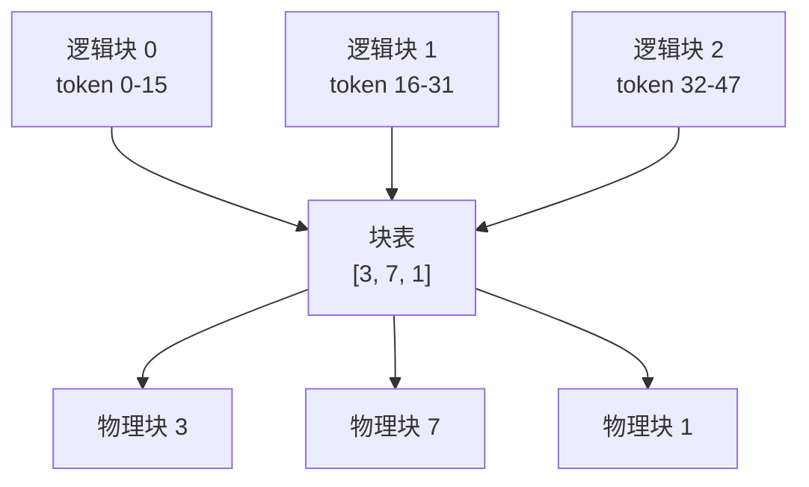

# PagedAttention

> 🔴 重点考点:本篇是当前复习重点,文末「面试考点串联」给出问法对照。

一句话:PagedAttention 把**操作系统的虚拟内存分页**原样搬到 KV cache 上——KV 不再要求一整段连续显存,而是切成固定大小的小块散着放,再用一张**块表**告诉 kernel"第 i 段 token 的 KV 在哪个物理块"。它换来的不是算得更快,而是**显存不再被白白晾着**,从而能塞下更大的 batch。

## 一、要解决的问题:显存利用率只有两三成

### 传统做法为什么必然浪费

decode 是自回归的,一个请求的 KV cache **一个 token 一个 token 地长**,而且会长到哪一步(什么时候吐 EOS)事先根本不知道。早期引擎(FasterTransformer、Orca)的做法是:请求进来时,按它**可能的最大长度**一次性划出一整段**连续**显存。

> **类比**:餐厅给每桌都按"最多可能来 20 人"摆好 20 副碗筷,实际来了 4 个人——剩下 16 副占着桌子,别人还坐不进来。

这一刀切下去,浪费分三种,面试要能当场分清:

| 浪费类型 | 怎么产生的 | 什么时候能回收 |
|---|---|---|
| **预留浪费(reserved)** | 后面确实还要用,但**此刻**空着 | 请求结束才释放 |
| **内部碎片** | 实际长度远小于 max_len,多划的那一大截**永远用不上** | 请求结束才释放 |
| **外部碎片** | 各请求要的连续段长短不一,释放后留下一堆装不下新请求的空洞 | 需要整理/搬移才能利用 |

内部碎片是大头。设预留长度 $L_{\max}$、实际用到 $L$:

$$
\text{有效利用率} = \frac{L}{L_{\max}}
$$

人话:按最长情况预分配,实际只写到 $L$,剩下的全在干晾着。$L_{\max}=2048$ 而实际只生成到 512,利用率就是 25%——这不是拍脑袋估的,vLLM 论文实测 Orca 只有 **20.4%–38.2%** 的 KV cache 显存真正装着 token,**六到八成的显存在空转**。

### 还有第四宗罪:共享不了

同一个 prompt 采 4 个样本、或者 beam search 开 4 条 beam,它们的**前缀 KV 是逐 bit 相同的**。但既然每条序列都被塞进各自的一段连续显存,这份相同的前缀就只能**复制 4 份**。解码算法越复杂,浪费越离谱。

显存不够 → batch 开不大 → decode 每步搬的那份权重摊不薄 → 吞吐上不去。所以这是个**显存问题,但结算在吞吐上**。

## 二、核心机制:把 OS 的分页原样搬过来

### 分页当年解决的是同一个问题

操作系统几十年前就遇到过一模一样的困境:进程要一大段连续内存,但物理内存被切得七零八落。解法是**分页**——把物理内存切成固定大小的页帧(如 4 KB),进程看到的仍是**连续的虚拟地址**,MMU 通过**页表**把虚拟页号翻译成物理页帧号。物理上可以散得到处都是,进程完全无感。

PagedAttention 是这套机制的逐项对应,**这张表是本篇最该背下来的**:

| 操作系统 | PagedAttention | 说明 |
|---|---|---|
| 进程 | 一条序列(一个请求) | 各自有独立的"地址空间" |
| 页(4 KB) | **块(block,固定 $B$ 个 token 的 KV)** | 固定大小是关键 |
| 虚拟页号 | **逻辑块号** $=\lfloor \text{token 位置} / B \rfloor$ | 序列眼里 KV 依然连续 |
| 物理页帧 | **物理块**(显存池里的一格) | 可以散着放 |
| 页表 | **块表(block table)** | 逻辑块号 → 物理块号 |
| MMU 硬件翻译 | **attention kernel 查表** | 差别:软件查,不是硬件自动查 |
| 缺页时才分配 | 写满当前块才申请下一块 | 按需分配,不预留 |
| 共享页 + 引用计数 | 前缀块共享 + 引用计数 | 见第四节 |

**一句话答面试**:PagedAttention = KV cache 版的虚拟内存分页,块表就是页表。唯一的实质差别是——**OS 的地址翻译由 MMU 硬件顺手做掉,attention 的翻译得由 kernel 自己在软件里查**。

序列眼里 token 是 0→47 连着排的;物理上这三块可能分别落在显存池的第 3、7、1 格,中间夹着别的请求的块。

### 物理上到底是什么形状

启动时一次性把可用显存全吃下来做成一个**大块池**:每层一个形如 `[2, 块数, B, KV 头数, head_dim]` 的张量(2 = K 和 V),此后**再也不做 malloc/free**,只做"从空闲链表取一格 / 还一格"。

运行时需要两张辅助表:

- **块表**:形如 `[请求数, 每请求最大块数]` 的整型张量,存物理块号——喂给 attention kernel 读 KV;
- **slot mapping**:这一步新算出的每个 token 的 KV 该写进池子的哪个槽位——喂给写 KV 的 kernel。

因此 KV cache allocator 的核心不是普通的 `malloc/free`,而是维护**物理块池、每请求块表、空闲块、引用计数和生命周期状态**。分配必须原子地取得足够块并更新映射,追加 token 只扩当前请求,完成/取消/抢占要准确归还引用；前缀共享时只有引用计数归零才能回收,写共享块前要 copy-on-write。设计手撕题应先说状态与不变量,再讨论并发、OOM、回收和指标,不能凭空假设某个开源项目的函数签名。

### 分页之后还剩多少浪费

只剩**最后一块没填满的那点**:

$$
\text{块数} = \left\lceil \frac{L}{B} \right\rceil, \qquad \text{浪费} \le B - 1 \text{ 个 token 槽}
$$

人话:长为 $L$ 的序列占 $\lceil L/B \rceil$ 块,只有最后一块可能没写满,所以**不管序列多长,浪费封顶在"不到一个块"**,而且和 $L_{\max}$ 彻底脱钩。代进利用率就是:

$$
\text{利用率} \ge \frac{L}{L + B - 1}
$$

人话:分母是"最坏情况下真正占掉的槽位数"。$L=512$、$B=16$ 时利用率 $\ge 512/527 \approx 97.2\%$,序列越长这点尾巴越可忽略。**外部碎片则被"固定块大小"直接消灭**——所有块一样大,任何空闲格都能装任何请求,不存在"洞太小塞不进去"。

## 三、收益与代价

| | 分页前 | 分页后 |
|---|---|---|
| KV 显存利用率 | 20%–40% | 接近满(尾块 $< B$ 个槽) |
| 能同时跑的请求数 | 被预留量卡死 | 由**真实已生成长度**决定,量级上多 2–4 倍 |
| 请求进出 | 要找连续空段 | 取/还一格,$O(1)$ |
| kernel | 一个基址 + stride 顺着读 | **多吃一张块表,按块 gather** |

收益的传导链要说清楚:**利用率上去 → 同样显存装下更多序列 → batch 变大 → decode 每步搬的那份权重被更多请求摊薄 → 吞吐涨**。vLLM 论文在同等延迟下相对 FasterTransformer 和 Orca 报告 **2–4× 吞吐提升**,序列越长、模型越大、解码算法越复杂,增益越大。

代价老实说有两条:

1. **多一层间址**:每次读 KV 都要先查块表拿物理块号再算地址。查表本身很便宜(块表常驻显存、访问高度规整),但它让 kernel 的编写复杂了一个量级;
2. **KV 在虚拟地址上不再连续**:kernel 不能再假设"一条序列的 KV 是一段",依赖连续性的优化(整段预取、直接套用现成的连续版 kernel)要重写。后来有工作(vAttention)主张换条路——用 CUDA 的虚拟内存 API 让**虚拟地址保持连续、只让物理页离散**,从而不必改 kernel。这说明"消除碎片"和"改 kernel"其实是可以解耦的两件事。

## 四、前缀共享与 copy-on-write

一旦 KV 按块存,共享就几乎免费:**让两条序列的块表指向同一个物理块号**即可,一个字节都不用拷。

典型场景三类:

- **同 prompt 多采样**:$n$ 个样本共享全部 prompt 块,从第一个生成的 token 才分叉;
- **beam search**:beam 之间不仅共享 prompt,还共享**已生成的公共前缀**,而且每步扩展/剪枝都在重新组合共享关系;
- **公共 system prompt / few-shot 模板**:跨请求共享。

### 引用计数与写时复制

每个物理块带一个**引用计数**,记录有几条序列的块表指向它:

- **读**:随便读,共享块只存一份;
- **写**:要往一个引用计数 > 1 的块里追加新 token 时,**不能直接写**(会污染其他共享者)。于是先把这一块**复制**成私有副本、把自己的块表改指向副本、原块引用计数减一,再往副本里写——这就是 **copy-on-write**;
- **释放**:引用计数减到 0 才真正回收进空闲链表。

> **类比**:两个人共用一份打印好的讲义,谁都不用重印;直到其中一个要在页边写批注,才单独复印**那一页**。关键在于**复制粒度是"一块"而不是"整条序列"**——省的就是这个。

论文在 OPT-13B / Alpaca 负载上实测:并行采样省 **6.1%–9.8%** 显存,beam search 省 **37.6%–55.2%**。差距来源很直白:并行采样只能共享 prompt,分叉之后各走各的;beam search 连生成出来的公共前缀也一起共享。

### 现代实现的演进(容易被追问)

要注意:**COW 是原始论文的机制,今天 vLLM 主线已经不走这条路了**。新版把共享收紧成"**只共享写满的整块**"——块一写满就算个哈希丢进前缀缓存表,别人命中即可直接引用;没写满的块永远私有。既然被共享的都是不会再被写入的满块,**写时复制这件事就由构造消失了**,只保留引用计数。代价是块尾那点不共享,收益是逻辑简单得多、还顺手支持跨请求前缀缓存。基于前缀树自动发现可复用前缀的做法见 RadixAttention 篇,具体工程实现见开源解读模块。

## 五、block size 怎么选

$B$ 是这套机制唯一的核心旋钮,**往两边拧各有各的痛**:

| $B$ 偏小(如 1–8) | $B$ 偏大(如 64–128) |
|---|---|
| 尾块浪费小($\le B-1$),显存最省 | 尾块浪费变大,内部碎片"回来一点" |
| **块表变长**:长为 $L$ 的序列要 $\lceil L/B \rceil$ 个表项,块表张量按最长请求开,又长又占地 | 块表短,元数据开销小 |
| **kernel 每次 gather 的连续段短**:极端情况一次只取一个 token 的 KV,访存退化成散点,合并访存吃不满一次事务的宽度 | 块内连续,一次能拉一长条,访存效率高 |
| 共享/前缀命中粒度细,命中率高 | 粒度粗,前缀不足一整块就白白错过 |
| 分配与回收的表更新更频繁 | 更新少 |

关键在于理解**块内是连续的**:块是最小的**分配**单位,但块内 $B$ 个 token 的 KV 在显存里紧挨着。所以 $B$ 实际上决定了 kernel"一次能顺着读多长",这正是它不能太小的原因——GPU 的访存事务有最小宽度(合并访存见 GPU架构与执行模型 篇),一次只拉几十字节就是在浪费带宽。

工程上的落点是 **16**(vLLM 的默认值),常见可选 16/32/64;FlashAttention 系的 kernel 通常要求 $B$ 是 16 的倍数。更现代的做法是**把两个块大小解耦**:显存管理器按较大的块(如 32)分配以缩短块表,喂给 kernel 前再切成 kernel 要求的小块(如 16),两头诉求各自满足。

与 KVCache 篇的分工:那边算的是"KV 总量怎么估、怎么压";这里只关心同一份 KV **切多细** 对块表长度与 kernel 访存连续性的影响。

## 六、kernel 视角:和 FlashAttention 什么关系

朴素 attention kernel 的假设是"一条序列的 K/V 是一段连续内存,给个基址加 stride 就能顺着读"。分页把这个假设打破了,于是 paged 版 kernel 必须多做三件事:

1. **多吃一个入参**:块表(以及每条序列的真实长度);
2. **按块 gather**:把遍历 K/V 的循环改成"外层遍历这条序列的逻辑块 → 查表拿物理块号 → 读这一块的 K/V",每块内部依然是连续顺序读;
3. **写侧配合**:新算出的 K/V 按 slot mapping 散写回池子。

**和 FlashAttention 的关系:两者正交,现代引擎是叠在一起用的。**

| | FlashAttention | PagedAttention |
|---|---|---|
| 解决什么 | $N\times N$ 分数矩阵不该落 HBM(**算**的过程) | KV **存在哪**、怎么分配(**存**的形式) |
| 手段 | tiling + online softmax,片上算完就丢 | 固定块 + 块表间址 |
| 省的是 | HBM 读写量 | 显存容量 |

它们不冲突的根本原因是:**FA 本来就是分块处理 K/V 的**,只要把"取下一块 K/V"从"基址 + 偏移"换成"查块表拿物理块号",tiling 与 online softmax 的逻辑一个字都不用改。今天 vLLM 的 FlashAttention 后端正是把块表直接传进 FA 的变长接口,由 FA kernel 内部按 paged 布局取 KV。tiling 与 online softmax 的推导见 FlashAttention 篇。

代价是 kernel 的排列组合爆炸(块大小 × KV 布局 × mask 类型 × 精度),这也是 FlashInfer 这类"可定制 attention 引擎"出现的背景:把分页 KV 统一抽象成**块稀疏**格式,再按需 JIT 生成对应 kernel。

## 七、和连续批处理的配合:一对孪生兄弟

连续批处理要求调度器**每个 decode step 都能加入新请求、移出已完成请求**。这件事在旧的连续分配下几乎做不到:新请求要一整段连续显存,而显存已经被外部碎片切碎,放不下就只能排队。

分页把"加入/移出"变成显存层面的 $O(1)$ 操作:

- **加入**:从空闲链表取几格、填块表——不需要连续空间,不需要整理;
- **移出**:引用计数减一,块回到空闲链表,立刻能被别人用;
- **抢占**:显存告急时可以把某个请求的块**换出到 CPU 内存**、或干脆丢掉后面重算,让位给别人;恢复时再取新块填回块表,**序列的逻辑视图完全不变**。

分页让请求动态进出时更容易分配、回收和共享 KV,因此很适合连续批处理;但连续批处理本身不以 PagedAttention 为必要条件。调度策略、chunked prefill、公平性与长尾处理见 连续批处理 篇。

本篇的块管理概念与本地约 2026-04 的 vLLM 源码快照核对;具体缓存布局和调度配置会随版本变化。分页主要提高显存使用效率,是否更快仍需结合真实负载测量。

## 八、面试考点串联

| 高频问法 | 本文哪一节 |
| --- | --- |
| PagedAttention 怎么通过分页和块表管理 KV,解决什么问题? | 一、要解决的问题:显存利用率只有两三成;二、核心机制:把 OS 的分页原样搬过来 |
| 传统 KV cache 分配为什么浪费?利用率大概多少? | 一(预留/内部/外部;20.4%–38.2%) |
| 和操作系统虚拟内存的类比讲一下 | 二(逐项对照表) |
| 块表是什么?里面存了什么? | 二(逻辑块号 → 物理块号) |
| KV cache allocator 要维护哪些状态和不变量,怎样处理并发回收与 OOM? | 二(块池、块表、空闲块、引用计数与生命周期) |
| 为什么能提升吞吐?提升多少? | 三(利用率 → batch → 摊薄权重访存;2–4×) |
| 分页的代价是什么? | 三(多一层间址 + 虚拟地址不再连续) |
| copy-on-write 是怎么回事?什么时候触发? | 四(引用计数 > 1 且要写入时) |
| 并行采样 / beam search 怎么省显存?省多少? | 四(共享前缀块;6.1%–9.8% / 37.6%–55.2%) |
| block size 怎么选?开大开小各有什么影响? | 五(块表长度 ↔ 访存连续性 ↔ 共享粒度) |
| 分页之后 attention kernel 要改什么? | 六(多吃块表、按块 gather、slot mapping 写回) |
| 和 FlashAttention 冲突吗? | 六(正交,现代是叠加使用) |
| 和 continuous batching 是什么关系? | 七(分页方便动态分配,不是必要条件) |

## 相关文献

- Efficient Memory Management for Large Language Model Serving with PagedAttention(vLLM,SOSP'23)— [arXiv:2309.06180](https://arxiv.org/abs/2309.06180)
- Orca: A Distributed Serving System for Transformer-Based Generative Models(迭代级调度,OSDI'22)— https://www.usenix.org/conference/osdi22/presentation/yu
- vAttention: Dynamic Memory Management for Serving LLMs without PagedAttention — [arXiv:2405.04437](https://arxiv.org/abs/2405.04437)
- SGLang / RadixAttention(前缀树式 KV 复用)— [arXiv:2312.07104](https://arxiv.org/abs/2312.07104)
- FlashInfer: Efficient and Customizable Attention Engine for LLM Inference Serving — [arXiv:2501.01005](https://arxiv.org/abs/2501.01005)
- FlashAttention(IO-aware 精确注意力)— [arXiv:2205.14135](https://arxiv.org/abs/2205.14135)
