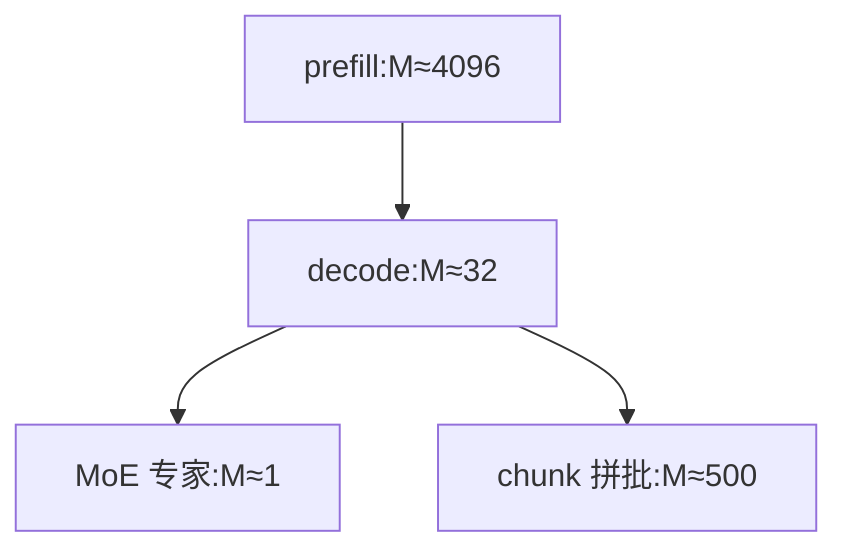

# Prefill 与 Decode 的矩阵形状

一句话:同一份权重、同一段代码,prefill 和 decode 喂进去的激活**行数差两到三个数量级**——于是同一个算子在两个阶段是性质完全不同的两种东西。本篇只干一件事:把「prefill 计算受限、decode 访存受限」这个人人会背的结论,落到每个算子的具体形状上。

## 一、先把记号立好:唯一在变的是 M 维

一次前向里,所有线性层看到的都是一个二维激活矩阵——**batch 和序列两个维度被拉平成一维**,记它的长度为 $T$(批内参与计算的 token 总数)。这就是矩阵乘里的 $M$ 维。

| 符号 | 含义 | 典型值(Llama-3-8B 量级,fp16 下 $b = 2$ 字节) |
|---|---|---|
| $T = M$ | 批内 token 总数;$B$ 是并发请求数 | prefill:$B \cdot S$;decode:$B$,几十到一两百 |
| $S$ / $S_{kv}$ | prompt 长度 / 已缓存的 KV 长度 | 2k–32k |
| $d$ / $d_{ff}$ | 隐藏维 / FFN 中间维 | 4096 / 14336 |
| $H_q$ / $H_{kv}$ / $d_h$ | Q 头数 / KV 头数 / 头维度 | 32 / 8 / 128 |

**两个阶段的分水岭就一句话**:prefill 一次把整段 prompt 拍进去,$T = B \cdot S$,引擎按 token 预算攒批,一批常是 4096–8192;decode 一步每条请求只产 1 个 token,$T = B$,就是并发数本身,几十。同一个 $[d, d_{ff}]$ 的权重,一边配 4096 行输入,一边配 32 行输入。下面这张图是全篇的骨架——**M 维一路塌缩,塌到哪一档就决定了算子的性质**,后面各节分别讲这四个位置。

## 二、逐算子形状对照(主表)

一层 transformer 的六个矩阵乘,两个阶段各是什么形状:

| 算子 | 权重形状 | prefill 输入 → 输出 | decode 输入 → 输出 | 一次前向 FLOPs |
|---|---|---|---|---|
| QKV 投影 | $[d,\ (H_q{+}2H_{kv})d_h]$ | $[T, d] \to [T, (H_q{+}2H_{kv})d_h]$ | $[B, d] \to [B, (H_q{+}2H_{kv})d_h]$ | $2\,T\,d\,(H_q{+}2H_{kv})d_h$ |
| $QK^\top$(每头) | 无 | $[S, d_h] \times [d_h, S] \to [S, S]$ | $[1, d_h] \times [d_h, S_{kv}] \to [1, S_{kv}]$ | prefill $2BH_qS^2d_h$;decode $2BH_qS_{kv}d_h$ |
| $PV$(每头) | 无 | $[S, S] \times [S, d_h] \to [S, d_h]$ | $[1, S_{kv}] \times [S_{kv}, d_h] \to [1, d_h]$ | 同上 |
| 输出投影 | $[H_qd_h,\ d]$ | $[T, H_qd_h] \to [T, d]$ | $[B, H_qd_h] \to [B, d]$ | $2\,T\,d^2$ |
| FFN 上投影 | $[d,\ 2d_{ff}]$(含 gate) | $[T, d] \to [T, 2d_{ff}]$ | $[B, d] \to [B, 2d_{ff}]$ | $4\,T\,d\,d_{ff}$ |
| FFN 下投影 | $[d_{ff},\ d]$ | $[T, d_{ff}] \to [T, d]$ | $[B, d_{ff}] \to [B, d]$ | $2\,T\,d\,d_{ff}$ |

把这张表看两遍,会看出**六个算子其实分成截然不同的两类**:

- **四个线性层**:权重形状一个字都没变,变的只有激活的行数 $M$。$N$、$K$ 两维恒等于模型维度(几千到一万几),永远很大
- **两个 attention 算子**:压根没有权重,形状完全由序列长度决定。prefill 里 $QK^\top$ 是个 $[S,S]$ 的**方阵**、随 $S$ 平方增长;decode 里退化成 $[1, S_{kv}]$ 的**一行**、随 $S_{kv}$ 线性增长

> 🖼️ 占位:同一个 $[d, d_{ff}]$ 权重矩阵旁并排画两个激活块,一个是 4096 行的胖块、一个是 32 行的薄条,按同一比例尺画出高度差,并在薄条旁标出 Tensor Core 的 16 行 MMA 最小粒度

### 访存量分开写

两类的退化方式不同,访存的构成也不同。线性层拆成两项,这是后面所有结论的来源:

$$
\text{Bytes} = \underbrace{K N b}_{\text{权重,与 } M \text{ 无关}} \;+\; \underbrace{(MK + MN)\,b}_{\text{激活,正比于 } M}
$$

意思是:权重那一项是**一次前向读一遍的固定成本**,跟这一批有多少 token 毫无关系;激活那一项才随 $M$ 走。$M$ 小的时候,分母几乎全被权重项占满——这一条独自解释了 decode 的一切。

attention 侧则相反,它没有权重项,访存全是 K/V:decode 每步要把 $2 B S_{kv} H_{kv} d_h b$ 字节的 KV cache 读一遍,**这一项随 $B$ 线性长**,摊不薄(KV 的显存账与它在带宽里的占比见 KVCache 篇)。

## 三、线性层:算术强度约等于 M

对 $[M, K] \times [K, N]$ 的矩阵乘,算术强度(每搬 1 字节能干几次浮点运算,定义见 Roofline与Bound分析 篇):

$$
I \;=\; \frac{2MNK}{(MK + KN + MN)\,b}
$$

分子是乘加次数,分母是三个矩阵的字节数。现在代入推理的真实数量级:$M$ 是几十到几千,而 $K, N$ 是 4096、14336。当 $M \ll K, N$ 时分母被 $KN$ 这一项吃掉,整个式子塌成:

$$
I \;\xrightarrow{\ M \ll K,N\ }\; \frac{2M}{b} \;\xrightarrow{\ \text{fp16}\ }\; M
$$

意思是:**decode 线性层的算术强度约等于 batch 大小,和矩阵多大、模型多大完全无关**。因为搬上来的那份权重,只被 $M$ 行输入各用了一次——用几次,强度就是几。

对照 A100 80GB 的拐点 153 FLOP/Byte:$B = 32$ 的 decode 强度是 32,深在斜线段;prefill 一批 4096 token 强度就是 4096,远在水平段。同一个算子,**两个阶段落在屋顶线的两端**(判据与拐点见 Roofline与Bound分析 篇)。

### 瘦长矩阵有两道独立的坎

「decode 用不满算力」其实是两件事叠在一起,面试里分不开讲就答不透:

| 坎 | 卡在哪 | 什么时候解除 |
|---|---|---|
| **MMA 行粒度** | Tensor Core 的矩阵乘指令 $M$ 维**最小 16 行起步**,$M{=}1$ 也得补齐成 16 行算,理论利用率上限 6.25% | $M \ge 16$ 就基本填满一格 |
| **算术强度** | 强度 $\approx M$,不到拐点就是访存受限,Tensor Core 填满了也在等数据 | $M$ 要到一百多才越过 A100 80GB 的 153 |

关键在于**这两道坎的量级差了近十倍**。$B$ 从 1 涨到 16,解决的只是第一道——指令粒度不再白扔算力;可强度才 16,离 153 还远。要真正把线性层推到计算受限,$B$ 得堆到一百多,而那时 KV cache 通常已经先装不下了。所以标准答法是:**加大 batch 能救「填不满指令」,救不了「访存受限」。**

还有一道不那么显眼的坎:并行度。$M = 32$、block tile 取 $BM{=}128$ 时,一整块 tile 里只有 32 行是真数据,尾块直接浪费四分之三;而 $M$ 维切不出几个 block,并行度只能去 $N$、$K$ 两维上找(tiling、split-K、尾块量化这些机制见 GEMM优化 篇)。

### 一组具体数字

Llama-3-8B,fp16,非 embedding 权重约 7B 参数 = **14 GB**,A100 80GB(312 TFLOPS / 2.0 TB/s):

| | prefill(一批 4096 token) | decode($B = 32$) |
|---|---|---|
| $M$ 维 | 4096 | 32 |
| 线性层 FLOPs | 57.2 TFLOP | 0.45 TFLOP |
| 权重读取 | 14 GB | 14 GB(**一模一样**) |
| 算术强度 | 4096 | 32 |
| 耗时下界 | 算力项 183 ms(> 访存 7 ms) | 访存项 7 ms(> 算力 1.4 ms) |
| **每 token 摊到的权重字节** | **3.4 MB** | **438 MB** |

最后一行才是要记的:**同一份权重,prefill 摊给 4096 个 token,decode 只摊给 32 个,每 token 的权重搬运成本差 128 倍**。这个倍数就是两边 $M$ 维之比;落到单条请求上,它的来源是「prefill 一次吃 $S$ 个 token,decode 一步只吃 1 个」。

## 四、Attention:方阵与一行

线性层是「权重不动、行数在变」,attention 完全是另一回事——它没有权重,两个阶段连**计算的骨架**都不一样。

| | prefill attention | decode attention |
|---|---|---|
| 分数矩阵 | $[S, S]$ 方阵,元素数 $\propto S^2$ | $[1, S_{kv}]$ 一行,元素数 $\propto S_{kv}$ |
| 每个 K/V 元素被用几次 | $S$ 次(被这一批所有 query 行共用) | **1 次** |
| 算术强度 | 随 $S$ 增长(块内 K/V 被整块 Q 复用) | 恒等于 GQA 组数 $g = H_q/H_{kv}$,与 $S_{kv}$、与 $B$ **都无关** |
| 性质 | 计算受限 | **纯访存** |

### 为什么 decode 的 attention 根本不是 GEMM

因为它的 $M$ 维恒等于 1:每条请求当前只有一个 query 向量,去和自己那一整份 KV 做内积。$[1, d_h] \times [d_h, S_{kv}]$ 在数学上就是**矩阵向量乘(GEMV)**,不是矩阵乘。

更要命的是**复用度为零**。prefill 里一块 K/V 被载进片上后,会被这一块的所有 query 行反复用——复用次数就是 query 块的行数,这才有 FlashAttention 那套分块的收益(机制见 FlashAttention 篇)。decode 里每个 KV 元素只参与一次乘加,读上来用一下就扔。而且**跨请求也没得共享**:每条请求有自己独立的 KV,batch 里 $B$ 条就要读 $B$ 份,加 batch 只会把 KV 读取量按比例放大(这条结论与它在总带宽里的占比见 KVCache 篇)。

所以两阶段的强度形态完全不同:prefill attention 的强度随 $S$ 往上走,decode attention 的强度被死死钉在 $g$ 上(Llama-3-8B 是 4)——**长上下文让 prefill attention 越来越计算受限,却对 decode attention 的性质一点影响都没有,只是让它读得更久**。

## 五、权重摊薄:decode 靠加 batch,和它的天花板

把第三节那条访存拆分再念一遍:一次前向,权重必须完整读一遍,这笔钱**由这一批的所有 token 分摊**。

$$
\text{每 token 的权重搬运成本} \;=\; \frac{|W| \cdot b}{T}
$$

意思是:分母是这一批喂了多少 token。prefill 的分母是 $B \cdot S$(几千),decode 的分母只有 $B$(几十)——**这就是「decode 靠加大 batch 提吞吐」的全部原理,加 batch 就是在加这个分母**。

但它撞墙撞得很早,三堵墙按先后顺序排:

1. **KV cache 先装不下**。权重被摊薄的同时,KV 显存是按 $B$ 线性涨的,并发上限通常由 KV 容量决定,而不是由算力决定(这笔账见 KVCache 篇与 显存管理与OOM 篇)
2. **KV 的访存量摊不薄**。总耗时里权重那一项被摊薄了,KV 那一项却随 $B$ 同比增长——$B$ 越大,时间构成里 KV 占比越高,再加 batch 的边际收益越小
3. **越过拐点后收益归零**。强度 $\approx B$,一旦 $B$ 超过拐点(A100 80GB 上 153),线性层翻成计算受限,此时每 token 时间由算力决定,已经是常数,再加 batch 只涨延迟不涨吞吐

所以吞吐-batch 曲线的形状是**先近似线性、再变缓、最后压平**,而拐弯点几乎总是被第 1、2 条提前触发,轮不到第 3 条。这也是为什么 decode 侧的优化重心是「少读字节」(量化、GQA、KV 压缩)而不是「多算」。

> 🖼️ 占位:吞吐(token/s)对 batch 的曲线,标出三个区段——线性区、被 KV 访存拖平的过渡区、越过拐点后的水平区,并在 x 轴标注 KV 显存上限的位置通常早于拐点

## 六、MoE:M 维再除以一次稀疏度

MoE 把上面的账**又恶化了一个量级**。一层 MoE 里,$T$ 个 token 按 top-$k$ 路由到 $E$ 个专家,于是单个专家 GEMM 的 $M$ 维是:

$$
M_{\text{专家}} \;\approx\; \frac{T \cdot k}{E}
$$

意思是:稠密层里所有 token 共用一份权重,$M = T$;MoE 里 token 被摊到 $E$ 份权重上、每个 token 又复制 $k$ 份,$M$ 于是被**除以稀疏度的倒数 $E/k$**。DeepSeek-V3 那种 256 选 8 的配置,这个除数就是 32。

代进两个阶段:

| | $T$ | 每专家平均 token 数($k{=}8, E{=}256$) |
|---|---|---|
| prefill(一批 4096 token) | 4096 | 128 —— 还能算是个 GEMM |
| decode($B = 64$) | 64 | **2** —— 彻底退化 |

decode 时每个专家拿到的是**个位数 token**,连 MMA 的 16 行都填不满一格。更麻烦的是这个数还**不定长**:实际分到几个 token 由这一批恰好路由到哪决定,方差很大,每层每步都不一样。于是不能用一个统一 shape 的 GEMM 一把算完,必须上**分组 GEMM(grouped GEMM)或块稀疏 kernel**——把 $E$ 个变长的小矩阵乘打包成一次 kernel 启动,靠一份「每段多长」的元数据在 kernel 内部分段。这正是这类 kernel 存在的动机。

也正因如此,MoE 推理特别依赖**全局大 batch** 把每个专家的 $M$ 顶上去,这是 EP 越开越大的动因之一;dispatch/combine 通信与 EP 部署形态见 MoE并行与DeepEP 篇,路由本身见 MoE基础 篇。

## 七、Chunked prefill:把瘦长矩阵拼胖

既然 decode 的病根是 $M$ 太小,最直接的药就是**找别的 token 来凑行数**。chunked prefill 把长 prompt 沿序列维切成 $c$ 个 token 一块,和同一步里 $B$ 条请求的 decode token **拼进同一个矩阵**:

$$
M_{\text{混合批}} \;=\; B \;+\; \sum_{i} c_i
$$

意思是:线性层看到的行数不再是可怜的 $B$,而是 decode 行数加上所有 prefill 块的行数。$B{=}32$、一个 512 的 chunk,$M$ 就从 32 变成 544——一举跨过 MMA 的 16 行粒度,顺带把权重摊薄了 17 倍。原本在等内存的那一步,顺手把算力也用起来了。

**但这里有一条必须说清的边界:能拼胖的只有线性层,attention 拼不了。** 因为线性层对批内所有 token 用的是同一份权重,行拼在一起就是一个更胖的矩阵;而 attention 每个 token 要 attend 的是**自己那份 KV**,长度各不相同,拼起来没有意义。所以混合批里的 attention 仍然要靠 varlen 接口把 decode 请求(query 长度 1)和 prefill 块(query 长度 $c$)分开处理(两套 `cu_seqlens` 与因果掩码的对齐方式见 FlashAttention 篇)。

块大小 $c$ 也不能一味调小:$c$ 太小,prefill 那部分自己也退化成瘦长矩阵,算力白白浪费。调度层面怎么权衡 TTFT 与 TPOT、默认怎么配,见 连续批处理 篇——本篇只负责说清它**怎么改变形状**。

## 八、形状怎么决定 kernel 选择

同一个数学算子在两个阶段常常走两套完全不同的 kernel,原因全在形状:

| | prefill 线性层 | decode 线性层 | prefill attention | decode attention |
|---|---|---|---|---|
| 形状 | 胖大 GEMM,$M$ 几千 | 瘦长,$M$ 几十 | $[S,S]$ 方阵 | $[1, S_{kv}]$ 一行 |
| 并行度从哪来 | $M \times N$ 两维都能切 | $M$ 切不动,只能切 $N$、$K$ | batch × head × **Q 块** | batch × head × **KV 分段** |
| 主力单元 | Tensor Core | 常退回 CUDA Core,或用特化的瘦长 GEMM | Tensor Core | 访存为主 |
| 典型手段 | 大 tile、多级流水 | 小 $BM$、split-K、weight-only 量化 + 融合反量化 | 分块 + online softmax | 沿 KV 切分 + logsumexp 归约 |

最能说明问题的是**并行度那一行**。prefill attention 有 $S$ 个 query 行可以切给不同 block;decode 只有 1 行,batch × head 这两维在小 batch 下凑不出足够的 block——公开报告的量级是 batch=1 时 A100 的利用率不到 1%。解法只能是**换一个维度切**:把 KV 沿长度切成若干段并行算局部 attention,最后靠每段的 logsumexp 统计量归约合并(这就是 Flash-Decoding 的思路,归约用的正是 FlashAttention 篇那套重定标恒等式)。

线性层侧同理:把 decode 的 $M$ 补零对齐到常规 GEMM 的 tile,公开工作报告过补零会带来 50% 以上的性能损失,所以推理引擎普遍为瘦长形状单独写一套 kernel,而不是复用 prefill 的那套。一句话记法:**形状不是 kernel 的输入参数,形状是选哪个 kernel 的依据。**

## 面试考点串联

| 高频问法 | 本文哪一节 |
| --- | --- |
| prefill 和 decode 用的是同一份权重,那同一个线性层在两个阶段的输入形状差在哪?差多少? | 一、二(主表:$M$ 从 $B{\cdot}S$ 塌到 $B$) |
| decode 的线性层为什么用不满 Tensor Core?加大 batch 能救多少? | 三(两道独立的坎:16 行粒度 vs 强度 153) |
| decode 线性层的算术强度大概是多少?为什么和矩阵多大没关系? | 三(分母被权重项吃掉,$I \to 2M/b$) |
| decode 的 attention 为什么不算矩阵乘?和 prefill 的形状差在哪? | 四(方阵 vs 一行;KV 复用度为零) |
| decode 靠加大 batch 提吞吐,原理是什么?为什么加到一定程度就不涨了? | 五(摊薄分母;三堵墙的先后顺序) |
| MoE 在 decode 阶段为什么比稠密模型更难吃满算力? | 六($M$ 再除以 $E/k$;变长导致要用分组 GEMM) |
| chunked prefill 怎么改变矩阵形状?它能把 attention 也一起拼胖吗? | 七(线性层能拼,attention 拼不了) |
| 同一个 attention,为什么两个阶段常常要走两套 kernel? | 八(并行维度不同:切 Q 块 vs 切 KV 段) |

延伸阅读顺序:GPU架构与执行模型 → Roofline与Bound分析(bound 怎么判)→ 本篇(形状的定量推导)→ GEMM优化 / FlashAttention(两类算子各自怎么优化)→ PD分离(把两个阶段拆到不同机器上)。

## 相关文献

- Efficiently Scaling Transformer Inference(推理两阶段的解析成本模型,含算术强度与 batch 的关系)— [arXiv:2211.05102](https://arxiv.org/abs/2211.05102)
- LLM Inference Unveiled: Survey and Roofline Model Insights(用 Roofline 逐算子分析 prefill/decode)— [arXiv:2402.16363](https://arxiv.org/abs/2402.16363)
- SARATHI: Efficient LLM Inference by Piggybacking Decodes with Chunked Prefills(chunked prefill 的出处)— [arXiv:2308.16369](https://arxiv.org/abs/2308.16369)
- Taming Throughput-Latency Tradeoff in LLM Inference with Sarathi-Serve(混合批的调度与块大小取舍)— [arXiv:2403.02310](https://arxiv.org/abs/2403.02310)
- FlashDecoding++: Faster Large Language Model Inference on GPUs(flat GEMM:补零对齐带来 >50% 性能损失)— [arXiv:2311.01282](https://arxiv.org/abs/2311.01282)
- Flash-Decoding for long-context inference(decode attention 沿 KV 维切分并行)— https://crfm.stanford.edu/2023/10/12/flashdecoding.html
- MegaBlocks: Efficient Sparse Training with Mixture-of-Experts(变长专家分段的块稀疏 kernel)— [arXiv:2211.15841](https://arxiv.org/abs/2211.15841)
- Matrix Multiplication Background User's Guide(GEMM 强度公式、GEMV 恒为访存受限、tile quantization 的官方口径)— https://docs.nvidia.com/deeplearning/performance/dl-performance-matrix-multiplication/index.html
