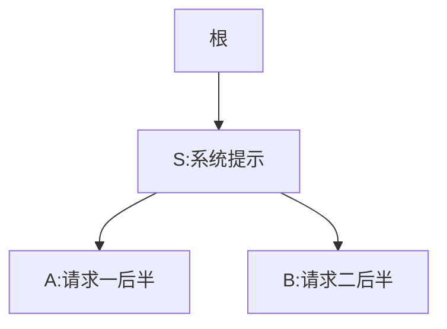
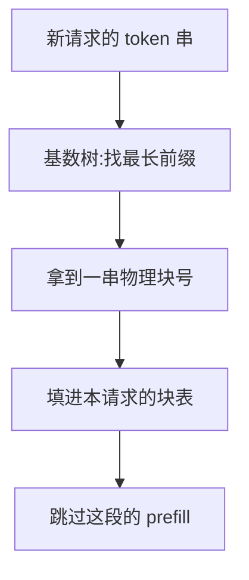

# RadixAttention

一句话:RadixAttention 是 SGLang 提出的**跨请求 KV cache 自动复用**机制——它把"哪些前缀已经算过"这件事交给一棵**基数树**全局管起来,请求一进门就自动找出最长的可复用前缀,把那一段 prefill 直接跳过。它不替代分页,而是长在分页之上:**树管索引,块池管数据**。

## 一、要解决什么:前缀共享从「手动声明」升到「自动发现」

分页之后共享几乎是免费的——两条序列的块表指向同一个物理块即可,一个字节都不用拷(机制见 PagedAttention 篇)。但那套机制留了两个缺口。

**缺口一:谁和谁能共享,得由外部告诉引擎。** vLLM 论文里的共享场景是同一个 prompt 的多路采样、beam search,以及由应用登记一段公共前缀。这些的共同点是——"这两段前缀相同"这个事实,引擎不是自己发现的,是调用方在提交时就交代清楚的。

**缺口二:请求一结束,KV 就被释放了。** KV cache 的生命周期严格绑定请求(见 KVCache 篇),没有跨请求的常驻状态。于是下一个请求哪怕带着一模一样的开头,也只能从零 prefill。

真实线上负载里,绝大多数重复恰恰都落在这两个缺口里:

| 场景 | 重复的是什么 | 为什么手动共享覆盖不到 |
|---|---|---|
| 统一的 system prompt | 几百到几千 token 的角色设定与工具描述 | 成千上万次请求分散在几小时里到达,彼此毫无关系 |
| 多轮对话 | 第 $N$ 轮的 prompt = 前 $N-1$ 轮的完整历史 | 每轮是一个独立请求,上轮的 KV 早已释放 |
| few-shot 模板 | 固定的那几条示例 | 同上,跨请求且跨用户 |
| 分支式推理(树搜索、多路探索) | 分支点之前的整条思维链 | 分支是程序跑起来才展开的,提交时说不出来 |

一句话概括病根:**公共前缀客观存在,但没人负责发现它,也没人负责把它留住**。RadixAttention 就是把"发现"和"留住"这两件事变成引擎的常驻能力——论文原话的意思是,与"请求跑完就丢掉 KV"的系统不同,它把 prompt 和**生成结果**的 KV 一起留在一棵基数树里。留住生成结果这一条尤其关键,多轮对话之所以能命中,正是因为上一轮吐出来的 token 到了下一轮就变成了 prompt 的一部分。

## 二、基数树:为什么是它,以及节点怎么裂开

### 从前缀树到基数树

普通前缀树(trie)一条边只放一个元素,一段 2000 token 的 system prompt 就要 2000 个节点,指针比数据还占地方。**基数树(radix tree)是压缩过的前缀树:一条边上可以挂一整串 token,长度不限。** 只有真正出现分叉的地方才需要一个节点。

选它的理由很直白:token 序列天然就是前缀结构,而基数树查最长公共前缀是**从根往下走、逐 token 比一遍**,代价与 prompt 长度成正比,与缓存里已经存了多少条序列无关。这两件事——"沿着一条路走到底就是最长公共前缀"和"树形结构本身就记录了谁是谁的后代"——后面第五、六节的淘汰与调度全都要用。

### 一个小例子:插入与分裂

设两个请求共享同一段系统提示 `S`,后半段各不相同(`A` 和 `B`):

| 时刻 | 树长什么样 | 发生了什么 |
|---|---|---|
| 初始 | 只有根 | — |
| 请求 1 插入后 | 根 —`SA`→ 叶 | 整串挂在**一条边**上,不拆成一个 token 一个节点 |
| 请求 2 来匹配 | 从根往下逐 token 比,走到 `S` 末尾时下一个对不上 | 最长公共前缀 = `S` |
| 请求 2 插入后 | 根 —`S`→ 中间节点,再分出 `A`、`B` 两条边 | **分裂**:原来那条边被切成两段,断点就落在分歧处 |



分裂是这棵树唯一的结构性操作,理解它就理解了全部:**新请求带来的分歧点在哪,树就在哪裂一刀**。裂完之后 `S` 成了两个请求共同的祖先节点,它那段 KV 从此被两条路径共用——第三个带同样系统提示的请求进来,走到 `S` 就能整段命中,连裂都不用裂。

多轮对话是同一件事的重复版:每轮把"新的用户输入 + 模型输出"接在上一轮那条路径的末端往下长,同一个会话就是树上的一条深链,不同会话在共享的系统提示处分叉。

> 🖼️ 占位:一棵基数树随两个多轮会话交替推进而生长的四格连环图,标出每格新增/分裂的节点,以及节点上的引用计数

## 三、分层关系:树管索引,块池管数据

这一节是最容易被误解的地方。**基数树没有替代分页,它索引的正是分页块池里的那些块。**

| | 分页块池(PagedAttention) | 基数树(RadixAttention) |
|---|---|---|
| 存什么 | **真正的 KV 张量**,按固定大小的块散着放 | token 序列 + 指向块的句柄 + 引用计数 + 最近访问时间 |
| 回答什么问题 | "第 $i$ 段 token 的 KV 在哪个物理块" | "这串 token 的前多少个,以前算过没有" |
| 分配单位 | 块 | 边(一串 token),但落到块池仍按块 |
| 没有它会怎样 | KV 要连续显存,碎片吃掉六到八成容量 | 前缀白白重算 |

一次命中的完整链路是这样走的:



所以命中之后引擎做的事,和 PagedAttention 里的前缀共享**是同一个动作**——把别人的物理块号抄进自己的块表,块的引用计数加一。差别只在于:块号是**树替你找出来的**,而不是调用方告诉你的。

粒度上还有一条工程约束值得记住:**共享只能按块对齐**。序列末尾没写满的那部分块不进缓存,因为半块没法被别人整块引用。SGLang 早期实现把页大小取成 1 个 token,于是"按块对齐"约等于"按 token 对齐",匹配粒度最细;页大小设大于 1 时,匹配长度要向下取整到页边界——比如页 16、匹配到 35 个 token,实际只算命中 32 个。这正是 PagedAttention 篇里"块大小越小前缀命中粒度越细"那条权衡的另一面。

另外,张量并行下每张卡各自持有自己那一份切好的 KV,树的结构在各卡上是一致的,**不需要额外的跨卡同步**。

## 四、命中之后省了什么:省 prefill,decode 一分钱不省

这是最容易答错、也最值得答准的一条。

### 省的是 prefill 的计算

prefill 的计算量与 prompt 长度成正比,命中多少 token,就整整省下这些 token 的一遍前向:

$$
\text{省下的计算} \;\approx\; 2P \cdot L_{\text{hit}}
$$

$P$ 是模型参数量,$L_{\text{hit}}$ 是命中的前缀 token 数,$2P$ 是每 token 前向的经验 FLOPs。意思很直接:一段 2000 token 的 system prompt 命中一次,就是白赚 2000 个 token 的 prefill。这笔收益直接落在 **TTFT** 上(指标定义见 推理服务指标 篇)。

顺带还省了显存:命中的那段 KV 是**共用同一份物理块**,不是每个请求各存一份。并发越高、公共前缀越长,这笔省得越多。

### 不省的是 decode

**decode 阶段一分钱不省。** 原因在 attention 的定义里:生成第 $t+1$ 个 token 时,当前这个 token 的 Q 要和**前面全部历史**的 K、V 做交互,一个都不能少。那段命中的前缀虽然不用重新**算**,但每一步都必须完整地**读**一遍。而 decode 恰恰是访存受限的(见 KVCache 篇),瓶颈就卡在"读 KV"这件事上——前缀缓存对它毫无帮助。

一句话记法:**前缀缓存省的是"算过的不再算",省不了"存着的还要读"。** 所以它的收益画像很偏:TTFT 大幅改善,TPOT 基本纹丝不动。想动 decode 那一侧,得走 KV 量化、GQA 这条路(见 KVCache量化 篇)。

推论也很有用:**长 prompt 短输出的负载(RAG、批量打标、代码补全)收益最大,短 prompt 长输出的负载(闲聊、长文创作)几乎白开。**

## 五、淘汰:LRU,但必须从叶子往上

缓存池不是无限的,而且它和正在跑的请求**抢的是同一块显存**——缓存多占一块,可用的 KV 就少一块。所以必须有淘汰。

论文用的是 **LRU,但淘汰单位是叶子节点**:每次挑"最久没被访问过的叶子"扔掉,扔完它的父节点可能自己变成了叶子,下一轮才轮到它。

```python
# 缓存满了,需要腾出若干 token 的空间
while 还需要腾空间:
    # 只从叶子里挑,且引用计数必须为 0
    node = 可淘汰叶子中最久未访问的那个
    释放 node 那段 KV 占的块,归还给块池
    从父节点上摘掉这条边
    # 摘掉后父节点可能刚好变成叶子,留到下一轮再考虑
```

**为什么非得从叶子开始**,这是本节的核心追问。因为父节点被它的子节点**引用着**:祖先那段前缀是所有后代路径的共同开头,先把祖先扔了,底下整棵子树的 KV 就全部断链失效——相当于为了腾一点空间,顺手毁掉一大片本来还能用的缓存。从叶子往上剥,则保证被扔掉的永远是"当前没有任何人接在它后面"的那一段,共同祖先能一直留着被复用,直到它自己也变成叶子。

论文对这条的说法就是这个意思:先淘汰叶子,才能让它们的共同祖先继续被复用,直到祖先自己变成叶子再被淘汰。落到现象上就是——**根附近那段人人都要走的 system prompt 几乎永远不会被淘汰**(每来一个请求它就被访问一次),被扔掉的总是某个冷掉的会话尾巴。

第二道闸是**引用计数**:每个节点记着"有几个正在跑的请求在用我",**计数为 0 才可淘汰**。这条不是优化,是正确性——把一个 decode 到一半的请求的前缀 KV 抽走,那个请求就直接算错了。这和 PagedAttention 里物理块的引用计数是同一套思想,只是记账的位置从块挪到了树节点。

现代实现在 LRU 之外还提供了别的淘汰策略,以及把缓存下沉到 CPU 内存的分层方案,具体见开源解读模块。

## 六、缓存感知调度:命中率能被"调"出来,代价是饥饿

命中率不只取决于负载,还取决于**你按什么顺序把等待队列里的请求放进来**。极端例子:队列里有 10 个共享同一段长前缀的请求,如果它们被 10 个无关请求隔开着依次进入,中间很可能已经把那段前缀淘汰掉了;而如果连着进,后 9 个全部命中。

SGLang 因此在连续批处理的调度器上加了一层**缓存感知调度**(连续批处理本身见 连续批处理 篇):**按每个等待请求与当前树的匹配前缀长度排序,匹配得越长越优先**。

论文还给了这个做法的理论依据:对一批请求,**按深度优先(DFS)顺序遍历这批请求构成的基数树,能取得最优命中率**(前提是缓存容量不小于最长的那条请求)。直觉上说得通——DFS 会把同一棵子树下的请求一口气走完,那段共同前缀在被用完之前不会被淘汰。在线场景下没有"一批请求"可看,"最长匹配前缀优先"就是对 DFS 的贪心近似。论文报告的效果:各基准上缓存命中率落在 **50%–99%**,平均达到理论最优命中率的 **96%**;端到端吞吐相对当时的对比系统最高 **6.4×**。

**但这是有代价的,而且论文自己明说了:贪心的缓存感知调度虽然吞吐高,却会导致饥饿**——一个前缀冷门、匹配长度为 0 的请求,可能被源源不断涌进来的高命中请求一直插队,永远排不上。论文把"和公平调度机制结合"列为未来工作。

这条权衡的形状和 连续批处理 篇里"确定性 vs 吞吐"是同构的:**吞吐导向的调度天然不公平,公平导向的调度天然浪费缓存**。实践中的折中通常是给等待时间加权、或设一个必须放行的上限,细节见开源解读模块。

## 七、代价与边界:什么时候是纯亏

| 代价 | 说明 | 量级 |
|---|---|---|
| 树的维护开销 | 每个请求都要走一遍匹配、插入、可能分裂,还要更新访问时间与引用计数 | 论文实测在其基准上不到端到端时间的 **0.3%**,无命中时开销可忽略 |
| 匹配开销 | 与 prompt 长度成正比;prompt 越长这一趟越贵,但相对被省下的 prefill 仍然极小 | 小 |
| **缓存占住显存** | 留下来的前缀块是运行请求不能用的块,可用 KV 变少 → 并发上限下降 → 抢占变频繁 | **这是主要代价** |
| 命中率低时纯亏 | 前缀几乎不重复的负载,上面三项全部照付,收益为零 | 负收益 |

第三条是面试的落点:**前缀缓存不是白拿的,它是拿"能同时跑多少请求"去换"每个请求少算多少"**。所以命中率是关键指标——

$$
\text{缓存命中率} \;=\; \frac{\text{被复用的 token 数}}{\text{所有请求的 prompt token 总数}}
$$

分子是靠命中省下来、根本没进 prefill 的那些 token,分母是本来要算的全部 prompt token。这个数低到一定程度,缓存挤占的那部分显存就不如还给运行中的请求。

收益画像总结成一张表:

| 负载 | 命中率 | 值不值 |
|---|---|---|
| 长 system prompt / 长 few-shot 模板 + 高并发 | 高 | **最值**,命中一次白赚整段 prefill |
| 多轮对话(尤其历史越滚越长) | 高 | **很值**,每轮省掉整段历史的重算 |
| 批量同模板请求(打标、评测、结构化抽取) | 高 | 很值 |
| 分支式推理 / 多路采样 | 高 | 值,分支点前的思维链只算一次 |
| 每条 prompt 都独一无二(开放问答、随机长文) | 低 | **不值**,白占显存 |

最后划两条边界。其一,**它只认前缀**:两段 prompt 中间那部分相同、开头不同,基数树一个 token 都匹配不上——因为 K/V 与 token 的位置绑定,换了位置就得重算。想复用非前缀片段需要另一套机制(把可复用片段显式声明成模块并处理位置编码,见文末 Prompt Cache),不是本篇这套东西能顺手做到的。其二,**同一条路走到底才算命中**,token 序列必须逐个完全相同,连特殊 token 都不能差。

顺带说清和 vLLM 的分工:vLLM 走的是哈希表——块一写满就算个哈希丢进前缀缓存表,别人命中即可引用(见 PagedAttention 篇)。目标一致、数据结构不同:哈希表是 $O(1)$ 查单个块,基数树是走一趟拿最长前缀,并且把"谁是谁的祖先"这层结构显式存了下来——第五节的叶子优先淘汰和第六节的 DFS 调度都是靠这层结构才成立的。引擎层面的选型见 推理引擎对比 篇;RadixAttention 与 kernel 无关,和 FlashAttention、PD 分离下的 KV 流转都是正交的(分别见 FlashAttention 篇、PD分离 篇)。

## 八、面试考点串联

| 高频问法 | 本文哪一节 |
| --- | --- |
| RadixAttention 和 PagedAttention 的前缀共享差在哪?它省的是哪个阶段的开销? | 一 + 四 |
| 为什么用基数树而不是普通前缀树?两个请求撞上公共前缀时,树上会发生什么? | 二(压缩边 + 分裂) |
| 树里到底存的是什么?它和分页的块池是什么关系? | 三(树管索引,块池管数据) |
| 命中一段前缀之后,decode 会变快吗?为什么? | 四(不会,decode 仍要读全量 KV) |
| 缓存满了淘汰谁?为什么必须从叶子开始?正在跑的请求怎么保护? | 五(leaf-first LRU + 引用计数) |
| 什么叫缓存感知调度?这么调有什么副作用? | 六(最长匹配前缀优先;饥饿) |
| 什么场景下开前缀复用反而是亏的? | 七(显存被占 + 命中率低) |


延伸阅读顺序:KVCache(是什么、多大)→ PagedAttention(怎么分页管)→ 本篇(怎么跨请求复用)→ 连续批处理(调度这一层)。

## 相关文献

- SGLang: Efficient Execution of Structured Language Model Programs(RadixAttention 原始出处,NeurIPS 2024)— [arXiv:2312.07104](https://arxiv.org/abs/2312.07104)
- Fast and Expressive LLM Inference with RadixAttention and SGLang(配套博客,基数树与 leaf-first LRU 的通俗版说明)— https://lmsys.org/blog/2024-01-17-sglang/
- Efficient Memory Management for Large Language Model Serving with PagedAttention(分页块池与引用计数的基础)— [arXiv:2309.06180](https://arxiv.org/abs/2309.06180)
- Prompt Cache: Modular Attention Reuse for Low-Latency Inference(非前缀片段的复用,与本篇形成对照)— [arXiv:2311.04934](https://arxiv.org/abs/2311.04934)
- SGLang 官方文档(页大小、淘汰策略等当前实现口径)— https://docs.sglang.io/
