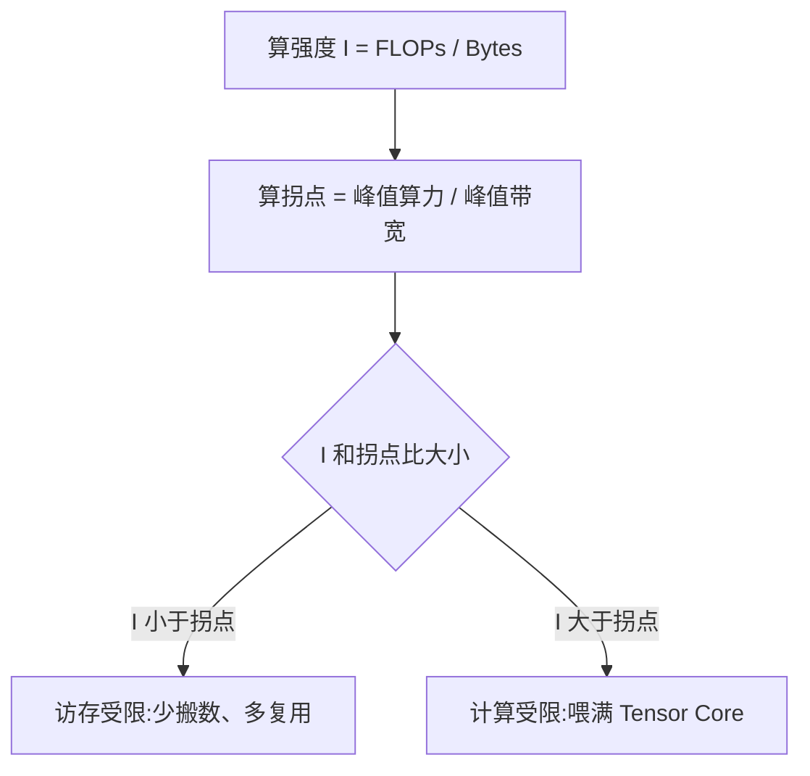

# Roofline 与 Bound 分析

一句话:Roofline 是一张**只有两条线的图**,它回答一个所有性能问题的起点——这个算子现在是被"算得不够快"卡住,还是被"数搬得不够快"卡住?判断错了,后面所有优化都做在没用的地方。

## 一、算术强度:一个算子的"体质"

先定义唯一需要记住的量。**算术强度(arithmetic intensity,也叫 operational intensity)**:这个 kernel 每从内存搬 1 个字节,能榨出多少次浮点运算。

$$
I = \frac{\text{总浮点运算次数 FLOPs}}{\text{总访存字节数 Bytes}} \quad (\text{单位:FLOP/Byte})
$$

分子是"活儿有多少",分母是"为了干这个活儿要搬多少数据"。强度高 = 数据搬一次能用很多遍,机器有得算;强度低 = 搬来一个数就用一下扔了,计算单元大部分时间在等。

强度是**算法 + 实现**共同决定的,不是硬件属性。同一个矩阵乘,分块做得好(数据留在 shared memory 里反复用)强度就高,朴素实现强度就低——GPU 的内存层级见「GPU架构与执行模型」篇。

几个必须能当场心算的例子(fp16,每元素 2 字节):

| 算子 | FLOPs | 最小访存 | 强度 I |
|---|---|---|---|
| 向量加 `c = a + b`(长度 n) | $n$ | $6n$ B(读两份写一份) | **0.17** |
| GELU / softmax 之类 elementwise | $\sim 10n$ | $4n$ B | **~2.5** |
| GEMV / batch=1 的线性层 | $2n^2$ | $2n^2$ B(权重主导) | **1.0** |
| 方阵 GEMM($M=N=K=n$) | $2n^3$ | $6n^2$ B | **$n/3$**,n=4096 时 **1365** |

最后一行是关键:**GEMM 的强度随边长线性增长**,因为计算量是 $O(n^3)$ 而数据量只有 $O(n^2)$。这一条独自解释了"为什么大矩阵乘是唯一能把 GPU 喂饱的算子"。

## 二、屋顶线与拐点:怎么判断 bound

把强度当横轴、可达算力当纵轴画出来,就是 Roofline:

$$
P_{\text{可达}} = \min\bigl(P_{\text{peak}},\ BW_{\text{peak}} \times I\bigr)
$$

这个 min 就是"屋顶"的全部含义:左边是一条斜率为峰值带宽的**斜线**(带宽再快也只能按 $BW \times I$ 供给算力),右边是一条峰值算力的**水平线**(算力封顶,再多数据也没用)。两条线交汇处就是屋顶的**拐点**。

> 🖼️ 占位:roofline 曲线示意图,横轴算术强度、纵轴可达算力,标出拐点

令两项相等,解出拐点位置:

$$
I_{\text{拐点}} = \frac{P_{\text{peak}}}{BW_{\text{peak}}}
$$

这个比值是**硬件自身的性质**:这台机器"每搬一个字节,天生配备多少算力"。在文献里它叫 **machine balance**(机器平衡点),在 Roofline 原论文里叫 ridge point(屋脊点)。判断规则就一句话:

- $I < I_{\text{拐点}}$ → 在斜线段 → **带宽 bound(访存受限)**
- $I > I_{\text{拐点}}$ → 在水平段 → **算力 bound(计算受限)**

几张卡的拐点(fp16/bf16 稠密 Tensor Core 口径):

| 卡 | 峰值算力 | HBM 带宽 | 拐点 |
|---|---|---|---|
| A100 / A800 80GB | 312 TFLOPS | 2.0 TB/s | **153** FLOP/Byte |
| H100 SXM | 989 TFLOPS | 3.35 TB/s | **295** FLOP/Byte |
| H20 96GB | 148 TFLOPS | 4.0 TB/s | **37** FLOP/Byte |

注意拐点大得离谱——**153 意味着数据搬一次得用上一百多次才算"够本"**。回头看第一节的表:除了大 GEMM,几乎所有算子都远在拐点左边。这就是"绝大多数算子访存受限"的定量版本。而且新卡的算力涨得比带宽快,拐点在**逐代右移**(A100 的 153 → H100 的 295),意思是硬件对算法的"复用率要求"越来越苛刻。(H20 参数取整机厂公开规格表口径,NVIDIA 未发布独立数据表,数字可能有出入。)

## 三、算力利用率与带宽利用率:理论计算怎么做

两个利用率的定义是同一个模子:**实测 / 峰值**。

$$
\text{算力利用率} = \frac{\text{FLOPs} / t}{P_{\text{peak}}} \qquad\qquad \text{带宽利用率} = \frac{\text{Bytes} / t}{BW_{\text{peak}}}
$$

左式分子是"实测算力"= 总浮点运算数 ÷ 耗时;右式分子是"实测带宽"= 总访存字节 ÷ 耗时。分母各自是官方峰值。**分子靠算法手推,分母查数据表,只需要一个实测量:kernel 耗时。**

走一遍完整数值。A800 上跑 fp16 方阵 GEMM,$M=N=K=4096$,实测耗时 0.5 ms:

| 步骤 | 计算 | 结果 |
|---|---|---|
| FLOPs | $2 \times 4096^3$ | 137.4 GFLOP |
| 访存字节 | $3 \times 4096^2 \times 2$ B | 100.7 MB |
| 实测算力 | $137.4\text{G} / 0.5\text{ms}$ | 275 TFLOP/s |
| 实测带宽 | $100.7\text{M} / 0.5\text{ms}$ | 201 GB/s |
| **算力利用率** | $275 / 312$ | **88%** |
| **带宽利用率** | $201 / 2039$ | **10%** |

结论自己就跳出来了:算力接近打满、带宽几乎闲着 → 计算受限,再优化访存也没用。**两个利用率一定是一高一低**,这也是一个天然的交叉验证——如果算出来两个都低,说明瓶颈既不是算力也不是带宽,而是别的东西(occupancy 不足、同步等待、kernel launch 开销)。

三条实操注意:

1. **分母要和 kernel 实际用的单元对齐**。稠密 / 稀疏差 2 倍,Tensor Core / CUDA Core 差一个数量级,fp16 / fp32 又差一档。拿 fp16 Tensor Core 的 312 TFLOPS 去除一个跑在 CUDA Core 上的 fp32 kernel,利用率会低得毫无意义
2. **分子的"访存字节"用理论最小值,算的是理想下限**。真实搬运量只多不少(重复读、未合并访存、写回),所以手推出的带宽利用率是**下界**,真机计数器给的才是实际值
3. 训练侧有个专用口径叫 **MFU(Model FLOPs Utilization)**:只统计前反向"必要的"浮点运算,不算重计算(activation checkpointing)重复做的那部分;把重复的也算进去的叫 HFU,恒 ≥ MFU。MFU 出自 PaLM 论文,PaLM-540B 报的是 46.2% MFU / 57.8% HFU

## 四、L2 命中之后,带宽利用率还能这么算吗

**不能——这是这套算法最容易翻车的地方。** 因为命中 L2 的那部分请求**根本没走到 HBM**,不消耗 HBM 带宽。

把访存量拆成两层来看:

| 量 | 含义 | 对应哪条屋顶线 |
|---|---|---|
| $B_{\text{req}}$ | SM 发出、L1 未命中而下到 L2 的总字节 | L2 带宽 |
| $B_{\text{req}} \times (1 - h_{L2})$ | L2 也没命中、真正落到显存的字节 | HBM 带宽 |

于是两个利用率必须分开算:

$$
U_{\text{HBM}} = \frac{B_{\text{req}} \times (1 - h_{L2})}{t \times BW_{\text{HBM}}} \qquad\qquad U_{L2} = \frac{B_{\text{req}}}{t \times BW_{L2}}
$$

左式:算 HBM 利用率时**要把 L2 命中的部分扣掉**($h_{L2}$ 是 L2 命中率);右式:L2 自己那条屋顶线用未扣减的请求量,分母换成 L2 的峰值带宽。

一个例子说明差别有多大。某 kernel 耗时 0.1 ms,请求量 300 MB,L2 命中率 70%,跑在 A800 上:

- 傻算(不扣命中):$300\text{MB}/0.1\text{ms} = 3.0$ TB/s,除以 2.039 TB/s = **147%**
- 正确算:落到 HBM 的只有 $300 \times 0.3 = 90$ MB → 900 GB/s → HBM 利用率 **44%**
- 再看 L2:3.0 TB/s 对着 A100 实测约 3 TB/s 量级的 L2 带宽 → **L2 才是真瓶颈**

**利用率算出超过 100%,几乎一定是 cache 命中在起作用**——这是最好用的自查信号,不是你的 kernel 突破了物理定律。把 L2、shared memory 各自的带宽也画成屋顶线,就是 **hierarchical roofline(分层 Roofline)**:同一个 kernel 在 HBM 那条线上远未触顶,却可能已经贴着 L2 那条线,优化方向完全不同。

几点补充:

- HBM 字节要**读写都算**,写回同样占带宽;有的算子写回量比读入还大
- L2 是全 GPU 共享的(A100 40 MB / H20 60 MB 量级),命中率随**工作集大小**剧烈变化:同一个 kernel 换个 batch size,命中率可能从 80% 掉到 5%
- 真机上的 $B_{\text{req}}$ 和 $h_{L2}$ 不用手推,profiler 有 DRAM 字节计数器可直接读——**优先信计数器,不信手推**;看哪几个指标见「性能分析与Profiling」篇,提高命中率的具体手段(合并访存、tiling、算子融合、改布局)见「访存与算子优化」篇

## 五、量化之后,bound 会迁移吗

会向那个方向动,但**是否真的越过拐点,要分两种量化方案讨论**。

先看确定的部分:权重从 fp16 变 int8,每个元素从 2 字节变 1 字节,**访存量减半、算术强度翻倍**,算子在 Roofline 上**向右移动一格**。

但拐点动不动,取决于用什么单元算:

| 方案 | 访存 | 峰值算力 | 强度 vs 拐点 | 是否迁移 |
|---|---|---|---|---|
| **W8A8**(权重激活都 int8,走 INT8 Tensor Core) | 减半 | **翻倍**(A800:312 TFLOPS → 624 TOPS) | 强度 ×2,拐点也 ×2(153→306) | **相对位置不变**,但绝对耗时约减半 |
| **W8A16 / weight-only**(int8 存,反量化回 fp16 再算) | 减半 | 不变 | 强度 ×2,**拐点不动** | **真的向右迁移一格** |

所以标准答法是:**weight-only 量化才会让算子朝计算受限迁移;W8A8 是把整条屋顶线一起抬走,相对位置不变但绝对更快。**

再看会不会"真的翻过去"。decode 阶段 batch=1 的线性层强度是 1.0,量化到 2.0,而 A800 拐点是 153——**离得太远,翻不过去,量化后依然是深度访存受限**,只是时间减半。真正会发生迁移的是**本来就贴着拐点**的场景:大 batch 的 decode、中等 seqlen 的 attention、瘦长但不极端的 GEMM。

**代价必须一起算**,否则纸面收益会全部漏光:

1. **反量化开销**:每个权重要读 scale(可能还有 zero-point)、做乘加。这些运算跑在 CUDA Core 上,不进 Tensor Core,算 MFU 时是纯损耗
2. **不融合就是负收益**:如果先把 int8 反量化成 fp16 写回显存、再启动 GEMM,访存量是"读 1 + 写 2 + 读 2 = 5 字节/元素",反而涨到原生 fp16(2 字节/元素)的 **2.5 倍**。所以 weight-only 方案**必须**做 fused dequant-GEMM,把反量化塞进 GEMM 的取数阶段
3. **激活动态量化**要在线统计 per-token scale,又是一趟读写

还有一层影响常被忽略:真的迁移到计算受限之后,**优化重心整个换掉**——原来该做的融合、减少往返不再有效,该关心的变成 tiling 和 Tensor Core 利用率。量化算法本身(GPTQ / AWQ / SmoothQuant)见「权重与激活量化」篇,KV cache 侧见「KVCache量化」篇。

## 六、应用题:同一个模型,H20 快还是 A800 快

> **题面**:跑一个大模型,大 shape 下 GEMM 占绝大部分时间。已知 H20 的带宽是 A800 的两倍、算力是 A800 的一半。理论预期在哪张卡上更快?

**第一步,写下两张卡的参数与拐点。**

| | A800 | H20 | 对比 |
|---|---|---|---|
| HBM 带宽 | 2.0 TB/s | 4.0 TB/s | H20 = 2× |
| FP16 稠密算力 | 312 TFLOPS | 148 TFLOPS | H20 ≈ 0.47× |
| 拐点 | 153 FLOP/Byte | 37 FLOP/Byte | |

**第二步,算算子强度。** 大 shape GEMM,取 $n=4096$ 的方阵,强度 $= n/3 = 1365$ FLOP/Byte。

**第三步,定位。** $1365 \gg 153 > 37$——在**两张卡上都落在水平段,都是计算受限**。而且不是勉强越过拐点,是超出 A800 拐点近 9 倍,余量极大。

**第四步,算时间。** 计算受限时 $t = \text{FLOPs} / P_{\text{peak}}$,和带宽无关:A800 是 $137.4\text{ GFLOP} / 312\text{ TFLOPS} = 0.44$ ms,H20 是 $137.4\text{ GFLOP} / 148\text{ TFLOPS} = 0.93$ ms。

**答:A800 更快,约 2.1 倍**(正好是算力比的倒数)。

**为什么带宽翻倍一点忙都帮不上?** 回到 $\min(P_{\text{peak}},\ BW \times I)$:H20 这一侧 $BW \times I = 4.0\text{ TB/s} \times 1365 = 5.5$ PFLOP/s,而 $P_{\text{peak}}$ 只有 148 TFLOPS。min 取的是算力那一项,**带宽项再翻十倍,min 值也纹丝不动**。H20 的带宽优势整个被"顶"在屋顶下面用不出来。

**但换个场景结论就反转。** 同样两张卡,跑 decode 阶段:batch 小、矩阵瘦长退化成 GEMV,fp16 下强度 ≈ batch 大小。取 batch=32,强度 32——**低于 H20 的拐点 37,更远低于 A800 的 153,两张卡都变成访存受限**。此时 $t = \text{Bytes} / BW$,一个 13B 的 fp16 模型权重 26 GB、每生成一个 token 要把权重完整读一遍,理论下限:

- A800:$26\text{ GB} / 2.0\text{ TB/s} = 13$ ms/token
- H20:$26\text{ GB} / 4.0\text{ TB/s} = 6.5$ ms/token → **H20 快 2 倍**

**这道题真正想考的是:"哪张卡更快"根本不是卡的属性,是"算子落在屋顶哪一段"的属性。** 标准答法永远是先算强度、再算拐点、再比较,而不是背卡的参数表。这也解释了 H20 这类"砍算力、保带宽"的卡为什么专为推理 decode 而生。

## 七、prefill 与 decode 各落在哪一段

| | prefill | decode |
|---|---|---|
| 矩阵形状 | M = 批内总 token 数(几千),胖大 GEMM | M = batch(1~几十),瘦长 GEMV |
| 算术强度 | 数百到上千 FLOP/Byte | ≈ batch 大小(fp16) |
| Roofline 位置 | **水平段,计算受限** | **斜线段最左端,访存受限** |
| 提速抓手 | Tensor Core 利用率、tiling、算子融合 | 增大 batch、量化、提高带宽利用率 |
| 选卡偏好 | 算力高的卡 | 带宽高的卡 |

**一句话结论:同一个模型的两个阶段落在屋顶线的两个极端。** 这就是 PD 分离的物理动机——用同一套 batch 配置、同一批卡去跑两段,总有一端在浪费。形状的详细推导见「Prefill与Decode的矩阵形状」篇,分离部署见「PD分离」篇。

### Roofline 管不了什么

它给的是**上界**,达不到上界的原因它一概不解释:

- occupancy 不足、warp divergence、bank conflict、同步等待——这些让你贴不到屋顶,但屋顶本身不动
- **kernel launch 开销不在模型里**(每次几微秒)。decode 阶段几百个小 kernel 串起来,launch 开销可能超过算子本身——这正是 CUDA Graph 存在的理由,见「CudaGraph」篇

所以 Roofline 只负责**第一步定方向**,定完之后拿 profiler 找具体原因,见「性能分析与Profiling」篇。

## 八、面试考点串联

| 高频问法 | 本文哪一节 |
|---|---|
| 什么是 Roofline 模型?两个轴分别是什么? | 一、二 |
| 算术强度怎么定义?GEMM 的强度是多少? | 一(表格) |
| 怎么判断一个算子是带宽 bound 还是算力 bound? | 二(拐点 / machine balance) |
| 什么是算力利用率、带宽利用率?怎么理论计算? | 三(公式 + 完整数值例) |
| L2 命中的情况下,带宽利用率怎么算? | 四(扣除命中部分;分层 Roofline) |
| 利用率算出来超过 100%,哪里错了? | 四(cache 命中的自查信号) |
| 量化之后 bound 会不会迁移? | 五(W8A8 与 weight-only 要分开答) |
| H20 带宽是 A800 两倍、算力是一半,跑大模型哪张快? | 六(完整解答:大 GEMM 选 A800,decode 选 H20) |
| prefill 和 decode 分别是什么 bound? | 七 |
| 为什么绝大多数算子是访存受限的? | 二(拐点高达 153) |

延伸阅读顺序:GPU架构与执行模型(硬件地基)→ 本篇(定量判断瓶颈)→ 访存与算子优化(访存受限怎么救)→ GEMM优化(计算受限怎么救)→ 性能分析与Profiling(真机怎么测)。

## 相关文献

- Roofline: An Insightful Visual Performance Model for Multicore Architectures(Williams, Waterman, Patterson;CACM 52(4):65–76, 2009,模型原始论文,无 arXiv 版)— https://dl.acm.org/doi/10.1145/1498765.1498785
- Hierarchical Roofline Analysis for GPUs: Accelerating Performance Optimization for the NERSC-9 Perlmutter System(Yang, Kurth, Williams;CC:PE 2020,分层 Roofline 方法论,无 arXiv 预印本,开放版见 OSTI)— https://doi.org/10.1002/cpe.5547
- Hierarchical Roofline Analysis: How to Collect Data using Performance Tools on Intel CPUs and NVIDIA GPUs — [arXiv:2009.02449](https://arxiv.org/abs/2009.02449)
- PaLM: Scaling Language Modeling with Pathways(MFU 指标的出处)— [arXiv:2204.02311](https://arxiv.org/abs/2204.02311)
- Dissecting the NVIDIA Hopper Architecture through Microbenchmarking and Multiple Level Analysis(含 A100/H800 各级缓存带宽实测)— [arXiv:2501.12084](https://arxiv.org/abs/2501.12084)
- NVIDIA Ampere Architecture Whitepaper(A100/A800 峰值算力与带宽口径)— https://www.nvidia.com/content/dam/en-zz/Solutions/Data-Center/nvidia-ampere-architecture-whitepaper.pdf
