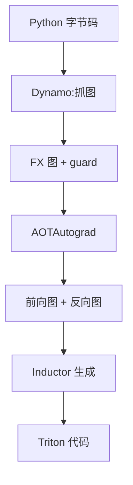

# torch.compile

一句话:torch.compile 是 PyTorch 内置的 JIT 编译器——它**从 Python 字节码里把张量运算抓成一张图,再把这张图重新生成成更少、更大的 kernel**。它一次乘法也不会替你省掉,收益全部来自"少搬几趟显存、少走几遍 Python",所以上限由"图里有多少访存受限的小算子可以合并"决定。

## 一、它要治的是 eager 模式的三笔开销

PyTorch 默认的 eager 模式是**逐算子解释执行**:Python 解释器读到 `y = gelu(x + b)`,就依次下发两个 kernel,算完立刻返回。这种做法调试极舒服(每一步的中间结果都在手上),代价是三笔固定开销:

| 开销 | 来源 | 量级 |
|---|---|---|
| 多余的显存往返 | 每个算子的中间结果写回 HBM,下一个算子再读回来 | 一个 $T \times d$ 的 fp16 中间张量动辄几十 MiB,一写一读就是它的 2 倍流量 |
| kernel launch | 每个算子一次下发,CPU 侧要走一遍驱动路径 | 几微秒一次,而 decode 的小算子本身也就跑几微秒 |
| Python 解释器 | 每步都要过属性查找、dispatch、autograd 记录 | 小算子多时,CPU 直接喂不动 GPU |

torch.compile 的定位就是**把这三笔一起收掉**:抓一段图 → 重排成更少更大的 kernel → 之后每次直接跑生成好的代码,Python 只负责检查"这份产物还能不能用"。

先钉死一条,后面所有结论都从它出来:**它是"重排执行方式"的优化,不是"换算法"的优化**——融合前后的乘加次数一模一样,算法复杂度一点没变。融合本身为什么能提速、什么能融什么不能融,见 算子融合 篇;本篇只讲 torch.compile 怎么把这件事自动做掉。

## 二、三段式:抓图 → 拆算子 → 生成代码



### TorchDynamo:输入 Python 字节码,输出一张图和一组使用条件

Dynamo 挂在 CPython 的**帧求值接口(PEP 523)**上——一个函数即将执行前,它先拿到这一帧的字节码,**逐条符号执行**一遍:遇到张量运算就记进一张 FX 图,遇到纯 Python 逻辑就在编译期直接算掉。

它解决的问题是"怎么在**不改用户代码**的前提下拿到图"。老办法要么要求你用受限子集重写(TorchScript),要么靠假张量走一遍(FX tracing)。PyTorch 官方在自己的基准套件上自报的对比是:**Dynamo 有 99% 的情况能成功抓到图,而 TorchScript 这类方案连 50% 都不到**。

抓图的同时,Dynamo 记下一组 **guard(守卫)**,也就是这份编译产物的**适用条件**:输入张量的 dtype、device、形状、stride,以及被当成常量用掉的那些 Python int/float 的具体取值。下次调用先跑 guard,过了就直接用缓存产物,不过就重编译。

### AOTAutograd 与算子分解:输入前向图,输出前后向两张小算子图

这一段干两件事。一是**提前把反向图也抓出来**——eager 下反向图是运行时由 autograd 动态拼的,编译器根本看不见;AOTAutograd 把它提前展开,于是**反向传播也能被融合优化**。二是**算子分解**:PyTorch 有两千多个算子,后端逐个实现不现实,PrimTorch 把它们规约到约 250 个基础算子,而 Inductor 内部的循环级 IR 更是只有约 50 个操作。

分解的意义不只是省事——**拆细之后,原本被"一个大算子"包住的逐元素运算才暴露出来**,编译器才有东西可融。

### TorchInductor:输入小算子图,输出 Triton / C++ 源码

Inductor 是默认后端。它把小算子图降级成一层**循环级 IR**(描述"输出的每个元素由哪些循环下标算出来"),在这一层做循环合并、分块、重排,最后给 GPU 生成 **Triton** 代码、给 CPU 生成 **C++/OpenMP** 代码,再交给 Triton 编译成可执行 kernel。

它解决的问题是"图怎么变成真的快的机器码"。关键动作有三个:把连续的逐元素与简单归约**塌缩进同一个循环嵌套**(这就是自动融合);归约按规模选实现(小归约整块进片上一趟做完,大归约用累加器循环);矩阵乘**不从零生成**,而是走自带的 Triton 模板或直接调 cuBLAS / CUTLASS,并在 autotune 里比一比谁快。

| 段 | 输入 | 输出 | 解决什么 |
|---|---|---|---|
| TorchDynamo | Python 字节码 | FX 图 + guard | 不改代码怎么把图抓出来 |
| AOTAutograd + 分解 | 前向 FX 图 | 前向 / 反向两张小算子图 | 反向也能优化;拆细了才有得融 |
| TorchInductor | 小算子图 | Triton / C++ 源码 | 图怎么变成真正快的 kernel |

## 三、graph break:抓图为什么这么难

### Python 里抓不进去的四类东西

Dynamo 是在**编译期**符号执行字节码,凡是"必须等到运行时、拿到真实数值才知道答案"的东西,它都抓不进图:

| 抓不进去的 | 为什么 | 典型写法 |
|---|---|---|
| 数据依赖的控制流 | 走哪个分支取决于 GPU 上的数值 | `if x.sum() < 0:` |
| 取值型同步 | 值必须回到 host 才有意义 | `.item()` / `.cpu()` / `float(t)` |
| 有副作用的调用 | 图里表达不了 IO | `print(t)`、写日志、`torch.save` |
| 不认识的第三方扩展 | 自定义 C/C++ 扩展对 Dynamo 是黑盒 | 未注册的自定义算子 |

碰到这些,Dynamo 的处理叫 **graph break(图断裂)**:把**到此为止**的部分编译掉,不支持的那一段**退回普通 Python 解释执行**,再生成一个"续跑函数"(名字形如 `__resume_at_<偏移>`)从断点之后重新开始抓图。所以 graph break **不报错、结果也对**——它只是让你安静地变慢。

### 为什么它会吃掉收益

四条叠在一起:

1. **图被切碎**:一条本来能融进一个 kernel 的长链被劈成几段,断点两侧的中间张量必须落回显存,融合收益直接归零
2. **每段单独编译**:编译开销按段数翻倍,冷启动更久
3. **那一段退回 Python**:解释执行本来就慢,而且常常顺带一次隐式同步(`.item()` 就是),把流水线打断(同步点的危害见 CUDA流与异步执行 篇)
4. **CUDA Graph 套不上**:断裂处必须回到 host,而 host 参与是图捕获期的禁忌

### 怎么发现

最直接的一招是 `fullgraph=True`:它要求整段必须抓成**一张**图,**遇到第一个断点就直接抛错**——把"安静变慢"变成"大声报错"。日常排查则打开 `TORCH_LOGS="graph_breaks"`(等价于 `torch._logging.set_logs(graph_breaks=True)`)把所有断点列出来;新版报错还带一个 `gbXXXX` 编号,可以查到这条断裂的专门说明(这套编号随版本演进)。

```python
# 会断:分支条件依赖 GPU 上的数值,编译期不知道走哪边
def f(x):
    if x.sum() < 0:        # ← graph break,而且顺带一次隐式同步
        return x * 2
    return x + 1

# 不断:把判断改成在 GPU 上做,host 侧分支消失了
def g(x):
    cond = x.sum() < 0                         # 仍然是张量,不取值
    return torch.where(cond, x * 2, x + 1)     # 整段留在图里
```

## 四、动态形状与重编译

### LLM 推理天然形状多变

guard 里最容易失守的就是形状,而 LLM 推理的输入形状**本来就不可能固定**:prefill 的序列长度由用户输入决定,decode 的 batch 随请求进出而变,连续批处理更是每步都在拼一个新形状(各阶段的矩阵长什么样,见 Prefill与Decode的矩阵形状 篇)。

形状一变,guard 失败,就要**重编译(recompilation)**——一种形状一份产物。几十种长度就是几十次编译,编译时间能把收益全部吃干净。

### 三档策略:把维度变成符号

PyTorch 的解法是把维度**符号化**:不再把 `seq_len` 记成常量 4096,而是记成一个符号量 $s_0$,让生成的 kernel 拿它当运行时参数。

| `dynamic` | 行为 | 代价 |
|---|---|---|
| `False` | 每种形状都按具体值特化 | 形状一变就重编,形状多时爆炸 |
| `True` | 一上来就尽可能符号化 | kernel 更保守,拿不到常量带来的优化;官方更推荐用 `mark_dynamic` 精确标注某几维,而不是一刀切 |
| `None`(默认) | **自动动态**:第一次按静态编;第二次发现某维变了,就**只把变了的那一维**标成动态重编一次,之后不再随它重编 | 无论如何要多付一次编译 |

两个容易踩的细节:**尺寸 0 和 1 会被特化**(它们在广播语义里行为特殊,不能当普通符号处理),所以 batch=1 常常自成一档;另外 Python 的 int / float 变量默认是**按值 guard** 的,把一个每步都在变的计数器传进被编译的函数,同样会一路重编。

### 重编译上限打满会怎样

PyTorch 给每个代码对象设了重编译上限(`torch._dynamo.config.recompile_limit`,**默认 8**;旧名 `cache_size_limit`,另有一个累计上限)。**一旦打满,这个函数以后就不再编译,直接回退到 eager 执行**,只留一条警告。

这是最阴的一种翻车:**没有报错,吞吐悄悄掉回编译前的水平**。所以形状会抖的服务必须盯一眼 `TORCH_LOGS="recompiles"`——它会告诉你是哪条 guard 挂了、挂在第几个维度上。至于是调大上限还是改用动态形状,判据很简单:**重编次数有没有一个确定的上界**。有(比如就那么几档 batch)就调大上限;没有(比如任意长度的 prefill)就必须上动态形状。

## 五、收益从哪来,上限在哪

三个来源,主次分明:

| 来源 | 占比 | 说明 |
|---|---|---|
| **自动算子融合** | 主要 | 逐元素长链(残差、norm、激活、RoPE)塌缩进一个 kernel,中间张量不落显存 |
| 减少 Python 与 launch 开销 | 次要 | 一段图变成少数几次下发,Python 只剩 guard 检查 |
| autotune 选核 | 次要 | 对模板类 kernel 实测比一比配置,`mode="max-autotune"` 把这一步开到最大 |

所以上限可以一句话算出来:**≈ 被消掉的中间张量流量 ÷ 有效带宽**,而这个量取决于**图里有多少访存受限的小算子**。一个由几个大 GEMM 主导的模型,小算子本来只占百分之几的时间,融到极致也只能省这百分之几(bound 怎么定量判,见 Roofline与Bound分析 篇)。

官方的横向数字要这么读:PyTorch 2 的论文报告 TorchInductor 在 A100 上、180+ 个真实模型的**几何平均**是推理 2.27×、训练 1.41×,并优于另外六个编译器。但这是覆盖大量中小模型的几何平均,**不能直接搬到 LLM 推理上**——LLM 的时间大头是 GEMM 和 attention,前者早就调好了,后者通常已经由手写融合 kernel 顶着。

### 什么时候没用,甚至更慢

| 情况 | 为什么 |
|---|---|
| 大 GEMM / attention 主导 | 可融的小算子本来就没多少,分子太小 |
| 图断得太碎 | 每段单独编,中间张量照样落盘,还白付了编译钱 |
| 形状抖动到打满重编上限 | 反复编译,打满后静默回退 eager,**净亏** |
| 动态控制流很重的模型 | 断点密集,同上 |
| 只跑几步就结束的进程 | 编译开销摊不掉 |

判断方法和别处一样:**先量,再编**——看 profiler 里那些"占时间但 FLOPs 很少"的小 kernel 到底有多少(怎么量见 性能分析与Profiling 篇)。

## 六、编译开销与冷启动

编译发生在**第一次真正跑到这张图、这组 guard 的时候**,不是加装饰器的时候。所以第一次前向会明显变慢,量级是秒到分钟(取决于模型规模、图分了几段、有没有开 autotune),不是毫秒;`max-autotune` 因为要实测比较 kernel,还会更慢。时间花在哪个阶段,可以用 `torch._dynamo.utils.compile_times()` 看。

缓解靠两层:

- **缓存**。PyTorch 把编译产物分层缓存(FX 图缓存、AOTAutograd 缓存、Triton 编译结果、autotune 结果,以及专门缓存动态形状决策的 PGO 缓存),默认落本地磁盘(`TORCHINDUCTOR_CACHE_DIR`,常见是 `/tmp/torchinductor_<用户名>`),也可以走远端 Redis;跨机分发用 `torch.compiler.save_cache_artifacts()` / `load_cache_artifacts()` 把整包产物搬走。命中缓存的"热启动"能省掉大部分编译时间,但**不是零**——guard 检查和产物加载还在。
- **warmup**。服务启动时按各档形状各跑几次,把编译、autotune、显存分配器的稳态**全部推到开始接客之前**。否则第一个真实请求要替你付这笔钱,首 token 延迟直接飞出去。这也是 CUDA Graph 捕获前必须 warmup 的原因之一——**JIT 编译必须发生在捕获之外**,详见 CudaGraph 篇。

## 七、和 CUDA Graph:两个层面的问题,可以叠加

最常见的混淆是把两者当成同一类优化。它们的分工其实很清楚:

| | torch.compile | CUDA Graph |
|---|---|---|
| 解决什么 | **kernel 本身不够好**:太碎、访存冗余、没选到最优实现 | **提交方式太贵**:CPU 逐个下发跟不上 GPU |
| 手段 | 抓图 → 融合 → 生成新 kernel | 把已有的 kernel 序列录成图,一次重放 |
| 改变访存量吗 | 改(融合掉中间张量) | 完全不改 |
| 对形状的诉求 | 希望**能动态**,好少重编 | 要求**必须固定**,一档一张图 |

两者是**互补**的:先用 compile 把 kernel 变少变好,再用 CUDA Graph 把这些 kernel 的下发开销抹掉。PyTorch 把它们串起来的开关就是 `mode="reduce-overhead"`,它在编译产物之上自动套一层 CUDA Graph。

要注意最后一行的**张力**:compile 想要动态形状,CUDA Graph 只吃固定形状。实践中的解法是分工——**用动态形状编出一份能吃多种形状的产物,再按 batch 分几档各捕一张图**;attention 这类依赖每条序列实际长度的算子则排除在捕获之外。推理引擎(vLLM、SGLang)正是这么做的:**分段编译 + 分段捕图,把图断裂点和捕获边界对齐**,具体做法见 推理引擎对比 篇。捕获、分档、图专属显存池这些机制本身见 CudaGraph 篇。

## 八、编译器的边界:为什么 FlashAttention 还是手写的

Inductor 擅长的是**循环层面的重排**:把几个逐元素算子的循环合并,把简单归约的两趟压成一趟。它不擅长的是**改算法**。

FlashAttention 快,不是因为"把四个 kernel 合成了一个",而是因为它换了一套算法:在线 softmax 让归一化因子可以边扫边修正,于是 $L \times L$ 的注意力矩阵**根本不需要整体存在过**(推导见 FlashAttention 篇)。这种"改变中间量存不存在"的重写,通用编译器推不出来——它只会保守地保持每一步的语义。同理,矩阵乘的分块、双缓冲、Tensor Core 指令排布,Inductor 也不从零生成,而是靠模板和现成库(见 GEMM优化 篇)。

一句话:**编译器负责"把该融的自动融了",人负责"想出不一样的算法"**。

不过这条边界在往编译器那边挪。PyTorch 的 FlexAttention 就是例子:用户用几行普通 PyTorch 写出 mask / 打分的修改规则,**由 torch.compile 把它降级成一个融合的、不物化注意力矩阵的 kernel**,反向也由 autograd 自动生成;官方博客报告它在 A100 上达到 FlashAttention-2 前向约 90%、反向约 85% 的性能。换句话说:**编译器接管的是"attention 变体的长尾",不是最热的那条主路径**——那条路上手写 kernel 仍然赢在最后 10%。

所以实践上的排序很稳定:**默认 compile 打底 → 热点看 profiler → 剩下的换现成融合算子库或手写 Triton**(落地四条路见 算子融合 篇)。

## 九、面试考点串联

| 高频问法 | 本文哪一节 |
|---|---|
| torch.compile 到底做了什么?分几段? | 二(Dynamo 抓图 / AOTAutograd 拆算子 / Inductor 生成代码) |
| Dynamo 怎么从 Python 里把图抓出来的?为什么比 TorchScript 好使? | 二(挂 PEP 523 帧求值接口逐条符号执行字节码;99% vs 不到 50%) |
| graph break 是什么?什么代码会导致它?为什么它会吃掉收益? | 三 |
| 编译完发现没变快,怎么查是不是图断了? | 三(`fullgraph=True` 把静默变慢变成报错;`TORCH_LOGS`) |
| LLM 推理形状一直在变,torch.compile 怎么办?重编上限打满会怎样? | 四(符号形状与自动动态;打满后静默回退 eager) |
| torch.compile 的收益主要来自哪?什么情况下开了反而更慢? | 五(融合为主;图碎、形状抖、大 GEMM 主导时净亏) |
| 它和 CUDA Graph 是一回事吗?能一起用吗? | 七(一个改 kernel、一个改提交方式;`reduce-overhead` 叠加) |
| 既然有 torch.compile,为什么 FlashAttention 还要手写? | 八(编译器做循环重排,不改算法) |

> 本表按出题标准自拟,非面经原题。

延伸阅读顺序:算子融合(收益原理)→ 本篇(怎么自动做到)→ CudaGraph(消提交开销)→ 性能分析与Profiling(怎么验证真的变快了)。

## 相关文献

- PyTorch 2: Faster Machine Learning Through Dynamic Python Bytecode Transformation and Graph Compilation(ASPLOS '24;2.27× 推理 / 1.41× 训练几何平均的出处;**无 arXiv 版本**,官方 PDF 如下)— https://docs.pytorch.org/assets/pytorch2-2.pdf
- PyTorch 2.x 概览(99% 抓图率、PrimTorch 约 250 个基础算子)— https://pytorch.org/get-started/pytorch-2-x/
- PyTorch 文档 — torch.compiler(Dynamo / AOTAutograd / Inductor 的分工)— https://docs.pytorch.org/docs/stable/torch.compiler.html
- PyTorch 文档 — Dynamo Overview(PEP 523 帧求值、guard、resume 续跑函数)— https://docs.pytorch.org/docs/stable/torch.compiler_dynamo_overview.html
- PyTorch 文档 — Working with Graph Breaks(断裂成因与危害)— https://docs.pytorch.org/docs/stable/compile/programming_model.graph_breaks_index.html
- PyTorch 文档 — Use fullgraph=True to Identify and Eliminate Graph Breaks — https://docs.pytorch.org/docs/stable/compile/programming_model.fullgraph_true.html
- PyTorch 文档 — Dealing with Recompilations(guard 失败、`recompile_limit` 默认 8、打满后回退 eager)— https://docs.pytorch.org/docs/stable/compile/programming_model.recompilation.html
- PyTorch 文档 — Dynamic Shapes(自动动态、符号形状、0/1 特化)— https://docs.pytorch.org/docs/stable/torch.compiler_dynamic_shapes.html
- PyTorch 文档 — `torch.compile` API(`mode` / `fullgraph` / `dynamic` / `backend`)— https://docs.pytorch.org/docs/stable/generated/torch.compile.html
- PyTorch 教程 — Compile Time Caching in torch.compile(分层缓存与 Mega-Cache)— https://docs.pytorch.org/tutorials/recipes/torch_compile_caching_tutorial.html
- PyTorch dev-discuss — TorchInductor: a PyTorch-native Compiler with Define-by-Run IR and Symbolic Shapes(循环级 IR 约 50 个算子、归约与模板的生成策略)— https://dev-discuss.pytorch.org/t/torchinductor-a-pytorch-native-compiler-with-define-by-run-ir-and-symbolic-shapes/747
- PyTorch 博客 — FlexAttention(用 torch.compile 生成融合 attention;A100 上约为 FA2 的 90% / 85%)— https://pytorch.org/blog/flexattention/
- Triton 官方文档 — https://triton-lang.org/main/index.html
