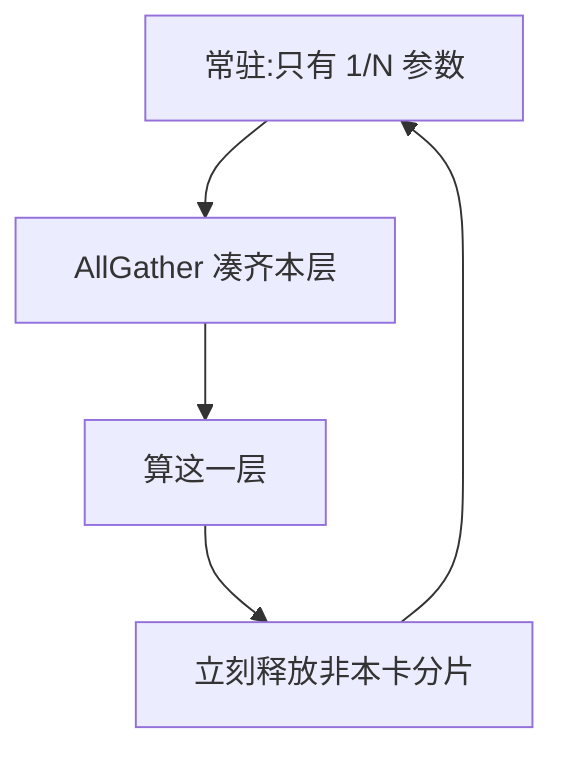

# ZeRO(Zero Redundancy Optimizer)

> 🔴 重点考点:本篇直接对应真实面经高频问法,文末「面试考点串联」给出问法对照。

一句话:ZeRO 是**数据并行的显存瘦身术**——它切的是训练状态的**存储**,不是计算。每张卡照样吃不同的数据、照样跑完整模型、照样算全量 FLOP,只是那份"人手一套"的参数 / 梯度 / 优化器状态被拆成 $N$ 份分开保管,要用时临时凑齐。这条定位是本篇的总开关,后面每一个取舍都从它推出来。

## 一、先钉死定位:切的是存储,不是计算

DP 的做法是每卡一份完整模型副本(DP / TP / PP / EP / SP 各切什么、怎么摆,见 并行策略 篇)。它的死穴不在算力,在**冗余**:$N$ 张卡上的参数、梯度、优化器状态**逐字节一模一样**,同一份东西存了 $N$ 遍。ZeRO 的全部想法就一句话:既然一样,那每人只保管 $1/N$,谁要用谁去凑。

类比:DDP 是 $N$ 个同事人手一整套百科全书,书架(显存)全被重复库存占满;ZeRO 是每人只管其中几卷,要看别的卷临时找同事借、用完即还。

三条推论现在就要记住,它们解释了后面的一切:

- **在相同数据、优化器与归约语义下,数学目标与 DDP 一致。** 分片本身没有改训练目标;但浮点归约顺序、精度及实现配置可能改变数值结果,不能保证收敛曲线逐点相同。切换 stage 后若效果异常,应检查这些具体差异;
- **省显存的代价永远是通信。** 切走的东西迟早要凑回来,凑就是 all-gather。选哪一档,本质是在问"这一份凑回来的流量,值不值那点显存";
- **它省不了激活。** 因为激活压根**不是冗余**:每卡吃的数据不同,算出来的激活各不相同,本来就没有重复副本可挤。

顺带把和 TP 的界线划清:**TP 切的是计算**——每卡只算 $1/t$ 的矩阵乘,单卡 FLOP 真的降了;**ZeRO 切的是存储**——每卡照算全量,只是权重不在自己手上时要去借。所以 ZeRO 不降低每卡的算力需求,TP 才降低。

## 二、显存账:$16\Psi$ 里最重的是那 $12\Psi$

设参数量 $\Psi$,混合精度(bf16 前向反向 + fp32 更新)+ Adam,每个参数要占:

| 内容 | 精度 | 字节 | 干什么用 |
|---|---|---|---|
| 参数 | bf16 | 2 | 前向 / 反向真正参与计算的那一份 |
| 梯度 | bf16 | 2 | 反向的产物,规约完就该扔 |
| master 权重 | fp32 | 4 | 优化器真正更新的高精度副本 |
| Adam 一阶动量 $m$ | fp32 | 4 | 梯度的滑动平均 |
| Adam 二阶动量 $v$ | fp32 | 4 | 梯度平方的滑动平均 |

$$
\underbrace{2\Psi}_{\text{bf16 参数}} + \underbrace{2\Psi}_{\text{bf16 梯度}} + \underbrace{(4+4+4)\Psi}_{\text{fp32 master} + m + v} = 16\Psi\ \text{字节}
$$

意思是:每个参数的训练态成本是 16 字节,其中 **12 字节全在优化器那一坨**。这就是那个总被直接甩出来的 $12\Psi$ 的确切来历——**Adam 的 fp32 三件套,一份主权重 + 两份动量,一人 4 字节**。它占 12/16 = 75%,是三大件里最重的行李,所以 ZeRO 第一刀就砍它。

这是指定精度与 Adam 状态的账本,不是所有训练都固定每参数 16 字节。这个系数跟着优化器走:SGD with momentum 只有一份动量,$12$ 掉到 $8$;纯 bf16 训练(不留 master)更低,但会踩下面这个坑(优化器本身见 优化器 篇)。

**为什么非得留一份 fp32 master 权重?** bf16 只有 7 位尾数,相对精度约 $2^{-8} \approx 0.4\%$。训练后期学习率降下来,单步更新量常常不到权重的千分之几,直接在 bf16 上相加就被舍入抹平——**"加了等于没加",参数原地不动**。所以更新在 fp32 副本上做,做完再转回 bf16 参与下一轮前向。这 4 字节买的是"更新不丢失",不是冗余。

**激活为什么不在 ZeRO 的射程内?** 就是上一节第三条:ZeRO 挤的是"同一份数据存了 $N$ 遍"的冗余,而激活各卡各不相同,没有冗余可挤。省激活得换手段——重算(activation checkpointing)与沿序列切分,见 显存管理与OOM 篇和 并行策略 篇。

代入 7B:$7\times10^9\times16 = 112$ GB,一张 80 GB 卡连训练态都装不下,而且**这还没算激活**。完整的训练显存账(激活公式、临时 buffer、通信 buffer、碎片)见 显存管理与OOM 篇,本篇只负责三大件这三行。

## 三、三个 Stage:各切什么,什么时候得凑回来

**标准 ZeRO 阶段只有 1、2、3。** 平台来源 P002-Q043 题干写的“Stage 4”不是标准阶段;Offload/Infinity 是在分片机制上扩展存储层级,并非第四种分片阶段。约 2026-04 的 DeepSpeed 本地源码快照也将最大阶段定义为 3。

按"从重到轻"逐级开刀。判断一档贵不贵,只看一个问题:**切走的东西,什么时候必须凑回来?**

### Stage 1:切优化器状态

每卡只保管 $1/N$ 的 fp32 三件套,也只负责更新对应的那 $1/N$ 参数;bf16 参数与梯度仍每卡全量,前向反向流程一个字都不用改——**这是它几乎零风险的原因**。

**凑回来的时机:每步一次,凑参数。** fp32 状态自用,从头到尾不出门;但各卡更新完自己那段 bf16 参数后,下一步前向要的是**全量**参数,所以要 all-gather 一次拼齐。

### Stage 2:再切梯度

梯度同步从 all-reduce 换成 **reduce-scatter**:每卡只收下"自己负责更新的那 $1/N$"对应的梯度和,其余算完即弃。

**凑回来的时机:不用凑。** 这张卡既然只更新 $1/N$ 参数,另外 $(N-1)/N$ 的梯度对它毫无用处,存着纯属浪费。反向本来就要跨卡规约一次,ZeRO 只是把"人人拿全量"改成"各拿各的那段"。

### Stage 3:再切参数本身

参数也切成 $N$ 份,每卡常驻的只有自己那份。

**凑回来的时机:需要本层参数时。** 按前向后立即释放的简化调度,前向算到哪一层,就把那层参数 all-gather 临时凑齐,算完立刻释放;反向求这一层的输入梯度还要再用一次权重($\partial L/\partial X = \partial L/\partial Y \cdot W^{\top}$),于是**再凑一次**。下一节的通信估算采用这种每层前后向各取回一次的调度;实际缓存与预取策略可以改变次数。

图读法:这是按层取回、用完释放的简化流程;实际实现可暂存参数以减少通信,并用更多显存换取速度。

三档的账(只算三大件):

| 配置 | 参数 | 梯度 | 优化器状态 | 每卡合计 | 7B · $N$=8 | 论文 7.5B · $N$=64 |
|---|---|---|---|---|---|---|
| DDP | $2\Psi$ | $2\Psi$ | $12\Psi$ | $16\Psi$ | 112 GB | 120 GB |
| Stage 1 | $2\Psi$ | $2\Psi$ | $12\Psi/N$ | $4\Psi + 12\Psi/N$ | 38.5 GB | 31.4 GB |
| Stage 2 | $2\Psi$ | $2\Psi/N$ | $12\Psi/N$ | $2\Psi + 14\Psi/N$ | 26.3 GB | 16.6 GB |
| Stage 3 | $2\Psi/N$ | $2\Psi/N$ | $12\Psi/N$ | $16\Psi/N$ | 14 GB | 1.9 GB |

最后一列是 ZeRO 原论文表 1 的数字,可以直接对照。读表要点:**Stage 1 一步就吃掉了这本账的 75%**($16\Psi \to 4\Psi$ 加一个零头),Stage 2 再啃掉剩下的一半,Stage 3 才把最后那 $2\Psi$ 也摊开、让每卡显存随 $N$ 线性下降。**越往后每一档买到的显存越少,付的通信却越多**——这就是选型的全部张力。

## 四、通信量:免费午餐为什么只供应到 Stage 2

先约定口径:记 bf16 梯度(或参数)张量的字节数 $P = 2\Psi$,通信量按 ring 的**每卡发送量**算(算子语义与 $2(N-1)/N$ 系数的来历见 集合通信 篇;下表把 $(N-1)/N$ 近似成 1)。一条恒等式是全部推导的根:

$$
\text{AllReduce}(P) \;\equiv\; \text{ReduceScatter}(P) \;\rightarrow\; \text{AllGather}(P/N)
$$

意思是:一次 all-reduce 本来就是两步走,每步每卡约搬 $P$ 字节,合计约 $2P$。**ZeRO-1/2 做的事,就是把这两步拆开、各自换掉内容**:

| 配置 | 每 step 的通信 | 每卡通信量 | 相对 DDP |
|---|---|---|---|
| DDP | 梯度 all-reduce | $\approx 2P$ | 1× |
| Stage 1 / 2 | 梯度 reduce-scatter + 更新后参数 all-gather | $\approx P + P = 2P$ | **1×,一分没涨** |
| Stage 3 | 前向参数 all-gather + 反向参数 all-gather + 梯度 reduce-scatter | $\approx 3P$ | **1.5×** |

三句话把这张表说透:

- **Stage 1/2 在这个简化模型中不增加通信字节量。** 原来的 all-reduce = "散梯度 + 收梯度";现在变成"散梯度 + 收**新参数**"。第二步收集的内容变了,显存占用降低了。但桶大小、启动次数、梯度累积与计算重叠仍会影响耗时,不能由字节量相同推出“没有性能损失”;
- **Stage 3 多付的正好是一次全模型 gather。** Stage 1/2 每步凑一次参数($P$),Stage 3 前向凑一次、反向再凑一次($2P$),多出来的那 $P$ 摊在 $2P$ 的基线上就是 **+50%**。注意 Stage 3 反而没有"更新后再 all-gather"那一步——参数本来就不常驻,前向那次凑齐已经顺手把这件事做了,所以是 $3P$ 而不是 $4P$;
- **1.5 倍还只是账面。** Stage 3 的通信是**按层碎片化**触发的、**卡在关键路径上**(这层参数没到齐就算不了),而且单次消息只有 $P/L$ 量级——小消息打不满带宽,时间容易被固定启动开销吃光。实现上靠 prefetch(算第 $k$ 层时先把第 $k+1$ 层的 all-gather 发出去)与计算重叠遮掩,但互联一差(以太网 vs NVLink / InfiniBand)就原形毕露。重叠手段与藏不住的情形见 集合通信 篇。

### 跨节点太痛时:ZeRO++ 把 $3P$ 砍到 $0.75P$

Stage 3 那三份通信在跨节点场景很要命,ZeRO++ 对每一份各砍一刀:**qwZ** 在前向 all-gather 前把权重分块量化成 int8($P \to 0.5P$);**hpZ** 在每个节点内额外冗余存一份节点内二级分片,反向重建参数只走机内 all-gather,跨节点那份直接归零($P \to 0$);**qgZ** 梯度用 int4,并换成 all-to-all 式的 reduce-scatter($P \to 0.25P$)。合计 $3P \to 0.75P$,4 倍,论文报告 384 卡规模上最高 2.16 倍吞吐。三招的共同思路值得单独记:**拿精度和一点冗余显存,去换最慢那条链路上的字节数。**

## 五、Offload:把哪一部分挪走,瓶颈换成什么

- **ZeRO-Offload** 把 fp32 优化器状态、fp16 梯度、以及**优化器更新这一步计算**整体搬到 CPU 内存,GPU 只留 fp16 参数和前向 / 反向;它复用的是 Stage 1/2 的分片机制。
- **为什么挪它划算**,论文给的判据非常干净:前向 / 反向的计算量是 $O(\Psi B)$(随 batch 长),优化器更新只有 $O(\Psi)$(只随参数量)。**把复杂度低的那一步外包给慢设备,GPU 专心干重活**——所以论文直接划线:只有复杂度低于 $O(\Psi B)$ 的计算才值得下放。配上手写 SIMD + 多线程的 CPU Adam(比 PyTorch 的 CPU 实现快 5–6.4 倍),单张 32 GB V100 就能训 13B(原生 PyTorch 只到 1.4B),10B 模型上单卡还能跑出 40 TFLOPS。
- **ZeRO-Infinity** 在 Stage 3 之上再加一层 NVMe:参数、梯度、优化器状态都能下放到 CPU 内存或硬盘,配一套以带宽为中心的分片与预取引擎。NVMe 负责存储,不是把优化器计算交给硬盘执行。论文自报单台 DGX-2 节点即可微调万亿参数级模型,512 张 V100 上跑到 25+ PFLOPS(约峰值的 40%)。
- **代价是把瓶颈从 HBM 换成了 PCIe。** HBM 每秒几 TB,PCIe Gen4 ×16 单向约 32 GB/s、Gen5 约 64 GB/s,差着近两个数量级;NVMe 再低一档(单盘几 GB/s,靠多盘并联堆总带宽)。判据只有一条:**单步的 GPU 计算时间要长过这一步的传输时间**,传输才藏得住;batch 太小、序列太短就是 GPU 干等——仓库再大,进出货都挤在 PCIe 这条单车道上。
- **什么时候值:** 卡不够、模型确实放不下、且不追吞吐(做实验、小规模微调)。**有卡就先加卡**——offload 买的是"能不能跑起来",不是"跑得更快"。

## 六、和其他并行怎么配:为什么工程上常常只上 ZeRO-1

ZeRO 分片的是数据并行组中的训练状态,TP 切层内计算,PP 切层间计算;这些作用可以组合。但**算法能组合,不等于某个框架支持任意配置**。本地约 2026-04 的 DeepSpeed 源码快照中,流水线训练实现明确排除 ZeRO-2/3;不能把这个实现限制推广为所有系统的算法禁令。

引入 TP/PP 后,先看每卡剩下多少参数、梯度和优化器状态,再决定 DP 维是否继续分片。若参数和梯度已经很小,只分优化器状态的 Stage 1 可能够用。Stage 3 每层需要取回参数,其代价取决于 DP 组跨不跨机、参数能否缓存、微批数量以及通信重叠;不能固定断言哪条并行链路一定跨机,或每次前向都必须重新取回同一参数。

与流水线调度配合时,还要按各阶段估算激活与临时参数收集的峰值,确认参数可否跨微批保留、预取是否与其他通信争用,以及每个 DP 组的拓扑。微批增多可能增加参数取回次数或提高缓存价值,也会改变激活存活时间;这些都要在框架支持的配置下测量。

没有 TP/PP 时,Stage 3 可在保留完整层计算方式的同时分摊模型状态,适合单卡放不下模型的纯 DP 训练。PyTorch FSDP 也采用类似的状态分片思路,具体策略及用法见 FSDP 篇;并行维度的完整比较见 并行策略 篇。

## 七、选型:先算账,再选档

先估**训练峰值**:模型状态之外,还有激活、临时通信缓冲和碎片。用拟采用的序列长度、微批和精度短跑,确认峰值与单步耗时,再比较够用的方案。

| 情况 | 优先比较什么 | 判断依据 |
|---|---|---|
| DDP 已有显存余量 | DDP 与 Stage 1 | 分片是否换来更大微批或更低资源成本 |
| 参数能复制,梯度和优化器状态太重 | Stage 2 | 状态分片后是否能放下激活峰值 |
| 复制参数仍放不下 | Stage 3,必要时配合激活重算 | 参数按需取回的通信能否接受 |
| 已用 TP/PP | 框架支持的 ZeRO 档位 | 每卡剩余状态、DP 组互联与微批调度 |
| GPU 容量仍不足 | Offload / Infinity | CPU/NVMe 容量、带宽与允许的训练时间 |
| LoRA / QLoRA | 先区分底座与可训练增量 | 冻结底座没有梯度和优化器状态,但参数本身仍占空间;量化精度另算 |

例如按第二节的混合精度 Adam 账本,8 路 DP 的 Stage 2 模型状态为 $2\Psi+14\Psi/8=3.75\Psi$ 字节:7B 约 26.25 GB,13B 约 48.75 GB,**都还没算激活和临时缓冲**。因此不能把“7B–13B、8张80GB卡”一律判为显存足够;要看实际峰值,也不能用卡数直接除全部 $16\Psi$ 来估 Stage 1/2。

## 面试考点串联

| 高频问法 | 本文哪一节 | 来源 |
|---|---|---|
| ZeRO 与数据并行什么关系,三个阶段各分什么,为什么能减少显存占用? 真题来源:[B002-Q001](../../../docs/references/面经原题.md#b002-g01-q001)、[B002-Q006](../../../docs/references/面经原题.md#b002-g01-q006)、[B002-Q023](../../../docs/references/面经原题.md#b002-g01-q023)、[B002-Q037](../../../docs/references/面经原题.md#b002-g01-q037)、[B002-Q059](../../../docs/references/面经原题.md#b002-g01-q059)、[B002-Q060](../../../docs/references/面经原题.md#b002-g01-q060)、[B002-Q072](../../../docs/references/面经原题.md#b002-g01-q072)、[B002-Q138](../../../docs/references/面经原题.md#b002-g01-q138)、[B002-Q141](../../../docs/references/面经原题.md#b002-g01-q141)、[B002-Q143](../../../docs/references/面经原题.md#b002-g01-q143)、[B002-Q144](../../../docs/references/面经原题.md#b002-g01-q144)、[B002-Q168](../../../docs/references/面经原题.md#b002-g01-q168)、[B002-Q192](../../../docs/references/面经原题.md#b002-g01-q192) | 一、先钉死定位:切的是存储,不是计算;二、显存账;三、三个 Stage | P002-Q015、Q043、Q045、Q109;P002-Q073 追问 |
| Stage 3 的参数平时不完整,前向和反向怎么计算? | 三、三个 Stage:各切什么,什么时候得凑回来 | P002-Q015、Q043;P002-Q045、Q109 追问 |
| 省显存怎样影响通信和训练速度,为什么不能只看总字节量? | 四、通信量:免费午餐为什么只供应到 Stage 2 | P002-Q015、Q043、Q045、Q109 |
| ZeRO-3 与流水线/模型并行的显存节省有何区别,怎样组合并处理微批调度? | 一、先钉死定位:切的是存储,不是计算;六、和其他并行怎么配:为什么工程上常常只上 ZeRO-1 | P002-Q015、Q043、Q045、Q109、Q105 追问 |
| Offload 与 Infinity 分别把什么搬到哪里,和 Stage 2/3 是什么关系? | 五、Offload:把哪一部分挪走,瓶颈换成什么 | P002-Q015、Q043、Q045、Q109 追问 |
| 什么时候 ZeRO-2 已经够用或更高效,什么时候值得上 ZeRO-3? | 七、选型:先算账,再选档 | P002-Q015、Q043、Q045、Q109 追问 |
| 为什么训练态不是总固定为每参数 16 字节,激活又怎么办? | 二、显存账:$16\Psi$ 里最重的是那 $12\Psi$ | 自拟 |
| 请说明如何理论估算在采用ZeRO-3策略微调Qwen2-72B这类超大规模模型时，单个GPU设备所需的显存容量，需涵盖模型参数、梯度、优化器状态等组成部分。 真题来源:[B002-Q142](../../../docs/references/面经原题.md#b002-g01-q142)、[B002-Q190](../../../docs/references/面经原题.md#b002-g01-q190) | 二、显存账:$16\Psi$ 里最重的是那 $12\Psi$ | B002 |

> 本表混有面经原题、平台整理题与自拟题;P002-Q015、Q043、Q045 提供主问及追问,Q073、Q105 提供跨篇追问,最后一行为自拟。平台题不因此视为面经。

延伸阅读顺序:并行策略(DP/TP/PP 各是什么)→ 本篇(DP 维的显存瘦身)→ 集合通信(算子语义与通信量口径)→ 显存管理与OOM(完整的训练显存账)→ FSDP / DeepSpeed(框架侧怎么配)。

## 相关文献

- ZeRO: Memory Optimizations Toward Training Trillion Parameter Models(三个 Stage、$16\Psi$ 与 1.5 倍通信的出处)— [arXiv:1910.02054](https://arxiv.org/abs/1910.02054)
- ZeRO-Offload: Democratizing Billion-Scale Model Training(优化器状态与更新计算下放 CPU,$O(\Psi)$ 判据与 CPU Adam)— [arXiv:2101.06840](https://arxiv.org/abs/2101.06840)
- ZeRO-Infinity: Breaking the GPU Memory Wall for Extreme Scale Deep Learning(CPU + NVMe 异构存储)— [arXiv:2104.07857](https://arxiv.org/abs/2104.07857)
- ZeRO++: Extremely Efficient Collective Communication for Giant Model Training(qwZ / hpZ / qgZ,通信量 $3M \to 0.75M$)— [arXiv:2306.10209](https://arxiv.org/abs/2306.10209)
- PyTorch FSDP: Experiences on Scaling Fully Sharded Data Parallel(ZeRO-3 思路的 PyTorch 原生实现)— [arXiv:2304.11277](https://arxiv.org/abs/2304.11277)
- Megatron Core 文档 — Distributed Optimizer(按 ZeRO 论文对优化器状态分片,即 ZeRO-1)— https://docs.nvidia.com/megatron-core/developer-guide/latest/user-guide/features/dist_optimizer.html
- PyTorch 文档 — FullyShardedDataParallel · ShardingStrategy(FULL_SHARD / SHARD_GRAD_OP / NO_SHARD / HYBRID_SHARD 的定义)— https://docs.pytorch.org/docs/stable/fsdp.html
- DeepSpeed 文档 — Pipeline Parallelism(`PipelineModule` 明示与 ZeRO-2 / ZeRO-3 不兼容)— https://deepspeed.readthedocs.io/en/latest/pipeline.html
