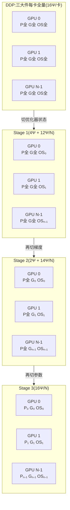

# ZeRO(Zero Redundancy Optimizer)

> ⚠️ 旧版:本篇写于写作契约确立之前,尚未按新标准审查重写。标准见 docs/05-知识库写作契约.md,样板见「GPU架构与执行模型」。

一句话:**数据并行的显存瘦身术**——普通数据并行(DDP)让每张卡都存一模一样的全套训练状态,ZeRO 把这些冗余状态切碎、分摊到所有卡上,要用时再临时凑齐。出自微软 DeepSpeed 团队,是如今多卡训练大模型的默认底座(工程载体见 AI Infra 分类下的 DeepSpeed 一篇)。

类比:DDP 是 N 个同事人手一套完整的百科全书,全是重复库存;ZeRO 是每人只保管其中几卷,要看别的卷就临时找同事借、用完即还——每人书架(显存)的压力最多能降到 1/N。

## 一、显存解剖:先把账算清

训练时的显存大头不是参数本身,而是"三大件":参数、梯度、优化器状态。混合精度 + Adam 下,参数量为 $\Psi$ 的模型,每个参数要占:

| 内容 | 精度 | 字节 | 作用 |
| --- | --- | --- | --- |
| 参数 | bf16 | 2 | 前向/反向计算用 |
| 梯度 | bf16 | 2 | 反向传播产物 |
| master 权重 | fp32 | 4 | 优化器真正更新的高精度副本 |
| Adam 一阶动量 $m$ | fp32 | 4 | 梯度的滑动平均 |
| Adam 二阶方差 $v$ | fp32 | 4 | 梯度平方的滑动平均 |

$$
\underbrace{2}_{\text{bf16 参数}} + \underbrace{2}_{\text{bf16 梯度}} + \underbrace{4 + 4 + 4}_{\text{fp32 master} + m + v} = 16 \ \text{字节/参数}
$$

三个直接推论:

- **优化器状态占 12/16 = 75%**:最重的行李不是模型,而是 Adam 的 fp32 三件套——这解释了 ZeRO 为什么先拿它开刀;
- **7B 模型 ≈ 112 GB 训练态**($7 \times 10^9 \times 16$ 字节),单张 80 GB 卡连训练态都装不下——注意这还没算激活;
- **激活显存是另一本账**:随 batch × 序列长度增长,ZeRO 管不着,它的解法是 gradient checkpointing(用重算换显存),两者正交、大模型训练几乎总是同时开。

追问一句:为什么必须存 fp32 master 权重?bf16 尾数只有 7 位,小学习率下的微小更新量会被舍入直接吞掉("加了等于没加"),所以更新在 fp32 副本上做,前向时再转成 bf16 参与计算。

## 二、三个 Stage:逐级切碎

核心观察:DDP 里三大件在每张卡上一模一样,是纯冗余。ZeRO 按"重量从大到小"的顺序逐级切分,N 张卡时:

### Stage 1:切优化器状态(12Ψ → 12Ψ/N)

- 每卡只保管 1/N 的 fp32 三件套,只负责更新对应的那 1/N 参数;
- 参数与梯度仍每卡全量,前向/反向流程完全不变;
- 各卡更新完自己的分片后,把新参数 all-gather 一次,凑齐完整模型进入下一步。

### Stage 2:再切梯度(2Ψ → 2Ψ/N)

- 梯度同步从 all-reduce 换成 **reduce-scatter**:每卡只收下"自己负责更新的那 1/N 参数"对应的梯度和,其余梯度算完即弃;
- 逻辑很直白:这张卡既然只更新 1/N 参数,另外 (N-1)/N 的梯度对它毫无用处,存着纯属浪费。

### Stage 3:再切参数本身(2Ψ → 2Ψ/N)

- 参数也切成 N 份,每卡常驻的只有自己保管的那份;
- 前向/反向走到哪一层,就把那层参数从各卡 all-gather 临时凑齐,算完立刻释放——图书馆借书,看完即还,书架上永远只放自己那几卷;
- 至此三大件全部 1/N,理论上卡越多能训的模型越大(线性扩展):

$$
M_{\text{Stage3}} = \frac{(2 + 2 + 12)\,\Psi}{N} = \frac{16\Psi}{N}
$$

| 配置 | 参数 | 梯度 | 优化器状态 | 每卡合计 | 7B、N=8 实算 |
| --- | --- | --- | --- | --- | --- |
| DDP | 2Ψ | 2Ψ | 12Ψ | 16Ψ | 112 GB |
| Stage 1 | 2Ψ | 2Ψ | 12Ψ/N | 4Ψ + 12Ψ/N | 38.5 GB |
| Stage 2 | 2Ψ | 2Ψ/N | 12Ψ/N | 2Ψ + 14Ψ/N | 26.3 GB |
| Stage 3 | 2Ψ/N | 2Ψ/N | 12Ψ/N | 16Ψ/N | 14 GB |

## 三、一图看懂:三大件在 N 张卡上的分布

图例:P = bf16 参数、G = bf16 梯度、OS = fp32 优化器状态,下标 i 表示第 i 份分片。自上而下,冗余被一层层挤掉,直到每卡只剩 1/N。

## 四、通信量:免费午餐只供应到 Stage 2

先记住一个实现事实:**一次 ring all-reduce 本身就等于 reduce-scatter + all-gather 两步**,每步单卡通信量约 Ψ,合计约 2Ψ。

| 配置 | 通信操作 | 单卡通信量 | 相对 DDP |
| --- | --- | --- | --- |
| DDP | 梯度 all-reduce | ≈ 2Ψ | 1× |
| Stage 1 / 2 | 梯度 reduce-scatter + 新参数 all-gather | ≈ 2Ψ | 1×(不变) |
| Stage 3 | 前向参数 all-gather + 反向参数 all-gather + 梯度 reduce-scatter | ≈ 3Ψ | 1.5× |

- **Stage 1/2 是白赚的**:只是把 all-reduce 原有的两步拆开、各自换了内容(先散梯度、再收新参数),总量一分没涨,显存却省了大头;
- **Stage 3 多付 50%**:参数不常驻,前向要凑一次、反向还要再凑一次,多出约 Ψ 的 all-gather——**用 50% 额外通信,换参数显存的 N 倍削减**;
- Stage 3 的通信还按层碎片化触发、卡在关键路径上(这层参数没到齐就算不了),互联慢(以太网 vs NVLink/InfiniBand)时掉速明显,实现上靠 prefetch 预取下一层、与当前层计算重叠来遮掩。

## 五、Offload 家族:显存不够,内存和硬盘来凑

- **ZeRO-Offload**(基于 Stage 2):把优化器状态和梯度搬到 CPU 内存,Adam 更新也在 CPU 上做(配了高度优化的 CPU Adam 实现),单张 32 GB V100 即可训 13B。之所以划算:优化器更新是 O(Ψ) 的轻计算,前向/反向才是 O(batch·Ψ) 的重计算——轻活外包给 CPU,GPU 专心算矩阵乘;
- **ZeRO-Infinity**(基于 Stage 3):再加一层 NVMe 硬盘,参数/优化器状态都可下放,配上以带宽为中心的分片与预取引擎,论文展示单台 DGX-2 节点即可微调万亿参数级模型;
- **代价是 PCIe 带宽**:PCIe 每秒几十 GB,比 HBM 的每秒几 TB 慢两个数量级,NVMe 更慢。batch 够大、单步计算够久时传输能被重叠遮住,否则 GPU 大部分时间在等货——仓库再大,进出货都挤在 PCIe 这条单车道上。

## 六、ZeRO++:通信再砍一刀

Stage 3 的 3Ψ 在跨节点(带宽低)场景很痛,ZeRO++ 用三招把通信量砍到约 1/4:

- **qwZ 量化权重通信**:前向 all-gather 参数前做分块量化(fp16 → int8),这部分通信量减半;
- **hpZ 分层分片**:每个节点内额外冗余保存一份参数的节点内二级分片(拿显存换带宽),反向重建参数时只做节点内 all-gather,跨节点参数通信直接归零;
- **qgZ 量化梯度通信**:梯度以 int4 量化,并用基于 all-to-all 的新式 reduce-scatter,避免 ring 逐跳反复"量化-反量化"的精度损失。

## 七、与其他并行的关系:ZeRO 切的是"存储",不是"计算"

- ZeRO 本质仍是**数据并行**:每卡吃不同的数据、逻辑上跑完整模型,只是三大件从"各存全套"改成"分布式保管"。它与张量并行(TP,把单层矩阵乘切开)、流水线并行(PP,把模型按层切段)**正交,可叠加**;
- Megatron 式 3D 并行(TP × PP × DP)中,DP 维度通常只配 **ZeRO-1**:TP/PP 已把每卡参数切得很小,再切收益有限;而 Stage 3 的按层 all-gather 会被 PP 的众多 micro-batch 反复触发,通信雪上加霜——切优化器状态就够了;
- **FSDP ≈ Stage 3 的 PyTorch 原生实现**:FULL_SHARD 对应 Stage 3、SHARD_GRAD_OP 对应 Stage 2、NO_SHARD 退回 DDP、HYBRID_SHARD 是 hpZ 式"节点内分片 + 节点间复制"。面试常问两者关系:思想同源,FSDP 是该思想在 PyTorch 生态的官方化(框架层对比见 DeepSpeed 一篇)。

## 八、实践选型

- **单卡装得下三大件**:不用 ZeRO;多卡训小模型(几 B 以内)用 DDP 或 Stage 1 即可——Stage 3 的碎片化通信反而拖慢训练,小模型上它是杀鸡用牛刀、还把鸡杀慢了;
- **7B–13B 全参微调、8×80 GB**:Stage 2 常是甜点位(训练态约 26 GB,给激活留足余量);
- **30B 以上或卡数吃紧**:Stage 3 + gradient checkpointing 双管齐下(一个砍训练态、一个砍激活,正交互补);还不够就上 Offload——慢,但能跑;
- **LoRA 微调**:可训参数极少,优化器状态本就微不足道,ZeRO 针对"12 字节大头"的收益骤减;冻结底座只剩 2 字节/参数(无梯度、无优化器状态),可用 Stage 3 分片,或干脆 QLoRA 把它量化掉;
- 心法:**先按 16Ψ 公式算账,再除以卡数选档**;显存省得越狠,通信与速度代价越大,够用就好、不要一步到 Stage 3。

## 九、面试考点串联

1. 混合精度 Adam 下每参数 16 字节怎么拆、7B 为何要 112 GB →「显存解剖」
2. 三个 Stage 各切什么、每卡显存公式 →「三个 Stage」+ 分布图
3. 为什么 Stage 1/2 通信量不变、Stage 3 是 1.5×(all-reduce = reduce-scatter + all-gather)→「通信量」
4. ZeRO 管不管激活显存 → 不管;激活靠 gradient checkpointing →「显存解剖」
5. ZeRO 与 TP/PP 的区别与叠加、3D 并行为何常配 ZeRO-1 →「与其他并行的关系」
6. FSDP 与 ZeRO-3 的对应关系 →「与其他并行的关系」
7. Offload 把优化器丢给 CPU 为什么划算、瓶颈在哪 →「Offload 家族」
8. 给定模型规模和卡数怎么选 stage、与 LoRA/重算怎么组合 →「实践选型」

## 相关文献

- ZeRO(三阶段切分原始论文)— [arXiv:1910.02054](https://arxiv.org/abs/1910.02054)
- ZeRO-Offload(优化器状态下放 CPU)— [arXiv:2101.06840](https://arxiv.org/abs/2101.06840)
- ZeRO-Infinity(CPU + NVMe 异构存储,超大模型)— [arXiv:2104.07857](https://arxiv.org/abs/2104.07857)
- ZeRO++(量化通信 + 分层分片 hpZ)— [arXiv:2306.10209](https://arxiv.org/abs/2306.10209)
- PyTorch FSDP(ZeRO-3 思想的 PyTorch 原生实现)— [arXiv:2304.11277](https://arxiv.org/abs/2304.11277)
