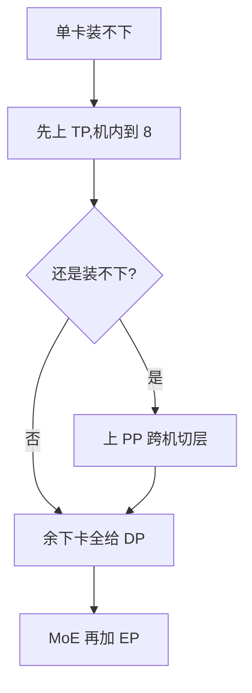

# 并行策略(DP / TP / PP / EP / SP)

> 🔴 重点考点:本篇直接对应真实面经高频问法,文末「面试考点串联」给出问法对照。

一句话:**一张卡装不下模型、也算不动数据时,就把模型和数据沿不同维度切开分给多张卡**——DP 切数据、TP 切矩阵、PP 切层、EP 切专家、SP/CP 切序列,五种并行是五个正交的切法,可自由叠加。本篇是分布式训练与推理的总纲:每种切法切什么、通信多少字节、能不能跨机、几十张卡上怎么组合。

类比:一家工厂订单多到做不完(数据),核心机器又大到塞不进任何一间厂房(模型)。DP 是多开几家一模一样的分厂各接各的订单;TP 是把一台机器拆成几半、几个车间同桌协作;PP 是把生产线按工序切段、每间厂房负责几道;EP 是开专科门诊、订单送到对口科室;SP/CP 是把超长的原料带切成段分头处理。

## 一、全景:五个维度,一张表

全文统一符号:参数量 $\Psi$、micro-batch $b$、序列长 $s$、隐藏维 $h$、总层数 $L$、micro-batch 个数 $m$、每元素字节数 $\beta$(bf16 取 2);并行度分别是 TP $t$、PP $p$、DP $d$、EP $e$、CP $c$。

| 策略 | 切什么 | 每卡持有 | 通信算子 | 通信频率 | 典型域 |
| --- | --- | --- | --- | --- | --- |
| DP 数据并行 | 数据 batch | 完整模型副本 | 梯度 all-reduce | 每 step 一次 | 可跨机 |
| TP 张量并行 | 单层内的矩阵 | 每层权重的 $1/t$ | 激活 all-reduce | 每层前向 2 次 + 反向 2 次 | **机内**(NVLink 域) |
| PP 流水线并行 | 模型的层 | 连续几层(stage) | 边界激活,P2P 点对点 | 每个 micro-batch 过一次界 | 适合跨机 |
| EP 专家并行 | MoE 的专家 | 一部分专家 | token 的 all-to-all ×2 | 每个 MoE 层 | 机内/跨机皆有,带宽敏感 |
| SP/CP 序列并行 | 序列(token 维) | 一段 token | all-gather / reduce-scatter 或环传 K/V | 每层 | SP 跟随 TP 域;CP 可跨机 |

记忆钩子:按典型配置,每 step 的通信量大致是 **PP < DP ≪ TP**——所以带宽最好的地方(机内 NVLink 域)留给 TP,带宽最差的链路(跨机)走 PP 和 DP。第七节把这个"≪"算成具体字节数。各集合通信算子本身的语义与实现(Ring / Tree、算法带宽 vs 总线带宽)见 集合通信 篇,本篇只关心"用哪个算子、搬多少字节"。

## 二、DP:复制模型、切分数据

最朴素的并行:每卡一份完整模型,batch 均分,各卡独立前向反向,然后对梯度做一次 all-reduce 取平均——保证所有副本更新后仍然一模一样。优点是实现简单、扩吞吐立竿见影;致命伤是**显存全冗余**:参数、梯度、优化器状态每卡都存全套,模型一旦超过单卡容量,DP 加多少卡都无济于事。冗余怎么办?把三大件切碎分摊、要用再临时凑齐,就是 ZeRO(见 ZeRO 篇)——记住它的定位:**ZeRO 本质仍是 DP,切的是存储,不是计算。**

### DataParallel 与 DistributedDataParallel:为什么 DP 早已被废弃

PyTorch 里有两个同名不同命的东西,是极高频的一问:

| | `DataParallel`(DP) | `DistributedDataParallel`(DDP) |
| --- | --- | --- |
| 进程模型 | **单进程多线程**,一个 Python 进程驱动所有卡 | **多进程,每卡一个进程** |
| 每步做什么 | 主卡把模型复制到各卡 → scatter 输入 → 各卡前向 → **输出 gather 回主卡**算 loss → 梯度汇总到主卡 → 主卡更新 | 各进程独立前反向 → 梯度 all-reduce → 各自更新(参数从不广播) |
| 瓶颈 | GIL 争用:多线程抢一个解释器锁,调度开销吃掉并行收益;每步重新复制模型 | 无 GIL 问题;通信是集合操作,无中心节点 |
| 显存 | **主卡爆**:它多扛一份 gather 上来的全部输出 + 全部梯度,其余卡闲着 | 各卡均衡 |
| 能否跨机 | 不能 | 能 |

DDP 快的关键不只是"换成多进程",而是两个工程细节:**梯度分桶(bucketing)** 和 **与反向重叠**。反向传播是从最后一层往前算的,梯度是**陆续**出炉的;DDP 把参数按注册的逆序打包成若干个桶(默认每桶 25 MiB),某个桶的梯度一凑齐就立刻发起这个桶的 all-reduce,不等整个反向结束。于是通信被切碎、塞进反向计算的缝隙里——这就是"DP 的通信不在关键路径上"这句话的实现依据。桶开小则通信启动早但次数多(每次都有固定启动开销),桶开大则摊薄开销但开始得晚,25 MiB 只是个折中默认值。

## 三、TP:切开单层的矩阵乘(Megatron 核心)

单层太大、或模型层数切完还装不下时,就把层内的矩阵乘本身切开,几张卡合力算一层。Megatron-LM 的精髓不在"能切",而在**怎么切通信最少**。

### MLP:先列切、再行切,只需一次 all-reduce

Transformer 的 MLP 是两个矩阵乘夹一个非线性:先过升维矩阵 $A$ 得 $Y = \mathrm{GeLU}(XA)$,再过降维矩阵 $B$ 得 $Z = YB$。把第一个权重 $A$ 按**列**切给两张卡:

$$
A = [A_1, A_2] \ \Rightarrow\ XA = [XA_1,\ XA_2] \ \Rightarrow\ Y = [\underbrace{\mathrm{GeLU}(XA_1)}_{Y_1},\ \underbrace{\mathrm{GeLU}(XA_2)}_{Y_2}]
$$

意思是:列切时每卡拿到的 $XA_i$ 已经是完整的一个列块,GeLU 逐元素作用,**各算各的不用对账**。反过来若把 $A$ 按行切,则 $XA = X_1 A_1 + X_2 A_2$ 得先跨卡**求和**才能过 GeLU——非线性不满足"和的函数 = 函数的和",就得在非线性前多同步一次。这就是"先列切"的原因。

第二个权重 $B$ 顺势按**行**切:

$$
B = \begin{bmatrix} B_1 \\ B_2 \end{bmatrix} \ \Rightarrow\ Z = Y_1 B_1 + Y_2 B_2
$$

意思是:每卡手里的 $Y_i$ 恰好就是自己上一步的本地输出,直接乘自己的 $B_i$ 得到一个部分和,最后把两份部分和做**一次 all-reduce** 就得到完整的 $Z$。整个 MLP 前向只此一次通信。

### 注意力:按头切

多头注意力天然可切:每卡分到几个头,Q/K/V 投影按列切(每卡只算自己那几个头),softmax 和加权求和都在头内完成、互不打扰,输出投影 $W_O$ 按行切,收尾同样只要一次 all-reduce。结构和 MLP 完全同构:**列切进、行切出**。

### 代价:通信频繁、且全在关键路径上

一个 Transformer 层 = 注意力块 + MLP 块,前向共 2 次 all-reduce;前向做恒等的位置反向要 all-reduce(反之亦然,一对共轭算子),所以反向再来 2 次,合计**每层每 micro-batch 4 次**。每次通信的都是 $b \times s \times h$ 量级的激活,而且全卡在关键路径上——这一步没同步完,下一步算不了,藏都藏不住。由此得出经验法则:**TP 不出机**(通常 $t \le$ 单节点卡数,即 8),只在 NVLink 域内做。类比:TP 是几个人同桌合解一道大题,每写两步就要对一次答案——必须坐同一张桌子,隔着走廊喊没法干活。定量依据见第七节。

## 四、PP:按层切段,流水线作业

把模型按层切成 $p$ 段(stage),每段放一组卡,数据像流水线一样依次流过。段间只在边界传一次激活,而且是 P2P 点对点、不是全局集合操作——通信量比 TP 小得多,**适合跨机**。

### bubble:流水线的空转

朴素做法是整个 batch 在 stage 0 算完才进 stage 1:任意时刻只有一段在干活,其余全在围观。解法是把 batch 切成 $m$ 个 **micro-batch** 依次注入,让各段尽快都有活干。但开头灌满、结尾排空的空转(bubble)无法全消,以"拍"计:

$$
\text{bubble 占总时间} \approx \frac{p - 1}{m + p - 1}, \qquad \text{bubble 占理想计算时间} \approx \frac{p-1}{m}
$$

两个式子说的是同一件事、只是分母口径不同:流水线要 $p-1$ 拍才灌满,理想情况下干完全部活是 $m$ 拍、实际是 $m + p - 1$ 拍,空转就是那 $p-1$ 拍。Megatron 论文用的是右边这个"相对理想时间"的口径。想压 bubble 就加大 $m$(经验值 $m \gtrsim 4p$),但 micro-batch 切太碎又打不满单卡算力——一对典型权衡。

### 调度:GPipe → 1F1B → interleaved 1F1B

- **GPipe**:所有 micro-batch 前向全做完,再统一做反向。简单,但峰值要同时攒 $m$ 份激活,显存随 $m$ 线性涨;
- **1F1B**(PipeDream 命名,Megatron 默认):流水线灌满后,每卡"做一个前向、就还一个反向"交替进行,反向尽早释放激活——bubble 占比与 GPipe 相同,但峰值激活从 $m$ 份降到至多 $p$ 份;
- **interleaved 1F1B**:每卡不再拿连续一段,而是拿 $v$ 段打散的"虚拟 stage"(如某卡同时负责第 1–4 层和第 9–12 层),bubble 缩小到原来的 $1/v$,代价是 P2P 通信次数翻 $v$ 倍——拿便宜的通信换昂贵的空转。

类比:bubble 是餐厅刚开门时只有头道工位在忙、后面工位干等;micro-batch 是把大桌订单拆成小份连续上菜;interleaved 是每个厨师身兼两道打散的工序,空窗被切得更碎、更好填。

还有一个和 TP 联动的实现细节值得记:TP 组内各卡持有的层输出是**完全相同的副本**,朴素做法会让每张卡都把同一份激活发去下一个 stage,跨机链路上全是重复数据。Megatron 的 **scatter/gather 优化**把这份激活切成 $t$ 块、每卡只发自己那块,到对端 TP 组内再 all-gather 拼回来——跨机 P2P 量直接降到 $1/t$。

## 五、SP 与 CP:沿序列切

### SP(Megatron 版):TP 域内的免费显存优化

TP 只切了矩阵乘,层里的 LayerNorm、Dropout 没切——这些区域的激活在 TP 组内**每卡一份全量**,是纯冗余。SP 的观察:这些操作在序列维上逐 token 独立,那就把这段激活按序列切成 $t$ 份分给 TP 组内各卡(不需要新卡,复用 TP 组)。通信恰好一分不涨:一次 all-reduce 在实现上本就等于 reduce-scatter + all-gather 两步,SP 把这两步拆开放到 TP 区域的两侧——进矩阵乘前 all-gather 沿序列凑齐,出来后 reduce-scatter 切回去,总量与纯 TP 持平。再搭配 **selective activation recompute**:只重算注意力里那些"显存占用随 $s^2$ 增长、重算却便宜"的中间量(softmax、dropout mask 等),大头矩阵乘输出照存不误。两招合力,每层每 micro-batch 的激活压到约 $34sbh/t$ 字节,重算开销只有百分之几——这个式子第九节要用。

### CP:超长序列的攻坚(Ring Attention 思路)

序列长到几十万 token、单卡连一段激活都放不下时,就把**整条序列**切给 $c$ 张卡,注意力计算本身也分布式化(context parallel)。这是与 SP 的本质区别:SP 只切 LN/Dropout 区域的激活存储,CP 连注意力的计算都切。麻烦在于每个 token 要看全序列的 K/V:Ring Attention 让各卡把自己的 K/V 块沿环逐跳传递,本地用分块在线 softmax(flash-attention 式)边收边算,通信与计算重叠,序列长度理论上随卡数近乎无限扩展。工程细节:causal mask 下持有序列开头的卡活最少,要用 zigzag 式交错切分做负载均衡。

## 六、EP:MoE 的专家分家

MoE 层专家总参数巨大、但每个 token 只激活 top-$k$ 个(MoE 本身是什么、router 怎么打分,见 MoE基础 篇和 MoE路由 篇)。把专家分摊到 $e$ 张卡上、每卡常驻几位专家,就是专家并行。代价是每个 MoE 层**两次 all-to-all**:

1. **dispatch(分发)**:router 定了每个 token 去哪几位专家后,把 token 打包寄往专家所在的卡;
2. **combine(收回)**:各专家算完,把结果寄回 token 老家,按门控权重加权求和。

反向传播再来两次,合计每个 MoE 层 4 次。all-to-all 是"人人给人人寄包裹"的通信模式,对带宽和延迟都敏感;负载不均(热门专家挤爆、冷门专家闲置)会让最慢的那张卡拖住全组。缓解手段之一是限制每个 token 最多路由到 $M$ 个节点(DeepSeek-V3 的 node-limited routing,取 $M=4$),把跨机流量按节点去重。**dispatch/combine 的几种实现方案对比、DeepEP、负载不均的 trace 怎么看,全部见 MoE并行与DeepEP 篇,本篇只到"两次 all-to-all 在哪"为止。**

与 TP 的组合微妙:两者抢的都是机内带宽,单个专家又通常不大、犯不着再 TP 切,所以工程上常"注意力部分用 TP、MoE 层换用 EP"分域处理。类比:EP 是医院分诊——挂号台(router)把病人(token)派往各楼专科,看完再送回原病房汇总,两次 all-to-all 就是送去、接回的两趟班车。

## 七、通信量总账:把"≪"算成字节

按 ring 口径:一次 all-reduce 每卡搬运约 $2D$ 字节($D$ 是被规约张量的字节数),因为它等于 reduce-scatter + all-gather 两步。下表按**每卡每 step** 统计($L/p$ 是每 stage 的层数;EP 那行标 $\le$,是因为路由到本卡的 token 不上线,负载越不均越接近上界):

| 策略 | 算子 | 单次通信量(每卡) | 每 step 次数 | 每 step 合计 | 在关键路径上? |
| --- | --- | --- | --- | --- | --- |
| DP | 梯度 all-reduce | $2\beta\Psi/(tp)$ | 1 | $2\beta\Psi/(tp)$ | 否,分桶后藏进反向 |
| TP | 激活 all-reduce | $2\beta bsh$ | $4 \cdot \frac{L}{p} \cdot m$ | $8\beta bsh \cdot \frac{L}{p} \cdot m$ | **是**,同步不完算不了下一步 |
| PP | 边界激活 P2P | $\beta bsh / t$ | $2m$(前向 + 反向) | $2m\beta bsh/t$ | 部分,可与计算重叠 |
| EP | token all-to-all | $\le \beta bskh$ | $4 \cdot L_{\text{MoE}} \cdot m$ | $\le 4\beta bskh \cdot L_{\text{MoE}} \cdot m$ | **是** |
| SP | reduce-scatter + all-gather | 与 TP 持平 | 与 TP 持平 | 与纯 TP 相同 | 是 |
| CP | K/V 环传 | $2\beta \frac{bs}{c} h_{kv}$ / 跳 | 每层 $c-1$ 跳 | 随层数累加 | 否,与计算重叠 |

**代入一组真实数字**(70B:$h=8192$、$L=80$;$s=8192$、$b=1$、$m=32$、$\beta=2$;$t=8$、$p=2$、$d=4$,于是 $bsh = 67.1 \times 10^6$ 个元素):

| 策略 | 算式 | 每卡每 step |
| --- | --- | --- |
| DP | $2 \times 2 \times 70\text{e}9 / 16$ | **17.5 GB** |
| PP | $2 \times 32 \times 2 \times 67.1\text{e}6 / 8$ | **1.1 GB** |
| TP | $8 \times 2 \times 67.1\text{e}6 \times 40 \times 32$ | **1374 GB** |

TP 比 DP 多两个数量级,这就是那个"≪"。再往前推一步:这一步喂进去 $m \cdot b \cdot s \cdot d \approx 1.05\text{e}6$ 个 token,训练计算量约 $6\Psi T = 6 \times 70\text{e}9 \times 1.05\text{e}6 \approx 4.4\text{e}17$ FLOP,摊到 64 卡、按每卡 400 TFLOPS 有效算力算约 17 秒,于是 TP 需要**每卡约 80 GB/s 的持续带宽**才不拖后腿——机内 NVLink 域绰绰有余,跨机链路差着数量级(具体带宽数字见 GPU互联与组网 篇)。

### 谁能跨机,谁不能

| 并行 | 跨机? | 理由(每 step 次数 × 单次量 vs 链路带宽) |
| --- | --- | --- |
| TP | ❌ 强烈不建议 | 每 step 上千次 all-reduce、全在关键路径,持续带宽需求是 DP 的近百倍 |
| SP | ❌ 跟随 TP 域 | 通信量与 TP 持平,本就是同一组卡 |
| EP | ⚠️ 可跨,但要治 | all-to-all 每 MoE 层 4 次;跨机要靠 node-limited routing、通信计算重叠等手段压流量 |
| PP | ✅ 首选跨机维 | 每 step 仅 $2m$ 次 P2P,点对点、量小,还能与计算重叠 |
| DP | ✅ 可跨机 | 每 step 一次、量固定,还能分桶藏进反向 |
| CP | ✅ 可跨机 | 环传 K/V、通信与计算重叠;序列越短越难藏 |

## 八、组合:3D 并行的 rank 怎么摆

原则一句话:**通信越密的并行,放在带宽越好的域**。落到实处就是给每张卡分配一组坐标 $(t_i, p_i, d_i)$,让内层维度落在同一台机器里。Llama 3 训练 405B 时按 [TP, CP, PP, DP] 从内到外编号,并明说这个顺序就是按网络带宽与延迟需求排的。一个 2 节点 × 8 卡、TP=4 / PP=2 / DP=2 的最小布局长这样:

| GPU rank | 所在节点 | TP 组 | PP stage | DP 副本 |
| --- | --- | --- | --- | --- |
| 0–3 | 节点 0 | T0 | 0 | 0 |
| 4–7 | 节点 0 | T1 | 1 | 0 |
| 8–11 | 节点 1 | T2 | 0 | 1 |
| 12–15 | 节点 1 | T3 | 1 | 1 |

三条链路各连谁:**TP all-reduce** 在组内 4 卡之间(如 rank 0–3),走机内 NVLink,每层 4 次 × $m$;**PP P2P** 是 T0→T1、T2→T3,也在机内,前向反向各 $m$ 次;**DP all-reduce** 是 T0↔T2、T1↔T3,**全场唯一跨机的一条**,每 step 一次、还能分桶藏进反向。

$16 = 4 \times 2 \times 2$,高频通信全留在了机内——这就是那条原则落到具体 rank 上的样子。MoE 模型再加一维 EP 凑成 4D,长序列加 CP。DP 维通常叠 **ZeRO-1** 切优化器状态:TP/PP 已把参数和梯度切小,只拿最重的优化器状态开刀就够(为什么不上 ZeRO-3,见 ZeRO 篇)。完整的显存账见 显存管理与OOM 篇。

## 九、应用题:64 张卡怎么分 TP/PP/DP

> **题面**:8 节点 × 8 卡 = 64 张 80 GB 卡,节点内 NVLink 全互联、节点间走 RDMA。训一个 70B 稠密模型($h=8192$、$L=80$),bf16 混合精度 + Adam,序列长 8192,micro-batch $b=1$。TP / PP / DP 各设多少?

**第一步,写下约束。** $t \times p \times d = 64$;$t \le 8$(TP 不出机);每卡显存 ≤ 80 GB;$m \gtrsim 4p$;通信最密的维度放带宽最好的域。

**第二步,$t$ 直接顶到 8。** TP 是通信最重的一维,只能待在 NVLink 域内;一个节点 8 卡,所以 $t = 8$ 既是上限也是最优——它把参数摊得最薄,又没有一个字节出机。

**第三步,写出显存式子。** DP 维叠 ZeRO-1:

$$
M_{\text{每卡}} \;=\; \underbrace{\frac{4\Psi}{t\,p}}_{\text{bf16 参数 + 梯度}} \;+\; \underbrace{\frac{12\Psi}{t\,p\,d}}_{\text{Adam fp32 三件套}} \;+\; \underbrace{\frac{34\,s\,b\,h}{t}\cdot L}_{\text{1F1B 峰值激活}}
$$

三项分别是:参数和梯度,被 $t \times p$ 摊薄;Adam 的 fp32 master 权重与一二阶动量(每参数 12 字节的由来见 ZeRO 篇),因为 $tpd = 64$ 恒定,**这一项不管怎么分都等于 $12\Psi/64$**;1F1B 稳态下卡上同时压着的激活,等于「$p$ 个在飞的 micro-batch × 每 stage $L/p$ 层」= 整整 $L$ 层的量,**也与 $p$ 无关**。所以真正随 $p$ 变的只有第一项——这是这道题的关键观察。

**第四步,代数字、解不等式定 $p$。** 第二项 $= 12 \times 70/64 = 13.1$ GB(定值);第三项 $= 80 \times (34 \times 8192 \times 8192/8) = 80 \times 285$ MB $= 22.8$ GB(定值);第一项 $= 280/(8p) = 35/p$ GB。于是 $35/p + 35.9 \le 72$(留 8 GB 给碎片与通信缓冲)得 $p \ge 0.97$——纸面上 $p=1$ 就够。但 $p=1$ 时占用 70.9 GB / 80 GB,余量不到 12%,通信缓冲、优化器临时量、显存碎片随便一样就 OOM。取 $p = 2$:53.4 GB,余量 33%,稳。

**第五步,剩下的卡全给 DP。** $d = 64 / (8 \times 2) = 4$。再定 $m$:$m \gtrsim 4p = 8$,实际按全局 batch 反推取 $m = 32$,bubble $= 1/(m+1) \approx 3\%$。物理布局:每个节点放一个 TP=8 组,$p \times d = 2 \times 4 = 8$ 组正好占满 8 个节点。

**答:TP=8 / PP=2 / DP=4,$m=32$,DP 维配 ZeRO-1。**

**这道题真正考什么**:不是背配方,是知道**哪些项随 $(t,p,d)$ 变、哪些不变**。$t$ 由硬件域顶死;$p$ 由显存解出来、**能小则小**——每多一级 PP 都是白送的 bubble 和一次跨机 P2P;剩下的卡全给 $d$,因为 DP 是唯一既不引入 bubble、通信又能藏进反向的维度。反过来,模型再大一档时第一项和第三项一起涨,同样的不等式会把 $p$ 逼大、把 $d$ 压小,再不够就得回头动 $b$ 或 $s$——**显存是硬约束,吞吐是软目标,顺序不能反。**

## 十、推理侧:谁提吞吐、谁降时延

这是训练/推理最容易混淆的一问。先给结论表:

| 维度 | 单请求时延 | 总吞吐 | 为什么 |
| --- | --- | --- | --- |
| TP | **↓ 降** | ↑,但扩不动 | 单次矩阵乘切成 $1/t$,decode 阶段每卡要读的权重字节也降到 $1/t$ |
| PP | 不降,略升 | ↑ | 单请求仍要串完所有 stage,还要排队等流水线;吞吐靠多请求填满 |
| DP / 多副本 | **不变** | ↑,近似线性 | 各副本各接各的请求,推理没有梯度,副本间零通信 |
| EP | 基本不变 | ↑,且让大 MoE 装得下 | 拿容量换的,代价是每 MoE 层两次 all-to-all |

**TP 为什么能降时延、又为什么扩不动。** decode 阶段是访存受限的,单 token 时间的下界约等于"把权重搬一遍要多久"(见 Roofline与Bound分析 篇);$t$ 张卡各读 $1/t$ 的权重,这个下界就降到 $1/t$——**这是训练侧完全没有的收益,训练侧 TP 纯粹是拿通信换显存**。但 decode 时 $s = 1$,每次 all-reduce 的张量小到只有 $b \times h$,通信时间由**小消息的固定延迟**主导而不是带宽;每层 2 次、$L$ 层就是 $2L$ 次固定延迟串在关键路径上,$t$ 再大也省不掉。所以 decode 的 TP 收益随 $t$ 增大迅速递减,而一旦跨机,这 $2L$ 次延迟直接翻十倍量级——**推理侧 TP 不出机这条比训练侧还硬。**

**推理和训练的取舍为什么不同**,四条差异:

1. **没有反向、没有梯度同步**。DP 维退化成"起多个独立副本",一个字节都不用通信——所以推理侧扩吞吐的第一选择永远是多副本,不是切模型;
2. **batch 小得多、且 decode 是访存受限**。训练里 TP 的通信量随 $s$ 线性涨,推理 decode 里 $s=1$,通信从带宽问题变成延迟问题,判据整个换掉;
3. **时延是 SLA,不是可交易项**。训练只看端到端 step 时间,慢一点无所谓;推理的 TTFT / TPOT 直接写进服务承诺(见 推理服务指标 篇),所以"只提吞吐、还伤时延"的 PP 在推理里通常只在单机装不下时才用;
4. **请求流式到达、长度不一**。PP 的 bubble 在推理里靠连续批处理来填(见 连续批处理 篇),但 stage 间负载不均更难摆平;prefill 与 decode 干脆拆开部署的思路见 PD分离 篇。

## 十一、选型:一条升级决策链

配套的几条心法:PP 的 $m$ 拉到 $4p$ 以上压 bubble,用 1F1B 或 interleaved 调度;激活爆显存时先开 SP + selective recompute(几乎免费),再不够上 CP;DP 维顺手配 ZeRO-1。总心法:**PP 通信最省但有 bubble,TP 无 bubble 但通信最重——带宽好用 TP,带宽差用 PP,DP 永远是最后扩吞吐的那一维。**

## 面试考点串联

| 高频问法 | 本文哪一节 |
| --- | --- |
| 讲下你熟悉的并行方式?dp、tp、pp、ep、sp、cp 的原理分别是什么? | 一(五个维度一张表)→ 二~六 |
| ddp 和 dp 的区别和差异?为什么 DP 被废弃了? | 二 |
| DDP 的梯度通信为什么不算在关键路径上?它是怎么和反向重叠的? | 二(分桶 + 逆序触发) |
| TP 的 MLP 为什么先列切后行切?只切一次行不行? | 三(GeLU 挡住求和) |
| 一个 Transformer 层前向反向各几次 all-reduce?通信的是什么东西? | 三(各 2 次,传激活) |
| TP 为什么不能跨机?你怎么定量说服我? | 三 + 七(次数 × 单次量 vs 带宽) |
| 什么是流水线 bubble?怎么压?压到底有什么代价? | 四(公式 + $m \gtrsim 4p$ 的权衡) |
| 1F1B 比 GPipe 好在哪?interleaved 又换来了什么? | 四(峰值激活 $m$ 份降到 $p$ 份;bubble 换通信) |
| SP 为什么说是"免费"的?它和 CP 的本质区别在哪? | 五 |
| EP 的两次 all-to-all 分别在干什么?为什么它容易成瓶颈? | 六(dispatch / combine;深入见 MoE并行与DeepEP 篇) |
| 每个并行涉及什么通信算子?对应的通信量是多少? | 七(通信量总账表;算子实现见 集合通信 篇) |
| 各类并行方式的使用限制?哪些能跨机?哪些不能跨机? | 七(跨机可行性表) |
| 3D 并行的 rank 是怎么排的?为什么这么排? | 八(通信密度对齐链路带宽) |
| 固定 64 卡想把并行都用上,各并行度分别多少?分别在哪里做?数学约束关系是啥? | 九(完整解题过程) |
| 显存还有富余的时候,该加 PP 还是加 DP? | 九(第五步:$p$ 能小则小) |
| 推理时用什么并行能提升并发(吞吐)?怎么并行能降低时延? | 十(结论表) |
| 推理里 TP 为什么能降时延,又为什么扩不到很大? | 十(权重读取降 $1/t$ vs $2L$ 次小消息延迟) |
| 同样是 TP,训练和推理的取舍为什么不一样? | 十(四条差异) |

> 本表混有面经原题与自拟题;自拟题按写作契约第九节的出题标准补出。

延伸阅读顺序:本篇(总纲)→ 集合通信(算子怎么实现)→ GPU互联与组网(带宽从哪来)→ ZeRO(DP 维的显存瘦身)→ MoE并行与DeepEP(EP 的工程深水区)。

## 相关文献

- Megatron-LM: Training Multi-Billion Parameter Language Models Using Model Parallelism(TP 的列切/行切与按头切分)— [arXiv:1909.08053](https://arxiv.org/abs/1909.08053)
- Efficient Large-Scale Language Model Training on GPU Clusters Using Megatron-LM(3D 并行布局、interleaved 1F1B、scatter/gather 优化)— [arXiv:2104.04473](https://arxiv.org/abs/2104.04473)
- Reducing Activation Recomputation in Large Transformer Models(Megatron SP + 选择性重算,$34sbh/t$ 的出处)— [arXiv:2205.05198](https://arxiv.org/abs/2205.05198)
- GPipe: Efficient Training of Giant Neural Networks using Pipeline Parallelism(micro-batch 流水线开山之作)— [arXiv:1811.06965](https://arxiv.org/abs/1811.06965)
- PipeDream: Fast and Efficient Pipeline Parallel DNN Training(1F1B 调度的命名出处)— [arXiv:1806.03377](https://arxiv.org/abs/1806.03377)
- PyTorch Distributed: Experiences on Accelerating Data Parallel Training(DDP 的梯度分桶与通信-反向重叠)— [arXiv:2006.15704](https://arxiv.org/abs/2006.15704)
- Ring Attention with Blockwise Transformers for Near-Infinite Context(环传 K/V 的 context parallel)— [arXiv:2310.01889](https://arxiv.org/abs/2310.01889)
- GShard: Scaling Giant Models with Conditional Computation and Automatic Sharding(专家并行与 all-to-all 的奠基工作)— [arXiv:2006.16668](https://arxiv.org/abs/2006.16668)
- The Llama 3 Herd of Models(4D 并行,[TP, CP, PP, DP] 按带宽需求排序)— [arXiv:2407.21783](https://arxiv.org/abs/2407.21783)
- DeepSeek-V3 Technical Report(node-limited routing,限制每 token 最多跨 4 个节点)— [arXiv:2412.19437](https://arxiv.org/abs/2412.19437)
- ZeRO: Memory Optimizations Toward Training Trillion Parameter Models(DP 显存冗余的切分方案)— [arXiv:1910.02054](https://arxiv.org/abs/1910.02054)
