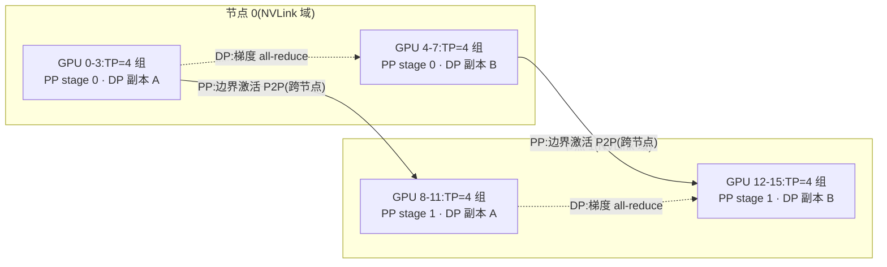

# 并行策略(DP / TP / PP / EP / SP)

> ⚠️ 旧版:本篇写于写作契约确立之前,尚未按新标准审查重写。标准见 docs/04-知识库写作契约.md,样板见「GPU架构与执行模型」。

一句话:**一张卡装不下模型、也算不动数据时,就把模型和数据沿不同维度切开分给多张卡**——DP 切数据、TP 切矩阵、PP 切层、EP 切专家、SP/CP 切序列,五种并行是五个正交的切法,可自由叠加。

类比:一家工厂订单多到做不完(数据),核心机器又大到塞不进任何一间厂房(模型)。DP 是多开几家一模一样的分厂各接各的订单;TP 是把一台机器拆成几半、几个车间同桌协作;PP 是把生产线按工序切段、每间厂房负责几道;EP 是开专科门诊、订单送到对口科室;SP/CP 是把超长的原料带切成段分头处理。

## 一、全景:五个维度,一张表

| 策略 | 切什么 | 每卡持有 | 通信什么 | 通信频率 | 典型域 |
| --- | --- | --- | --- | --- | --- |
| DP 数据并行 | 数据 batch | 完整模型副本 | 梯度 all-reduce | 每 step 一次 | 可跨节点 |
| TP 张量并行 | 单层内的矩阵 | 每层权重的 1/t | 激活 all-reduce | 每层前向 2 次 + 反向 2 次 | **节点内**(NVLink) |
| PP 流水线并行 | 模型的层 | 连续几层(stage) | 边界激活,P2P 点对点 | 每个 micro-batch 过一次界 | 适合跨节点 |
| EP 专家并行 | MoE 的专家 | 一部分专家 | token 的 all-to-all ×2 | 每个 MoE 层 | 节点内/跨节点皆有,带宽敏感 |
| SP/CP 序列并行 | 序列(token 维) | 一段 token | all-gather / reduce-scatter 或环传 K/V | 每层 | SP 跟随 TP 域;CP 可跨节点 |

记忆钩子:按典型配置,通信压力大致 PP < DP < TP——所以带宽最好的地方(节点内 NVLink)留给 TP,带宽最差的链路(跨节点)走 PP,DP 夹在中间哪都能放。

## 二、DP:复制模型、切分数据

最朴素的并行:每卡一份完整模型,batch 均分,各卡独立前向反向,然后对梯度做一次 all-reduce 取平均——保证所有副本更新后仍然一模一样。

- 优点:实现最简单、扩吞吐立竿见影;通信每步只有一次、总量固定(约等于参数量),还能与反向计算重叠;
- 致命伤:**显存全冗余**——参数、梯度、优化器状态每卡都存全套,模型一旦超过单卡容量,DP 加多少卡都无济于事。

冗余怎么办?把这三大件切碎分摊到各卡、要用再临时凑齐,就是 ZeRO(本篇不展开,细节见 AI Infra 分类下的 ZeRO 一篇)。注意 ZeRO 本质仍是 DP:它切的是"存储",不是"计算"。

## 三、TP:切开单层的矩阵乘(Megatron 核心)

单层太大、或模型层数切完还装不下时,就把层内的矩阵乘本身切开,几张卡合力算一层。Megatron-LM 的精髓不在"能切",而在**怎么切通信最少**。

### MLP:先列切、再行切,只需一次 all-reduce

Transformer 的 MLP 是两个矩阵乘夹一个非线性:

$$
Y = \mathrm{GeLU}(XA), \qquad Z = YB
$$

把第一个权重 $A$ 按**列**切给两张卡:

$$
A = [A_1, A_2] \ \Rightarrow\ XA = [XA_1,\ XA_2] \ \Rightarrow\ Y = [\underbrace{\mathrm{GeLU}(XA_1)}_{Y_1},\ \underbrace{\mathrm{GeLU}(XA_2)}_{Y_2}]
$$

关键在 GeLU:列切时每卡拿到的 $XA_i$ 是完整的一个列块,GeLU 逐元素作用,**各算各的不用对账**。反过来若把 $A$ 按行切,则 $XA = X_1 A_1 + X_2 A_2$ 得先跨卡**求和**才能过 GeLU——非线性不满足"和的函数 = 函数的和",就得在非线性前多同步一次。这就是"先列切"的原因。

第二个权重 $B$ 顺势按**行**切:

$$
B = \begin{bmatrix} B_1 \\ B_2 \end{bmatrix} \ \Rightarrow\ Z = Y_1 B_1 + Y_2 B_2
$$

妙处:每卡手里的 $Y_i$ 恰好就是自己上一步的本地输出,直接乘自己的 $B_i$,最后把两份部分和做**一次 all-reduce** 得到 $Z$。整个 MLP 前向只此一次通信。

### 注意力:按头切

多头注意力天然可切:每卡分到几个头,Q/K/V 投影按列切(每卡只算自己那几个头),softmax 和加权求和都在头内完成、互不打扰,输出投影 $W_O$ 按行切,收尾同样只要一次 all-reduce。结构和 MLP 完全同构:列切进、行切出。

### 代价:通信频繁,不出节点

一个 Transformer 层 = 注意力块 + MLP 块,前向共 2 次 all-reduce;前向做恒等的位置反向要 all-reduce(反之亦然,一对共轭算子),所以反向再来 2 次。每次通信的都是 $b \times s \times h$ 量级的激活,几十层的模型每步累计几百次 all-reduce,而且全卡在关键路径上——算完这步才能算下一步,藏都藏不住。

由此得出经验法则:**TP 不出节点**(通常 $t \le 8$),只在 NVLink 互联的节点内做;跨节点的带宽会被这种高频通信活活拖死。类比:TP 是几个人同桌合解一道大题,每写两步就要对一次答案——必须坐同一张桌子,隔着走廊喊没法干活。

## 四、PP:按层切段,流水线作业

把模型按层切成 $p$ 段(stage),每段放一组卡,数据像流水线一样依次流过。段间只在边界传一次激活($b \times s \times h$,P2P 点对点),通信量比 TP 小得多——**适合跨节点**。

### bubble:流水线的空转

朴素做法是整个 batch 在 stage 0 算完才进 stage 1:任意时刻只有一段在干活,其余全在围观。解法是把 batch 切成 $m$ 个 **micro-batch** 依次注入,让各段尽快都有活干。但开头灌满、结尾排空的空转(bubble)无法全消,以"拍"计:

$$
\text{bubble 占比} \approx \frac{p - 1}{m + p - 1}
$$

直觉:流水线要 $p-1$ 拍才灌满,干完全部活共 $m + p - 1$ 拍,空转就是那 $p-1$ 拍。想压 bubble 就加大 $m$(经验值 $m \gtrsim 4p$),但 micro-batch 切太碎又打不满单卡算力——一对典型权衡。

### 调度:GPipe → 1F1B → interleaved 1F1B

- **GPipe**:所有 micro-batch 前向全做完,再统一做反向。简单,但峰值要同时攒 $m$ 份激活,显存随 $m$ 线性涨;
- **1F1B**(PipeDream 系,Megatron 默认):流水线灌满后,每卡"做一个前向、就还一个反向"交替进行,反向尽早释放激活——bubble 占比与 GPipe 相同,但峰值激活从 $m$ 份降到至多 $p$ 份;
- **interleaved 1F1B**(Megatron-2):每卡不再拿连续一段,而是拿 $v$ 段打散的"虚拟 stage"(如卡 1 拿第 1–4 层和第 9–12 层),bubble 缩小到原来的 $1/v$,代价是 P2P 通信量翻 $v$ 倍——拿便宜的通信换昂贵的空转。

类比:bubble 是餐厅刚开门时只有头道工位在忙、后面工位干等;micro-batch 是把大桌订单拆成小份连续上菜;interleaved 是每个厨师身兼两道打散的工序,空窗被切得更碎、更好填。

## 五、SP 与 CP:沿序列切

### SP(Megatron 版):TP 域内的免费显存优化

TP 只切了矩阵乘,层里的 LayerNorm、Dropout 没切——这些区域的激活在 TP 组内**每卡一份全量**($b \times s \times h$),是纯冗余。SP 的观察:这些操作在序列维上逐 token 独立,那就把这段激活按序列切成 $t$ 份,分给 TP 组内各卡(不需要新卡,复用 TP 组)。

通信恰好一分不涨:一次 all-reduce 在实现上本就等于 reduce-scatter + all-gather 两步,SP 把这两步拆开放到 TP 区域的两侧——进矩阵乘前 all-gather 沿序列凑齐,出来后 reduce-scatter 切回去,总量与纯 TP 持平。再搭配 **selective activation recompute**:只重算注意力里那些"显存占用 $O(s^2)$、重算却便宜"的中间量(softmax、dropout mask 等),大头矩阵乘输出照存不误。两招合力,激活显存砍数倍,重算开销只有百分之几。

### CP:超长序列的攻坚(Ring Attention 思路)

序列长到几十万 token,单卡连一段激活都放不下时,就把**整条序列**切给多张卡,注意力计算本身也分布式化(context parallel)——这是与 SP 的本质区别:SP 只切 LN/Dropout 区域的激活存储,CP 连注意力的计算都切。麻烦在于每个 token 要看全序列的 K/V:Ring Attention 让各卡把自己的 K/V 块沿环逐跳传递,本地用分块在线 softmax(flash-attention 式)边收边算,通信与计算重叠,序列长度理论上随卡数近乎无限扩展。工程细节:causal mask 下持有序列开头的卡活最少,要用 zigzag 式交错切分做负载均衡。

## 六、EP:MoE 的专家分家

MoE 层专家总参数巨大、但每个 token 只激活 top-k 个——把专家分摊到不同卡上(每卡常驻几位专家),就是专家并行。代价是每个 MoE 层**两次 all-to-all**:

1. **dispatch(分发)**:router 决定每个 token 去哪几位专家后,把 token 打包寄往专家所在的卡;
2. **combine(收回)**:各专家算完,把结果寄回 token 老家,按门控权重加权求和。

反向传播再来两次。all-to-all 是"人人给人人寄包裹"的通信模式,对带宽和延迟都敏感,专家越多、跨节点越远越痛;负载不均(热门专家挤爆、冷门专家闲置)会进一步放大延迟。缓解手段:限制每个 token 最多路由到 M 个节点(DeepSeek 的 node-limited routing)、通信与计算重叠;而把 token 先压到低维再寄、直接缩小包裹体积,正是 LatentMoE 一类设计的系统动机(见 预训练 分类下的 MoE路由 一篇)。

与 TP 的组合微妙:两者抢的都是节点内带宽,单个专家又通常不大、犯不着再 TP 切,所以工程上常"注意力部分用 TP、MoE 层换用 EP"分域处理,EP 的 rank 一般复用 DP 维凑出来。类比:EP 是医院分诊——挂号台(router)把病人(token)派往各楼专科,看完再送回原病房汇总,两次 all-to-all 就是送去、接回的两趟班车。

## 七、组合:3D/4D 并行怎么摆

原则一句话:**通信越密的并行,放在带宽越好的域**。

- 节点内(NVLink):TP + SP(高频激活 all-reduce);
- 跨节点:PP(只传边界激活)+ DP(每步一次梯度同步);
- MoE 模型再加 EP,凑成 4D;
- DP 维上叠 **ZeRO-1** 切优化器状态:TP/PP 已把参数和梯度切小,ZeRO 只拿最重的优化器状态开刀就够——为什么不上 ZeRO-3,见 ZeRO 一篇的"与其他并行的关系"。

一个 2 节点 × 8 卡、TP=4 / PP=2 / DP=2 的最小示意:

读图:每个方框内部是 4 卡 TP 组,高频 all-reduce 全走 NVLink;两节点各持模型的一半层,PP 只在层边界跨节点传一次激活;同 stage 的两个 DP 副本每步同步一次梯度。16 卡 = 4(TP)× 2(PP)× 2(DP)。

## 八、选型经验法则

从一张卡出发的升级决策链:

1. **模型装不下单卡** → 先 TP,在节点内扩(t = 2/4/8),最多扩到 NVLink 域满(通常 8 卡);
2. **TP 到顶还装不下** → 上 PP 跨节点切层;micro-batch 数拉到 $4p$ 以上压 bubble,用 1F1B / interleaved 调度;
3. **装下了,要吞吐** → 用 DP 横向复制扩机器,DP 维配 ZeRO-1 顺手把优化器状态切了;
4. **MoE 模型** → 加 EP 分专家,盯紧 all-to-all 带宽与专家负载均衡;
5. **长序列 / 激活爆显存** → 先开 SP + selective recompute(几乎免费),再不够上 CP;
6. 心法:PP 通信最省但有 bubble,TP 无 bubble 但通信最重——**带宽好用 TP,带宽差用 PP**,DP 永远是最后扩吞吐的那一维。

## 九、面试考点串联

1. MLP 为什么"先列切后行切"、为何只需一次 all-reduce → GeLU 挡住了求和,列切让非线性前不用同步 →「TP」
2. 一层 Transformer 前向/反向各几次 all-reduce、通信的是什么 → 各 2 次,传 $b \times s \times h$ 的激活 →「TP:代价」
3. TP 为什么不出节点 → 每层多次激活 all-reduce 卡在关键路径,只有 NVLink 扛得住 →「TP:代价」
4. bubble 占比公式、怎么压 → $(p-1)/(m+p-1)$;加 micro-batch、interleaved 1F1B →「PP」
5. 1F1B 相比 GPipe 改善了什么 → bubble 相同,峰值激活从 $m$ 份降到 $p$ 份 →「PP:调度」
6. SP 为什么不增加通信量 → all-reduce ≡ reduce-scatter + all-gather,拆成两半放两侧 →「SP」
7. EP 的两次 all-to-all 在哪、为何常成瓶颈 → dispatch/combine;人人寄包裹 + 负载不均 →「EP」
8. 给定 2 节点 16 卡怎么摆 3D 并行、ZeRO 放哪一维 → 节点内 TP+SP、跨节点 PP+DP、DP 维 ZeRO-1 →「组合」

## 相关文献

- Megatron-LM(TP:列切/行切与按头切分)— [arXiv:1909.08053](https://arxiv.org/abs/1909.08053)
- Efficient Large-Scale Language Model Training on GPU Clusters(3D 并行布局 + interleaved 1F1B)— [arXiv:2104.04473](https://arxiv.org/abs/2104.04473)
- Reducing Activation Recomputation in Large Transformer Models(Megatron SP + selective recompute)— [arXiv:2205.05198](https://arxiv.org/abs/2205.05198)
- GPipe(micro-batch 流水线开山之作)— [arXiv:1811.06965](https://arxiv.org/abs/1811.06965)
- Ring Attention(环传 K/V 的超长序列 context parallel)— [arXiv:2310.01889](https://arxiv.org/abs/2310.01889)
- ZeRO(DP 显存冗余的切分方案)— [arXiv:1910.02054](https://arxiv.org/abs/1910.02054)
