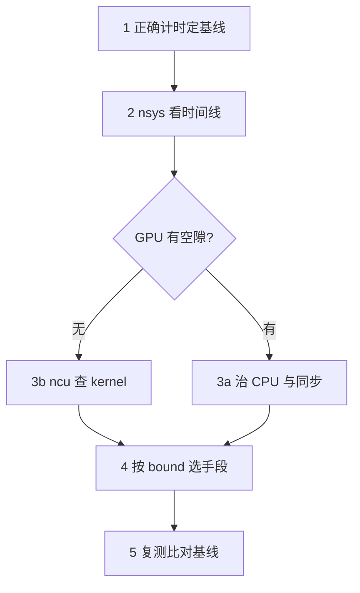

# 性能分析与 Profiling

> 🔴 重点考点:本篇是当前复习重点,文末「面试考点串联」给出问法对照。

一句话:性能优化的第一步永远不是"改代码",而是**用工具把时间花在哪儿量出来**——这篇讲三件工具(Nsight Systems / Nsight Compute / torch.profiler)各看哪一层、trace 怎么读、指标怎么解释,以及怎么把时间测准(这一步错了,后面全是幻觉)。

## 一、为什么必须"先量后调"

一个模型跑得慢,可能的原因分布在完全不同的层级:数据加载没跟上、Python 侧调度太慢、某个 kernel 写得差、多卡通信没和计算重叠。这四类的**修法完全不同、收益差几十倍**,凭直觉猜中的概率很低。

更要命的是,人对性能的直觉几乎总是错的。最常见的翻车是这样:工程师花两周手写了一个更快的 attention kernel,上线后端到端只快了 2%——因为这个模型 60% 的时间根本不在 GPU 上,而是卡在 dataloader。

所以先记住一个数,它是读任何 trace 的第一个动作:

$$
\text{GPU 有效时间占比} = \frac{\sum_i \text{kernel}_i \text{ 的执行时长}}{\text{一个 step 的墙钟时长}}
$$

这个比值的意思是:**一个 step 里,GPU 真正在算东西的时间有多少**。如果它只有 0.5,说明有一半时间 GPU 在发呆,这时候再去优化 kernel,理论上限也只是把那 0.5 变小,端到端最多快一点点。必须先把发呆的那一半填上。

## 二、标准流程:测 → 定位层级 → 判 bound → 选手段 → 复测

面试问"怎么对模型做性能优化、一般从哪些方面",答这五步就是满分,重点在**第二步的分层**:



**第一步:定基线。** 固定输入形状、固定随机种子、锁定环境(别一边跑 profiling 一边有别人共用这张卡),按第六节的方法测出一个可复现的数字。没有基线就没有"变快了"这回事。

**第二步:定位瓶颈在哪一层。** 这是全流程最值钱的一步,按这个顺序排除:

| 层级 | 典型信号 | 常见成因 |
|---|---|---|
| 数据 | GPU 时间线整段空白,CPU 上是 dataloader 线程 | worker 太少、没 pin_memory、预处理太重 |
| CPU / 框架侧 | GPU 空隙密集且规律,CPU 一直在忙 | Python 开销大、小算子太多、launch 跟不上 |
| 同步 | 空隙前有一条长长的 `cudaStreamSynchronize` | 代码里有 `.item()` / `.cpu()` / `print(tensor)` |
| kernel | GPU 几乎没空隙,但单个 kernel 就是久 | 算子实现差、访存模式差、精度没用对 |
| 通信 | NCCL kernel 和计算 kernel 首尾相接不重叠 | 并行策略选错、没开 overlap、带宽打不满 |

**第三步:判 bound 类型。** 只有确认瓶颈落在 kernel 层,才轮到问"这个 kernel 是计算受限还是访存受限"。定量判据(算术强度、roofline 拐点、利用率公式)见「Roofline与Bound分析」篇。

**第四步:按 bound 选手段。** 访存受限就减少访存(融合、tiling、量化),计算受限就提高算力利用(Tensor Core、更好的分块);具体手段见「访存与算子优化」「算子融合」篇。

**第五步:复测。** 用完全相同的基线方法再测一次。**没复测的优化等于没做**——真实项目里"优化"让性能变慢的比例高得惊人。

## 三、三件工具的分工(面试直答)

这是本篇最该背下来的一张表。三者不是竞品,是**望远镜、显微镜、体温计**的关系:

| | **Nsight Systems**(nsys) | **Nsight Compute**(ncu) | **torch.profiler** |
|---|---|---|---|
| 看哪一层 | 整条时间线:CPU 线程、CUDA 流、kernel、内存拷贝、NCCL | **单个 kernel 内部**的硬件计数器 | 框架算子(op)层 |
| 回答什么问题 | 时间去哪了?谁在等谁? | 这个 kernel 为什么慢? | 哪个算子 / 哪行 Python 最贵? |
| 关键产出 | gap、CPU-GPU 重叠、launch 间隙、通信与计算是否并行 | SM 吞吐、DRAM 吞吐、occupancy、warp stall、L1/L2 命中率 | 算子耗时排行、CPU 时间 vs CUDA 时间、chrome trace |
| 采集开销 | 低(采样 + API 拦截),可跑真实训练 | **很高**(同一 kernel 重放多次凑计数器),只能挑单个 kernel | 中(每个 op 打点),会放大 CPU 侧开销 |
| 能归因到 Python 吗 | 要手工打 NVTX 标记 | 不能 | **原生支持**(`with_stack=True`) |
| 什么时候用 | **第一步,永远先跑它** | 已经知道某个 kernel 是热点之后 | 想知道"是哪个算子",而不是"是哪个 kernel" |

一句话概括三者区别:**nsys 看"时间去哪了",ncu 看"这一刀为什么钝",torch.profiler 看"这笔账记在哪个算子头上"**。

补一条常被忽略的联系:torch.profiler 和 nsys 的时间线其实来自同一套底层(CUPTI),但 torch.profiler 多了框架语义(知道这个 kernel 属于 `aten::mm`,属于哪一行 Python),而 nsys 多了系统语义(知道 CPU 线程在干什么、NCCL 在什么时候动)。**训练卡在框架里就用 torch.profiler,卡在系统里就用 nsys。**

## 四、Nsight Systems:trace 上具体找什么

采集通常就一行,只录你关心的那几步(用 `--capture-range` 配合代码里的 `torch.cuda.profiler.start()/stop()` 可以精确框住第 N 个 step,避免报告几百 MB):

```bash
nsys profile -t cuda,nvtx,osrt,cublas,nccl -o report python train.py
```

打开报告后,盯着 GPU 那几行,找这四类信号:

1. **大段空白(gap)**:GPU 行整段没有 kernel。往上看同一时刻 CPU 在干嘛——如果 CPU 在 dataloader 里,那是数据瓶颈;如果 CPU 在 Python 里跑一堆逻辑,那是框架开销。**GPU 空闲是所有信号里优先级最高的**,因为它意味着你的卡在白烧钱。
2. **密密麻麻的短 kernel**:一串宽度只有几微秒的小方块,而且**方块之间的缝隙和方块本身差不多宽**。这就是 launch bound:每次启动一个 kernel,CPU 侧要付个位数微秒量级的固定开销,kernel 本身只跑 3 μs 的话,一半时间花在了"启动"上。对策见「CudaGraph」篇。
3. **同步点**:CUDA API 行上出现很长的 `cudaStreamSynchronize` / `cudaMemcpy`(同步版)。同步点的危害是双重的:CPU 停下来等 GPU,**而且下发队列被抽干**,GPU 干完后要等 CPU 重新喂,形成一个"排空—重灌"的气泡。stream 与同步的机制见「CUDA流与异步执行」篇。
4. **通信没重叠**:NCCL 的 AllReduce kernel 和计算 kernel 在时间线上**首尾相接排成一条**,而不是分处两行并排。理想情况下反向传播算后面几层的梯度时,前面几层的梯度已经在通信了。

> **一个必须知道的坑**:`nvidia-smi` 里的 "GPU-Util" **不是利用率**。它只统计"采样窗口内有 kernel 在执行的时间比例"——哪怕这个 kernel 只用了 1 个 SM、带宽只跑了 2%,它照样显示 100%。看到 100% 就以为卡满了,是最常见的误判之一。真正的利用率要看 ncu 的 SM / DRAM Throughput。

## 五、Nsight Compute:单 kernel 的体检报告

确认某个 kernel 是热点后,用 `ncu --set full -k <kernel名> -c 3 python bench.py` 只抓它的几次执行(ncu 会把 kernel 重放多次来凑齐所有计数器,所以千万别对整个训练开)。

看的是这几个数:

| 指标 | 含义 | 怎么读 |
|---|---|---|
| **Compute (SM) Throughput** | SM 各条流水线占峰值的百分比 | 高(> 70%)而 DRAM 低 → 计算受限 |
| **Memory (DRAM) Throughput** | 显存带宽占峰值的百分比 | 高而 SM 低 → 访存受限 |
| 两者**都低**(< 30%) | 既没算满也没搬满 | **延迟受限**:并行度不够、依赖链太长、grid 太小铺不满 SM |
| **Achieved Occupancy** | 实际驻留 warp / 硬件上限 | 访存受限时低 → 该提并行度;计算受限时低**未必是问题** |
| **L1 / L2 Hit Rate** | 缓存命中率 | 低 → 访问模式差,考虑合并访存、tiling、改数据布局 |
| **Grid / Block Size + Duration** | 网格形状与耗时 | block 数远小于 SM 数 → 大量 SM 闲置(tail effect) |

### warp stall reasons:kernel 里的 warp 在等什么

occupancy 告诉你"有多少 warp 在场",stall reason 告诉你"在场的 warp 为什么不干活"。旧工具(nvprof)的叫法和 Nsight Compute 的新名字要对得上:

| Nsight Compute 名称 | 旧名 / 通俗说法 | 含义与对策 |
|---|---|---|
| **Stall Long Scoreboard** | **memory dependency** | 等全局内存返回(几百周期)。合并访存、tiling 复用、提高 occupancy 来掩盖 |
| Stall Short Scoreboard | 等 shared memory / MIO | 常见于 bank conflict,改 padding 或换布局 |
| **Stall Wait** | **execution dependency** | 前一条定长延迟指令还没出结果,**指令级并行不足**。循环展开、增加每线程的独立计算 |
| Stall Barrier | 等 `__syncthreads()` | block 内负载不均,或同步太频繁 |
| Stall MIO / LG Throttle | 发射队列被访存指令塞满 | 访存指令太密,用向量化访问(如一次读 `float4`)减少指令条数 |
| Stall Not Selected | 有别的 warp 抢先发射了 | **这通常是好事**,说明并行度足够,调度器不缺活干 |

记忆抓手:**Long Scoreboard 高 = 在等数据(访存问题);Wait 高 = 在等上一条指令(ILP 问题);Not Selected 高 = 没问题。**

## 六、torch.profiler:按算子归因

框架层的账本。核心是 `schedule` —— 它天然帮你跳过预热步:

```python
from torch.profiler import profile, schedule, ProfilerActivity, tensorboard_trace_handler

with profile(
    activities=[ProfilerActivity.CPU, ProfilerActivity.CUDA],
    schedule=schedule(wait=1, warmup=1, active=3, repeat=1),  # 跳过前 2 步,只录 3 步
    on_trace_ready=tensorboard_trace_handler("./tb"),         # 或 p.export_chrome_trace("t.json")
    record_shapes=True, with_stack=True,                      # 记形状 + 记 Python 调用栈
) as p:
    for batch in loader:
        train_step(batch)
        p.step()          # 必须调用,否则 schedule 不推进
```

读法上有三个要点:

- **`self_cuda_time` 和 `cuda_time` 别搞混**:self 不含子算子。排热点用 `sort_by="self_cuda_time_total"`,看归属用总时间——否则最顶层的那个模块永远排第一,毫无信息量。
- **CPU 总时间远大于 CUDA 总时间 = CPU 侧瓶颈**。这条对应 nsys 里的"GPU 有空隙",但 torch.profiler 能直接告诉你是哪个算子的 Python 侧太慢。
- **调用次数(# of Calls)极大、单次耗时极小的算子**,是小算子太多的铁证,指向算子融合或 CUDA Graph。

导出的 chrome trace 是标准 JSON,拖进 `ui.perfetto.dev` 就能看,和 nsys 的时间线视角一致,只是多了算子名这一层。

## 七、正确计时:大多数"性能结论"错在这一步

CUDA 是异步的:Python 里调用一个算子,只是把 kernel 丢进流里就立刻返回了。**不同步就计时,量到的是"下发"的时间,不是"执行"的时间**,两者能差两三个数量级。

```python
import statistics, torch

def bench(fn, warmup=20, iters=50):
    for _ in range(warmup):          # 预热:让 cuBLAS 选完算法、分配器建好池、时钟爬到 boost
        fn()
    torch.cuda.synchronize()         # 等预热真正跑完,再开始计时

    lat = []
    for _ in range(iters):
        s = torch.cuda.Event(enable_timing=True)
        e = torch.cuda.Event(enable_timing=True)
        s.record(); fn(); e.record()
        torch.cuda.synchronize()     # 事件时间戳要等 GPU 执行到那里才有效
        lat.append(s.elapsed_time(e))    # 单位是毫秒
    return statistics.median(lat)        # 取中位数,躲开偶发抖动
```

两种计时方式的分工:**CUDA event 量的是 GPU 时间线上的耗时**(精度高、不受 CPU 抖动影响);**墙钟 + `torch.cuda.synchronize()` 量的是端到端**(把 CPU 侧开销也算进去)。测单个算子用前者,测训练吞吐用后者——包住整个循环,循环结束后同步一次即可,不要每步都同步(那会人为制造气泡,反而测不准真实吞吐)。

### 六个"看起来快其实慢"

1. **没同步就计时**:`time.time()` 夹一个 forward,测出来几十微秒,以为快得离谱——其实只测到了 kernel 入队。
2. **没 warmup**:第一次调用要付 cuBLAS/cuDNN 选算法、CUDA 模块懒加载、caching allocator 首次 `cudaMalloc`、`torch.compile` 编译的钱;而且 GPU 空闲时降频,前几次还在爬时钟。这些钱只付一次,却全算进了你的测量。
3. **只看 kernel 时间,不看 launch 开销**:ncu 说这个 kernel 只要 3 μs,很棒;但一个 step 有 5000 个这样的小 kernel,启动开销就吃掉一半时间。**判断标准不是 kernel 快不快,而是时间线上的占空比**。
4. **拿 `nvidia-smi` 的 GPU-Util 当利用率**:见第四节的坑,只用一个 SM 也能显示 100%。
5. **只测一次,或者取平均值**:DVFS 降频、别的进程抢卡、page fault 都会造成长尾。取**中位数**,再顺手看一眼 p90;如果波动很大,先排查环境而不是改代码。
6. **微基准跑出漂亮数字**:单算子反复跑,输入一直躺在 L2 里、形状固定不变;放回真实模型后数据在 HBM、形状每步都变,收益立刻缩水。**优化必须在端到端场景复测。**

## 八、面试考点串联

| 高频问法 | 本文哪一节 |
| --- | --- |
| nsight 工具是什么?能用来干什么? | 三、四、五 |
| Nsight Systems 和 Nsight Compute 有什么区别? | 三(分工表:时间线级 vs 单 kernel 级) |
| nsight 和 torch.profiler 的区别? | 三(系统语义 vs 框架语义) |
| 怎么对模型做性能优化?一般从哪些方面入手? | 二(五步流程 + 分层排查表) |
| trace 怎么看?具体看什么? | 四(gap / 小 kernel / 同步点 / 通信重叠) |
| GPU 利用率很高但训练还是慢,怎么查? | 四 + 七(GPU-Util 的坑) |
| 怎么判断 kernel 是访存受限还是计算受限? | 五(SM vs DRAM Throughput);定量判据见 Roofline与Bound分析 篇 |
| achieved occupancy 低是不是一定有问题? | 五(计算受限时未必) |
| warp stall 有哪些原因,怎么对症? | 五(Long Scoreboard = 等数据,Wait = 等指令) |
| 怎么正确给 GPU 代码计时?为什么要 warmup? | 六、七 |
| 小算子太多导致 launch 开销大怎么办? | 二、四;机制见 CudaGraph 篇 |
| 定位到访存瓶颈之后,具体怎么优化? | 访存与算子优化、算子融合 篇 |
| 当生产环境中某服务的CPU使用率突然飙升至接近100%时，请系统性地描述你的排查思路，包括常用工具（如top、htop、vmstat、perf、strace、pidstat等）的应用场景与使用方法，可能的根本原因分析流程，以及如何定位是用户态还是内核态问题、是否由特定线程或系统调用引起，并说明进一步优化或根因解决的方向。 | 二（分层排查）+ 四（时间线） |

延伸阅读顺序:GPU架构与执行模型(硬件底座)→ 本篇(怎么量)→ Roofline与Bound分析(怎么判)→ 访存与算子优化 / 算子融合 / CudaGraph(怎么改)。

## 相关文献

- NVIDIA Nsight Systems User Guide — https://docs.nvidia.com/nsight-systems/UserGuide/index.html
- NVIDIA Nsight Compute Profiling Guide(含 Warp Scheduler States 与全部指标定义)— https://docs.nvidia.com/nsight-compute/ProfilingGuide/index.html
- PyTorch `torch.profiler` API 文档 — https://docs.pytorch.org/docs/stable/profiler.html
- PyTorch Profiler Recipe(schedule、chrome trace、显存分析的完整示例)— https://docs.pytorch.org/tutorials/recipes/recipes/profiler_recipe.html
- Perfetto UI(打开 chrome trace 的在线查看器)— https://ui.perfetto.dev/
