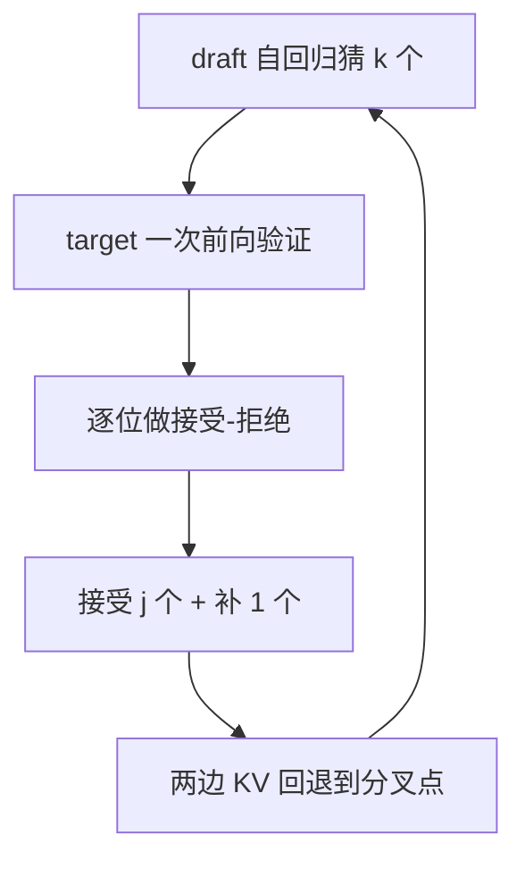

# 投机解码

> 🔴 重点考点:本篇是当前复习重点,文末「面试考点串联」给出问法对照。

一句话:让一个便宜的小模型先把后面几个 token **猜出来**,大模型用**一次前向**把这几个一起验证掉——decode 本来就是"搬权重的时间远大于算数的时间",一次算 1 个和一次算 k 个几乎同价,这份白捡的算力就用来砍串行步数。

## 一、为什么"顺手多算几个 token"几乎不要钱

decode 阶段每生成 1 个 token,都要把**整个模型的权重从显存读一遍**。以 7B 模型 fp16 为例:

- 搬权重:14 GB ÷ 约 2 TB/s(A100 HBM 带宽)≈ **7 ms**
- 做计算:1 个 token 约 $2 \times 7\text{B} = 14$ GFLOPs ÷ 312 TFLOPS ≈ **0.045 ms**

差了 150 倍。也就是说这一步里 GPU 有 99% 以上的时间在**等数据**,算力纯闲置(为什么会这样、怎么定量判断,见 Roofline与Bound分析 篇)。

那么把输入从 1 个 token 变成 8 个 token 呢?权重还是只搬那一遍(7 ms 不变),计算变成 0.36 ms——总耗时从 7.045 ms 变成 7.36 ms,**只贵了约 4%,却把 8 个位置全算完了**。

> **类比**:去仓库取一套工具要走 20 分钟,取回来拧一颗螺丝只要 5 秒。既然都跑这一趟了,一次拧 8 颗显然比跑 8 趟划算。投机解码干的就是"凑够一批螺丝再跑一趟"。

问题在于:decode 是自回归的,第 2 个 token 依赖第 1 个,你根本不知道后面 7 个是什么。**投机解码的解法是先猜**——猜错了大不了作废重来,反正验证这一步本来就是免费的。

注意 D 这一步的"补 1 个":哪怕 draft 一个都没猜中,target 的验证前向本身也会在第一个位置给出它自己的预测,**这一轮保底产出 1 个 token**,不会比不用投机更慢(除掉 draft 的开销)。全中的话则是 $k+1$ 个——多出来的那个是白送的。

## 二、正确性保证:为什么输出分布一分不差

这是投机解码和量化、剪枝的本质区别:**它不是近似,是严格无损**。靠的是一套改造过的拒绝采样(推测采样,speculative sampling)。

记某个位置上 target 模型的分布为 $p(x)$、draft 的分布为 $q(x)$,draft 从 $q$ 里采出了 token $x$。规则两条:

$$
\text{以概率}\ \min\left(1,\ \frac{p(x)}{q(x)}\right)\ \text{接受}\ x
$$

人话:**draft 高估了就打折,没高估就照单全收**。如果 target 认为这个词的概率比 draft 还高($p \ge q$),说明 draft 保守了,直接接受;如果 draft 把这个词吹过了头($q > p$),就按比例随机丢弃一部分——丢弃的比例恰好等于它吹过头的那一部分。

拒绝之后不能随便重采,否则分布会歪。必须从**残差分布**里采:

$$
p'(x) = \frac{\max\bigl(0,\ p(x) - q(x)\bigr)}{\sum_{x'} \max\bigl(0,\ p(x') - q(x')\bigr)}
$$

人话:**把"target 想要、但 draft 给得不够"的那部分概率质量单独拿出来归一化,再从里面采一个**。draft 已经帮 target 兑现的部分($\min(p,q)$)在接受路径里给了,剩下的窟窿由这里补上,两条路径加起来正好还原成 $p(x)$——这就是无损的来源,一行验算即可:$\min(p,q) + (\text{拒绝概率}) \times p' = p$。

三个容易被追问的点:

- **greedy(温度 0)是特例**:$p$、$q$ 都退化成 one-hot,规则等价于"逐位比对,第一个不同的位置截断",结果与逐 token greedy 完全一致
- **温度 / top-p / 惩罚必须两边一致地施加**:验证时用的 $p$ 必须是**采样后处理之后**的分布,否则"无损"保证的是另一个分布
- **不是所有变体都无损**:Medusa 常用的"典型接受"(typical acceptance)放宽了判据以换接受率,严格说改了分布;EAGLE、经典投机解码、MTP 自投机则是无损的

## 三、看哪个指标就知道 draft 好不好

**核心指标是接受率 $\alpha$(单个草稿 token 被接受的概率)与它推导出的平均接受长度 $\tau$**。设各位置接受近似独立,草稿长度为 $k$:

$$
\tau = \mathbb{E}[\text{每轮产出 token 数}] = 1 + \alpha + \alpha^2 + \cdots + \alpha^{k} = \frac{1 - \alpha^{k+1}}{1 - \alpha}
$$

人话:**一轮里能连中几个**。第 $i$ 个草稿要被接受,前面 $i-1$ 个必须都中,所以是等比数列;最前面那个 1 就是上一节说的"保底产出"。注意 $\tau$ 有上限——$\alpha$ 再高也超不过 $k+1$,所以 $k$ 开太大边际收益递减。

但 $\tau$ 只是分子。真正的加速比还要扣掉 draft 自己跑 $k$ 步的时间:

$$
\text{Speedup} \approx \frac{\tau}{1 + c},\qquad c = \frac{k \cdot T_{\text{draft}}}{T_{\text{target}}}
$$

人话:**平均接受长度 ÷(1 + draft 开销比)**。$c$ 是"draft 连跑 k 步"相对"target 跑一次前向"的耗时占比;两边都是访存受限,所以 $T_{\text{draft}}/T_{\text{target}}$ 大致就是**两个模型的权重体积比**。

代入看就很直观($k=4$,draft 是 target 的 1/10 大 → $c = 4 \times 0.1 = 0.4$):

| $\alpha$ | $\tau$($k$=4) | 加速比($c$=0.4) | 加速比($c$=1.33,draft 换成 1/3 大) |
|---|---|---|---|
| 0.5 | 1.94 | 1.39x | 0.83x(**反而变慢**) |
| 0.6 | 2.31 | 1.65x | 0.99x |
| 0.7 | 2.77 | 1.98x | 1.19x |
| 0.8 | 3.36 | 2.40x | 1.44x |
| 0.9 | 4.10 | 2.93x | 1.76x |

三条结论:

1. **不能只看接受率**。换个更大的 draft 通常能把 $\alpha$ 提上去,但 $c$ 涨得更快——上表右列即使 $\alpha$ 打到 0.9,也只有 1.76x,不如左列 $\alpha$=0.7 的表现
2. **盈亏平衡线是 $\tau > 1 + c$**。draft 越大,对接受率的要求越苛刻;经验上 draft 控制在 target 的 1/10 ~ 1/20 量级
3. **线上真正要盯的是每轮墙钟时间和实测 $\tau$**,而不是纸面 $\alpha$——$\tau$ 会随任务漂移(代码、模板化输出好猜,创意写作难猜)

## 四、KV cache:两边独立,靠"回退指针"处理拒绝

### 共享吗?不共享

draft 和 target 是**两个独立的模型**:层数、KV 头数、head_dim 全都不一样,KV 张量的形状根本对不上,更不用说语义(每层的 K/V 是各自模型学出来的表示)。所以**两边各自维护一套 KV cache**,只有 token 序列是共享的。

MTP / EAGLE / Medusa 这类"寄生在 target 上"的方案略有不同:它们复用 target 的隐藏状态,但 draft 头自己那部分(如 EAGLE 的 draft 层)仍有独立的小 cache。

### 猜错的 token,两边分别怎么处理

关键认知:**KV cache 是"追加写"的,每个位置写完就不再改**。所以"撤销"根本不需要真的擦除数据,只要**把序列长度指针往回移**——下一轮写新 token 时会直接覆盖掉那片区域。这是回滚几乎零成本的根本原因。

具体到一轮:

| | 验证前写到哪 | 接受 $j$ 个之后 | 怎么回滚 |
|---|---|---|---|
| **target** | 一次前向把 $k+1$ 个位置的 K/V 全写进去了 | 只有前 $j+1$ 个有效 | 长度指针置为 $\text{base}+j+1$,后面那几个位置的 K/V 变成"待覆盖的垃圾",不用清 |
| **draft** | 自回归 $k$ 步,写了 $k$ 个位置 | 只有到分叉点为止有效 | 指针退回分叉点;target 补出的那个新 token 还没进过 draft,**下一轮 draft 的第一次前向把它喂进去**,顺带补上它的 KV |

> **类比**:草稿纸上写了 5 行,老师只批到第 2 行就打叉。你不用把 3–5 行擦掉,只要把笔尖挪回第 3 行开头——下次写字自然盖过去。

两个工程细节:

- **分页管理下**(PagedAttention / vLLM 风格):回滚就是把块内偏移减回去;只有当一整个块都空出来时才归还给分配器,通常一轮回退几个 token 连一个块都退不满,所以**基本不触发块的分配释放**(块管理见 KVCache 与 PagedAttention 篇)
- **树形草稿**(Medusa / EAGLE-2 的多分支候选):一次验证多条路径,验证后只保留被接受的那条链,其余分支写进去的 K/V 全部作废——同样是移指针,但需要配合树注意力的 mask,复杂度主要在 mask 而不在 cache

## 五、draft 的 KV cache 要不要量化?

**结论:通常不量化。这是一道"收益极小、代价极大"的题。**

**收益侧算一下**。每 token 的 KV 字节数 $= 2 \times \text{层数} \times \text{KV 头数} \times \text{head\_dim} \times \text{dtype 字节}$。draft 之所以小,恰恰是层数和 KV 头数都被砍过——它每 token 的 KV 通常只有 target 的 1/5 ~ 1/10。在总显存里,draft 的 KV 本来就是个零头,fp16 换 int8 也只是"零头的一半",对能开多大 batch、能撑多长上下文几乎没影响。

**代价侧则是被放大的**。draft 量化 → 注意力读到的历史信息失真 → 猜得更不准 → **接受率下降**。而接受率下降在加速比里是**指数级传导**的:$\tau = (1-\alpha^{k+1})/(1-\alpha)$。上表里 $\alpha$ 从 0.8 掉到 0.7,加速比就从 2.40x 掉到 1.98x,**掉了 18%**;而省下的显存可能连总量的 1% 都不到。

而且 draft 本来就已经是被压缩过的模型,精度余量比 target 小得多,同样的量化误差对它的伤害更大。

**注意别和 target 侧混为一谈**:target 的 KV cache 才是显存大头(长上下文时能占到几十 GB),对它做 fp8/int8 量化收益巨大,而且它只负责"验证"、不负责"猜",精度损失反映为输出质量而非接受率——那是另一个话题,见 KVCache量化 篇。

## 六、验证时的 d2h 同步:怎么不让它打断流水线

### 问题长什么样

朴素实现是这样的:验证 kernel 算完 → `cudaMemcpy` 把"接受了几个"拷回 host → CPU 用 `if` 判断 → 组装下一轮的输入张量 → 再发 kernel。

这个拷贝是**设备到主机(d2h)的同步点**:CPU 必须停下来等 GPU 把这一轮全部算完,GPU 队列随即被抽干,下一批 kernel 还没提交。结果是每轮都在 timeline 上留一个 gap——量级是几十到几百微秒,而 decode 一步总共才几毫秒到十几毫秒,**几轮下来就吃掉大半加速比**(同步点的危害与消除手段,见 CUDA流与异步执行 篇)。

### 解法:让"接受了几个"这件事 host 永远不需要知道

核心思路是**把验证和采样整条链留在 GPU 上,用设备端标量代替 host 分支**:

1. **验证在 kernel 里做**:比较 draft token 与 target 采样结果、生成 accept mask、前缀和求出接受长度——全在 device 上,结果写进一个 device tensor,不回 host
2. **下一轮输入也在 GPU 上组装**:用 gather / scatter 按设备端的接受长度挑出"最后一个被确认的 token",直接写进下一轮的输入缓冲区。CPU 只管无脑发同一串 kernel
3. **序列长度做成 device tensor**:attention kernel 自己去读 `seq_lens`,而不是靠 host 传一个标量参数进来。这一步是解耦的关键——host 不知道长度,也不影响 kernel 正确执行
4. **形状定长化**:每轮固定按 $k+1$ 个位置算,被拒绝的位置照算不误(反正算力闲着)。**用"算点废的"换掉动态 shape**,kernel 参数、张量地址每轮完全一致
5. **随机数也留在 device**:采样用的 uniform 数在 GPU 上生成,别为了"接受-拒绝判定"专门回一趟 host

第 4 条尤其重要:**CUDA Graph 要求每轮的 kernel 序列、参数和地址固定不变**,只要有一个 host 分支依赖 GPU 结果,整轮就录不成图,decode 的 launch 开销也省不掉——投机解码本来就靠"每轮省下的时间"吃饭,这里丢掉的是双份收益(见 CudaGraph 篇)。

### 什么同步必须保留

不是所有 d2h 都要消。**判断请求是否结束(EOS / 达到 max_tokens)、把 token 流式返回给用户**,这些 host 最终必须知道。做法是**异步 event + 滞后一步轮询**:这一轮的结果在下一轮 kernel 已经发出去之后再取回,GPU 队列始终有活干,取回的延迟只表现为"结束判定慢一轮"——多生成一轮 token 被丢弃,远比每轮停一次划算。

## 七、draft 从哪来:五条路线的代价与接受率

| 方案 | draft 来源 | 额外训练 | 部署代价 | 接受率 | 无损 |
|---|---|---|---|---|---|
| **独立小模型** | 同系列小尺寸模型 | 无(用现成的) | 两套权重 + 两套 KV;词表必须一致 | 中 | ✅ |
| **MTP 头** | 预训练时共生的多 token 预测头 | 已包含在预训练里 | 几乎为零,与主干共享前向 | **高**(DeepSeek-V3 自报 85–90%) | ✅ |
| **Medusa 多头** | 在训好的模型上加装并行头 | 轻量微调 | 多几个头的参数;配树注意力 | 中(各头独立、不自回归,越远越不准) | ⚠️ 典型接受非严格无损 |
| **EAGLE** | 特征级自回归 draft 层 | 轻量训练(约 1 天量级) | 一层 decoder + 复用 target 的 LM head | **高**(论文报约 3x) | ✅ |
| **n-gram / 前缀查表** | 从 prompt 和已生成文本里查重复片段 | **零** | **零参数、零前向** | 低,但只在能命中时才用 | ✅ |

选型的直觉:

- **有 MTP 就用 MTP**,分布天然对齐、零额外模型,是当下大模型的默认答案(训练侧细节见 MTP 篇)
- **存量模型补票选 EAGLE**,它比 Medusa 准的原因是"特征级自回归 + 喂入上一步已采样的 token",消除了 Medusa 各头之间的不确定性
- **n-gram 是纯捡漏**:代价是零,所以哪怕命中率只有百分之几也不亏。在 RAG 复述原文、代码补全、长文摘要这类**输出大量重复输入**的场景收益意外地大,常和别的方案叠着用

## 八、什么时候不划算

投机解码的全部前提是"算力闲着",一旦这个前提没了,它就从赚钱变成赔钱:

- **大 batch / 高并发**——最主要的失效场景。第一节的免费午餐建立在"一次前向只算 1 个 token"上;当 batch 上去以后,一次前向要算 batch 个 token,算力已经被打满,再乘上 $k$ 就是**实打实的额外计算**。粗略的临界线:A100 的 roofline 拐点约 150 FLOP/byte,而 decode 每个 token 约 1 FLOP/byte,所以当 $\text{batch} \times (k+1)$ 逼近 **150 量级**时,算力开始成为瓶颈,被拒绝的草稿从"白算"变成"抢别人的算力"。此时吞吐反而下降
- **超长上下文**:验证前向里权重部分确实免费,但 attention 部分的 query 行数变成了 $k+1$ 倍,而长序列下 attention 占比越来越高——免费的比例被稀释
- **输出难猜**:高温度采样、开放式创意写作,$\alpha$ 天然低;而低温度、代码、结构化输出($\alpha$ 高)是投机解码的主场
- **draft 与 target 分布漂移**:target 做过 SFT/RL 而 draft 没跟上,接受率会一路下滑,需要定期重新校准 draft

因此 serving 的常规做法是**按负载动态开关**:低并发(延迟敏感、算力闲置)开投机并把 $k$ 调大;高并发(吞吐优先)关掉或把 $k$ 降到 1–2。同一套系统在两种负载下的最优配置是相反的。

## 九、面试考点串联

| 高频问法 | 本文哪一节 |
| --- | --- |
| 投机解码的原理是什么?为什么能加速? | 一(访存受限 → 一次算 k 个几乎同价) |
| 怎么保证输出和直接用大模型采样一样? | 二(接受概率 $\min(1,p/q)$ + 残差分布) |
| 拒绝之后为什么不能随便重采一个? | 二(残差分布,两条路径合起来才等于 $p$) |
| draft 模型的什么指标能反映加速情况? | 三(接受率 → 平均接受长度 → 除以 1+开销比) |
| draft 是不是越大越好? | 三(表格右列:$\alpha$ 涨不过 $c$,可能反而变慢) |
| draft 和 target 的 KV cache 共享吗? | 四(不共享,形状与语义都不同) |
| 推测的 token 没被接受,两边 KV 怎么处理? | 四(追加写 + 长度指针回退,不擦除) |
| draft 的 KV cache 做量化吗?有什么后果? | 五(收益是零头,代价是接受率指数级传导) |
| 校验时的 d2h 同步怎么避免影响流水线? | 六(验证与采样全留 GPU + 定长 shape + 设备端长度) |
| 为什么 host 分支会让 CUDA Graph 失效? | 六(第 4 条:shape/地址必须固定) |
| draft 有哪几种来源?各自权衡? | 七(对比表) |
| 什么时候投机解码不划算? | 八(大 batch、长上下文、高温度) |

延伸阅读顺序:Roofline与Bound分析(为什么 decode 访存受限)→ 本篇 → MTP(draft 从哪来的主流答案)→ CUDA流与异步执行 / CudaGraph(工程落地)。

## 相关文献

- Fast Inference from Transformers via Speculative Decoding — [arXiv:2211.17192](https://arxiv.org/abs/2211.17192)
- Accelerating Large Language Model Decoding with Speculative Sampling(接受-拒绝规则的证明)— [arXiv:2302.01318](https://arxiv.org/abs/2302.01318)
- Medusa: Simple LLM Inference Acceleration Framework with Multiple Decoding Heads — [arXiv:2401.10774](https://arxiv.org/abs/2401.10774)
- EAGLE: Speculative Sampling Requires Rethinking Feature Uncertainty — [arXiv:2401.15077](https://arxiv.org/abs/2401.15077)
- EAGLE-3: Scaling up Inference Acceleration of LLMs via Training-Time Test — [arXiv:2503.01840](https://arxiv.org/abs/2503.01840)
