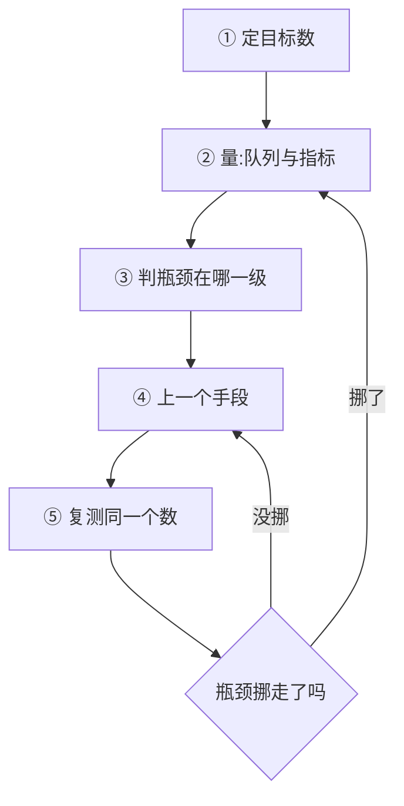

# 推理加速

一句话:本篇是**串讲篇**——**不讲任何一项技术的原理**(每一项都有自己的专篇),只回答那个没有哪一篇专篇能回答的问题:**给你一个真实的推理服务,你按什么顺序上手段?每一步的依据是什么?这些手段的收益怎么叠加、什么时候互相打架?**

阅读约定:下文每提到一项技术,都只给一句定位加一个篇名,机制细节一律去那一篇看。本章的目录导航由 00-总览 篇负责,本篇不做目录。

## 一、动手之前:先确定你要优化的是哪个数

三件事按顺序钉死,顺序错了后面全白做。

**第一件:这一轮要优化的是哪一个数。**「让推理快一点」不是一个可执行的目标。TTFT、TPOT、吞吐、成本是四个会互相打架的数(定义与口径见 推理服务指标 篇),而**几乎每个手段都只是在它们之间搬跷跷板**——不先钉死目标,你会在把 TPOT 压下去之后发现 TTFT 涨了,再把 TTFT 压回去,原地转圈两周。业务画像直接决定选哪个:对话类看 TTFT 与 ITL 的尾部,离线批量只看总吞吐,而 agent 场景一次任务串行几十轮生成、总延迟几乎全是「decode 步数 × TPOT」,那就死盯 TPOT。

**第二件:瓶颈落在哪一级。** 一条请求的时间就三段——排队、prefill、decode,外加一层「显存够不够」的硬约束。排查顺序是固定的:**先看队列,再看阶段,最后才看 kernel**。理由很实在:高并发下 TTFT 的大头是排队而不是 prefill 计算(见 推理服务指标 篇),此时把 prefill kernel 优化 20%,对 TTFT 几乎没有可见影响。怎么把时间量准、trace 上看什么,见 性能分析与Profiling 篇。

**第三件:确认瓶颈真的在 kernel 这一级之后,才轮到判 bound。** 访存受限就少搬字节,计算受限就提高算力利用——判据(算术强度、拐点、两个利用率)见 Roofline与Bound分析 篇,prefill 与 decode 各落在屋顶线哪一段、形状怎么塌缩,见 Prefill与Decode的矩阵形状 篇。**这一步跳过,后面所有手段都是抽奖。**

然后是本篇真正的骨架:这三件事不是做一遍就完,是一个**循环**。

为什么必须是循环而不是清单:**每上一个手段,瓶颈都会挪位置**。KV 量化把 decode 压下去,瓶颈就跑到 prefill;prefill 提上来,瓶颈就跑到排队;排队治好了,显存又先撑不住(这条链的一个完整算例,见 PD分离 篇第六节那道 2p2d 的瓶颈转移题)。所以每上完一个手段必须**回到第二步重测**,而不是接着往下打勾。这也是为什么专篇里读不到这条——每一篇只对着自己那一级说话,只有站在编排层才看得见瓶颈在动。

## 二、决策表:症状 → 先分清什么 → 该上什么手段

这张表是本篇的核心产出。用法是从左往右读,**第二列比第三列重要**——同一个症状底下常常是两种完全不同的病。

| 症状 | 先分清 | 按性价比顺序试的手段 | 去看哪篇 |
|---|---|---|---|
| **TTFT 高** | 空载时就高,还是只在高并发时高?看队列长度即可分开 | 空载高:提高前缀缓存命中、把 chunked prefill 的块调大或关掉、给 prefill 侧加 TP;并发高:限流、加副本、把 prefill 拆出去独立扩容 | 推理服务指标 / RadixAttention / 连续批处理 / PD分离 |
| **TPOT 高**(平均就慢) | 是每一步本身慢,还是 batch 被放得太大拖慢了每一步 | 权重量化 → fp8 KV → CUDA Graph(小 batch 才有用)→ 加大 TP;若是 batch 太大,反过来收紧并发上限 | 量化 / KVCache量化 / CudaGraph / 并行策略 |
| **ITL 有毛刺、尾延迟炸** | 毛刺周期性还是随机?有没有抢占/重算记录? | chunked prefill、限制同时在做的长 prefill 条数、留足 KV 水位线减少抢占抖动;根治靠 PD 分离 | 连续批处理 / 显存管理与OOM / PD分离 |
| **吞吐上不去** | 卡在 KV 容量、算力、还是调度没打满 | 先确认连续批处理 + 分页真的开着(第 0 档);再靠量化腾显存换更大 batch;最后加副本 | 连续批处理 / PagedAttention / 量化 / 并行策略 |
| **显存不够 / 跑一阵才 OOM** | 总量真不够、某一项估错、还是碎片 | 先把账列出来(权重 / 激活 / KV / 图池 / 碎片),对着最胖的那一项下手,别直接调水位线 | 显存管理与OOM / CudaGraph |
| **长上下文一来就崩** | 崩在 prefill 时间、KV 容量、还是 decode 的 KV 访存 | chunked prefill 稳住在跑请求 → fp8 KV + 前缀复用扩容 → 架构侧的 KV 压缩(预训练期就定死了,部署期改不了) | 连续批处理 / KVCache量化 / RadixAttention / KV共享注意力 |

读这张表的三条纪律:

- **「先分清」那一列决定成败。** TTFT 高在空载和高并发下是两个病:一个该优化 prefill,一个该加机器。拿治空载的手段去治排队,收益是零,而且你会得出「优化没用」的错误结论。
- **表里没有任何一行的答案是「写个更快的 kernel」。** 不是因为它没用,而是因为它上面每一档的收益都更大、代价都更小——排序依据见下一节。
- **一次只上一个手段,上完复测。** 同时上三个,收益就无法归因了;更糟的是其中一个可能是负收益,被另外两个盖住,于是它会一直留在生产里。

## 三、上手顺序:排序的依据是什么

顺序不是背出来的清单,是三个问题问出来的结果:

1. **它动不动模型的输出?** 不动的排前面。不动输出意味着不用做质量评估、出问题可以直接回滚,决策成本接近零。
2. **它动不动部署形态?** 只改配置的排在要改拓扑的前面。后者要动运维、动监控,故障域也跟着变。
3. **它的收益依赖负载画像吗?** 收益稳定的排前面;「低并发赚、高并发赔」这一类必须放到最后,因为它要求你先把真实负载摸清楚。

按这三问排,顺序自己就出来了:

| 档 | 代表手段 | 为什么排在这一档 | 什么时候它反而是零收益或负收益 |
|---|---|---|---|
| **0 · 止损** | 确认连续批处理 + 分页已开、并发与单步 token 预算没设得过小、显存水位线没设得过低、生产上没误开确定性模式 | 这些不算优化,是**把本来就该有的收益拿回来**,代价为零 | 唯一例外:RL 训推一致、审计复现确实需要 bit 级可复现时,确定性模式的吞吐损失是必须付的(见 连续批处理 篇) |
| **1 · 几乎白拿** | CUDA Graph、算子融合 / 编译、fp8 KV cache、前缀缓存、chunked prefill | 不改权重数值、只改配置;失效时最多是收益为零,极少变成负数 | CUDA Graph 在大 batch 与长 prefill 上收益趋近零;fp8 KV 在短上下文上可能被额外开销吃平;前缀缓存在没有共享前缀的流量上是纯亏;chunked prefill 会让长 prompt 的 TTFT 变差 |
| **2 · 要付精度代价** | 权重量化(W4A16 / W8A8)、激活量化、更低位宽的 KV | 收益大且确定(显存与带宽同时降),但**必须先有一套用你真正要部署的那类任务做的评估**——困惑度会骗人 | 小 batch decode 上 W8A8 收益有限(算力翻倍用不上);长上下文检索类任务对低位宽 KV 特别敏感 |
| **3 · 要改部署形态** | 调 TP 度、PD 分离、改 P/D 配比、多副本 | 收益来自「让两段各自最优」,但需要互联条件(NVLink / RDMA),并引入新的失败模式和一整组新参数 | 小集群、短 prompt 为主、跨机只有以太网时,PD 分离的传输开销吃掉收益;decode 侧 TP 的收益随并行度迅速递减 |
| **4 · 最后才动** | 投机解码、为瘦长形状定制 kernel | 收益强烈依赖负载与任务,工程与维护成本最高 | 高并发下投机解码直接是负收益;微基准上漂亮的 kernel 放回端到端常常缩水 |

表里每一项的机制与调参细节各去各家:分页与调度见 PagedAttention 和 连续批处理 篇,CUDA Graph 见 CudaGraph 篇,融合与编译见 算子融合 和 TorchCompile 篇,前缀缓存见 RadixAttention 篇,量化算法见 量化 与 权重与激活量化 篇,KV 侧见 KVCache量化 篇,投机解码见 投机解码 篇,瘦长形状的 kernel 见 GEMM优化 篇。

一条最容易被跳过的纪律:**第 0 档没做完,不要碰后面任何一档。** 最典型的顺序错误长这样——团队花两周做投机解码,上线后才发现前缀缓存一直没开,而那条业务八成的流量都由同一段 system prompt 打头,那两周本来只需要改一个开关。

## 四、手段之间怎么互相影响

这是本篇最有价值的一节:每一条都跨两个以上手段,所以哪个专篇都不会讲。

| 你上了 A | A 顺带改变了什么 | 于是 B 的结论变了 | 你该重做的动作 |
|---|---|---|---|
| **权重量化** | 每步搬的权重字节减半到减四分之三 | decode 的时间构成从「权重主导」往「**KV 主导**」迁移;bound 位置也右移(weight-only 才真迁移,W8A8 是整条屋顶线一起抬,见 Roofline与Bound分析 篇) | 重新量一遍时间构成:下一步该做的是 KV 侧(fp8 KV、前缀复用),继续压权重位宽收益递减 |
| **任何省显存的手段** | KV 额度变大,调度器于是收更多请求进来 | batch 变大 → 吞吐上升,**但 TPOT 可能不降反升** | 回到第一节确认目标数:要 TPOT 就得**主动**压住并发上限,别让省下的显存自动变成 batch |
| **CUDA Graph** | 形状必须按 batch 分档冻结 | 和 chunked prefill 的混合批对不上(每步的 M 由 decode 行数加上各 prefill 块的行数决定,不再只由 batch 决定);和每步现算 scale 的动态量化也对不上 | 要么只对纯 decode 步捕图、prefill 步走 eager,要么改用静态 scale;分档 padding 白算的那几行也要记进账 |
| **CUDA Graph** | 图池常驻显存且不可回收 | 而 KV 在显存账里是**残差项**,图池吃一块,KV 就少一块 → 并发上限下降 | 档位数与最大档位要和并发目标一起定,不是捕得越多越好(见 显存管理与OOM 篇) |
| **前缀缓存** | 命中时整段 prefill 被跳过,TTFT 大降 | 但缓存块占住显存,可用 KV 变少 → 并发上限下降;命中率低时是纯亏 | 按真实流量的前缀重复率定缓存池大小,并把这块显存正式记进账 |
| **chunked prefill** | 每步耗时变均匀,顺带把 decode 的 M 拼胖 | 长 prompt 的 TTFT 变差;块开太小,prefill 自己也退化成瘦长矩阵、白扔算力 | 如果业务只考核首字延迟,这个手段本来就该关掉 |
| **PD 分离** | 干扰消失,两端可各自选并行度与攒批策略 | 但多了一次 KV 传输;而且 **P 侧和 D 侧的最优 TP 度不同**,配比还要跟着流量画像走;P 侧的 chunked prefill 变得没必要 | 拆完要为两端**各重调一次**并行度和 batch 策略,不能沿用混合部署的参数 |
| **投机解码** | 用闲置算力换串行步数 | 大 batch 下算力已被打满,草稿从「白算」变成抢别人的算力 → 吞吐下降;draft 的权重与 KV 还要额外占显存 | 按并发动态开关:低并发开、猜测步数调大;高并发关掉或降到 1–2 |

把上表压成三条能背走的元规律:

**规律一:省下来的显存会自动变成 batch。** 于是系统沿吞吐-延迟曲线往吞吐那头滑——「省显存」和「降延迟」根本不是同一件事。量化腾出的空间如果被调度器拿去收更多请求,TPOT 可能一毫秒都没降。想要延迟,就得主动把省下来的显存**留着不用**。

**规律二:要求形状固定的手段,和要求形状灵活的手段天然对立。** CUDA Graph、静态量化、编译产物在一边;连续批处理、chunked prefill、动态量化在另一边。调和方式古今只有一种——**分档 + padding**,代价是白算几行。记住这条,就能预判「开了 A 之后 B 为什么突然不生效了」。

**规律三:靠吃闲置算力赚钱的手段,在算力被打满之后一律变成赔钱。** 投机解码、chunked prefill 的捎带,前提都是 decode 阶段算力大量闲置;大 batch 一上来,前提就没了。所以这类手段的开关**必须跟着并发走**,不能一次配死——同一套系统在高低两种负载下的最优配置是相反的。

## 五、TTFT 与 TPOT 的天平:每个手段往哪边挪

全局主线只有一条:**几乎每个手段都在这两个数之间搬跷跷板**。把方向记住,选型时就不用每次现推。

| 手段 | 对 TTFT | 对 TPOT | 方向为什么是这样 |
|---|---|---|---|
| 放宽并发 / 加大 batch | ⬇️ 改善(更快被收进批) | ⬆️ 变差 | 权重读取被摊薄,但每一步要算的活变多了 |
| 收紧并发 / 限流 | ⬆️ 变差(被挡住的请求等更久) | ⬇️ 改善 | 上一行反过来 |
| chunked prefill | ⬆️ 略差(切成 k 块要 k 步) | ⬇️ 明显改善 | 拿一点首字延迟换全局没有 stall |
| 前缀缓存命中 | ⬇️⬇️ 大幅改善 | 不变 | 省掉的是 prefill,decode 一分钱不省 |
| 权重量化 | ⬇️ 改善 | ⬇️ 改善 | 两个阶段都少搬字节,少见的双赢 |
| KV 量化 | 基本不变,满负载下甚至略差 | ⬇️ 改善 | D 侧变快后瓶颈转移到 P 侧,排队变长(见 PD分离 篇第六节) |
| 加大 TP 度 | ⬇️ 改善 | ⬇️ 改善但迅速递减 | decode 下通信量小,由小消息的固定延迟主导,并行度再大也省不掉 |
| CUDA Graph | 基本不变 | ⬇️ 改善(小 batch 明显) | 治的是 CPU 下发开销,prefill 那种大 kernel 用不上 |
| PD 分离 | 取决于 P/D 配比 | ⬇️ 明显改善 | 干扰消失,代价是一次 KV 传输 |
| 投机解码 | 不变 | 低并发 ⬇️ 改善 / 高并发 ⬆️ 变差 | 砍的是步数,不是每一步的耗时 |
| 加副本 | ⬇️ 改善 | 不变 | 只缩短排队,单实例的单步耗时一点没变 |

两条读法:

- **两边都改善的只有三个:权重量化、前缀缓存命中、加副本(以及换更快的卡)。** 其余全是搬跷跷板。所以听到「我们做了 N 项优化,延迟降了 X%」,第一句要追问的是**哪个延迟**——很可能另一个正在同时变差。
- **加副本只降排队那一项。** 它对「请求已经进了 batch 之后有多快」毫无帮助。这就是为什么单请求延迟必须靠 TP、量化、砍步数这些手段解决——水平扩展救不了它。

## 六、走一遍:一个 TPOT 超标的服务

> **题面**:7B 稠密模型的对话服务,单机 8 卡起了 8 个单卡副本。TPOT 的 P99 超了 SLO,吞吐指标还有富余。你怎么走?

**第 0 步,定目标数。** 超的是 TPOT,不是吞吐——所以任何「用 TPOT 换吞吐」的动作(放宽并发、加大 batch)从一开始就被排除,哪怕它能让吞吐报表更好看。这一步说出来才显得你知道自己在优化什么。

**第 1 步,先看队列。** 队列不长、TTFT 也正常 → 排除排队问题,瓶颈确实落在 decode 的每一步里。顺序不能反:队列一长,后面几步测出来的都是被排队污染的数。

**第 2 步,分清「每步都慢」还是「被毛刺拉高」。** 看 ITL 的分布而不是均值:P50 正常而 P99 炸,说明是长 prefill 打断在跑请求造成的 stall,该上 chunked prefill(第 1 档),优化每一步毫无用处;P50 本身就高,才进第 3 步。

**第 3 步,判 bound,上第 1 档。** decode 访存受限、batch 又不大 → CUDA Graph 消掉下发开销,fp8 KV 减少每步要读的字节。两个都是不动输出的配置项,复测一次。

**第 4 步,瓶颈挪了吗?挪了。** KV 压小之后,每步时间构成里权重占比升高;更要命的是省出来的显存被调度器拿去收了更多请求,batch 变大,把 TPOT 的改善吃掉一部分——这正是规律一。动作是**先把并发上限压回原值**,让省下的显存空着,再复测 TPOT。

**第 5 步,还不够就进第 2、3 档。** 先做权重量化(第五节表里两边都改善的那三个之一);仍不够,就把 8 个单卡副本改成 4 个 TP=2 的副本,decode 每卡只搬一半权重,TPOT 直接下来。代价是副本数减半、每层多两次 all-reduce,**总吞吐大致持平甚至略降**——到这一步已经在拿吞吐换延迟了,所以必须回到第 0 步确认这笔交换是业务愿意做的。

**第 6 步,收手的时机。** 见下一节:如果 TP=2 之后单步已经贴住「把权重和 KV 各搬一遍」的下界,继续加 TP 只会被小消息的固定延迟吃掉,这时候该讨论的是换一张带宽更大的卡,而不是继续调参。

这道题真正考的不是手段清单,而是**每一步的动作都由上一步的测量结果决定**,以及**每上一个手段之后都回头确认瓶颈挪到哪儿去了**。

## 七、什么时候该停:别再抠了,该加卡了

三条停止线,命中任一条就不该再往下抠:

**一、已经贴住物理下界。** decode 单步的时间下界就是「把权重和这一批的 KV 各搬一遍要多久」(定量见 Prefill与Decode的矩阵形状 篇)。实测已经贴到下界八九成时,剩下能做的只有两件:**改分子**(继续压位宽、换 KV 更省的架构)或**改分母**(换带宽更大的卡、加 TP 摊访存)。继续在 kernel 上抠,抠的是剩下那一成。

**二、剩下的手段全要拿质量换。** 当清单上只剩「再压一档位宽」「砍上下文长度」「调低采样质量」时,先算另一笔账:一张卡的月成本,和一次线上质量事故的成本,通常不在一个量级。**这时候它已经是成本题,不是技术题了。**

**三、利用率已经贴近 1。** 排队等待随利用率发散(那条关系见 PD分离 篇第六节),此时单步优化省下的几毫秒会被排队立刻吃掉,唯一有效的动作是**加副本或限流**,把利用率拉回明显低于 1 的区间(容量规划的余量口径见 推理服务指标 篇)。这也是最常见的误判:告警显示延迟涨了,工程师去优化 kernel,而真正发生的事情是流量涨了三成。

**加卡还是换卡,取决于你要的是哪个数**:要吞吐就加副本(推理侧副本之间零通信,近似线性扩展,见 并行策略 篇第十节);要单请求延迟就换带宽更大的卡,或者加 TP 度摊薄每卡的访存。一句话收尾:**能被水平扩展解决的问题,别用手写 kernel 解决;而单请求延迟恰恰是水平扩展救不了的,那才是值得深挖的地方。**

## 面试考点串联

| 高频问法 | 本文哪一节 |
|---|---|
| 线上 TPOT 偏高,你按什么顺序排查和优化? | 六(完整走一遍)+ 一(先定目标数、先看队列)+ 二(决策表第 2、3 行) |
| TTFT 高,你怎么判断是该优化 prefill 还是该加机器? | 二(空载 vs 高并发是两个病)+ 七(利用率贴近 1 那条停止线) |
| 这么多加速手段,你会按什么顺序上?排序的依据是什么? | 三(三问 + 五档表) |
| 量化上完之后,你会重新检查哪些结论? | 四(时间构成迁向 KV 主导、bound 位置、省下的显存变成 batch)+ 五 |
| 哪些优化手段会互相打架? | 四(影响表 + 三条元规律) |
| 某个手段把 TPOT 压下去了,TTFT 会怎么变? | 五(跷跷板表)+ 一(瓶颈会挪位置,所以要复测) |
| 前缀缓存开大了,并发反而掉了,怎么回事? | 四(缓存块占住显存,而 KV 在账里是残差项) |
| 优化到什么程度你会说「别调了,加卡吧」? | 七(三条停止线;加副本 vs 换卡怎么选) |

> 本表按出题标准自拟,非面经原题。

延伸阅读顺序:推理服务指标(先会看数)→ Roofline与Bound分析 + Prefill与Decode的矩阵形状(会判瓶颈)→ 本篇(会排顺序)→ 各单项专篇(会做具体那一件事)。

## 相关文献

- Efficiently Scaling Transformer Inference(推理的解析成本模型与延迟-吞吐 Pareto 前沿)— [arXiv:2211.05102](https://arxiv.org/abs/2211.05102)
- LLM Inference Unveiled: Survey and Roofline Model Insights(用统一的 Roofline 视角评估各类加速手段)— [arXiv:2402.16363](https://arxiv.org/abs/2402.16363)
- A Survey on Efficient Inference for Large Language Models(数据 / 模型 / 系统三层的手段分类)— [arXiv:2404.14294](https://arxiv.org/abs/2404.14294)
- Taming Throughput-Latency Tradeoff in LLM Inference with Sarathi-Serve(吞吐-延迟取舍与 chunked prefill 的调度)— [arXiv:2403.02310](https://arxiv.org/abs/2403.02310)
- DistServe: Disaggregating Prefill and Decoding for Goodput-optimized Large Language Model Serving(把二维取舍塌缩成 goodput 一个可最大化的数)— [arXiv:2401.09670](https://arxiv.org/abs/2401.09670)
- Efficient Memory Management for Large Language Model Serving with PagedAttention(连续批 + 分页这套地基的出处)— [arXiv:2309.06180](https://arxiv.org/abs/2309.06180)
- vLLM 文档 — Optimization and Tuning(并发上限、显存水位线、图档位这些旋钮的官方口径)— https://docs.vllm.ai/en/stable/configuration/optimization/
