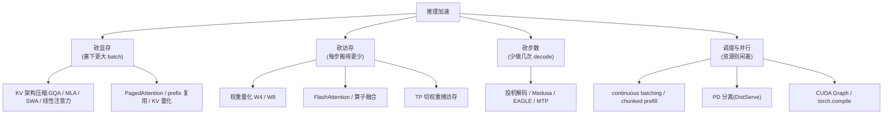

# 推理加速总览

> ⚠️ 旧版:本篇写于写作契约确立之前,尚未按新标准审查重写。标准见 docs/04-知识库写作契约.md,样板见「GPU架构与执行模型」。

一句话:**推理分 prefill 与 decode 两个阶段,瓶颈完全不同**——prefill 一次并行算整段 prompt,是算力受限;decode 每步只产 1 个 token 却要搬全部权重和 KV cache,是带宽受限。一切加速技术都是对着其中一个瓶颈下手;判断一项技术"到底加速了什么",先问它砍的是哪个阶段的哪种资源。

## 一、瓶颈分析:先建立 roofline 直觉

GPU 有两个天花板:算力峰值(FLOP/s)与显存带宽(bytes/s)。一个 kernel 撞哪个天花板,由**算术强度**决定——每从显存搬 1 字节,能做多少次浮点运算:

$$
\text{算术强度} = \frac{\text{FLOPs}}{\text{访存字节}}
$$

强度高于硬件平衡点(如 A100 bf16 约 312 TFLOPS / 2 TB/s ≈ 156)是 compute-bound,加速靠省计算;低于平衡点是 memory-bound,算力再强也在等数据,加速要靠**少搬数据**。

> 🖼️ 占位:roofline 曲线示意——横轴算术强度、纵轴可达性能,左侧斜线(带宽顶)标 decode,右侧平台(算力顶)标 prefill

### prefill:compute-bound

整段 prompt 的所有 token 并行过一遍网络,矩阵乘的"批"维度是成百上千个 token——权重搬一次,服务上千个 token 的计算,GEMM 又大又规整,算术强度轻松越过平衡点。prefill 时间随 prompt 长度近似线性增长(attention 部分平方),它决定 **TTFT**(首 token 延迟)。

### decode:memory-bound

每生成一个 token,都要把**全部权重 + 本序列全部 KV cache** 从 HBM 搬进计算单元,却只做一个 token 的计算。以一个 $d_{in} \times d_{out}$ 的 fp16 权重矩阵为例,batch 为 $B$ 时:

$$
\text{强度} \approx \frac{2 \cdot B \cdot d_{in} \cdot d_{out}}{2 \cdot d_{in} \cdot d_{out}} = B
$$

(分子是乘加 FLOPs,分母是权重字节数。)$B=1$ 时强度只有 1,离平衡点差两个数量级——**GPU 绝大部分时间在搬运,不在计算**。类比:decode 像为了抄一行字,把整座图书馆的书搬出来翻一遍,抄完放回去,下一行再搬一遍。

这个公式同时解释了 **batch 的作用**:权重只搬一次、服务 $B$ 个序列各自的 1 个 token,强度随 $B$ 线性上升——同一趟卡车多装几个包裹,运费摊薄,所以加大 batch 几乎"白赚"吞吐(直到逼近平衡点或 KV cache 塞爆显存)。但注意 KV cache 是每个序列**私有**的,batch 摊不掉这部分访存——序列一长,读 KV 反而成为 decode 最大的访存项。

## 二、技术地图

按"砍什么"把所有技术归成四支:

注意 KV cache 类技术"一鱼两吃":KV 变小既省显存(塞更大 batch → 吞吐),又省 decode 每步访存(→ TPOT)。权重量化同理,见量化篇。

## 三、砍 KV cache

KV cache 是 decode 的双重瓶颈:容量上占显存大头、带宽上每步都要全量读一遍(显存公式见 KVCache 篇)。砍它有两条路:

**架构侧(预训练时就定死)**:

- **GQA**:多个 query 头共享一组 KV 头,KV 体积直接除以分组数;
- **MLA**:把 KV 低秩压缩成一个小 latent,只缓存 latent 而非完整 KV;
- **SWA**:滑动窗口只保留最近 W 个 token 的 KV,长度封顶;
- **线性注意力**:把全部历史压成定长状态,KV cache 彻底变 O(1)。

机制细节见预训练分类的 GQA、MLA、SWA、线性注意力各篇——它们是预训练阶段的架构选择,但买单动机大半在推理侧。

**系统侧(部署时可选)**:

- **PagedAttention**:分页管理消灭碎片,KV 显存利用率从 20-40% 拉到 90%+,见 PagedAttention 篇;
- **KV 量化**:用 fp8 / int8 存 KV,体积减半再减半,见量化篇;
- **prefix 复用**:公共前缀(system prompt、few-shot、多轮历史)只算一次、存一份,见 RadixAttention 篇。

## 四、砍步数:投机解码家族

decode 慢的根源是**串行**:一步一个 token,一千个 token 就要搬一千遍权重。而第一节说过,decode 时算力大量闲置——让大模型一次前向并行验证 k 个 token,耗时与生成 1 个 token 几乎一样(权重还是只搬那一遍)。投机解码就是拿这份闲置算力换步数:

1. **起草**:小 draft 模型自回归猜 $\gamma$ 个 token(它小,搬得快);
2. **验证**:大模型一次前向,并行给这 $\gamma$ 个位置打分;
3. **接受/回退**:从头逐个核对,接受到第一个分歧点为止,再从大模型分布重采一个,进入下一轮。

类比:学徒先写整页草稿,老师傅一眼扫过批改——老师傅"看一页"和"亲笔写一个字"耗时差不多,因为他的瓶颈在翻出工具(搬权重),不在动笔(计算)。

**数学上无损**:draft 提议 token $x$ 以 $\min(1, p(x)/q(x))$ 概率接受($p$ 为大模型、$q$ 为 draft 分布),拒绝时从归一化残差 $\max(0, p-q)$ 重采。可以证明最终输出分布与大模型逐 token 采样**完全相同**——精度一分不丢,这是它与量化、剪枝最本质的区别。

**加速比由接受率决定**:设逐 token 接受率 $\alpha$(近似独立),每轮期望产出

$$
\mathbb{E}[\text{每轮 token 数}] = \frac{1 - \alpha^{\gamma+1}}{1 - \alpha}
$$

再扣掉 draft 自身的开销才是净加速。draft 与大模型分布越接近、文本越"好猜"(代码、模板化输出),加速越高,典型 2-3x。

家族演进的主线是 **draft 从哪来**:

| 方案 | draft 来源 | 特点 |
| --- | --- | --- |
| 经典投机解码 | 独立小模型 | 需要一个词表一致、分布对齐的小模型,不一定现成 |
| Medusa | 目标模型上加多个解码头 | 免独立模型;各头分别猜 +1/+2/… 位置,树状候选并行验证;常配"典型接受",严格说非无损 |
| EAGLE | 特征级自回归 draft 头 | 在 LM head 之前的隐层特征上做自回归,并喂入上一步已采样的 token 消除不确定性,复用目标模型 LM head;比 Medusa 准得多,约 3x 且无损 |
| MTP | 训练时自带多 token 预测头 | 预训练顺手练出 draft 能力,推理时免费当草稿用,见 MTP 篇 |

## 五、调度与 batch

- **continuous batching**:调度粒度细到单个 decode step,完成即走、新请求即补,GPU 不空转——推理引擎的地基,见 连续批处理 篇;
- **chunked prefill**:一条几万 token 的长 prompt 若一口气 prefill,会独占 GPU 几百毫秒——在跑请求集体卡顿、排队请求 TTFT 出现尖刺。把它切成小块,每块与其他请求的 decode step 混进同一批:compute-bound 的 prefill 块和 memory-bound 的 decode 恰好互补,算力与带宽同时吃满。类比:不让超长货车独占整条高速,拆成几截与小客车混行;
- **PD 分离**:prefill 与 decode 的资源画像完全相反(吃算力 vs 吃带宽),SLA 也各管各(TTFT vs TPOT),同池混跑必然互相干扰、扩容与并行策略互相掣肘。DistServe 把两阶段拆进**不同 GPU 池**:prefill 池按 TTFT 配置,decode 池按 TPOT 配置,各自独立扩缩容、独立选并行方案,prefill 算完把 KV cache 传给 decode 池接力(代价:需要 NVLink / RDMA 级互联)。类比:餐厅把猛火爆炒(prefill)与流水传菜(decode)分成两班人马,各按各的忙闲配人,不再抢同一个灶台。goodput 显著提升,已成大规模 serving 标配。

## 六、kernel 与编译

- **FlashAttention**:朴素 attention 把 $N \times N$ 分数矩阵写到 HBM、读回来做 softmax、再写读一遍乘 V——瓶颈是这 $O(N^2)$ 的显存读写,不是 FLOPs。FA 把 Q/K/V 切块搬进 SRAM,片上用 online softmax 边算边归一化,**从不实体化 $N \times N$ 矩阵**;反向传播不存注意力矩阵,用重算代替。IO-aware 的典范:多算了(重算)反而更快,因为省了搬运。类比:在小案板上分批切菜、切完直接下锅,而不是把全部食材摊满仓库地板再来回搬;
- **FlashAttention-2**:重排循环与并行划分(沿序列维度切并行、减少非 matmul 运算与 warp 间通信),利用率进一步逼近纯 GEMM;
- **CUDA Graph**:decode 每步由几百个小 kernel 组成,CPU 逐个 launch 的开销(每个几微秒)在小 batch 时占比可观;把整步录制成图、一次提交,launch 开销归零。类比:子弹装进弹匣一次打完,不再一发一装;
- **torch.compile / 算子融合**:相邻的逐元素小算子(残差加、norm、激活)各自读写一遍 HBM;融合成一个 kernel 后,中间结果留在寄存器/SRAM 不落显存。对 memory-bound 的 decode,融合就是直接砍访存。

## 七、并行推理

- **TP(张量并行)**:权重切到 N 张卡,decode 每步每卡只搬 1/N 权重,访存时间近似降为 1/N——**多卡是能降单请求延迟的**,代价是每层两次 all-reduce,要求 NVLink 级互联。机制见并行策略篇;
- **多副本 / EP**:复制整套实例(或 MoE 专家并行)扩的是 batch 容量,提升吞吐而非单请求延迟。

一句话:延迟靠 TP 摊访存,吞吐靠副本堆 batch。

## 八、指标与权衡

四个指标(定义与类比见 推理服务指标 篇):**TTFT** 看 prefill,**TPOT** 看 decode 每步,**吞吐**看总产能,**goodput** 看 SLO 内的有效产能。

关键思维是**延迟-吞吐 tradeoff 曲线**:batch 加大,吞吐上升,但每步变慢、排队变长,单请求延迟上升——每个系统是曲线上的一段,不是一个点。比较系统必须同 SLO 下比 goodput,"吞吐高 50%"若延迟超标毫无意义。多数加速技术的本质是把整条曲线往外推,而调度类技术(chunked prefill、PD 分离)是让你在曲线上站到更好的点。

**agent 场景改写了优先级**:一次任务串行几十轮生成、每轮成百上千步 decode,prefix 缓存命中后 prefill 占比很小,总延迟 ≈ decode 步数 × TPOT。砍步数成了大幅降延迟的唯一杠杆——这正是投机解码与 MTP 近两年爆火的背景。

## 九、面试考点串联

1. prefill / decode 瓶颈为何不同 →「一」:算术强度——一个摊薄了权重访存,一个没有
2. batch 为什么能白赚吞吐、为什么救不了单请求延迟 →「一 + 八」
3. KV cache 为什么是双重瓶颈、砍它的两条路 →「三」
4. 投机解码为什么无损、加速比由什么决定 →「四」:拒绝采样 + 接受率公式
5. Medusa / EAGLE / MTP 的 draft 各从哪来 →「四」对比表
6. chunked prefill 解决什么问题 →「五」:长 prefill 独占 GPU 造成的延迟尖刺
7. PD 分离的动机 →「五」:资源画像相反、SLA 各管各
8. FlashAttention 核心思想 →「六」:省的是 HBM 读写,不是 FLOPs

## 相关文献

- FlashAttention(IO-aware 精确注意力)— [arXiv:2205.14135](https://arxiv.org/abs/2205.14135)
- FlashAttention-2(并行与调度改进)— [arXiv:2307.08691](https://arxiv.org/abs/2307.08691)
- Fast Inference from Transformers via Speculative Decoding(投机解码)— [arXiv:2211.17192](https://arxiv.org/abs/2211.17192)
- Medusa(多解码头 + 树注意力)— [arXiv:2401.10774](https://arxiv.org/abs/2401.10774)
- EAGLE(特征级自回归 draft)— [arXiv:2401.15077](https://arxiv.org/abs/2401.15077)
- DistServe(PD 分离,goodput 优化)— [arXiv:2401.09670](https://arxiv.org/abs/2401.09670)
- vLLM / PagedAttention — [arXiv:2309.06180](https://arxiv.org/abs/2309.06180)
